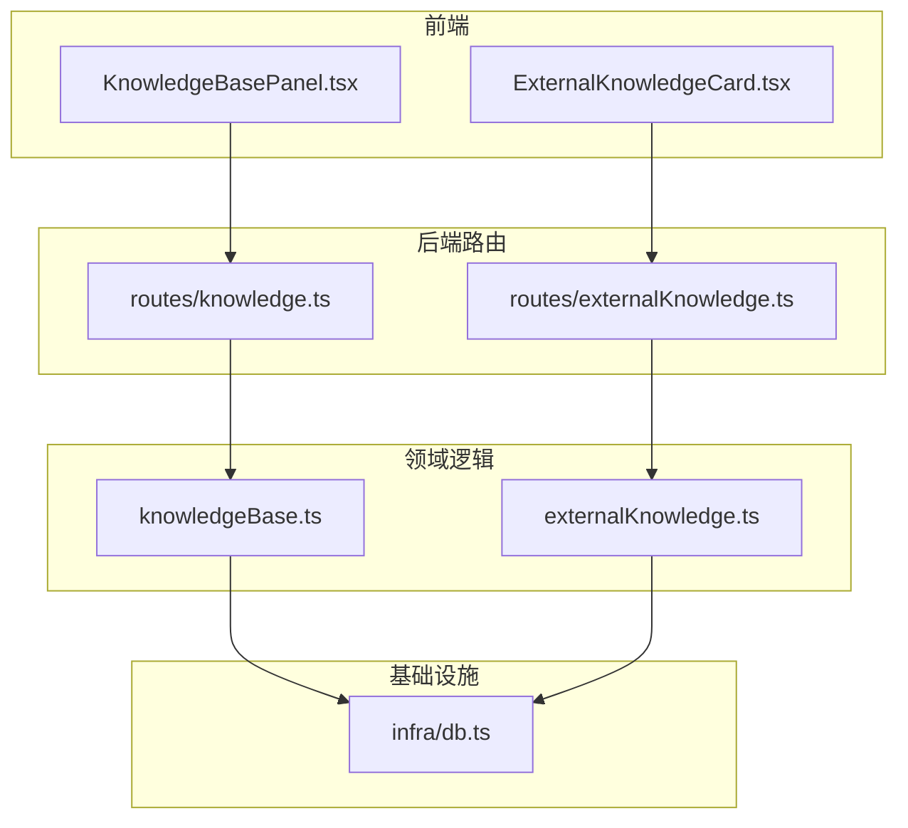
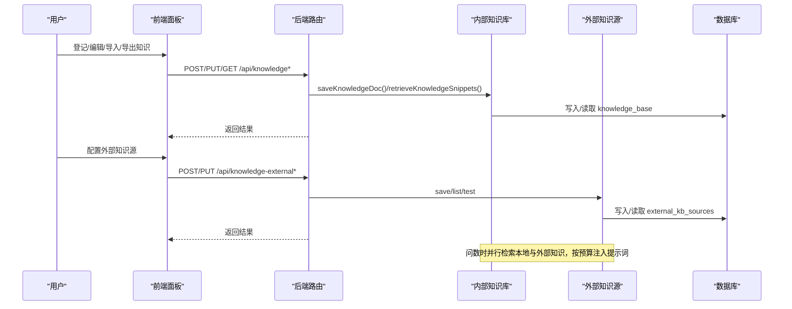
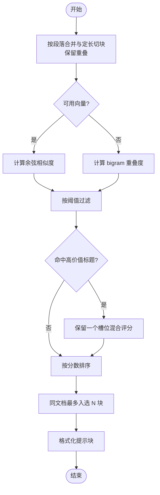
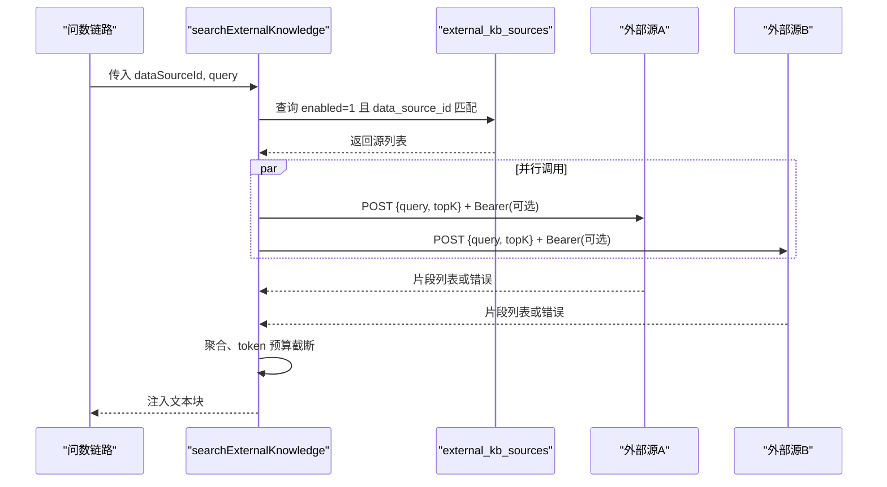
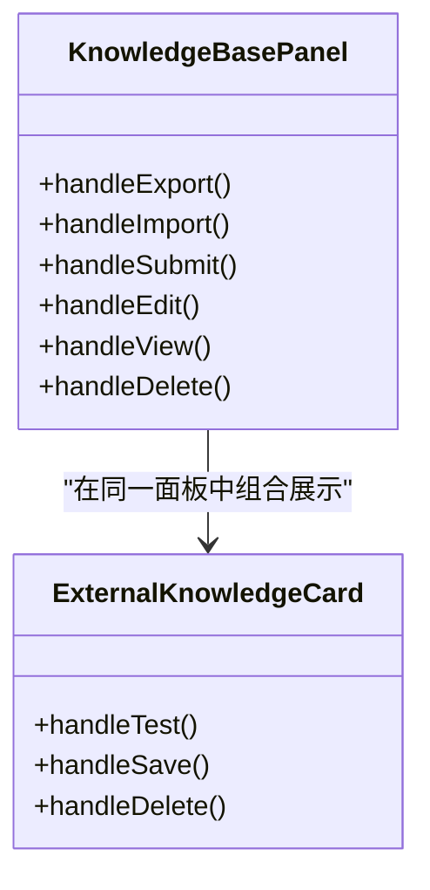
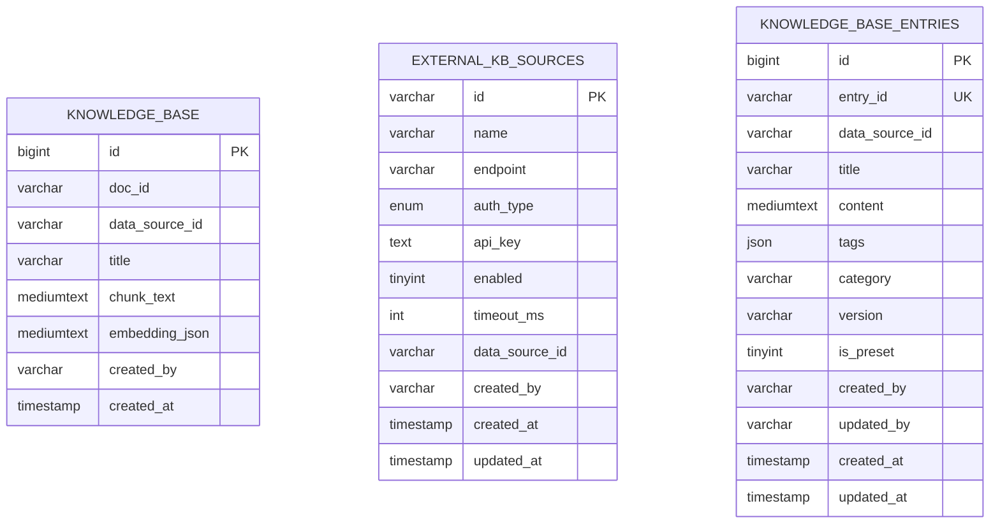
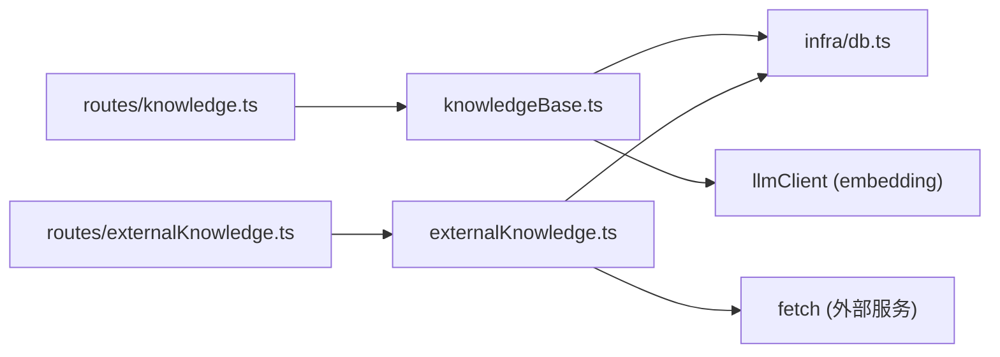

# 知识库系统

<cite>
**本文引用的文件**
- [server/knowledge/knowledgeBase.ts](file://server/knowledge/knowledgeBase.ts)
- [server/knowledge/externalKnowledge.ts](file://server/knowledge/externalKnowledge.ts)
- [server/routes/knowledge.ts](file://server/routes/knowledge.ts)
- [server/routes/externalKnowledge.ts](file://server/routes/externalKnowledge.ts)
- [src/components/datasource/KnowledgeBasePanel.tsx](file://src/components/datasource/KnowledgeBasePanel.tsx)
- [src/components/datasource/ExternalKnowledgeCard.tsx](file://src/components/datasource/ExternalKnowledgeCard.tsx)
- [server/infra/db.ts](file://server/infra/db.ts)
</cite>

## 目录
1. [简介](#简介)
2. [项目结构](#项目结构)
3. [核心组件](#核心组件)
4. [架构总览](#架构总览)
5. [详细组件分析](#详细组件分析)
6. [依赖关系分析](#依赖关系分析)
7. [性能考虑](#性能考虑)
8. [故障排查指南](#故障排查指南)
9. [结论](#结论)
10. [附录](#附录)

## 简介
本知识库系统为智能问数据分析系统提供企业级 RAG（检索增强生成）能力，覆盖内部知识管理与外部知识源集成两大方面：
- 内部知识库：支持知识条目的创建、编辑、删除、批量导入导出；按段落与定长切块，生成向量嵌入并存储；问数时基于相似度阈值召回相关片段注入提示词。
- 外部知识源：管理员配置企业外部 RAG/知识服务接口（HTTP + Bearer），问数时并行检索并按 token 预算截断后注入；任何单源异常均降级为空结果，不阻断主链路。
- 语义搜索：采用向量余弦相似度为主、bigram 关键词为降级的混合检索策略，支持高价值文档优先保留槽位与每文档最多入选块数限制。
- 数据持久化：MySQL 存储知识切块、外部源配置等；启动时自动建库建表。
- 权限与安全：写操作需 ADMIN；外部密钥加密存储；列表不出明文。

## 项目结构
知识库系统由“服务端路由层 + 领域逻辑层 + 前端面板”组成，数据库在应用启动时初始化。

图表来源
- [server/routes/knowledge.ts:1-457](file://server/routes/knowledge.ts#L1-L457)
- [server/routes/externalKnowledge.ts:1-85](file://server/routes/externalKnowledge.ts#L1-L85)
- [server/knowledge/knowledgeBase.ts:1-239](file://server/knowledge/knowledgeBase.ts#L1-L239)
- [server/knowledge/externalKnowledge.ts:1-273](file://server/knowledge/externalKnowledge.ts#L1-L273)
- [server/infra/db.ts:300-336](file://server/infra/db.ts#L300-L336)

章节来源
- [server/routes/knowledge.ts:1-457](file://server/routes/knowledge.ts#L1-L457)
- [server/routes/externalKnowledge.ts:1-85](file://server/routes/externalKnowledge.ts#L1-L85)
- [server/knowledge/knowledgeBase.ts:1-239](file://server/knowledge/knowledgeBase.ts#L1-L239)
- [server/knowledge/externalKnowledge.ts:1-273](file://server/knowledge/externalKnowledge.ts#L1-L273)
- [server/infra/db.ts:300-336](file://server/infra/db.ts#L300-L336)

## 核心组件
- 内部知识库（RAG）
  - 切块与嵌入：按段落合并至固定长度，相邻块重叠防止语义截断；批量调用 embedding 模型生成向量，失败则置空走关键词降级。
  - 检索排序：向量模式使用余弦相似度并设置最低相关性阈值；bigram 模式作为降级；同一文档最多入选若干块；高价值标题关键词优先保留一个槽位。
  - 注入格式：将命中片段拼接为强指令式提示块，约束 SQL 生成的业务口径与术语。
- 外部知识源
  - 协议约定：POST JSON {query, topK}，可选 Bearer 认证；响应兼容多种容器字段与文本字段。
  - 并行检索：按启用状态与数据源范围查询所有适用源，并行调用，任一失败不影响其他源；结果按 token 预算截断后注入。
  - 安全存储：API Key 以 AES 加密落库；列表仅返回是否已有关键字标记。
- 管理路由与前端面板
  - 内部知识：CRUD、详情查看、导入导出（JSON 备份）、冲突处理策略（跳过/覆盖/追加）。
  - 外部知识：新增/编辑/删除/测试连通性；生效范围可按数据源限定。

章节来源
- [server/knowledge/knowledgeBase.ts:43-166](file://server/knowledge/knowledgeBase.ts#L43-L166)
- [server/knowledge/externalKnowledge.ts:62-196](file://server/knowledge/externalKnowledge.ts#L62-L196)
- [server/routes/knowledge.ts:69-457](file://server/routes/knowledge.ts#L69-L457)
- [server/routes/externalKnowledge.ts:19-85](file://server/routes/externalKnowledge.ts#L19-L85)
- [src/components/datasource/KnowledgeBasePanel.tsx:65-427](file://src/components/datasource/KnowledgeBasePanel.tsx#L65-L427)
- [src/components/datasource/ExternalKnowledgeCard.tsx:119-182](file://src/components/datasource/ExternalKnowledgeCard.tsx#L119-L182)

## 架构总览
知识库系统围绕“入库—检索—注入”的闭环构建，同时兼顾可观测性与容错性。

图表来源
- [server/routes/knowledge.ts:93-457](file://server/routes/knowledge.ts#L93-L457)
- [server/routes/externalKnowledge.ts:19-85](file://server/routes/externalKnowledge.ts#L19-L85)
- [server/knowledge/knowledgeBase.ts:170-239](file://server/knowledge/knowledgeBase.ts#L170-L239)
- [server/knowledge/externalKnowledge.ts:149-196](file://server/knowledge/externalKnowledge.ts#L149-L196)
- [server/infra/db.ts:300-336](file://server/infra/db.ts#L300-L336)

## 详细组件分析

### 内部知识库（RAG）
- 切块算法
  - 先按换行分段，逐段合并到 chunkSize；超长块按步长滑动切分；相邻块保留 overlap 字符，避免语义被截断。
  - 复杂度：O(N) 线性扫描与拼接。
- 相似度计算与阈值
  - 向量模式：余弦相似度；低于 KNOWLEDGE_MIN_SCORE（默认 0.35）视为无关不注入。
  - 降级模式：bigram 重叠度，量纲不同，维持 score>0 过滤。
- 排序与去重
  - 同文档最多入选 MAX_CHUNKS_PER_DOC 个块；高价值标题关键词（如“口径”“指南”）至少保留一个槽位，采用向量分+归一 bigram 混合评分择优。
- 提示注入
  - 将命中片段拼接为强指令式提示块，明确约束业务口径、术语与枚举写法，禁止自行编造。

图表来源
- [server/knowledge/knowledgeBase.ts:43-166](file://server/knowledge/knowledgeBase.ts#L43-L166)

章节来源
- [server/knowledge/knowledgeBase.ts:43-166](file://server/knowledge/knowledgeBase.ts#L43-L166)

### 外部知识源集成
- 配置校验
  - endpoint 必须 http(s)；超时 500~30000ms；bearer 认证需填写 apiKey。
- 请求与响应
  - 请求：POST JSON {query, topK}；可选 Authorization: Bearer <apiKey>。
  - 响应：兼容 results/documents/data/items 数组；每项取 content/text/chunk/pageContent 之一；source/title 可选用于标注来源。
- 并行检索与降级
  - 查询启用且适用于当前数据源的源，并行调用；任一失败不计入成功计数且不阻断其他源；结果按 token 预算截断后注入。
- 安全存储
  - API Key 加密落库；列表仅返回 hasKey 标记；编辑时留空保留原密钥，改为 none 清空密钥。

图表来源
- [server/knowledge/externalKnowledge.ts:149-196](file://server/knowledge/externalKnowledge.ts#L149-L196)
- [server/knowledge/externalKnowledge.ts:110-135](file://server/knowledge/externalKnowledge.ts#L110-L135)

章节来源
- [server/knowledge/externalKnowledge.ts:62-196](file://server/knowledge/externalKnowledge.ts#L62-L196)

### 管理路由与前端面板
- 内部知识
  - 列出某数据源的知识文档（按 doc 聚合）；登记/编辑/删除（ADMIN）；详情查看（含切块明细）；导入导出（JSON 备份，支持 skip/overwrite/append 冲突策略与 dryRun）。
- 外部知识
  - 新增/编辑/删除外部源；连通性测试（不落库）；生效范围可按数据源限定；列表不泄露密钥明文。
- 前端交互
  - 知识库面板：选择数据源、登记/编辑/删除、查看详情、导入导出；外部知识卡片：接入外部源、测试连接、保存修改。

图表来源
- [src/components/datasource/KnowledgeBasePanel.tsx:65-427](file://src/components/datasource/KnowledgeBasePanel.tsx#L65-L427)
- [src/components/datasource/ExternalKnowledgeCard.tsx:119-182](file://src/components/datasource/ExternalKnowledgeCard.tsx#L119-L182)

章节来源
- [server/routes/knowledge.ts:69-457](file://server/routes/knowledge.ts#L69-L457)
- [server/routes/externalKnowledge.ts:19-85](file://server/routes/externalKnowledge.ts#L19-L85)
- [src/components/datasource/KnowledgeBasePanel.tsx:65-427](file://src/components/datasource/KnowledgeBasePanel.tsx#L65-L427)
- [src/components/datasource/ExternalKnowledgeCard.tsx:119-182](file://src/components/datasource/ExternalKnowledgeCard.tsx#L119-L182)

### 数据模型与持久化
- 内部知识表
  - knowledge_base：doc_id、data_source_id、title、chunk_text、embedding_json、created_by、created_at；索引包含 data_source_id 与 doc_id。
- 外部源表
  - external_kb_sources：id、name、endpoint、auth_type、api_key（加密）、enabled、timeout_ms、data_source_id、created_by、时间戳。
- 条目模型（种子展示）
  - knowledge_base_entries：entry_id、data_source_id、title、content、tags、category、version、is_preset、created_by、updated_by、时间戳。

图表来源
- [server/infra/db.ts:300-336](file://server/infra/db.ts#L300-L336)
- [server/infra/db.ts:710-740](file://server/infra/db.ts#L710-L740)

章节来源
- [server/infra/db.ts:300-336](file://server/infra/db.ts#L300-L336)
- [server/infra/db.ts:710-740](file://server/infra/db.ts#L710-L740)

## 依赖关系分析
- 模块耦合
  - routes/knowledge.ts 依赖 knowledgeBase.ts 进行切块、嵌入与检索；routes/externalKnowledge.ts 依赖 externalKnowledge.ts 进行外部源 CRUD 与检索。
  - 两者均通过 infra/db.ts 获取数据库连接池，统一持久化。
- 外部依赖
  - LLM 客户端：callEmbedding/callEmbeddingBatch 用于向量生成；若不可用则降级为 bigram。
  - 网络：外部知识源通过 fetch 调用，支持超时中断与错误降级。
- 潜在循环依赖
  - 当前结构清晰分层，未见循环依赖迹象。

图表来源
- [server/routes/knowledge.ts:1-457](file://server/routes/knowledge.ts#L1-L457)
- [server/routes/externalKnowledge.ts:1-85](file://server/routes/externalKnowledge.ts#L1-L85)
- [server/knowledge/knowledgeBase.ts:1-239](file://server/knowledge/knowledgeBase.ts#L1-L239)
- [server/knowledge/externalKnowledge.ts:1-273](file://server/knowledge/externalKnowledge.ts#L1-L273)
- [server/infra/db.ts:1-200](file://server/infra/db.ts#L1-L200)

章节来源
- [server/routes/knowledge.ts:1-457](file://server/routes/knowledge.ts#L1-L457)
- [server/routes/externalKnowledge.ts:1-85](file://server/routes/externalKnowledge.ts#L1-L85)
- [server/knowledge/knowledgeBase.ts:1-239](file://server/knowledge/knowledgeBase.ts#L1-L239)
- [server/knowledge/externalKnowledge.ts:1-273](file://server/knowledge/externalKnowledge.ts#L1-L273)
- [server/infra/db.ts:1-200](file://server/infra/db.ts#L1-L200)

## 性能考虑
- 切块与嵌入
  - 批量 embedding 减少往返次数；失败整体降级为关键词检索，保障可用性。
  - CHUNK_SIZE 与 CHUNK_OVERLAP 平衡上下文长度与语义完整性。
- 检索优化
  - 向量模式设置最小相似度阈值，避免无关知识稀释注意力。
  - 同文档最多入选块数与高价值关键词优先保留槽位，提升命中率与稳定性。
- 外部源并发
  - 并行检索多个外部源，任一失败不阻断；超时控制避免长尾阻塞。
  - 结果按 token 预算截断，控制注入大小。
- 数据库
  - 连接池容量公式化，适应并发规模；索引覆盖常用查询路径。

[本节为通用性能建议，无需特定文件引用]

## 故障排查指南
- 外部源连通性问题
  - 使用“测试连接”接口验证 endpoint、认证与超时；检查 HTTP 状态码与响应体结构是否符合预期。
  - 常见错误：非 2xx 响应、超时 AbortError、解析不到片段。
- 向量不可用时的降级
  - 若 embedding 服务不可用，系统将回退到 bigram 关键词检索；确认阈值与权重参数合理。
- 导入导出问题
  - 文件格式识别失败：确保包含 docs 或 knowledgeBase 字段；目标数据源存在；冲突策略正确选择。
  - 内容为空无法切块：检查内容是否为空白字符串。
- 权限与认证
  - 写操作需 ADMIN；外部源列表不泄露密钥明文；编辑时留空保留原密钥，改 none 清空密钥。

章节来源
- [server/knowledge/externalKnowledge.ts:110-135](file://server/knowledge/externalKnowledge.ts#L110-L135)
- [server/knowledge/externalKnowledge.ts:149-196](file://server/knowledge/externalKnowledge.ts#L149-L196)
- [server/routes/knowledge.ts:249-375](file://server/routes/knowledge.ts#L249-L375)
- [server/routes/externalKnowledge.ts:66-85](file://server/routes/externalKnowledge.ts#L66-L85)

## 结论
本知识库系统以“内部 RAG + 外部知识源”双通道增强问数准确性与业务贴合度。通过严格的切块策略、相似度阈值、高价值文档优先与 token 预算控制，在保证稳定性的前提下提升检索质量；外部源集成遵循简单通用协议，便于与企业现有知识平台对接。结合完善的权限控制、密钥加密与降级策略，满足企业级生产环境要求。

[本节为总结性内容，无需特定文件引用]

## 附录
- 配置示例
  - 外部知识源：名称、endpoint、认证方式（none/bearer）、API Key（加密存储）、超时、生效范围（全部/指定数据源）、启用开关。
  - 内部知识：标题、内容（多行文本）；登记后自动切块与嵌入。
- 集成指南
  - 外部源协议：POST JSON {query, topK}；响应兼容多种容器与文本字段；Bearer 认证携带 Authorization 头。
  - 前端面板：管理员在知识库面板中登记内部知识；在外部知识卡片中接入外部源并进行连通性测试。
- 性能调优建议
  - 调整 KNOWLEDGE_MIN_SCORE、TOP_K_CHUNKS、MAX_CHUNKS_PER_DOC、GUIDED_BIGRAM_WEIGHT 等参数；根据算力与上下文预算优化 CHUNK_SIZE 与 CHUNK_OVERLAP。
  - 合理设置外部源超时与 topK，避免过长响应影响整体延迟。

[本节为补充说明，无需特定文件引用]