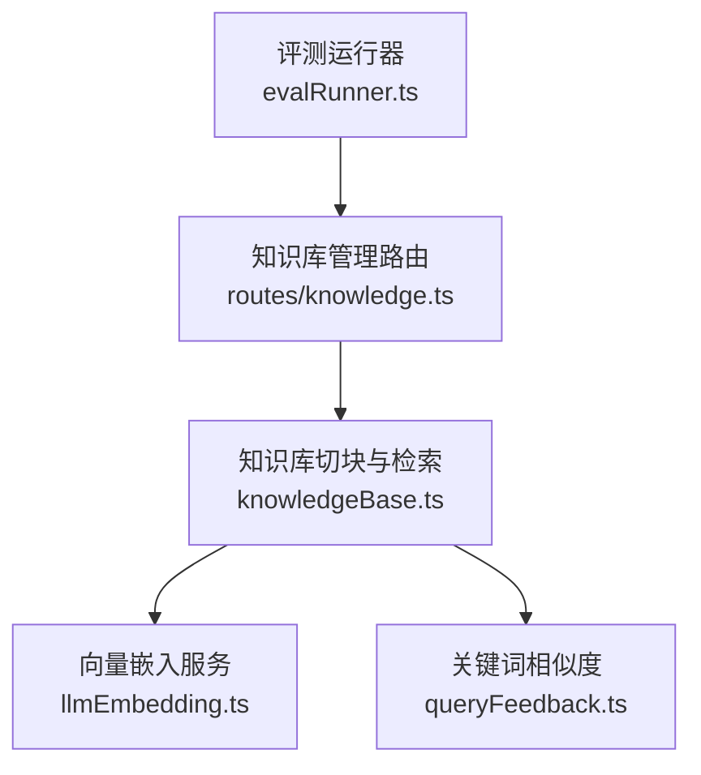
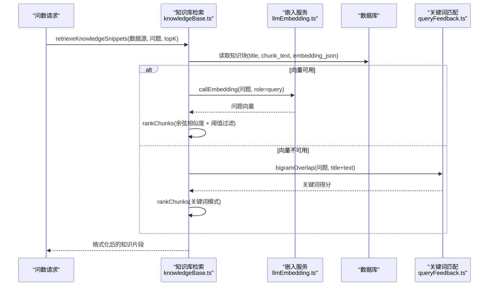
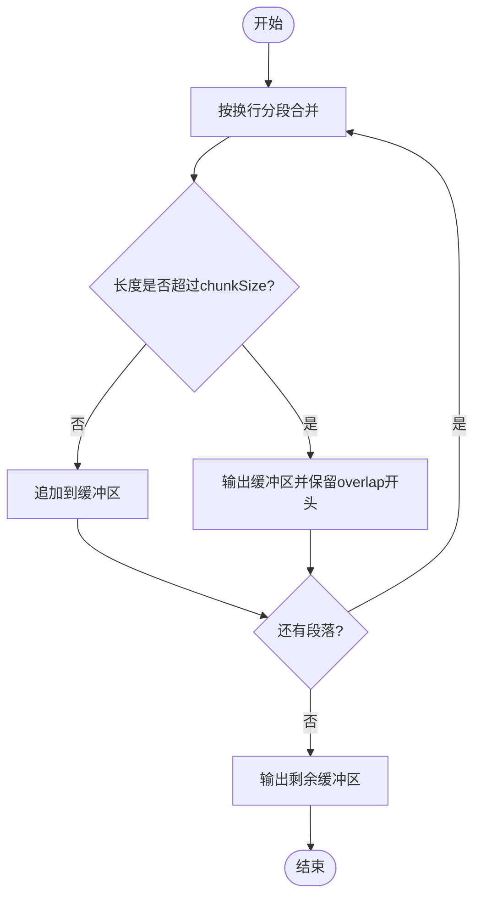
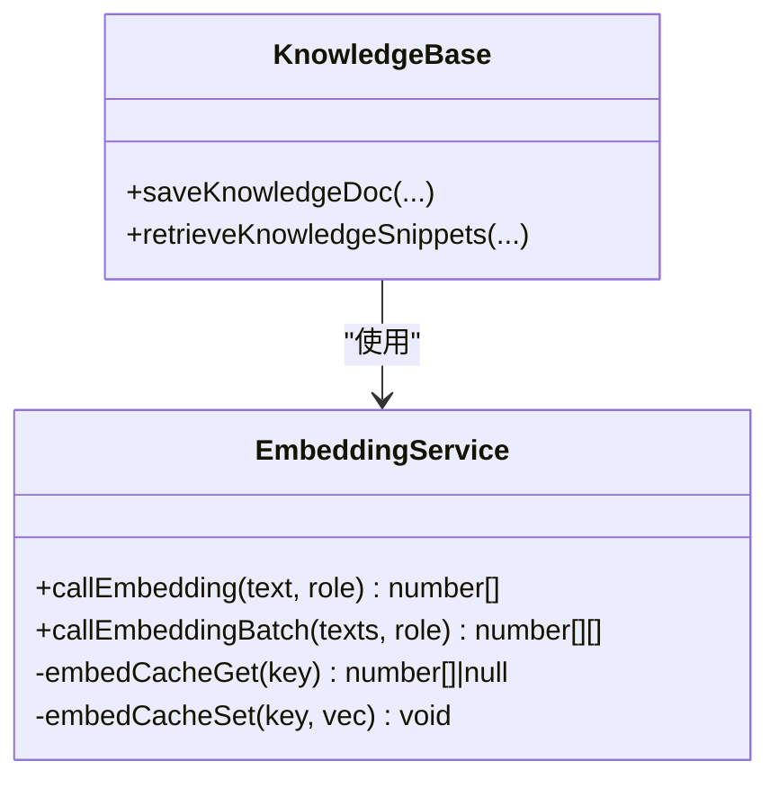
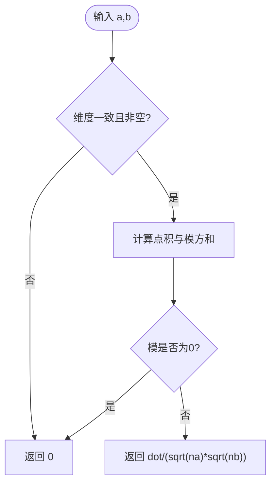
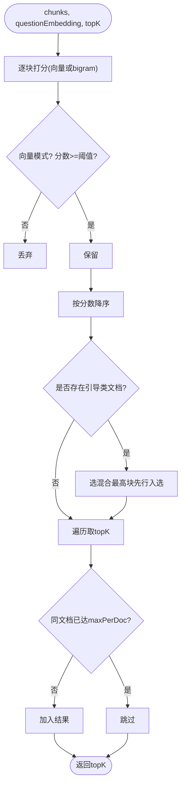
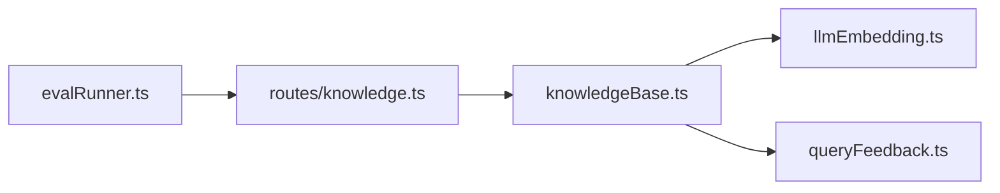

# 语义搜索

<cite>
**本文引用的文件**
- [server/knowledge/knowledgeBase.ts](file://server/knowledge/knowledgeBase.ts)
- [server/knowledge/knowledgeBase.test.ts](file://server/knowledge/knowledgeBase.test.ts)
- [server/llm/llmEmbedding.ts](file://server/llm/llmEmbedding.ts)
- [server/query/queryFeedback.ts](file://server/query/queryFeedback.ts)
- [server/routes/knowledge.ts](file://server/routes/knowledge.ts)
- [server/eval/evalRunner.ts](file://server/eval/evalRunner.ts)
</cite>

## 目录
1. [简介](#简介)
2. [项目结构](#项目结构)
3. [核心组件](#核心组件)
4. [架构总览](#架构总览)
5. [详细组件分析](#详细组件分析)
6. [依赖关系分析](#依赖关系分析)
7. [性能考虑](#性能考虑)
8. [故障排查指南](#故障排查指南)
9. [结论](#结论)
10. [附录](#附录)

## 简介
本技术文档围绕仓库中的“语义搜索”能力，系统性说明知识库检索与排序的实现：文本切块、向量化（含批量优化）、相似度计算（余弦相似度与 bigram 关键词匹配）、检索排序策略（阈值过滤、去重、引导类文档保留槽位）、降级机制（embedding 不可用时自动切换关键词检索），以及查询优化（缓存、批量化）和效果评估方法。

## 项目结构
语义搜索相关代码主要分布在以下模块：
- 知识库切块与检索排序：knowledgeBase.ts
- 向量嵌入与缓存：llmEmbedding.ts
- 关键词相似度与样例检索：queryFeedback.ts
- 知识库管理路由（导入/导出/CRUD）：routes/knowledge.ts
- 评测运行器（端到端准确率评测）：evalRunner.ts

图表来源
- [server/knowledge/knowledgeBase.ts:1-239](file://server/knowledge/knowledgeBase.ts#L1-L239)
- [server/llm/llmEmbedding.ts:1-317](file://server/llm/llmEmbedding.ts#L1-L317)
- [server/query/queryFeedback.ts:1-471](file://server/query/queryFeedback.ts#L1-L471)
- [server/routes/knowledge.ts:1-457](file://server/routes/knowledge.ts#L1-L457)
- [server/eval/evalRunner.ts:1-345](file://server/eval/evalRunner.ts#L1-L345)

章节来源
- [server/knowledge/knowledgeBase.ts:1-239](file://server/knowledge/knowledgeBase.ts#L1-L239)
- [server/llm/llmEmbedding.ts:1-317](file://server/llm/llmEmbedding.ts#L1-L317)
- [server/query/queryFeedback.ts:1-471](file://server/query/queryFeedback.ts#L1-L471)
- [server/routes/knowledge.ts:1-457](file://server/routes/knowledge.ts#L1-L457)
- [server/eval/evalRunner.ts:1-345](file://server/eval/evalRunner.ts#L1-L345)

## 核心组件
- 文本切块：按段落优先、定长兜底、相邻块重叠，避免语义被截断。
- 向量嵌入：统一调用通道，支持 Ollama/Gemini/Qwen；短 TTL 缓存；单条与批量接口。
- 相似度计算：余弦相似度（向量模式）与 bigram 重合度（关键词模式）。
- 检索排序：rankChunks 实现向量/关键词混合打分、相关性阈值过滤、同文档去重、引导类文档保留槽位。
- 降级机制：embedding 失败或不可用时，自动回退到 bigram 关键词检索。
- 知识入库与检索：saveKnowledgeDoc 批量 embedding 落库；retrieveKnowledgeSnippets 读取并检索。
- 评测：evalRunner 提供端到端执行准确率评测，便于 A/B 测试与回归门禁。

章节来源
- [server/knowledge/knowledgeBase.ts:43-90](file://server/knowledge/knowledgeBase.ts#L43-L90)
- [server/knowledge/knowledgeBase.ts:106-157](file://server/knowledge/knowledgeBase.ts#L106-L157)
- [server/llm/llmEmbedding.ts:60-162](file://server/llm/llmEmbedding.ts#L60-L162)
- [server/llm/llmEmbedding.ts:260-315](file://server/llm/llmEmbedding.ts#L260-L315)
- [server/query/queryFeedback.ts:91-99](file://server/query/queryFeedback.ts#L91-L99)
- [server/knowledge/knowledgeBase.ts:172-197](file://server/knowledge/knowledgeBase.ts#L172-L197)
- [server/knowledge/knowledgeBase.ts:207-239](file://server/knowledge/knowledgeBase.ts#L207-L239)
- [server/eval/evalRunner.ts:212-345](file://server/eval/evalRunner.ts#L212-L345)

## 架构总览
语义搜索在问数链路中作为 RAG 增强：将用户问题与知识库片段进行相似度匹配，命中后注入提示词约束口径/术语/枚举，提升 SQL 生成质量。

图表来源
- [server/knowledge/knowledgeBase.ts:207-239](file://server/knowledge/knowledgeBase.ts#L207-L239)
- [server/llm/llmEmbedding.ts:60-162](file://server/llm/llmEmbedding.ts#L60-L162)
- [server/query/queryFeedback.ts:91-99](file://server/query/queryFeedback.ts#L91-L99)

## 详细组件分析

### 文本切块与持久化
- 切块策略：先按换行分段合并至 chunkSize 以内，超长块按步长切分，相邻块保留 overlap 防止语义断裂。
- 持久化：保存时逐块写入 knowledge_base，embedding 批量调用失败则整批置空，保证后续可降级为关键词检索。

图表来源
- [server/knowledge/knowledgeBase.ts:43-75](file://server/knowledge/knowledgeBase.ts#L43-L75)

章节来源
- [server/knowledge/knowledgeBase.ts:43-75](file://server/knowledge/knowledgeBase.ts#L43-L75)
- [server/knowledge/knowledgeBase.ts:172-197](file://server/knowledge/knowledgeBase.ts#L172-L197)

### 向量化处理原理
- 模型选择：通过环境变量选择引擎与模型（Ollama/Gemini/Qwen），nomic 系列需加角色前缀以区分 query/document。
- 维度映射：不同后端返回的向量维度由模型决定，系统不做强转，仅做存在性与非空校验。
- 批量优化：callEmbeddingBatch 按批次大小（默认16，最大64）分批请求，减少往返次数；缓存命中直接复用。

图表来源
- [server/llm/llmEmbedding.ts:60-162](file://server/llm/llmEmbedding.ts#L60-L162)
- [server/llm/llmEmbedding.ts:260-315](file://server/llm/llmEmbedding.ts#L260-L315)
- [server/knowledge/knowledgeBase.ts:172-197](file://server/knowledge/knowledgeBase.ts#L172-L197)

章节来源
- [server/llm/llmEmbedding.ts:21-47](file://server/llm/llmEmbedding.ts#L21-L47)
- [server/llm/llmEmbedding.ts:60-162](file://server/llm/llmEmbedding.ts#L60-L162)
- [server/llm/llmEmbedding.ts:166-170](file://server/llm/llmEmbedding.ts#L166-L170)
- [server/llm/llmEmbedding.ts:260-315](file://server/llm/llmEmbedding.ts#L260-L315)

### 相似度计算算法
- 余弦相似度（cosineSimilarity）：对等维向量计算点积与模长比值；维度不一致或零向量返回 0。
- Bigram 关键词匹配（bigramOverlap）：中文二字滑窗集合求交计数，轻量且对中文友好。

图表来源
- [server/knowledge/knowledgeBase.ts:77-90](file://server/knowledge/knowledgeBase.ts#L77-L90)
- [server/query/queryFeedback.ts:91-99](file://server/query/queryFeedback.ts#L91-L99)

章节来源
- [server/knowledge/knowledgeBase.ts:77-90](file://server/knowledge/knowledgeBase.ts#L77-L90)
- [server/query/queryFeedback.ts:91-99](file://server/query/queryFeedback.ts#L91-L99)

### 检索排序策略（rankChunks）
- 打分方式：若问题与块均有等维向量，使用余弦相似度；否则使用 bigram 关键词得分。
- 相关性阈值：向量模式下低于 knowledgeMinScore() 的片段被过滤；关键词模式维持 score>0。
- 去重与配额：同一文档最多入选 maxPerDoc 块，避免单一长字典占满槽位。
- 引导类文档保留槽位：标题命中 GUIDED_DOC_KEYWORDS 的高价值文档，采用“向量分 + 加权归一 bigram”的混合分优先入选一个槽位，确保口径/指南类知识不被字段字典挤掉。

图表来源
- [server/knowledge/knowledgeBase.ts:106-157](file://server/knowledge/knowledgeBase.ts#L106-L157)
- [server/knowledge/knowledgeBase.ts:13-25](file://server/knowledge/knowledgeBase.ts#L13-L25)

章节来源
- [server/knowledge/knowledgeBase.ts:106-157](file://server/knowledge/knowledgeBase.ts#L106-L157)
- [server/knowledge/knowledgeBase.test.ts:37-78](file://server/knowledge/knowledgeBase.test.ts#L37-L78)
- [server/knowledge/knowledgeBase.test.ts:113-187](file://server/knowledge/knowledgeBase.test.ts#L113-L187)

### 降级机制
- 触发条件：embedding 服务不可用（未安装模型/网络异常/返回空向量）或问题向量获取失败。
- 行为：自动切换到 bigram 关键词检索，保持功能可用且不阻断主链路。
- 影响范围：知识库检索与样例检索均具备该降级路径。

章节来源
- [server/knowledge/knowledgeBase.ts:207-239](file://server/knowledge/knowledgeBase.ts#L207-L239)
- [server/llm/llmEmbedding.ts:60-162](file://server/llm/llmEmbedding.ts#L60-L162)
- [server/query/queryFeedback.ts:168-232](file://server/query/queryFeedback.ts#L168-L232)

### 查询优化技术
- 索引策略：当前基于全表扫描并按 data_source_id 过滤；可通过数据库层添加索引加速（如 (data_source_id)）。
- 缓存机制：embedding 短 TTL 缓存（默认10分钟，上限256），跨调用复用问题向量，降低重复开销。
- 分页处理：检索阶段未显式分页；可通过 topK 控制返回数量，结合业务侧分页展示。
- 批量化：知识库导入/列裁剪场景使用 callEmbeddingBatch，按批次大小减少网络往返。

章节来源
- [server/llm/llmEmbedding.ts:26-47](file://server/llm/llmEmbedding.ts#L26-L47)
- [server/llm/llmEmbedding.ts:260-315](file://server/llm/llmEmbedding.ts#L260-L315)
- [server/knowledge/knowledgeBase.ts:207-239](file://server/knowledge/knowledgeBase.ts#L207-L239)

### 性能调优指南
- 向量维度选择：根据所选 embedding 模型确定维度；nomic 系列建议加角色前缀以提升区分度。
- topK 配置：默认 TOP_K_CHUNKS=6，可根据上下文预算与命中率调整；过大可能稀释注意力。
- 内存使用优化：控制 EMBED_CACHE_MAX 与 EMBED_BATCH_SIZE；大文档切块时合理设置 CHUNK_SIZE/CHUNK_OVERLAP。
- 阈值调参：KNOWLEDGE_MIN_SCORE 默认 0.35，可按业务场景微调以减少无关知识注入。

章节来源
- [server/knowledge/knowledgeBase.ts:13-25](file://server/knowledge/knowledgeBase.ts#L13-L25)
- [server/knowledge/knowledgeBase.ts:34-41](file://server/knowledge/knowledgeBase.ts#L34-L41)
- [server/llm/llmEmbedding.ts:26-47](file://server/llm/llmEmbedding.ts#L26-L47)
- [server/llm/llmEmbedding.ts:166-170](file://server/llm/llmEmbedding.ts#L166-L170)

### 搜索效果评估与 A/B 测试框架
- 指标定义：执行准确率（生成 SQL 与 golden SQL 执行结果集一致的比例），支持有序/无序比较与数值容差。
- 评测流程：加载评测集 → 登录获取 token → 逐条调用问数接口（旁路缓存）→ 执行 golden SQL → 结果集等价比较 → 统计通过率与分层指标。
- A/B 测试建议：通过环境变量切换模型/阈值/topK，分别跑评测集对比准确率与耗时，输出报告用于回归门禁。

章节来源
- [server/eval/evalRunner.ts:1-345](file://server/eval/evalRunner.ts#L1-L345)

## 依赖关系分析
- knowledgeBase.ts 依赖 llmEmbedding.ts 进行向量化，依赖 queryFeedback.ts 的 bigramOverlap 作为降级方案。
- routes/knowledge.ts 负责知识库 CRUD 与导入导出，内部调用 saveKnowledgeDoc 完成切块与 embedding 落库。
- evalRunner.ts 通过 HTTP 调用问数链路，间接使用知识库检索与 LLM 推理，形成端到端评测闭环。

图表来源
- [server/knowledge/knowledgeBase.ts:1-239](file://server/knowledge/knowledgeBase.ts#L1-L239)
- [server/llm/llmEmbedding.ts:1-317](file://server/llm/llmEmbedding.ts#L1-L317)
- [server/query/queryFeedback.ts:1-471](file://server/query/queryFeedback.ts#L1-L471)
- [server/routes/knowledge.ts:1-457](file://server/routes/knowledge.ts#L1-L457)
- [server/eval/evalRunner.ts:1-345](file://server/eval/evalRunner.ts#L1-L345)

章节来源
- [server/knowledge/knowledgeBase.ts:1-239](file://server/knowledge/knowledgeBase.ts#L1-L239)
- [server/llm/llmEmbedding.ts:1-317](file://server/llm/llmEmbedding.ts#L1-L317)
- [server/query/queryFeedback.ts:1-471](file://server/query/queryFeedback.ts#L1-L471)
- [server/routes/knowledge.ts:1-457](file://server/routes/knowledge.ts#L1-L457)
- [server/eval/evalRunner.ts:1-345](file://server/eval/evalRunner.ts#L1-L345)

## 性能考虑
- 向量缓存：短 TTL 与容量限制避免内存膨胀，同时显著减少重复调用。
- 批量嵌入：按批次大小聚合请求，降低网络往返与模型启动开销。
- 切块参数：合理设置 CHUNK_SIZE 与 CHUNK_OVERLAP，平衡召回与上下文预算。
- 阈值与 topK：根据业务需求调优，避免过多无关知识注入导致注意力分散。

[本节为通用指导，无需特定文件引用]

## 故障排查指南
- 向量为空或维度不一致：检查 embedding 模型是否已安装、网络连通性、响应格式；确认 nomic 系列是否添加角色前缀。
- 检索结果为空：确认 KNOWLEDGE_MIN_SCORE 阈值是否过高；必要时临时降低阈值或启用关键词降级。
- 导入失败：检查文件格式与冲突策略；dryRun 预检后再执行真实导入。
- 评测超时或限流：调整 perCaseTimeoutMs 与 USER_QUERY_RATE_MAX；分批运行评测集。

章节来源
- [server/llm/llmEmbedding.ts:60-162](file://server/llm/llmEmbedding.ts#L60-L162)
- [server/knowledge/knowledgeBase.ts:34-41](file://server/knowledge/knowledgeBase.ts#L34-L41)
- [server/routes/knowledge.ts:249-375](file://server/routes/knowledge.ts#L249-L375)
- [server/eval/evalRunner.ts:212-345](file://server/eval/evalRunner.ts#L212-L345)

## 结论
本系统的语义搜索以“向量为主、关键词为辅”的双通道设计，在保证高召回的同时具备强鲁棒性：embedding 可用走余弦相似度并配合相关性阈值过滤；不可用时自动降级为 bigram 关键词匹配。通过批量嵌入、短 TTL 缓存、切块重叠与引导类文档保留槽位等优化，兼顾了性能与效果。评测框架为持续改进提供了可量化的依据。

## 附录
- 关键常量与环境变量
  - CHUNK_SIZE / CHUNK_OVERLAP：切块大小与重叠长度
  - TOP_K_CHUNKS：默认返回片段数
  - MAX_CHUNKS_PER_DOC：单文档最多入选块数
  - GUIDED_DOC_KEYWORDS：引导类文档关键词
  - GUIDED_BIGRAM_WEIGHT：混合打分权重
  - KNOWLEDGE_MIN_SCORE：向量模式相关性阈值
  - EMBED_MODEL / QWEN_EMBED_MODEL：嵌入模型选择
  - EMBED_BATCH_SIZE：批量嵌入批次大小
  - EMBED_CACHE_TTL_MS / EMBED_CACHE_MAX：缓存 TTL 与容量

章节来源
- [server/knowledge/knowledgeBase.ts:13-25](file://server/knowledge/knowledgeBase.ts#L13-L25)
- [server/knowledge/knowledgeBase.ts:34-41](file://server/knowledge/knowledgeBase.ts#L34-L41)
- [server/llm/llmEmbedding.ts:21-24](file://server/llm/llmEmbedding.ts#L21-L24)
- [server/llm/llmEmbedding.ts:26-47](file://server/llm/llmEmbedding.ts#L26-L47)
- [server/llm/llmEmbedding.ts:166-170](file://server/llm/llmEmbedding.ts#L166-L170)