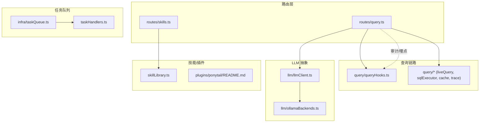
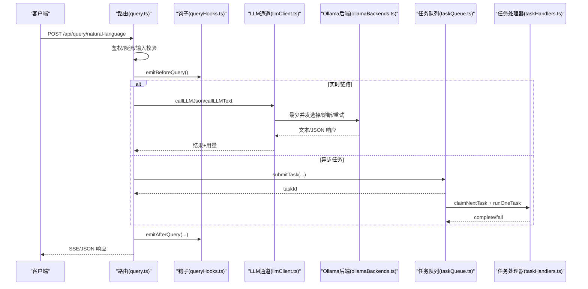
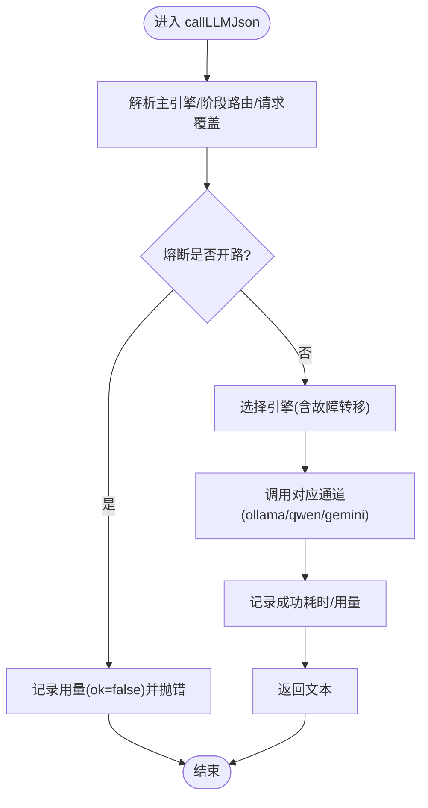
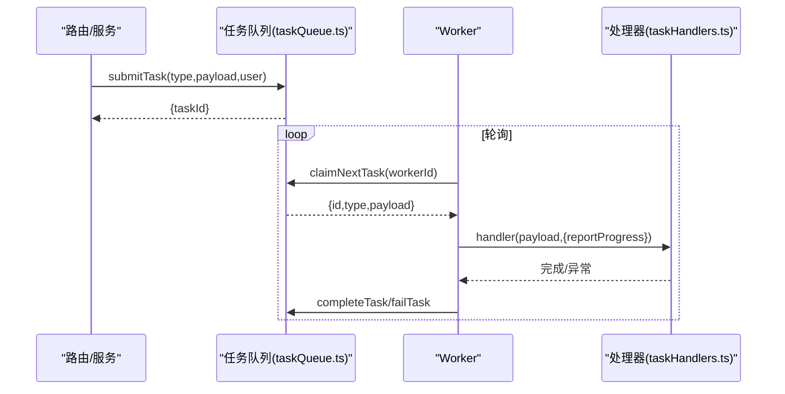
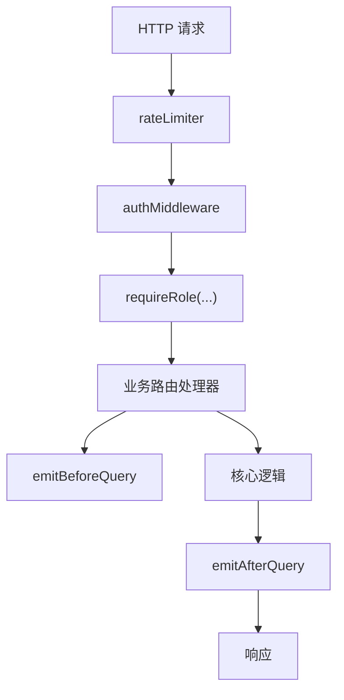
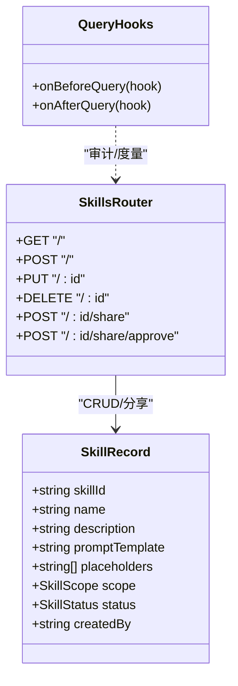
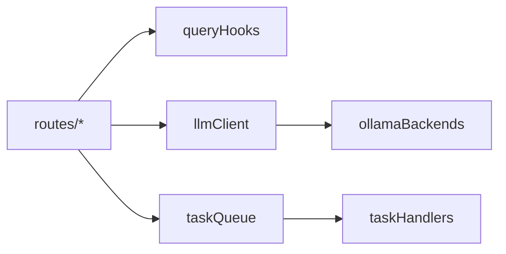

# 扩展性设计

<cite>
**本文引用的文件**
- [server/llm/llmClient.ts](file://server/llm/llmClient.ts)
- [server/llm/ollamaBackends.ts](file://server/llm/ollamaBackends.ts)
- [server/infra/taskQueue.ts](file://server/infra/taskQueue.ts)
- [server/taskHandlers.ts](file://server/taskHandlers.ts)
- [server/routes/query.ts](file://server/routes/query.ts)
- [server/query/queryHooks.ts](file://server/query/queryHooks.ts)
- [server/skillLibrary.ts](file://server/skillLibrary.ts)
- [server/routes/skills.ts](file://server/routes/skills.ts)
- [plugins/ponytail/README.md](file://plugins/ponytail/README.md)
</cite>

## 目录
1. [简介](#简介)
2. [项目结构](#项目结构)
3. [核心组件](#核心组件)
4. [架构总览](#架构总览)
5. [详细组件分析](#详细组件分析)
6. [依赖关系分析](#依赖关系分析)
7. [性能与扩展性考量](#性能与扩展性考量)
8. [故障排查指南](#故障排查指南)
9. [结论](#结论)
10. [附录：扩展开发指南与最佳实践](#附录扩展开发指南与最佳实践)

## 简介
本文件面向二次开发者，系统性阐述智能问数据分析系统的扩展性设计。重点覆盖：
- 插件化架构理念与实现（Ponytail 技能、技能库、生命周期钩子）
- 多 LLM 引擎的扩展方式（新模型接入、适配器思路、配置管理）
- 异步任务队列的扩展能力（自定义处理器、工作节点扩展、调度策略）
- 路由系统的扩展机制（模块化路由、中间件链、钩子函数）
并提供可操作的扩展案例与最佳实践，帮助快速上手。

## 项目结构
系统采用“按领域分层 + 模块化路由”的组织方式：
- server/llm：统一 LLM 调用通道、熔断/重试/并发控制、多后端路由
- server/infra：基础设施（日志、限流、状态存储、任务队列等）
- server/query：问数链路核心（安全执行、缓存、SSE 回放、计划模式等）
- server/routes：Express 模块化路由（鉴权、限流、业务端点）
- server/report：报表生成与导出
- plugins/ponytail：编码风格约束技能（示例型插件）
- src：前端资源（与本扩展文档关联度较低）

图表来源
- [server/routes/query.ts:1-710](file://server/routes/query.ts#L1-L710)
- [server/query/queryHooks.ts:1-62](file://server/query/queryHooks.ts#L1-L62)
- [server/llm/llmClient.ts:1-606](file://server/llm/llmClient.ts#L1-L606)
- [server/llm/ollamaBackends.ts:1-143](file://server/llm/ollamaBackends.ts#L1-L143)
- [server/infra/taskQueue.ts:1-347](file://server/infra/taskQueue.ts#L1-L347)
- [server/taskHandlers.ts:1-198](file://server/taskHandlers.ts#L1-L198)
- [server/skillLibrary.ts:1-241](file://server/skillLibrary.ts#L1-L241)
- [plugins/ponytail/README.md:1-35](file://plugins/ponytail/README.md#L1-L35)

章节来源
- [server/routes/query.ts:1-710](file://server/routes/query.ts#L1-L710)
- [server/llm/llmClient.ts:1-606](file://server/llm/llmClient.ts#L1-L606)
- [server/infra/taskQueue.ts:1-347](file://server/infra/taskQueue.ts#L1-L347)

## 核心组件
- 统一 LLM 通道：封装 Ollama/Gemini/Qwen 三种引擎，提供 JSON/Text 两种调用模式，内置重试、熔断、并发信号量、自适应超时、引擎级故障转移与用量埋点。
- 多后端路由：Ollama 支持多实例池、最少并发选择、健康检查与摘除恢复。
- 异步任务队列：基于 MySQL 的任务表与内置 worker，支持任务提交、原子领取、心跳、孤儿回收、执行超时与结果持久化。
- 生命周期钩子：在进入/结束两个切面广播事件，便于审计、指标采集、A/B 实验等横切逻辑挂接。
- 技能库与插件：用户/系统双域技能模板，分享审核流程；Ponytail 作为示例技能，体现“提示词即插件”的理念。

章节来源
- [server/llm/llmClient.ts:1-606](file://server/llm/llmClient.ts#L1-L606)
- [server/llm/ollamaBackends.ts:1-143](file://server/llm/ollamaBackends.ts#L1-L143)
- [server/infra/taskQueue.ts:1-347](file://server/infra/taskQueue.ts#L1-L347)
- [server/query/queryHooks.ts:1-62](file://server/query/queryHooks.ts#L1-L62)
- [server/skillLibrary.ts:1-241](file://server/skillLibrary.ts#L1-L241)
- [plugins/ponytail/README.md:1-35](file://plugins/ponytail/README.md#L1-L35)

## 架构总览
下图展示请求从路由进入，经限流/鉴权后进入问数链路，通过 LLM 通道调用不同引擎，并可通过钩子进行横切处理；长任务走异步队列由 worker 执行。

图表来源
- [server/routes/query.ts:47-393](file://server/routes/query.ts#L47-L393)
- [server/query/queryHooks.ts:33-61](file://server/query/queryHooks.ts#L33-L61)
- [server/llm/llmClient.ts:449-525](file://server/llm/llmClient.ts#L449-L525)
- [server/llm/ollamaBackends.ts:45-96](file://server/llm/ollamaBackends.ts#L45-L96)
- [server/infra/taskQueue.ts:120-138](file://server/infra/taskQueue.ts#L120-L138)
- [server/taskHandlers.ts:192-198](file://server/taskHandlers.ts#L192-L198)

## 详细组件分析

### 多 LLM 引擎扩展（新模型接入、适配器、配置）
- 统一入口：callLLMJson/callLLMText 屏蔽底层差异，返回纯文本或 JSON 字符串，供上层解析。
- 引擎选择优先级：请求级覆盖 > 阶段级路由（SQL 生成/数据解读可用快速模型）> 环境变量显式指定 > 密钥存在性自动 > 默认 ollama。
- 韧性保障：每引擎独立熔断器、信号量并发上限、退避重试、自适应超时窗口。
- 多后端：Ollama 支持多实例池，最少并发选择，失败摘除与健康检查恢复。
- 新增引擎/模型建议：
  - 在 llmClient 中新增通道函数（参考 qwenChat/ollamaChat），并在 callLLMJson/callLLMText 分支注册。
  - 若需独立健康检查/路由，可仿照 ollamaBackends 增加后端池模块。
  - 通过环境变量注入密钥、超时、并发等参数，保持零代码改动切换。
  - 使用 validateModelSelection 校验用户自选模型，避免非法值进入链路。

图表来源
- [server/llm/llmClient.ts:121-139](file://server/llm/llmClient.ts#L121-L139)
- [server/llm/llmClient.ts:449-525](file://server/llm/llmClient.ts#L449-L525)
- [server/llm/ollamaBackends.ts:45-96](file://server/llm/ollamaBackends.ts#L45-L96)

章节来源
- [server/llm/llmClient.ts:1-606](file://server/llm/llmClient.ts#L1-L606)
- [server/llm/ollamaBackends.ts:1-143](file://server/llm/ollamaBackends.ts#L1-L143)

### 异步任务队列扩展（自定义处理器、工作节点、调度策略）
- 任务类型与处理器：通过 registerTaskHandler(type, handler) 注册，worker 侧根据 type 分发执行。
- 提交与领取：submitTask 限制同用户在途数量；claimNextTask 使用 FOR UPDATE SKIP LOCKED 原子领取。
- 心跳与孤儿回收：RUNNING 任务定期心跳，超时回收并重试或标记失败。
- 执行期保护：runOneTask 包裹超时 Promise.race，确保长时间任务不阻塞。
- 扩展方式：
  - 新增任务类型：定义 TaskType 联合类型，实现 handler 并通过 registerTaskHandler 注册。
  - 工作节点扩展：startTaskWorker 启动周期 tick，可在外部进程复用同一队列（多实例共享 MySQL）。
  - 调度策略：通过 TASK_WORKER_CONCURRENCY、TASK_QUEUE_USER_MAX、TASK_HEARTBEAT_TIMEOUT_MS、TASK_EXEC_TIMEOUT_MS 调整吞吐与容错。

图表来源
- [server/infra/taskQueue.ts:120-138](file://server/infra/taskQueue.ts#L120-L138)
- [server/infra/taskQueue.ts:144-175](file://server/infra/taskQueue.ts#L144-L175)
- [server/infra/taskQueue.ts:277-306](file://server/infra/taskQueue.ts#L277-L306)
- [server/taskHandlers.ts:192-198](file://server/taskHandlers.ts#L192-L198)

章节来源
- [server/infra/taskQueue.ts:1-347](file://server/infra/taskQueue.ts#L1-L347)
- [server/taskHandlers.ts:1-198](file://server/taskHandlers.ts#L1-L198)

### 路由系统扩展（模块化路由、中间件链、钩子函数）
- 模块化路由：每个功能域一个 Router 文件（如 query.ts、skills.ts），集中挂载中间件与端点。
- 中间件链：rateLimiter、authMiddleware、requireRole 等组合，形成统一的鉴权与限流入口。
- 钩子函数：emitBeforeQuery/emitAfterQuery 在问数链路前后广播，审计、缓存写入、指标采集等横切逻辑无需侵入主流程。
- 扩展方式：
  - 新增路由：新建 routes/*.ts，挂载到 Express 应用，复用已有中间件。
  - 新增中间件：实现标准 (req,res,next) 函数，按需插入链。
  - 新增钩子：onBeforeQuery/onAfterQuery 注册回调，异常不影响主链路。

图表来源
- [server/routes/query.ts:47-165](file://server/routes/query.ts#L47-L165)
- [server/query/queryHooks.ts:33-61](file://server/query/queryHooks.ts#L33-L61)
- [server/infra/rateLimiter.ts:14-42](file://server/infra/rateLimiter.ts#L14-L42)

章节来源
- [server/routes/query.ts:1-710](file://server/routes/query.ts#L1-L710)
- [server/query/queryHooks.ts:1-62](file://server/query/queryHooks.ts#L1-L62)
- [server/infra/rateLimiter.ts:1-54](file://server/infra/rateLimiter.ts#L1-L54)

### 插件化架构与技能库（Ponytail 技能、第三方集成）
- 技能即插件：以“提问模板 + 占位符”形式沉淀专家经验，支持个人域与系统域，具备分享审核流程。
- Ponytail 示例：编码风格约束技能，通过关键词触发，体现“提示词驱动”的轻量插件形态。
- 集成方式：
  - 将技能模板存入 skill_library，通过 /api/skills 暴露给前端面板。
  - 在问数链路中结合 schema/context 与 LLM 提示工程，将技能融入 prompt 构建。
  - 通过生命周期钩子对技能使用进行审计与度量。

图表来源
- [server/skillLibrary.ts:15-24](file://server/skillLibrary.ts#L15-L24)
- [server/routes/skills.ts:52-145](file://server/routes/skills.ts#L52-L145)
- [server/query/queryHooks.ts:33-61](file://server/query/queryHooks.ts#L33-L61)
- [plugins/ponytail/README.md:1-35](file://plugins/ponytail/README.md#L1-L35)

章节来源
- [server/skillLibrary.ts:1-241](file://server/skillLibrary.ts#L1-L241)
- [server/routes/skills.ts:1-145](file://server/routes/skills.ts#L1-L145)
- [plugins/ponytail/README.md:1-35](file://plugins/ponytail/README.md#L1-L35)

## 依赖关系分析
- 低耦合：LLM 通道与具体后端解耦；任务队列与处理器通过类型注册解耦；路由与业务逻辑通过中间件与钩子解耦。
- 关键依赖：
  - 路由依赖限流/鉴权/钩子；问数链路依赖 LLM 通道与任务队列；任务处理器依赖报告/导出能力。
- 潜在循环：通过 infra 层（logger、db、stateStore）与延迟导入避免循环依赖。

图表来源
- [server/routes/query.ts:17-42](file://server/routes/query.ts#L17-L42)
- [server/llm/llmClient.ts:9-26](file://server/llm/llmClient.ts#L9-L26)
- [server/infra/taskQueue.ts:16-19](file://server/infra/taskQueue.ts#L16-L19)
- [server/taskHandlers.ts:9-18](file://server/taskHandlers.ts#L9-L18)

章节来源
- [server/routes/query.ts:1-710](file://server/routes/query.ts#L1-L710)
- [server/llm/llmClient.ts:1-606](file://server/llm/llmClient.ts#L1-L606)
- [server/infra/taskQueue.ts:1-347](file://server/infra/taskQueue.ts#L1-L347)
- [server/taskHandlers.ts:1-198](file://server/taskHandlers.ts#L1-L198)

## 性能与扩展性考量
- LLM 通道：
  - 并发信号量防止打爆本地推理进程；自适应超时依据历史 P95 动态收紧，避免慢拖死快。
  - 熔断器隔离故障引擎，故障转移保证可用性；用量埋点支撑成本核算。
- 任务队列：
  - 原子领取与心跳机制保障多 worker/多实例安全消费；孤儿回收避免任务丢失。
  - 执行超时兜底，防止子进程/连接泄漏。
- 路由与钩子：
  - 中间件前置校验减少无效计算；钩子非阻断，便于横向扩展而不影响主路径。
- 扩展建议：
  - 新增引擎/后端时，优先复用现有韧性设施（重试/熔断/并发/超时）。
  - 新增任务类型时，遵循“提交即返回 + worker 异步执行”的模式，确保用户体验与稳定性。
  - 新增路由/中间件时，尽量复用 rateLimiter/authMiddleware，并通过钩子做横切关注点。

[本节为通用指导，不直接分析具体文件]

## 故障排查指南
- LLM 不可用：
  - 观察熔断状态与故障转移日志；检查引擎密钥与环境变量；必要时关闭自适应超时定位问题。
  - 参考：[server/llm/llmClient.ts:62-107](file://server/llm/llmClient.ts#L62-L107)、[server/llm/llmClient.ts:121-139](file://server/llm/llmClient.ts#L121-L139)
- Ollama 后端抖动：
  - 查看健康检查与摘除恢复日志；确认 OLLAMA_URLS 配置与网络连通性。
  - 参考：[server/llm/ollamaBackends.ts:45-96](file://server/llm/ollamaBackends.ts#L45-L96)、[server/llm/ollamaBackends.ts:113-128](file://server/llm/ollamaBackends.ts#L113-L128)
- 任务卡死/丢失：
  - 检查心跳超时配置与孤儿回收；核对 attempts 是否达到最大重试次数。
  - 参考：[server/infra/taskQueue.ts:206-227](file://server/infra/taskQueue.ts#L206-L227)、[server/infra/taskQueue.ts:277-306](file://server/infra/taskQueue.ts#L277-L306)
- 路由限流/鉴权失败：
  - 检查 RATE_LIMIT_MAX、Redis 模式开关；确认角色白名单与数据源访问控制。
  - 参考：[server/infra/rateLimiter.ts:14-42](file://server/infra/rateLimiter.ts#L14-L42)、[server/routes/query.ts:58-68](file://server/routes/query.ts#L58-L68)

章节来源
- [server/llm/llmClient.ts:62-139](file://server/llm/llmClient.ts#L62-L139)
- [server/llm/ollamaBackends.ts:45-128](file://server/llm/ollamaBackends.ts#L45-L128)
- [server/infra/taskQueue.ts:206-306](file://server/infra/taskQueue.ts#L206-L306)
- [server/infra/rateLimiter.ts:14-42](file://server/infra/rateLimiter.ts#L14-L42)
- [server/routes/query.ts:58-68](file://server/routes/query.ts#L58-L68)

## 结论
系统通过“统一 LLM 通道 + 多后端路由”、“异步任务队列 + 处理器注册”、“模块化路由 + 生命周期钩子”、“技能库 + 示例插件”四大支柱，构建了高内聚、低耦合、易扩展的架构。新增引擎、任务类型、路由与插件均可在不侵入主流程的前提下完成，同时保留韧性、可观测性与安全性。

[本节为总结，不直接分析具体文件]

## 附录：扩展开发指南与最佳实践

### 新增 LLM 引擎/模型
- 步骤
  - 在 llmClient 中新增通道函数（参考 qwenChat/ollamaChat），实现消息组装、超时控制、错误映射与用量提取。
  - 在 callLLMJson/callLLMText 分支注册新引擎，并完善 engineKind/envEngineKind 的选择逻辑。
  - 如需多后端，仿照 ollamaBackends 建立后端池与健康检查。
  - 通过环境变量注入密钥、超时、并发等参数；使用 validateModelSelection 校验用户自选。
- 最佳实践
  - 复用重试/熔断/并发/自适应超时等韧性设施。
  - 严格错误分类（TIMEOUT/CIRCUIT_OPEN/NETWORK），便于前端降级与告警。
  - 埋点包含 engine/model/channel/durationMs/usage，支撑成本与质量评估。

章节来源
- [server/llm/llmClient.ts:349-525](file://server/llm/llmClient.ts#L349-L525)
- [server/llm/llmClient.ts:235-295](file://server/llm/llmClient.ts#L235-L295)
- [server/llm/ollamaBackends.ts:21-96](file://server/llm/ollamaBackends.ts#L21-L96)

### 新增异步任务类型
- 步骤
  - 在 taskQueue.ts 的 TaskType 中添加新类型。
  - 在 taskHandlers.ts 实现 handler，使用 reportProgress 上报进度，最终 completeTask/failTask 收尾。
  - 通过 registerTaskHandler 注册，并在服务端启动时调用 registerBuiltinTaskHandlers。
- 最佳实践
  - 处理器幂等、可重入；对外部依赖设置超时与重试。
  - 敏感信息脱敏落库；审计记录完整上下文。
  - 合理设置 TASK_EXEC_TIMEOUT_MS 与 TASK_HEARTBEAT_TIMEOUT_MS。

章节来源
- [server/infra/taskQueue.ts:21-23](file://server/infra/taskQueue.ts#L21-L23)
- [server/taskHandlers.ts:39-198](file://server/taskHandlers.ts#L39-L198)

### 新增路由与中间件
- 步骤
  - 新建 routes/*.ts，使用 Router 组织端点；挂载 rateLimiter/authMiddleware/requireRole。
  - 在需要处调用 emitBeforeQuery/emitAfterQuery 进行横切。
- 最佳实践
  - 输入校验前置，尽早失败；错误码统一使用 ERROR_CODES。
  - 对长耗时操作考虑异步任务化，避免占用 HTTP 连接。

章节来源
- [server/routes/query.ts:47-165](file://server/routes/query.ts#L47-L165)
- [server/query/queryHooks.ts:33-61](file://server/query/queryHooks.ts#L33-L61)
- [server/infra/rateLimiter.ts:14-42](file://server/infra/rateLimiter.ts#L14-L42)

### 新增技能/插件
- 步骤
  - 在 skill_library 中创建技能模板，定义占位符；通过 /api/skills 暴露。
  - 在问数链路中结合 schema/context 将技能注入 prompt。
  - 通过钩子记录技能使用情况与效果。
- 最佳实践
  - 模板简洁明确，避免过长导致 LLM 不稳定。
  - 分享审核流程确保质量可控；系统域技能需管理员维护。
  - Ponytail 示例可作为“提示词即插件”的参考。

章节来源
- [server/skillLibrary.ts:31-241](file://server/skillLibrary.ts#L31-L241)
- [server/routes/skills.ts:52-145](file://server/routes/skills.ts#L52-L145)
- [plugins/ponytail/README.md:1-35](file://plugins/ponytail/README.md#L1-L35)