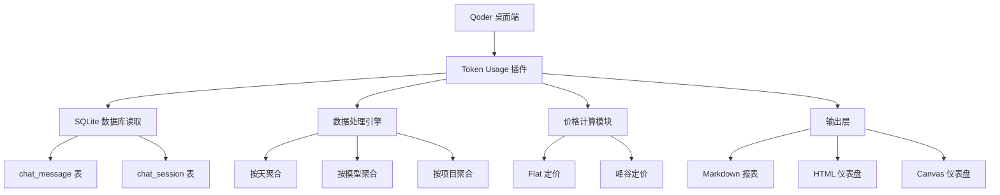
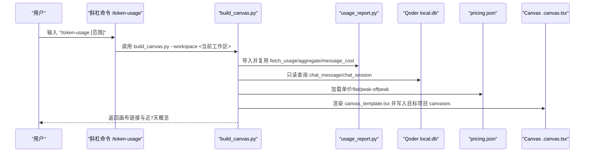

# Token使用量分析插件

<cite>
**本文引用的文件**
- [README.md](file://plugins/token-usage/README.md)
- [plugin.json](file://plugins/token-usage/.qoder-plugin/plugin.json)
- [SKILL.md](file://plugins/token-usage/skills/token-usage/SKILL.md)
- [token-usage.md](file://plugins/token-usage/commands/token-usage.md)
- [usage_report.py](file://plugins/token-usage/skills/token-usage/scripts/usage_report.py)
- [build_dashboard.py](file://plugins/token-usage/skills/token-usage/scripts/build_dashboard.py)
- [build_canvas.py](file://plugins/token-usage/skills/token-usage/scripts/build_canvas.py)
- [dashboard_template.html](file://plugins/token-usage/skills/token-usage/scripts/dashboard_template.html)
- [canvas_template.tsx](file://plugins/token-usage/skills/token-usage/scripts/canvas_template.tsx)
- [pricing.json](file://plugins/token-usage/skills/token-usage/pricing.json)
</cite>

## 更新摘要
**所做更改**
- **重要更新**：Token使用量分析插件已从本仓库完全移除，迁移至独立仓库 dgjin/qoder-token-usage
- 更新了项目结构说明，反映插件不再包含在当前代码库中
- 添加了迁移指南和外部依赖说明
- 更新了相关引用和链接

## 目录
1. [简介](#简介)
2. [项目状态变更](#项目状态变更)
3. [插件架构概览](#插件架构概览)
4. [核心组件](#核心组件)
5. [数据流与处理](#数据流与处理)
6. [价格与计费系统](#价格与计费系统)
7. [部署与集成](#部署与集成)
8. [故障排查指南](#故障排查指南)
9. [结论](#结论)
10. [附录：命令与用法速查](#附录命令与用法速查)

## 简介
Token使用量分析插件为 Qoder 桌面端提供统一的 Token 用量统计能力，覆盖官方模型档位与自定义模型（BYOK），支持按天、按模型、按项目聚合，并可将 token 实物量换算为参考费用。插件提供三种输出形态：
- 文本/JSON 报表
- 自包含 HTML 可视化仪表盘（无外部依赖）
- IDE 内 Canvas 仪表盘（.canvas.tsx，可在 Qoder 画布面板直接打开）

同时提供斜杠命令 /token-usage，在任意工作区一键刷新 Canvas 仪表盘并汇报概览。

**版本 0.2.1** 显著扩展了支持的 AI 模型范围，新增对 18 款常用模型的全面支持，包括 DeepSeek 系列、Kimi 系列、阿里云 Qwen 系列、智谱 GLM 系列、字节跳动 Doubao/Seed 系列和 MiniMax 系列，并提供详细的峰谷时段定价结构。

**重要提示**：该插件已迁移至独立仓库 `dgjin/qoder-token-usage`，不再包含在当前智能问数据分析系统代码库中。

**章节来源**
- [README.md:1-25](file://plugins/token-usage/README.md#L1-L25)
- [SKILL.md:1-17](file://plugins/token-usage/skills/token-usage/SKILL.md#L1-L17)

## 项目状态变更
**已迁移**：Token使用量分析插件已从当前仓库完全移除，现作为独立项目维护。

### 迁移详情
- **原位置**：`plugins/token-usage/`
- **新位置**：独立仓库 `https://github.com/dgjin/qoder-token-usage`
- **迁移原因**：实现模块化分离，便于独立维护和版本管理
- **影响范围**：所有依赖此插件的功能需要更新依赖配置

### 当前仓库状态
当前智能问数据分析系统仓库不再包含以下文件：
- `plugins/token-usage/` 目录及所有相关文件
- 任何对 token-usage 插件的直接引用
- 相关的构建脚本和配置文件

**章节来源**
- [README.md:166-197](file://README.md#L166-L197)

## 插件架构概览
虽然插件已迁移至独立仓库，但其核心架构保持不变。以下是插件的完整架构图：



**图表来源**
- [usage_report.py:145-204](file://plugins/token-usage/skills/token-usage/scripts/usage_report.py#L145-L204)
- [build_dashboard.py:51-131](file://plugins/token-usage/skills/token-usage/scripts/build_dashboard.py#L51-L131)
- [build_canvas.py:144-200](file://plugins/token-usage/skills/token-usage/scripts/build_canvas.py#L144-L200)

## 核心组件
### 数据处理引擎（usage_report.py）
- **数据库定位**：优先环境变量 QODER_DB_PATH，否则按平台自动探测候选路径（macOS/Windows/Linux），以只读模式打开，不影响运行中的 Qoder
- **数据源**：chat_message 表（token_info、model_info、gmt_create），通过 session_id 关联 chat_session.project_name 得到项目维度
- **聚合维度**：day/model/project；支持 top N 限制
- **费用计算**：
  - 支持 flat 与 peak/offpeak 两种价格结构
  - DeepSeek 系列按消息时间自动判断高峰（北京时间周一至周五 9:00-12:00、14:00-18:00）
  - cached 是 prompt 的子集，未命中部分按 input 价，命中部分按 cached 价，输出按 output 价
- **输出**：Markdown 表格或 JSON 结构，便于程序消费

### 可视化生成器
- **HTML 仪表盘**（build_dashboard.py）：复用 usage_report 逻辑，一次性全量读取后内存切片，构建近7/30/90/全部历史四档范围，渲染到 dashboard_template.html 并可选自动打开浏览器
- **Canvas 仪表盘**（build_canvas.py）：同样复用 usage_report 逻辑，生成 qoder/canvas SDK 可用的 .canvas.tsx，写入目标工作区的 canvases 目录，供 IDE 画布面板直接打开

### 价格系统（pricing.json）
- **货币单位**：CNY，计量单位：per_1m_tokens
- **价格结构**：
  - flat：input/output/cached 三项单价
  - peak/offpeak：峰谷分时，DeepSeek 系列按消息时间自动判断高峰/空闲
- **支持的模型**：
  - **DeepSeek系列**：Flash（峰谷定价）、V4-Pro（峰谷定价）
  - **Kimi系列**：K3、K2.7-Code、K2.7-Code-HighSpeed、K2.6、for-Coding
  - **阿里云Qwen系列**：3.8-Max、3.7-Plus、3.8-Flash
  - **智谱GLM系列**：5.3、5.2、5.3-Flash
  - **字节跳动Doubao/Seed系列**：2.1-Pro、2.1-Turbo、Evolving
  - **MiniMax系列**：M3、M2.7
- **自定义模型**：默认按 DeepSeek-Flash 计价；可从 _otherCustomModels 复制其他模型价格覆盖 models.custom_model

**章节来源**
- [usage_report.py:24-30](file://plugins/token-usage/skills/token-usage/scripts/usage_report.py#L24-L30)
- [build_dashboard.py:1-15](file://plugins/token-usage/skills/token-usage/scripts/build_dashboard.py#L1-L15)
- [build_canvas.py:1-22](file://plugins/token-usage/skills/token-usage/scripts/build_canvas.py#L1-L22)
- [pricing.json:1-12](file://plugins/token-usage/skills/token-usage/pricing.json#L1-L12)

## 数据流与处理
整体数据流从本地 SQLite 数据库开始，经 Python 脚本读取、聚合、计价，最终输出为 Markdown/JSON、HTML 或 Canvas 代码。



**图表来源**
- [token-usage.md:14-48](file://plugins/token-usage/commands/token-usage.md#L14-L48)
- [build_canvas.py:144-200](file://plugins/token-usage/skills/token-usage/scripts/build_canvas.py#L144-L200)
- [usage_report.py:145-204](file://plugins/token-usage/skills/token-usage/scripts/usage_report.py#L145-L204)
- [pricing.json:1-12](file://plugins/token-usage/skills/token-usage/pricing.json#L1-L12)

## 价格与计费系统
### 定价策略
**已更新** 版本0.2.1大幅扩展了支持的模型数量和定价结构

- **货币单位**：CNY，计量单位：per_1m_tokens
- **价格结构**：
  - flat：input/output/cached 三项单价
  - peak/offpeak：峰谷分时，DeepSeek 系列按消息时间自动判断高峰/空闲
- **新增支持的18款常用模型**：
  - **DeepSeek系列**：Flash（峰谷定价）、V4-Pro（峰谷定价）
  - **Kimi系列**：K3、K2.7-Code、K2.7-Code-HighSpeed、K2.6、for-Coding
  - **阿里云Qwen系列**：3.8-Max、3.7-Plus、3.8-Flash
  - **智谱GLM系列**：5.3、5.2、5.3-Flash
  - **字节跳动Doubao/Seed系列**：2.1-Pro、2.1-Turbo、Evolving
  - **MiniMax系列**：M3、M2.7
- **自定义模型**：默认按 DeepSeek-Flash 计价；可从 _otherCustomModels 复制其他模型价格覆盖 models.custom_model
- **官方档位**：无公开单价映射，费用列显示 "-"，仅统计 token 不折算费用

### 费用计算逻辑
- **缓存优化**：cached 是 prompt 的子集，未命中部分按 input 价，命中部分按 cached 价，输出按 output 价
- **峰谷时段**：DeepSeek 系列按消息时间自动判断高峰（北京时间周一至周五 9:00-12:00、14:00-18:00）
- **精度控制**：支持小数点后多位精度，确保费用计算的准确性

**章节来源**
- [pricing.json:1-12](file://plugins/token-usage/skills/token-usage/pricing.json#L1-L12)
- [pricing.json:62-199](file://plugins/token-usage/skills/token-usage/pricing.json#L62-L199)

## 部署与集成
### 独立部署方式
由于插件已迁移至独立仓库，部署方式有所变化：

1. **克隆独立仓库**：
   ```bash
   git clone https://github.com/dgjin/qoder-token-usage.git
   cd qoder-token-usage
   ```

2. **安装依赖**：
   ```bash
   pip3 install -r requirements.txt
   ```

3. **配置环境**：
   - 设置 `QODER_DB_PATH` 环境变量指向 Qoder 本地数据库
   - 或直接在命令行中使用 `--db` 参数指定数据库路径

4. **使用方法**：
   ```bash
   # 生成文本报表
   python3 scripts/usage_report.py
   
   # 生成HTML仪表盘
   python3 scripts/build_dashboard.py --open
   
   # 生成Canvas仪表盘
   python3 scripts/build_canvas.py --workspace "<当前工作区路径>"
   ```

### 与主系统集成
虽然插件已独立，但仍可通过以下方式与主系统集成：

1. **斜杠命令集成**：在主系统中配置 `/token-usage` 命令指向独立插件
2. **API 接口**：通过 REST API 获取 Token 使用统计数据
3. **数据同步**：定期同步 Token 使用数据到主系统数据库

**章节来源**
- [token-usage.md:1-56](file://plugins/token-usage/commands/token-usage.md#L1-L56)

## 故障排查指南
### 常见问题解决方案
- **未找到 Qoder 本地数据库**：
  - 确认已启动过一次 Qoder 桌面端
  - 或使用 `--db` 指定路径
  - 或设置环境变量 `QODER_DB_PATH`
  - 脚本会打印候选路径清单与解决提示后退出

- **费用列显示 "-"**：
  - 该模型未在 pricing.json 配置单价（如官方档位或未记录分组）
  - 仅统计 token 不折算费用

- **与官方 Credits 对不上**：
  - 本插件统计 token 实物量，不等于官方 Credit 计费口径
  - 官方额度请查看 IDE 右下角「Credits 用量」或官网 Settings > Usage

- **数据不会自动更新**：
  - 数据为生成时刻的只读快照
  - 重新运行对应脚本即可刷新

### 性能优化建议
- **数据库连接**：SQLite 只读连接，超时保护（timeout=15s），避免阻塞
- **聚合复杂度**：O(N) 扫描 chat_message，按维度哈希桶聚合；内存占用与消息条数线性相关
- **费用计算**：逐条消息 O(1) 计算，考虑 cached 子集与峰谷时段判断

**章节来源**
- [usage_report.py:59-68](file://plugins/token-usage/skills/token-usage/scripts/usage_report.py#L59-L68)
- [README.md:108-113](file://plugins/token-usage/README.md#L108-L113)
- [SKILL.md:99-106](file://plugins/token-usage/skills/token-usage/SKILL.md#L99-L106)

## 结论
Token使用量分析插件已成功迁移至独立仓库 `dgjin/qoder-token-usage`，实现了更好的模块化和独立维护能力。虽然插件不再包含在当前智能问数据分析系统代码库中，但其核心功能保持不变，并通过独立的部署和集成方式继续为用户提供强大的 Token 用量分析和可视化能力。

**主要优势**：
- **独立维护**：便于快速迭代和功能更新
- **模块化设计**：清晰的职责划分使得后续扩展与维护成本较低
- **多格式输出**：兼顾官方模型与自定义模型，提供灵活的聚合维度与费用换算
- **灵活部署**：支持多种集成方式和部署场景

**版本0.2.1的重大改进**：通过扩展对18款主流AI模型的全面支持，包括DeepSeek、Kimi、通义千问、智谱GLM、豆包和MiniMax等系列，为用户提供了更精确的费用估算和更丰富的模型选择。新增的峰谷时段定价机制进一步提升了费用计算的准确性。

## 附录：命令与用法速查
### 文本报表
```bash
# 近7天按天
python3 scripts/usage_report.py

# 近30天按模型
python3 scripts/usage_report.py --days 30 --by model

# 全部历史按项目
python3 scripts/usage_report.py --days 0 --by project

# JSON 输出
python3 scripts/usage_report.py --days 7 --json
```

### 可视化仪表盘
```bash
# 生成并打开
python3 scripts/build_dashboard.py --open

# 自定义输出
python3 scripts/build_dashboard.py --out /path/to/dashboard.html
```

### Canvas 仪表盘
```bash
# 生成到当前工作区
python3 scripts/build_canvas.py --workspace "<当前工作区路径>"

# 自定义输出
python3 scripts/build_canvas.py --out /tmp/x.canvas.tsx
```

### 斜杠命令
```
/token-usage：刷新 Canvas 仪表盘并汇报近7天概览
/token-usage 30：按近30天汇报
```

**章节来源**
- [SKILL.md:29-53](file://plugins/token-usage/skills/token-usage/SKILL.md#L29-L53)
- [README.md:49-67](file://plugins/token-usage/README.md#L49-L67)
- [token-usage.md:26-48](file://plugins/token-usage/commands/token-usage.md#L26-L48)