# 数据流设计

<cite>
**本文引用的文件**
- [server/routes/query.ts](file://server/routes/query.ts)
- [server/query/liveQuery.ts](file://server/query/liveQuery.ts)
- [server/query/sqlExecutor.ts](file://server/query/sqlExecutor.ts)
- [server/query/schemaContext.ts](file://server/query/schemaContext.ts)
- [server/query/queryCache.ts](file://server/query/queryCache.ts)
- [server/query/sseReplayBuffer.ts](file://server/query/sseReplayBuffer.ts)
- [server/query/queryPlan.ts](file://server/query/queryPlan.ts)
- [server/infra/stateStore.ts](file://server/infra/stateStore.ts)
- [server/infra/db.ts](file://server/infra/db.ts)
</cite>

## 目录
1. [简介](#简介)
2. [项目结构](#项目结构)
3. [核心组件](#核心组件)
4. [架构总览](#架构总览)
5. [详细组件分析](#详细组件分析)
6. [依赖关系分析](#依赖关系分析)
7. [性能考虑](#性能考虑)
8. [故障排查指南](#故障排查指南)
9. [结论](#结论)
10. [附录](#附录)

## 简介
本文件面向“智能问数据分析系统”的数据流设计，聚焦用户查询从输入到结果展示的完整流转：意图识别与上下文构建、SQL 生成与安全执行、权限与范围控制、执行优化与 EXPLAIN 防线、结果缓存与语义命中、实时查询（SSE）与断线重连、增量更新等。同时阐述 Schema 上下文管理机制（元数据提取、缓存策略、变更检测）、SQL 执行器设计模式（连接池、计划优化、错误处理），并提供数据流图与状态转换图，以及性能优化与故障恢复策略。

## 项目结构
系统后端以 Express 路由为入口，编排层位于 query 模块，安全执行层在 sqlExecutor，Schema 上下文在 schemaContext，缓存与状态在 queryCache 与 stateStore，SSE 缓冲在 sseReplayBuffer，计划模式在 queryPlan，应用库初始化与持久化在 infra/db。

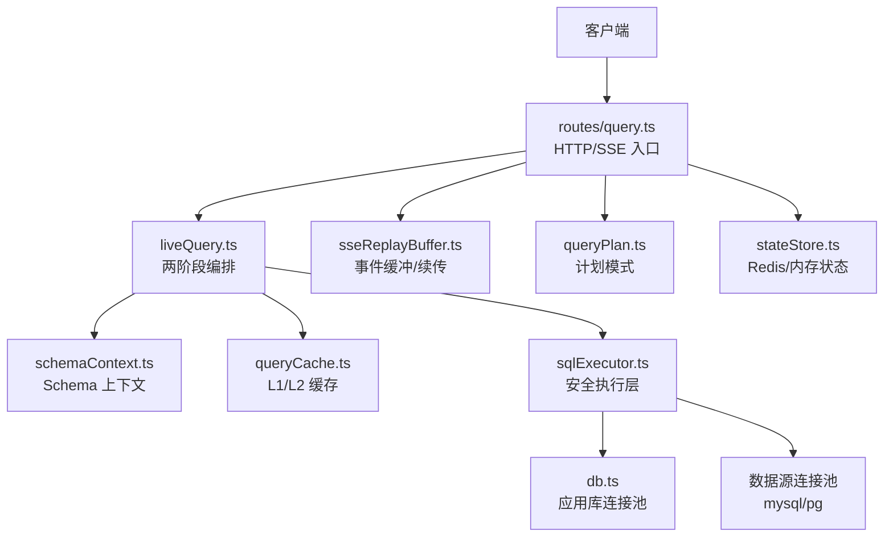

图表来源
- [server/routes/query.ts:47-393](file://server/routes/query.ts#L47-L393)
- [server/query/liveQuery.ts:189-749](file://server/query/liveQuery.ts#L189-L749)
- [server/query/sqlExecutor.ts:734-832](file://server/query/sqlExecutor.ts#L734-L832)
- [server/query/schemaContext.ts:108-172](file://server/query/schemaContext.ts#L108-L172)
- [server/query/queryCache.ts:43-90](file://server/query/queryCache.ts#L43-L90)
- [server/query/sseReplayBuffer.ts:41-84](file://server/query/sseReplayBuffer.ts#L41-L84)
- [server/query/queryPlan.ts:56-100](file://server/query/queryPlan.ts#L56-L100)
- [server/infra/stateStore.ts:169-187](file://server/infra/stateStore.ts#L169-L187)

章节来源
- [server/routes/query.ts:47-393](file://server/routes/query.ts#L47-L393)
- [server/query/liveQuery.ts:189-749](file://server/query/liveQuery.ts#L189-L749)

## 核心组件
- 路由与编排：统一鉴权、限流、审计、SSE、缓存命中、计划模式校验、真实/演示链路分流。
- 两阶段问数：阶段一 LLM 生成 SQL 计划与图表配置；阶段二真实行回喂 LLM 生成解读与 KPI。
- 安全执行层：SELECT-only、表白名单、敏感列拒绝、AST 复核、行级权限注入、EXPLAIN 防线、场景化超时与连接池。
- Schema 上下文：落库 Schema + scope 白名单 + 敏感列过滤 + 摘要生成，5 分钟缓存，跨实例失效。
- 缓存体系：L1 精确归一化键 + L2 embedding 语义命中；支持 Redis 多实例共享。
- SSE 与断线重连：事件入缓冲、按 traceId 续传、终态判定与清理。
- 计划模式：LLM 先生成可执行分析计划，用户批准后一次性消费执行。
- 状态存储：Memory/Redis 双实现，提供 TTL、原子 GETDEL、窗口计数、分布式锁。

章节来源
- [server/routes/query.ts:47-393](file://server/routes/query.ts#L47-L393)
- [server/query/liveQuery.ts:189-749](file://server/query/liveQuery.ts#L189-L749)
- [server/query/sqlExecutor.ts:291-387](file://server/query/sqlExecutor.ts#L291-L387)
- [server/query/schemaContext.ts:108-172](file://server/query/schemaContext.ts#L108-L172)
- [server/query/queryCache.ts:23-90](file://server/query/queryCache.ts#L23-L90)
- [server/query/sseReplayBuffer.ts:41-132](file://server/query/sseReplayBuffer.ts#L41-L132)
- [server/query/queryPlan.ts:56-100](file://server/query/queryPlan.ts#L56-L100)
- [server/infra/stateStore.ts:169-187](file://server/infra/stateStore.ts#L169-L187)

## 架构总览
下图展示一次典型问数的端到端数据流：请求进入路由，进行鉴权/限流/ACL 检查；加载 Schema 上下文并尝试缓存命中；若未命中则进入 liveQuery 编排，并行构建七路上下文，模板匹配优先，否则 LLM 多候选生成；通过 executeSafeSql 安全执行；阶段二解读后写入缓存并返回；SSE 全程推送阶段事件，支持断线续传。

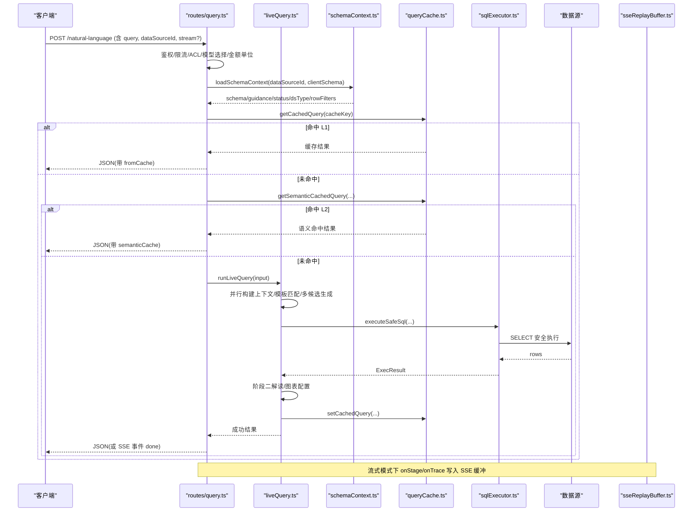

图表来源
- [server/routes/query.ts:47-393](file://server/routes/query.ts#L47-L393)
- [server/query/liveQuery.ts:189-749](file://server/query/liveQuery.ts#L189-L749)
- [server/query/sqlExecutor.ts:734-832](file://server/query/sqlExecutor.ts#L734-L832)
- [server/query/schemaContext.ts:108-172](file://server/query/schemaContext.ts#L108-L172)
- [server/query/queryCache.ts:43-90](file://server/query/queryCache.ts#L43-L90)
- [server/query/sseReplayBuffer.ts:41-84](file://server/query/sseReplayBuffer.ts#L41-L84)

## 详细组件分析

### 用户查询端到端流程（路由编排）
- 输入清洗与模型/金额单位白名单校验。
- 并发槽获取（同用户串行化昂贵 LLM 调用）。
- Schema 上下文加载（落库 schema + scope + 敏感列过滤 + 5min 缓存）。
- 缓存命中（L1 精确 + L2 语义）直接返回。
- 真实链路：runLiveQuery 编排，SSE 阶段事件推送。
- 失败降级：演示模式兜底，审计留痕。

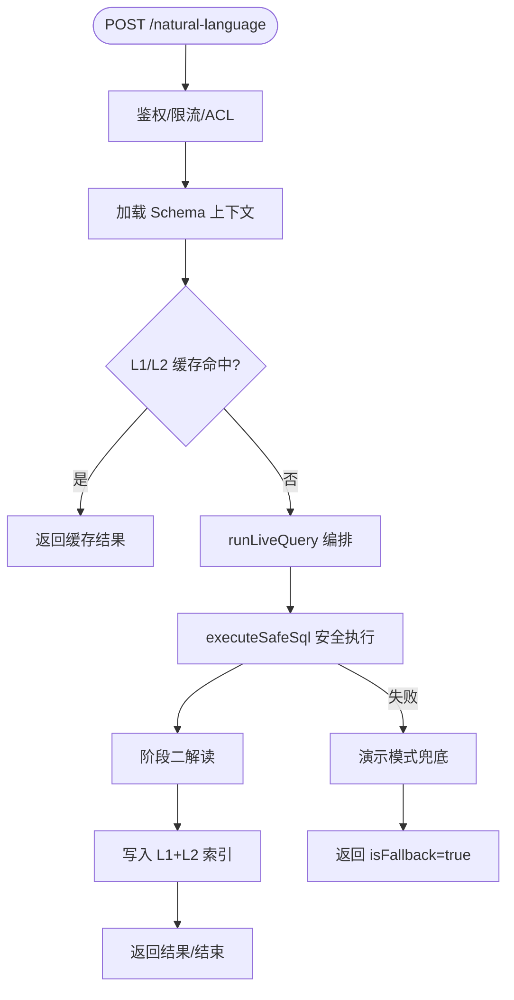

图表来源
- [server/routes/query.ts:47-393](file://server/routes/query.ts#L47-L393)
- [server/query/liveQuery.ts:189-749](file://server/query/liveQuery.ts#L189-L749)
- [server/query/queryCache.ts:43-90](file://server/query/queryCache.ts#L43-L90)

章节来源
- [server/routes/query.ts:47-393](file://server/routes/query.ts#L47-L393)

### 意图识别与上下文构建（liveQuery）
- 并行构建七路上下文：few-shot、知识库 RAG、外部知识库、指标层、反例、个人对话沉淀、铁律规则。
- 宽表列裁剪与模板匹配优先（确定性拼装零偏差兜底）。
- 多候选并行生成 + 多数表决择优；澄清/拒答竞速返回。
- 数据自省（可选）：轻量中间 SQL 确认取值后再最终生成。

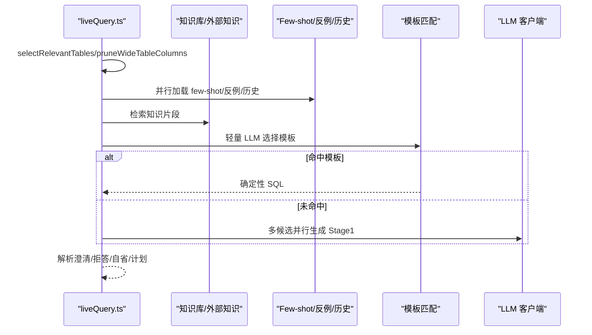

图表来源
- [server/query/liveQuery.ts:210-507](file://server/query/liveQuery.ts#L210-L507)
- [server/query/liveQueryParsers.ts:32-114](file://server/query/liveQueryParsers.ts#L32-L114)

章节来源
- [server/query/liveQuery.ts:210-507](file://server/query/liveQuery.ts#L210-L507)
- [server/query/liveQueryParsers.ts:32-114](file://server/query/liveQueryParsers.ts#L32-L114)

### SQL 安全执行器（sqlExecutor）
- 安全校验：仅 SELECT、单语句、长度限制、关键字黑名单、表名白名单、敏感列拒绝、AST 复核。
- 行级权限注入：AST 包裹派生表强制注入谓词，递归覆盖子查询/CTE/UNION。
- EXPLAIN 防线：预估扫描行数超阈值拦截，fail-open 不阻断正常查询。
- 连接池：按数据源 ID + 场景分级（interactive/chain/export），容量公式化与场景超时。
- MySQL 执行时限注入：MAX_EXECUTION_TIME hint 精准定位主 SELECT。

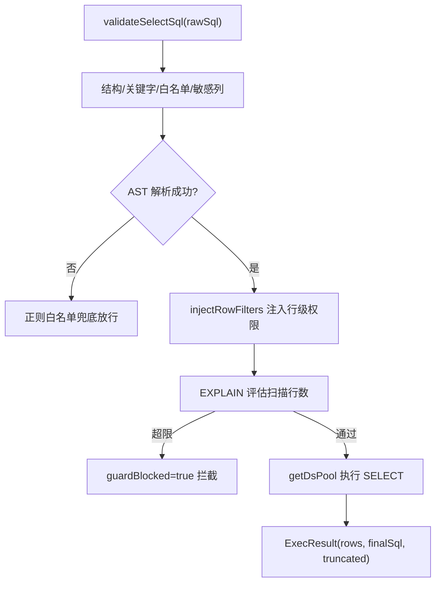

图表来源
- [server/query/sqlExecutor.ts:291-387](file://server/query/sqlExecutor.ts#L291-L387)
- [server/query/sqlExecutor.ts:396-489](file://server/query/sqlExecutor.ts#L396-L489)
- [server/query/sqlExecutor.ts:629-662](file://server/query/sqlExecutor.ts#L629-L662)
- [server/query/sqlExecutor.ts:686-726](file://server/query/sqlExecutor.ts#L686-L726)

章节来源
- [server/query/sqlExecutor.ts:291-387](file://server/query/sqlExecutor.ts#L291-L387)
- [server/query/sqlExecutor.ts:396-489](file://server/query/sqlExecutor.ts#L396-L489)
- [server/query/sqlExecutor.ts:629-662](file://server/query/sqlExecutor.ts#L629-L662)
- [server/query/sqlExecutor.ts:686-726](file://server/query/sqlExecutor.ts#L686-L726)

### Schema 上下文管理（schemaContext）
- 元数据提取：从 data_sources 读取 schema_json/scope_json/status/type/allow_introspection/config_json。
- 权限与脱敏：applyDataScope(scope) + filterSensitiveColumns(sensitiveRemoved)。
- 摘要生成：summarizeSchema 用于 prompt 注入。
- 缓存策略：5 分钟 TTL，StateStore 支持 Redis 多实例共享；变更时 invalidateSchemaCache 广播失效。
- 文件数据源：已落物理表的文件型走真实执行链路（isLiveCapableType）。

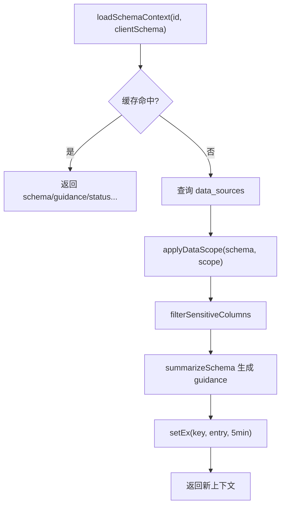

图表来源
- [server/query/schemaContext.ts:108-172](file://server/query/schemaContext.ts#L108-L172)

章节来源
- [server/query/schemaContext.ts:108-172](file://server/query/schemaContext.ts#L108-L172)

### 结果缓存与语义命中（queryCache）
- L1 精确命中：normalizeQuestion 归一化问题，cacheKey 包含 dataSourceId 与模型/金额变体。
- L2 语义命中：embedding 相似度 ≥ 阈值（默认 0.95），命中后二次校验 L1 条目仍存在。
- 容量与 TTL：内存 Map 最大 200 条，Redis 模式按前缀批量删除；写失败 fail-open。
- 失效策略：数据源变更后按前缀清理 qc:/qcidx: 键。

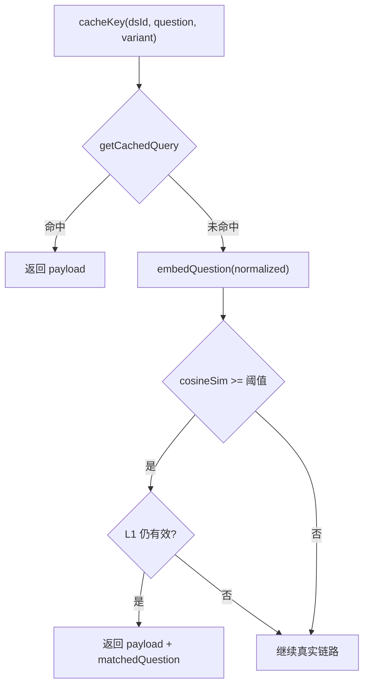

图表来源
- [server/query/queryCache.ts:23-90](file://server/query/queryCache.ts#L23-L90)
- [server/query/queryCache.ts:168-253](file://server/query/queryCache.ts#L168-L253)

章节来源
- [server/query/queryCache.ts:23-90](file://server/query/queryCache.ts#L23-L90)
- [server/query/queryCache.ts:168-253](file://server/query/queryCache.ts#L168-L253)

### 实时查询与 SSE 断线重连（liveQuery + sseReplayBuffer）
- 流式事件：onStage/onTrace 将阶段事件写入 SSE 缓冲（分配单调递增 seq）。
- 断线续传：GET /stream-replay/:traceId 支持 Last-Event-ID/after，回放存量并订阅增量，直到终态。
- 终态集合：done/clarify/refuse/error；进行中保留 30 分钟，终态保留 10 分钟。
- 防刷屏：单 trace 最多 500 条事件。

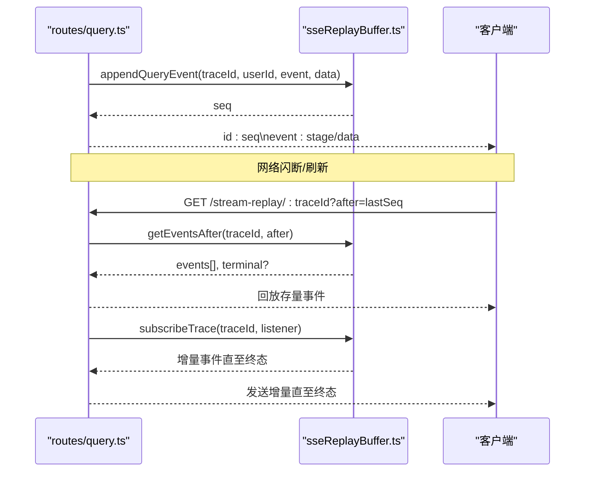

图表来源
- [server/routes/query.ts:118-153](file://server/routes/query.ts#L118-L153)
- [server/routes/query.ts:397-456](file://server/routes/query.ts#L397-L456)
- [server/query/sseReplayBuffer.ts:41-132](file://server/query/sseReplayBuffer.ts#L41-L132)

章节来源
- [server/routes/query.ts:118-153](file://server/routes/query.ts#L118-L153)
- [server/routes/query.ts:397-456](file://server/routes/query.ts#L397-L456)
- [server/query/sseReplayBuffer.ts:41-132](file://server/query/sseReplayBuffer.ts#L41-L132)

### 计划模式（queryPlan）
- 生成：LLM 输出结构化分析计划（理解、步骤、相关表、复杂度）。
- 存储：内存 Map 或 Redis（TTL 10 分钟），一次性消费防重放。
- 消费：校验过期、越权、数据源匹配，成功后删除条目。

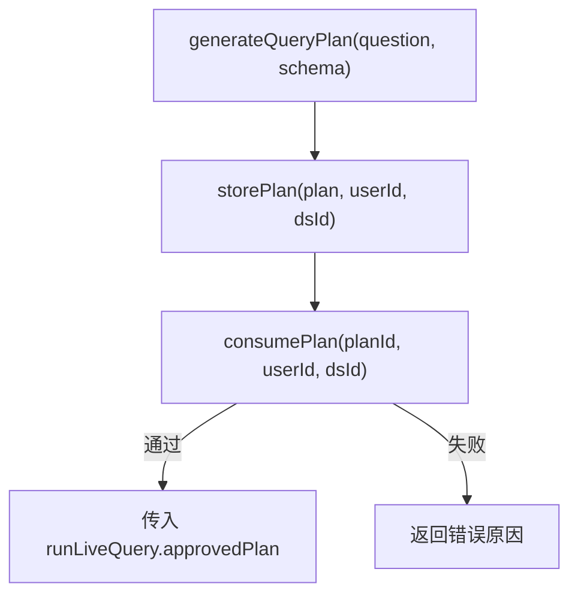

图表来源
- [server/query/queryPlan.ts:56-100](file://server/query/queryPlan.ts#L56-L100)
- [server/query/queryPlan.ts:162-183](file://server/query/queryPlan.ts#L162-L183)

章节来源
- [server/query/queryPlan.ts:56-100](file://server/query/queryPlan.ts#L56-L100)
- [server/query/queryPlan.ts:162-183](file://server/query/queryPlan.ts#L162-L183)

### 状态存储抽象（stateStore）
- MemoryStateStore：单机进程内 Map，适合开发/单实例。
- RedisStateStore：多实例共享，支持 TTL、原子 GETDEL、窗口计数、分布式锁。
- 启动预热：warmStateStore 等待 Redis 就绪，避免冷启动窗口异常。

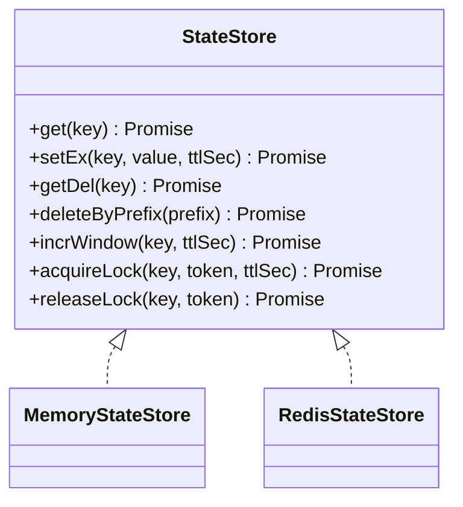

图表来源
- [server/infra/stateStore.ts:10-23](file://server/infra/stateStore.ts#L10-L23)
- [server/infra/stateStore.ts:32-98](file://server/infra/stateStore.ts#L32-L98)
- [server/infra/stateStore.ts:105-163](file://server/infra/stateStore.ts#L105-L163)

章节来源
- [server/infra/stateStore.ts:169-187](file://server/infra/stateStore.ts#L169-L187)

## 依赖关系分析
- routes/query.ts 依赖 liveQuery、schemaContext、queryCache、sqlExecutor、sseReplayBuffer、queryPlan、stateStore、db。
- liveQuery 依赖 schemaLinking、metrics、ironRules、analysisChain、llmClient、queryFeedback、conversationHistory、knowledge。
- sqlExecutor 依赖 db（应用库）、monitoring、secretsCrypto、llmClient（纠偏重试）、node-sql-parser。
- schemaContext 依赖 scope、queryGuard、fileDataSource、stateStore。
- queryCache 依赖 llmClient（embedding）、stateStore。
- sseReplayBuffer 无外部依赖，进程内缓冲。
- queryPlan 依赖 llmClient、stateStore。
- stateStore 依赖 ioredis（可选）。

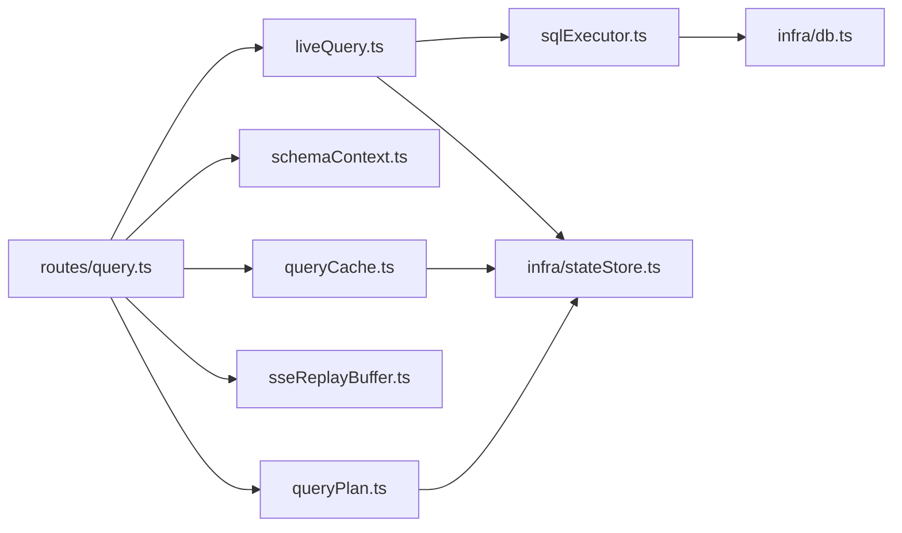

图表来源
- [server/routes/query.ts:17-42](file://server/routes/query.ts#L17-L42)
- [server/query/liveQuery.ts:16-43](file://server/query/liveQuery.ts#L16-L43)
- [server/query/sqlExecutor.ts:11-20](file://server/query/sqlExecutor.ts#L11-L20)
- [server/query/schemaContext.ts:8-16](file://server/query/schemaContext.ts#L8-L16)
- [server/query/queryCache.ts:8-10](file://server/query/queryCache.ts#L8-L10)
- [server/query/queryPlan.ts:7-11](file://server/query/queryPlan.ts#L7-L11)
- [server/infra/stateStore.ts:7-8](file://server/infra/stateStore.ts#L7-L8)

章节来源
- [server/routes/query.ts:17-42](file://server/routes/query.ts#L17-L42)
- [server/query/liveQuery.ts:16-43](file://server/query/liveQuery.ts#L16-L43)
- [server/query/sqlExecutor.ts:11-20](file://server/query/sqlExecutor.ts#L11-L20)
- [server/query/schemaContext.ts:8-16](file://server/query/schemaContext.ts#L8-L16)
- [server/query/queryCache.ts:8-10](file://server/query/queryCache.ts#L8-L10)
- [server/query/queryPlan.ts:7-11](file://server/query/queryPlan.ts#L7-L11)
- [server/infra/stateStore.ts:7-8](file://server/infra/stateStore.ts#L7-L8)

## 性能考虑
- 连接池容量公式化：应用库 pool 按 EXPECTED_CONCURRENT_USERS 推导，数据源池按场景分级（interactive/chain/export）与显式环境变量覆盖。
- 场景化超时：交互 15s、链 120s、导出 60s，MySQL 注入 MAX_EXECUTION_TIME 提示。
- EXPLAIN 防线：预估扫描行数超阈值拦截，保护数据源性能。
- 缓存命中率：L1 精确 + L2 语义命中，减少 LLM 调用与数据库压力。
- 并发控制：同用户串行化昂贵 LLM 调用，避免排队放大延迟。
- 宽表列裁剪与模板匹配：降低 prompt 占用与 LLM 成本，提升稳定性。
- SSE 缓冲：断线重连不重新执行 SQL，降低重复开销。

[本节为通用性能建议，不直接分析具体文件]

## 故障排查指南
- 输入非法/注入特征：路由层 sanitizeQuestion 拒绝，审计记录 DENIED_INPUT。
- 数据源停用：schemaContext 返回 disconnected，路由层 403 拒绝。
- 缓存异常：Redis 读/写失败均 fail-open，不影响主链路；可通过日志观察埋点。
- LLM 不可用：阶段一/二失败走降级路径（演示模式或规则化解读），审计记录 FALLBACK/ERROR。
- EXPLAIN 拦截：reason 包含收窄指引，可在前端提示用户增加筛选条件。
- 行级权限注入失败：fail-closed 拒绝执行，需检查谓词合法性与 AST 重写。
- SSE 续传失败：traceId 不存在或过期返回 404，前端应降级为完整重试。

章节来源
- [server/routes/query.ts:70-109](file://server/routes/query.ts#L70-L109)
- [server/query/schemaContext.ts:134-172](file://server/query/schemaContext.ts#L134-L172)
- [server/query/sqlExecutor.ts:629-662](file://server/query/sqlExecutor.ts#L629-L662)
- [server/query/sqlExecutor.ts:396-489](file://server/query/sqlExecutor.ts#L396-L489)
- [server/routes/query.ts:397-456](file://server/routes/query.ts#L397-L456)

## 结论
本系统通过“路由编排 + 两阶段问数 + 安全执行 + 上下文缓存 + SSE 韧性”的架构，实现了从自然语言到可视化结果的稳定、安全、高性能数据流。Schema 上下文与缓存机制保障一致性与可用性；SQL 执行器以多重防线确保只读与可控扫描；SSE 缓冲与断线重连提升用户体验；计划模式增强复杂分析的可靠性。整体设计兼顾可扩展性（Redis 状态存储、多实例共享）与容错性（fail-open/fail-closed 策略明确）。

[本节为总结性内容，不直接分析具体文件]

## 附录

### 数据流图（不同类型数据处理）
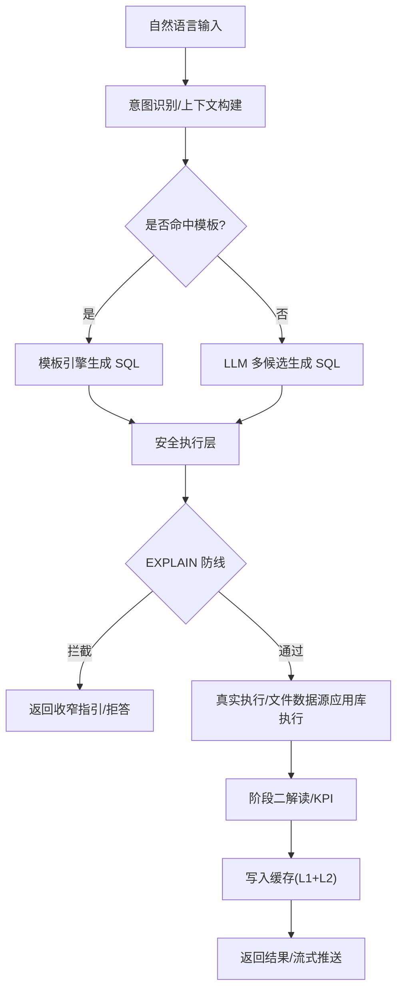

图表来源
- [server/query/liveQuery.ts:359-507](file://server/query/liveQuery.ts#L359-L507)
- [server/query/sqlExecutor.ts:734-832](file://server/query/sqlExecutor.ts#L734-L832)
- [server/query/queryCache.ts:43-90](file://server/query/queryCache.ts#L43-L90)

### 状态转换图（问数生命周期）
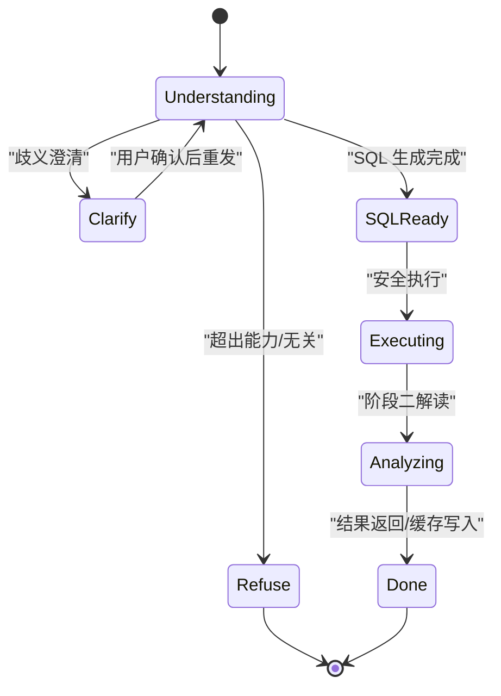

图表来源
- [server/routes/query.ts:118-153](file://server/routes/query.ts#L118-L153)
- [server/query/liveQuery.ts:189-749](file://server/query/liveQuery.ts#L189-L749)