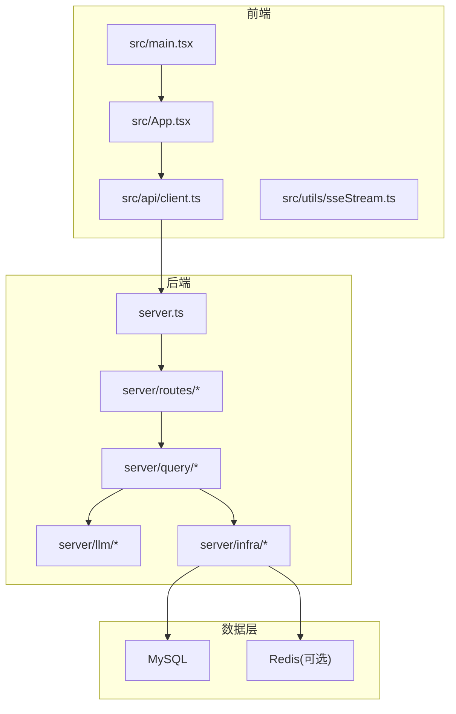
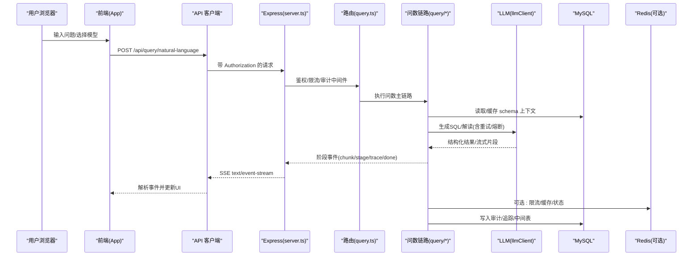
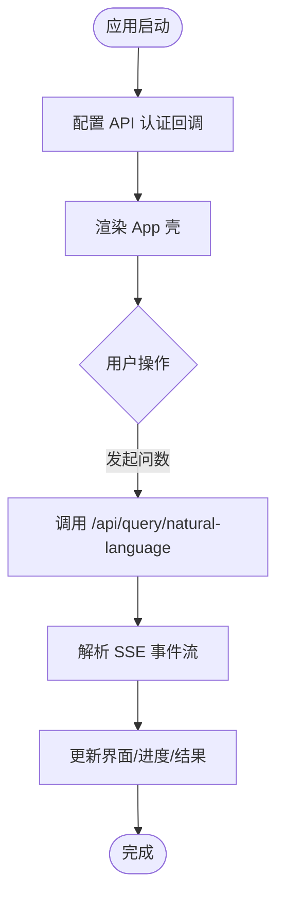
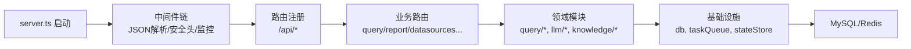
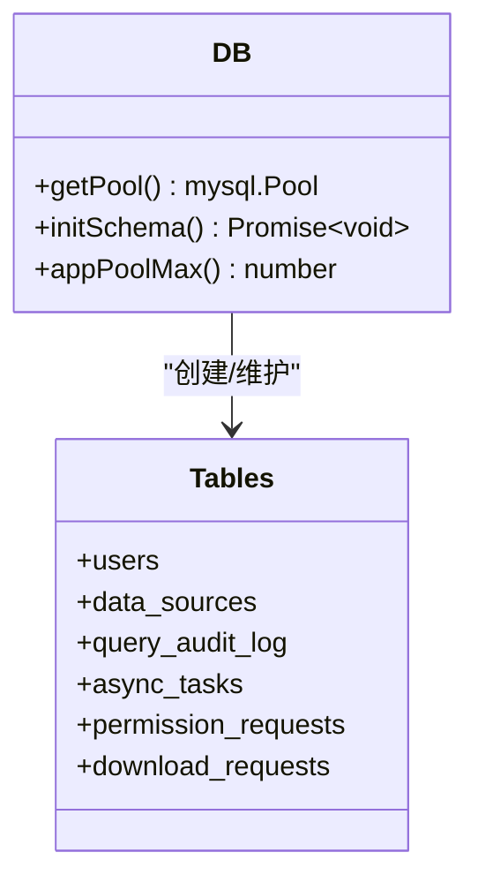
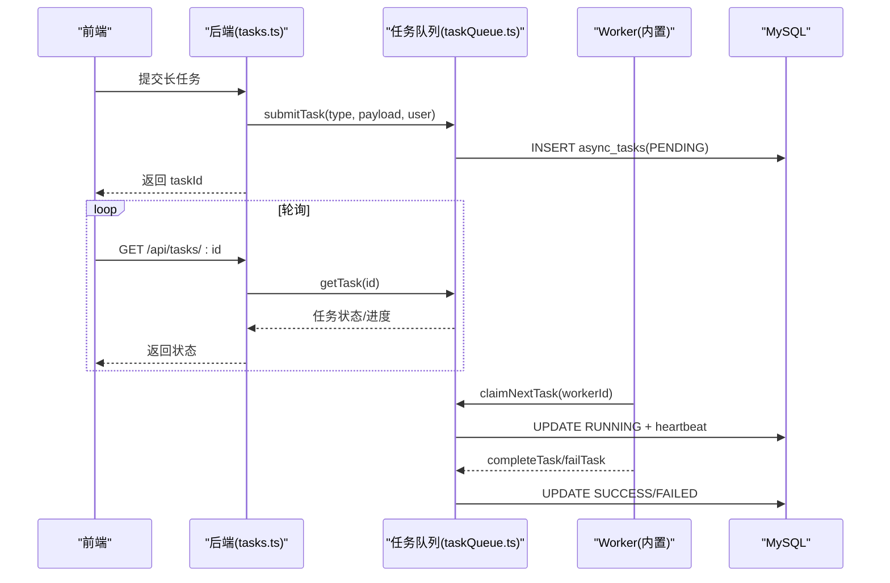
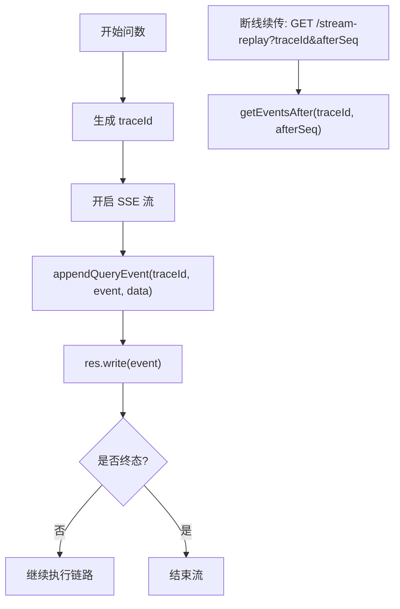
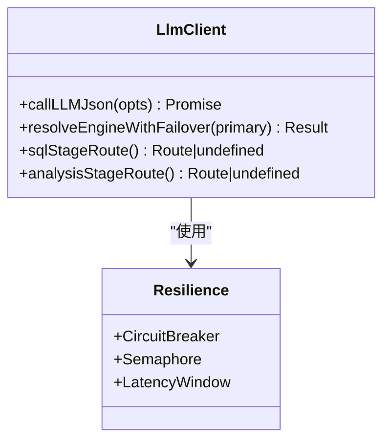
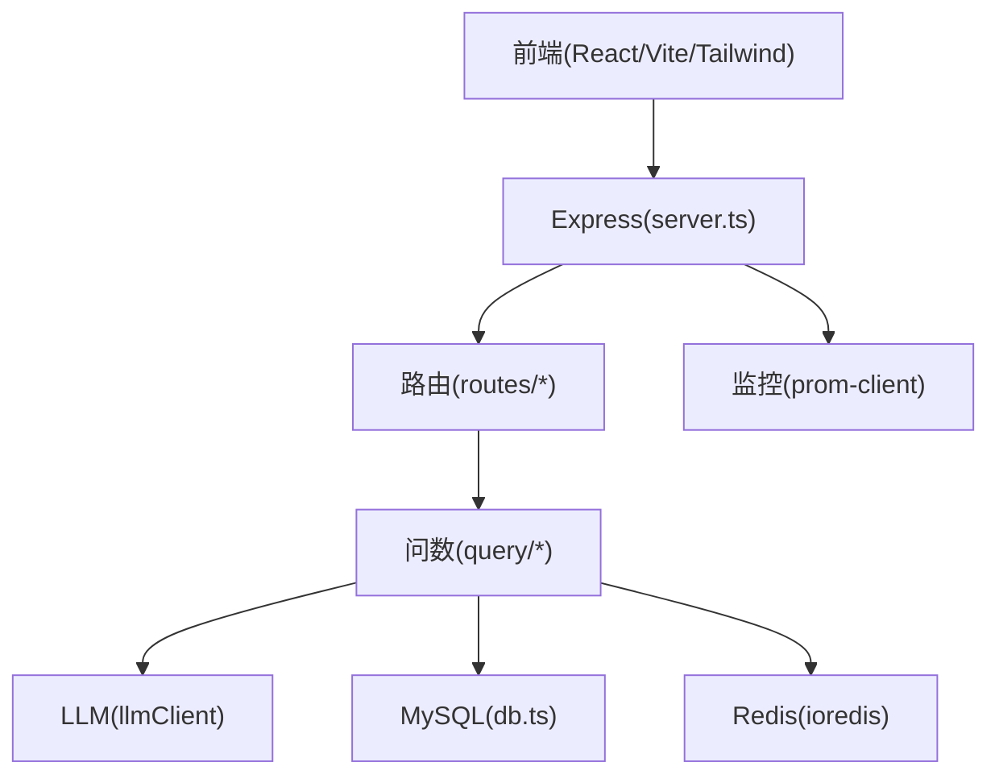
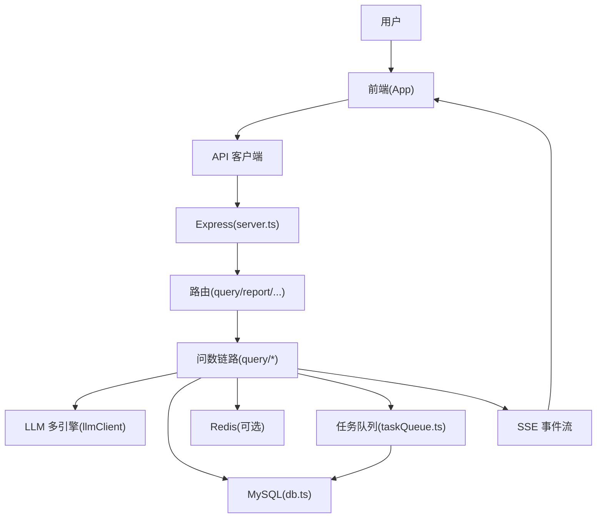

# 整体架构设计

<cite>
**本文引用的文件**
- [server.ts](file://server.ts)
- [package.json](file://package.json)
- [vite.config.ts](file://vite.config.ts)
- [src/main.tsx](file://src/main.tsx)
- [src/App.tsx](file://src/App.tsx)
- [src/api/client.ts](file://src/api/client.ts)
- [src/utils/sseStream.ts](file://src/utils/sseStream.ts)
- [server/routes/query.ts](file://server/routes/query.ts)
- [server/infra/taskQueue.ts](file://server/infra/taskQueue.ts)
- [server/routes/tasks.ts](file://server/routes/tasks.ts)
- [server/query/sseReplayBuffer.ts](file://server/query/sseReplayBuffer.ts)
- [server/llm/llmClient.ts](file://server/llm/llmClient.ts)
- [server/infra/db.ts](file://server/infra/db.ts)
</cite>

## 目录
1. [简介](#简介)
2. [项目结构](#项目结构)
3. [核心组件](#核心组件)
4. [架构总览](#架构总览)
5. [详细组件分析](#详细组件分析)
6. [依赖关系分析](#依赖关系分析)
7. [性能与可扩展性](#性能与可扩展性)
8. [故障排查指南](#故障排查指南)
9. [结论](#结论)
10. [附录：数据流向图](#附录数据流向图)

## 简介
本系统为“智能问数据分析系统”，采用前后端分离架构：前端基于 React + TypeScript + Vite，后端基于 Express + TypeScript，数据库层使用 MySQL（并支持 Redis 作为多实例共享状态）。系统围绕“自然语言问数”主链路，提供实时流式交互、异步任务队列、SSE 断线续传、权限与审计、LLM 多引擎容错等能力。文档重点阐述微服务化设计理念在本单体工程中的解耦策略、事件驱动实现方式（SSE、异步任务、消息处理）、以及从用户请求到数据落库的完整流转过程。

## 项目结构
- 前端（src）
  - 入口与路由：main.tsx、App.tsx
  - API 客户端：api/client.ts（统一注入鉴权、错误处理）
  - SSE 工具：utils/sseStream.ts（解析 text/event-stream）
- 后端（server）
  - 应用启动与中间件：server.ts（Express 初始化、安全头、监控、路由挂载、静态资源）
  - 业务路由：routes/*（query、report、datasources、admin、tasks 等）
  - 基础设施：infra/*（db、taskQueue、stateStore、monitoring、logger、rateLimiter 等）
  - 领域模块：query/*（liveQuery、sqlExecutor、schemaContext、sseReplayBuffer 等）、llm/*（llmClient、llmResilience 等）、auth/*、knowledge/*、report/*
- 构建与运行
  - package.json：脚本定义 dev/build/start；依赖 Express、React、Vite、mysql2、ioredis、prom-client 等
  - vite.config.ts：插件、别名、HMR、测试排除

图表来源
- [server.ts:82-296](file://server.ts#L82-L296)
- [src/main.tsx:10-26](file://src/main.tsx#L10-L26)
- [src/App.tsx:19-103](file://src/App.tsx#L19-L103)
- [src/api/client.ts:20-74](file://src/api/client.ts#L20-L74)
- [src/utils/sseStream.ts:37-116](file://src/utils/sseStream.ts#L37-L116)

章节来源
- [server.ts:82-296](file://server.ts#L82-L296)
- [package.json:6-24](file://package.json#L6-L24)
- [vite.config.ts:10-41](file://vite.config.ts#L10-L41)

## 核心组件
- 前端应用
  - 组合根 main.tsx：注入认证能力到 API 客户端，渲染 App
  - 应用壳 App.tsx：Tab 路由、角色守卫、懒加载页面
  - 统一 API 客户端：自动携带 Bearer Token、401/403 处理
  - SSE 流解析：按 event/data/id 分段解析，支持 chunk 打字机效果与终端事件
- 后端服务
  - server.ts：Express 应用装配、安全响应头、CSP、监控埋点、路由挂载、静态资源、健康检查
  - 路由层：按业务域拆分（query、report、datasources、admin、tasks 等），统一鉴权与限流
  - 基础设施：数据库连接池与建表、任务队列、状态存储（Redis）、日志与监控、限流、审计
  - 领域模块：问数链路（liveQuery/simulatedQuery/sqlExecutor/schemaContext）、LLM 多引擎与韧性、知识库、报告导出等
- 数据层
  - MySQL：用户、数据源、审计、任务、报表等持久化
  - Redis（可选）：多实例共享状态（限流、缓存、会话等）

章节来源
- [src/main.tsx:10-26](file://src/main.tsx#L10-L26)
- [src/App.tsx:19-103](file://src/App.tsx#L19-L103)
- [src/api/client.ts:20-74](file://src/api/client.ts#L20-L74)
- [src/utils/sseStream.ts:37-116](file://src/utils/sseStream.ts#L37-L116)
- [server.ts:82-296](file://server.ts#L82-L296)
- [server/infra/db.ts:52-200](file://server/infra/db.ts#L52-L200)
- [server/infra/taskQueue.ts:1-200](file://server/infra/taskQueue.ts#L1-L200)

## 架构总览
系统采用“前后端分离 + 模块化单体”的架构形态，通过清晰的职责边界与接口契约实现“微服务化理念”的解耦：
- 前端只关注 UI 与交互，通过统一的 API 客户端访问后端
- 后端以 Express 路由为入口，按业务域拆分子模块，内部通过函数/类进行解耦
- 数据层通过连接池管理，关键状态可外置至 Redis 以支持多实例部署
- LLM 调用封装在 llmClient，具备重试、熔断、并发控制与自适应超时
- 长耗时操作走异步任务队列，避免阻塞 HTTP 连接与用户并发槽
- 实时交互通过 SSE 推送阶段事件与 token 级流式内容，并提供断线续传

图表来源
- [server.ts:133-183](file://server.ts#L133-L183)
- [server/routes/query.ts:47-200](file://server/routes/query.ts#L47-L200)
- [server/query/sseReplayBuffer.ts:41-84](file://server/query/sseReplayBuffer.ts#L41-L84)
- [server/llm/llmClient.ts:61-161](file://server/llm/llmClient.ts#L61-L161)
- [server/infra/db.ts:52-70](file://server/infra/db.ts#L52-L70)

## 详细组件分析

### 前端应用（React + TypeScript + Vite）
- 组合根 main.tsx：在应用启动时配置 API 客户端的认证回调，确保后续请求自动携带 Token，并在 401/强制改密时触发登出或跳转
- 应用壳 App.tsx：根据用户角色与 Tab 动态渲染页面，懒加载大组件减少首屏体积
- API 客户端：统一封装 fetch，自动注入 Authorization，处理 401/403 特殊分支
- SSE 工具：解析服务端 text/event-stream，支持 stage、trace、chunk、done/clarify/refuse/error 等事件类型，并记录事件序号用于断线续传

图表来源
- [src/main.tsx:10-26](file://src/main.tsx#L10-L26)
- [src/App.tsx:19-103](file://src/App.tsx#L19-L103)
- [src/api/client.ts:20-74](file://src/api/client.ts#L20-L74)
- [src/utils/sseStream.ts:37-116](file://src/utils/sseStream.ts#L37-L116)

章节来源
- [src/main.tsx:10-26](file://src/main.tsx#L10-L26)
- [src/App.tsx:19-103](file://src/App.tsx#L19-L103)
- [src/api/client.ts:20-74](file://src/api/client.ts#L20-L74)
- [src/utils/sseStream.ts:37-116](file://src/utils/sseStream.ts#L37-L116)

### 后端服务（Express + 模块化路由）
- server.ts：集中负责应用生命周期、中间件链、安全头、监控指标、路由挂载、静态资源与 SPA 回退
- 路由层：按业务域拆分，统一鉴权、限流、审计；例如 query 路由承载自然语言问数主链路
- 基础设施：数据库连接池与建表、任务队列、状态存储、日志与监控、限流、审计
- 领域模块：问数链路（liveQuery/simulatedQuery/sqlExecutor/schemaContext）、LLM 多引擎与韧性、知识库、报告导出等

图表来源
- [server.ts:82-296](file://server.ts#L82-L296)
- [server/routes/query.ts:47-200](file://server/routes/query.ts#L47-L200)
- [server/infra/db.ts:52-200](file://server/infra/db.ts#L52-L200)
- [server/infra/taskQueue.ts:1-200](file://server/infra/taskQueue.ts#L1-L200)

章节来源
- [server.ts:82-296](file://server.ts#L82-L296)
- [server/routes/query.ts:47-200](file://server/routes/query.ts#L47-L200)

### 数据库层（MySQL + 连接池）
- 连接池：启动时创建并绑定数据库，容量公式化（默认按预期并发推导，上下限保护）
- 建表与迁移：幂等建表，包含用户、数据源、审计、任务、下载审批等表
- 查询隔离：各模块通过 getPool() 获取连接，避免全局耦合

图表来源
- [server/infra/db.ts:52-200](file://server/infra/db.ts#L52-L200)

章节来源
- [server/infra/db.ts:52-200](file://server/infra/db.ts#L52-L200)

### 异步任务队列（改进计划 2-1）
- 场景：报告生成、PDF 导出等长耗时任务，提交即返回 taskId，worker 独立并发执行，前端轮询
- 隔离：worker 并发上限、每用户在途任务上限、心跳与孤儿任务恢复
- 持久化：MySQL 表 async_tasks，原子领取（FOR UPDATE SKIP LOCKED）

图表来源
- [server/routes/tasks.ts:27-86](file://server/routes/tasks.ts#L27-L86)
- [server/infra/taskQueue.ts:119-200](file://server/infra/taskQueue.ts#L119-L200)

章节来源
- [server/routes/tasks.ts:27-86](file://server/routes/tasks.ts#L27-L86)
- [server/infra/taskQueue.ts:119-200](file://server/infra/taskQueue.ts#L119-L200)

### SSE 实时推送与断线续传（P2-5）
- 服务端：在问数主链路中按阶段发送事件（stage/trace/chunk/done/clarify/refuse/error），事件先入内存缓冲再写流
- 缓冲：按 traceId 维护事件序列号，终态后保留一段时间供回放
- 客户端：解析 SSE，记录最后事件序号，断线后可通过专用端点续传

图表来源
- [server/routes/query.ts:118-153](file://server/routes/query.ts#L118-L153)
- [server/query/sseReplayBuffer.ts:41-84](file://server/query/sseReplayBuffer.ts#L41-L84)
- [src/utils/sseStream.ts:37-116](file://src/utils/sseStream.ts#L37-L116)

章节来源
- [server/routes/query.ts:118-153](file://server/routes/query.ts#L118-L153)
- [server/query/sseReplayBuffer.ts:41-84](file://server/query/sseReplayBuffer.ts#L41-L84)
- [src/utils/sseStream.ts:37-116](file://src/utils/sseStream.ts#L37-L116)

### LLM 多引擎与韧性（改进计划 2-2）
- 统一通道：封装 Ollama/Gemini/Qwen 调用，支持请求级覆盖、阶段级路由
- 韧性机制：重试、熔断、并发信号量、自适应超时、故障转移
- 用量统计：按引擎/模型/用户聚合，支撑成本对比与审计

图表来源
- [server/llm/llmClient.ts:61-161](file://server/llm/llmClient.ts#L61-L161)
- [server/llm/llmClient.ts:163-200](file://server/llm/llmClient.ts#L163-L200)

章节来源
- [server/llm/llmClient.ts:61-161](file://server/llm/llmClient.ts#L61-L161)
- [server/llm/llmClient.ts:163-200](file://server/llm/llmClient.ts#L163-L200)

## 依赖关系分析
- 前端依赖
  - React + TypeScript：组件化、类型安全
  - Vite：快速构建与 HMR
  - TailwindCSS：样式体系
- 后端依赖
  - Express：HTTP 服务与路由
  - mysql2：数据库连接与查询
  - ioredis：多实例共享状态（可选）
  - prom-client：Prometheus 指标采集
  - jsonwebtoken：JWT 鉴权
- 构建与运行
  - tsx/esbuild：开发/打包
  - vitest/playwright：单元测试与 E2E

图表来源
- [package.json:26-74](file://package.json#L26-L74)
- [server.ts:133-183](file://server.ts#L133-L183)
- [server/infra/db.ts:52-70](file://server/infra/db.ts#L52-L70)

章节来源
- [package.json:26-74](file://package.json#L26-L74)
- [server.ts:133-183](file://server.ts#L133-L183)
- [server/infra/db.ts:52-70](file://server/infra/db.ts#L52-L70)

## 性能与可扩展性
- 连接池与并发
  - 应用库连接池容量公式化，避免过高或过低导致资源争用或瓶颈
  - LLM 调用并发限制与排队，防止打爆本地推理进程
- 限流与配额
  - 用户级频率限制与并发槽控制，保障交互链路稳定性
  - 任务队列用户级在途上限，防止排队风暴
- 缓存与复用
  - Schema 上下文缓存（5min），减少重复开销
  - SSE 事件缓冲与断线续传，降低重算成本
- 多实例扩展
  - Redis 作为共享状态（限流、缓存、会话），配合粘性会话或网关策略保证 SSE 续传命中
  - 任务队列基于 MySQL 原子领取，天然支持多 worker 实例

[本节为通用指导，不直接分析具体文件]

## 故障排查指南
- 常见问题定位
  - 401/403：检查前端 apiFetch 的 401/403 分支与后端鉴权中间件
  - SSE 断线：确认事件序号记录与续传端点逻辑
  - 任务失败：查看 async_tasks 表的 error 字段与心跳超时
  - LLM 异常：观察熔断与重试日志，必要时切换备用引擎
- 日志与指标
  - 请求日志与 Prometheus 指标（/metrics）
  - 审计日志（query_audit_log）用于全链路回溯

章节来源
- [src/api/client.ts:48-74](file://src/api/client.ts#L48-L74)
- [server/query/sseReplayBuffer.ts:111-132](file://server/query/sseReplayBuffer.ts#L111-L132)
- [server/infra/taskQueue.ts:177-200](file://server/infra/taskQueue.ts#L177-L200)
- [server/llm/llmClient.ts:61-161](file://server/llm/llmClient.ts#L61-L161)

## 结论
本系统通过清晰的前后端分层、模块化路由与领域划分，实现了高内聚低耦合的“微服务化理念”。SSE 实时推送与断线续传提升了用户体验，异步任务队列保障了长耗时操作的稳定性，LLM 多引擎与韧性机制增强了系统的鲁棒性。结合 MySQL 连接池与可选 Redis 共享状态，系统在单实例与多实例环境下均具备良好的可扩展性与可运维性。

[本节为总结，不直接分析具体文件]

## 附录：数据流向图

图表来源
- [server.ts:82-296](file://server.ts#L82-L296)
- [server/routes/query.ts:47-200](file://server/routes/query.ts#L47-L200)
- [server/infra/db.ts:52-200](file://server/infra/db.ts#L52-L200)
- [server/infra/taskQueue.ts:119-200](file://server/infra/taskQueue.ts#L119-L200)
- [server/query/sseReplayBuffer.ts:41-84](file://server/query/sseReplayBuffer.ts#L41-L84)
- [src/utils/sseStream.ts:37-116](file://src/utils/sseStream.ts#L37-L116)