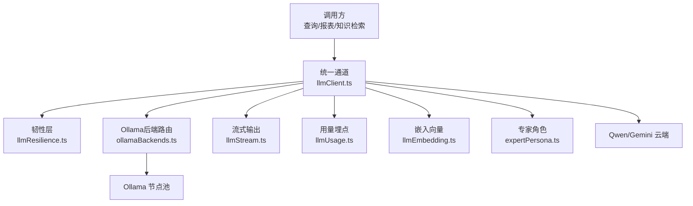
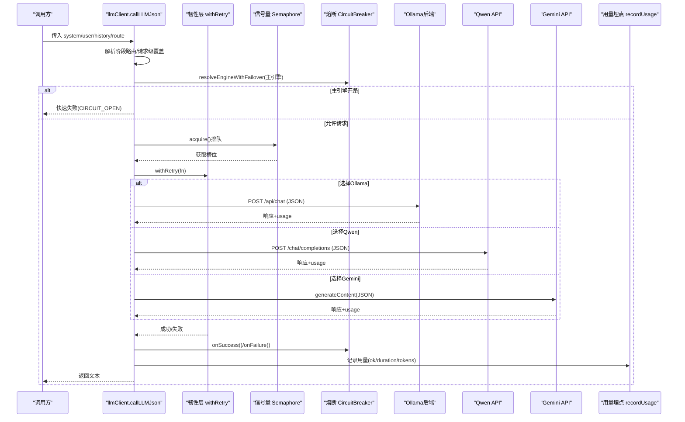
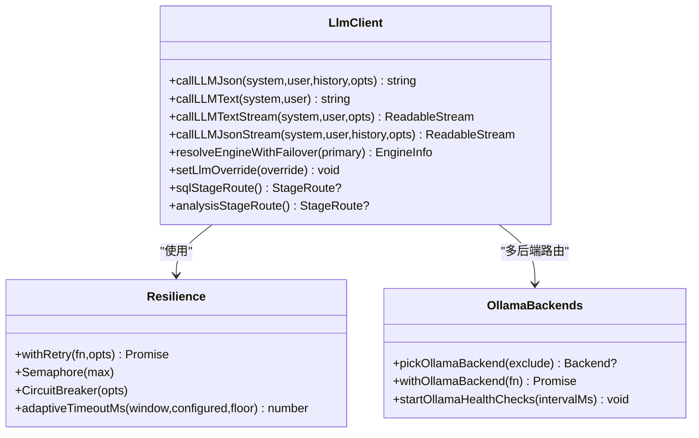
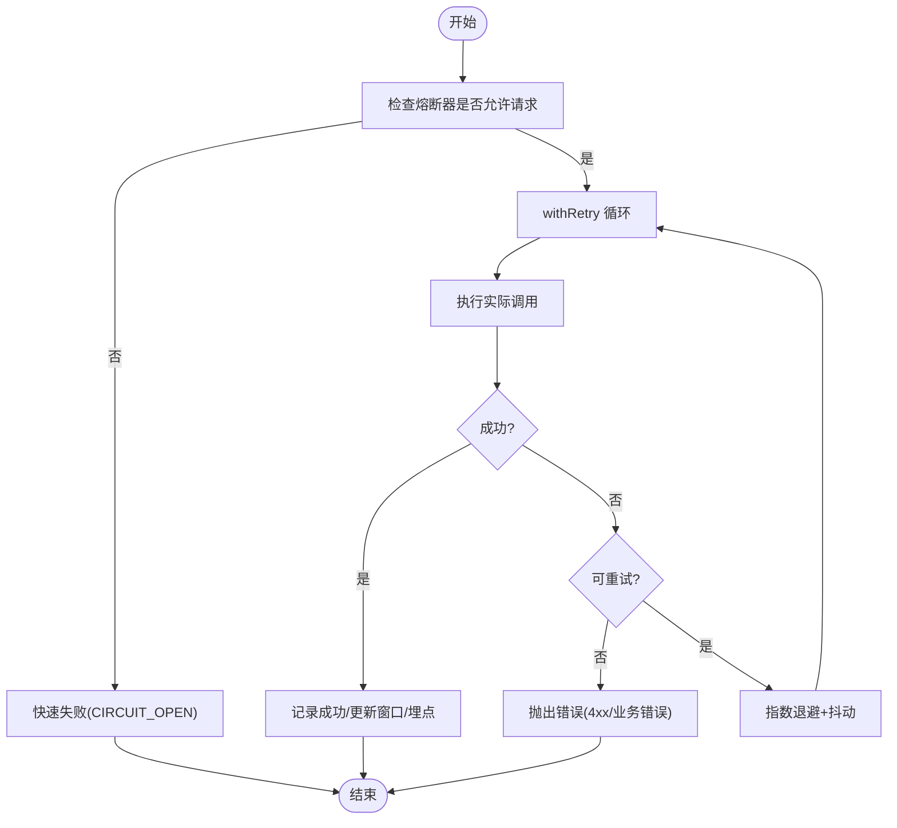
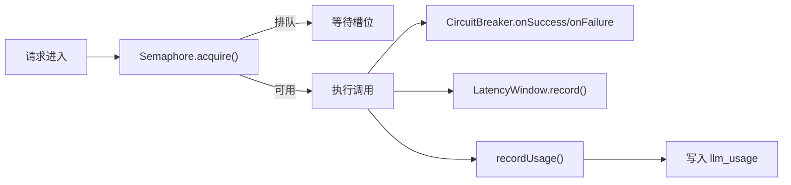
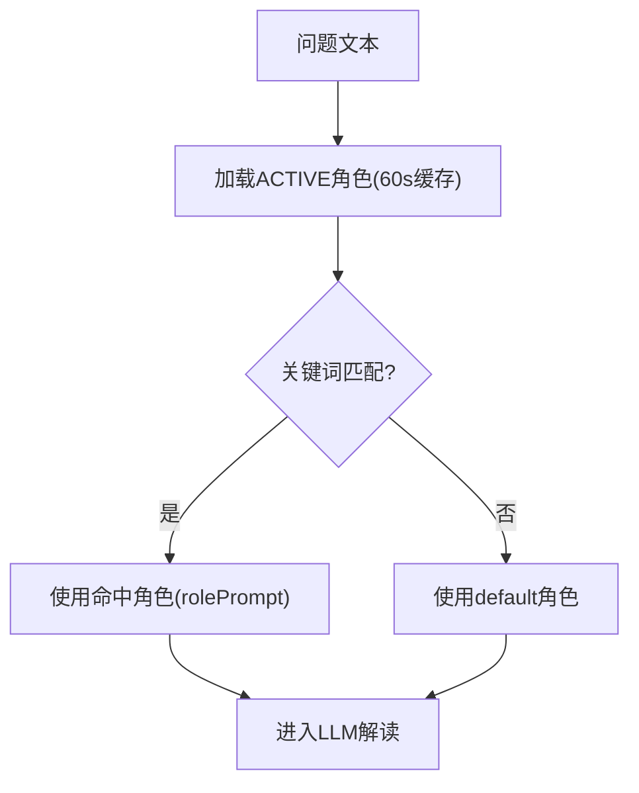
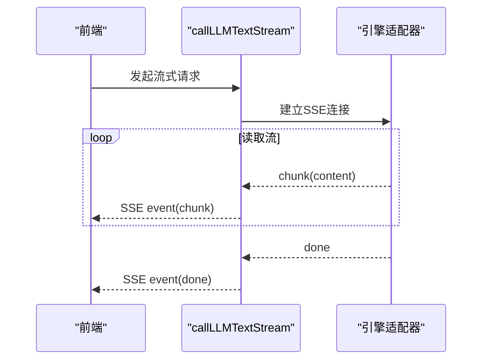
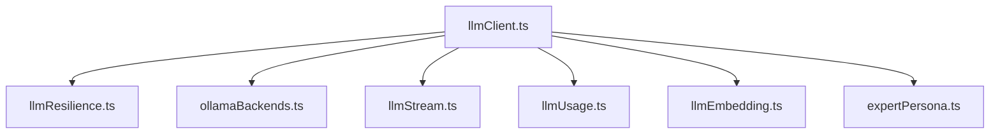

# LLM集成层

<cite>
**本文引用的文件**
- [llmClient.ts](file://server/llm/llmClient.ts)
- [llmResilience.ts](file://server/llm/llmResilience.ts)
- [ollamaBackends.ts](file://server/llm/ollamaBackends.ts)
- [expertPersona.ts](file://server/llm/expertPersona.ts)
- [llmStream.ts](file://server/llm/llmStream.ts)
- [llmUsage.ts](file://server/llm/llmUsage.ts)
- [llmEmbedding.ts](file://server/llm/llmEmbedding.ts)
</cite>

## 目录
1. [简介](#简介)
2. [项目结构](#项目结构)
3. [核心组件](#核心组件)
4. [架构总览](#架构总览)
5. [详细组件分析](#详细组件分析)
6. [依赖关系分析](#依赖关系分析)
7. [性能与限流](#性能与限流)
8. [故障排查指南](#故障排查指南)
9. [结论](#结论)
10. [附录：配置与调用模式](#附录配置与调用模式)

## 简介
本文件面向“智能问数据分析系统”的LLM集成层，系统性阐述多引擎统一抽象（Ollama本地、Gemini云端、通义千问百炼）、熔断降级机制、并发控制与限流、专家角色系统与提示词模板、上下文管理，以及可观测性与成本埋点。文档同时提供配置示例与调用模式，并给出错误处理最佳实践与性能调优建议。

## 项目结构
LLM集成层位于 server/llm 目录，围绕统一通道、韧性原语、后端路由、流式输出、用量统计与嵌入向量等模块组织：
- 统一通道：llmClient.ts（JSON/文本/流式入口、引擎选择、阶段级路由、请求级覆盖）
- 韧性原语：llmResilience.ts（重试、熔断、信号量、自适应超时）
- Ollama后端：ollamaBackends.ts（多后端池、最少并发路由、健康检查）
- 流式输出：llmStream.ts（SSE token级流、JSON流模拟）
- 用量埋点：llmUsage.ts（按引擎/模型/通道/用户落库与聚合）
- 嵌入向量：llmEmbedding.ts（单条/批量embedding、短TTL缓存、回退策略）
- 专家角色：expertPersona.ts（内置角色、关键词匹配、数据库持久化与版本同步）

图表来源
- [llmClient.ts:1-606](file://server/llm/llmClient.ts#L1-L606)
- [llmResilience.ts:1-245](file://server/llm/llmResilience.ts#L1-L245)
- [ollamaBackends.ts:1-143](file://server/llm/ollamaBackends.ts#L1-L143)
- [llmStream.ts:1-300](file://server/llm/llmStream.ts#L1-L300)
- [llmUsage.ts:1-134](file://server/llm/llmUsage.ts#L1-L134)
- [llmEmbedding.ts:1-317](file://server/llm/llmEmbedding.ts#L1-L317)
- [expertPersona.ts:1-329](file://server/llm/expertPersona.ts#L1-L329)

章节来源
- [llmClient.ts:1-606](file://server/llm/llmClient.ts#L1-L606)
- [llmResilience.ts:1-245](file://server/llm/llmResilience.ts#L1-L245)
- [ollamaBackends.ts:1-143](file://server/llm/ollamaBackends.ts#L1-L143)
- [llmStream.ts:1-300](file://server/llm/llmStream.ts#L1-L300)
- [llmUsage.ts:1-134](file://server/llm/llmUsage.ts#L1-L134)
- [llmEmbedding.ts:1-317](file://server/llm/llmEmbedding.ts#L1-L317)
- [expertPersona.ts:1-329](file://server/llm/expertPersona.ts#L1-L329)

## 核心组件
- 统一通道（callLLMJson/callLLMText/callLLMTextStream/callLLMJsonStream）
  - 引擎选择优先级：请求级覆盖 > 阶段级路由 > AI_ENGINE显式 > 密钥存在性自动 > ollama默认
  - 支持JSON结构化输出与纯文本输出；流式SSE逐字推送
- 韧性原语（withRetry/CircuitBreaker/Semaphore/adaptiveTimeoutMs）
  - 指数退避重试（仅对可恢复错误）
  - 引擎级熔断（连续失败开路，冷却期半开探测）
  - 每引擎并发信号量（默认4，避免打爆本地推理进程）
  - 自适应超时（P95×3动态收紧配置上限）
- Ollama多后端（pickOllamaBackend/withOllamaBackend/startOllamaHealthChecks）
  - 最少并发路由、失败摘除、健康检查恢复
- 专家角色（resolveExpertPersonaAsync/BUILTIN_PERSONAS/syncBuiltinPersonaContent）
  - 关键词匹配路由、60s内存缓存、启动时内容版本同步
- 用量埋点（recordLlmUsage/summarizeLlmUsageByUser）
  - 按引擎/模型/通道/用户记录token与耗时，Prometheus旁路埋点
- 嵌入向量（callEmbedding/callEmbeddingBatch）
  - 单条/批量、短TTL缓存、Ollama/Qwen/Gemini适配与回退

章节来源
- [llmClient.ts:61-246](file://server/llm/llmClient.ts#L61-L246)
- [llmResilience.ts:12-245](file://server/llm/llmResilience.ts#L12-L245)
- [ollamaBackends.ts:11-143](file://server/llm/ollamaBackends.ts#L11-L143)
- [expertPersona.ts:45-246](file://server/llm/expertPersona.ts#L45-L246)
- [llmUsage.ts:1-134](file://server/llm/llmUsage.ts#L1-L134)
- [llmEmbedding.ts:21-317](file://server/llm/llmEmbedding.ts#L21-L317)

## 架构总览
下图展示一次JSON调用从入口到各后端的完整流程，包括熔断转移、重试、用量埋点与自适应超时。

图表来源
- [llmClient.ts:449-525](file://server/llm/llmClient.ts#L449-L525)
- [llmResilience.ts:162-197](file://server/llm/llmResilience.ts#L162-L197)
- [ollamaBackends.ts:74-96](file://server/llm/ollamaBackends.ts#L74-L96)

## 详细组件分析

### 统一通道与多引擎抽象
- 引擎选择与覆盖
  - 请求级覆盖：setLlmOverride在异步上下文中注入engine/model/userId/username，跨层透传
  - 阶段级路由：sqlStageRoute/analysisStageRoute通过环境变量启用快速小模型
  - 默认引擎：AI_ENGINE显式指定或根据密钥存在性自动选择，否则回退Ollama
- JSON/文本/流式接口
  - callLLMJson：强制JSON输出，适合SQL生成/结构化任务
  - callLLMText：纯文本输出，适合解释/优化建议
  - callLLMTextStream：SSE token级流，打字机体验
  - callLLMJsonStream：先完整结果再分块推送（简化实现）
- 引擎适配
  - Ollama：/api/chat，keep_alive=30m，format=json
  - Qwen：OpenAI兼容 /chat/completions，response_format=json_object
  - Gemini：SDK generateContent/generateContentStream，systemInstruction/responseMimeType

图表来源
- [llmClient.ts:163-246](file://server/llm/llmClient.ts#L163-L246)
- [llmResilience.ts:51-245](file://server/llm/llmResilience.ts#L51-L245)
- [ollamaBackends.ts:43-96](file://server/llm/ollamaBackends.ts#L43-L96)

章节来源
- [llmClient.ts:163-525](file://server/llm/llmClient.ts#L163-L525)
- [llmStream.ts:35-270](file://server/llm/llmStream.ts#L35-L270)

### 熔断降级机制
- 故障检测
  - 提取HTTP状态码或网络错误，区分可重试（超时/5xx/429/网络错误）与不可重试（4xx鉴权/参数错误）
- 自动切换
  - 主引擎连续失败达到阈值后开路，自动切换到已配置且未开路的备用引擎（如Ollama→Qwen→Gemini）
  - 全部开路时快速失败，防止雪崩
- 重试策略
  - 指数退避+抖动，避免多实例同频重试
  - 最大重试次数可配（默认2），仅对可恢复错误生效
- 自适应超时
  - 基于近期成功调用P95×3动态收紧配置上限，保护慢模型不被误杀、快模型不被长超时拖死

图表来源
- [llmResilience.ts:42-49](file://server/llm/llmResilience.ts#L42-L49)
- [llmResilience.ts:162-197](file://server/llm/llmResilience.ts#L162-L197)
- [llmClient.ts:125-161](file://server/llm/llmClient.ts#L125-L161)

章节来源
- [llmResilience.ts:12-245](file://server/llm/llmResilience.ts#L12-L245)
- [llmClient.ts:125-161](file://server/llm/llmClient.ts#L125-L161)

### 并发控制与限流算法
- 请求队列管理
  - 每引擎独立信号量，默认并发上限4，超出排队等待而非丢弃
  - 释放函数务必finally调用，避免资源泄漏
- 资源隔离
  - 每个引擎独立的熔断器与延迟窗口，互不影响
  - Ollama多后端最少并发路由，失败摘除并健康检查恢复
- 性能监控
  - 每次调用记录durationMs、tokens、ok标志，支持按引擎/模型/通道/用户聚合
  - Prometheus旁路埋点，失败不阻断主链路

图表来源
- [llmResilience.ts:51-88](file://server/llm/llmResilience.ts#L51-L88)
- [llmResilience.ts:201-245](file://server/llm/llmResilience.ts#L201-L245)
- [llmUsage.ts:25-50](file://server/llm/llmUsage.ts#L25-L50)

章节来源
- [llmResilience.ts:51-245](file://server/llm/llmResilience.ts#L51-L245)
- [llmUsage.ts:25-134](file://server/llm/llmUsage.ts#L25-L134)
- [ollamaBackends.ts:43-96](file://server/llm/ollamaBackends.ts#L43-L96)

### 专家角色系统
- 角色定义
  - 内置角色：风险、客户、财务、不良资产从业者、默认金融数据分析师
  - 字段：key、label、keywords、rolePrompt、sortOrder、status、isBuiltin
- 提示词模板
  - 每个角色包含明确的解读维度与输出要求，强调术语与数据佐证
- 上下文管理
  - 关键词匹配：按sortOrder升序匹配，首个命中生效；default兜底不参与匹配
  - 60s内存缓存，写操作即时失效；库不可用回退内置常量
  - 启动时版本同步：BUILTIN_PERSONA_CONTENT_VERSION升级时一次性刷新内置角色内容

图表来源
- [expertPersona.ts:128-212](file://server/llm/expertPersona.ts#L128-L212)
- [expertPersona.ts:179-190](file://server/llm/expertPersona.ts#L179-L190)

章节来源
- [expertPersona.ts:45-246](file://server/llm/expertPersona.ts#L45-L246)

### 流式输出与SSE
- 文本流：callLLMTextStream按token推送SSE事件，支持Qwen/Ollama/Gemini
- JSON流：callLLMJsonStream先获取完整结果再分块推送（简化实现）
- 超时与错误：AbortController统一超时，异常以error帧通知前端

图表来源
- [llmStream.ts:35-270](file://server/llm/llmStream.ts#L35-L270)

章节来源
- [llmStream.ts:35-270](file://server/llm/llmStream.ts#L35-L270)

### 嵌入向量与缓存
- 单条/批量：callEmbedding/callEmbeddingBatch，支持Ollama/Qwen/Gemini
- 短TTL缓存：同一文本+角色+引擎的向量复用，减少重复调用
- 回退策略：Ollama老版本端点回退；未安装embedding模型时调用方降级为关键词检索

章节来源
- [llmEmbedding.ts:21-317](file://server/llm/llmEmbedding.ts#L21-L317)

## 依赖关系分析
- 耦合与内聚
  - llmClient.ts作为统一入口，内聚引擎选择、阶段路由、上下文传递与用量埋点
  - llmResilience.ts提供可复用的韧性原语，低耦合高内聚
  - ollamaBackends.ts专注多后端路由与健康检查，与主通道解耦
  - expertPersona.ts独立于LLM通道，提供角色路由与提示词管理
- 外部依赖
  - @google/genai（Gemini SDK）
  - MySQL（用量与角色存储）
  - Prometheus（旁路埋点）

图表来源
- [llmClient.ts:1-606](file://server/llm/llmClient.ts#L1-L606)

章节来源
- [llmClient.ts:1-606](file://server/llm/llmClient.ts#L1-L606)

## 性能与限流
- 并发上限
  - 每引擎默认4并发，可通过LLM_MAX_CONCURRENT调整
- 重试与超时
  - 最大重试次数LLM_RETRY_MAX（默认2）
  - 自适应超时开关LLM_ADAPTIVE_TIMEOUT（默认开启）
  - Ollama/Qwen超时分别由OLLAMA_TIMEOUT_MS/QWEN_TIMEOUT_MS控制
- 熔断参数
  - 连续失败阈值LLM_BREAKER_FAILS（默认3）
  - 冷却期LLM_BREAKER_COOLDOWN_MS（默认30s）
- 嵌入批大小
  - EMBED_BATCH_SIZE（默认16，上限64）

章节来源
- [llmClient.ts:61-83](file://server/llm/llmClient.ts#L61-L83)
- [ollamaBackends.ts:8-9](file://server/llm/ollamaBackends.ts#L8-L9)
- [llmEmbedding.ts:166-170](file://server/llm/llmEmbedding.ts#L166-L170)

## 故障排查指南
- 常见错误类型
  - TIMEOUT：超过自适应或配置超时，检查模型负载与超时配置
  - CIRCUIT_OPEN：熔断器开路，等待冷却期或检查后端健康
  - 4xx错误：鉴权/参数错误，立即失败不重试，检查API Key与输入格式
- 诊断步骤
  - 查看后端状态：getOllamaBackendStates确认节点健康与inflight
  - 检查熔断状态：CircuitBreaker.consecutiveFailures观察连续失败次数
  - 用量分析：summarizeLlmUsageByUser定位高消耗用户与模型
- 恢复策略
  - 健康检查：startOllamaHealthChecks周期探测被摘除后端
  - 切换引擎：resolveEngineWithFailover自动故障转移
  - 重置状态：测试场景resetLlmResilienceForTest/resetOllamaBackendsForTest

章节来源
- [ollamaBackends.ts:98-143](file://server/llm/ollamaBackends.ts#L98-L143)
- [llmResilience.ts:103-160](file://server/llm/llmResilience.ts#L103-L160)
- [llmUsage.ts:63-134](file://server/llm/llmUsage.ts#L63-L134)

## 结论
本LLM集成层通过统一抽象屏蔽多引擎差异，结合韧性原语保障稳定性，借助专家角色系统提升解读质量，并以完善的埋点与监控支撑成本与性能优化。推荐在生产环境启用自适应超时与熔断，合理设置并发与重试参数，并结合专家角色关键词匹配优化解读效果。

## 附录：配置与调用模式

### 环境变量配置
- 引擎与模型
  - AI_ENGINE：显式指定引擎（ollama/gemini/qwen）
  - LLM_MODEL：Ollama默认模型
  - QWEN_MODEL/QWEN_URL/QWEN_API_KEY：通义千问配置
  - GEMINI_API_KEY：Gemini密钥
- 韧性参数
  - LLM_RETRY_MAX：最大重试次数
  - LLM_MAX_CONCURRENT：每引擎并发上限
  - LLM_BREAKER_FAILS/LLM_BREAKER_COOLDOWN_MS：熔断阈值与冷却期
  - LLM_ADAPTIVE_TIMEOUT：自适应超时开关
- Ollama后端
  - OLLAMA_URL/OLLAMA_URLS：单/多后端地址
  - OLLAMA_TIMEOUT_MS：Ollama超时
- 嵌入向量
  - EMBED_MODEL/QWEN_EMBED_MODEL：嵌入模型
  - EMBED_BATCH_SIZE：批量大小

章节来源
- [llmClient.ts:33-57](file://server/llm/llmClient.ts#L33-L57)
- [llmClient.ts:61-83](file://server/llm/llmClient.ts#L61-L83)
- [ollamaBackends.ts:8-9](file://server/llm/ollamaBackends.ts#L8-L9)
- [llmEmbedding.ts:21-24](file://server/llm/llmEmbedding.ts#L21-L24)

### 调用模式示例
- JSON结构化输出（SQL生成/复杂分析）
  - 使用callLLMJson，传入system提示词、user问题与历史消息
  - 可选阶段路由：sqlStageRoute/analysisStageRoute启用快速小模型
- 纯文本输出（解释/建议）
  - 使用callLLMText，适合非结构化输出场景
- 流式输出（打字机体验）
  - 使用callLLMTextStream，前端订阅SSE事件
  - JSON流：callLLMJsonStream先完整结果再分块推送
- 嵌入向量（语义检索）
  - 单条：callEmbedding(text, role)
  - 批量：callEmbeddingBatch(texts, role)

章节来源
- [llmClient.ts:449-592](file://server/llm/llmClient.ts#L449-L592)
- [llmStream.ts:35-300](file://server/llm/llmStream.ts#L35-L300)
- [llmEmbedding.ts:60-317](file://server/llm/llmEmbedding.ts#L60-L317)

### 错误处理最佳实践
- 区分可重试与不可重试错误，避免无效重试浪费配额
- 捕获TIMEOUT与CIRCUIT_OPEN，向上层返回明确错误码
- 流式输出中通过error帧通知前端，确保用户体验
- 用量埋点fire-and-forget，失败不阻断主链路

章节来源
- [llmResilience.ts:42-49](file://server/llm/llmResilience.ts#L42-L49)
- [llmStream.ts:258-267](file://server/llm/llmStream.ts#L258-L267)
- [llmUsage.ts:25-50](file://server/llm/llmUsage.ts#L25-L50)

### 性能调优建议
- 启用自适应超时，避免固定超时导致的性能波动
- 合理设置并发上限，避免本地Ollama过载
- 利用阶段路由为结构化任务选择快速小模型
- 使用嵌入向量缓存减少重复计算
- 定期分析用量报告，优化模型选择与路由策略

章节来源
- [llmResilience.ts:235-245](file://server/llm/llmResilience.ts#L235-L245)
- [llmClient.ts:163-194](file://server/llm/llmClient.ts#L163-L194)
- [llmEmbedding.ts:26-47](file://server/llm/llmEmbedding.ts#L26-L47)
- [llmUsage.ts:63-134](file://server/llm/llmUsage.ts#L63-L134)