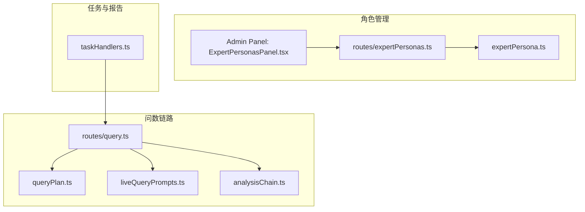
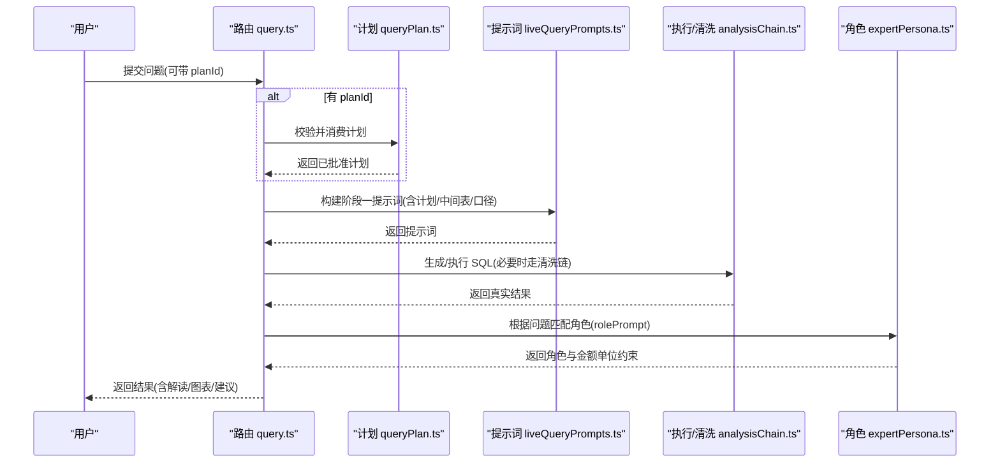
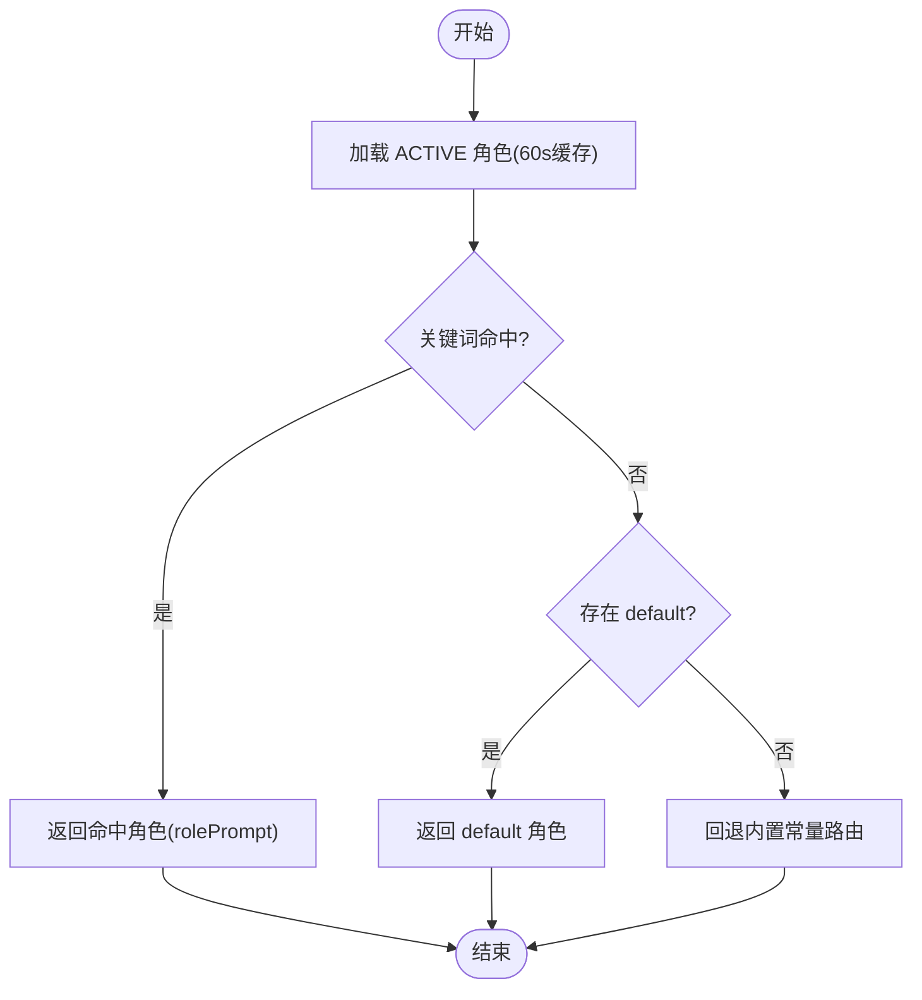
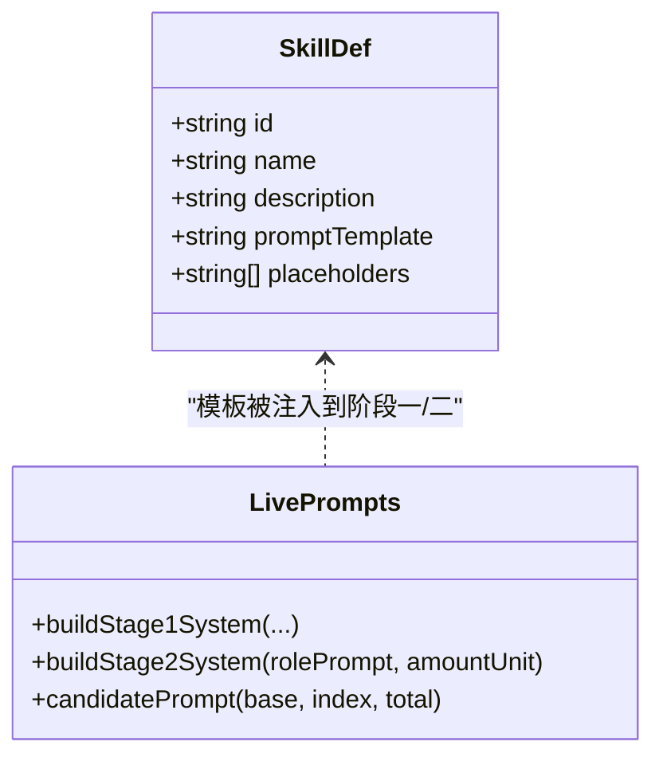
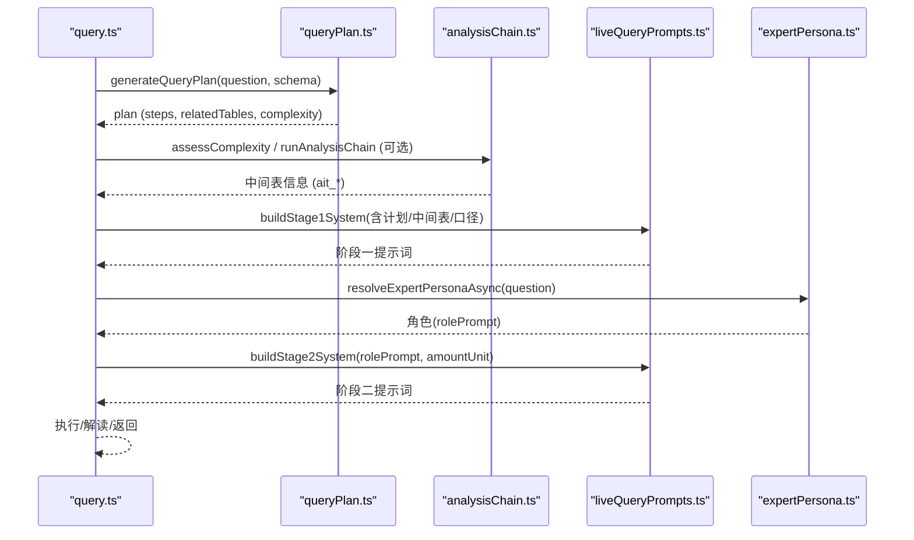
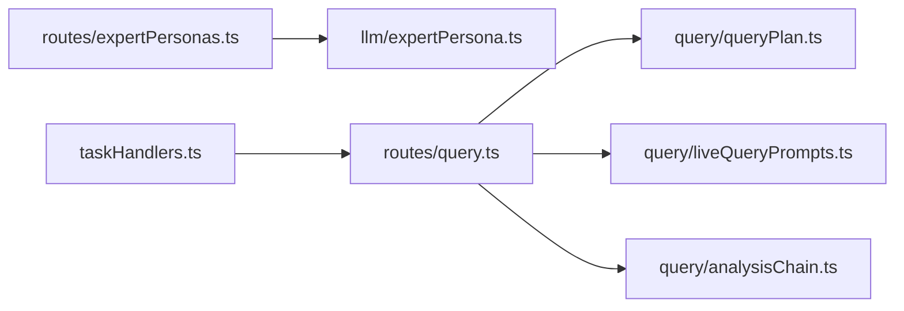

# 专家角色系统

<cite>
**本文引用的文件**
- [expertPersona.ts](file://server/llm/expertPersona.ts)
- [expertPersonas.ts](file://server/routes/expertPersonas.ts)
- [ExpertPersonasPanel.tsx](file://src/components/admin/ExpertPersonasPanel.tsx)
- [liveQueryPrompts.ts](file://server/query/liveQueryPrompts.ts)
- [queryPlan.ts](file://server/query/queryPlan.ts)
- [analysisChain.ts](file://server/query/analysisChain.ts)
- [skills.ts](file://server/skills.ts)
- [query.ts](file://server/routes/query.ts)
- [taskHandlers.ts](file://server/taskHandlers.ts)
</cite>

## 目录
1. [简介](#简介)
2. [项目结构](#项目结构)
3. [核心组件](#核心组件)
4. [架构总览](#架构总览)
5. [详细组件分析](#详细组件分析)
6. [依赖关系分析](#依赖关系分析)
7. [性能与可用性](#性能与可用性)
8. [故障排查指南](#故障排查指南)
9. [结论](#结论)
10. [附录：配置示例与使用场景](#附录配置示例与使用场景)

## 简介
本系统提供“专家角色”能力，用于在智能问数链路中为不同领域问题自动匹配专业视角（如风险、客户、财务、不良资产从业者），并基于角色提示词对真实查询结果进行结构化解读。同时，系统提供提示词模板机制（技能模板）、变量替换与上下文注入，以及“先计划后执行”的任务匹配与优化路径，确保复杂分析的可控性与可解释性。

## 项目结构
围绕专家角色与任务处理的关键模块分布如下：
- 角色定义与管理：后端服务层负责内置角色常量、持久化、缓存与路由；前端管理面板提供可视化维护。
- 提示词模板系统：技能库提供自然语言问题模板与占位符替换；问数链路将角色、业务口径、中间表等上下文注入阶段一/二提示词。
- 任务关联与路由：通过“分析计划”模式生成多步计划，用户批准后携带 planId 执行；复杂清洗链将中间结果物化为应用库中间表供最终 SQL 引用。
- 报告与导出：长任务处理器复用同一套数据源上下文与执行能力，支持异步报告生成与 PDF 导出。

**图表来源**
- [expertPersona.ts:1-329](file://server/llm/expertPersona.ts#L1-L329)
- [expertPersonas.ts:1-70](file://server/routes/expertPersonas.ts#L1-L70)
- [ExpertPersonasPanel.tsx:1-420](file://src/components/admin/ExpertPersonasPanel.tsx#L1-L420)
- [queryPlan.ts:1-184](file://server/query/queryPlan.ts#L1-L184)
- [liveQueryPrompts.ts:1-117](file://server/query/liveQueryPrompts.ts#L1-L117)
- [analysisChain.ts:1-411](file://server/query/analysisChain.ts#L1-L411)
- [query.ts:1-710](file://server/routes/query.ts#L1-L710)
- [taskHandlers.ts:1-198](file://server/taskHandlers.ts#L1-L198)

**章节来源**
- [expertPersona.ts:1-329](file://server/llm/expertPersona.ts#L1-L329)
- [expertPersonas.ts:1-70](file://server/routes/expertPersonas.ts#L1-L70)
- [ExpertPersonasPanel.tsx:1-420](file://src/components/admin/ExpertPersonasPanel.tsx#L1-L420)
- [queryPlan.ts:1-184](file://server/query/queryPlan.ts#L1-L184)
- [liveQueryPrompts.ts:1-117](file://server/query/liveQueryPrompts.ts#L1-L117)
- [analysisChain.ts:1-411](file://server/query/analysisChain.ts#L1-L411)
- [query.ts:1-710](file://server/routes/query.ts#L1-L710)
- [taskHandlers.ts:1-198](file://server/taskHandlers.ts#L1-L198)

## 核心组件
- 专家角色服务：提供内置角色常量、数据库持久化、关键词匹配路由、60s 内存缓存与写操作即时失效、启动播种与内容版本同步。
- 角色管理 API：仅管理员可用，提供列表、创建、更新、删除接口，内置角色不可删除，default 兜底角色受保护。
- 前端管理面板：可视化维护角色标签、触发关键词、优先级、状态与角色提示词，保存即生效。
- 提示词构建器：阶段一（NL→SQL）注入方言规则、业务口径、知识、中间表描述、负面样例等；阶段二（解读）注入角色设定与金额单位约束。
- 分析计划与清洗链：先生成可批准的分析计划，再消费执行；复杂问题走多步清洗，产出中间表供最终查询引用。
- 技能模板：提供高频分析方法的问题模板与占位符替换，降低提问门槛并保持口径一致。
- 任务处理器：统一封装报告生成、从问数生成报告、PDF 导出等长任务，复用数据源上下文与安全执行能力。

**章节来源**
- [expertPersona.ts:1-329](file://server/llm/expertPersona.ts#L1-L329)
- [expertPersonas.ts:1-70](file://server/routes/expertPersonas.ts#L1-L70)
- [ExpertPersonasPanel.tsx:1-420](file://src/components/admin/ExpertPersonasPanel.tsx#L1-L420)
- [liveQueryPrompts.ts:1-117](file://server/query/liveQueryPrompts.ts#L1-L117)
- [queryPlan.ts:1-184](file://server/query/queryPlan.ts#L1-L184)
- [analysisChain.ts:1-411](file://server/query/analysisChain.ts#L1-L411)
- [skills.ts:1-97](file://server/skills.ts#L1-L97)
- [taskHandlers.ts:1-198](file://server/taskHandlers.ts#L1-L198)

## 架构总览
专家角色系统在问数链路中的位置如下：
- 请求进入路由后，进行鉴权、限流、输入清洗与上下文加载。
- 若启用“计划模式”，先生成分析计划并存储，用户批准后携带 planId 执行。
- 阶段一提示词由 liveQueryPrompts 构建，注入 Schema、业务口径、知识、中间表描述、负面样例等。
- 阶段二解读时，按问题文本对 ACTIVE 角色做关键词匹配（sortOrder 升序），首个命中生效；未命中则回退到 default 兜底角色。
- 复杂清洗链可在需要时生成中间表，提升最终 SQL 的准确性与稳定性。
- 结果经 DLP 脱敏、缓存与审计后返回；失败时降级演示模式保证可用性。

**图表来源**
- [query.ts:170-248](file://server/routes/query.ts#L170-L248)
- [queryPlan.ts:56-100](file://server/query/queryPlan.ts#L56-L100)
- [liveQueryPrompts.ts:35-81](file://server/query/liveQueryPrompts.ts#L35-L81)
- [analysisChain.ts:268-326](file://server/query/analysisChain.ts#L268-L326)
- [expertPersona.ts:196-212](file://server/llm/expertPersona.ts#L196-L212)

## 详细组件分析

### 专家角色定义与路由
- 内置角色：包含风险、客户、财务、不良资产从业者与默认金融分析师，各自具备标签、关键词集合与 rolePrompt。
- 路由策略：ACTIVE 角色按 sortOrder 升序进行关键词包含匹配，首个命中生效；无命中时使用 default 兜底。
- 缓存与失效：读路径采用 60s 内存缓存，写操作调用失效函数使下一次读取回源。
- 启动播种与版本同步：服务启动时若表为空则播种内置角色；当内置内容版本升级时一次性刷新内置角色的 label/keywords/rolePrompt，保留管理员设置。
- 权限与保护：仅 ADMIN 可维护；内置角色不可删除；default 角色仅允许修改标签与 rolePrompt，强制关键词为空、状态 ACTIVE、优先级恒为 9999。

**图表来源**
- [expertPersona.ts:179-212](file://server/llm/expertPersona.ts#L179-L212)
- [expertPersona.ts:216-246](file://server/llm/expertPersona.ts#L216-L246)

**章节来源**
- [expertPersona.ts:23-139](file://server/llm/expertPersona.ts#L23-L139)
- [expertPersona.ts:171-212](file://server/llm/expertPersona.ts#L171-L212)
- [expertPersona.ts:216-246](file://server/llm/expertPersona.ts#L216-L246)
- [expertPersonas.ts:1-70](file://server/routes/expertPersonas.ts#L1-L70)
- [ExpertPersonasPanel.tsx:121-160](file://src/components/admin/ExpertPersonasPanel.tsx#L121-L160)

### 提示词模板系统与上下文注入
- 技能模板：提供高频分析方法的问题模板与占位符，支持 {{key}} 形式的变量替换，未填写的占位符原样保留以提示补全。
- 阶段一提示词：注入方言规则、业务口径说明、Schema、知识、中间表描述、负面样例、历史 few-shot 参考等，约束 SQL 生成质量与合规性。
- 阶段二提示词：注入角色设定与金额单位约束，要求解读严格基于真实数据，输出结构化 JSON（aiExplanation/keyInsights/kpiMetrics/suggestedQuestions）。
- 多候选差异化：对多个候选提示追加差异化引导，增加多样性与鲁棒性。

**图表来源**
- [skills.ts:8-97](file://server/skills.ts#L8-L97)
- [liveQueryPrompts.ts:35-117](file://server/query/liveQueryPrompts.ts#L35-L117)

**章节来源**
- [skills.ts:8-97](file://server/skills.ts#L8-L97)
- [liveQueryPrompts.ts:15-81](file://server/query/liveQueryPrompts.ts#L15-L81)
- [liveQueryPrompts.ts:99-117](file://server/query/liveQueryPrompts.ts#L99-L117)

### 角色与查询任务的关联机制
- 智能路由：在阶段二解读前，按问题文本对 ACTIVE 角色做关键词匹配，首个命中生效；未命中使用 default 兜底。
- 任务匹配：通过“分析计划”模式先生成步骤化的分析计划，用户批准后携带 planId 执行，确保复杂任务可控。
- 结果优化：复杂问题可走清洗链，先生成中间表，再将中间表描述注入阶段一提示词，最终 SQL 仅引用已注册中间表，提高准确性与稳定性。

**图表来源**
- [queryPlan.ts:162-183](file://server/query/queryPlan.ts#L162-L183)
- [analysisChain.ts:97-112](file://server/query/analysisChain.ts#L97-L112)
- [analysisChain.ts:268-326](file://server/query/analysisChain.ts#L268-L326)
- [liveQueryPrompts.ts:35-81](file://server/query/liveQueryPrompts.ts#L35-L81)
- [expertPersona.ts:196-212](file://server/llm/expertPersona.ts#L196-L212)

**章节来源**
- [queryPlan.ts:1-184](file://server/query/queryPlan.ts#L1-L184)
- [analysisChain.ts:1-411](file://server/query/analysisChain.ts#L1-L411)
- [liveQueryPrompts.ts:1-117](file://server/query/liveQueryPrompts.ts#L1-L117)
- [expertPersona.ts:1-329](file://server/llm/expertPersona.ts#L1-L329)

### 角色配置示例与使用场景
- 数据分析专家：适合通用财务/经营指标分析，可通过 default 兜底或自定义角色实现；在 stage2 中强调金额单位一致性。
- SQL 生成专家：通过阶段一提示词注入方言规则与业务口径，结合负面样例与 few-shot 参考，提升 SQL 正确率。
- 风险/客户/不良资产从业者：利用内置角色关键词快速匹配，获得领域专属解读与建议。
- 技能模板：选择“机构业务画像”“长龄资产分析”“逾期资产分析”等模板，一键生成规范问题，减少歧义。

**章节来源**
- [expertPersona.ts:49-124](file://server/llm/expertPersona.ts#L49-L124)
- [skills.ts:23-80](file://server/skills.ts#L23-L80)
- [liveQueryPrompts.ts:35-81](file://server/query/liveQueryPrompts.ts#L35-L81)

## 依赖关系分析
- 角色服务依赖数据库连接池与内存缓存；管理路由依赖认证与角色校验。
- 问数路由依赖计划模块、提示词构建、安全执行层、缓存与审计。
- 清洗链依赖安全执行层与应用库中间表注册；最终 SQL 仅允许引用已注册中间表。
- 任务处理器复用数据源上下文与执行能力，支持异步报告与 PDF 导出。

**图表来源**
- [expertPersonas.ts:1-70](file://server/routes/expertPersonas.ts#L1-L70)
- [expertPersona.ts:1-329](file://server/llm/expertPersona.ts#L1-L329)
- [query.ts:1-710](file://server/routes/query.ts#L1-L710)
- [queryPlan.ts:1-184](file://server/query/queryPlan.ts#L1-L184)
- [liveQueryPrompts.ts:1-117](file://server/query/liveQueryPrompts.ts#L1-L117)
- [analysisChain.ts:1-411](file://server/query/analysisChain.ts#L1-L411)
- [taskHandlers.ts:1-198](file://server/taskHandlers.ts#L1-L198)

**章节来源**
- [expertPersonas.ts:1-70](file://server/routes/expertPersonas.ts#L1-L70)
- [expertPersona.ts:1-329](file://server/llm/expertPersona.ts#L1-L329)
- [query.ts:1-710](file://server/routes/query.ts#L1-L710)
- [queryPlan.ts:1-184](file://server/query/queryPlan.ts#L1-L184)
- [liveQueryPrompts.ts:1-117](file://server/query/liveQueryPrompts.ts#L1-L117)
- [analysisChain.ts:1-411](file://server/query/analysisChain.ts#L1-L411)
- [taskHandlers.ts:1-198](file://server/taskHandlers.ts#L1-L198)

## 性能与可用性
- 角色路由缓存：读路径 60s 内存缓存，写操作即时失效，避免频繁 DB 查询。
- 计划模式：复杂问题先规划后执行，降低误判与重复计算；计划 TTL 10 分钟，防重放。
- 清洗链：仅在检测到多步信号或强制深度分析时启用，减少不必要的 LLM 调用；中间表 TTL 24h，定时清理。
- 双链路：真实执行失败时降级演示模式，保障可用性；结果缓存（精确+语义）提升相似问题响应速度。
- 并发控制：每用户并发限制与频率限制，防止资源争用与滥用。

[本节为通用指导，不直接分析具体文件]

## 故障排查指南
- 角色无法命中：检查 ACTIVE 角色关键词与 sortOrder；确认 default 兜底是否生效；查看缓存是否及时失效。
- 计划无效：确认 planId 未过期、归属用户与数据源匹配；重新制定计划。
- 清洗链失败：查看步骤错误信息，尝试纠错重试；确认中间表注册与引用合法性。
- 提示词异常：检查阶段一/二注入内容（Schema、口径、知识、负面样例）是否完整；确认金额单位约束是否正确传递。
- 报告/导出失败：核对任务参数与数据源上下文；关注审计日志中的失败原因与降级路径。

**章节来源**
- [expertPersona.ts:196-212](file://server/llm/expertPersona.ts#L196-L212)
- [queryPlan.ts:73-100](file://server/query/queryPlan.ts#L73-L100)
- [analysisChain.ts:268-326](file://server/query/analysisChain.ts#L268-L326)
- [liveQueryPrompts.ts:35-117](file://server/query/liveQueryPrompts.ts#L35-L117)
- [taskHandlers.ts:39-98](file://server/taskHandlers.ts#L39-L98)

## 结论
专家角色系统通过“关键词匹配 + 优先级排序 + 兜底角色”的策略，实现了面向领域的智能解读；结合“计划模式 + 清洗链 + 多候选提示词”，在复杂分析场景中提升了准确性与可控性。配合技能模板与上下文注入，系统既能降低提问门槛，又能保证口径一致与结果可信。

[本节为总结，不直接分析具体文件]

## 附录：配置示例与使用场景
- 数据分析专家（默认兜底）
  - 使用 default 角色作为兜底，确保任何未命中问题均有专业解读。
  - 在阶段二注入金额单位约束，避免数值口径不一致。
  - 参考：[expertPersona.ts:110-124](file://server/llm/expertPersona.ts#L110-L124)、[liveQueryPrompts.ts:99-117](file://server/query/liveQueryPrompts.ts#L99-L117)

- SQL 生成专家（阶段一强化）
  - 通过业务口径说明、方言规则、负面样例与 few-shot 参考，约束 SQL 生成。
  - 参考：[liveQueryPrompts.ts:35-81](file://server/query/liveQueryPrompts.ts#L35-L81)

- 风险/客户/不良资产从业者（内置角色）
  - 利用关键词快速匹配，获得领域专属解读与建议。
  - 参考：[expertPersona.ts:49-109](file://server/llm/expertPersona.ts#L49-L109)

- 技能模板（高频方法）
  - 选择“机构业务画像”“长龄资产分析”“逾期资产分析”等模板，一键生成规范问题。
  - 参考：[skills.ts:23-80](file://server/skills.ts#L23-L80)

- 计划模式（复杂任务）
  - 先生成分析计划，用户批准后执行，确保复杂任务可控。
  - 参考：[queryPlan.ts:162-183](file://server/query/queryPlan.ts#L162-L183)、[query.ts:478-529](file://server/routes/query.ts#L478-L529)

- 清洗链（中间表优化）
  - 复杂问题走清洗链，产出中间表，最终 SQL 仅引用已注册中间表。
  - 参考：[analysisChain.ts:268-326](file://server/query/analysisChain.ts#L268-L326)

**章节来源**
- [expertPersona.ts:49-124](file://server/llm/expertPersona.ts#L49-L124)
- [liveQueryPrompts.ts:35-117](file://server/query/liveQueryPrompts.ts#L35-L117)
- [skills.ts:23-80](file://server/skills.ts#L23-L80)
- [queryPlan.ts:162-183](file://server/query/queryPlan.ts#L162-L183)
- [query.ts:478-529](file://server/routes/query.ts#L478-L529)
- [analysisChain.ts:268-326](file://server/query/analysisChain.ts#L268-L326)