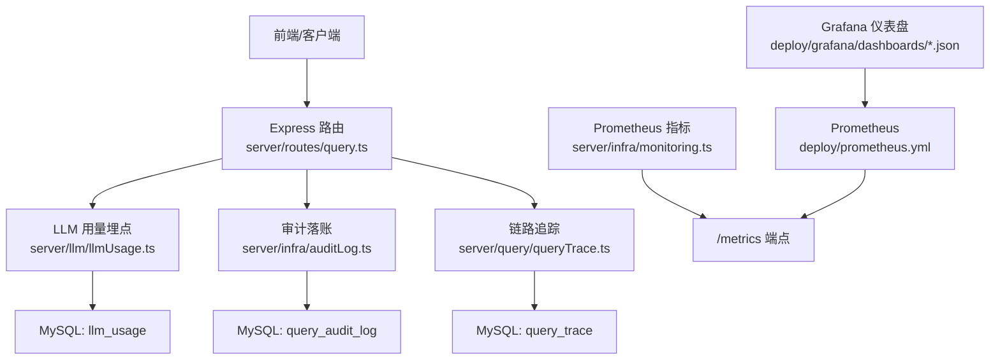
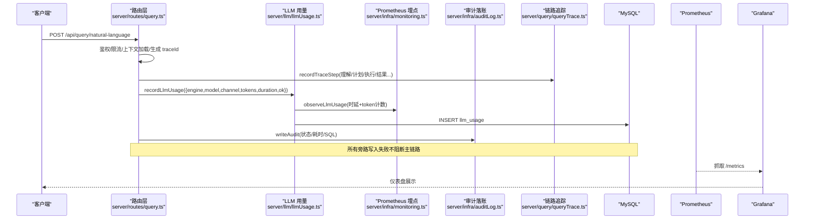
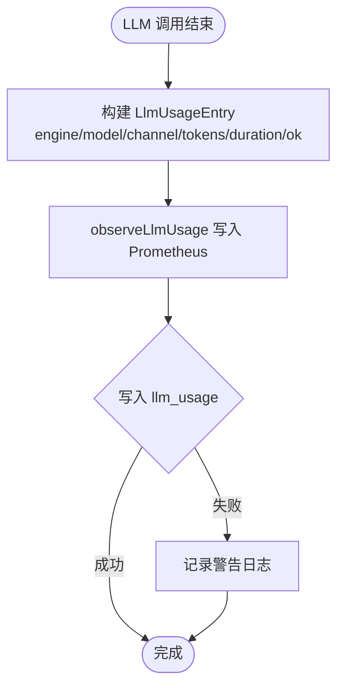
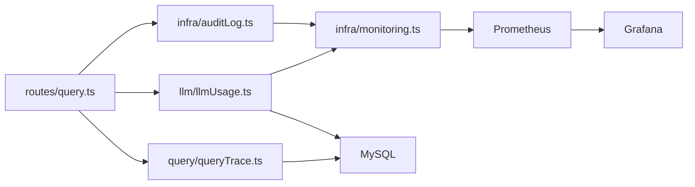

# 使用监控

<cite>
**本文引用的文件**
- [server/llm/llmUsage.ts](file://server/llm/llmUsage.ts)
- [server/infra/monitoring.ts](file://server/infra/monitoring.ts)
- [server/infra/auditLog.ts](file://server/infra/auditLog.ts)
- [server/query/queryTrace.ts](file://server/query/queryTrace.ts)
- [server/routes/query.ts](file://server/routes/query.ts)
- [src/components/admin/LlmUsagePanel.tsx](file://src/components/admin/LlmUsagePanel.tsx)
- [deploy/prometheus.yml](file://deploy/prometheus.yml)
- [deploy/grafana/dashboards/nl2sql-overview.json](file://deploy/grafana/dashboards/nl2sql-overview.json)
- [deploy/grafana/dashboards/nl2sql-llm.json](file://deploy/grafana/dashboards/nl2sql-llm.json)
</cite>

## 目录
1. [简介](#简介)
2. [项目结构](#项目结构)
3. [核心组件](#核心组件)
4. [架构总览](#架构总览)
5. [详细组件分析](#详细组件分析)
6. [依赖关系分析](#依赖关系分析)
7. [性能与成本优化建议](#性能与成本优化建议)
8. [故障排查指南](#故障排查指南)
9. [结论](#结论)
10. [附录：监控数据查询与可视化方案](#附录监控数据查询与可视化方案)

## 简介
本文件面向“智能问数据分析系统”的使用监控，聚焦以下目标：
- LLM 调用计量：Token 用量统计、调用次数记录、响应时间监控。
- 用户上下文追踪：异步上下文传递、用户身份绑定、调用链追踪（traceId）。
- 成本计算与优化：多引擎/模型对比、性能指标分析、资源使用优化建议。
- 监控数据查询与可视化：日志分析、报表生成、Grafana 仪表盘与 Prometheus 指标采集。

## 项目结构
围绕监控能力，代码按职责分层组织：
- 指标埋点与暴露：infra/monitoring.ts 定义 Prometheus 指标与 /metrics 端点；deploy/prometheus.yml 配置抓取；deploy/grafana/dashboards/* 提供可视化面板。
- LLM 用量落库：llm/llmUsage.ts 负责 token 与耗时写入 llm_usage 表，并提供聚合查询接口。
- 审计与链路追踪：infra/auditLog.ts 统一审计落账；query/queryTrace.ts 记录推导步骤，支持回放。
- 业务路由与上下文：routes/query.ts 串联认证、限流、上下文加载、SSE 事件、traceId 生成与旁路埋点。
- 管理端展示：src/components/admin/LlmUsagePanel.tsx 提供管理员视角的 Token 用量与调用汇总界面。



**图表来源**
- [server/routes/query.ts:47-200](file://server/routes/query.ts#L47-L200)
- [server/llm/llmUsage.ts:25-50](file://server/llm/llmUsage.ts#L25-L50)
- [server/infra/auditLog.ts:38-61](file://server/infra/auditLog.ts#L38-L61)
- [server/query/queryTrace.ts:55-88](file://server/query/queryTrace.ts#L55-L88)
- [server/infra/monitoring.ts:116-153](file://server/infra/monitoring.ts#L116-L153)
- [deploy/prometheus.yml:16-24](file://deploy/prometheus.yml#L16-L24)
- [deploy/grafana/dashboards/nl2sql-overview.json:1-192](file://deploy/grafana/dashboards/nl2sql-overview.json#L1-L192)
- [deploy/grafana/dashboards/nl2sql-llm.json:1-135](file://deploy/grafana/dashboards/nl2sql-llm.json#L1-L135)

**章节来源**
- [server/routes/query.ts:47-200](file://server/routes/query.ts#L47-L200)
- [server/infra/monitoring.ts:1-153](file://server/infra/monitoring.ts#L1-L153)
- [deploy/prometheus.yml:1-57](file://deploy/prometheus.yml#L1-L57)
- [deploy/grafana/dashboards/nl2sql-overview.json:1-192](file://deploy/grafana/dashboards/nl2sql-overview.json#L1-L192)
- [deploy/grafana/dashboards/nl2sql-llm.json:1-135](file://deploy/grafana/dashboards/nl2sql-llm.json#L1-L135)

## 核心组件
- LLM 用量记录与聚合
  - 记录：recordLlmUsage 将每次调用的 engine/model/channel/token/耗时/成功状态写入数据库，并同步向 Prometheus 打点。
  - 聚合：summarizeLlmUsage 与 summarizeLlmUsageByUser 提供按引擎/模型、按用户的近 N 天聚合视图。
- Prometheus 指标与 /metrics
  - 指标：nl2sql_requests_total、nl2sql_duration_seconds、nl2sql_cache_hits_total、llm_call_duration_seconds、llm_tokens_total、sql_execute_duration_seconds、http_request_duration_seconds。
  - 暴露：metricsHandler 提供 /metrics 端点，支持可选 METRICS_TOKEN 鉴权。
- 审计与链路追踪
  - 审计：writeAudit 统一记录请求终态、耗时、SQL 等，供事后分析与告警。
  - 追踪：newTraceId + recordTraceStep 记录每步推导过程，getTraceSteps 支持回放。
- 管理端用量面板
  - LlmUsagePanel 通过 /api/system/llm-usage 获取 byUser 与 usage 数据，展示 Token 消耗、成功率、平均耗时等。

**章节来源**
- [server/llm/llmUsage.ts:12-133](file://server/llm/llmUsage.ts#L12-L133)
- [server/infra/monitoring.ts:16-153](file://server/infra/monitoring.ts#L16-L153)
- [server/infra/auditLog.ts:10-61](file://server/infra/auditLog.ts#L10-L61)
- [server/query/queryTrace.ts:10-118](file://server/query/queryTrace.ts#L10-L118)
- [src/components/admin/LlmUsagePanel.tsx:48-70](file://src/components/admin/LlmUsagePanel.tsx#L48-L70)

## 架构总览
下图展示了从请求进入、上下文处理、LLM 调用、指标埋点到持久化存储与可视化的完整链路。



**图表来源**
- [server/routes/query.ts:47-200](file://server/routes/query.ts#L47-L200)
- [server/llm/llmUsage.ts:25-50](file://server/llm/llmUsage.ts#L25-L50)
- [server/infra/monitoring.ts:116-153](file://server/infra/monitoring.ts#L116-L153)
- [server/infra/auditLog.ts:38-61](file://server/infra/auditLog.ts#L38-L61)
- [server/query/queryTrace.ts:55-88](file://server/query/queryTrace.ts#L55-L88)
- [deploy/prometheus.yml:16-24](file://deploy/prometheus.yml#L16-L24)

## 详细组件分析

### LLM 调用计量系统
- 设计要点
  - 低基数 label：channel/engine/model/ok，避免高基数导致指标膨胀。
  - fail-open：observeLlmUsage 异常静默，不影响主链路。
  - 双写：Prometheus 实时指标 + MySQL 持久化用于历史聚合与成本核算。
- 关键流程
  - 调用结束后构造 LlmUsageEntry，调用 observeLlmUsage 写入 Prometheus，再异步写入 llm_usage。
  - 聚合接口按 engine/model 或 user_id 分组，输出 calls、tokens、avgDurationMs 等。



**图表来源**
- [server/llm/llmUsage.ts:25-50](file://server/llm/llmUsage.ts#L25-L50)
- [server/infra/monitoring.ts:116-126](file://server/infra/monitoring.ts#L116-L126)

**章节来源**
- [server/llm/llmUsage.ts:12-133](file://server/llm/llmUsage.ts#L12-L133)
- [server/infra/monitoring.ts:46-61](file://server/infra/monitoring.ts#L46-L61)

### 用户上下文追踪机制
- 异步上下文传递
  - 路由层在请求入口处注入 userId/username，并通过 setLlmOverride 在请求上下文中切换模型选择（AsyncLocalStorage），确保后续 LLM 调用携带正确上下文。
- 用户身份绑定
  - auditLog.writeAudit 与 llmUsage.recordLlmUsage 均携带 userId/username，便于按用户维度统计与审计。
- 调用链追踪
  - newTraceId 为每次问数生成唯一 traceId；recordTraceStep 记录各阶段输入/输出摘要、SQL、行数、耗时与状态；getTraceSteps 支持回放。

```mermaid
classDiagram
class TraceMeta {
+number userId
+string username
+string dataSourceId
+string question
}
class TraceStep {
+string stepType
+string title
+string inputSummary
+string outputSummary
+string sqlText
+number rowCount
+number durationMs
+string status
}
class QueryTrace {
+newTraceId() string
+recordTraceStep(traceId, meta, step) Promise<void>
+getTraceSteps(traceId) Promise<{steps, ownerUserId}>
}
QueryTrace --> TraceMeta : "使用"
QueryTrace --> TraceStep : "记录"
```

**图表来源**
- [server/query/queryTrace.ts:25-118](file://server/query/queryTrace.ts#L25-L118)

**章节来源**
- [server/routes/query.ts:78-86](file://server/routes/query.ts#L78-L86)
- [server/infra/auditLog.ts:24-61](file://server/infra/auditLog.ts#L24-L61)
- [server/query/queryTrace.ts:45-118](file://server/query/queryTrace.ts#L45-L118)

### 成本计算与优化建议
- 多引擎/模型成本对比
  - 基于 llm_usage 表的 summarizeLlmUsage 可按 engine/model 聚合 totalTokens、calls、avgDurationMs，结合各引擎单价进行成本估算。
- 性能指标分析
  - Prometheus 指标 llm_call_duration_seconds 提供分模型的 P50/P95 时延；nl2sql_duration_seconds 提供端到端时延；sql_execute_duration_seconds 帮助定位 SQL 瓶颈。
- 资源使用优化
  - 缓存命中：nl2sql_cache_hits_total 提升 L1/L2 命中率可降低 LLM 与 SQL 压力。
  - 并发控制：同用户并发限制与频率限制减少排队与拥塞。
  - 模型路由：快速模型优先，复杂问题回退主模型，降低整体延迟与成本。

[本节为通用指导，不直接分析具体文件]

## 依赖关系分析
- 模块耦合
  - routes/query.ts 依赖 llmUsage、auditLog、queryTrace、monitoring，形成“业务路由 → 埋点/审计/追踪 → 存储”的单向依赖。
  - monitoring.ts 仅依赖 prom-client，无业务耦合，保证可插拔。
- 外部依赖
  - Prometheus 通过 deploy/prometheus.yml 抓取 /metrics；Grafana 通过 dashboards 消费指标。
- 潜在循环依赖
  - 当前埋点与存储均为旁路且 fail-open，不存在反向依赖，风险较低。



**图表来源**
- [server/routes/query.ts:47-200](file://server/routes/query.ts#L47-L200)
- [server/llm/llmUsage.ts:25-50](file://server/llm/llmUsage.ts#L25-L50)
- [server/infra/auditLog.ts:38-61](file://server/infra/auditLog.ts#L38-L61)
- [server/query/queryTrace.ts:55-88](file://server/query/queryTrace.ts#L55-L88)
- [server/infra/monitoring.ts:116-153](file://server/infra/monitoring.ts#L116-L153)
- [deploy/prometheus.yml:16-24](file://deploy/prometheus.yml#L16-L24)

**章节来源**
- [server/routes/query.ts:47-200](file://server/routes/query.ts#L47-L200)
- [server/infra/monitoring.ts:1-153](file://server/infra/monitoring.ts#L1-L153)
- [deploy/prometheus.yml:1-57](file://deploy/prometheus.yml#L1-L57)

## 性能与成本优化建议
- 指标与采样
  - 保持低基数 label，避免高频字段作为 label；合理设置直方图桶位以覆盖 ms 到分钟级时延。
- 缓存策略
  - 提高 L1/L2 命中率，减少重复 LLM 与 SQL 执行；关注 nl2sql_cache_hits_total 趋势。
- 模型路由与降级
  - 简单问题走快速模型，复杂问题回退主模型；观察 llm_call_duration_seconds 分模型分布。
- 并发与限流
  - 维持同用户并发上限与滑动窗口限流，避免队列堆积与资源争用。
- 成本核算
  - 基于 llm_usage 的 totalTokens 与 avgDurationMs 结合引擎单价，评估不同模型的成本效益。

[本节为通用指导，不直接分析具体文件]

## 故障排查指南
- 指标不可用
  - 检查 /metrics 是否可达，确认 METRICS_TOKEN 配置与权限；查看 Prometheus 抓取目标 up 状态。
- LLM 调用失败率高
  - 通过 llm_call_duration_seconds{ok="0"} 观察失败率；结合 query_audit_log 中 DENIED_* 状态定位原因。
- 慢查询定位
  - 对比 sql_execute_duration_seconds 与 llm_call_duration_seconds 的 P95，判断瓶颈在 SQL 还是 LLM。
- 追踪回放
  - 使用 traceId 调用 getTraceSteps 回放每一步输入/输出摘要、SQL 与耗时，定位问题环节。

**章节来源**
- [server/infra/monitoring.ts:136-153](file://server/infra/monitoring.ts#L136-L153)
- [server/infra/auditLog.ts:10-61](file://server/infra/auditLog.ts#L10-L61)
- [server/query/queryTrace.ts:95-118](file://server/query/queryTrace.ts#L95-L118)

## 结论
本系统通过“旁路埋点 + 持久化落库 + 可视化看板”的三层监控体系，实现了对 LLM 调用量、时延、成功率与用户维度的全面观测。审计与链路追踪提供了可回溯的问题定位能力。配合合理的缓存、限流与模型路由策略，可在保障用户体验的同时有效控制成本与资源占用。

[本节为总结性内容，不直接分析具体文件]

## 附录：监控数据查询与可视化方案
- 指标采集
  - 应用暴露 /metrics；Prometheus 按 deploy/prometheus.yml 配置抓取；支持多实例 instance label 区分。
- Grafana 仪表盘
  - 总览：nl2sql-overview.json 展示成功率、缓存命中率、端到端 P95、请求速率、LLM P95、SQL vs LLM 时延对比。
  - LLM 专项：nl2sql-llm.json 展示成功率、调用速率、Token 吞吐、分模型时延与占比、失败调用定位。
- 日志与报表
  - 审计日志：query_audit_log 记录请求终态、耗时、SQL 等，可用于报表与合规审计。
  - 用量报表：基于 llm_usage 的聚合接口（byUser/usage）生成报表，支持按时间范围筛选。
- 查询方法
  - 管理端：LlmUsagePanel 调用 /api/system/llm-usage?days=N 获取 byUser 与 usage 数据。
  - 指标查询：PromQL 参考 dashboard 中的表达式，如 llm_call_duration_seconds、llm_tokens_total、nl2sql_duration_seconds 等。

**章节来源**
- [deploy/prometheus.yml:16-24](file://deploy/prometheus.yml#L16-L24)
- [deploy/grafana/dashboards/nl2sql-overview.json:1-192](file://deploy/grafana/dashboards/nl2sql-overview.json#L1-L192)
- [deploy/grafana/dashboards/nl2sql-llm.json:1-135](file://deploy/grafana/dashboards/nl2sql-llm.json#L1-L135)
- [src/components/admin/LlmUsagePanel.tsx:56-70](file://src/components/admin/LlmUsagePanel.tsx#L56-L70)
- [server/llm/llmUsage.ts:63-133](file://server/llm/llmUsage.ts#L63-L133)