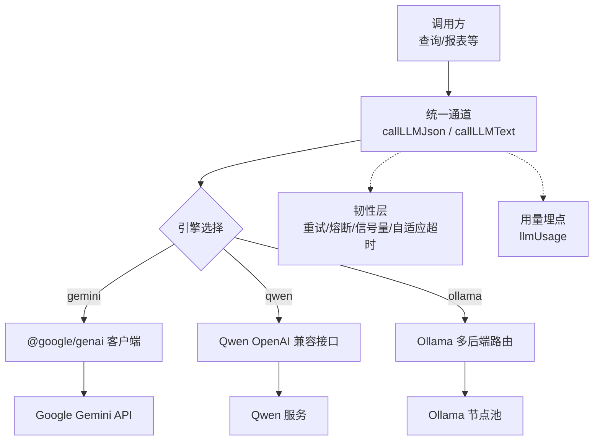
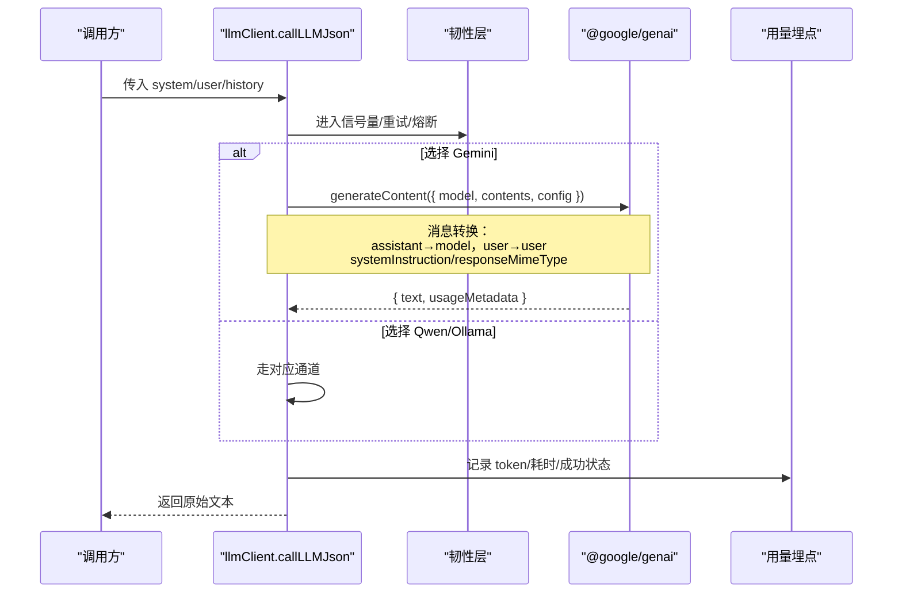
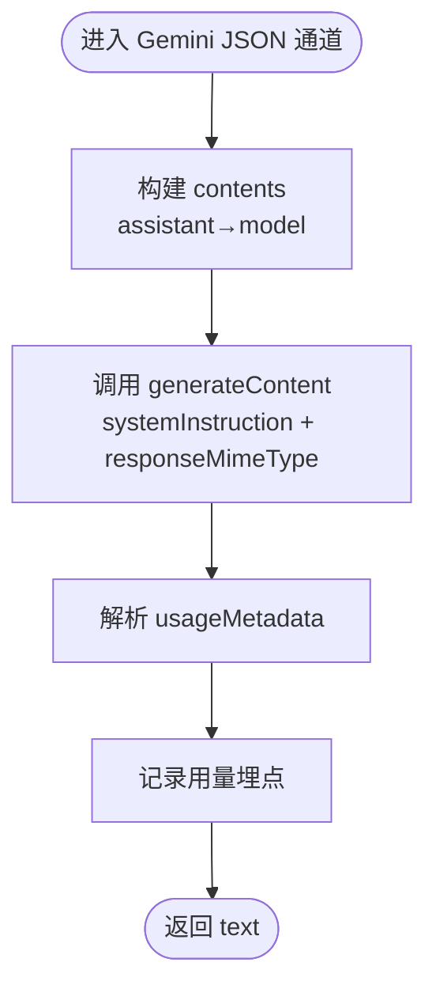
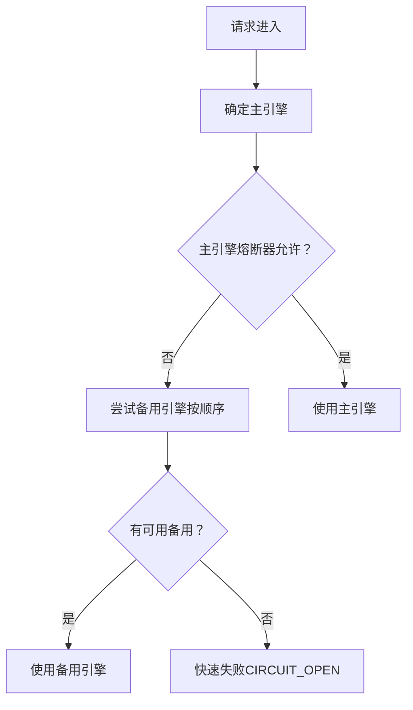
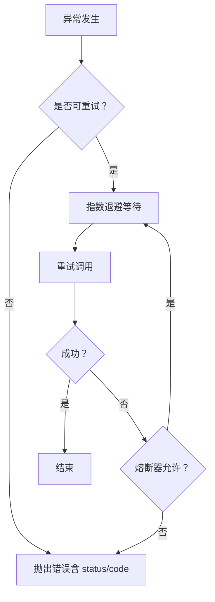
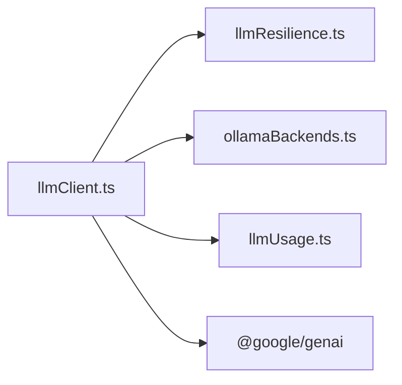

# Gemini云端引擎

<cite>
**本文引用的文件**
- [server/llm/llmClient.ts](file://server/llm/llmClient.ts)
- [server/llm/llmResilience.ts](file://server/llm/llmResilience.ts)
- [server/llm/ollamaBackends.ts](file://server/llm/ollamaBackends.ts)
- [server/llm/llmUsage.ts](file://server/llm/llmUsage.ts)
- [server/llm/llmBackends.test.ts](file://server/llm/llmBackends.test.ts)
</cite>

## 目录
1. [简介](#简介)
2. [项目结构](#项目结构)
3. [核心组件](#核心组件)
4. [架构总览](#架构总览)
5. [详细组件分析](#详细组件分析)
6. [依赖关系分析](#依赖关系分析)
7. [性能与韧性](#性能与韧性)
8. [故障排查指南](#故障排查指南)
9. [结论](#结论)
10. [附录：配置与调用示例](#附录配置与调用示例)

## 简介
本章节面向“Gemini云端引擎”的集成实现，聚焦以下要点：
- 使用 @google/genai SDK 接入 Google Gemini API
- 通过环境变量 GEMINI_API_KEY 完成鉴权
- 默认模型为 gemini-3.6-flash，支持请求级覆盖
- 消息格式转换：将内部 ChatMessage（role: 'assistant'）映射为 Gemini 的 role: 'model'
- JSON 输出模式：responseMimeType: 'application/json'
- 系统指令：systemInstruction
- 与 Ollama/Qwen 的差异对比
- 错误处理与重试机制、熔断与自适应超时
- 用量埋点与成本统计

## 项目结构
围绕 LLM 统一通道，本项目在 server/llm 目录下提供多后端（Ollama、Qwen、Gemini）的统一封装与韧性保障。关键文件职责如下：
- llmClient.ts：统一入口，负责引擎选择、消息组装、JSON/文本两种调用模式、与 @google/genai 的集成
- ollamaBackends.ts：Ollama 多后端路由与健康检查
- llmResilience.ts：重试、熔断、信号量、自适应超时等韧性原语
- llmUsage.ts：用量埋点与聚合查询

图表来源
- [server/llm/llmClient.ts:449-525](file://server/llm/llmClient.ts#L449-L525)
- [server/llm/llmResilience.ts:179-197](file://server/llm/llmResilience.ts#L179-L197)
- [server/llm/ollamaBackends.ts:75-96](file://server/llm/ollamaBackends.ts#L75-L96)
- [server/llm/llmUsage.ts:26-49](file://server/llm/llmUsage.ts#L26-L49)

章节来源
- [server/llm/llmClient.ts:1-606](file://server/llm/llmClient.ts#L1-L606)
- [server/llm/ollamaBackends.ts:1-143](file://server/llm/ollamaBackends.ts#L1-L143)
- [server/llm/llmResilience.ts:1-245](file://server/llm/llmResilience.ts#L1-L245)
- [server/llm/llmUsage.ts:1-134](file://server/llm/llmUsage.ts#L1-L134)

## 核心组件
- 统一调用入口
  - callLLMJson：以 JSON 输出模式调用，返回原始文本（调用方负责 safeParseJson + 结构校验），内置历史消息拼接、系统指令注入、JSON 模式开关
  - callLLMText：纯文本模式，用于非结构化输出场景
- 引擎选择与覆盖
  - 优先级：请求级覆盖 > 阶段级路由 > AI_ENGINE 显式指定 > 密钥存在性自动选择 > 回退 Ollama
  - 默认 Gemini 模型：gemini-3.6-flash
- 消息格式转换
  - 内部 ChatMessage.role 为 'assistant' 时，转换为 Gemini 的 'model'；'user' 保持不变
- 响应元数据
  - 从 response.usageMetadata 提取 promptTokenCount/candidatesTokenCount 并归一化为 usage
- 韧性保障
  - 指数退避重试、引擎级熔断、并发信号量、自适应超时
- 用量埋点
  - 每次调用记录引擎、模型、通道、token 数、耗时、成功与否，并支持按用户维度聚合

章节来源
- [server/llm/llmClient.ts:28-57](file://server/llm/llmClient.ts#L28-L57)
- [server/llm/llmClient.ts:115-139](file://server/llm/llmClient.ts#L115-L139)
- [server/llm/llmClient.ts:449-525](file://server/llm/llmClient.ts#L449-L525)
- [server/llm/llmResilience.ts:12-49](file://server/llm/llmResilience.ts#L12-L49)
- [server/llm/llmUsage.ts:12-49](file://server/llm/llmUsage.ts#L12-L49)

## 架构总览
下图展示一次 JSON 模式调用的端到端流程，包括引擎选择、消息转换、@google/genai 调用、用量埋点与异常路径。

图表来源
- [server/llm/llmClient.ts:449-525](file://server/llm/llmClient.ts#L449-L525)
- [server/llm/llmResilience.ts:179-197](file://server/llm/llmResilience.ts#L179-L197)
- [server/llm/llmUsage.ts:26-49](file://server/llm/llmUsage.ts#L26-L49)

## 详细组件分析

### Gemini 通道实现（JSON 模式）
- 动态导入 @google/genai，避免冷启动开销
- 构造 contents：将 history 中 assistant 转为 model，追加当前 user 消息
- 配置项：
  - systemInstruction：系统指令
  - responseMimeType: 'application/json'：强制 JSON 输出
- 解析 usageMetadata：promptTokenCount/candidatesTokenCount → usage
- 失败路径：由韧性层统一捕获并重试/熔断

图表来源
- [server/llm/llmClient.ts:483-507](file://server/llm/llmClient.ts#L483-L507)

章节来源
- [server/llm/llmClient.ts:449-525](file://server/llm/llmClient.ts#L449-L525)

### 与 Ollama/Qwen 的差异
- SDK 与协议
  - Gemini：@google/genai SDK，generateContent，contents 数组，role 包含 model/user
  - Qwen：OpenAI 兼容 /chat/completions，messages 数组，role 为 system/user/assistant
  - Ollama：/api/chat，messages 数组，role 为 system/user/assistant
- 消息角色差异
  - 内部统一为 'assistant'，到 Gemini 需映射为 'model'
- JSON 输出模式
  - Gemini：responseMimeType: 'application/json'
  - Qwen：response_format: { type: 'json_object' }
  - Ollama：format: 'json'
- 响应元数据
  - Gemini：usageMetadata.promptTokenCount/candidatesTokenCount
  - Qwen：choices[0].message.content + usage.prompt_tokens/completion_tokens
  - Ollama：message.content + prompt_eval_count/eval_count

章节来源
- [server/llm/llmClient.ts:349-395](file://server/llm/llmClient.ts#L349-L395)
- [server/llm/llmClient.ts:397-442](file://server/llm/llmClient.ts#L397-L442)
- [server/llm/llmClient.ts:483-507](file://server/llm/llmClient.ts#L483-L507)

### 引擎选择与故障转移
- 引擎选择优先级：请求级覆盖 > 阶段级路由 > 环境变量显式指定 > 密钥存在性自动 > Ollama
- 熔断转移：当主引擎连续失败触发熔断，自动切换到已配置且未开路的备用引擎
- 全部开路：快速失败，防止雪崩

图表来源
- [server/llm/llmClient.ts:125-139](file://server/llm/llmClient.ts#L125-L139)
- [server/llm/llmResilience.ts:103-160](file://server/llm/llmResilience.ts#L103-L160)

章节来源
- [server/llm/llmClient.ts:235-246](file://server/llm/llmClient.ts#L235-L246)
- [server/llm/llmClient.ts:125-139](file://server/llm/llmClient.ts#L125-L139)
- [server/llm/llmResilience.ts:103-160](file://server/llm/llmResilience.ts#L103-L160)

### 消息格式转换（history 中的 assistant→model）
- 将历史消息中 role 为 'assistant' 的条目转换为 Gemini 的 'model'
- 当前轮 user 消息保持 role: 'user'
- 系统指令通过 systemInstruction 传递

章节来源
- [server/llm/llmClient.ts:485-491](file://server/llm/llmClient.ts#L485-L491)

### 响应元数据处理
- 从 response.usageMetadata 读取 promptTokenCount/candidatesTokenCount
- 归一化为 ChannelUsage：promptTokens/completionTokens
- 若缺失则忽略，不影响主流程

章节来源
- [server/llm/llmClient.ts:500-507](file://server/llm/llmClient.ts#L500-L507)

### 错误处理与重试机制
- 可重试判定：TIMEOUT/AbortError、5xx、429、无状态码的网络错误
- 指数退避重试：baseDelayMs 与抖动，避免雪崩
- 熔断器：连续失败 N 次开路，冷却期后半开探测
- 信号量：每引擎并发上限，本地 Ollama 防打爆
- 自适应超时：基于近期成功调用 P95×3 动态调整

图表来源
- [server/llm/llmResilience.ts:42-49](file://server/llm/llmResilience.ts#L42-L49)
- [server/llm/llmResilience.ts:179-197](file://server/llm/llmResilience.ts#L179-L197)
- [server/llm/llmResilience.ts:103-160](file://server/llm/llmResilience.ts#L103-L160)

章节来源
- [server/llm/llmResilience.ts:12-49](file://server/llm/llmResilience.ts#L12-L49)
- [server/llm/llmResilience.ts:179-197](file://server/llm/llmResilience.ts#L179-L197)

## 依赖关系分析
- llmClient.ts 依赖
  - ollamaBackends.ts：多后端路由与健康检查
  - llmResilience.ts：重试、熔断、信号量、自适应超时
  - llmUsage.ts：用量埋点
- 外部依赖
  - @google/genai：Gemini SDK（按需动态导入）
  - fetch：HTTP 调用（Qwen/Ollama/Gemini）

图表来源
- [server/llm/llmClient.ts:8-26](file://server/llm/llmClient.ts#L8-L26)
- [server/llm/llmClient.ts:483-507](file://server/llm/llmClient.ts#L483-L507)

章节来源
- [server/llm/llmClient.ts:1-606](file://server/llm/llmClient.ts#L1-L606)

## 性能与韧性
- 并发控制：每引擎信号量限制，避免本地推理进程被打爆
- 自适应超时：基于 P95×3 动态收紧，快模型不被长超时拖死，慢模型不误杀
- 熔断保护：连续失败开路，冷却期后半开探测恢复
- 重试策略：仅对可恢复错误重试，4xx 立即失败不浪费配额
- 多后端路由：Ollama 最少并发选取，失败摘除+健康检查恢复

章节来源
- [server/llm/llmResilience.ts:51-88](file://server/llm/llmResilience.ts#L51-L88)
- [server/llm/llmResilience.ts:199-245](file://server/llm/llmResilience.ts#L199-L245)
- [server/llm/ollamaBackends.ts:43-96](file://server/llm/ollamaBackends.ts#L43-L96)

## 故障排查指南
- 常见错误类型
  - TIMEOUT：超时中止（AbortError），可重试
  - CIRCUIT_OPEN：熔断开路，快速失败
  - 4xx：鉴权/参数错误，不可重试
  - 5xx/网络错误：可重试
- 定位步骤
  - 检查日志中的重试次数与延迟
  - 查看熔断器状态与冷却期
  - 确认 GEMINI_API_KEY 是否配置
  - 验证模型名称与权限
- 测试与诊断
  - 使用测试工具重置熔断/信号量/后端池
  - 通过探针检测 Ollama 后端健康状态

章节来源
- [server/llm/llmResilience.ts:12-49](file://server/llm/llmResilience.ts#L12-L49)
- [server/llm/llmClient.ts:109-112](file://server/llm/llmClient.ts#L109-L112)
- [server/llm/ollamaBackends.ts:98-128](file://server/llm/ollamaBackends.ts#L98-L128)

## 结论
本实现通过统一通道将 Gemini、Qwen、Ollama 三种后端整合，提供一致的调用体验与强大的韧性保障。针对 Gemini 的集成重点在于：
- 使用 @google/genai SDK 与 Gemini 原生数据结构
- 正确的消息角色映射（assistant→model）
- JSON 输出模式与系统指令的配置
- 完善的错误处理、重试与熔断机制
- 用量埋点支撑成本分析与优化

## 附录：配置与调用示例

### 环境变量配置
- GEMINI_API_KEY：必需，用于鉴权
- AI_ENGINE：可选，显式指定引擎（ollama/gemini/qwen）
- LLM_MODEL：可选，覆盖默认模型
- LLM_RETRY_MAX：可选，最大重试次数
- LLM_MAX_CONCURRENT：可选，每引擎并发上限
- LLM_BREAKER_FAILS：可选，熔断阈值
- LLM_BREAKER_COOLDOWN_MS：可选，熔断冷却期
- LLM_ADAPTIVE_TIMEOUT：可选，是否启用自适应超时

章节来源
- [server/llm/llmClient.ts:56-57](file://server/llm/llmClient.ts#L56-L57)
- [server/llm/llmClient.ts:61-83](file://server/llm/llmClient.ts#L61-L83)
- [server/llm/llmClient.ts:235-246](file://server/llm/llmClient.ts#L235-L246)

### 调用示例（JSON 输出模式）
- 系统指令：systemInstruction
- JSON 模式：responseMimeType: 'application/json'
- 模型选择：默认 gemini-3.6-flash，可通过请求级覆盖或阶段级路由切换

章节来源
- [server/llm/llmClient.ts:483-499](file://server/llm/llmClient.ts#L483-L499)

### 与 Ollama/Qwen 的差异对照
- 消息结构：
  - Gemini：contents[{role:'model'|'user', parts:[{text}]}]
  - Qwen/Ollama：messages[{role:'system'|'user'|'assistant', content}]
- JSON 输出：
  - Gemini：responseMimeType: 'application/json'
  - Qwen：response_format: { type: 'json_object' }
  - Ollama：format: 'json'
- 响应元数据：
  - Gemini：usageMetadata.promptTokenCount/candidatesTokenCount
  - Qwen：usage.prompt_tokens/completion_tokens
  - Ollama：prompt_eval_count/eval_count

章节来源
- [server/llm/llmClient.ts:349-395](file://server/llm/llmClient.ts#L349-L395)
- [server/llm/llmClient.ts:397-442](file://server/llm/llmClient.ts#L397-L442)
- [server/llm/llmClient.ts:483-507](file://server/llm/llmClient.ts#L483-L507)