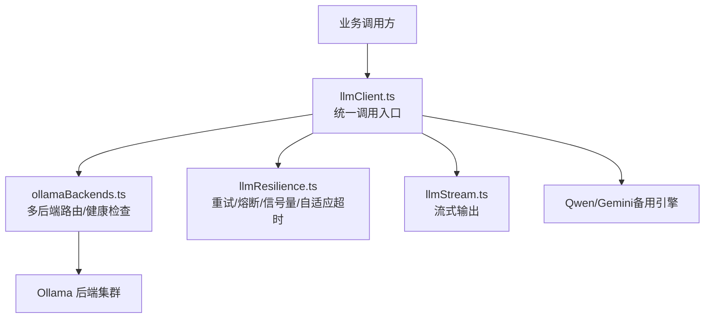
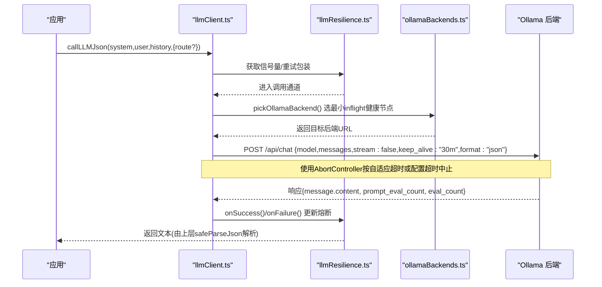
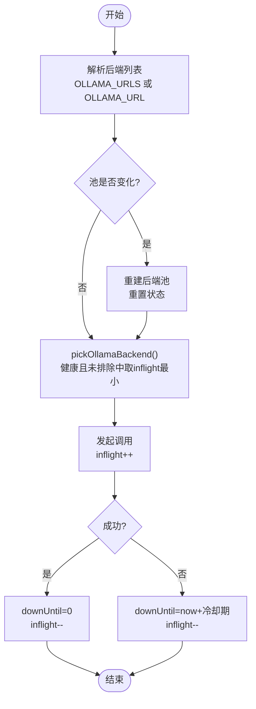
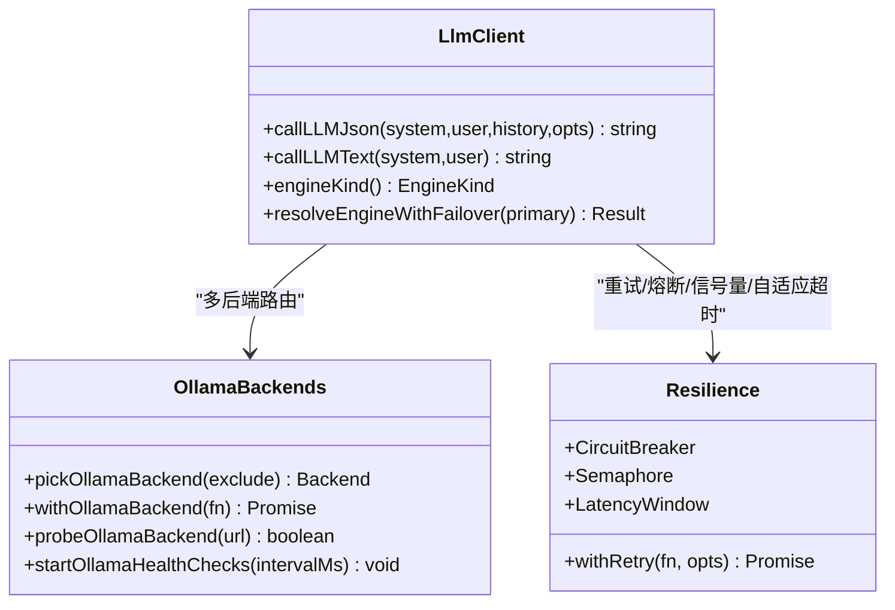
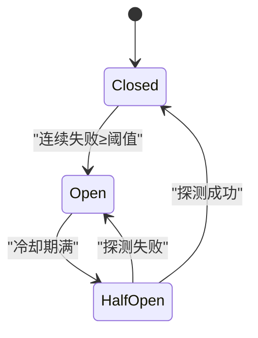
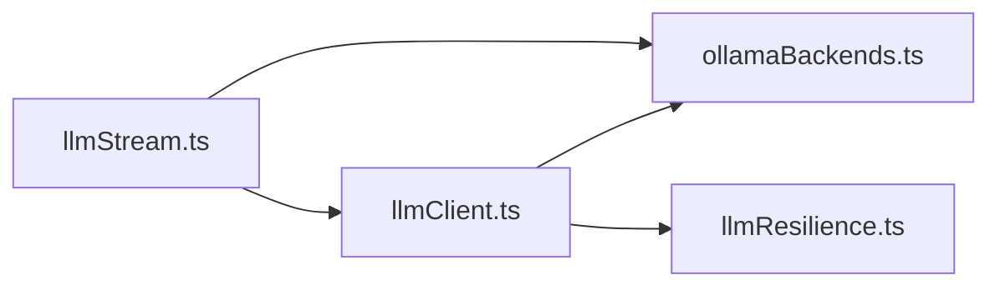

# Ollama本地引擎

<cite>
**本文引用的文件**
- [server/llm/ollamaBackends.ts](file://server/llm/ollamaBackends.ts)
- [server/llm/llmClient.ts](file://server/llm/llmClient.ts)
- [server/llm/llmResilience.ts](file://server/llm/llmResilience.ts)
- [server/llm/llmStream.ts](file://server/llm/llmStream.ts)
- [server/llm/llmBackends.test.ts](file://server/llm/llmBackends.test.ts)
</cite>

## 目录
1. [简介](#简介)
2. [项目结构](#项目结构)
3. [核心组件](#核心组件)
4. [架构总览](#架构总览)
5. [详细组件分析](#详细组件分析)
6. [依赖关系分析](#依赖关系分析)
7. [性能与容量规划](#性能与容量规划)
8. [故障排查指南](#故障排查指南)
9. [结论](#结论)
10. [附录：配置清单与调用示例](#附录配置清单与调用示例)

## 简介
本文件面向“Ollama本地引擎”的落地实现，系统性解析多节点负载均衡、健康检查、连接池管理、超时与自适应控制、keep_alive常驻模型、JSON/文本两种调用模式、错误处理策略以及熔断降级与故障转移机制。文档同时给出可操作的配置方法与调用示例路径，帮助部署与运维人员快速上手并稳定运行。

## 项目结构
围绕Ollama本地引擎的关键代码集中在 server/llm 目录下：
- ollamaBackends.ts：多后端路由、最少并发选择、摘除与恢复、健康探测、后端状态快照。
- llmClient.ts：统一LLM调用通道（含Ollama/Qwen/Gemini），负责引擎选择、阶段级路由、请求级覆盖、熔断/重试/信号量/自适应超时、JSON/文本调用封装。
- llmResilience.ts：韧性原语（指数退避重试、引擎级熔断器、并发信号量、自适应超时窗口）。
- llmStream.ts：流式输出（SSE）支持，复用主通道的引擎选择与熔断逻辑。

图表来源
- [server/llm/llmClient.ts:1-606](file://server/llm/llmClient.ts#L1-L606)
- [server/llm/ollamaBackends.ts:1-143](file://server/llm/ollamaBackends.ts#L1-L143)
- [server/llm/llmResilience.ts:1-245](file://server/llm/llmResilience.ts#L1-L245)
- [server/llm/llmStream.ts:1-300](file://server/llm/llmStream.ts#L1-L300)

章节来源
- [server/llm/llmClient.ts:1-606](file://server/llm/llmClient.ts#L1-L606)
- [server/llm/ollamaBackends.ts:1-143](file://server/llm/ollamaBackends.ts#L1-L143)
- [server/llm/llmResilience.ts:1-245](file://server/llm/llmResilience.ts#L1-L245)
- [server/llm/llmStream.ts:1-300](file://server/llm/llmStream.ts#L1-L300)

## 核心组件
- 多后端路由与健康检查
  - 最少并发选取：在健康且未被排除的后端中选择 in-flight 最小的节点；全部摘除时兜底最早恢复节点，尽力服务。
  - 摘除与恢复：失败即标记 downUntil（冷却期），后台定时任务通过 GET /api/tags 探测恢复。
  - 健康检查间隔默认10s，探测超时3s。
- 统一调用通道
  - 引擎优先级：请求级覆盖 > 阶段级路由 > AI_ENGINE显式 > 密钥存在性自动 > 回退Ollama。
  - JSON/文本双模式：JSON模式强制结构化输出；文本模式用于非结构化场景。
  - keep_alive=30m：保持模型常驻，避免频繁卸载/重载开销。
- 韧性保障
  - 指数退避重试：仅对超时/5xx/网络错误等可恢复错误重试，4xx立即失败。
  - 引擎级熔断：连续失败达到阈值后开路，冷却期后半开单探测恢复。
  - 并发信号量：按引擎限流，默认最大并发4，防止打爆本地推理进程。
  - 自适应超时：基于近期成功调用的P95×3动态收紧配置上限，避免慢误杀、快拖死。
- 故障转移
  - 主引擎开路时自动切换到已配置的备用引擎（如Ollama→Qwen/Gemini），全部开路则快速失败不雪崩。

章节来源
- [server/llm/ollamaBackends.ts:11-143](file://server/llm/ollamaBackends.ts#L11-L143)
- [server/llm/llmClient.ts:61-139](file://server/llm/llmClient.ts#L61-L139)
- [server/llm/llmResilience.ts:12-245](file://server/llm/llmResilience.ts#L12-L245)

## 架构总览
下图展示一次JSON模式调用从业务层到Ollama后端的完整流程，包括多后端选择、熔断/重试、keep_alive与超时控制。

图表来源
- [server/llm/llmClient.ts:449-525](file://server/llm/llmClient.ts#L449-L525)
- [server/llm/ollamaBackends.ts:45-96](file://server/llm/ollamaBackends.ts#L45-L96)
- [server/llm/llmResilience.ts:179-197](file://server/llm/llmResilience.ts#L179-L197)

## 详细组件分析

### 多后端路由与健康检查
- 后端池构建
  - 优先读取 OLLAMA_URLS（逗号分隔，去空白、去尾斜杠、去重）；未配置时回退 OLLAMA_URL。
  - 每次配置变更重建池，重置摘除状态。
- 最少并发路由
  - 过滤被排除的节点，健康（downUntil<=now）优先；否则按最早恢复时间排序兜底。
  - 选择 inflight 最小的节点，并在调用期间递增/递减计数。
- 摘除与恢复
  - 失败记录 downUntil = now + 冷却期（默认15s），日志告警。
  - 后台健康检查每10s探测被摘除节点，GET /api/tags 成功则恢复接入。
- 诊断接口
  - 提供 getOllamaBackendStates() 获取当前后端状态快照，便于监控与排障。

图表来源
- [server/llm/ollamaBackends.ts:21-52](file://server/llm/ollamaBackends.ts#L21-L52)
- [server/llm/ollamaBackends.ts:54-66](file://server/llm/ollamaBackends.ts#L54-L66)
- [server/llm/ollamaBackends.ts:98-128](file://server/llm/ollamaBackends.ts#L98-L128)

章节来源
- [server/llm/ollamaBackends.ts:21-128](file://server/llm/ollamaBackends.ts#L21-L128)

### 统一调用通道与模型选择
- 引擎选择优先级
  - 请求级覆盖（setLlmOverride）> 阶段级路由（SQL生成/数据解读可用快速小模型）> AI_ENGINE显式指定 > 密钥存在性自动选择 > 默认Ollama。
- 模型选择
  - Ollama默认模型来自 LLM_MODEL，未设置时回退默认值；可结合 listAvailableModels() 动态列出本地已安装模型。
- JSON vs 文本模式
  - JSON模式：强制 format="json"，返回原始文本，调用方负责安全解析与结构校验。
  - 文本模式：不要求JSON格式，适用于解释、建议等非结构化输出。
- keep_alive机制
  - 所有Ollama调用均携带 keep_alive: '30m'，使模型在内存常驻30分钟，避免频繁卸载/重载带来的冷启动开销。

图表来源
- [server/llm/llmClient.ts:449-525](file://server/llm/llmClient.ts#L449-L525)
- [server/llm/ollamaBackends.ts:45-96](file://server/llm/ollamaBackends.ts#L45-L96)
- [server/llm/llmResilience.ts:53-197](file://server/llm/llmResilience.ts#L53-L197)

章节来源
- [server/llm/llmClient.ts:33-58](file://server/llm/llmClient.ts#L33-L58)
- [server/llm/llmClient.ts:121-139](file://server/llm/llmClient.ts#L121-L139)
- [server/llm/llmClient.ts:449-525](file://server/llm/llmClient.ts#L449-L525)
- [server/llm/llmClient.ts:527-592](file://server/llm/llmClient.ts#L527-L592)

### 熔断降级与故障转移
- 熔断器
  - 连续失败达到阈值后进入 open 状态，冷却期后进入 half-open 允许单探测；成功则关闭并清零失败计数。
  - 每个引擎独立维护熔断状态，互不影响。
- 故障转移
  - 当主引擎熔断开路时，自动切换到已配置且未开路的备用引擎（如Ollama→Qwen/Gemini）。
  - 若全部引擎开路，直接快速失败，避免雪崩。
- 重试策略
  - 仅对超时/5xx/网络错误等可恢复错误进行指数退避重试，4xx立即失败。
  - 重试带抖动，避免多实例同频重试叠加。

图表来源
- [server/llm/llmResilience.ts:103-160](file://server/llm/llmResilience.ts#L103-L160)
- [server/llm/llmClient.ts:121-139](file://server/llm/llmClient.ts#L121-L139)

章节来源
- [server/llm/llmResilience.ts:12-49](file://server/llm/llmResilience.ts#L12-L49)
- [server/llm/llmResilience.ts:103-160](file://server/llm/llmResilience.ts#L103-L160)
- [server/llm/llmClient.ts:121-139](file://server/llm/llmClient.ts#L121-L139)

### 流式输出（SSE）
- 文本流式：针对Ollama/Qwen/Gemini分别实现SSE逐字推送，前端获得打字机效果。
- JSON流式：先获取完整结果再分块推送（简化方案），适合需要整体结构的场景。
- 超时控制：统一使用 AbortController，按引擎超时配置或自适应超时中止。

章节来源
- [server/llm/llmStream.ts:35-270](file://server/llm/llmStream.ts#L35-L270)

## 依赖关系分析
- llmClient.ts 依赖 ollamaBackends.ts 的多后端能力与 resilience 的韧性原语。
- ollamaBackends.ts 仅依赖 logger，自包含性强，便于测试与替换。
- llmResilience.ts 提供通用原语，无外部网络依赖，可独立单测。
- llmStream.ts 复用 llmClient.ts 的引擎选择与熔断逻辑，保证一致性。

图表来源
- [server/llm/llmClient.ts:1-606](file://server/llm/llmClient.ts#L1-L606)
- [server/llm/ollamaBackends.ts:1-143](file://server/llm/ollamaBackends.ts#L1-L143)
- [server/llm/llmResilience.ts:1-245](file://server/llm/llmResilience.ts#L1-L245)
- [server/llm/llmStream.ts:1-300](file://server/llm/llmStream.ts#L1-L300)

章节来源
- [server/llm/llmClient.ts:1-606](file://server/llm/llmClient.ts#L1-L606)
- [server/llm/ollamaBackends.ts:1-143](file://server/llm/ollamaBackends.ts#L1-L143)
- [server/llm/llmResilience.ts:1-245](file://server/llm/llmResilience.ts#L1-L245)
- [server/llm/llmStream.ts:1-300](file://server/llm/llmStream.ts#L1-L300)

## 性能与容量规划
- 并发限制
  - 默认每引擎最大并发4，超出排队等待，保护本地推理进程不被打爆。
  - 可通过环境变量调整并发上限。
- 超时与自适应
  - 默认超时180s，开启自适应后可根据近期P95×3动态收紧，避免长尾拖死。
  - 可关闭自适应以固定超时。
- 多后端扩展
  - 通过 OLLAMA_URLS 配置多个后端，系统自动选择最少并发节点，提升吞吐与可用性。
- 模型常驻
  - keep_alive=30m 减少冷启动开销，适合高频问答场景。

[本节为通用指导，无需具体文件引用]

## 故障排查指南
- 常见错误类型
  - 超时：AbortError 或 code=TIMEOUT，触发重试；若持续超时，检查模型负载与网络。
  - 4xx：鉴权/参数错误，立即失败，不重试；检查模型名、消息格式与权限。
  - 5xx/网络错误：可重试；关注后端健康与资源占用。
- 熔断与降级
  - 观察熔断状态，若开路则等待冷却或切换备用引擎；全部开路时快速失败。
- 健康检查
  - 确认后台健康检查已启动，查看被摘除节点是否恢复；必要时手动重启Ollama服务。
- 诊断工具
  - 使用 getOllamaBackendStates() 查看后端状态（url/inflight/downUntil）。
  - 使用 probeOllamaBackend(url) 单独探测某后端可达性。

章节来源
- [server/llm/llmResilience.ts:12-49](file://server/llm/llmResilience.ts#L12-L49)
- [server/llm/ollamaBackends.ts:98-133](file://server/llm/ollamaBackends.ts#L98-L133)
- [server/llm/llmClient.ts:121-139](file://server/llm/llmClient.ts#L121-L139)

## 结论
本实现通过多后端路由、健康检查、最少并发选择、指数退避重试、引擎级熔断、并发信号量与自适应超时，构建了高可用的Ollama本地引擎。配合keep_alive常驻模型与JSON/文本双模式，既能满足结构化输出需求，也能支撑非结构化场景。故障转移机制确保在主引擎不可用时继续提供服务，整体具备强韧性与可扩展性。

[本节为总结，无需具体文件引用]

## 附录：配置清单与调用示例

### 环境变量配置
- OLLAMA_URL：单后端地址（未配置 OLLAMA_URLS 时生效）。
- OLLAMA_URLS：多后端地址，逗号分隔，自动去空白、去尾斜杠、去重。
- OLLAMA_TIMEOUT_MS：Ollama调用超时毫秒数，默认180000。
- LLM_MODEL：默认模型名称（Ollama），未设置时使用内置默认值。
- LLM_RETRY_MAX：最大重试次数（不含首次），默认2，范围0-3。
- LLM_MAX_CONCURRENT：每引擎最大并发，默认4。
- LLM_BREAKER_FAILS：熔断连续失败阈值，默认3。
- LLM_BREAKER_COOLDOWN_MS：熔断冷却期毫秒，默认30000。
- LLM_ADAPTIVE_TIMEOUT：是否启用自适应超时，默认开启；设为0关闭。
- AI_ENGINE：显式指定引擎（ollama/gemini/qwen）。
- QWEN_URL/QWEN_MODEL/QWEN_TIMEOUT_MS：Qwen相关配置。
- GEMINI_API_KEY/QWEN_API_KEY：云端引擎密钥。

章节来源
- [server/llm/ollamaBackends.ts:8-9](file://server/llm/ollamaBackends.ts#L8-L9)
- [server/llm/llmClient.ts:33-58](file://server/llm/llmClient.ts#L33-L58)
- [server/llm/llmClient.ts:61-83](file://server/llm/llmClient.ts#L61-L83)
- [server/llm/llmClient.ts:235-246](file://server/llm/llmClient.ts#L235-L246)

### 调用示例（路径指引）
- JSON模式调用
  - 入口函数：callLLMJson(system, user, history?, opts?)
  - 行为：强制JSON输出，返回原始文本，调用方负责安全解析与结构校验。
  - 参考路径：[server/llm/llmClient.ts:449-525](file://server/llm/llmClient.ts#L449-L525)
- 文本模式调用
  - 入口函数：callLLMText(system, user)
  - 行为：不要求JSON格式，适用于解释、建议等非结构化输出。
  - 参考路径：[server/llm/llmClient.ts:527-592](file://server/llm/llmClient.ts#L527-L592)
- 流式输出
  - 文本流式：callLLMTextStream(system, user, opts?)
  - JSON流式：callLLMJsonStream(system, user, history?, opts?)
  - 参考路径：[server/llm/llmStream.ts:35-270](file://server/llm/llmStream.ts#L35-L270)

### 错误处理策略
- 超时：识别 AbortError 或 code=TIMEOUT，触发重试；若持续失败，熔断保护。
- 4xx：立即失败，不重试；检查模型名、消息格式与权限。
- 5xx/网络错误：可重试；关注后端健康与资源占用。
- 熔断开路：快速失败并提示稍后重试；等待冷却或切换备用引擎。

章节来源
- [server/llm/llmResilience.ts:12-49](file://server/llm/llmResilience.ts#L12-L49)
- [server/llm/llmClient.ts:121-139](file://server/llm/llmClient.ts#L121-L139)

### 多后端与健康检查验证
- 多后端解析与去重
  - 参考测试用例：[server/llm/llmBackends.test.ts:55-68](file://server/llm/llmBackends.test.ts#L55-L68)
- 最少并发路由与摘除恢复
  - 参考测试用例：[server/llm/llmBackends.test.ts:70-125](file://server/llm/llmBackends.test.ts#L70-L125)

章节来源
- [server/llm/llmBackends.test.ts:55-125](file://server/llm/llmBackends.test.ts#L55-L125)