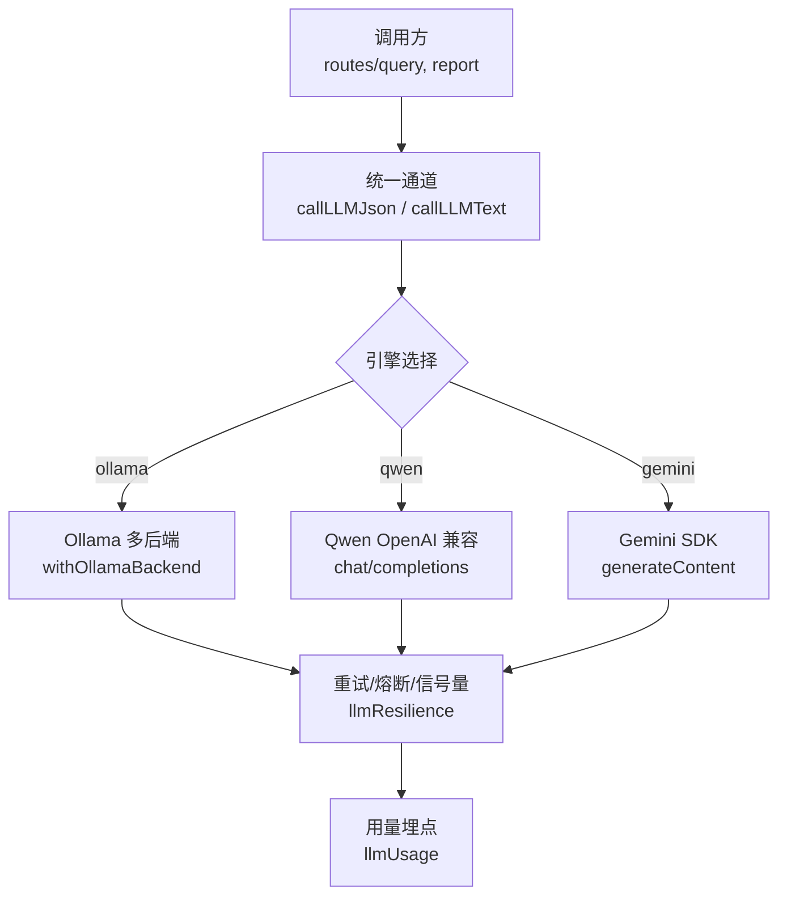
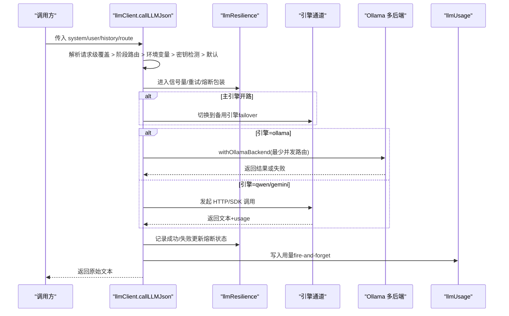
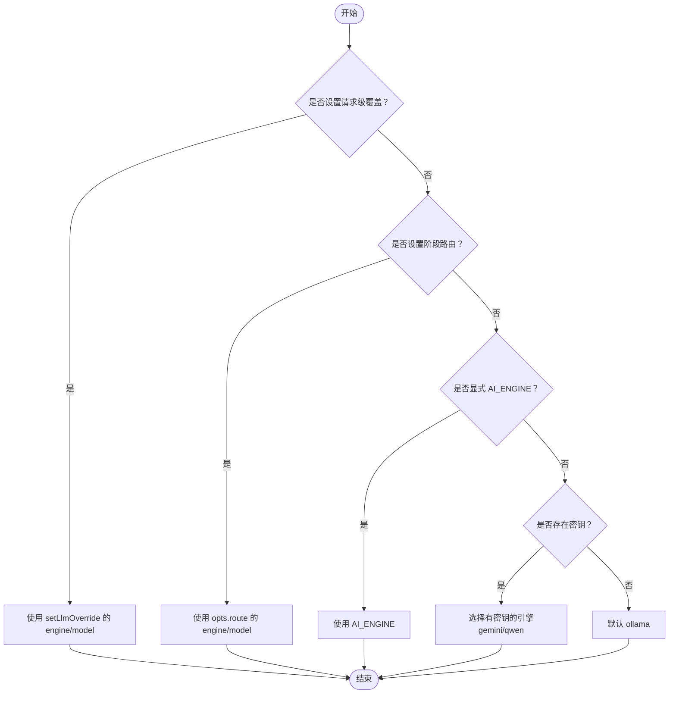
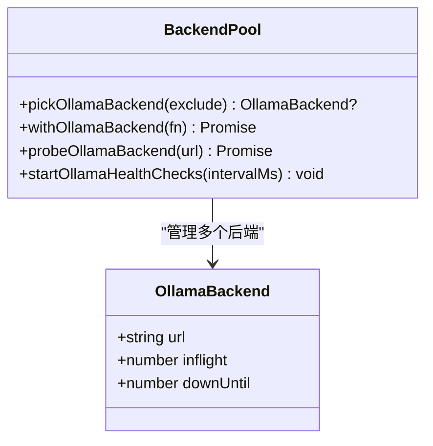
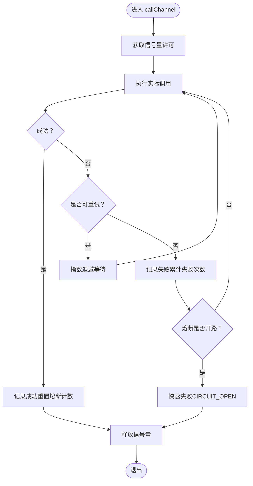
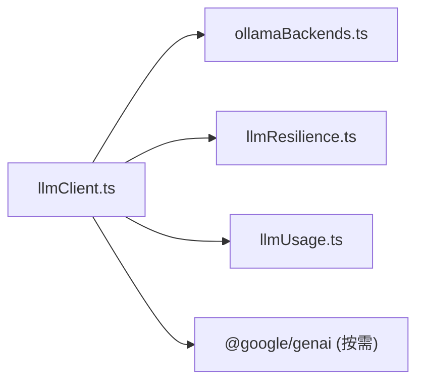

# 多引擎支持

<cite>
**本文引用的文件**
- [server/llm/llmClient.ts](file://server/llm/llmClient.ts)
- [server/llm/ollamaBackends.ts](file://server/llm/ollamaBackends.ts)
- [server/llm/llmResilience.ts](file://server/llm/llmResilience.ts)
- [server/llm/llmUsage.ts](file://server/llm/llmUsage.ts)
</cite>

## 目录
1. [简介](#简介)
2. [项目结构](#项目结构)
3. [核心组件](#核心组件)
4. [架构总览](#架构总览)
5. [详细组件分析](#详细组件分析)
6. [依赖关系分析](#依赖关系分析)
7. [性能与韧性](#性能与韧性)
8. [配置与环境变量](#配置与环境变量)
9. [调用示例与最佳实践](#调用示例与最佳实践)
10. [故障排查指南](#故障排查指南)
11. [结论](#结论)

## 简介
本系统提供统一抽象层，将本地 Ollama、云端 Gemini 和通义千问（Qwen）三种 LLM 引擎标准化为一致的 JSON/文本调用接口。通过请求级覆盖、阶段级路由、环境变量显式指定、密钥存在性自动检测与默认回退的优先级机制，实现高可用、可观测、可扩展的多引擎编排。同时内置重试、熔断、并发限流与自适应超时等韧性能力，保障在复杂部署环境下的稳定性。

## 项目结构
围绕 LLM 的统一通道位于 server/llm 目录：
- llmClient.ts：统一入口，定义 callLLMJson/callLLMText、引擎选择、模型路由、用量埋点。
- ollamaBackends.ts：Ollama 多后端池、最少并发路由、健康检查与摘除恢复。
- llmResilience.ts：重试、熔断器、信号量、自适应超时的通用原语。
- llmUsage.ts：每次调用的 token/耗时埋点与聚合查询。

图表来源
- [server/llm/llmClient.ts:141-525](file://server/llm/llmClient.ts#L141-L525)
- [server/llm/ollamaBackends.ts:74-96](file://server/llm/ollamaBackends.ts#L74-L96)
- [server/llm/llmResilience.ts:179-197](file://server/llm/llmResilience.ts#L179-L197)
- [server/llm/llmUsage.ts:25-49](file://server/llm/llmUsage.ts#L25-L49)

章节来源
- [server/llm/llmClient.ts:1-606](file://server/llm/llmClient.ts#L1-L606)
- [server/llm/ollamaBackends.ts:1-143](file://server/llm/ollamaBackends.ts#L1-L143)
- [server/llm/llmResilience.ts:1-245](file://server/llm/llmResilience.ts#L1-L245)
- [server/llm/llmUsage.ts:1-134](file://server/llm/llmUsage.ts#L1-L134)

## 核心组件
- 统一通道
  - callLLMJson：以 JSON 输出模式调用，返回原始文本（调用方负责解析与校验）。
  - callLLMText：以纯文本模式调用，适用于非结构化输出场景。
- 引擎选择与路由
  - 请求级覆盖：setLlmOverride（engine/model），随异步上下文传播。
  - 阶段级路由：opts.route（如 SQL 生成快速模型 P1-2）。
  - 环境变量显式指定：AI_ENGINE。
  - 密钥存在性自动检测：优先 gemini/qwen（若配置了对应 API Key），否则回退 ollama。
  - 默认：未配置时回退到 ollama。
- 韧性层
  - 指数退避重试：仅对超时/5xx/网络错误等可恢复错误重试。
  - 引擎级熔断：连续失败达到阈值后开路，冷却期后半开探测。
  - 并发信号量：按引擎限制最大并发，避免打爆本地推理进程。
  - 自适应超时：基于近期成功调用 P95×3 动态收紧超时上限。
- 多后端 Ollama
  - 最少并发路由：从健康节点中挑选 in-flight 最少的后端。
  - 健康检查：周期探测被摘除的后端，恢复即重新接入。
- 用量埋点
  - 记录 engine/model/channel/token/duration/ok，并支持按用户维度聚合。

章节来源
- [server/llm/llmClient.ts:163-246](file://server/llm/llmClient.ts#L163-L246)
- [server/llm/llmClient.ts:449-525](file://server/llm/llmClient.ts#L449-L525)
- [server/llm/llmClient.ts:531-592](file://server/llm/llmClient.ts#L531-L592)
- [server/llm/ollamaBackends.ts:21-52](file://server/llm/ollamaBackends.ts#L21-L52)
- [server/llm/llmResilience.ts:42-49](file://server/llm/llmResilience.ts#L42-L49)
- [server/llm/llmResilience.ts:103-160](file://server/llm/llmResilience.ts#L103-L160)
- [server/llm/llmResilience.ts:179-197](file://server/llm/llmResilience.ts#L179-L197)
- [server/llm/llmResilience.ts:235-244](file://server/llm/llmResilience.ts#L235-L244)
- [server/llm/llmUsage.ts:25-49](file://server/llm/llmUsage.ts#L25-L49)

## 架构总览
下图展示一次 JSON 模式调用的完整流程，包括引擎选择、熔断转移、重试、多后端路由与用量埋点。

图表来源
- [server/llm/llmClient.ts:449-525](file://server/llm/llmClient.ts#L449-L525)
- [server/llm/ollamaBackends.ts:74-96](file://server/llm/ollamaBackends.ts#L74-L96)
- [server/llm/llmResilience.ts:141-161](file://server/llm/llmResilience.ts#L141-L161)
- [server/llm/llmUsage.ts:25-49](file://server/llm/llmUsage.ts#L25-L49)

## 详细组件分析

### 统一抽象层与引擎选择优先级
- 请求级覆盖（最高优先级）：setLlmOverride 注入 engine/model，并通过 AsyncLocalStorage 在当前异步链内生效。
- 阶段级路由（次优先级）：opts.route（例如 SQL 生成使用快速小模型），仅在未设置请求级覆盖时生效。
- 环境变量显式指定：AI_ENGINE 明确选择 ollama/gemini/qwen。
- 密钥存在性自动检测：若存在对应 API Key，则优先选择该引擎。
- 默认回退：以上均未命中时回退到 ollama。

图表来源
- [server/llm/llmClient.ts:196-246](file://server/llm/llmClient.ts#L196-L246)

章节来源
- [server/llm/llmClient.ts:196-246](file://server/llm/llmClient.ts#L196-L246)

### Ollama 多后端与最少并发路由
- 多后端池：支持 OLLAMA_URLS 逗号分隔配置，去重、去尾斜杠；缺省回退 OLLAMA_URL。
- 健康检查：周期探测被摘除的后端，恢复即重新接入。
- 最少并发路由：在健康节点中选择 in-flight 最少的后端；全部摘除时按最早恢复时间兜底。
- 失败摘除：单次失败标记 downUntil 冷却期，期间不再路由至该节点。

图表来源
- [server/llm/ollamaBackends.ts:12-18](file://server/llm/ollamaBackends.ts#L12-L18)
- [server/llm/ollamaBackends.ts:45-52](file://server/llm/ollamaBackends.ts#L45-L52)
- [server/llm/ollamaBackends.ts:74-96](file://server/llm/ollamaBackends.ts#L74-L96)
- [server/llm/ollamaBackends.ts:98-128](file://server/llm/ollamaBackends.ts#L98-L128)

章节来源
- [server/llm/ollamaBackends.ts:21-52](file://server/llm/ollamaBackends.ts#L21-L52)
- [server/llm/ollamaBackends.ts:74-96](file://server/llm/ollamaBackends.ts#L74-L96)
- [server/llm/ollamaBackends.ts:98-128](file://server/llm/ollamaBackends.ts#L98-L128)

### 韧性层：重试、熔断、信号量、自适应超时
- 重试策略：仅对超时/5xx/网络错误等可恢复错误进行指数退避重试，带抖动避免雪崩。
- 熔断器：按引擎隔离，连续失败 N 次后开路，冷却期后允许单探测恢复。
- 信号量：每引擎并发上限，超出排队等待，保护本地推理资源。
- 自适应超时：基于近期成功调用 P95×3 动态调整超时上限，避免慢模型误杀、快模型被长超时拖累。

图表来源
- [server/llm/llmClient.ts:141-161](file://server/llm/llmClient.ts#L141-L161)
- [server/llm/llmResilience.ts:42-49](file://server/llm/llmResilience.ts#L42-L49)
- [server/llm/llmResilience.ts:103-160](file://server/llm/llmResilience.ts#L103-L160)
- [server/llm/llmResilience.ts:179-197](file://server/llm/llmResilience.ts#L179-L197)

章节来源
- [server/llm/llmResilience.ts:42-49](file://server/llm/llmResilience.ts#L42-L49)
- [server/llm/llmResilience.ts:103-160](file://server/llm/llmResilience.ts#L103-L160)
- [server/llm/llmResilience.ts:179-197](file://server/llm/llmResilience.ts#L179-L197)
- [server/llm/llmResilience.ts:235-244](file://server/llm/llmResilience.ts#L235-L244)

### 各引擎通道实现要点
- Ollama：POST /api/chat，支持 keep_alive 减少频繁加载开销；format=json 强制 JSON 输出。
- Qwen：OpenAI 兼容协议 POST /chat/completions，response_format.json_object 强制 JSON；支持自定义端点 QWEN_URL。
- Gemini：通过 SDK generateContent，设置 responseMimeType=application/json 强制 JSON；text 模式直接生成自然语言。

章节来源
- [server/llm/llmClient.ts:349-395](file://server/llm/llmClient.ts#L349-L395)
- [server/llm/llmClient.ts:397-442](file://server/llm/llmClient.ts#L397-L442)
- [server/llm/llmClient.ts:483-507](file://server/llm/llmClient.ts#L483-L507)
- [server/llm/llmClient.ts:561-575](file://server/llm/llmClient.ts#L561-L575)

## 依赖关系分析
- llmClient.ts 依赖：
  - ollamaBackends.ts：多后端路由与健康检查。
  - llmResilience.ts：重试、熔断、信号量、自适应超时。
  - llmUsage.ts：用量埋点。
- 外部依赖：
  - @google/genai：Gemini SDK（按需动态导入）。
  - fetch：HTTP 调用（Ollama/Qwen）。

图表来源
- [server/llm/llmClient.ts:8-26](file://server/llm/llmClient.ts#L8-L26)
- [server/llm/llmClient.ts:483-507](file://server/llm/llmClient.ts#L483-L507)

章节来源
- [server/llm/llmClient.ts:8-26](file://server/llm/llmClient.ts#L8-L26)

## 性能与韧性
- 并发控制：每引擎默认最大并发 4（可通过 LLM_MAX_CONCURRENT 调整），避免本地推理过载。
- 重试策略：默认最多 2 次重试（LLM_RETRY_MAX），仅针对可恢复错误。
- 熔断参数：连续失败阈值 LLM_BREAKER_FAILS（默认 3），冷却期 LLM_BREAKER_COOLDOWN_MS（默认 30s）。
- 自适应超时：启用时根据近期成功调用 P95×3 动态调整，关闭时采用配置值。
- Ollama 多后端：最少并发路由 + 健康检查，提升可用性。

章节来源
- [server/llm/llmClient.ts:61-83](file://server/llm/llmClient.ts#L61-L83)
- [server/llm/llmResilience.ts:179-197](file://server/llm/llmResilience.ts#L179-L197)
- [server/llm/llmResilience.ts:235-244](file://server/llm/llmResilience.ts#L235-L244)
- [server/llm/ollamaBackends.ts:98-128](file://server/llm/ollamaBackends.ts#L98-L128)

## 配置与环境变量
- 引擎选择
  - AI_ENGINE：显式指定 ollama/gemini/qwen。
  - 密钥检测：GEMINI_API_KEY、QWEN_API_KEY 存在时优先选择对应引擎。
  - 默认：未配置时回退 ollama。
- 模型与端点
  - LLM_MODEL：Ollama 默认模型。
  - QWEN_MODEL：Qwen 默认模型。
  - QWEN_URL：Qwen 端点（默认百炼兼容模式地址；Coding Plan 需指向特定端点）。
  - OLLAMA_URL / OLLAMA_URLS：单后端或多后端地址（逗号分隔）。
- 超时与重试
  - OLLAMA_TIMEOUT_MS：Ollama 超时。
  - QWEN_TIMEOUT_MS：Qwen 超时。
  - LLM_RETRY_MAX：最大重试次数。
  - LLM_MAX_CONCURRENT：每引擎最大并发。
  - LLM_BREAKER_FAILS / LLM_BREAKER_COOLDOWN_MS：熔断阈值与冷却期。
  - LLM_ADAPTIVE_TIMEOUT：是否启用自适应超时（默认开启，设为 0 关闭）。
- 阶段级快速模型
  - LLM_SQL_ENGINE / LLM_SQL_MODEL：SQL 生成阶段快速模型。
  - LLM_ANALYSIS_ENGINE / LLM_ANALYSIS_MODEL：数据解读阶段快速模型。

章节来源
- [server/llm/llmClient.ts:33-57](file://server/llm/llmClient.ts#L33-L57)
- [server/llm/llmClient.ts:163-194](file://server/llm/llmClient.ts#L163-L194)
- [server/llm/ollamaBackends.ts:8-9](file://server/llm/ollamaBackends.ts#L8-L9)

## 调用示例与最佳实践

### JSON 模式 vs 文本模式
- JSON 模式（callLLMJson）
  - 适用：需要结构化输出的任务（如 SQL 生成、数据分析计划）。
  - 行为：强制 JSON 输出（各引擎分别通过 format/response_format/responseMimeType 实现）。
  - 返回值：原始文本，调用方需自行安全解析与校验。
- 文本模式（callLLMText）
  - 适用：非结构化输出（如解释、建议、摘要）。
  - 行为：不强制 JSON，直接返回自然语言文本。

章节来源
- [server/llm/llmClient.ts:449-525](file://server/llm/llmClient.ts#L449-L525)
- [server/llm/llmClient.ts:531-592](file://server/llm/llmClient.ts#L531-L592)

### 引擎选择优先级使用示例
- 请求级覆盖
  - 在鉴权中间件或路由入口处调用 setLlmOverride({ engine, model })，当前请求内的所有 LLM 调用均使用该覆盖。
- 阶段级路由
  - 在结构化任务（如 SQL 生成）调用 callLLMJson 时传入 opts.route，指定快速模型以提升吞吐与稳定性。
- 环境变量
  - 部署时设置 AI_ENGINE 固定引擎，或通过 GEMINI_API_KEY/QWEN_API_KEY 自动选择。
- 默认回退
  - 未配置任何引擎时，系统默认使用 Ollama。

章节来源
- [server/llm/llmClient.ts:196-246](file://server/llm/llmClient.ts#L196-L246)
- [server/llm/llmClient.ts:449-474](file://server/llm/llmClient.ts#L449-L474)

### 错误处理最佳实践
- 捕获 LLM 调用错误
  - 区分 TIMEOUT/CIRCUIT_OPEN/HTTP 状态码，便于上层做差异化处理（如提示重试或降级）。
- 利用韧性层
  - 依赖内置重试与熔断，避免重复造轮子；必要时通过 LLM_RETRY_MAX/LLM_BREAKER_* 调整策略。
- 多后端容错
  - Ollama 多后端下，失败会自动切换其他健康节点；监控 backends 状态以便定位问题。
- 用量与可观测性
  - 通过 llmUsage 表查看各引擎/模型的调用成功率、token 消耗与平均耗时，辅助容量规划与成本优化。

章节来源
- [server/llm/llmResilience.ts:18-33](file://server/llm/llmResilience.ts#L18-L33)
- [server/llm/llmClient.ts:458-466](file://server/llm/llmClient.ts#L458-L466)
- [server/llm/llmUsage.ts:25-49](file://server/llm/llmUsage.ts#L25-L49)

## 故障排查指南
- 引擎无法选择
  - 检查 AI_ENGINE、GEMINI_API_KEY、QWEN_API_KEY 是否正确设置。
  - 确认请求级覆盖未被意外覆盖（setLlmOverride）。
- Ollama 不可达
  - 检查 OLLAMA_URL/OLLAMA_URLS 配置与网络连通性。
  - 观察后端健康检查日志，确认被摘除节点是否恢复。
- 频繁超时
  - 调整 OLLAMA_TIMEOUT_MS/QWEN_TIMEOUT_MS，或启用自适应超时。
  - 降低 LLM_MAX_CONCURRENT 以避免本地资源耗尽。
- 熔断触发
  - 关注连续失败原因（网络/服务端错误），必要时提高 LLM_BREAKER_FAILS 或缩短冷却期。
- 用量异常
  - 通过 llm_usage 表分析各引擎/模型调用量与成功率，定位瓶颈。

章节来源
- [server/llm/ollamaBackends.ts:98-128](file://server/llm/ollamaBackends.ts#L98-L128)
- [server/llm/llmResilience.ts:103-160](file://server/llm/llmResilience.ts#L103-L160)
- [server/llm/llmUsage.ts:64-89](file://server/llm/llmUsage.ts#L64-L89)

## 结论
本系统通过统一抽象层将多种 LLM 引擎标准化，结合请求级覆盖、阶段级路由、环境变量与密钥检测的优先级机制，实现了灵活且健壮的引擎选择。配合重试、熔断、并发限流与自适应超时等韧性能力，以及 Ollama 多后端路由与健康检查，系统在复杂部署环境下具备高可用性与可观测性。建议在生产环境中合理配置环境变量与韧性参数，并结合用量埋点进行持续优化。