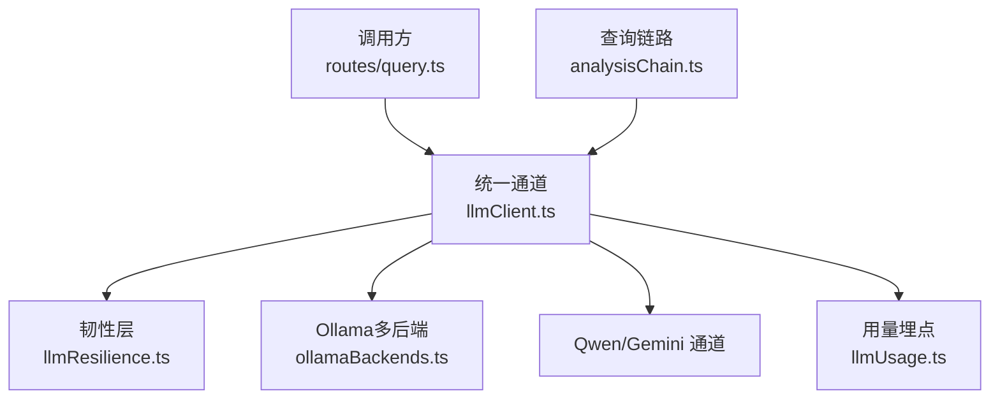
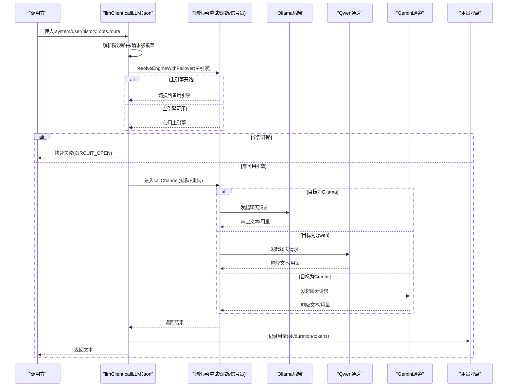
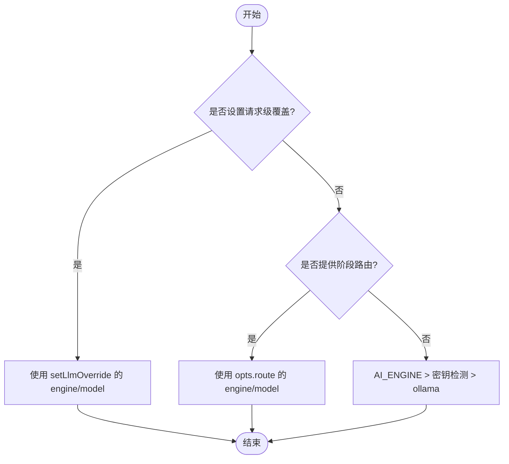
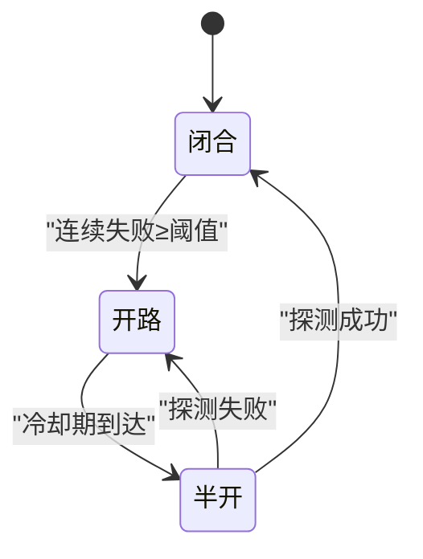
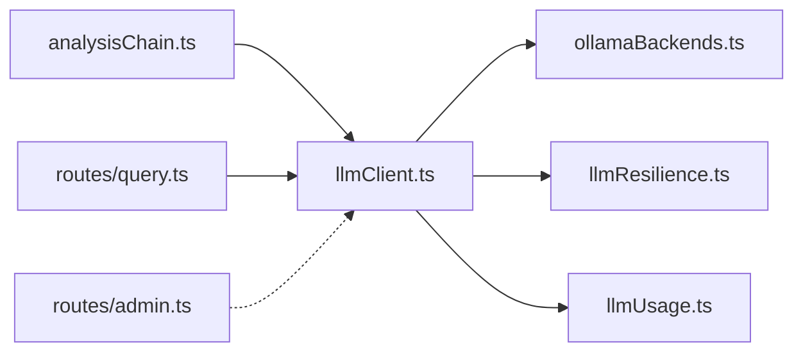

# 引擎路由与切换

<cite>
**本文引用的文件**
- [server/llm/llmClient.ts](file://server/llm/llmClient.ts)
- [server/llm/llmResilience.ts](file://server/llm/llmResilience.ts)
- [server/llm/ollamaBackends.ts](file://server/llm/ollamaBackends.ts)
- [server/query/analysisChain.ts](file://server/query/analysisChain.ts)
- [server/routes/query.ts](file://server/routes/query.ts)
- [server/routes/admin.ts](file://server/routes/admin.ts)
- [server/llm/llmUsage.ts](file://server/llm/llmUsage.ts)
</cite>

## 目录
1. [简介](#简介)
2. [项目结构](#项目结构)
3. [核心组件](#核心组件)
4. [架构总览](#架构总览)
5. [详细组件分析](#详细组件分析)
6. [依赖关系分析](#依赖关系分析)
7. [性能考量](#性能考量)
8. [故障排查指南](#故障排查指南)
9. [结论](#结论)
10. [附录：配置示例与最佳实践](#附录配置示例与最佳实践)

## 简介
本文件系统性说明“引擎路由与切换机制”，覆盖请求级覆盖、阶段级路由、环境变量显式指定、密钥自动检测、默认回退，以及熔断降级与快速失败策略。同时给出 SQL 生成阶段（LLM_SQL_ENGINE + LLM_SQL_MODEL）与数据解读阶段（LLM_ANALYSIS_ENGINE + LLM_ANALYSIS_MODEL）的优化路径，并提供可操作的配置示例与最佳实践。

## 项目结构
围绕 LLM 调用链的关键模块如下：
- 统一调用通道与路由：server/llm/llmClient.ts
- 韧性原语（重试/熔断/信号量/自适应超时）：server/llm/llmResilience.ts
- Ollama 多后端与健康检查：server/llm/ollamaBackends.ts
- 查询链路中的阶段路由使用点（SQL 生成/复杂度评估）：server/query/analysisChain.ts
- 路由层注入请求级覆盖：server/routes/query.ts
- 管理端暴露的环境变量清单：server/routes/admin.ts
- 用量埋点（按引擎/模型/通道/用户）：server/llm/llmUsage.ts

图表来源
- [server/llm/llmClient.ts:449-525](file://server/llm/llmClient.ts#L449-L525)
- [server/llm/llmResilience.ts:179-197](file://server/llm/llmResilience.ts#L179-L197)
- [server/llm/ollamaBackends.ts:74-96](file://server/llm/ollamaBackends.ts#L74-L96)
- [server/query/analysisChain.ts:97-112](file://server/query/analysisChain.ts#L97-L112)
- [server/llm/llmUsage.ts:26-50](file://server/llm/llmUsage.ts#L26-L50)

章节来源
- [server/llm/llmClient.ts:1-606](file://server/llm/llmClient.ts#L1-L606)
- [server/llm/llmResilience.ts:1-245](file://server/llm/llmResilience.ts#L1-L245)
- [server/llm/ollamaBackends.ts:1-143](file://server/llm/ollamaBackends.ts#L1-L143)
- [server/query/analysisChain.ts:1-411](file://server/query/analysisChain.ts#L1-L411)
- [server/routes/query.ts:26-26](file://server/routes/query.ts#L26-L26)
- [server/routes/admin.ts:251-252](file://server/routes/admin.ts#L251-L252)
- [server/llm/llmUsage.ts:1-134](file://server/llm/llmUsage.ts#L1-L134)

## 核心组件
- 统一通道 callLLMJson/callLLMText：封装消息组装、阶段路由、引擎选择、熔断转移、重试、用量埋点。
- 引擎选择优先级：
  1) 请求级覆盖 setLlmOverride（用户自选模型）
  2) 阶段级路由 opts.route（如 SQL 生成快速模型）
  3) AI_ENGINE 显式指定
  4) 密钥存在性自动检测（GEMINI_API_KEY/QWEN_API_KEY）
  5) ollama 默认
- 韧性层：指数退避重试、引擎级熔断器、并发信号量、自适应超时。
- Ollama 多后端：最少并发路由、健康检查摘除与恢复。
- 阶段路由：
  - SQL 生成阶段：LLM_SQL_ENGINE + LLM_SQL_MODEL
  - 数据解读阶段：LLM_ANALYSIS_ENGINE + LLM_ANALYSIS_MODEL
- 用量埋点：记录引擎/模型/通道/耗时/成功与否及用户上下文。

章节来源
- [server/llm/llmClient.ts:4-7](file://server/llm/llmClient.ts#L4-L7)
- [server/llm/llmClient.ts:163-194](file://server/llm/llmClient.ts#L163-L194)
- [server/llm/llmClient.ts:235-246](file://server/llm/llmClient.ts#L235-L246)
- [server/llm/llmResilience.ts:1-10](file://server/llm/llmResilience.ts#L1-L10)
- [server/llm/ollamaBackends.ts:1-5](file://server/llm/ollamaBackends.ts#L1-L5)
- [server/query/analysisChain.ts:97-112](file://server/query/analysisChain.ts#L97-L112)
- [server/llm/llmUsage.ts:1-23](file://server/llm/llmUsage.ts#L1-L23)

## 架构总览
下图展示一次 JSON 模式调用的完整流程：从调用入口到引擎选择、熔断转移、通道执行、用量埋点与返回。

图表来源
- [server/llm/llmClient.ts:449-525](file://server/llm/llmClient.ts#L449-L525)
- [server/llm/llmResilience.ts:179-197](file://server/llm/llmResilience.ts#L179-L197)
- [server/llm/ollamaBackends.ts:74-96](file://server/llm/ollamaBackends.ts#L74-L96)
- [server/llm/llmUsage.ts:26-50](file://server/llm/llmUsage.ts#L26-L50)

## 详细组件分析

### 引擎选择优先级与范围
- 请求级覆盖（setLlmOverride）
  - 作用范围：当前异步请求上下文内生效，避免逐层透传参数。
  - 行为：当设置了 engine 与 model，且与目标通道一致时，优先使用该模型；否则仅影响标签与默认模型推导。
  - 典型用法：鉴权后注入用户上下文，并在前端允许用户自选模型时设置覆盖。
- 阶段级路由（opts.route）
  - 作用范围：单次调用有效，常用于结构化任务（如 SQL 生成）走快速小模型。
  - 行为：若未设置请求级覆盖，则按 route.engine/route.model 决定目标引擎与模型；发生熔断转移时，因目标引擎变化会回落至该引擎默认模型。
- 环境变量显式指定（AI_ENGINE）
  - 作用范围：进程级默认引擎选择。
  - 行为：显式值优先于密钥自动检测；未设置时按密钥存在性推断，最终回退到 ollama。
- 密钥存在性自动检测
  - 行为：若存在 GEMINI_API_KEY 或 QWEN_API_KEY，则优先选择对应引擎；否则默认 ollama。
- 默认回退
  - 行为：所有条件不满足时，使用 ollama 作为默认引擎。

章节来源
- [server/llm/llmClient.ts:196-246](file://server/llm/llmClient.ts#L196-L246)
- [server/llm/llmClient.ts:449-475](file://server/llm/llmClient.ts#L449-L475)

### 阶段级路由：SQL 生成与数据解读
- SQL 生成阶段（第一阶段）
  - 通过 sqlStageRoute() 读取 LLM_SQL_ENGINE + LLM_SQL_MODEL，用于复杂度评估与后续 SQL 生成等结构化任务，提升速度与稳定性。
  - 在 analysisChain 中，复杂度评估调用 callLLMJson 并传入 { route: sqlStageRoute() }。
- 数据解读阶段（第二阶段）
  - 通过 analysisStageRoute() 读取 LLM_ANALYSIS_ENGINE + LLM_ANALYSIS_MODEL，用于大段文本解读场景，显著降低端到端耗时。
  - 在 liveQuery 等位置结合业务逻辑启用该路由，以质量/速度权衡由部署方决定。

图表来源
- [server/llm/llmClient.ts:163-194](file://server/llm/llmClient.ts#L163-L194)
- [server/llm/llmClient.ts:235-246](file://server/llm/llmClient.ts#L235-L246)
- [server/query/analysisChain.ts:97-112](file://server/query/analysisChain.ts#L97-L112)

章节来源
- [server/query/analysisChain.ts:97-112](file://server/query/analysisChain.ts#L97-L112)
- [server/llm/llmClient.ts:181-194](file://server/llm/llmClient.ts#L181-L194)

### 熔断降级与快速失败
- 引擎级熔断器
  - 连续失败达到阈值后进入“开路”状态，冷却期内拒绝请求；冷却期后进入“半开”，仅允许单探测请求。
  - 成功则重置失败计数并关闭熔断。
- 故障转移
  - 主引擎开路时，按顺序尝试已配置且未开路的备用引擎（如 ollama → qwen/gemini）。
  - 若全部开路，直接快速失败（CIRCUIT_OPEN），避免雪崩。
- 重试与限流
  - 指数退避重试（仅对超时/5xx/网络错误/429 等可恢复错误）。
  - 每引擎并发上限（Semaphore）防止打爆本地推理进程。
- 自适应超时
  - 基于近期成功调用 P95×3 动态收紧超时上限，避免慢模型误杀、快模型被长超时拖死。

图表来源
- [server/llm/llmResilience.ts:103-160](file://server/llm/llmResilience.ts#L103-L160)
- [server/llm/llmClient.ts:121-139](file://server/llm/llmClient.ts#L121-L139)
- [server/llm/llmClient.ts:458-466](file://server/llm/llmClient.ts#L458-L466)

章节来源
- [server/llm/llmResilience.ts:1-245](file://server/llm/llmResilience.ts#L1-L245)
- [server/llm/llmClient.ts:121-161](file://server/llm/llmClient.ts#L121-L161)
- [server/llm/llmClient.ts:458-466](file://server/llm/llmClient.ts#L458-L466)

### Ollama 多后端与健康检查
- 最少并发路由：在健康节点中选择 in-flight 最少的后端；全部摘除时按最早恢复时间兜底。
- 健康检查：周期探测被摘除的后端，恢复即重新接入；失败则摘除一段时间。
- 失败自动重试：同一请求在失败后尝试次优健康后端（单后端时直接抛出交由外层重试）。

章节来源
- [server/llm/ollamaBackends.ts:21-52](file://server/llm/ollamaBackends.ts#L21-L52)
- [server/llm/ollamaBackends.ts:74-96](file://server/llm/ollamaBackends.ts#L74-L96)
- [server/llm/ollamaBackends.ts:98-128](file://server/llm/ollamaBackends.ts#L98-L128)

### 用量埋点与可观测性
- 每次调用记录引擎、模型、通道、token 数、耗时、成功与否，支持按用户维度聚合。
- 写入采用 fire-and-forget，失败不影响主链路。
- 支持 Prometheus 旁路埋点与数据库落库双通道。

章节来源
- [server/llm/llmUsage.ts:1-50](file://server/llm/llmUsage.ts#L1-L50)
- [server/llm/llmClient.ts:476-523](file://server/llm/llmClient.ts#L476-L523)

## 依赖关系分析
- llmClient.ts 依赖：
  - ollamaBackends.ts：多后端选择与健康检查
  - llmResilience.ts：重试/熔断/信号量/自适应超时
  - llmUsage.ts：用量埋点
- analysisChain.ts 依赖：
  - llmClient.ts：调用 JSON 模式并传入阶段路由
- routes/query.ts：
  - 注入 setLlmOverride，实现请求级覆盖
- routes/admin.ts：
  - 暴露相关环境变量供管理端查看/配置

图表来源
- [server/query/analysisChain.ts:97-112](file://server/query/analysisChain.ts#L97-L112)
- [server/llm/llmClient.ts:449-525](file://server/llm/llmClient.ts#L449-L525)
- [server/llm/ollamaBackends.ts:74-96](file://server/llm/ollamaBackends.ts#L74-L96)
- [server/llm/llmResilience.ts:179-197](file://server/llm/llmResilience.ts#L179-L197)
- [server/llm/llmUsage.ts:26-50](file://server/llm/llmUsage.ts#L26-L50)
- [server/routes/query.ts:26-26](file://server/routes/query.ts#L26-L26)
- [server/routes/admin.ts:251-252](file://server/routes/admin.ts#L251-L252)

章节来源
- [server/llm/llmClient.ts:1-606](file://server/llm/llmClient.ts#L1-L606)
- [server/query/analysisChain.ts:1-411](file://server/query/analysisChain.ts#L1-L411)
- [server/routes/query.ts:26-26](file://server/routes/query.ts#L26-L26)
- [server/routes/admin.ts:251-252](file://server/routes/admin.ts#L251-L252)

## 性能考量
- 阶段级快速模型：SQL 生成与数据解读分别可通过 LLM_SQL_* 与 LLM_ANALYSIS_* 路由到更快更稳的小模型，显著降低端到端延迟。
- 自适应超时：根据近期 P95 动态调整超时，避免慢模型误杀与快模型被长超时拖累。
- 并发控制：每引擎最大并发限制，保护本地 Ollama 实例不被打爆。
- 多后端路由：Ollama 多节点最少并发选择与失败摘除，提高吞吐与可用性。
- 熔断与重试：仅在可恢复错误上重试，减少无效消耗；熔断防止雪崩。

[本节为通用指导，无需特定文件引用]

## 故障排查指南
- 现象：频繁出现“引擎熔断开路”
  - 可能原因：主引擎连续失败触发阈值；备用引擎也不可用。
  - 处理建议：检查密钥配置、网络连通性、后端健康；适当提高 LLM_BREAKER_FAILS 或缩短冷却期；确认备用引擎已配置。
- 现象：请求长时间无响应
  - 可能原因：超时过长或未启用自适应超时；Ollama 后端负载高。
  - 处理建议：开启自适应超时；调整 LLM_MAX_CONCURRENT；检查 OLLAMA_URLS 多后端配置。
- 现象：前端选择的模型未生效
  - 可能原因：请求级覆盖未正确设置或引擎不匹配。
  - 处理建议：确认 setLlmOverride 在请求上下文中设置；校验 engine 与目标通道一致。
- 现象：SQL 生成不稳定
  - 可能原因：复杂问题未启用快速模型路由；中间表纠错未命中。
  - 处理建议：配置 LLM_SQL_ENGINE + LLM_SQL_MODEL；确保 schema 提示准确；必要时强制评估（force）。

章节来源
- [server/llm/llmClient.ts:121-139](file://server/llm/llmClient.ts#L121-L139)
- [server/llm/llmClient.ts:458-466](file://server/llm/llmClient.ts#L458-L466)
- [server/llm/ollamaBackends.ts:98-128](file://server/llm/ollamaBackends.ts#L98-L128)
- [server/query/analysisChain.ts:133-156](file://server/query/analysisChain.ts#L133-L156)

## 结论
本系统通过“请求级覆盖 > 阶段级路由 > 环境变量显式 > 密钥自动检测 > ollama 默认”的清晰优先级，实现了灵活可控的引擎选择；配合引擎级熔断、指数重试、并发限流与自适应超时，保障在高负载与不稳定环境下的鲁棒性。SQL 生成与数据解读的阶段级快速模型路由，可在保证质量的前提下显著提升性能。建议在生产环境中合理配置各层级参数，并结合用量埋点进行持续优化。

[本节为总结，无需特定文件引用]

## 附录：配置示例与最佳实践
- 基础默认
  - 未配置任何引擎时，默认使用 ollama。
- 显式指定默认引擎
  - 设置 AI_ENGINE=gemini 或 qwen 以固定默认引擎。
- 密钥自动检测
  - 设置 GEMINI_API_KEY 或 QWEN_API_KEY 以启用对应云端引擎。
- 阶段级快速模型
  - SQL 生成：设置 LLM_SQL_ENGINE=ollama 与 LLM_SQL_MODEL=具体模型名（需合法字符集）。
  - 数据解读：设置 LLM_ANALYSIS_ENGINE=ollama 与 LLM_ANALYSIS_MODEL=具体模型名。
- 请求级覆盖
  - 在鉴权后或前端用户选择模型时，调用 setLlmOverride({ engine, model }) 以在当前请求内覆盖。
- 韧性参数
  - LLM_RETRY_MAX：最大重试次数（不含首次）。
  - LLM_MAX_CONCURRENT：每引擎最大并发。
  - LLM_BREAKER_FAILS：熔断连续失败阈值。
  - LLM_BREAKER_COOLDOWN_MS：熔断冷却期（毫秒）。
  - LLM_ADAPTIVE_TIMEOUT：是否启用自适应超时（非“0”即启用）。
- Ollama 多后端
  - OLLAMA_URLS：逗号分隔的多后端地址；服务将自动进行最少并发路由与健康检查。
- 最佳实践
  - 将结构化任务（SQL 生成/复杂度评估）路由到快速小模型，提升吞吐与稳定性。
  - 数据解读阶段可根据质量/成本权衡选择更快的模型。
  - 生产环境务必配置备用引擎与熔断参数，避免单点故障导致雪崩。
  - 结合用量埋点（llm_usage）定期复盘各引擎/模型的成本与延迟表现，持续调优。

章节来源
- [server/llm/llmClient.ts:163-194](file://server/llm/llmClient.ts#L163-L194)
- [server/llm/llmClient.ts:235-246](file://server/llm/llmClient.ts#L235-L246)
- [server/llm/llmClient.ts:449-475](file://server/llm/llmClient.ts#L449-L475)
- [server/llm/llmResilience.ts:162-197](file://server/llm/llmResilience.ts#L162-L197)
- [server/llm/ollamaBackends.ts:21-52](file://server/llm/ollamaBackends.ts#L21-L52)
- [server/routes/admin.ts:251-252](file://server/routes/admin.ts#L251-L252)
- [server/llm/llmUsage.ts:26-50](file://server/llm/llmUsage.ts#L26-L50)