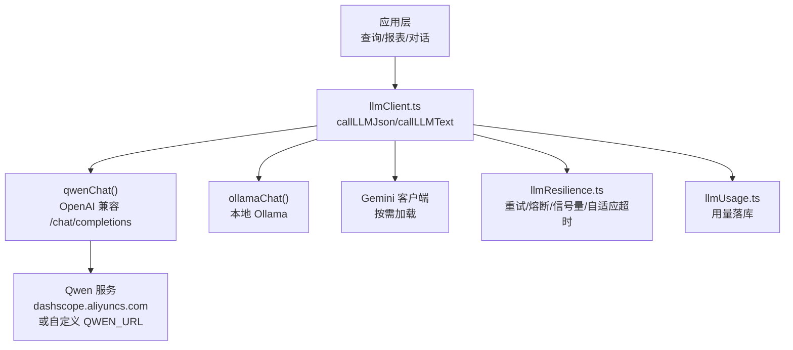
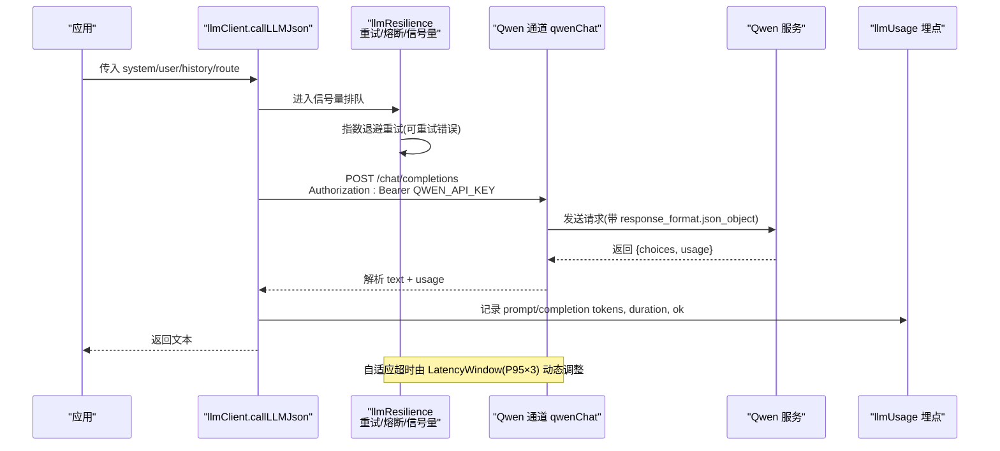
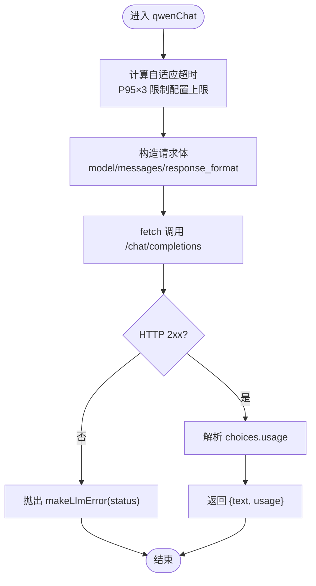
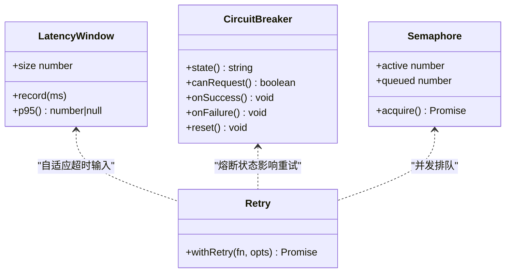
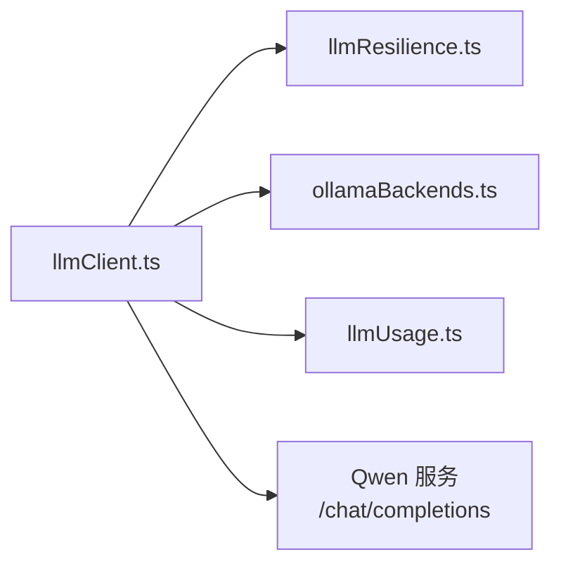

# 通义千问引擎

<cite>
**本文引用的文件**
- [llmClient.ts](file://server/llm/llmClient.ts)
- [llmResilience.ts](file://server/llm/llmResilience.ts)
- [ollamaBackends.ts](file://server/llm/ollamaBackends.ts)
- [llmUsage.ts](file://server/llm/llmUsage.ts)
- [llmBackends.test.ts](file://server/llm/llmBackends.test.ts)
- [llmClient.test.ts](file://server/llm/llmClient.test.ts)
</cite>

## 目录
1. [简介](#简介)
2. [项目结构](#项目结构)
3. [核心组件](#核心组件)
4. [架构总览](#架构总览)
5. [详细组件分析](#详细组件分析)
6. [依赖关系分析](#依赖关系分析)
7. [性能与超时](#性能与超时)
8. [故障排查指南](#故障排查指南)
9. [结论](#结论)
10. [附录：配置与调用示例](#附录配置与调用示例)

## 简介
本章节面向“通义千问（Qwen）百炼平台”的集成实现，聚焦以下目标：
- API 密钥与端点：通过环境变量 QWEN_API_KEY、QWEN_URL 完成鉴权与自定义端点（Coding Plan 场景）。
- 模型选择：默认 qwen3.8-max，支持按请求或阶段覆盖。
- OpenAI 兼容协议：统一使用 /chat/completions 接口，解析 choices.usage 统计 token 用量。
- 自适应超时与错误处理：基于滑动窗口 P95×3 的动态超时、指数退避重试、引擎级熔断与故障转移。
- 具体调用示例：普通按量 Key 与 Coding Plan Key 的配置差异与使用方法。

## 项目结构
与通义千问相关的核心代码集中在 server/llm 目录：
- llmClient.ts：统一 LLM 调用通道，封装 Qwen/Ollama/Gemini 三种后端；提供 JSON/Text/流式调用入口；实现自适应超时、重试、熔断、并发控制、用量埋点。
- llmResilience.ts：韧性原语（重试、熔断器、信号量、自适应超时）。
- ollamaBackends.ts：Ollama 多后端路由与健康检查（与 Qwen 无关但同属统一通道）。
- llmUsage.ts：LLM 用量记录与聚合查询（按引擎/模型/用户维度）。
- 测试文件：验证行为与边界条件。

图表来源
- [llmClient.ts:349-395](file://server/llm/llmClient.ts#L349-L395)
- [llmResilience.ts:179-197](file://server/llm/llmResilience.ts#L179-L197)
- [llmUsage.ts:26-49](file://server/llm/llmUsage.ts#L26-L49)

章节来源
- [llmClient.ts:1-606](file://server/llm/llmClient.ts#L1-L606)
- [llmResilience.ts:1-245](file://server/llm/llmResilience.ts#L1-L245)
- [llmUsage.ts:1-134](file://server/llm/llmUsage.ts#L1-L134)

## 核心组件
- 统一通道与引擎选择
  - 引擎优先级：请求级覆盖 > 阶段级路由 > AI_ENGINE 显式指定 > 密钥存在性自动选择（gemini/qwen）> ollama。
  - 通义千问端点：qwenUrl() 返回 QWEN_URL 或默认 https://dashscope.aliyuncs.com/compatible-mode/v1。
  - 模型名：qwenModel() 优先请求覆盖，其次 QWEN_MODEL，默认 qwen3.8-max。
  - 超时：qwenTimeoutMs() 默认 180000ms，可被自适应超时动态收紧。
- OpenAI 兼容调用
  - 请求：POST /chat/completions，Authorization: Bearer QWEN_API_KEY，JSON body 含 model/messages/response_format。
  - 响应：choices[0].message.content 为文本；usage.prompt_tokens/completion_tokens 用于统计。
- 韧性机制
  - 重试：仅对超时/5xx/网络错误/429 重试，4xx 立即失败。
  - 熔断：每引擎独立，连续失败阈值后开路，冷却期后半开探测。
  - 并发：每引擎信号量限流，避免打爆远端推理进程。
  - 自适应超时：以近期成功调用 P95×3 动态调整上限，保护慢模型不被误杀、快模型不被长超时拖死。
- 用量埋点
  - 每次调用记录 engine/model/channel/promptTokens/completionTokens/durationMs/ok 及用户上下文。
  - 写入 llm_usage 表，失败不阻断主链路。

章节来源
- [llmClient.ts:33-57](file://server/llm/llmClient.ts#L33-L57)
- [llmClient.ts:114-139](file://server/llm/llmClient.ts#L114-L139)
- [llmClient.ts:349-395](file://server/llm/llmClient.ts#L349-L395)
- [llmResilience.ts:42-49](file://server/llm/llmResilience.ts#L42-L49)
- [llmResilience.ts:103-160](file://server/llm/llmResilience.ts#L103-L160)
- [llmResilience.ts:235-244](file://server/llm/llmResilience.ts#L235-L244)
- [llmUsage.ts:26-49](file://server/llm/llmUsage.ts#L26-L49)

## 架构总览
下图展示一次 JSON 模式调用的端到端流程，包括自适应超时、重试、熔断与用量埋点。

图表来源
- [llmClient.ts:449-525](file://server/llm/llmClient.ts#L449-L525)
- [llmClient.ts:349-395](file://server/llm/llmClient.ts#L349-L395)
- [llmResilience.ts:179-197](file://server/llm/llmResilience.ts#L179-L197)
- [llmResilience.ts:235-244](file://server/llm/llmResilience.ts#L235-L244)
- [llmUsage.ts:26-49](file://server/llm/llmUsage.ts#L26-L49)

## 详细组件分析

### 通义千问 OpenAI 兼容通道
- 端点与鉴权
  - 端点：qwenUrl() + "/chat/completions"。
  - 鉴权：Authorization: Bearer QWEN_API_KEY。
- 请求体
  - model：优先请求覆盖，其次 QWEN_MODEL，默认 qwen3.8-max。
  - messages：system + history + user。
  - response_format：json_object（JSON 模式输出）。
- 响应解析
  - text：choices[0].message.content。
  - usage：prompt_tokens/completion_tokens 用于成本埋点。
- 超时与错误
  - 自适应超时：adaptiveTimeoutMs(window.qwen, configured)。
  - 超时异常：AbortError 包装为 TIMEOUT 错误码。
  - HTTP 非 2xx：抛出包含 status 的错误。

图表来源
- [llmClient.ts:349-395](file://server/llm/llmClient.ts#L349-L395)
- [llmResilience.ts:235-244](file://server/llm/llmResilience.ts#L235-L244)

章节来源
- [llmClient.ts:349-395](file://server/llm/llmClient.ts#L349-L395)

### 自适应超时与韧性机制
- 自适应超时
  - 维护每个引擎的 LatencyWindow（环形缓冲），记录成功耗时。
  - 当样本数≥10 时，取 P95×3 作为实际超时上限，并与配置上限取较小值，下限 floorMs=15000ms。
- 重试策略
  - isRetryable：TIMEOUT/AbortError/429/5xx/无状态码的网络错误可重试；CIRCUIT_OPEN 不可重试；其他 4xx 立即失败。
  - withRetry：指数退避 + 抖动，避免雪崩。
- 熔断器
  - 每引擎独立 CircuitBreaker，连续失败达到阈值后开路，冷却期后半开单探测恢复。
- 并发控制
  - Semaphore：每引擎最大并发（默认 4），超出排队等待。

图表来源
- [llmResilience.ts:201-244](file://server/llm/llmResilience.ts#L201-L244)
- [llmResilience.ts:103-160](file://server/llm/llmResilience.ts#L103-L160)
- [llmResilience.ts:53-88](file://server/llm/llmResilience.ts#L53-L88)
- [llmResilience.ts:179-197](file://server/llm/llmResilience.ts#L179-L197)

章节来源
- [llmResilience.ts:42-49](file://server/llm/llmResilience.ts#L42-L49)
- [llmResilience.ts:103-160](file://server/llm/llmResilience.ts#L103-L160)
- [llmResilience.ts:179-197](file://server/llm/llmResilience.ts#L179-L197)
- [llmResilience.ts:235-244](file://server/llm/llmResilience.ts#L235-L244)

### 用量统计与埋点
- 埋点字段：engine/model/channel/promptTokens/completionTokens/durationMs/ok 以及用户上下文 userId/username。
- 写入策略：fire-and-forget，失败仅记日志，不阻塞主链路。
- 聚合查询：按引擎/模型/用户维度统计调用次数、成功率、token 总量、平均耗时等。

章节来源
- [llmUsage.ts:26-49](file://server/llm/llmUsage.ts#L26-L49)
- [llmUsage.ts:64-90](file://server/llm/llmUsage.ts#L64-L90)
- [llmUsage.ts:105-133](file://server/llm/llmUsage.ts#L105-L133)

### 多后端与故障转移（与 Qwen 协同）
- Ollama 多后端：最少并发路由、健康检查剔除与恢复。
- 引擎级故障转移：当主引擎熔断开路时，自动切换到已配置且未开路的备用引擎（如 Ollama→Qwen）。

章节来源
- [ollamaBackends.ts:21-52](file://server/llm/ollamaBackends.ts#L21-L52)
- [ollamaBackends.ts:74-96](file://server/llm/ollamaBackends.ts#L74-L96)
- [llmClient.ts:121-139](file://server/llm/llmClient.ts#L121-L139)

## 依赖关系分析
- llmClient.ts 依赖：
  - llmResilience.ts：重试、熔断、信号量、自适应超时。
  - ollamaBackends.ts：Ollama 多后端路由（与 Qwen 并行）。
  - llmUsage.ts：用量埋点。
- 外部依赖：
  - 通义千问服务：通过 fetch 调用 OpenAI 兼容接口。
  - 数据库：写入 llm_usage 表（异步，失败不阻断）。

图表来源
- [llmClient.ts:1-26](file://server/llm/llmClient.ts#L1-L26)
- [llmClient.ts:349-395](file://server/llm/llmClient.ts#L349-L395)

章节来源
- [llmClient.ts:1-26](file://server/llm/llmClient.ts#L1-L26)

## 性能与超时
- 自适应超时
  - 依据近期成功调用 P95×3 动态调整，避免慢模型误杀与快模型被长超时拖累。
  - 可通过 LLM_ADAPTIVE_TIMEOUT=0 关闭自适应，回退到固定配置超时。
- 并发与排队
  - 每引擎默认最大并发 4，超出排队，防止打爆远端推理进程。
- 重试与熔断
  - 指数退避重试，减少瞬时抖动影响；熔断在连续失败后快速失败，避免雪崩。
- 建议
  - 合理设置 QWEN_TIMEOUT_MS（默认 180000ms），结合业务 SLA 调整。
  - 在高并发场景下，关注信号量队列长度与熔断状态，必要时扩容或降级。

章节来源
- [llmResilience.ts:235-244](file://server/llm/llmResilience.ts#L235-L244)
- [llmClient.ts:61-83](file://server/llm/llmClient.ts#L61-L83)

## 故障排查指南
- 常见错误类型
  - 超时：code=TIMEOUT，通常因网络或服务端慢导致；检查自适应超时与 QWEN_TIMEOUT_MS。
  - 熔断开路：code=CIRCUIT_OPEN，说明连续失败触发熔断；等待冷却期或排查上游服务。
  - HTTP 错误：status 非 2xx，查看服务端返回信息定位参数或鉴权问题。
- 排查步骤
  - 确认 QWEN_API_KEY 与 QWEN_URL 是否正确配置。
  - 观察熔断器状态与信号量排队情况，判断是否过载。
  - 检查用量埋点 llm_usage，确认 token 与耗时是否符合预期。
  - 对于 Ollama 多后端，检查健康检查与节点摘除状态。

章节来源
- [llmResilience.ts:18-33](file://server/llm/llmResilience.ts#L18-L33)
- [llmResilience.ts:103-160](file://server/llm/llmResilience.ts#L103-L160)
- [llmClient.ts:373-395](file://server/llm/llmClient.ts#L373-L395)
- [ollamaBackends.ts:74-96](file://server/llm/ollamaBackends.ts#L74-L96)

## 结论
本实现通过统一的 LLM 通道将通义千问百炼平台接入系统，采用 OpenAI 兼容协议简化集成；借助自适应超时、重试、熔断与并发控制，保障高可用与稳定性；用量埋点支撑成本分析与优化。针对 Coding Plan 与普通按量 Key，仅需通过 QWEN_URL 切换端点即可适配。

## 附录：配置与调用示例

### 环境变量配置
- 普通按量 Key（默认端点）
  - QWEN_API_KEY：设置为你的百炼按量密钥。
  - QWEN_MODEL：可选，默认 qwen3.8-max。
  - QWEN_TIMEOUT_MS：可选，默认 180000ms。
  - QWEN_URL：可不设置，默认 https://dashscope.aliyuncs.com/compatible-mode/v1。
- Coding Plan Key（自定义端点）
  - QWEN_API_KEY：设置为你的 Coding Plan 密钥（sk-sp- 前缀）。
  - QWEN_URL：必须设置为 Coding Plan 端点（例如 https://coding.dashscope.aliyuncs.com/v1）。
  - QWEN_MODEL：可选，默认 qwen3.8-max。
  - QWEN_TIMEOUT_MS：可选，默认 180000ms。

章节来源
- [llmClient.ts:51-55](file://server/llm/llmClient.ts#L51-L55)
- [llmClient.ts:349-367](file://server/llm/llmClient.ts#L349-L367)

### OpenAI 兼容请求格式
- 端点：{QWEN_URL}/chat/completions
- 方法：POST
- 头部：
  - Content-Type: application/json
  - Authorization: Bearer {QWEN_API_KEY}
- 请求体关键字段：
  - model：模型名称（默认 qwen3.8-max，可覆盖）
  - messages：消息数组（system/user/assistant）
  - stream：false（本通道为非流式）
  - response_format：{type: "json_object"}（JSON 模式输出）

章节来源
- [llmClient.ts:358-371](file://server/llm/llmClient.ts#L358-L371)

### 响应结构与 Token 用量
- 文本内容：choices[0].message.content
- Token 用量：usage.prompt_tokens、usage.completion_tokens
- 注意：若服务端未返回 usage，则用量字段缺省，不影响文本返回。

章节来源
- [llmClient.ts:378-386](file://server/llm/llmClient.ts#L378-L386)

### 调用示例（概念性描述）
- 普通按量 Key
  - 设置 QWEN_API_KEY 为按量密钥，不设置 QWEN_URL。
  - 调用 callLLMJson(system, user, history, {route}) 进行 JSON 模式输出。
  - 如需纯文本输出，使用 callLLMText(system, user)。
- Coding Plan Key
  - 设置 QWEN_API_KEY 为 Coding Plan 密钥，并设置 QWEN_URL 指向 Coding Plan 端点。
  - 其余调用方式与按量 Key 一致，均走 OpenAI 兼容协议。

章节来源
- [llmClient.ts:449-525](file://server/llm/llmClient.ts#L449-L525)
- [llmClient.ts:531-592](file://server/llm/llmClient.ts#L531-L592)

### 自适应超时与错误处理要点
- 自适应超时
  - 开启：默认启用，依据近期成功调用 P95×3 动态调整。
  - 关闭：设置 LLM_ADAPTIVE_TIMEOUT=0，回退到固定超时。
- 错误处理
  - 超时：捕获 AbortError 并标记为 TIMEOUT。
  - 熔断：CIRCUIT_OPEN 直接失败，避免雪崩。
  - 4xx：立即失败，不重试。
  - 5xx/网络错误：触发指数退避重试。

章节来源
- [llmResilience.ts:42-49](file://server/llm/llmResilience.ts#L42-L49)
- [llmResilience.ts:179-197](file://server/llm/llmResilience.ts#L179-L197)
- [llmClient.ts:387-395](file://server/llm/llmClient.ts#L387-L395)