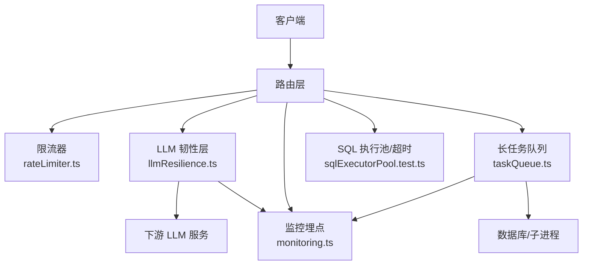
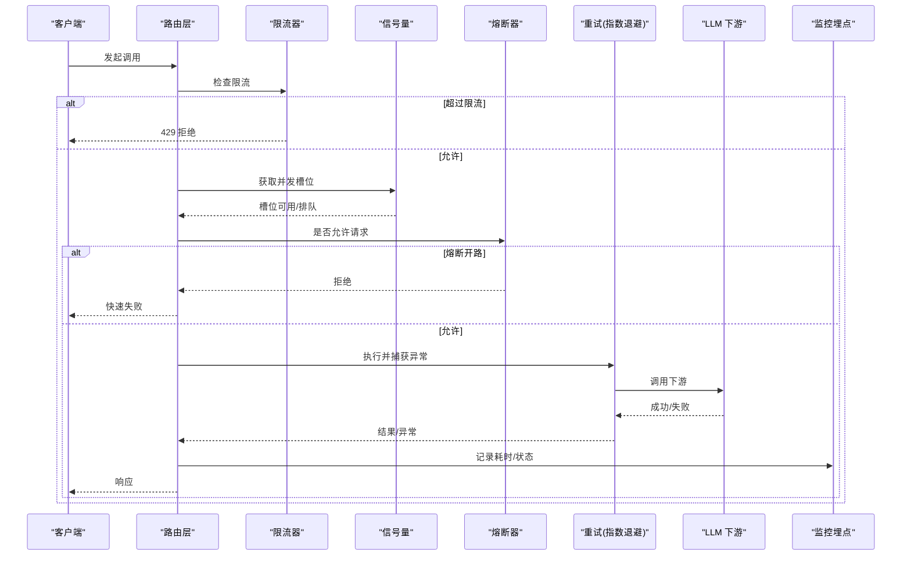
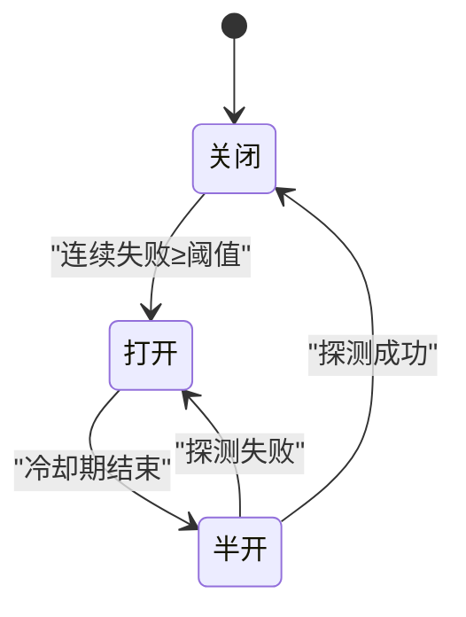
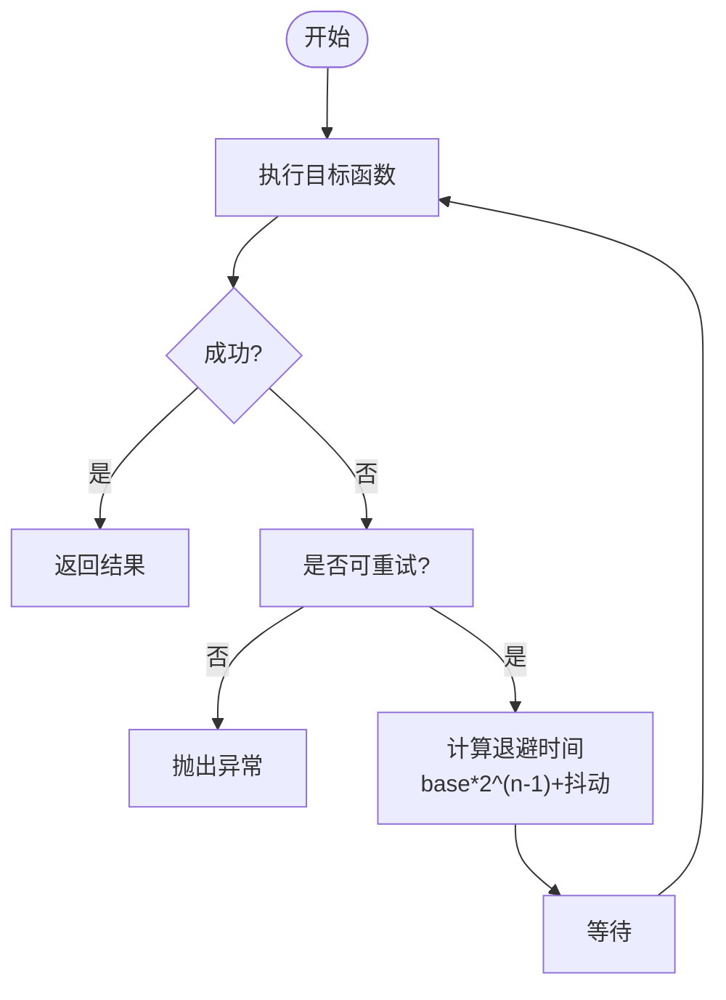
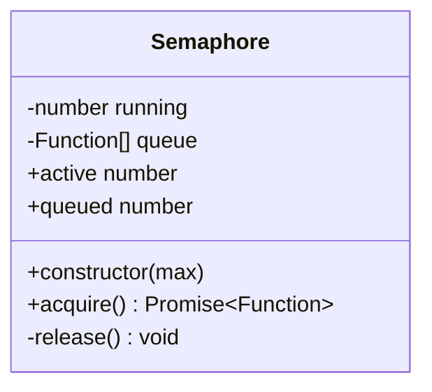
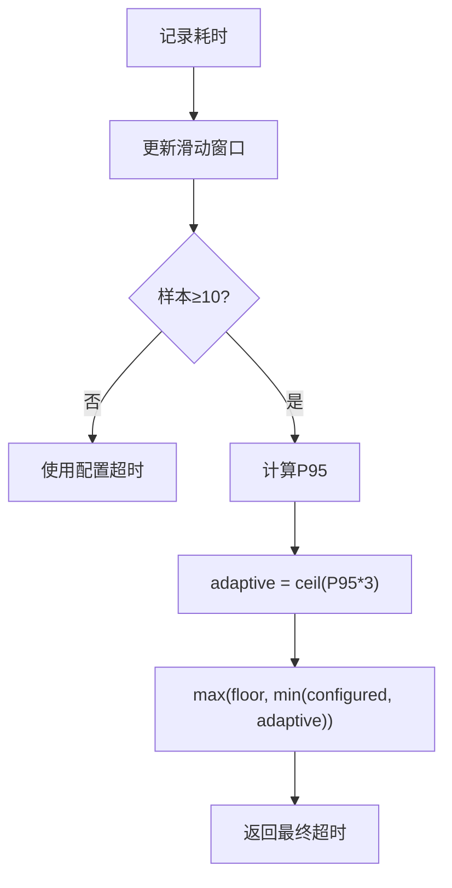
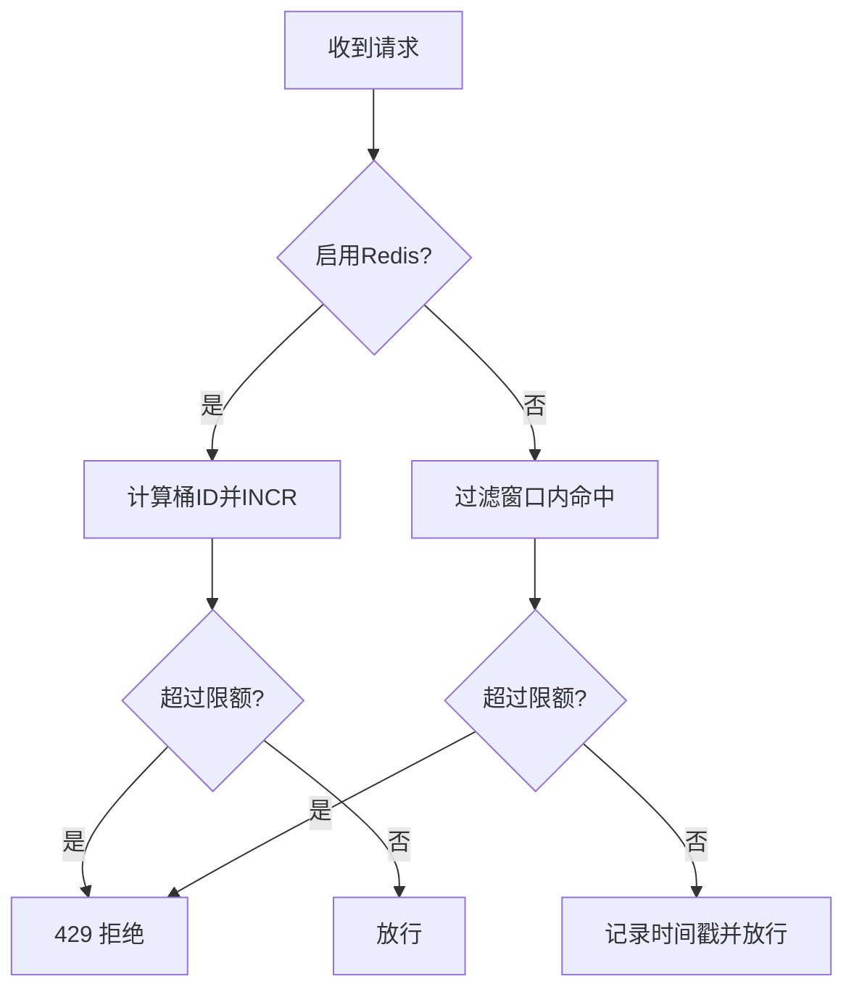
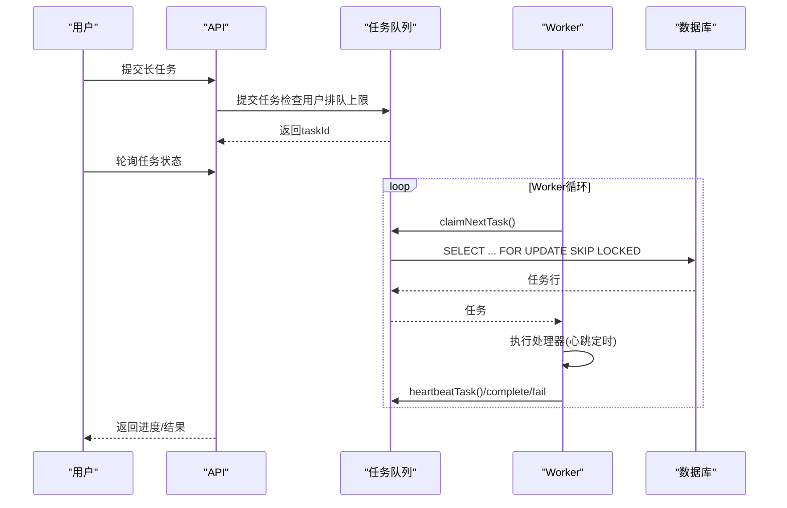
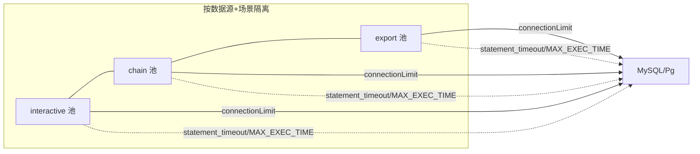
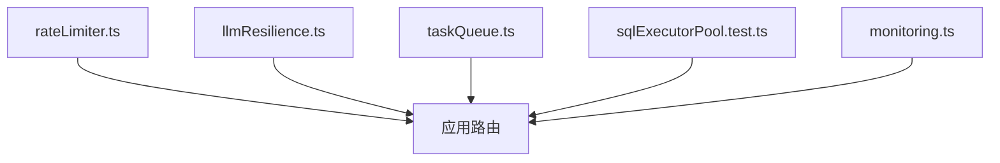

# 容错机制

<cite>
**本文引用的文件**
- [server/llm/llmResilience.ts](file://server/llm/llmResilience.ts)
- [server/infra/rateLimiter.ts](file://server/infra/rateLimiter.ts)
- [server/infra/taskQueue.ts](file://server/infra/taskQueue.ts)
- [server/query/sqlExecutorPool.test.ts](file://server/query/sqlExecutorPool.test.ts)
- [server/infra/errorCodes.ts](file://server/infra/errorCodes.ts)
- [server/infra/monitoring.ts](file://server/infra/monitoring.ts)
</cite>

## 目录
1. [简介](#简介)
2. [项目结构](#项目结构)
3. [核心组件](#核心组件)
4. [架构总览](#架构总览)
5. [详细组件分析](#详细组件分析)
6. [依赖关系分析](#依赖关系分析)
7. [性能考量](#性能考量)
8. [故障排查指南](#故障排查指南)
9. [结论](#结论)
10. [附录：配置参数与调优建议](#附录配置参数与调优建议)

## 简介
本文件系统性阐述系统的容错机制，覆盖熔断降级、自动切换、重试、并发控制与限流、资源隔离、自适应超时、错误分类与处理策略，以及监控指标与配置调优。目标是帮助读者在不深入源码的情况下理解系统如何在高负载与不稳定外部依赖下保持稳定与可恢复性。

## 项目结构
围绕容错的实现主要分布在以下模块：
- LLM 韧性原语（重试、熔断、信号量、自适应超时）
- 全局限流器（按 IP 的滑动窗口/Redis 固定窗口）
- 长任务队列（异步执行、心跳与孤儿回收、执行超时）
- SQL 执行池与场景化配额/超时（连接池分级、MySQL/Pg 超时注入）
- 统一错误码（前端可据此做精准分支）
- Prometheus 监控埋点（请求耗时、LLM 调用、SQL 执行等）

图表来源
- [server/llm/llmResilience.ts:1-245](file://server/llm/llmResilience.ts#L1-L245)
- [server/infra/rateLimiter.ts:1-54](file://server/infra/rateLimiter.ts#L1-L54)
- [server/infra/taskQueue.ts:1-347](file://server/infra/taskQueue.ts#L1-L347)
- [server/query/sqlExecutorPool.test.ts:1-171](file://server/query/sqlExecutorPool.test.ts#L1-L171)
- [server/infra/monitoring.ts:1-153](file://server/infra/monitoring.ts#L1-L153)

章节来源
- [server/llm/llmResilience.ts:1-245](file://server/llm/llmResilience.ts#L1-L245)
- [server/infra/rateLimiter.ts:1-54](file://server/infra/rateLimiter.ts#L1-L54)
- [server/infra/taskQueue.ts:1-347](file://server/infra/taskQueue.ts#L1-L347)
- [server/query/sqlExecutorPool.test.ts:1-171](file://server/query/sqlExecutorPool.test.ts#L1-L171)
- [server/infra/monitoring.ts:1-153](file://server/infra/monitoring.ts#L1-L153)

## 核心组件
- 重试与退避：指数退避 + 抖动，仅对可恢复错误重试（超时、5xx、429、网络错误），4xx 立即失败不浪费配额。
- 熔断器：按引擎隔离，连续失败达到阈值后开路；冷却期后半开单探测恢复。
- 并发信号量：按引擎限制并发槽位，超出排队而非打爆下游。
- 自适应超时：基于近期成功调用 P95×3 动态收紧上限，避免慢模型误杀、快模型被长超时拖死。
- 限流：按 IP 滑动窗口或 Redis 固定分钟窗口计数，超限返回 429。
- 长任务队列：持久化任务表、原子领取、心跳与孤儿回收、执行超时兜底、用户级排队上限。
- SQL 执行池与超时：按数据源+场景分级建池，注入 MySQL MAX_EXECUTION_TIME 或 Pg statement_timeout。
- 错误码：统一错误码便于前端精准分支（如 RATE_LIMITED、LLM_UNAVAILABLE）。
- 监控：Prometheus 埋点，fail-open 不影响业务。

章节来源
- [server/llm/llmResilience.ts:12-49](file://server/llm/llmResilience.ts#L12-L49)
- [server/llm/llmResilience.ts:51-88](file://server/llm/llmResilience.ts#L51-L88)
- [server/llm/llmResilience.ts:90-160](file://server/llm/llmResilience.ts#L90-L160)
- [server/llm/llmResilience.ts:162-197](file://server/llm/llmResilience.ts#L162-L197)
- [server/llm/llmResilience.ts:199-245](file://server/llm/llmResilience.ts#L199-L245)
- [server/infra/rateLimiter.ts:1-54](file://server/infra/rateLimiter.ts#L1-L54)
- [server/infra/taskQueue.ts:1-347](file://server/infra/taskQueue.ts#L1-L347)
- [server/query/sqlExecutorPool.test.ts:1-171](file://server/query/sqlExecutorPool.test.ts#L1-L171)
- [server/infra/errorCodes.ts:1-36](file://server/infra/errorCodes.ts#L1-L36)
- [server/infra/monitoring.ts:1-153](file://server/infra/monitoring.ts#L1-L153)

## 架构总览
下图展示一次 LLM 调用在容错链路中的流转：请求先经限流，再进入 LLM 韧性层（信号量→熔断→重试→自适应超时），最终落点到下游 LLM；同时通过监控埋点记录关键指标。

图表来源
- [server/infra/rateLimiter.ts:14-42](file://server/infra/rateLimiter.ts#L14-L42)
- [server/llm/llmResilience.ts:51-88](file://server/llm/llmResilience.ts#L51-L88)
- [server/llm/llmResilience.ts:90-160](file://server/llm/llmResilience.ts#L90-L160)
- [server/llm/llmResilience.ts:162-197](file://server/llm/llmResilience.ts#L162-L197)
- [server/infra/monitoring.ts:92-126](file://server/infra/monitoring.ts#L92-L126)

## 详细组件分析

### 熔断与降级（Circuit Breaker）
- 状态机：closed → open（连续失败达阈值）→ half-open（冷却期结束，单探测）→ closed（探测成功）。
- 半开保护：同一时刻仅允许一个探测请求，避免雪崩。
- 失败刷新：连续失败会刷新开路计时起点，半开探测失败重新计时。
- 使用方式：每个 LLM 引擎独立实例，互不干扰。

图表来源
- [server/llm/llmResilience.ts:90-160](file://server/llm/llmResilience.ts#L90-L160)

章节来源
- [server/llm/llmResilience.ts:90-160](file://server/llm/llmResilience.ts#L90-L160)

### 重试机制（指数退避 + 抖动）
- 可重试判定：显式超时、AbortError、5xx、429、无状态码的网络错误可重试；4xx（除 429）不可重试；熔断开路错误不重试。
- 退避策略：baseDelayMs × 2^(attempt-1) + 随机抖动（约 ±25%），降低多实例同频重试。
- 回调钩子：onRetry 可用于日志/埋点。

图表来源
- [server/llm/llmResilience.ts:12-49](file://server/llm/llmResilience.ts#L12-L49)
- [server/llm/llmResilience.ts:162-197](file://server/llm/llmResilience.ts#L162-L197)

章节来源
- [server/llm/llmResilience.ts:12-49](file://server/llm/llmResilience.ts#L12-L49)
- [server/llm/llmResilience.ts:162-197](file://server/llm/llmResilience.ts#L162-L197)

### 并发控制与信号量
- 每引擎独立的 Semaphore，维护 running 与 queue，acquire 返回释放函数，务必在 finally 中释放。
- 超出并发时排队等待，避免压垮下游推理进程。

图表来源
- [server/llm/llmResilience.ts:51-88](file://server/llm/llmResilience.ts#L51-L88)

章节来源
- [server/llm/llmResilience.ts:51-88](file://server/llm/llmResilience.ts#L51-L88)

### 自适应超时（P95 驱动）
- LatencyWindow：环形缓冲记录最近成功调用耗时，样本不足时不做自适应。
- 自适应公式：adaptive = ceil(P95 × 3)，并与 floorMs 和 configuredMs 夹取，保守不放大超时。
- 目的：慢模型不被误杀，快模型不被长超时拖死。

图表来源
- [server/llm/llmResilience.ts:199-245](file://server/llm/llmResilience.ts#L199-L245)

章节来源
- [server/llm/llmResilience.ts:199-245](file://server/llm/llmResilience.ts#L199-L245)

### 限流算法（IP 维度）
- 内存模式：滑动窗口记录每个 IP 的时间戳，清理过期条目。
- Redis 模式：固定分钟窗口 INCR 原子计数，多实例共享；异常 fail-closed 直接拒绝。
- 超限返回 429，提示稍后再试。

图表来源
- [server/infra/rateLimiter.ts:14-54](file://server/infra/rateLimiter.ts#L14-L54)

章节来源
- [server/infra/rateLimiter.ts:1-54](file://server/infra/rateLimiter.ts#L1-L54)

### 长任务队列（异步执行与恢复）
- 提交：同用户在途任务超上限则拒绝（由路由转 429）。
- 领取：MySQL 8 SKIP LOCKED 原子领取，避免重复消费。
- 执行：worker 并发上限可控；执行期心跳防孤儿回收；执行超时兜底。
- 恢复：启动及周期巡检回收孤儿任务，未超限回队重跑，否则标 FAILED。

图表来源
- [server/infra/taskQueue.ts:119-227](file://server/infra/taskQueue.ts#L119-L227)
- [server/infra/taskQueue.ts:271-338](file://server/infra/taskQueue.ts#L271-L338)

章节来源
- [server/infra/taskQueue.ts:1-347](file://server/infra/taskQueue.ts#L1-L347)

### SQL 执行池与场景化超时
- 场景化配额：按“交互/分析链/导出”三类场景分配不同连接池大小，防止长任务抢占交互资源。
- 场景化超时：为不同场景设置不同执行超时档位；MySQL 注入 MAX_EXECUTION_TIME，Pg 使用 statement_timeout。
- 失效重建：可按数据源失效对应池，触发重建。

图表来源
- [server/query/sqlExecutorPool.test.ts:46-171](file://server/query/sqlExecutorPool.test.ts#L46-L171)

章节来源
- [server/query/sqlExecutorPool.test.ts:1-171](file://server/query/sqlExecutorPool.test.ts#L1-L171)

### 错误分类与处理策略
- 网络错误/超时：视为可重试，配合指数退避与熔断保护。
- 业务错误（4xx）：立即失败，不重试，减少无效消耗。
- 限流错误：返回 429 并附带统一错误码，前端可做友好提示或退避重试。
- 内部错误：兜底 INTERNAL_ERROR，便于观测与告警。

章节来源
- [server/llm/llmResilience.ts:12-49](file://server/llm/llmResilience.ts#L12-L49)
- [server/infra/errorCodes.ts:1-36](file://server/infra/errorCodes.ts#L1-L36)

### 监控与可观测性
- 请求级：nl2sql_requests_total、nl2sql_duration_seconds（端点/状态分桶）。
- LLM 级：llm_call_duration_seconds、llm_tokens_total（通道/引擎/模型/成功标记）。
- SQL 级：sql_exec_duration_seconds、sql_explain_guard_total（EXPLAIN 防线统计）。
- HTTP 级：http_request_duration_seconds（/api/*）。
- 所有埋点 fail-open，异常不影响业务。

章节来源
- [server/infra/monitoring.ts:1-153](file://server/infra/monitoring.ts#L1-L153)

## 依赖关系分析
- llmResilience.ts 提供重试、熔断、信号量、自适应超时等原语，供上层调用方（如 LLM 客户端）组合使用。
- rateLimiter.ts 作为中间件前置拦截，保护后端免受突发流量冲击。
- taskQueue.ts 将长耗时任务从同步路径剥离，结合心跳与孤儿回收提升鲁棒性。
- sqlExecutorPool.test.ts 验证了按场景的池配额与超时注入逻辑，确保数据库侧资源隔离与超时兜底。
- monitoring.ts 在各关键路径旁路埋点，支撑容量规划与问题定位。

图表来源
- [server/infra/rateLimiter.ts:1-54](file://server/infra/rateLimiter.ts#L1-L54)
- [server/llm/llmResilience.ts:1-245](file://server/llm/llmResilience.ts#L1-L245)
- [server/infra/taskQueue.ts:1-347](file://server/infra/taskQueue.ts#L1-L347)
- [server/query/sqlExecutorPool.test.ts:1-171](file://server/query/sqlExecutorPool.test.ts#L1-L171)
- [server/infra/monitoring.ts:1-153](file://server/infra/monitoring.ts#L1-L153)

章节来源
- [server/infra/rateLimiter.ts:1-54](file://server/infra/rateLimiter.ts#L1-L54)
- [server/llm/llmResilience.ts:1-245](file://server/llm/llmResilience.ts#L1-L245)
- [server/infra/taskQueue.ts:1-347](file://server/infra/taskQueue.ts#L1-L347)
- [server/query/sqlExecutorPool.test.ts:1-171](file://server/query/sqlExecutorPool.test.ts#L1-L171)
- [server/infra/monitoring.ts:1-153](file://server/infra/monitoring.ts#L1-L153)

## 性能考量
- 重试退避需配合抖动，避免多实例同频重试造成二次冲击。
- 熔断阈值与冷却期应依据下游稳定性与业务容忍度调优。
- 信号量上限应与下游算力匹配，避免排队过长导致用户体验下降。
- 自适应超时以 P95×3 为基准，注意冷启动阶段样本不足时的保守行为。
- 限流窗口与阈值需结合峰值 QPS 与业务 SLA 评估。
- 长任务 worker 并发与用户排队上限需平衡吞吐与公平性。
- SQL 场景化池配额与超时要区分交互/链式/导出，避免长查询影响交互。

[本节为通用指导，无需具体文件引用]

## 故障排查指南
- 频繁 429：检查限流阈值与 Redis 模式是否正常；确认客户端是否具备退避重试。
- LLM 调用频繁失败：观察熔断状态与重试次数；核对可重试错误类型与退避参数。
- 任务长时间 RUNNING：检查心跳是否写入、孤儿回收是否生效、执行超时是否过短。
- SQL 执行缓慢或被拦截：查看 EXPLAIN 守卫统计、场景超时档位、MAX_EXECUTION_TIME 注入是否正确。
- 指标缺失：确认埋点函数是否被调用；检查 /metrics 端点鉴权与采集频率。

章节来源
- [server/infra/rateLimiter.ts:14-54](file://server/infra/rateLimiter.ts#L14-L54)
- [server/llm/llmResilience.ts:12-49](file://server/llm/llmResilience.ts#L12-L49)
- [server/infra/taskQueue.ts:202-227](file://server/infra/taskQueue.ts#L202-L227)
- [server/query/sqlExecutorPool.test.ts:98-115](file://server/query/sqlExecutorPool.test.ts#L98-L115)
- [server/infra/monitoring.ts:135-153](file://server/infra/monitoring.ts#L135-L153)

## 结论
本系统通过“限流—信号量—熔断—重试—自适应超时—场景化资源隔离—监控埋点”的分层设计，构建了端到端的容错体系。各组件职责清晰、解耦良好，既能在异常情况下快速降级，又能在恢复后平滑回归。配合统一的错误码与完善的监控，可在生产环境中实现高可用与可运维性。

[本节为总结，无需具体文件引用]

## 附录：配置参数与调优建议
- 限流
  - RATE_LIMIT_MAX：单 IP 每分钟最大请求数（默认 30）。
  - REDIS_URL：启用 Redis 固定窗口计数，支持多实例共享。
- LLM 韧性
  - withRetry：maxRetries、baseDelayMs、onRetry。
  - CircuitBreaker：failureThreshold、cooldownMs。
  - 自适应超时：configuredMs、floorMs（默认 15s）。
- 长任务队列
  - TASK_WORKER_CONCURRENCY：worker 并发上限（默认 2，最大 10）。
  - TASK_QUEUE_USER_MAX：同用户在途任务上限（默认 3，最大 50）。
  - TASK_HEARTBEAT_TIMEOUT_MS：心跳超时（默认 90s）。
  - TASK_EXEC_TIMEOUT_MS：任务执行超时（默认 600s）。
- SQL 执行池与超时
  - DS_POOL_MAX：基础池大小（默认按并发用户估算）。
  - DS_POOL_INTERACTIVE/CHAIN/EXPORT：场景化覆盖。
  - QUERY_TIMEOUT_INTERACTIVE_MS/CHAIN_MS/EXPORT_MS：场景化超时档位。
- 监控
  - METRICS_TOKEN：/metrics 访问令牌（可选）。

章节来源
- [server/infra/rateLimiter.ts:9-12](file://server/infra/rateLimiter.ts#L9-L12)
- [server/llm/llmResilience.ts:94-115](file://server/llm/llmResilience.ts#L94-L115)
- [server/llm/llmResilience.ts:164-175](file://server/llm/llmResilience.ts#L164-L175)
- [server/llm/llmResilience.ts:235-245](file://server/llm/llmResilience.ts#L235-L245)
- [server/infra/taskQueue.ts:65-84](file://server/infra/taskQueue.ts#L65-L84)
- [server/query/sqlExecutorPool.test.ts:28-37](file://server/query/sqlExecutorPool.test.ts#L28-L37)
- [server/infra/monitoring.ts:135-153](file://server/infra/monitoring.ts#L135-L153)