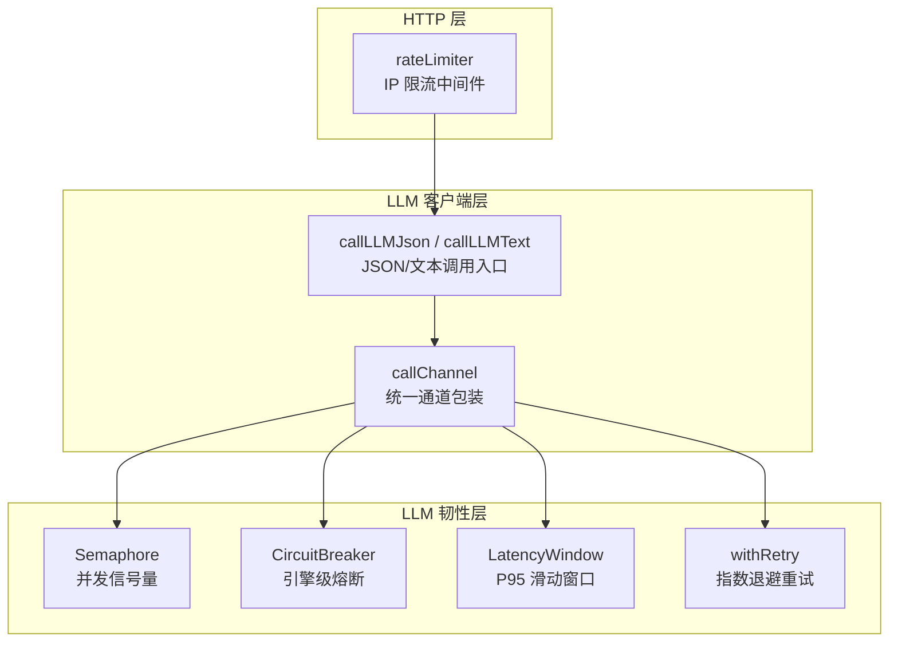
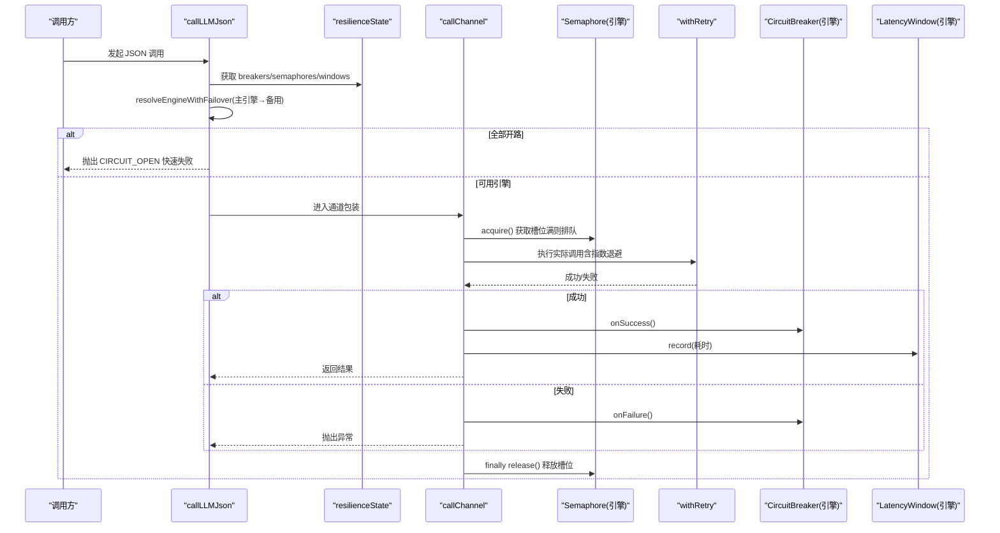
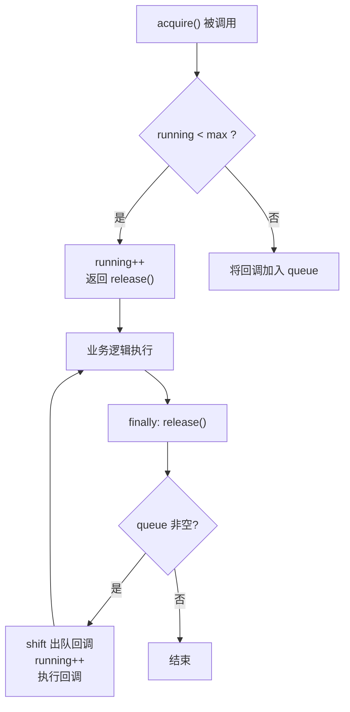
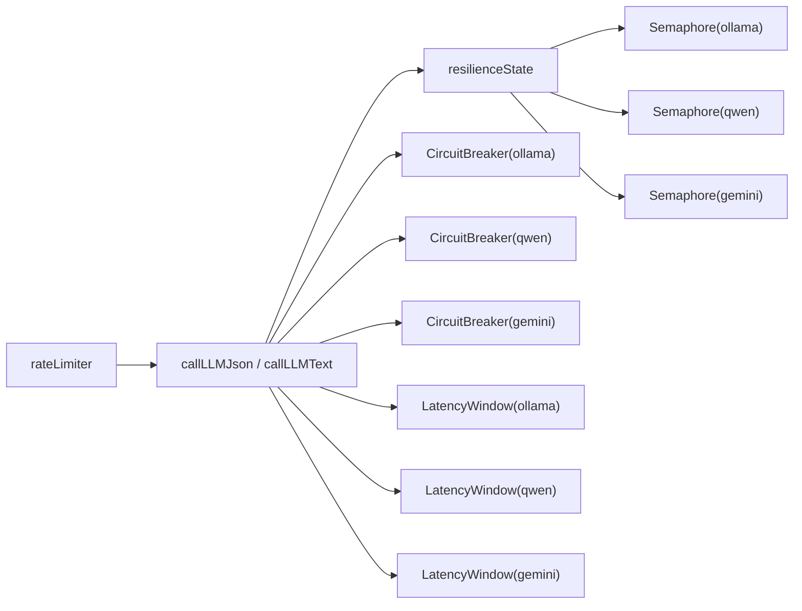

# 并发控制

<cite>
**本文引用的文件**
- [server/llm/llmResilience.ts](file://server/llm/llmResilience.ts)
- [server/llm/llmClient.ts](file://server/llm/llmClient.ts)
- [server/infra/rateLimiter.ts](file://server/infra/rateLimiter.ts)
</cite>

## 目录
1. [简介](#简介)
2. [项目结构](#项目结构)
3. [核心组件](#核心组件)
4. [架构总览](#架构总览)
5. [详细组件分析](#详细组件分析)
6. [依赖关系分析](#依赖关系分析)
7. [性能考量与调优](#性能考量与调优)
8. [故障排查指南](#故障排查指南)
9. [结论](#结论)
10. [附录](#附录)

## 简介
本文件聚焦于 LLM 调用通道的并发控制实现，围绕信号量 Semaphore 的并发槽位管理、请求排队机制与资源释放策略展开，解释每引擎隔离的限流策略，并说明本地 Ollama 为何需要严格的并发控制。同时给出 acquire/release 模式的最佳实践（确保 finally 中释放），以及 active/queued 属性的监控用途和 max 参数的性能调优建议。

## 项目结构
- 并发控制的核心原语集中在韧性层：Semaphore、CircuitBreaker、LatencyWindow、withRetry、自适应超时等。
- 调用通道在客户端层按引擎（ollama/qwen/gemini）实例化独立的 Semaphore，并通过统一的 callChannel 包装重试、熔断与信号量。
- 全局 HTTP 层提供基于 IP 的限流中间件，用于保护入口端点不被突发流量打爆。

图表来源
- [server/llm/llmResilience.ts:53-88](file://server/llm/llmResilience.ts#L53-L88)
- [server/llm/llmClient.ts:84-161](file://server/llm/llmClient.ts#L84-L161)
- [server/infra/rateLimiter.ts:14-42](file://server/infra/rateLimiter.ts#L14-L42)

章节来源
- [server/llm/llmResilience.ts:53-88](file://server/llm/llmResilience.ts#L53-L88)
- [server/llm/llmClient.ts:84-161](file://server/llm/llmClient.ts#L84-L161)
- [server/infra/rateLimiter.ts:14-42](file://server/infra/rateLimiter.ts#L14-L42)

## 核心组件
- 信号量 Semaphore：维护 running（当前并发数）与 queue（等待队列），acquire 返回 release 函数，release 在 finally 中调用以释放槽位并唤醒下一个排队者。
- 引擎隔离：每个引擎（ollama/qwen/gemini）拥有独立 Semaphore，避免跨引擎互相影响。
- 熔断器 CircuitBreaker：按引擎隔离，连续失败达到阈值后开路，冷却期后半开单探测恢复。
- 重试 withRetry：仅对可恢复错误（超时/5xx/网络错误/429）进行指数退避重试，4xx 立即失败。
- 自适应超时 LatencyWindow + adaptiveTimeoutMs：基于近期成功调用 P95×3 动态收紧超时上限，避免慢模型误杀或长超时拖死系统。

章节来源
- [server/llm/llmResilience.ts:53-88](file://server/llm/llmResilience.ts#L53-L88)
- [server/llm/llmResilience.ts:90-160](file://server/llm/llmResilience.ts#L90-L160)
- [server/llm/llmResilience.ts:162-197](file://server/llm/llmResilience.ts#L162-L197)
- [server/llm/llmResilience.ts:199-245](file://server/llm/llmResilience.ts#L199-L245)
- [server/llm/llmClient.ts:84-161](file://server/llm/llmClient.ts#L84-L161)

## 架构总览
下图展示一次 JSON 调用从入口到通道层的完整流程，包括引擎选择、熔断转移、信号量排队、重试与熔断记账、finally 释放槽位。

图表来源
- [server/llm/llmClient.ts:121-161](file://server/llm/llmClient.ts#L121-L161)
- [server/llm/llmClient.ts:449-525](file://server/llm/llmClient.ts#L449-L525)
- [server/llm/llmResilience.ts:53-88](file://server/llm/llmResilience.ts#L53-L88)
- [server/llm/llmResilience.ts:90-160](file://server/llm/llmResilience.ts#L90-L160)
- [server/llm/llmResilience.ts:162-197](file://server/llm/llmResilience.ts#L162-L197)
- [server/llm/llmResilience.ts:199-245](file://server/llm/llmResilience.ts#L199-L245)

## 详细组件分析

### 信号量 Semaphore：并发槽位管理与排队机制
- 并发槽位：running 记录当前正在执行的请求数；当 running < max 时直接放行并递增。
- 请求队列：当达到并发上限时，将回调推入 queue；后续 release 会 shift 出队一个回调并立即执行，从而“唤醒”下一个请求。
- 资源释放：acquire 返回 release 函数，必须在 finally 中调用，确保无论成功或异常都释放槽位并推进队列。
- 监控属性：active 返回 running，queued 返回 queue.length，可用于观测当前并发与排队深度。

图表来源
- [server/llm/llmResilience.ts:53-88](file://server/llm/llmResilience.ts#L53-L88)

章节来源
- [server/llm/llmResilience.ts:53-88](file://server/llm/llmResilience.ts#L53-L88)

### 每引擎隔离的限流策略与本地 Ollama 的必要性
- 隔离设计：resilienceState 为每个引擎创建独立的 Semaphore/CircuitBreaker/LatencyWindow，避免不同后端相互影响。
- 为什么本地 Ollama 需要严格并发控制：本地推理进程算力有限，超出并发会打爆推理进程导致抖动甚至崩溃；通过 Semaphore 将多余请求排队，保证稳定吞吐与低延迟。
- 配置来源：max 由环境变量 LLM_MAX_CONCURRENT 决定，默认值保障本地 Ollama 的安全并发上限。

章节来源
- [server/llm/llmClient.ts:67-71](file://server/llm/llmClient.ts#L67-L71)
- [server/llm/llmClient.ts:84-107](file://server/llm/llmClient.ts#L84-L107)

### acquire/release 最佳实践
- 始终使用 try/finally 包裹业务逻辑，确保 release 一定被执行。
- 在 callChannel 中统一封装：先 acquire，再执行重试与熔断记账，最后在 finally 中 release。
- 禁止在异步分支中遗漏 release，否则会导致槽位泄漏与队列停滞。

章节来源
- [server/llm/llmClient.ts:141-161](file://server/llm/llmClient.ts#L141-L161)

### 监控指标：active 与 queued 的用途
- active：当前并发度，用于观察是否接近 max，判断是否需要扩容或调优。
- queued：排队长度，反映拥塞程度；持续高 queued 意味着 max 过小或下游响应过慢。
- 建议结合日志与埋点，定期采集这两个指标，形成告警与容量规划依据。

章节来源
- [server/llm/llmResilience.ts:81-88](file://server/llm/llmResilience.ts#L81-L88)

### 自适应超时与重试的配合
- 自适应超时：LatencyWindow 记录成功调用耗时，adaptiveTimeoutMs 取 P95×3 并与配置上限比较，避免慢模型误杀或长超时拖死。
- 重试策略：withRetry 对可恢复错误进行指数退避重试，减少瞬时抖动带来的失败率。
- 熔断配合：onSuccess/onFailure 更新熔断状态，防止雪崩。

章节来源
- [server/llm/llmResilience.ts:162-197](file://server/llm/llmResilience.ts#L162-L197)
- [server/llm/llmResilience.ts:199-245](file://server/llm/llmResilience.ts#L199-L245)
- [server/llm/llmClient.ts:476-525](file://server/llm/llmClient.ts#L476-L525)

## 依赖关系分析
- llmClient 依赖 resilience 层提供的 Semaphore/CircuitBreaker/LatencyWindow/withRetry。
- 每个引擎在 resilienceState 中初始化各自的实例，形成“一引擎一限流/熔断/窗口”的强隔离。
- HTTP 层 rateLimiter 作为入口限流，与引擎级并发控制互补：前者防入口过载，后者防下游过载。

图表来源
- [server/llm/llmClient.ts:84-107](file://server/llm/llmClient.ts#L84-L107)
- [server/infra/rateLimiter.ts:14-42](file://server/infra/rateLimiter.ts#L14-L42)

章节来源
- [server/llm/llmClient.ts:84-107](file://server/llm/llmClient.ts#L84-L107)
- [server/infra/rateLimiter.ts:14-42](file://server/infra/rateLimiter.ts#L14-L42)

## 性能考量与调优
- max 参数调优建议
  - 本地 Ollama：根据 CPU/GPU 与模型大小设置合理并发，避免打爆推理进程；可从默认值逐步上调，观察 active/queued 与 P95 延迟。
  - 云端引擎（qwen/gemini）：受限于 API 配额与速率限制，适当降低并发可减少 429 与超时。
- 监控与告警
  - 关注 active 接近 max 的情况，若频繁触发排队，考虑提升 max 或优化下游响应。
  - 关注 queued 持续增长，可能意味着下游变慢或 max 过小。
- 自适应超时
  - 开启自适应超时（默认）可根据历史 P95 动态调整，避免固定超时的僵化问题。
- 重试与熔断
  - 合理设置重试次数与退避基数，避免放大负载；熔断阈值与冷却期需结合线上稳定性调优。

[本节为通用指导，不直接分析具体文件]

## 故障排查指南
- 现象：请求长时间排队或超时
  - 检查 active 与 queued：若 queued 很高且 active 接近 max，说明并发上限不足或下游过慢。
  - 检查熔断状态：若处于 open/half-open，可能是连续失败导致，查看上游健康与重试日志。
- 现象：频繁 429 或超时
  - 检查重试策略与自适应超时：确认是否在合理范围内；必要时降低并发或提高超时上限。
- 现象：内存占用增长
  - 检查是否有未释放的槽位：确保所有调用路径都在 finally 中调用 release。
- 入口限流命中
  - 检查 rateLimiter 的计数与 Redis/内存模式行为，确认是否因突发流量被拦截。

章节来源
- [server/llm/llmResilience.ts:53-88](file://server/llm/llmResilience.ts#L53-L88)
- [server/llm/llmClient.ts:141-161](file://server/llm/llmClient.ts#L141-L161)
- [server/infra/rateLimiter.ts:14-42](file://server/infra/rateLimiter.ts#L14-L42)

## 结论
本实现通过引擎隔离的信号量、熔断器、重试与自适应超时，构建了稳健的 LLM 调用通道。Semaphore 的 acquire/release 模式确保了并发可控与资源安全释放；active/queued 提供了直观的监控维度；max 参数结合线上指标进行调优，可有效平衡吞吐与延迟。配合入口限流与熔断转移，系统在本地 Ollama 与云端引擎之间具备弹性与韧性。

## 附录
- 关键配置项
  - LLM_MAX_CONCURRENT：每引擎最大并发（默认 4）
  - LLM_RETRY_MAX：最大重试次数（不含首次，默认 2）
  - LLM_BREAKER_FAILS：熔断连续失败阈值（默认 3）
  - LLM_BREAKER_COOLDOWN_MS：熔断冷却期（默认 30s）
  - LLM_ADAPTIVE_TIMEOUT：是否启用自适应超时（默认开启）
- 相关实现位置
  - 信号量与熔断：见韧性层定义
  - 通道包装与 finally 释放：见 callChannel
  - 引擎隔离实例化：见 resilienceState
  - 入口限流：见 rateLimiter

章节来源
- [server/llm/llmClient.ts:63-82](file://server/llm/llmClient.ts#L63-L82)
- [server/llm/llmClient.ts:84-107](file://server/llm/llmClient.ts#L84-L107)
- [server/llm/llmClient.ts:141-161](file://server/llm/llmClient.ts#L141-L161)
- [server/infra/rateLimiter.ts:14-42](file://server/infra/rateLimiter.ts#L14-L42)