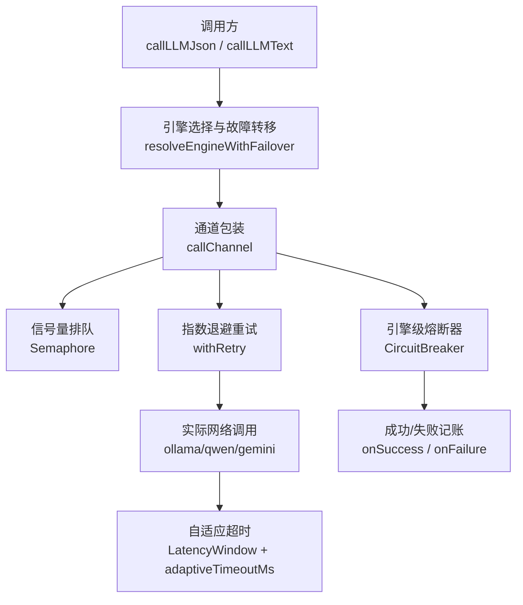
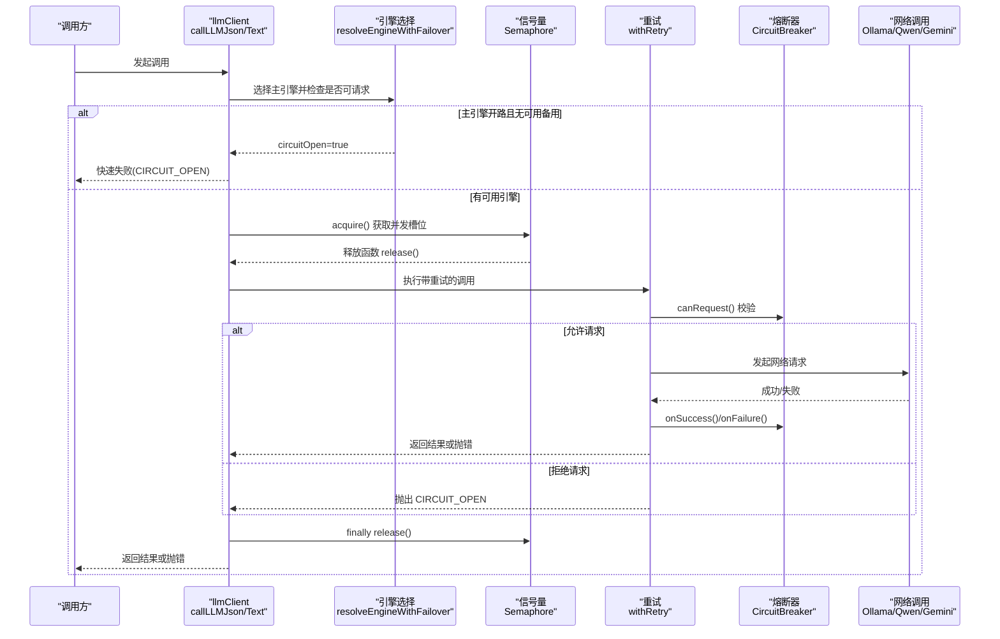
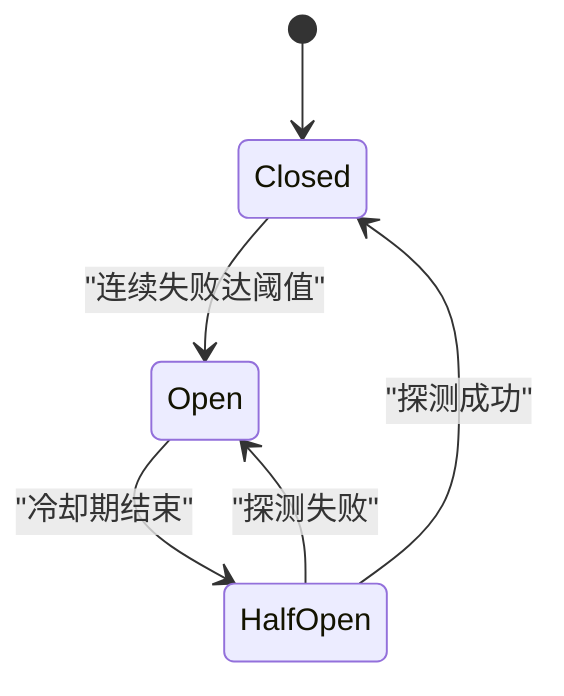
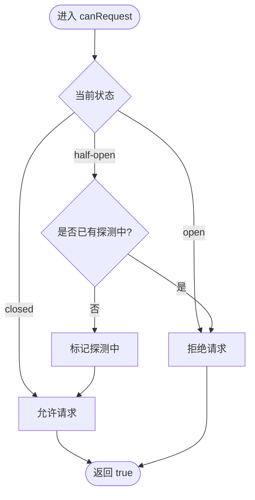
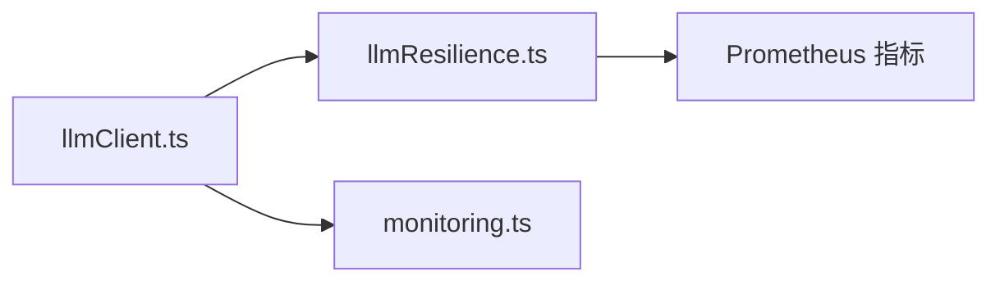

# 熔断器机制

<cite>
**本文引用的文件**
- [server/llm/llmResilience.ts](file://server/llm/llmResilience.ts)
- [server/llm/llmClient.ts](file://server/llm/llmClient.ts)
- [server/infra/monitoring.ts](file://server/infra/monitoring.ts)
- [server/llm/llmResilience.test.ts](file://server/llm/llmResilience.test.ts)
</cite>

## 目录
1. [简介](#简介)
2. [项目结构](#项目结构)
3. [核心组件](#核心组件)
4. [架构总览](#架构总览)
5. [详细组件分析](#详细组件分析)
6. [依赖关系分析](#依赖关系分析)
7. [性能考量](#性能考量)
8. [故障排查指南](#故障排查指南)
9. [结论](#结论)
10. [附录：配置与监控示例](#附录：配置与监控示例)

## 简介
本文件系统性阐述本项目中 LLM 调用通道的熔断器机制，重点包括三态转换逻辑（closed/open/half-open）、故障检测算法、连续失败计数、冷却期管理、半开状态下的单探测请求机制，以及如何通过熔断与重试、并发限流、自适应超时等韧性原语协同防止雪崩。同时给出关键配置参数说明、调优建议以及状态监控与重置方法的使用指引。

## 项目结构
与熔断器直接相关的代码集中在 LLM 韧性层与客户端通道层：
- 韧性原语实现：CircuitBreaker、Semaphore、LatencyWindow、withRetry、自适应超时等位于 resilience 模块。
- 客户端集成：在统一 LLM 调用入口中按引擎维度维护熔断器实例，并组合信号量、重试、自适应超时形成完整链路。
- 监控埋点：通过统一的监控模块暴露指标，便于观测熔断相关行为（如错误率、耗时分布）。

图表来源
- [server/llm/llmClient.ts:121-161](file://server/llm/llmClient.ts#L121-L161)
- [server/llm/llmClient.ts:449-525](file://server/llm/llmClient.ts#L449-L525)
- [server/llm/llmResilience.ts:53-88](file://server/llm/llmResilience.ts#L53-L88)
- [server/llm/llmResilience.ts:103-160](file://server/llm/llmResilience.ts#L103-L160)
- [server/llm/llmResilience.ts:179-197](file://server/llm/llmResilience.ts#L179-L197)
- [server/llm/llmResilience.ts:202-244](file://server/llm/llmResilience.ts#L202-L244)

章节来源
- [server/llm/llmClient.ts:121-161](file://server/llm/llmClient.ts#L121-L161)
- [server/llm/llmResilience.ts:103-160](file://server/llm/llmResilience.ts#L103-L160)

## 核心组件
- CircuitBreaker：引擎级熔断器，维护连续失败计数、冷却期与探测标志，提供 state/canRequest/onSuccess/onFailure/reset 等方法。
- Semaphore：每引擎并发上限控制，避免打爆后端服务。
- withRetry：指数退避重试，仅对可恢复错误重试，避免放大 4xx 类不可恢复错误。
- LatencyWindow + adaptiveTimeoutMs：基于近期成功调用 P95 的滑动窗口动态调整超时，避免慢模型误杀或长尾拖死。
- 引擎选择与故障转移：主引擎开路时自动切换到备用引擎；全部开路则快速失败，防止雪崩。

章节来源
- [server/llm/llmResilience.ts:103-160](file://server/llm/llmResilience.ts#L103-L160)
- [server/llm/llmResilience.ts:53-88](file://server/llm/llmResilience.ts#L53-L88)
- [server/llm/llmResilience.ts:179-197](file://server/llm/llmResilience.ts#L179-L197)
- [server/llm/llmResilience.ts:202-244](file://server/llm/llmResilience.ts#L202-L244)
- [server/llm/llmClient.ts:121-161](file://server/llm/llmClient.ts#L121-L161)

## 架构总览
下图展示了从调用入口到具体后端的完整韧性链路，包含熔断、重试、并发限制与自适应超时的协作方式。

图表来源
- [server/llm/llmClient.ts:121-161](file://server/llm/llmClient.ts#L121-L161)
- [server/llm/llmClient.ts:449-525](file://server/llm/llmClient.ts#L449-L525)
- [server/llm/llmResilience.ts:103-160](file://server/llm/llmResilience.ts#L103-L160)
- [server/llm/llmResilience.ts:179-197](file://server/llm/llmResilience.ts#L179-L197)

## 详细组件分析

### 熔断器三态转换与故障检测
- closed（闭合）：正常放行请求；每次失败累计一次连续失败计数。
- open（开路）：达到 failureThreshold 后进入开路；冷却期内拒绝所有请求，避免雪崩。
- half-open（半开）：冷却期结束后允许单次探测请求；若探测成功则回到 closed，否则重新进入 open 并刷新冷却计时。

图表来源
- [server/llm/llmResilience.ts:103-160](file://server/llm/llmResilience.ts#L103-L160)

章节来源
- [server/llm/llmResilience.ts:103-160](file://server/llm/llmResilience.ts#L103-L160)
- [server/llm/llmResilience.test.ts:95-148](file://server/llm/llmResilience.test.ts#L95-L148)

### 连续失败计数与冷却期管理
- 连续失败计数：每次 onFailure 递增；onSuccess 清零。
- 冷却期管理：首次达到阈值时记录 openedAt；half-open 探测失败会刷新 openedAt，确保再次冷却。
- 时间注入：now 可注入用于测试与可控时序。

章节来源
- [server/llm/llmResilience.ts:103-160](file://server/llm/llmResilience.ts#L103-L160)
- [server/llm/llmResilience.test.ts:95-148](file://server/llm/llmResilience.test.ts#L95-L148)

### 半开状态下的单探测请求机制
- canRequest 在半开状态下设置 probing 标志，确保同一时刻仅一个探测请求被允许。
- 探测成功：onSuccess 清除 probing 并回到 closed。
- 探测失败：onFailure 重置 probing 并重新进入 open，刷新冷却计时。

图表来源
- [server/llm/llmResilience.ts:117-132](file://server/llm/llmResilience.ts#L117-L132)

章节来源
- [server/llm/llmResilience.ts:117-132](file://server/llm/llmResilience.ts#L117-L132)
- [server/llm/llmResilience.test.ts:111-138](file://server/llm/llmResilience.test.ts#L111-L138)

### 防止雪崩效应的策略
- 引擎级熔断：任一引擎连续失败达到阈值即开路，阻断后续请求。
- 故障转移：主引擎开路时尝试已配置的备用引擎；若全部开路则快速失败，避免堆积。
- 并发限流：Semaphore 限制每引擎并发数，防止瞬时流量打爆后端。
- 指数退避重试：对可恢复错误进行有限重试，降低抖动影响，但不过度放大负载。
- 自适应超时：根据近期成功调用 P95 动态收紧超时，避免慢查询长期占用资源。

章节来源
- [server/llm/llmClient.ts:121-161](file://server/llm/llmClient.ts#L121-L161)
- [server/llm/llmClient.ts:449-525](file://server/llm/llmClient.ts#L449-L525)
- [server/llm/llmResilience.ts:53-88](file://server/llm/llmResilience.ts#L53-L88)
- [server/llm/llmResilience.ts:179-197](file://server/llm/llmResilience.ts#L179-L197)
- [server/llm/llmResilience.ts:202-244](file://server/llm/llmResilience.ts#L202-L244)

### 配置参数与作用、调优建议
- failureThreshold（失败阈值）：连续失败次数达到该值后进入 open。默认来自环境变量 LLM_BREAKER_FAILS，未配置时为 3。调优建议：
  - 高抖动环境可适当提高阈值，减少误判。
  - 低容错环境可降低阈值，更快隔离故障。
- cooldownMs（冷却时间）：open 状态的持续时间，之后进入 half-open 允许单探测。默认来自 LLM_BREAKER_COOLDOWN_MS，未配置时为 30000ms。调优建议：
  - 后端恢复较慢时增大冷却时间，避免频繁探测造成二次压力。
  - 快速恢复场景可缩短冷却时间，提升可用性。
- maxRetries（最大重试次数）：默认来自 LLM_RETRY_MAX，未配置为 2。仅对可恢复错误重试。调优建议：
  - 网络不稳定时可适度增加，但需结合冷却与限流，避免放大负载。
- baseDelayMs（重试退避基数）：默认 1000ms，指数增长并加入抖动。调优建议：
  - 高并发下适当增大基数，配合抖动避免多实例同频重试。
- LLM_MAX_CONCURRENT（并发上限）：默认 4。本地 Ollama 算力有限，超出排队而非打爆进程。调优建议：
  - 根据硬件能力与后端承载能力调整，避免过载。
- LLM_ADAPTIVE_TIMEOUT（自适应超时开关）：默认开启。以近期成功 P95×3 动态收紧超时，下限 floorMs=15000ms，上限不超过配置超时。调优建议：
  - 稳定环境可关闭以获得固定超时；波动大时开启以自适应保护。

章节来源
- [server/llm/llmClient.ts:61-82](file://server/llm/llmClient.ts#L61-L82)
- [server/llm/llmResilience.ts:94-115](file://server/llm/llmResilience.ts#L94-L115)
- [server/llm/llmResilience.ts:164-197](file://server/llm/llmResilience.ts#L164-L197)
- [server/llm/llmResilience.ts:231-244](file://server/llm/llmResilience.ts#L231-L244)

### 使用示例：状态监控与重置
- 状态监控：
  - 通过 Prometheus 指标观察 LLM 调用耗时与成功率（ok 字段），间接反映熔断效果。
  - 关注 llm_call_duration_seconds 直方图与 llm_tokens_total 计数器，结合业务端点指标评估整体健康度。
- 重置方法：
  - 测试用重置：resetLlmResilienceForTest 可重置全部熔断/信号量/耗时窗口状态，便于用例隔离。
  - 熔断器内部 reset：CircuitBreaker.reset 可将单个引擎熔断器重置为 closed。

章节来源
- [server/infra/monitoring.ts:46-61](file://server/infra/monitoring.ts#L46-L61)
- [server/infra/monitoring.ts:116-126](file://server/infra/monitoring.ts#L116-L126)
- [server/llm/llmClient.ts:109-112](file://server/llm/llmClient.ts#L109-L112)
- [server/llm/llmResilience.ts:150-155](file://server/llm/llmResilience.ts#L150-L155)

## 依赖关系分析
- llmClient.ts 依赖 llmResilience.ts 提供的 CircuitBreaker、Semaphore、withRetry、LatencyWindow 与自适应超时。
- 引擎选择与故障转移在 llmClient.ts 中实现，组合上述韧性原语形成端到端保护。
- 监控埋点在 monitoring.ts 中集中暴露，供外部系统采集。

图表来源
- [server/llm/llmClient.ts:121-161](file://server/llm/llmClient.ts#L121-L161)
- [server/llm/llmResilience.ts:103-160](file://server/llm/llmResilience.ts#L103-L160)
- [server/infra/monitoring.ts:46-61](file://server/infra/monitoring.ts#L46-L61)

章节来源
- [server/llm/llmClient.ts:121-161](file://server/llm/llmClient.ts#L121-L161)
- [server/llm/llmResilience.ts:103-160](file://server/llm/llmResilience.ts#L103-L160)
- [server/infra/monitoring.ts:46-61](file://server/infra/monitoring.ts#L46-L61)

## 性能考量
- 并发限流：Semaphore 将突发流量转为排队，避免后端过载。
- 重试策略：指数退避+抖动降低重试风暴风险；仅对可恢复错误重试，避免浪费配额。
- 自适应超时：依据近期成功调用 P95 动态调整，既保护慢模型不被误杀，也避免快模型被长超时拖累。
- 熔断冷却：合理设置 failureThreshold 与 cooldownMs，平衡误判与恢复速度。

[本节为通用指导，不直接分析具体文件]

## 故障排查指南
- 常见问题定位：
  - 频繁触发熔断：检查 failureThreshold 与后端稳定性；必要时提高阈值或优化后端。
  - 长时间处于 open：确认 cooldownMs 是否过短导致反复探测失败；适当延长冷却期。
  - 半开探测失败：查看 onRetry 日志与网络错误类型，确认是否为可恢复错误。
- 监控与诊断：
  - 通过 llm_call_duration_seconds 观察异常时段耗时尖刺。
  - 结合业务端点指标与审计落账统计，定位问题范围。
- 快速恢复手段：
  - 使用 resetLlmResilienceForTest 重置全局韧性状态（测试环境）。
  - 针对特定引擎调用 CircuitBreaker.reset 恢复 closed。

章节来源
- [server/llm/llmResilience.test.ts:95-148](file://server/llm/llmResilience.test.ts#L95-L148)
- [server/infra/monitoring.ts:116-126](file://server/infra/monitoring.ts#L116-L126)
- [server/llm/llmClient.ts:109-112](file://server/llm/llmClient.ts#L109-L112)
- [server/llm/llmResilience.ts:150-155](file://server/llm/llmResilience.ts#L150-L155)

## 结论
本项目通过引擎级熔断器、并发限流、指数退避重试与自适应超时构建了一套完整的 LLM 调用韧性体系。三态转换与单探测机制有效防止雪崩，故障转移提升可用性，监控埋点支持持续观测与调优。合理配置 failureThreshold、cooldownMs 等参数并结合监控数据，可在不同环境下取得稳定与高效的平衡。

[本节为总结性内容，不直接分析具体文件]

## 附录：配置与监控示例
- 关键环境变量
  - LLM_BREAKER_FAILS：失败阈值（默认 3）
  - LLM_BREAKER_COOLDOWN_MS：冷却时间毫秒（默认 30000）
  - LLM_RETRY_MAX：最大重试次数（默认 2）
  - LLM_MAX_CONCURRENT：并发上限（默认 4）
  - LLM_ADAPTIVE_TIMEOUT：自适应超时开关（默认开启）
- 监控指标
  - llm_call_duration_seconds：LLM 调用耗时直方图（按 channel/engine/model/ok 分）
  - llm_tokens_total：token 消耗计数器（按 channel/model/type 分）
- 重置方法
  - 全局重置：resetLlmResilienceForTest（测试用）
  - 单引擎重置：CircuitBreaker.reset

章节来源
- [server/llm/llmClient.ts:61-82](file://server/llm/llmClient.ts#L61-L82)
- [server/infra/monitoring.ts:46-61](file://server/infra/monitoring.ts#L46-L61)
- [server/llm/llmClient.ts:109-112](file://server/llm/llmClient.ts#L109-L112)
- [server/llm/llmResilience.ts:150-155](file://server/llm/llmResilience.ts#L150-L155)