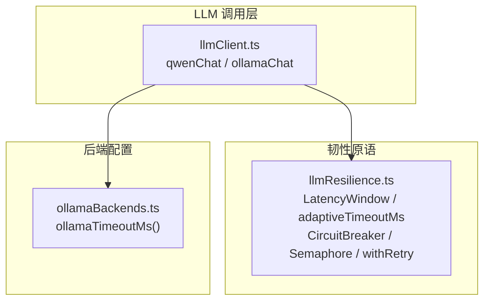
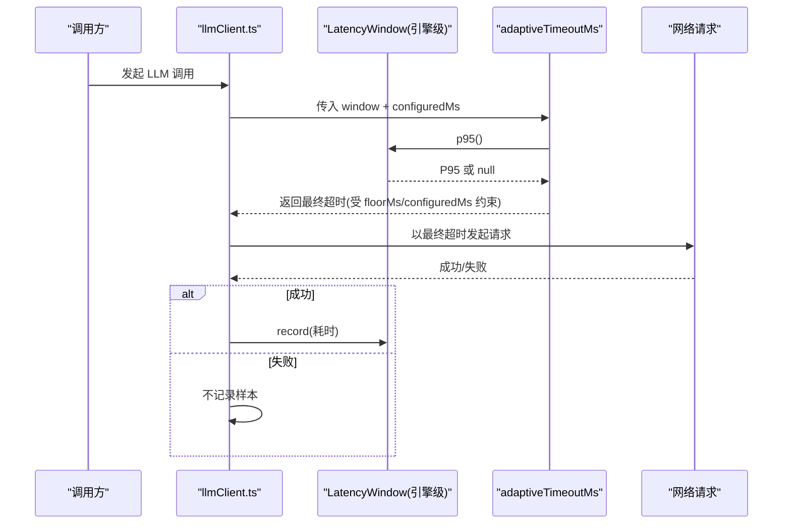
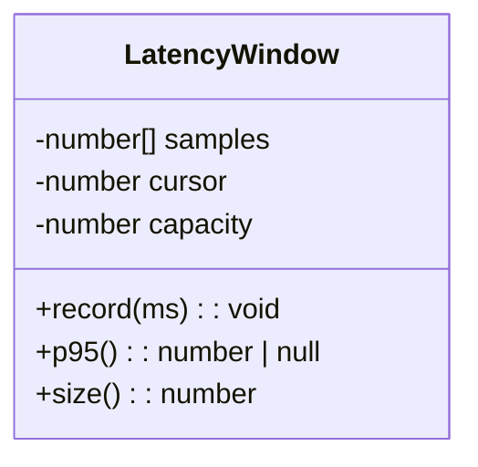
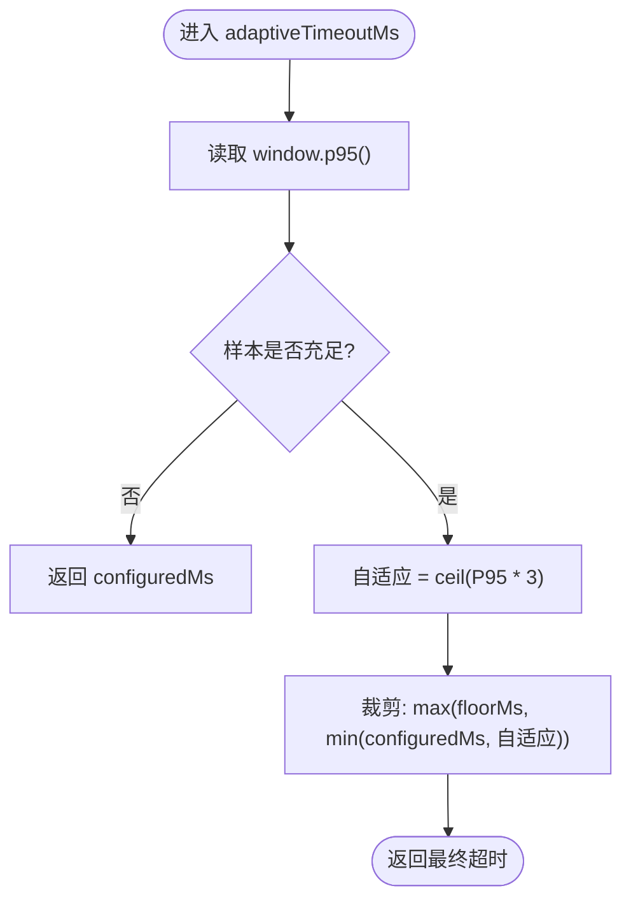
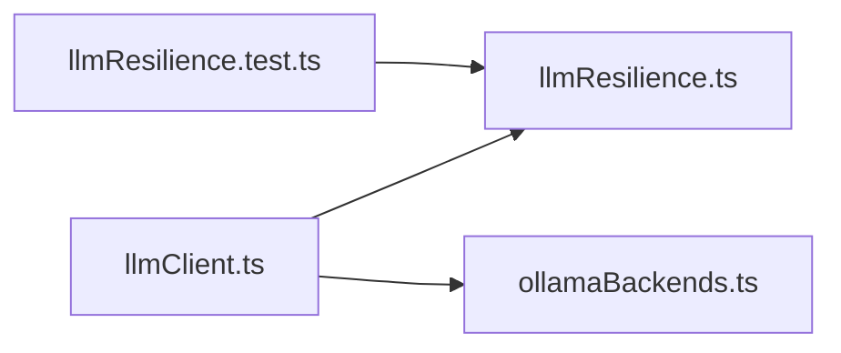

# 自适应超时

<cite>
**本文引用的文件**
- [server/llm/llmResilience.ts](file://server/llm/llmResilience.ts)
- [server/llm/llmClient.ts](file://server/llm/llmClient.ts)
- [server/llm/ollamaBackends.ts](file://server/llm/ollamaBackends.ts)
- [server/llm/llmResilience.test.ts](file://server/llm/llmResilience.test.ts)
</cite>

## 目录
1. [简介](#简介)
2. [项目结构](#项目结构)
3. [核心组件](#核心组件)
4. [架构总览](#架构总览)
5. [详细组件分析](#详细组件分析)
6. [依赖关系分析](#依赖关系分析)
7. [性能考量](#性能考量)
8. [故障排查指南](#故障排查指南)
9. [结论](#结论)
10. [附录](#附录)

## 简介
本文件围绕“自适应超时”机制，系统性解析 LatencyWindow 滑动窗口算法（环形缓冲、P95 分位数计算、样本容量管理），以及 adaptiveTimeoutMs 的动态调整逻辑（P95×3、floorMs 下限保护、configuredMs 上限限制）。同时解释为何选择 P95 作为统计指标，如何在响应时间与资源利用率之间取得平衡，并给出不同场景下的超时配置建议与监控指标。

## 项目结构
自适应超时能力位于 LLM 调用韧性模块中，由 llmResilience.ts 提供基础原语（LatencyWindow、adaptiveTimeoutMs、熔断、重试、信号量），并由 llmClient.ts 在 Qwen/Ollama/Gemini 各通道中集成使用；Ollama 的默认超时通过 ollamaBackends.ts 暴露。

图表来源
- [server/llm/llmClient.ts:349-442](file://server/llm/llmClient.ts#L349-L442)
- [server/llm/llmResilience.ts:202-244](file://server/llm/llmResilience.ts#L202-L244)
- [server/llm/ollamaBackends.ts:9](file://server/llm/ollamaBackends.ts#L9)

章节来源
- [server/llm/llmClient.ts:349-442](file://server/llm/llmClient.ts#L349-L442)
- [server/llm/llmResilience.ts:202-244](file://server/llm/llmResilience.ts#L202-L244)
- [server/llm/ollamaBackends.ts:9](file://server/llm/ollamaBackends.ts#L9)

## 核心组件
- LatencyWindow：基于固定容量的环形缓冲记录成功调用的耗时样本，并提供 P95 分位数计算。
- adaptiveTimeoutMs：根据窗口内 P95×3 动态计算超时，并以 floorMs 为下限、configuredMs 为上限进行裁剪。
- 引擎通道集成：Qwen 与 Ollama 在发起请求前计算最终超时，并在成功时记录耗时样本。

章节来源
- [server/llm/llmResilience.ts:202-244](file://server/llm/llmResilience.ts#L202-L244)
- [server/llm/llmClient.ts:349-442](file://server/llm/llmClient.ts#L349-L442)

## 架构总览
自适应超时的端到端流程如下：
- 每个引擎维护独立的 LatencyWindow。
- 每次成功调用后，将耗时记录进对应引擎的窗口。
- 下一次调用前，根据窗口 P95×3 计算自适应超时，并与配置上限和最小下限做夹取。
- 若样本不足或自适应值超过配置上限，则回退到配置上限，避免放大超时。

图表来源
- [server/llm/llmClient.ts:349-442](file://server/llm/llmClient.ts#L349-L442)
- [server/llm/llmResilience.ts:202-244](file://server/llm/llmResilience.ts#L202-L244)

## 详细组件分析

### LatencyWindow 滑动窗口算法
- 数据结构：内部使用数组 samples 作为环形缓冲，cursor 用于定位写入位置。
- 写入策略：
  - 当样本数未满 capacity（默认 50）时，直接 push 新样本。
  - 达到容量后，按 cursor % capacity 覆盖旧样本，形成“先进先出”的滑动窗口。
- 样本容量管理：
  - 容量固定为 50，保证内存稳定且具备足够统计意义。
  - 仅记录成功调用的耗时，失败不计入，避免污染分布。
- P95 分位数计算：
  - 样本少于 10 条时返回 null，表示不做自适应。
  - 否则对样本排序，取索引 ceil(n*0.95)-1 的值作为 P95。
- 复杂度：
  - 写入 O(1)。
  - P95 计算 O(n log n)，n≤50，开销可忽略。

图表来源
- [server/llm/llmResilience.ts:202-229](file://server/llm/llmResilience.ts#L202-L229)

章节来源
- [server/llm/llmResilience.ts:202-229](file://server/llm/llmResilience.ts#L202-L229)

### adaptiveTimeoutMs 动态调整逻辑
- 输入：window（LatencyWindow）、configuredMs（配置上限）、floorMs（下限，默认 15000ms）。
- 计算步骤：
  1) 从 window.p95() 获取近期成功调用的 P95；若样本不足（<10），直接返回 configuredMs。
  2) 计算自适应值 = ceil(P95 × 3)。
  3) 结果裁剪：max(floorMs, min(configuredMs, 自适应值))。
- 行为特性：
  - 快模型：P95 低 → 自适应值可能低于 floorMs → 最终取 floorMs，避免过短超时导致误杀。
  - 慢模型：P95 高 → 自适应值可能高于 configuredMs → 最终取 configuredMs，避免放大超时拖死系统。
  - 保守设计：从不放大超时，只在配置上限内收紧。

图表来源
- [server/llm/llmResilience.ts:235-244](file://server/llm/llmResilience.ts#L235-L244)

章节来源
- [server/llm/llmResilience.ts:235-244](file://server/llm/llmResilience.ts#L235-L244)

### 引擎通道中的集成点
- Qwen 通道：
  - 读取配置超时 qwenTimeoutMs()。
  - 若启用自适应（默认开启），则以 adaptiveTimeoutMs(window.qwen, configured) 计算最终超时。
  - 成功后记录耗时至 window.qwen。
- Ollama 通道：
  - 读取配置超时 ollamaTimeoutMs()。
  - 同样以 adaptiveTimeoutMs(window.ollama, configured) 计算最终超时。
  - 成功后记录耗时至 window.ollama。
- 开关控制：
  - 环境变量 LLM_ADAPTIVE_TIMEOUT=0 可关闭自适应，回退到固定配置超时。

章节来源
- [server/llm/llmClient.ts:349-442](file://server/llm/llmClient.ts#L349-L442)
- [server/llm/ollamaBackends.ts:9](file://server/llm/ollamaBackends.ts#L9)

### 为什么选择 P95 作为统计指标？
- 代表性：P95 能较好反映尾部延迟，兼顾大多数请求的体验，避免被极端长尾完全主导。
- 稳定性：相比 P99/P99.9，P95 对偶发异常更稳健，减少抖动带来的频繁调整。
- 工程实践：P95×3 提供安全裕度，既能容忍突发变慢，又不会过度放宽导致雪崩。
- 资源平衡：在快模型上自动收紧超时，释放资源；在慢模型上保持配置上限，避免误杀。

[本节为概念性说明，不直接分析具体文件]

### 不同场景下的超时配置建议
- 本地 Ollama（算力有限、易拥塞）：
  - 建议配置：OLLAMA_TIMEOUT_MS 初始 180000ms；并发上限保持较小（如 4）。
  - 监控要点：观察 P95 趋势与排队长度；若 P95 持续上升，考虑降低并发或扩容节点。
- 云端 Qwen/Gemini（外部依赖、限流风险）：
  - 建议配置：QWEN_TIMEOUT_MS/GEMINI_TIMEOUT_MS 初始 180000ms；结合重试次数与熔断阈值。
  - 监控要点：关注 429/5xx 比例与 P95；若错误率升高，适当提高重试基数或缩短冷却期。
- 混合部署（多引擎）：
  - 建议：为每引擎独立窗口与超时；主引擎开路时自动切换到备用引擎。
  - 监控要点：切换频率、各引擎 P95 对比、整体成功率。

[本节为通用建议，不直接分析具体文件]

## 依赖关系分析
- llmClient.ts 依赖 llmResilience.ts 提供的 LatencyWindow、adaptiveTimeoutMs、CircuitBreaker、Semaphore、withRetry。
- llmClient.ts 依赖 ollamaBackends.ts 提供 ollamaTimeoutMs。
- 测试用例验证 LatencyWindow 与 adaptiveTimeoutMs 的行为边界。

图表来源
- [server/llm/llmClient.ts:18-25](file://server/llm/llmClient.ts#L18-L25)
- [server/llm/llmResilience.ts:202-244](file://server/llm/llmResilience.ts#L202-L244)
- [server/llm/ollamaBackends.ts:9](file://server/llm/ollamaBackends.ts#L9)
- [server/llm/llmResilience.test.ts:187-212](file://server/llm/llmResilience.test.ts#L187-L212)

章节来源
- [server/llm/llmClient.ts:18-25](file://server/llm/llmClient.ts#L18-L25)
- [server/llm/llmResilience.ts:202-244](file://server/llm/llmResilience.ts#L202-L244)
- [server/llm/ollamaBackends.ts:9](file://server/llm/ollamaBackends.ts#L9)
- [server/llm/llmResilience.test.ts:187-212](file://server/llm/llmResilience.test.ts#L187-L212)

## 性能考量
- 时间复杂度：
  - 记录样本 O(1)。
  - P95 计算 O(n log n)，n≤50，单次开销极低。
- 空间复杂度：
  - 固定容量 50，内存占用稳定。
- 并发影响：
  - 通过信号量限制并发，避免打爆推理进程。
  - 自适应超时防止长尾请求占用过多连接。
- 采样偏差：
  - 仅记录成功调用，避免失败样本拉低 P95 估计。
  - 样本不足时回退到配置上限，确保稳定性。

[本节为通用性能讨论，不直接分析具体文件]

## 故障排查指南
- 现象：超时频繁触发但实际服务正常
  - 检查：样本是否充足（≥10）；若不足，自适应未生效，仍使用配置上限。
  - 处理：等待更多成功样本；或临时提高配置上限。
- 现象：快模型被误杀
  - 检查：floorMs 是否过低；自适应值可能被裁剪到 floorMs。
  - 处理：适当提高 floorMs 或关闭自适应（LLM_ADAPTIVE_TIMEOUT=0）进行对比。
- 现象：慢模型被过早放弃
  - 检查：configuredMs 是否过小；自适应值被裁剪到 configuredMs。
  - 处理：提高配置上限，或观察 P95 趋势决定是否扩容/降级。
- 现象：切换引擎频繁
  - 检查：熔断阈值与冷却期；确认主引擎是否持续失败。
  - 处理：调整熔断参数，或修复主引擎问题。

章节来源
- [server/llm/llmResilience.test.ts:187-212](file://server/llm/llmResilience.test.ts#L187-L212)
- [server/llm/llmClient.ts:349-442](file://server/llm/llmClient.ts#L349-L442)

## 结论
该自适应超时方案通过 LatencyWindow 的 P95×3 动态调整，既能在快模型上收紧超时释放资源，又在慢模型上保持配置上限避免误杀。配合熔断、重试与并发信号量，形成完整的 LLM 调用韧性体系。建议在上线初期以配置上限为主，逐步引入自适应，并结合监控指标持续优化。

[本节为总结性内容，不直接分析具体文件]

## 附录
- 关键环境变量
  - LLM_ADAPTIVE_TIMEOUT：是否启用自适应（默认开启，设为 0 关闭）。
  - QWEN_TIMEOUT_MS：Qwen 配置超时（默认 180000ms）。
  - OLLAMA_TIMEOUT_MS：Ollama 配置超时（默认 180000ms）。
- 推荐监控指标
  - 各引擎 P95/P99 延迟趋势。
  - 自适应超时生效比例（样本充足且自适应值 < configuredMs）。
  - 熔断切换次数与冷却期命中情况。
  - 重试次数与退避间隔分布。
  - 错误率（4xx/5xx/429）与超时占比。

[本节为补充信息，不直接分析具体文件]