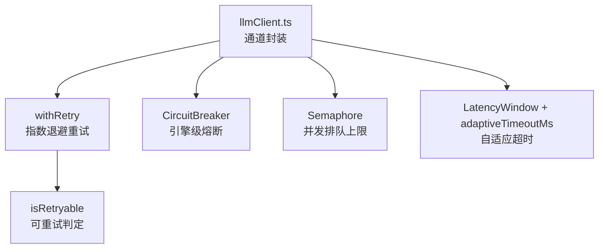
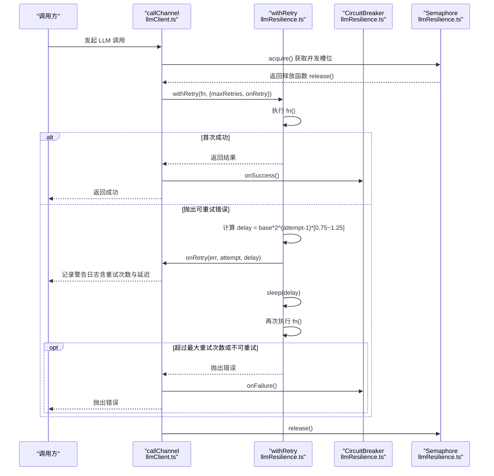
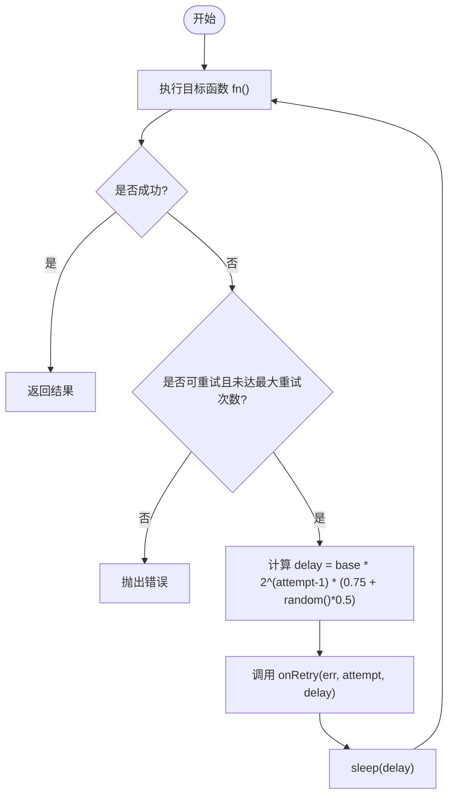
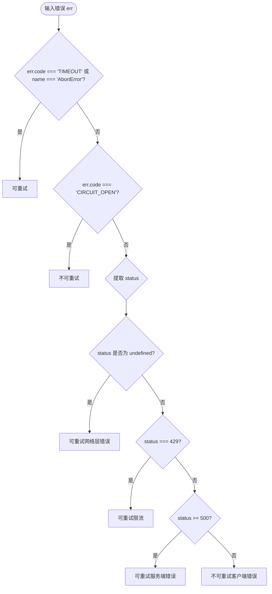
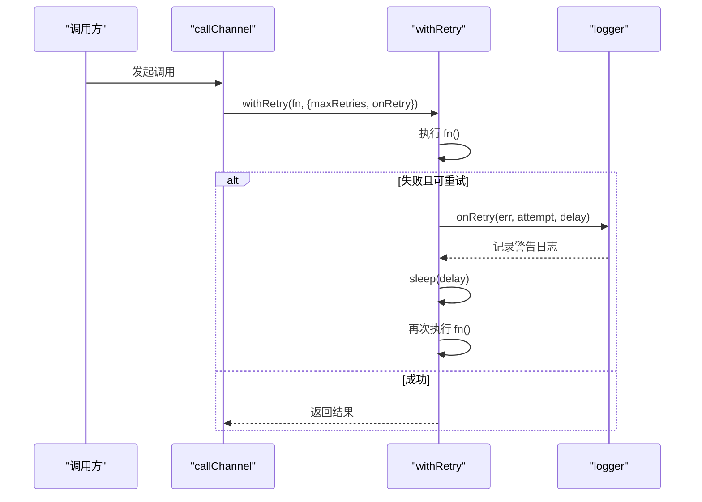
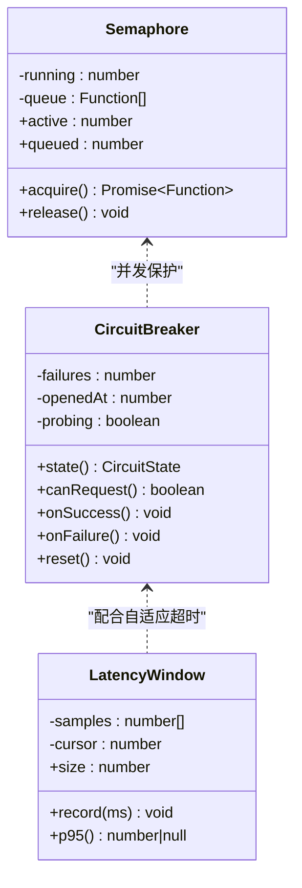
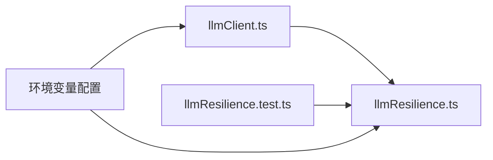

# 重试机制

<cite>
**本文引用的文件**
- [llmResilience.ts](file://server/llm/llmResilience.ts)
- [llmResilience.test.ts](file://server/llm/llmResilience.test.ts)
- [llmClient.ts](file://server/llm/llmClient.ts)
</cite>

## 目录
1. [简介](#简介)
2. [项目结构](#项目结构)
3. [核心组件](#核心组件)
4. [架构总览](#架构总览)
5. [详细组件分析](#详细组件分析)
6. [依赖关系分析](#依赖关系分析)
7. [性能考量](#性能考量)
8. [故障排查指南](#故障排查指南)
9. [结论](#结论)
10. [附录](#附录)

## 简介
本文件聚焦于系统中的“重试机制”，围绕指数退避算法、可重试错误分类策略、以及 withRetry 函数的使用与日志记录实践进行系统化说明。该机制用于提升对外部 LLM 引擎调用的韧性，避免瞬时失败导致请求雪崩，同时通过熔断、信号量与自适应超时等能力保障系统稳定性。

## 项目结构
重试机制的核心实现位于 server/llm 目录下：
- llmResilience.ts：定义重试、熔断、信号量、自适应超时等韧性原语
- llmResilience.test.ts：覆盖 isRetryable、withRetry、CircuitBreaker、Semaphore、LatencyWindow 等单测
- llmClient.ts：将重试机制集成到实际的 LLM 调用通道中，并注入 onRetry 回调进行日志记录

图表来源
- [llmClient.ts:141-161](file://server/llm/llmClient.ts#L141-L161)
- [llmResilience.ts:42-49](file://server/llm/llmResilience.ts#L42-L49)
- [llmResilience.ts:179-197](file://server/llm/llmResilience.ts#L179-L197)
- [llmResilience.ts:103-160](file://server/llm/llmResilience.ts#L103-L160)
- [llmResilience.ts:53-88](file://server/llm/llmResilience.ts#L53-L88)
- [llmResilience.ts:201-244](file://server/llm/llmResilience.ts#L201-L244)

章节来源
- [llmResilience.ts:1-245](file://server/llm/llmResilience.ts#L1-L245)
- [llmResilience.test.ts:1-213](file://server/llm/llmResilience.test.ts#L1-L213)
- [llmClient.ts:141-161](file://server/llm/llmClient.ts#L141-L161)

## 核心组件
- 可重试判定 isRetryable：基于错误类型与 HTTP 状态码判断是否应重试
- 指数退避重试 withRetry：按 baseDelayMs 基数与 2^(n-1) 增长，叠加随机抖动，支持 onRetry 回调
- 引擎级熔断 CircuitBreaker：连续失败达到阈值后开路，冷却期后半开探测恢复
- 并发信号量 Semaphore：限制每引擎的并发度，超出则排队等待
- 自适应超时 LatencyWindow + adaptiveTimeoutMs：基于近期成功调用 P95×3 动态调整超时

章节来源
- [llmResilience.ts:42-49](file://server/llm/llmResilience.ts#L42-L49)
- [llmResilience.ts:179-197](file://server/llm/llmResilience.ts#L179-L197)
- [llmResilience.ts:103-160](file://server/llm/llmResilience.ts#L103-L160)
- [llmResilience.ts:53-88](file://server/llm/llmResilience.ts#L53-L88)
- [llmResilience.ts:201-244](file://server/llm/llmResilience.ts#L201-L244)

## 架构总览
重试机制在 LLM 调用通道中被统一封装：先通过信号量控制并发，再进入 withRetry 进行指数退避重试；每次调用成功后或失败后分别更新熔断器状态；超时策略由自适应窗口动态计算。

图表来源
- [llmClient.ts:141-161](file://server/llm/llmClient.ts#L141-L161)
- [llmResilience.ts:179-197](file://server/llm/llmResilience.ts#L179-L197)
- [llmResilience.ts:103-160](file://server/llm/llmResilience.ts#L103-L160)
- [llmResilience.ts:53-88](file://server/llm/llmResilience.ts#L53-L88)

## 详细组件分析

### 指数退避算法与随机抖动
- 基数 baseDelayMs：默认 1000ms，可通过配置传入
- 指数增长：第 n 次重试等待时间为 base * 2^(n-1)，即第一次重试等待 base，第二次等待 2*base，第三次等待 4*base，以此类推
- 随机抖动：乘以区间 [0.75, 1.25] 的随机因子，避免多实例同频重试造成“重试风暴”
- 最大重试次数 maxRetries：不含首次调用，默认 2；超过后将直接抛出错误
- onRetry 回调：每次重试前触发，便于记录日志与埋点

图表来源
- [llmResilience.ts:179-197](file://server/llm/llmResilience.ts#L179-L197)

章节来源
- [llmResilience.ts:164-197](file://server/llm/llmResilience.ts#L164-L197)
- [llmResilience.test.ts:46-93](file://server/llm/llmResilience.test.ts#L46-L93)

### 可重试错误分类策略
- 超时错误：code=TIMEOUT 或 name=AbortError → 可重试
- 服务错误：HTTP 状态码 5xx → 可重试
- 限流错误：HTTP 状态码 429 → 可重试
- 客户端错误：其他 4xx（如 401 鉴权失败、400 参数错误）→ 不可重试
- 网络层错误：无状态码（例如 fetch failed、ECONNRESET）→ 可重试
- 熔断开路：code=CIRCUIT_OPEN → 不可重试

图表来源
- [llmResilience.ts:28-49](file://server/llm/llmResilience.ts#L28-L49)

章节来源
- [llmResilience.ts:28-49](file://server/llm/llmResilience.ts#L28-L49)
- [llmResilience.test.ts:19-44](file://server/llm/llmResilience.test.ts#L19-L44)

### withRetry 的使用示例与 onRetry 日志记录实践
- 基本用法：包裹可能失败的异步函数，传入 maxRetries、baseDelayMs、onRetry 等选项
- 日志记录：在 onRetry 回调中记录错误信息、重试次数与延迟时间，便于问题定位与监控
- 集成方式：在 LLM 通道 callChannel 中统一封装，结合熔断器与信号量形成完整韧性链路

图表来源
- [llmClient.ts:141-161](file://server/llm/llmClient.ts#L141-L161)
- [llmResilience.ts:179-197](file://server/llm/llmResilience.ts#L179-L197)

章节来源
- [llmClient.ts:141-161](file://server/llm/llmClient.ts#L141-L161)
- [llmResilience.test.ts:46-93](file://server/llm/llmResilience.test.ts#L46-L93)

### 熔断器与信号量的协同
- 熔断器：按引擎隔离，连续失败达到阈值后开路，冷却期后允许半开探测一次；探测成功则关闭，失败则重新计时
- 信号量：限制每引擎的并发度，超出时排队等待，避免打爆本地推理进程
- 自适应超时：基于近期成功调用 P95×3 动态收紧超时，防止慢模型被误杀、快模型被长超时拖死

图表来源
- [llmResilience.ts:53-88](file://server/llm/llmResilience.ts#L53-L88)
- [llmResilience.ts:103-160](file://server/llm/llmResilience.ts#L103-L160)
- [llmResilience.ts:201-244](file://server/llm/llmResilience.ts#L201-L244)

章节来源
- [llmResilience.ts:53-88](file://server/llm/llmResilience.ts#L53-L88)
- [llmResilience.ts:103-160](file://server/llm/llmResilience.ts#L103-L160)
- [llmResilience.ts:201-244](file://server/llm/llmResilience.ts#L201-L244)

## 依赖关系分析
- llmClient.ts 依赖 llmResilience.ts 提供的重试、熔断、信号量与自适应超时能力
- llmResilience.test.ts 对 isRetryable、withRetry、CircuitBreaker、Semaphore、LatencyWindow 等进行独立验证
- 环境变量驱动配置：LLM_RETRY_MAX、LLM_MAX_CONCURRENT、LLM_BREAKER_FAILS、LLM_BREAKER_COOLDOWN_MS、LLM_ADAPTIVE_TIMEOUT

图表来源
- [llmClient.ts:61-107](file://server/llm/llmClient.ts#L61-L107)
- [llmResilience.ts:164-197](file://server/llm/llmResilience.ts#L164-L197)

章节来源
- [llmClient.ts:61-107](file://server/llm/llmClient.ts#L61-L107)
- [llmResilience.test.ts:1-213](file://server/llm/llmResilience.test.ts#L1-L213)

## 性能考量
- 指数退避有效降低瞬时重试压力，避免雪崩
- 随机抖动分散多实例重试峰值，减少竞争
- 信号量限制并发，保护本地 Ollama 算力
- 自适应超时根据历史性能动态调整，兼顾快慢模型
- 熔断器快速失败，避免无效请求放大

## 故障排查指南
- 若频繁出现 4xx 错误（如 401、400），检查请求参数与鉴权配置，此类错误不会重试
- 若频繁出现 5xx 或 429，关注后端服务健康与限流策略，重试会生效
- 若 onRetry 日志显示大量重试，检查网络稳定性与服务端负载
- 若熔断器频繁开路，评估后端可用性并调整 failureThreshold 与 cooldownMs
- 若超时过长或过短，调整自适应超时开关与 floorMs/configuredMs

章节来源
- [llmResilience.test.ts:19-44](file://server/llm/llmResilience.test.ts#L19-L44)
- [llmResilience.test.ts:46-93](file://server/llm/llmResilience.test.ts#L46-L93)
- [llmResilience.test.ts:95-148](file://server/llm/llmResilience.test.ts#L95-L148)
- [llmResilience.test.ts:187-212](file://server/llm/llmResilience.test.ts#L187-L212)

## 结论
该重试机制以指数退避为核心，结合随机抖动、可重试错误分类、熔断器、信号量与自适应超时，构建了高韧性的 LLM 调用通道。通过清晰的错误分类与可观测的 onRetry 日志，既提升了成功率，又避免了重试风暴与资源浪费。建议在生产环境中合理配置环境变量，并结合监控告警持续优化。

## 附录
- 关键配置项参考：
  - LLM_RETRY_MAX：最大重试次数（不含首次）
  - LLM_MAX_CONCURRENT：每引擎并发上限
  - LLM_BREAKER_FAILS：熔断连续失败阈值
  - LLM_BREAKER_COOLDOWN_MS：熔断冷却期毫秒
  - LLM_ADAPTIVE_TIMEOUT：自适应超时开关（非“0”即启用）

章节来源
- [llmClient.ts:61-107](file://server/llm/llmClient.ts#L61-L107)