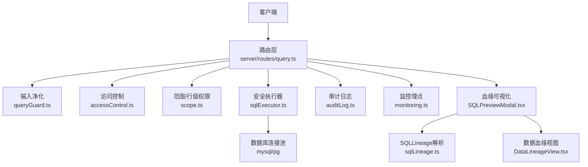
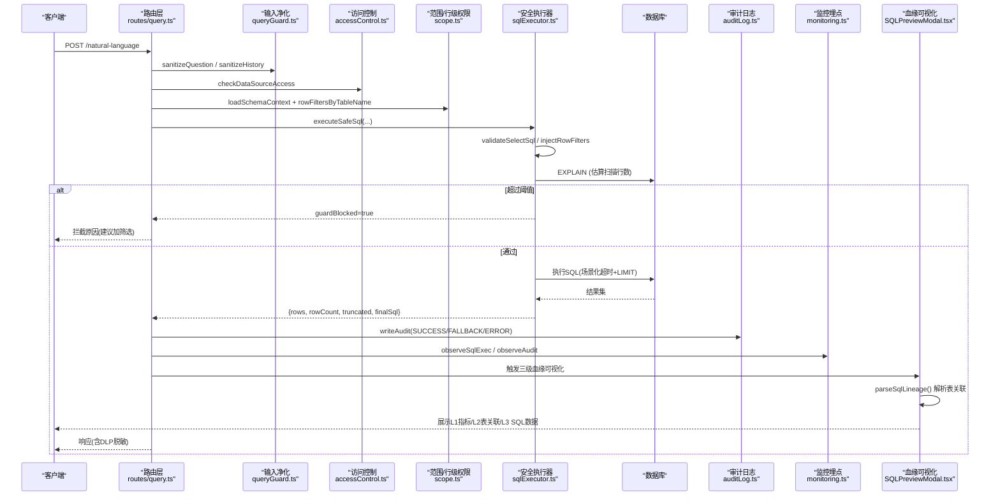
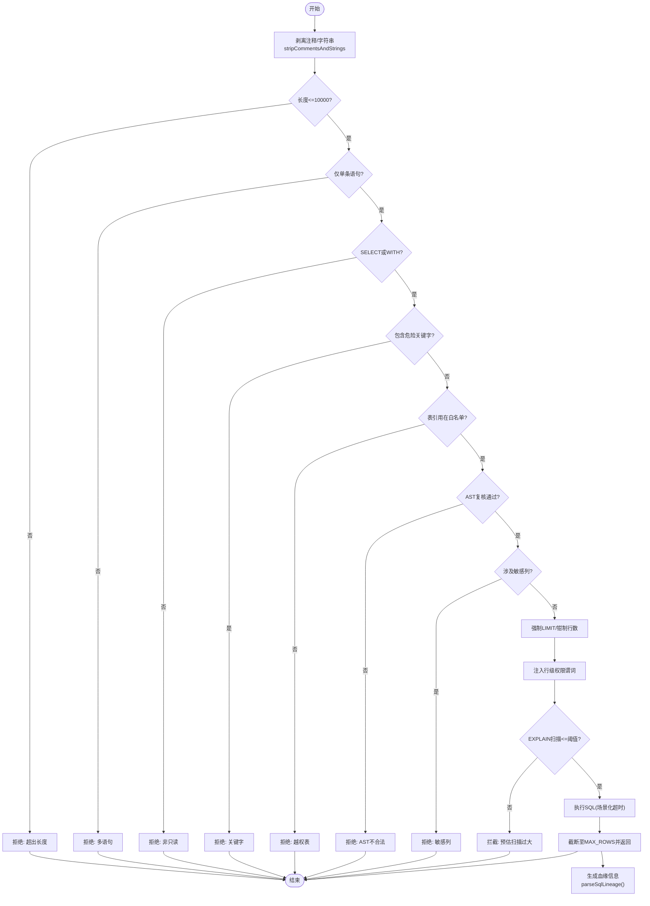
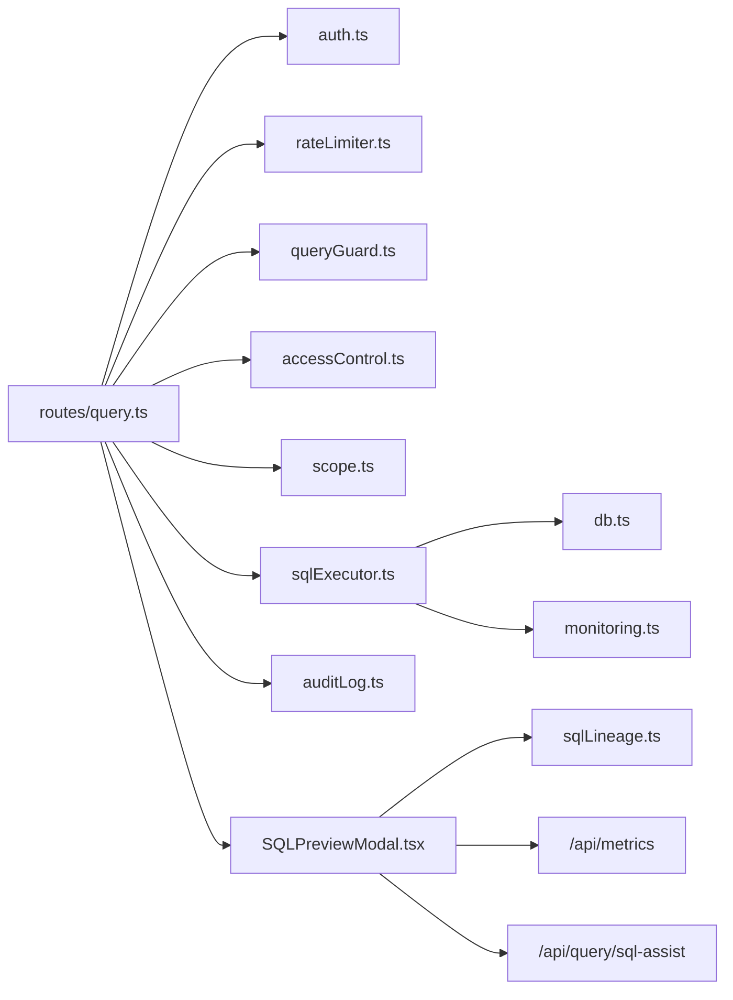
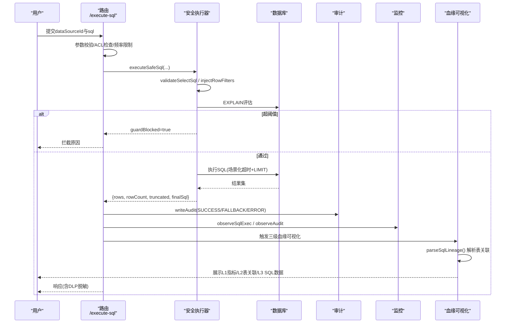
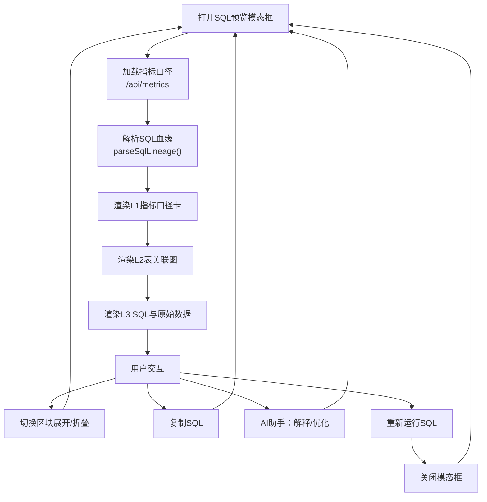

# SQL执行器与安全控制

<cite>
**本文引用的文件**
- [server/query/sqlExecutor.ts](file://server/query/sqlExecutor.ts)
- [server/query/queryGuard.ts](file://server/query/queryGuard.ts)
- [server/auth/accessControl.ts](file://server/auth/accessControl.ts)
- [server/infra/auditLog.ts](file://server/infra/auditLog.ts)
- [server/infra/rateLimiter.ts](file://server/infra/rateLimiter.ts)
- [server/infra/monitoring.ts](file://server/infra/monitoring.ts)
- [server/query/scope.ts](file://server/query/scope.ts)
- [server/routes/query.ts](file://server/routes/query.ts)
- [server/infra/userQueryLimit.ts](file://server/infra/userQueryLimit.ts)
- [server/auth/auth.ts](file://server/auth/auth.ts)
- [src/components/query/SQLPreviewModal.tsx](file://src/components/query/SQLPreviewModal.tsx)
- [src/utils/sqlLineage.ts](file://src/utils/sqlLineage.ts)
- [src/components/datasource/DataLineageView.tsx](file://src/components/datasource/DataLineageView.tsx)
</cite>

## 更新摘要
**所做更改**
- 新增三级数据血缘可视化系统（P0-3），从指标定义到表关系到SQL查询的完整血缘追踪
- 增强SQLLineage解析工具，支持子查询扁平展开、JOIN链解析、ON条件提取
- 重构SQL预览模态框，实现可折叠的三级溯源界面
- 新增数据血缘视图组件，提供全链路影响分析
- 集成AI助手功能，支持SQL解释和优化建议

## 目录
1. [简介](#简介)
2. [项目结构](#项目结构)
3. [核心组件](#核心组件)
4. [架构总览](#架构总览)
5. [详细组件分析](#详细组件分析)
6. [依赖关系分析](#依赖关系分析)
7. [性能与资源控制](#性能与资源控制)
8. [故障处理与重试](#故障处理与重试)
9. [结论](#结论)
10. [附录：关键流程与时序图](#附录关键流程与时序图)

## 简介
本文件面向"智能问数据分析系统"的SQL执行器与安全控制，系统性解析安全SQL执行层的架构设计、执行前安全检查、执行时资源控制、错误处理与降级策略，以及权限验证、敏感字段过滤、审计日志等关键能力。**最新更新**：新增了三级数据血缘可视化系统，实现了从指标定义到表关系到SQL查询的完整血缘追踪，增强了SQLLineage解析工具，并重构了SQL预览模态框以提供更好的用户体验和数据透明度。

## 项目结构
围绕SQL执行与安全控制的相关模块主要分布在以下位置：
- 安全执行层：server/query/sqlExecutor.ts（校验、注入、执行、EXPLAIN防线）
- 输入净化与上下文防护：server/query/queryGuard.ts（提示注入检测、历史净化、敏感列特征）
- 数据范围与行级权限：server/query/scope.ts（表/列/行级范围、谓词清洗）
- 访问控制ACL：server/auth/accessControl.ts（部门/用户维度授权）
- 认证鉴权：server/auth/auth.ts（JWT校验、角色守卫）
- 限流与并发控制：server/infra/rateLimiter.ts（IP级限流）、server/infra/userQueryLimit.ts（用户级配额与并发槽）
- 审计与监控：server/infra/auditLog.ts（全链路审计）、server/infra/monitoring.ts（Prometheus埋点）
- 路由入口：server/routes/query.ts（自然语言问数、SQL重跑、下钻等）
- **新增**：三级血缘可视化：src/components/query/SQLPreviewModal.tsx（SQL预览模态框）、src/utils/sqlLineage.ts（SQL血缘解析）、src/components/datasource/DataLineageView.tsx（数据血缘视图）

**图表来源**
- [server/routes/query.ts:47-393](file://server/routes/query.ts#L47-L393)
- [server/query/queryGuard.ts:38-69](file://server/query/queryGuard.ts#L38-L69)
- [server/auth/accessControl.ts:44-73](file://server/auth/accessControl.ts#L44-L73)
- [server/query/scope.ts:28-100](file://server/query/scope.ts#L28-L100)
- [server/query/sqlExecutor.ts:734-832](file://server/query/sqlExecutor.ts#L734-L832)
- [server/infra/auditLog.ts:38-61](file://server/infra/auditLog.ts#L38-L61)
- [server/infra/monitoring.ts:93-133](file://server/infra/monitoring.ts#L93-L133)
- [src/components/query/SQLPreviewModal.tsx:143-698](file://src/components/query/SQLPreviewModal.tsx#L143-L698)
- [src/utils/sqlLineage.ts:51-98](file://src/utils/sqlLineage.ts#L51-L98)
- [src/components/datasource/DataLineageView.tsx:25-594](file://src/components/datasource/DataLineageView.tsx#L25-L594)

**章节来源**
- [server/routes/query.ts:47-393](file://server/routes/query.ts#L47-L393)
- [server/query/sqlExecutor.ts:734-832](file://server/query/sqlExecutor.ts#L734-L832)

## 核心组件
- 安全SQL执行器：负责SQL白名单校验、AST复核、敏感列拒绝、强制LIMIT、行级权限注入、EXPLAIN扫描量防线、场景化超时与连接池管理、结果截断与审计标记。
- 输入净化与上下文防护：拦截提示注入、控制字符清理、历史消息净化、敏感列特征过滤，避免污染LLM上下文。
- 访问控制ACL：基于部门与用户的细粒度数据源访问控制，管理员豁免。
- 范围与行级权限：表/列级白名单与行级谓词注入，确保仅查询允许的数据范围。
- 审计与监控：全链路状态落账与Prometheus指标采集，支持慢查询与异常观测。
- 限流与并发：IP级滑动窗口限流、用户级每小时次数限制与并发互斥槽。
- **新增**：三级数据血缘可视化：L1指标口径卡、L2表关联图、L3 SQL与原始数据，提供完整的可信数据链路展示。
- **新增**：SQLLineage解析工具：轻量级前端SQL解析，支持主表识别、JOIN链解析、子查询扁平展开、ON条件提取。
- **新增**：数据血缘视图：全链路影响分析，可视化数据源、处理引擎、终端组件之间的依赖关系。

**章节来源**
- [server/query/sqlExecutor.ts:169-387](file://server/query/sqlExecutor.ts#L169-L387)
- [server/query/queryGuard.ts:27-100](file://server/query/queryGuard.ts#L27-L100)
- [server/auth/accessControl.ts:18-73](file://server/auth/accessControl.ts#L18-L73)
- [server/query/scope.ts:17-100](file://server/query/scope.ts#L17-L100)
- [server/infra/auditLog.ts:10-61](file://server/infra/auditLog.ts#L10-L61)
- [server/infra/rateLimiter.ts:14-53](file://server/infra/rateLimiter.ts#L14-L53)
- [server/infra/userQueryLimit.ts:23-81](file://server/infra/userQueryLimit.ts#L23-L81)
- [src/components/query/SQLPreviewModal.tsx:143-698](file://src/components/query/SQLPreviewModal.tsx#L143-L698)
- [src/utils/sqlLineage.ts:51-98](file://src/utils/sqlLineage.ts#L51-L98)
- [src/components/datasource/DataLineageView.tsx:25-594](file://src/components/datasource/DataLineageView.tsx#L25-L594)

## 架构总览
下图展示了从请求进入路由到安全执行SQL的端到端流程，包括权限校验、输入净化、范围限定、安全校验、EXPLAIN防线、真实执行、审计埋点，以及**新增的三级数据血缘可视化**。

**图表来源**
- [server/routes/query.ts:47-393](file://server/routes/query.ts#L47-L393)
- [server/query/sqlExecutor.ts:734-832](file://server/query/sqlExecutor.ts#L734-L832)
- [server/query/queryGuard.ts:38-69](file://server/query/queryGuard.ts#L38-L69)
- [server/auth/accessControl.ts:66-73](file://server/auth/accessControl.ts#L66-L73)
- [server/query/scope.ts:92-100](file://server/query/scope.ts#L92-L100)
- [server/infra/auditLog.ts:38-61](file://server/infra/auditLog.ts#L38-L61)
- [server/infra/monitoring.ts:129-133](file://server/infra/monitoring.ts#L129-L133)
- [src/components/query/SQLPreviewModal.tsx:199-221](file://src/components/query/SQLPreviewModal.tsx#L199-L221)
- [src/utils/sqlLineage.ts:51-98](file://src/utils/sqlLineage.ts#L51-L98)

## 详细组件分析

### 安全SQL执行器（sqlExecutor.ts）
- 关键字与语句类型校验：仅允许SELECT（或WITH CTE），拒绝写/DDL/管理类关键字；长度限制与单语句约束。
- 表名白名单与AST复核：正则提取FROM/JOIN表引用，结合node-sql-parser AST进行二次校验，排除CTE别名干扰。
- 敏感列拒绝：对裸列名整词匹配拒绝，防止越权读取敏感字段。
- 行级权限注入：AST递归遍历，将受控表包裹为带WHERE谓词的派生表，覆盖子查询/UNION/CTE内真实表引用。
- EXPLAIN防线：MySQL/PG分别解析计划树，预估扫描行数超阈值则拦截；EXPLAIN失败fail-open放行但记录告警。
- 资源控制：场景化超时（interactive/chain/export），MySQL注入MAX_EXECUTION_TIME hint，PG使用statement_timeout；连接池按dataSourceId+场景分级缓存，容量公式化配置。
- 结果限制：统一强制LIMIT并截断至MAX_ROWS，返回truncated标志供前端展示。
- 审计标记：astFallback用于审计区分正则兜底放行与AST强校验通过。

**图表来源**
- [server/query/sqlExecutor.ts:169-387](file://server/query/sqlExecutor.ts#L169-L387)
- [server/query/sqlExecutor.ts:531-662](file://server/query/sqlExecutor.ts#L531-L662)
- [server/query/sqlExecutor.ts:734-832](file://server/query/sqlExecutor.ts#L734-L832)
- [src/utils/sqlLineage.ts:51-98](file://src/utils/sqlLineage.ts#L51-L98)

**章节来源**
- [server/query/sqlExecutor.ts:159-387](file://server/query/sqlExecutor.ts#L159-L387)
- [server/query/sqlExecutor.ts:531-662](file://server/query/sqlExecutor.ts#L531-L662)
- [server/query/sqlExecutor.ts:686-832](file://server/query/sqlExecutor.ts#L686-L832)

### 三级数据血缘可视化系统（P0-3）

#### SQL预览模态框（SQLPreviewModal.tsx）
**全新重构**的三级数据溯源弹窗，对齐FineBI NEXT类产品的信任标准：

- **L1 指标口径卡**：展示命中的语义指标口径（表达式/来源表/过滤/业务说明），支持审批状态查看和版本历史追溯
- **L2 表关联图**：从SQL解析主表与JOIN链，可视化数据来源与连接条件，支持子查询扁平展开
- **L3 SQL与原始数据**：AI思维链 + SQL编辑器（AI解释/优化，可重跑）+ 结果原始行预览

**核心特性**：
- 三级各自可折叠，默认全展开
- 数据来源徽标（live/simulated）贯穿头部
- AI助手集成：SQL解释和优化建议
- 指标治理延伸：审批状态 + 版本历史查看
- 相关指标提醒：同表未命中指标的口径提醒

**章节来源**
- [src/components/query/SQLPreviewModal.tsx:143-698](file://src/components/query/SQLPreviewModal.tsx#L143-L698)

#### SQLLineage解析工具（sqlLineage.ts）
**增强版**的前端轻量SQL解析工具，与后端extractTableRefs保持一致的正则解析思路：

- **主表识别**：首个非子查询的FROM目标
- **JOIN链解析**：记录每个JOIN头位置，逐段解析"表 [别名] [ON 条件]"
- **子查询处理**：标记hasSubquery，内部表由FROM扫描覆盖
- **干扰防御**：去除注释与字符串字面量，避免误判
- **条件提取**：优先ON条件，无ON时尝试USING(col)
- **标识符清理**：去除反引号与库名前缀

**测试覆盖**：单表查询、JOIN链、反引号归一、注释防御、子查询处理、空SQL处理

**章节来源**
- [src/utils/sqlLineage.ts:1-99](file://src/utils/sqlLineage.ts#L1-L99)
- [src/utils/sqlLineage.test.ts:1-52](file://src/utils/sqlLineage.test.ts#L1-L52)

#### 数据血缘视图（DataLineageView.tsx）
**新增**的全链路影响分析与数据血缘拓扑视图：

- **三列布局**：接入源层 → 逻辑提炼算子层 → 终端导向层
- **交互高亮**：鼠标悬停任意节点即时高亮其依赖的全部上游路径
- **动态链路横幅**：绝对定位叠层展示完整上游数据链路依赖分析
- **节点详情**：点击节点展示数据血缘与全路径归因审计详情
- **实时状态**：处理路径畅通指示、延迟监控

**处理引擎**：
- AI NL2SQL引擎：自然语言解析Schema并转化为高效分组聚合SQL Query
- 多维指标与特征清洗算子：清洗缺失值、日期对齐、计算环比与渠道归因比率

**章节来源**
- [src/components/datasource/DataLineageView.tsx:1-594](file://src/components/datasource/DataLineageView.tsx#L1-L594)

### 输入净化与上下文防护（queryGuard.ts）
- L1输入净化：控制字符过滤、提示注入特征拒绝、最大长度截断。
- L4历史净化：丢弃assistant输出、逐条user消息过注入检测、最多保留最近5轮。
- L3敏感列特征：对schema中的列名/描述进行敏感匹配，剔除并返回removed清单，供后续执行层拒绝。

**章节来源**
- [server/query/queryGuard.ts:27-100](file://server/query/queryGuard.ts#L27-L100)

### 访问控制ACL（accessControl.ts）
- 模型：data_sources.acl_json包含departments与userIds两组授权清单。
- 判定：ADMIN豁免；未配置ACL视为不限制；否则需命中部门或个人ID。
- 服务端入口：checkDataSourceAccess在路由层调用，拒绝无权限访问。

**章节来源**
- [server/auth/accessControl.ts:18-73](file://server/auth/accessControl.ts#L18-L73)

### 范围与行级权限（scope.ts）
- DataScope：tables/columns/rowFilters三要素，空表示不限制。
- 谓词清洗：禁止多语句、注释、子查询、INTO等结构，防结构性注入。
- 行级映射：将tableId映射到实际表名，供执行层AST注入。

**章节来源**
- [server/query/scope.ts:17-100](file://server/query/scope.ts#L17-L100)

### 认证与角色（auth.ts）
- JWT签发与校验，回查用户状态与角色，附加req.user。
- 角色守卫：requireRole用于接口级权限控制。

**章节来源**
- [server/auth/auth.ts:60-127](file://server/auth/auth.ts#L60-L127)

### 限流与并发（rateLimiter.ts, userQueryLimit.ts）
- IP级限流：Redis固定分钟窗口或内存滑动窗口，超限返回429。
- 用户级配额：每小时次数限制与并发互斥槽（同一用户仅一个进行中查询）。
- 多实例支持：Redis模式共享计数与分布式锁，崩溃后TTL自动释放。

**章节来源**
- [server/infra/rateLimiter.ts:14-53](file://server/infra/rateLimiter.ts#L14-L53)
- [server/infra/userQueryLimit.ts:23-81](file://server/infra/userQueryLimit.ts#L23-L81)

### 审计与监控（auditLog.ts, monitoring.ts）
- 审计：成功、降级、错误与被拒绝全部落账，写入失败仅告警不阻塞主流程。
- 监控：Prometheus埋点覆盖NL2SQL请求、耗时、缓存命中、LLM用量、SQL执行耗时、EXPLAIN防线统计。

**章节来源**
- [server/infra/auditLog.ts:10-61](file://server/infra/auditLog.ts#L10-L61)
- [server/infra/monitoring.ts:19-133](file://server/infra/monitoring.ts#L19-L133)

## 依赖关系分析
- 路由层依赖：auth中间件、rateLimiter、queryGuard、accessControl、scope、sqlExecutor、auditLog、monitoring。
- 安全执行器依赖：db连接池、secretsCrypto解密、llmClient（可选纠偏）、monitoring埋点、fileDataSource（文件数据源物理表）。
- 范围与权限：scope提供rowFilters映射，sqlExecutor在AST中注入行级过滤。
- 审计与监控：所有关键路径均埋点，便于追踪与告警。
- **新增**：血缘可视化依赖：SQLPreviewModal依赖sqlLineage解析工具和metrics API，DataLineageView依赖analytics store和engine info。

**图表来源**
- [server/routes/query.ts:47-393](file://server/routes/query.ts#L47-L393)
- [server/query/sqlExecutor.ts:734-832](file://server/query/sqlExecutor.ts#L734-L832)
- [server/infra/monitoring.ts:93-133](file://server/infra/monitoring.ts#L93-L133)
- [server/infra/auditLog.ts:38-61](file://server/infra/auditLog.ts#L38-L61)
- [src/components/query/SQLPreviewModal.tsx:183-249](file://src/components/query/SQLPreviewModal.tsx#L183-L249)
- [src/utils/sqlLineage.ts:51-98](file://src/utils/sqlLineage.ts#L51-L98)

**章节来源**
- [server/routes/query.ts:47-393](file://server/routes/query.ts#L47-L393)
- [server/query/sqlExecutor.ts:734-832](file://server/query/sqlExecutor.ts#L734-L832)

## 性能与资源控制
- 连接池容量：dsPoolMax()按环境或期望并发推导，clamp到[3,20]；可按DS_POOL_MAX显式配置。
- 场景化配额：interactive/chain/export独立配额，避免大导出挤占交互。
- 场景化超时：interactive默认15s、chain默认120s、export默认60s，可通过环境变量覆盖。
- MySQL超时双保险：驱动timeout + MAX_EXECUTION_TIME hint注入（CTE链定位主SELECT）。
- PG超时：connection-level statement_timeout由建池时设置。
- 结果行数限制：MAX_ROWS默认10万，强制LIMIT并截断，返回truncated标志。
- EXPLAIN防线：预估扫描行数超阈值拦截，保护业务库不被大扫描拖垮；EXPLAIN失败fail-open。
- **新增**：血缘解析性能：前端轻量正则解析，避免复杂AST解析开销；子查询扁平化处理提升可视化性能。

**章节来源**
- [server/query/sqlExecutor.ts:44-109](file://server/query/sqlExecutor.ts#L44-L109)
- [server/query/sqlExecutor.ts:118-153](file://server/query/sqlExecutor.ts#L118-L153)
- [server/query/sqlExecutor.ts:531-662](file://server/query/sqlExecutor.ts#L531-L662)
- [server/query/sqlExecutor.ts:686-726](file://server/query/sqlExecutor.ts#L686-L726)
- [server/query/sqlExecutor.ts:734-832](file://server/query/sqlExecutor.ts#L734-L832)

## 故障处理与重试
- 连接异常恢复：连接池按场景分级，配置变更后invalidateExecutorPool失效重建；连接建立有CONNECT_TIMEOUT_MS兜底。
- 查询失败降级：真实执行失败时，路由层记录FALLBACK并返回演示模式结果，保证可用性优先。
- 用户友好错误提示：拦截原因明确（如"仅允许SELECT查询""SQL包含不允许的关键字""预估扫描过大请增加筛选条件"）。
- 重试机制：P0-2提及可选自愈入口——校验失败时可调用LLM纠偏重试一次，统一审计出口（当前实现以审计标记与降级为主）。
- 审计与监控：所有拒绝、降级、错误均落账；监控埋点记录成功率与耗时，便于定位问题。
- **新增**：血缘解析容错：SQLLineage解析失败时返回空结果，不影响主流程；API调用失败时优雅降级显示。

**章节来源**
- [server/query/sqlExecutor.ts:734-832](file://server/query/sqlExecutor.ts#L734-L832)
- [server/routes/query.ts:293-314](file://server/routes/query.ts#L293-L314)
- [server/infra/auditLog.ts:38-61](file://server/infra/auditLog.ts#L38-L61)
- [server/infra/monitoring.ts:93-133](file://server/infra/monitoring.ts#L93-L133)

## 结论
该系统的SQL执行器与安全控制采用多层纵深防御：输入净化、ACL、DataScope、关键字与AST校验、敏感列拒绝、行级权限注入、EXPLAIN防线、场景化超时与连接池、结果截断与审计埋点。**最新更新**：新增的三级数据血缘可视化系统进一步增强了系统的透明度和可信度，从指标定义到表关系到SQL查询的完整血缘追踪，配合增强的SQLLineage解析工具，为用户提供了前所未有的数据可追溯性。整体设计在保证可用性的同时，严格限制了越权与风险操作，并通过监控与审计实现可观测性与可追溯性。对于生产部署，建议关注：
- 合理配置DS_POOL_*与QUERY_TIMEOUT_*以匹配业务负载
- 调整SQL_EXPLAIN_MAX_ROWS以平衡性能与风险
- 启用DLP脱敏与审计告警，完善合规与风控
- 充分利用三级血缘可视化提升数据信任度和问题排查效率

## 附录：关键流程与时序图

### 安全执行序列图（SQL重跑）

**图表来源**
- [server/routes/query.ts:558-625](file://server/routes/query.ts#L558-L625)
- [server/query/sqlExecutor.ts:734-832](file://server/query/sqlExecutor.ts#L734-L832)
- [server/infra/auditLog.ts:38-61](file://server/infra/auditLog.ts#L38-L61)
- [server/infra/monitoring.ts:129-133](file://server/infra/monitoring.ts#L129-L133)
- [src/components/query/SQLPreviewModal.tsx:199-221](file://src/components/query/SQLPreviewModal.tsx#L199-L221)
- [src/utils/sqlLineage.ts:51-98](file://src/utils/sqlLineage.ts#L51-L98)

### 三级血缘可视化流程图

**图表来源**
- [src/components/query/SQLPreviewModal.tsx:176-273](file://src/components/query/SQLPreviewModal.tsx#L176-L273)
- [src/utils/sqlLineage.ts:51-98](file://src/utils/sqlLineage.ts#L51-L98)
- [src/components/query/SQLPreviewModal.tsx:233-249](file://src/components/query/SQLPreviewModal.tsx#L233-L249)
- [src/components/query/SQLPreviewModal.tsx:682-691](file://src/components/query/SQLPreviewModal.tsx#L682-L691)