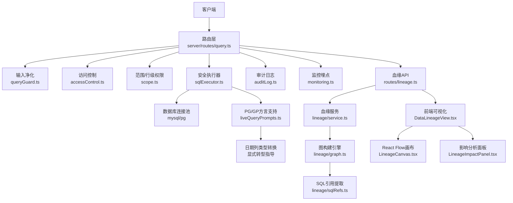
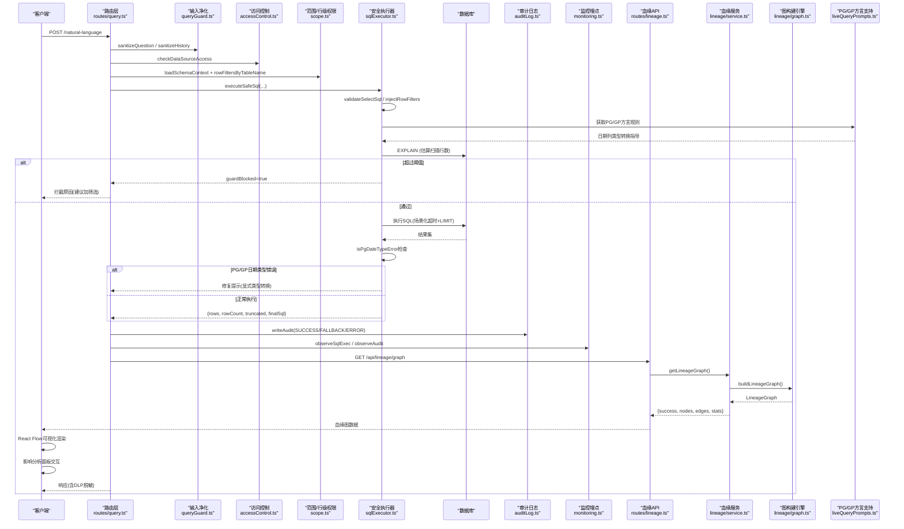
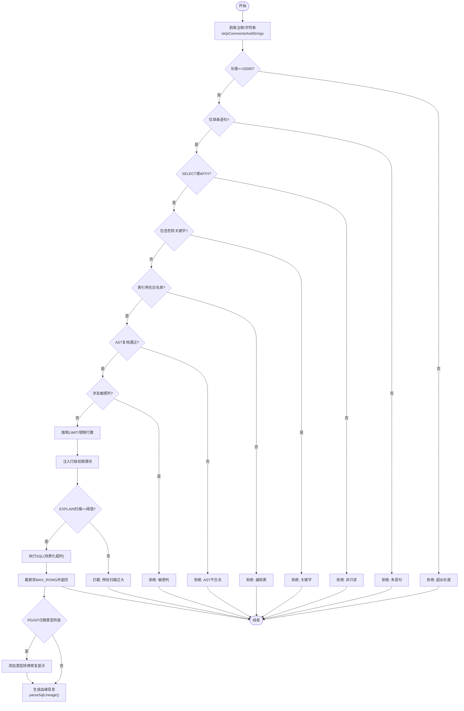
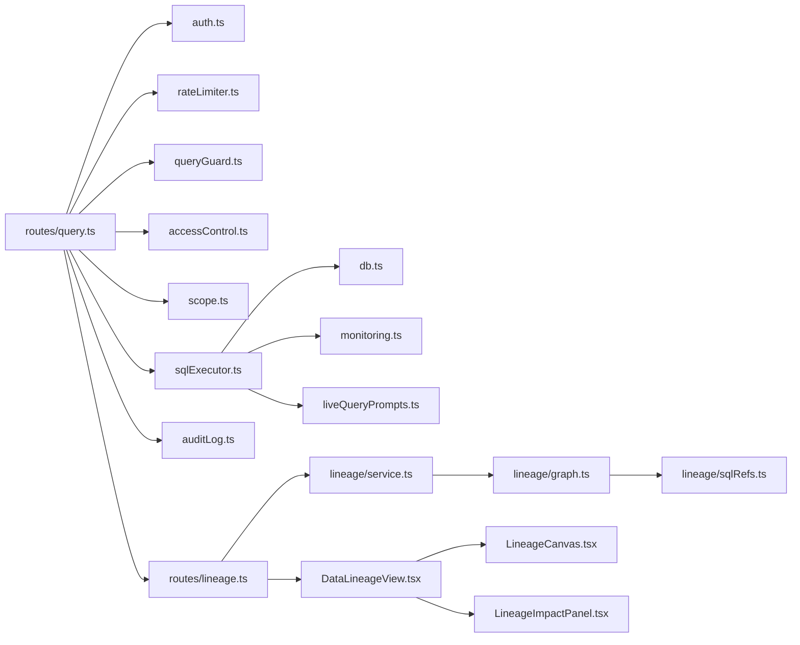
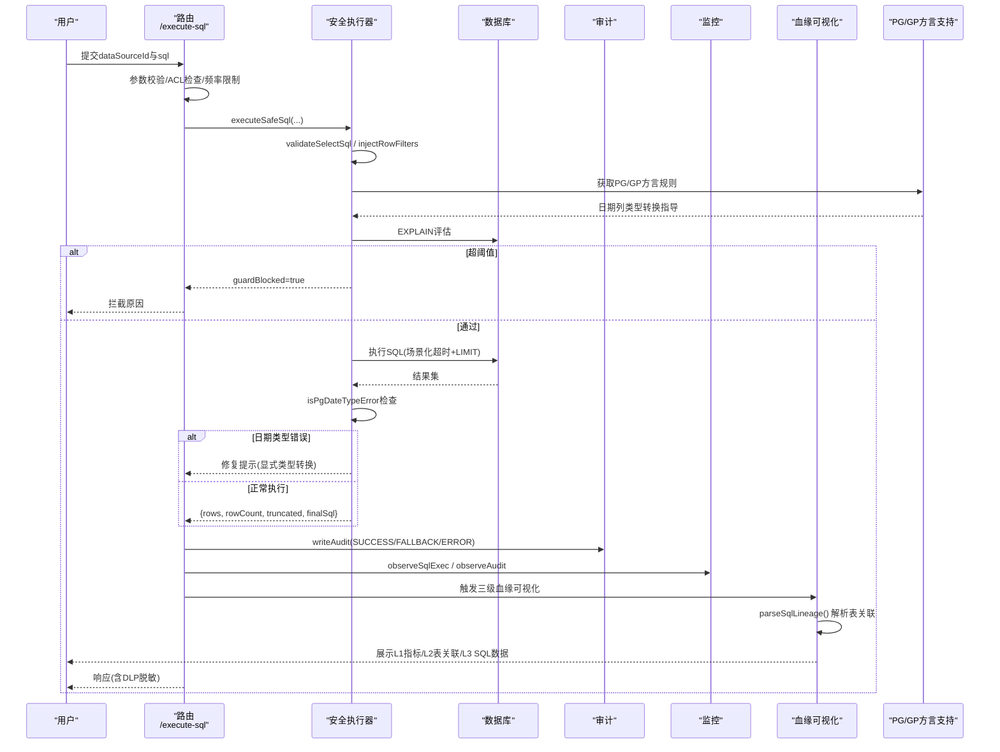
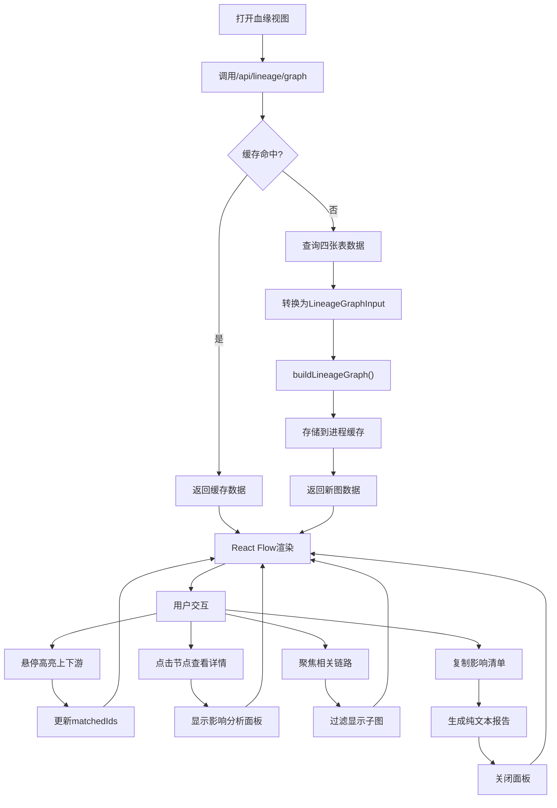
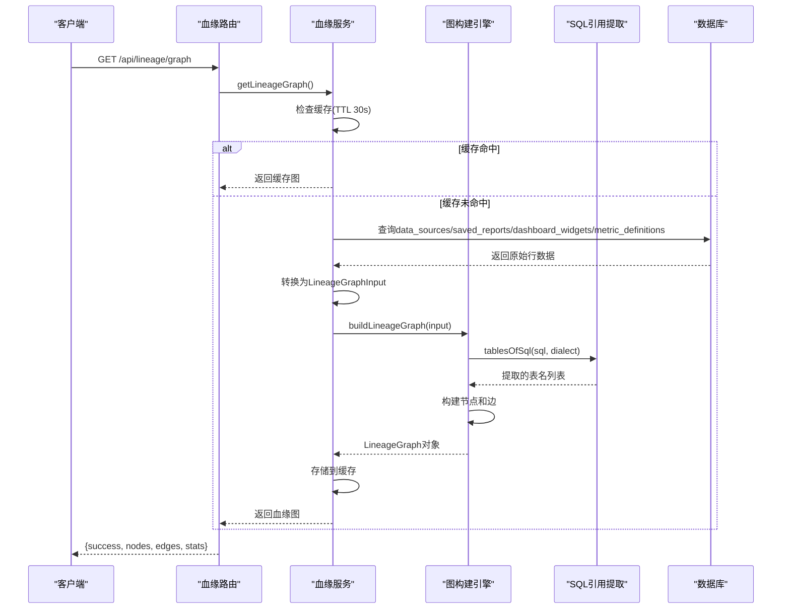

# SQL执行器与安全控制

<cite>
**本文引用的文件**
- [server/query/sqlExecutor.ts](file://server/query/sqlExecutor.ts)
- [server/query/queryGuard.ts](file://server/query/queryGuard.ts)
- [server/auth/accessControl.ts](file://server/auth/accessControl.ts)
- [server/infra/auditLog.ts](file://server/infra/auditLog.ts)
- [server/infra/rateLimiter.ts](file://server/infra/rateLimiter.ts)
- [server/infra/monitoring.ts](file://server/infra/monitoring.ts)
- [server/query/scope.ts](file://server/query/scope.ts)
- [server/routes/query.ts](file://server/routes/query.ts)
- [server/infra/userQueryLimit.ts](file://server/infra/userQueryLimit.ts)
- [server/auth/auth.ts](file://server/auth/auth.ts)
- [src/components/query/SQLPreviewModal.tsx](file://src/components/query/SQLPreviewModal.tsx)
- [src/utils/sqlLineage.ts](file://src/utils/sqlLineage.ts)
- [src/components/datasource/DataLineageView.tsx](file://src/components/datasource/DataLineageView.tsx)
- [server/query/liveQueryPrompts.ts](file://server/query/liveQueryPrompts.ts)
- [server/lineage/graph.ts](file://server/lineage/graph.ts)
- [server/lineage/service.ts](file://server/lineage/service.ts)
- [server/lineage/sqlRefs.ts](file://server/lineage/sqlRefs.ts)
- [server/routes/lineage.ts](file://server/routes/lineage.ts)
- [src/components/datasource/lineage/LineageCanvas.tsx](file://src/components/datasource/lineage/LineageCanvas.tsx)
- [src/components/datasource/lineage/LineageImpactPanel.tsx](file://src/components/datasource/lineage/LineageImpactPanel.tsx)
</cite>

## 更新摘要
**所做更改**
- 新增了完整的React Flow数据血缘可视化系统，包括后端图构建引擎、SQL引用提取、服务层缓存、REST API端点
- 前端交互式图可视化组件支持影响分析、节点详情展示和链式依赖追踪
- 增强了PostgreSQL/Greenplum查询执行能力，改进了字符类型日期列的处理机制
- 实现了显式类型转换以防止SQLSTATE 42883和22007错误
- 增加了可配置的查询结果行数限制（QUERY_RESULT_ROWS_MAX环境变量）
- 完善了EXPLAIN防线阈值配置（SQL_EXPLAIN_MAX_ROWS环境变量）

## 目录
1. [简介](#简介)
2. [项目结构](#项目结构)
3. [核心组件](#核心组件)
4. [架构总览](#架构总览)
5. [详细组件分析](#详细组件分析)
6. [依赖关系分析](#依赖关系分析)
7. [性能与资源控制](#性能与资源控制)
8. [故障处理与重试](#故障处理与重试)
9. [结论](#结论)
10. [附录：关键流程与时序图](#附录关键流程与时序图)

## 简介
本文件面向"智能问数据分析系统"的SQL执行器与安全控制，系统性解析安全SQL执行层的架构设计、执行前安全检查、执行时资源控制、错误处理与降级策略，以及权限验证、敏感字段过滤、审计日志等关键能力。**最新更新**：新增了完整的React Flow数据血缘可视化系统，包括后端图构建引擎、SQL引用提取、服务层缓存、REST API端点，以及前端交互式图可视化组件。原有的简单血缘视图已升级为功能丰富的交互式拓扑图，支持影响分析、节点详情展示和链式依赖追踪。同时增强了PostgreSQL/Greenplum查询执行能力，改进了字符类型日期列的处理机制，实现了显式类型转换以防止SQL错误，并增加了可配置的查询结果行数限制。

## 项目结构
围绕SQL执行与安全控制的相关模块主要分布在以下位置：
- 安全执行层：server/query/sqlExecutor.ts（校验、注入、执行、EXPLAIN防线）
- 输入净化与上下文防护：server/query/queryGuard.ts（提示注入检测、历史净化、敏感列特征）
- 数据范围与行级权限：server/query/scope.ts（表/列/行级范围、谓词清洗）
- 访问控制ACL：server/auth/accessControl.ts（部门/用户维度授权）
- 认证鉴权：server/auth/auth.ts（JWT校验、角色守卫）
- 限流与并发控制：server/infra/rateLimiter.ts（IP级限流）、server/infra/userQueryLimit.ts（用户级配额与并发槽）
- 审计与监控：server/infra/auditLog.ts（全链路审计）、server/infra/monitoring.ts（Prometheus埋点）
- 路由入口：server/routes/query.ts（自然语言问数、SQL重跑、下钻等）
- **新增**：完整血缘可视化系统：server/lineage/graph.ts（图构建引擎）、server/lineage/service.ts（服务层缓存）、server/lineage/sqlRefs.ts（SQL引用提取）、server/routes/lineage.ts（REST API端点）
- **新增**：前端交互组件：src/components/datasource/DataLineageView.tsx（主视图）、src/components/datasource/lineage/LineageCanvas.tsx（React Flow画布）、src/components/datasource/lineage/LineageImpactPanel.tsx（影响分析面板）
- **新增**：PG/GP方言支持：server/query/liveQueryPrompts.ts（方言规则与日期列处理指导）

```mermaid
graph TB
Client["客户端"] --> Router["路由层<br/>server/routes/query.ts"]
Router --> Guard["输入净化<br/>queryGuard.ts"]
Router --> ACL["访问控制<br/>accessControl.ts"]
Router --> Scope["范围/行级权限<br/>scope.ts"]
Router --> Exec["安全执行器<br/>sqlExecutor.ts"]
Exec --> DB["数据库连接池<br/>mysql/pg"]
Router --> Audit["审计日志<br/>auditLog.ts"]
Router --> Monitor["监控埋点<br/>monitoring.ts"]
Router --> LineageAPI["血缘API<br/>routes/lineage.ts"]
LineageAPI --> LineageService["血缘服务<br/>lineage/service.ts"]
LineageService --> GraphEngine["图构建引擎<br/>lineage/graph.ts"]
GraphEngine --> SqlRefs["SQL引用提取<br/>lineage/sqlRefs.ts"]
LineageAPI --> Frontend["前端可视化<br/>DataLineageView.tsx"]
Frontend --> Canvas["React Flow画布<br/>LineageCanvas.tsx"]
Frontend --> ImpactPanel["影响分析面板<br/>LineageImpactPanel.tsx"]
Exec --> Dialect["PG/GP方言支持<br/>liveQueryPrompts.ts"]
Dialect --> DateType["日期列类型转换<br/>显式转型指导"]
```

**图表来源**
- [server/routes/query.ts:47-393](file://server/routes/query.ts#L47-L393)
- [server/query/queryGuard.ts:38-69](file://server/query/queryGuard.ts#L38-L69)
- [server/auth/accessControl.ts:44-73](file://server/auth/accessControl.ts#L44-L73)
- [server/query/scope.ts:28-100](file://server/query/scope.ts#L28-L100)
- [server/query/sqlExecutor.ts:734-832](file://server/query/sqlExecutor.ts#L734-L832)
- [server/infra/auditLog.ts:38-61](file://server/infra/auditLog.ts#L38-L61)
- [server/infra/monitoring.ts:93-133](file://server/infra/monitoring.ts#L93-133)
- [server/routes/lineage.ts:16-25](file://server/routes/lineage.ts#L16-L25)
- [server/lineage/service.ts:170-182](file://server/lineage/service.ts#L170-L182)
- [server/lineage/graph.ts:168-416](file://server/lineage/graph.ts#L168-L416)
- [src/components/datasource/DataLineageView.tsx:46-171](file://src/components/datasource/DataLineageView.tsx#L46-L171)
- [src/components/datasource/lineage/LineageCanvas.tsx:49-117](file://src/components/datasource/lineage/LineageCanvas.tsx#L49-L117)
- [src/components/datasource/lineage/LineageImpactPanel.tsx:111-259](file://src/components/datasource/lineage/LineageImpactPanel.tsx#L111-L259)

**章节来源**
- [server/routes/query.ts:47-393](file://server/routes/query.ts#L47-L393)
- [server/query/sqlExecutor.ts:734-832](file://server/query/sqlExecutor.ts#L734-L832)

## 核心组件
- 安全SQL执行器：负责SQL白名单校验、AST复核、敏感列拒绝、强制LIMIT、行级权限注入、EXPLAIN扫描量防线、场景化超时与连接池管理、结果截断与审计标记。
- 输入净化与上下文防护：拦截提示注入、控制字符清理、历史消息净化、敏感列特征过滤，避免污染LLM上下文。
- 访问控制ACL：基于部门与用户的细粒度数据源访问控制，管理员豁免。
- 范围与行级权限：表/列级白名单与行级谓词注入，确保仅查询允许的数据范围。
- 审计与监控：全链路状态落账与Prometheus指标采集，支持慢查询与异常观测。
- 限流与并发：IP级滑动窗口限流、用户级每小时次数限制与并发互斥槽。
- **新增**：完整血缘可视化系统：后端图构建引擎、SQL引用提取、服务层TTL缓存、REST API端点、前端React Flow交互式可视化。
- **新增**：PG/GP方言支持：针对PostgreSQL/Greenplum的字符类型日期列处理，提供显式类型转换指导和错误识别。
- **新增**：可配置结果行数限制：通过QUERY_RESULT_ROWS_MAX环境变量配置交互/链路问数的结果行数上限。
- **新增**：三级数据血缘可视化：L1指标口径卡、L2表关联图、L3 SQL与原始数据，提供完整的可信数据链路展示。
- **新增**：SQLLineage解析工具：轻量级前端SQL解析，支持主表识别、JOIN链解析、子查询扁平展开、ON条件提取。
- **新增**：影响分析面板：爆炸半径计算、下游消费物清单、失效血缘警示、纯文本报告导出。

**章节来源**
- [server/query/sqlExecutor.ts:169-387](file://server/query/sqlExecutor.ts#L169-L387)
- [server/query/queryGuard.ts:27-100](file://server/query/queryGuard.ts#L27-L100)
- [server/auth/accessControl.ts:18-73](file://server/auth/accessControl.ts#L18-L73)
- [server/query/scope.ts:17-100](file://server/query/scope.ts#L17-L100)
- [server/infra/auditLog.ts:10-61](file://server/infra/auditLog.ts#L10-L61)
- [server/infra/rateLimiter.ts:14-53](file://server/infra/rateLimiter.ts#L14-L53)
- [server/infra/userQueryLimit.ts:23-81](file://server/infra/userQueryLimit.ts#L23-L81)
- [server/lineage/graph.ts:168-416](file://server/lineage/graph.ts#L168-L416)
- [server/lineage/service.ts:170-182](file://server/lineage/service.ts#L170-L182)
- [src/components/datasource/lineage/LineageImpactPanel.tsx:111-259](file://src/components/datasource/lineage/LineageImpactPanel.tsx#L111-L259)

## 架构总览
下图展示了从请求进入路由到安全执行SQL的端到端流程，包括权限校验、输入净化、范围限定、安全校验、EXPLAIN防线、真实执行、审计埋点，以及**新增的完整血缘可视化系统和PG/GP方言支持**。

```mermaid
sequenceDiagram
participant C as "客户端"
participant R as "路由层<br/>routes/query.ts"
participant G as "输入净化<br/>queryGuard.ts"
participant A as "访问控制<br/>accessControl.ts"
participant S as "范围/行级权限<br/>scope.ts"
participant E as "安全执行器<br/>sqlExecutor.ts"
participant D as "数据库"
participant AU as "审计日志<br/>auditLog.ts"
participant M as "监控埋点<br/>monitoring.ts"
participant L as "血缘API<br/>routes/lineage.ts"
participant LS as "血缘服务<br/>lineage/service.ts"
participant GE as "图构建引擎<br/>lineage/graph.ts"
participant P as "PG/GP方言支持<br/>liveQueryPrompts.ts"
C->>R : POST /natural-language
R->>G : sanitizeQuestion / sanitizeHistory
R->>A : checkDataSourceAccess
R->>S : loadSchemaContext + rowFiltersByTableName
R->>E : executeSafeSql(...)
E->>E : validateSelectSql / injectRowFilters
E->>P : 获取PG/GP方言规则
P-->>E : 日期列类型转换指导
E->>D : EXPLAIN (估算扫描行数)
alt 超过阈值
E-->>R : guardBlocked=true
R-->>C : 拦截原因(建议加筛选)
else 通过
E->>D : 执行SQL(场景化超时+LIMIT)
D-->>E : 结果集
E->>E : isPgDateTypeError检查
alt PG/GP日期类型错误
E-->>R : 修复提示(显式类型转换)
else 正常执行
E-->>R : {rows, rowCount, truncated, finalSql}
end
R->>AU : writeAudit(SUCCESS/FALLBACK/ERROR)
R->>M : observeSqlExec / observeAudit
R->>L : GET /api/lineage/graph
L->>LS : getLineageGraph()
LS->>GE : buildLineageGraph()
GE-->>LS : LineageGraph
LS-->>L : {success, nodes, edges, stats}
L-->>C : 血缘图数据
C->>C : React Flow可视化渲染
C->>C : 影响分析面板交互
R-->>C : 响应(含DLP脱敏)
end
```

**图表来源**
- [server/routes/query.ts:47-393](file://server/routes/query.ts#L47-L393)
- [server/query/sqlExecutor.ts:734-832](file://server/query/sqlExecutor.ts#L734-L832)
- [server/query/queryGuard.ts:38-69](file://server/query/queryGuard.ts#L38-L69)
- [server/auth/accessControl.ts:66-73](file://server/auth/accessControl.ts#L66-L73)
- [server/query/scope.ts:92-100](file://server/query/scope.ts#L92-L100)
- [server/infra/auditLog.ts:38-61](file://server/infra/auditLog.ts#L38-L61)
- [server/infra/monitoring.ts:129-133](file://server/infra/monitoring.ts#L129-L133)
- [server/routes/lineage.ts:16-25](file://server/routes/lineage.ts#L16-L25)
- [server/lineage/service.ts:170-182](file://server/lineage/service.ts#L170-L182)
- [server/lineage/graph.ts:168-416](file://server/lineage/graph.ts#L168-L416)
- [server/query/liveQueryPrompts.ts:23-40](file://server/query/liveQueryPrompts.ts#L23-L40)

## 详细组件分析

### 安全SQL执行器（sqlExecutor.ts）
- 关键字与语句类型校验：仅允许SELECT（或WITH CTE），拒绝写/DDL/管理类关键字；长度限制与单语句约束。
- 表名白名单与AST复核：正则提取FROM/JOIN表引用，结合node-sql-parser AST进行二次校验，排除CTE别名干扰。
- 敏感列拒绝：对裸列名整词匹配拒绝，防止越权读取敏感字段。
- 行级权限注入：AST递归遍历，将受控表包裹为带WHERE谓词的派生表，覆盖子查询/UNION/CTE内真实表引用。
- EXPLAIN防线：MySQL/PG分别解析计划树，预估扫描行数超阈值则拦截；EXPLAIN失败fail-open放行但记录告警。
- 资源控制：场景化超时（interactive/chain/export），MySQL注入MAX_EXECUTION_TIME hint，PG使用statement_timeout；连接池按dataSourceId+场景分级缓存，容量公式化配置。
- 结果限制：统一强制LIMIT并截断至MAX_ROWS，返回truncated标志供前端展示。
- 审计标记：astFallback用于审计区分正则兜底放行与AST强校验通过。
- **新增**：PG/GP日期类型错误识别：isPgDateTypeError函数识别SQLSTATE 42883和22007错误，提供修复提示。
- **新增**：可配置结果行数限制：resultRowsMax()函数支持QUERY_RESULT_ROWS_MAX环境变量配置。

```mermaid
flowchart TD
Start(["开始"]) --> Clean["剥离注释/字符串<br/>stripCommentsAndStrings"]
Clean --> Length{"长度<=10000?"}
Length -- 否 --> RejectLen["拒绝: 超出长度"]
Length -- 是 --> Single{"仅单条语句?"}
Single -- 否 --> RejectMulti["拒绝: 多语句"]
Single -- 是 --> Type{"SELECT或WITH?"}
Type -- 否 --> RejectType["拒绝: 非只读"]
Type -- 是 --> Forbidden{"包含危险关键字?"}
Forbidden -- 是 --> RejectKey["拒绝: 关键字"]
Forbidden -- 否 --> Tables{"表引用在白名单?"}
Tables -- 否 --> RejectTable["拒绝: 越权表"]
Tables -- 是 --> AST{"AST复核通过?"}
AST -- 否 --> RejectAST["拒绝: AST不合法"]
AST -- 是 --> Sensitive{"涉及敏感列?"}
Sensitive -- 是 --> RejectCol["拒绝: 敏感列"]
Sensitive -- 否 --> Limit["强制LIMIT/钳制行数"]
Limit --> RowFilter["注入行级权限谓词"]
RowFilter --> Explain{"EXPLAIN扫描<=阈值?"}
Explain -- 否 --> GuardBlock["拦截: 预估扫描过大"]
Explain -- 是 --> Execute["执行SQL(场景化超时)"]
Execute --> Result["截断至MAX_ROWS并返回"]
Result --> PgCheck{"PG/GP日期类型检查"}
PgCheck -- 是 --> FixHint["添加类型转换修复提示"]
PgCheck -- 否 --> Lineage["生成血缘信息<br/>parseSqlLineage()"]
FixHint --> Lineage
RejectLen --> End(["结束"])
RejectMulti --> End
RejectType --> End
RejectKey --> End
RejectTable --> End
RejectAST --> End
RejectCol --> End
GuardBlock --> End
Result --> End
```

**图表来源**
- [server/query/sqlExecutor.ts:169-387](file://server/query/sqlExecutor.ts#L169-L387)
- [server/query/sqlExecutor.ts:531-662](file://server/query/sqlExecutor.ts#L531-L662)
- [server/query/sqlExecutor.ts:734-832](file://server/query/sqlExecutor.ts#L734-L832)
- [server/query/sqlExecutor.ts:776-797](file://server/query/sqlExecutor.ts#L776-L797)
- [src/utils/sqlLineage.ts:51-98](file://src/utils/sqlLineage.ts#L51-L98)

**章节来源**
- [server/query/sqlExecutor.ts:159-387](file://server/query/sqlExecutor.ts#L159-L387)
- [server/query/sqlExecutor.ts:531-662](file://server/query/sqlExecutor.ts#L531-L662)
- [server/query/sqlExecutor.ts:686-832](file://server/query/sqlExecutor.ts#L686-832)
- [server/query/sqlExecutor.ts:776-797](file://server/query/sqlExecutor.ts#L776-L797)

### PostgreSQL/Greenplum方言支持（liveQueryPrompts.ts）
**新增**的PG/GP方言支持模块，专门处理PostgreSQL和Greenplum数据库的特殊要求：

- **字符型日期列处理**：当Schema中列类型为character varying/varchar/char/text时，必须显式转换为date类型后再进行日期操作
- **日期函数指导**：提供EXTRACT(MONTH FROM col::date)、date_trunc('month', col::date)等正确用法
- **时间区间过滤**：指导使用col::date >= DATE '2026-01-01'格式进行日期比较
- **错误识别**：识别SQLSTATE 42883（函数不存在）和22007（日期字面量非法）错误
- **修复提示**：为模型提供具体的修复指导，避免重复出现类型转换错误

**章节来源**
- [server/query/liveQueryPrompts.ts:23-40](file://server/query/liveQueryPrompts.ts#L23-L40)

### 可配置的结果行数限制
**新增**的可配置结果行数限制功能，通过环境变量控制查询结果的最大行数：

- **环境变量**：QUERY_RESULT_ROWS_MAX（默认500行，填0表示不限制但回落到硬上限10万行）
- **配置验证**：支持数值验证，非法值自动回退到默认值
- **双重保护**：既在提示词层面引导模型控制行数，也在执行层强制LIMIT
- **场景适配**：适用于交互问数和链路问数场景

**章节来源**
- [server/query/sqlExecutor.ts:546-557](file://server/query/sqlExecutor.ts#L546-L557)

### PG/GP日期类型错误识别（sqlExecutor.ts）
**新增**的PG/GP日期类型错误识别功能，专门处理字符型日期列的类型转换问题：

- **错误识别**：isPgDateTypeError函数识别SQLSTATE 42883和22007错误
- **信号匹配**：需要同时具备日期信号、类型信号和报错信号三个条件
- **修复提示**：为模型提供具体的修复指导，包括EXTRACT、date_trunc、to_date等函数的正确使用
- **测试覆盖**：包含真实GP报错用例和各种边界情况的测试

**章节来源**
- [server/query/sqlExecutor.ts:776-797](file://server/query/sqlExecutor.ts#L776-L797)

### 完整血缘可视化系统（P0-3）

#### 后端图构建引擎（graph.ts）
**全新实现**的血缘图构建引擎，采用纯函数设计便于测试和维护：

- **数据采集策略**：报表executedSqls/图表sourceSql → SQL解析得到真实表级血缘（parsed边，高可信）
- **语义指标归属**：table_name → 指标归属边（parsed，登记时已校验）
- **声明式边补全**：无SQL证据时按dataSourceId绑定补「声明式」边（declared边，待验证）
- **失效检测**：边引用的表不在当前Schema中 → status='stale'（血缘失效提醒）
- **数据源推演**：缺失dataSourceId时按SQL表匹配/数据资源库特征推演，不硬编码数据源ID

**核心特性**：
- 确定性纯函数：相同输入产生相同输出，便于单元测试
- 证据分级：parsed（高可信）vs declared（待验证）
- 统计指标：节点数、边数、解析覆盖率、失效边数量
- 节点类型：datasource/table/metric/report/widget五类节点
- 边类型：contains/consumes/derives三种关系

**章节来源**
- [server/lineage/graph.ts:168-416](file://server/lineage/graph.ts#L168-L416)

#### 服务层缓存（service.ts）
**新增**的服务层TTL缓存机制，优化高频访问性能：

- **进程内缓存**：30秒TTL缓存吸收频繁打开血缘视图的开销
- **安全JSON解析**：处理NULL/脏数据的健壮性保障
- **DB聚合查询**：从data_sources、saved_reports、dashboard_widgets、metric_definitions四张表聚合数据
- **主动失效**：invalidateLineageCache()支持数据变更后的缓存刷新
- **失败降级**：构建失败向上抛错，由路由转500，前端降级为本地估算

**章节来源**
- [server/lineage/service.ts:170-182](file://server/lineage/service.ts#L170-L182)

#### SQL引用提取（sqlRefs.ts）
**增强版**的SQL引用提取工具，复用问数链路的SQL清洗与表名提取逻辑：

- **方言处理**：MySQL双引号是字符串字面量（剥离更安全）；PG系双引号是标识符（须保留）
- **系统表过滤**：排除dual、information_schema、performance_schema等系统/元数据表
- **CTE名称排除**：避免将CTE别名误判为真实表引用
- **纯净函数**：tablesOfSql()为纯函数，便于单测和复用

**章节来源**
- [server/lineage/sqlRefs.ts:37-50](file://server/lineage/sqlRefs.ts#L37-L50)

#### REST API端点（routes/lineage.ts）
**新增**的血缘图REST API端点，提供只读的全量血缘图数据：

- **权限控制**：仅ADMIN角色可访问，与血缘视图入口可见性保持一致
- **错误处理**：构建失败时记录日志并返回500错误码
- **响应格式**：{success: true, ...graph}标准格式，便于前端统一处理

**章节来源**
- [server/routes/lineage.ts:16-25](file://server/routes/lineage.ts#L16-L25)

#### 前端交互组件

##### 数据血缘视图（DataLineageView.tsx）
**全新重构**的主容器组件，提供完整的数据血缘可视化体验：

- **主路径**：拉取GET /api/lineage/graph（服务端表级血缘聚合）→ React Flow画布 + 影响分析面板
- **降级路径**：接口不可用时保留本地声明式三列推导（LineageFallbackView，三级兜底不删除）
- **状态管理**：搜索查询、类型过滤、选中节点、悬停节点、聚焦模式、Toast提示
- **统计展示**：解析覆盖率、节点数、边数、失效边数量等关键指标

**核心特性**：
- 实时搜索：matchNodes()函数支持模糊匹配节点
- 类型过滤：表/指标/报表/图表四类节点独立过滤
- 聚焦模式：upstreamClosure/downstreamClosure计算上下游闭包
- 加载态：友好的加载提示和错误降级处理

**章节来源**
- [src/components/datasource/DataLineageView.tsx:46-171](file://src/components/datasource/DataLineageView.tsx#L46-L171)

##### React Flow画布（LineageCanvas.tsx）
**全新实现**的React Flow封装组件，提供高性能的图谱渲染：

- **分层布局**：委托utils/lineageGraph.toFlowGraph进行坐标计算和布局优化
- **交互事件**：onHover高亮上下游、onSelect聚焦节点、点击空白取消选择
- **主题同步**：跟随全局UI_THEME_EVENT切换浅色/深色模式
- **小地图支持**：MiniMap组件提供全景导航和缩放控制
- **性能优化**：NODE_TYPES模块级常量避免每次渲染重建

**章节来源**
- [src/components/datasource/lineage/LineageCanvas.tsx:49-117](file://src/components/datasource/lineage/LineageCanvas.tsx#L49-L117)

##### 影响分析面板（LineageImpactPanel.tsx）
**新增**的影响分析面板，提供爆炸半径计算和下游消费物清单：

- **三类计数卡**：受影响报表/图表/指标的统计卡片
- **清单项展示**：名称、血缘来源(parsed/declared)、验证时间、失效警示
- **交互功能**：点击跳转居中、复制影响清单、只看相关链路开关
- **失效警示**：存在失效血缘时的醒目警告提示
- **纯文本导出**：buildReportText()生成结构化文本供变更评审粘贴

**章节来源**
- [src/components/datasource/lineage/LineageImpactPanel.tsx:111-259](file://src/components/datasource/lineage/LineageImpactPanel.tsx#L111-L259)

### 输入净化与上下文防护（queryGuard.ts）
- L1输入净化：控制字符过滤、提示注入特征拒绝、最大长度截断。
- L4历史净化：丢弃assistant输出、逐条user消息过注入检测、最多保留最近5轮。
- L3敏感列特征：对schema中的列名/描述进行敏感匹配，剔除并返回removed清单，供后续执行层拒绝。

**章节来源**
- [server/query/queryGuard.ts:27-100](file://server/query/queryGuard.ts#L27-L100)

### 访问控制ACL（accessControl.ts）
- 模型：data_sources.acl_json包含departments与userIds两组授权清单。
- 判定：ADMIN豁免；未配置ACL视为不限制；否则需命中部门或个人ID。
- 服务端入口：checkDataSourceAccess在路由层调用，拒绝无权限访问。

**章节来源**
- [server/auth/accessControl.ts:18-73](file://server/auth/accessControl.ts#L18-L73)

### 范围与行级权限（scope.ts）
- DataScope：tables/columns/rowFilters三要素，空表示不限制。
- 谓词清洗：禁止多语句、注释、子查询、INTO等结构，防结构性注入。
- 行级映射：将tableId映射到实际表名，供执行层AST注入。

**章节来源**
- [server/query/scope.ts:17-100](file://server/query/scope.ts#L17-L100)

### 认证与角色（auth.ts）
- JWT签发与校验，回查用户状态与角色，附加req.user。
- 角色守卫：requireRole用于接口级权限控制。

**章节来源**
- [server/auth/auth.ts:60-127](file://server/auth/auth.ts#L60-L127)

### 限流与并发（rateLimiter.ts, userQueryLimit.ts）
- IP级限流：Redis固定分钟窗口或内存滑动窗口，超限返回429。
- 用户级配额：每小时次数限制与并发互斥槽（同一用户仅一个进行中查询）。
- 多实例支持：Redis模式共享计数与分布式锁，崩溃后TTL自动释放。

**章节来源**
- [server/infra/rateLimiter.ts:14-53](file://server/infra/rateLimiter.ts#L14-L53)
- [server/infra/userQueryLimit.ts:23-81](file://server/infra/userQueryLimit.ts#L23-L81)

### 审计与监控（auditLog.ts, monitoring.ts）
- 审计：成功、降级、错误与被拒绝全部落账，写入失败仅告警不阻塞主流程。
- 监控：Prometheus埋点覆盖NL2SQL请求、耗时、缓存命中、LLM用量、SQL执行耗时、EXPLAIN防线统计。

**章节来源**
- [server/infra/auditLog.ts:10-61](file://server/infra/auditLog.ts#L10-L61)
- [server/infra/monitoring.ts:19-133](file://server/infra/monitoring.ts#L19-L133)

## 依赖关系分析
- 路由层依赖：auth中间件、rateLimiter、queryGuard、accessControl、scope、sqlExecutor、auditLog、monitoring。
- 安全执行器依赖：db连接池、secretsCrypto解密、llmClient（可选纠偏）、monitoring埋点、fileDataSource（文件数据源物理表）。
- 范围与权限：scope提供rowFilters映射，sqlExecutor在AST中注入行级过滤。
- 审计与监控：所有关键路径均埋点，便于追踪与告警。
- **新增**：血缘可视化依赖：routes/lineage.ts依赖lineage/service.ts，service.ts依赖lineage/graph.ts和lineage/sqlRefs.ts，前端DataLineageView.tsx依赖LineageCanvas.tsx和LineageImpactPanel.tsx。
- **新增**：PG/GP方言支持：liveQueryPrompts提供方言规则和日期列处理指导，被sqlExecutor在执行过程中调用。

```mermaid
graph LR
Routes["routes/query.ts"] --> Auth["auth.ts"]
Routes --> Rate["rateLimiter.ts"]
Routes --> Guard["queryGuard.ts"]
Routes --> ACL["accessControl.ts"]
Routes --> Scope["scope.ts"]
Routes --> Exec["sqlExecutor.ts"]
Exec --> DB["db.ts"]
Exec --> Mon["monitoring.ts"]
Exec --> Dialect["liveQueryPrompts.ts"]
Routes --> Audit["auditLog.ts"]
Routes --> LineageAPI["routes/lineage.ts"]
LineageAPI --> LineageService["lineage/service.ts"]
LineageService --> GraphEngine["lineage/graph.ts"]
GraphEngine --> SqlRefs["lineage/sqlRefs.ts"]
LineageAPI --> Frontend["DataLineageView.tsx"]
Frontend --> Canvas["LineageCanvas.tsx"]
Frontend --> ImpactPanel["LineageImpactPanel.tsx"]
```

**图表来源**
- [server/routes/query.ts:47-393](file://server/routes/query.ts#L47-L393)
- [server/query/sqlExecutor.ts:734-832](file://server/query/sqlExecutor.ts#L734-L832)
- [server/infra/monitoring.ts:93-133](file://server/infra/monitoring.ts#L93-133)
- [server/infra/auditLog.ts:38-61](file://server/infra/auditLog.ts#L38-L61)
- [server/routes/lineage.ts:16-25](file://server/routes/lineage.ts#L16-L25)
- [server/lineage/service.ts:170-182](file://server/lineage/service.ts#L170-L182)
- [server/lineage/graph.ts:168-416](file://server/lineage/graph.ts#L168-L416)
- [src/components/datasource/DataLineageView.tsx:46-171](file://src/components/datasource/DataLineageView.tsx#L46-L171)

**章节来源**
- [server/routes/query.ts:47-393](file://server/routes/query.ts#L47-L393)
- [server/query/sqlExecutor.ts:734-832](file://server/query/sqlExecutor.ts#L734-L832)

## 性能与资源控制
- 连接池容量：dsPoolMax()按环境或期望并发推导，clamp到[3,20]；可按DS_POOL_MAX显式配置。
- 场景化配额：interactive/chain/export独立配额，避免大导出挤占交互。
- 场景化超时：interactive默认15s、chain默认120s、export默认60s，可通过环境变量覆盖。
- MySQL超时双保险：驱动timeout + MAX_EXECUTION_TIME hint注入（CTE链定位主SELECT）。
- PG超时：connection-level statement_timeout由建池时设置。
- 结果行数限制：MAX_ROWS默认10万，强制LIMIT并截断，返回truncated标志。
- EXPLAIN防线：预估扫描行数超阈值拦截，保护业务库不被大扫描拖垮；EXPLAIN失败fail-open。
- **新增**：可配置结果行数限制：QUERY_RESULT_ROWS_MAX环境变量控制交互/链路问数的结果行数上限（默认500行）。
- **新增**：EXPLAIN防线阈值配置：SQL_EXPLAIN_MAX_ROWS环境变量控制EXPLAIN评估的扫描行数阈值（默认100万行，export场景放宽10倍）。
- **新增**：血缘图缓存：30秒TTL进程内缓存，减少频繁查询数据库的开销。
- **新增**：React Flow性能优化：NODE_TYPES模块级常量、useMemo缓存计算、fitView动画优化。
- **新增**：SQL解析性能：前端轻量正则解析，避免复杂AST解析开销；子查询扁平化处理提升可视化性能。

**章节来源**
- [server/query/sqlExecutor.ts:44-109](file://server/query/sqlExecutor.ts#L44-L109)
- [server/query/sqlExecutor.ts:118-153](file://server/query/sqlExecutor.ts#L118-153)
- [server/query/sqlExecutor.ts:531-662](file://server/query/sqlExecutor.ts#L531-L662)
- [server/query/sqlExecutor.ts:686-726](file://server/query/sqlExecutor.ts#L686-726)
- [server/query/sqlExecutor.ts:734-832](file://server/query/sqlExecutor.ts#L734-L832)
- [server/query/sqlExecutor.ts:546-557](file://server/query/sqlExecutor.ts#L546-L557)
- [server/query/sqlExecutor.ts:537-544](file://server/query/sqlExecutor.ts#L537-L544)
- [server/lineage/service.ts:18](file://server/lineage/service.ts#L18)
- [src/components/datasource/lineage/LineageCanvas.tsx:37](file://src/components/datasource/lineage/LineageCanvas.tsx#L37)

## 故障处理与重试
- 连接异常恢复：连接池按场景分级，配置变更后invalidateExecutorPool失效重建；连接建立有CONNECT_TIMEOUT_MS兜底。
- 查询失败降级：真实执行失败时，路由层记录FALLBACK并返回演示模式结果，保证可用性优先。
- 用户友好错误提示：拦截原因明确（如"仅允许SELECT查询""SQL包含不允许的关键字""预估扫描过大请增加筛选条件"）。
- 重试机制：P0-2提及可选自愈入口——校验失败时可调用LLM纠偏重试一次，统一审计出口（当前实现以审计标记与降级为主）。
- 审计与监控：所有拒绝、降级、错误均落账；监控埋点记录成功率与耗时，便于定位问题。
- **新增**：PG/GP日期类型错误处理：isPgDateTypeError识别日期类型不匹配错误，提供具体的修复提示（显式类型转换指导）。
- **新增**：血缘服务降级：getLineageGraph()构建失败时向上抛错，前端DataLineageView自动降级为本地声明式估算。
- **新增**：React Flow容错：画布组件支持空数据和错误状态的优雅处理，不影响主流程。
- **新增**：SQL解析容错：SQLLineage解析失败时返回空结果，不影响主流程；API调用失败时优雅降级显示。

**章节来源**
- [server/query/sqlExecutor.ts:734-832](file://server/query/sqlExecutor.ts#L734-L832)
- [server/routes/query.ts:293-314](file://server/routes/query.ts#L293-314)
- [server/infra/auditLog.ts:38-61](file://server/infra/auditLog.ts#L38-61)
- [server/infra/monitoring.ts:93-133](file://server/infra/monitoring.ts#L93-133)
- [server/query/sqlExecutor.ts:776-797](file://server/query/sqlExecutor.ts#L776-L797)
- [server/routes/lineage.ts:21-24](file://server/routes/lineage.ts#L21-L24)
- [src/components/datasource/DataLineageView.tsx:157-171](file://src/components/datasource/DataLineageView.tsx#L157-L171)

## 结论
该系统的SQL执行器与安全控制采用多层纵深防御：输入净化、ACL、DataScope、关键字与AST校验、敏感列拒绝、行级权限注入、EXPLAIN防线、场景化超时与连接池、结果截断与审计埋点。**最新更新**：新增了完整的React Flow数据血缘可视化系统，包括后端图构建引擎、SQL引用提取、服务层缓存、REST API端点，以及前端交互式图可视化组件。原有的简单血缘视图已升级为功能丰富的交互式拓扑图，支持影响分析、节点详情展示和链式依赖追踪。同时增强了PostgreSQL/Greenplum查询执行能力，改进了字符类型日期列的处理机制，实现了显式类型转换以防止SQL错误，并增加了可配置的查询结果行数限制。整体设计在保证可用性的同时，严格限制了越权与风险操作，并通过监控与审计实现可观测性与可追溯性。对于生产部署，建议关注：
- 合理配置DS_POOL_*与QUERY_TIMEOUT_*以匹配业务负载
- 调整SQL_EXPLAIN_MAX_ROWS以平衡性能与风险
- 配置QUERY_RESULT_ROWS_MAX以适应不同场景的行数需求
- 启用DLP脱敏与审计告警，完善合规与风控
- 充分利用三级血缘可视化提升数据信任度和问题排查效率
- 利用PG/GP方言支持减少日期类型转换错误
- 配置血缘服务TTL缓存参数以优化访问性能
- 监控血缘图解析覆盖率，及时补充缺失的SQL证据

## 附录：关键流程与时序图

### 安全执行序列图（SQL重跑）

```mermaid
sequenceDiagram
participant U as "用户"
participant R as "路由<br/>/execute-sql"
participant E as "安全执行器"
participant D as "数据库"
participant AU as "审计"
participant M as "监控"
participant L as "血缘可视化"
participant P as "PG/GP方言支持"
U->>R : 提交dataSourceId与sql
R->>R : 参数校验/ACL检查/频率限制
R->>E : executeSafeSql(...)
E->>E : validateSelectSql / injectRowFilters
E->>P : 获取PG/GP方言规则
P-->>E : 日期列类型转换指导
E->>D : EXPLAIN评估
alt 超阈值
E-->>R : guardBlocked=true
R-->>U : 拦截原因
else 通过
E->>D : 执行SQL(场景化超时+LIMIT)
D-->>E : 结果集
E->>E : isPgDateTypeError检查
alt 日期类型错误
E-->>R : 修复提示(显式类型转换)
else 正常执行
E-->>R : {rows, rowCount, truncated, finalSql}
end
R->>AU : writeAudit(SUCCESS/FALLBACK/ERROR)
R->>M : observeSqlExec / observeAudit
R->>L : 触发三级血缘可视化
L->>L : parseSqlLineage() 解析表关联
L-->>U : 展示L1指标/L2表关联/L3 SQL数据
R-->>U : 响应(含DLP脱敏)
end
```

**图表来源**
- [server/routes/query.ts:558-625](file://server/routes/query.ts#L558-L625)
- [server/query/sqlExecutor.ts:734-832](file://server/query/sqlExecutor.ts#L734-L832)
- [server/infra/auditLog.ts:38-61](file://server/infra/auditLog.ts#L38-61)
- [server/infra/monitoring.ts:129-133](file://server/infra/monitoring.ts#L129-L133)
- [src/components/query/SQLPreviewModal.tsx:199-221](file://src/components/query/SQLPreviewModal.tsx#L199-L221)
- [src/utils/sqlLineage.ts:51-98](file://src/utils/sqlLineage.ts#L51-L98)
- [server/query/liveQueryPrompts.ts:23-40](file://server/query/liveQueryPrompts.ts#L23-L40)

### 完整血缘可视化流程图

```mermaid
flowchart TD
Open["打开血缘视图"] --> LoadAPI["调用/api/lineage/graph"]
LoadAPI --> CacheCheck{"缓存命中?"}
CacheCheck -- 是 --> ReturnCached["返回缓存数据"]
CacheCheck -- 否 --> QueryDB["查询四张表数据"]
QueryDB --> Transform["转换为LineageGraphInput"]
Transform --> BuildGraph["buildLineageGraph()"]
BuildGraph --> CacheStore["存储到进程缓存"]
CacheStore --> ReturnNew["返回新图数据"]
ReturnCached --> Render["React Flow渲染"]
ReturnNew --> Render
Render --> Interact["用户交互"]
Interact --> Hover["悬停高亮上下游"]
Interact --> Select["点击节点查看详情"]
Interact --> Focus["聚焦相关链路"]
Interact --> Copy["复制影响清单"]
Hover --> Update["更新matchedIds"]
Select --> ShowPanel["显示影响分析面板"]
Focus --> FilterNodes["过滤显示子图"]
Copy --> Export["生成纯文本报告"]
Update --> Render
ShowPanel --> Render
FilterNodes --> Render
Export --> Close["关闭面板"]
Close --> Render
```

**图表来源**
- [server/routes/lineage.ts:16-25](file://server/routes/lineage.ts#L16-L25)
- [server/lineage/service.ts:170-182](file://server/lineage/service.ts#L170-L182)
- [server/lineage/graph.ts:168-416](file://server/lineage/graph.ts#L168-L416)
- [src/components/datasource/DataLineageView.tsx:64-98](file://src/components/datasource/DataLineageView.tsx#L64-L98)
- [src/components/datasource/lineage/LineageCanvas.tsx:68-83](file://src/components/datasource/lineage/LineageCanvas.tsx#L68-L83)
- [src/components/datasource/lineage/LineageImpactPanel.tsx:123-137](file://src/components/datasource/lineage/LineageImpactPanel.tsx#L123-L137)

### 血缘图构建时序图

```mermaid
sequenceDiagram
participant Client as "客户端"
participant Route as "血缘路由"
participant Service as "血缘服务"
participant Graph as "图构建引擎"
participant SqlRefs as "SQL引用提取"
participant DB as "数据库"
Client->>Route : GET /api/lineage/graph
Route->>Service : getLineageGraph()
Service->>Service : 检查缓存(TTL 30s)
alt 缓存命中
Service-->>Route : 返回缓存图
else 缓存未命中
Service->>DB : 查询data_sources/saved_reports/dashboard_widgets/metric_definitions
DB-->>Service : 返回原始行数据
Service->>Service : 转换为LineageGraphInput
Service->>Graph : buildLineageGraph(input)
Graph->>SqlRefs : tablesOfSql(sql, dialect)
SqlRefs-->>Graph : 提取的表名列表
Graph->>Graph : 构建节点和边
Graph-->>Service : LineageGraph对象
Service->>Service : 存储到缓存
Service-->>Route : 返回血缘图
end
Route-->>Client : {success, nodes, edges, stats}
```

**图表来源**
- [server/routes/lineage.ts:16-25](file://server/routes/lineage.ts#L16-L25)
- [server/lineage/service.ts:148-182](file://server/lineage/service.ts#L148-L182)
- [server/lineage/graph.ts:168-416](file://server/lineage/graph.ts#L168-L416)
- [server/lineage/sqlRefs.ts:37-50](file://server/lineage/sqlRefs.ts#L37-L50)