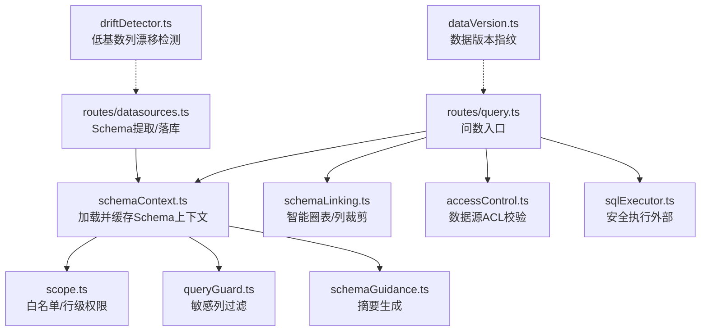
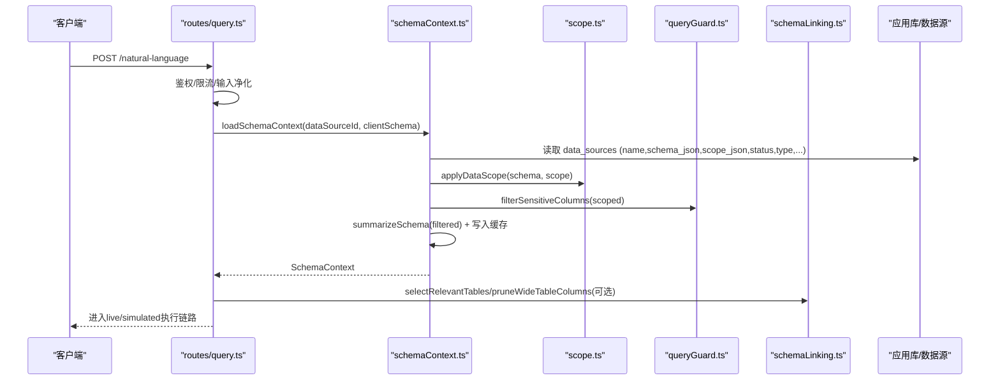
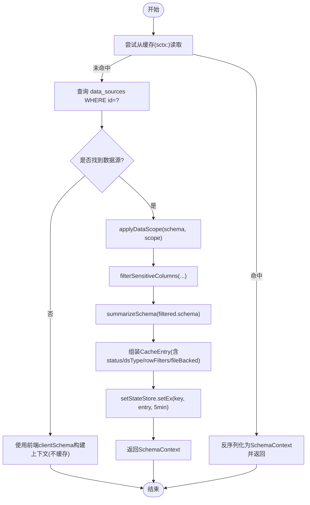
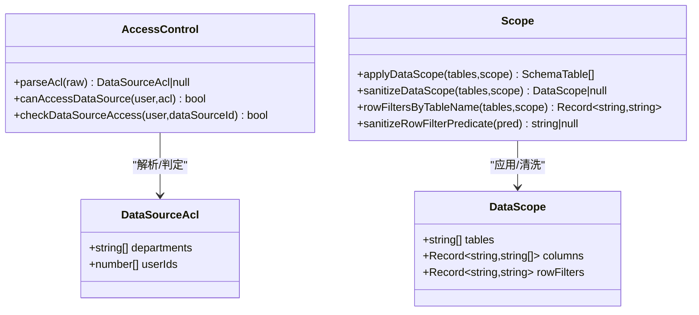
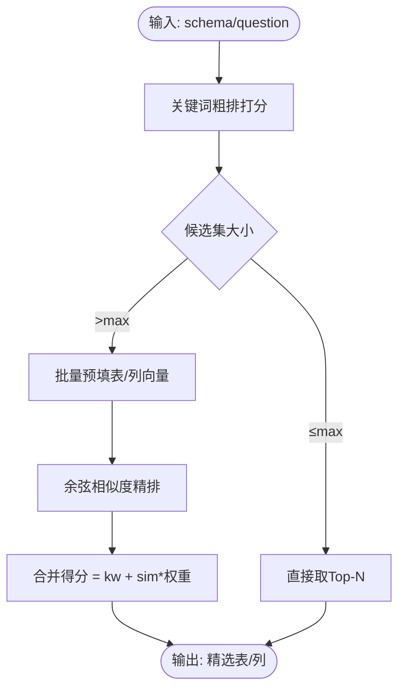
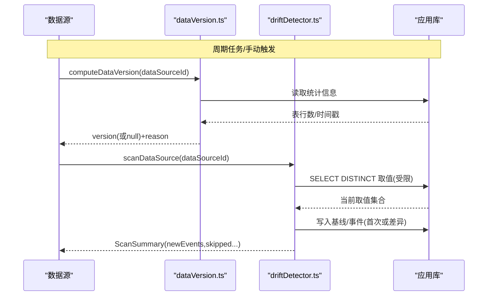
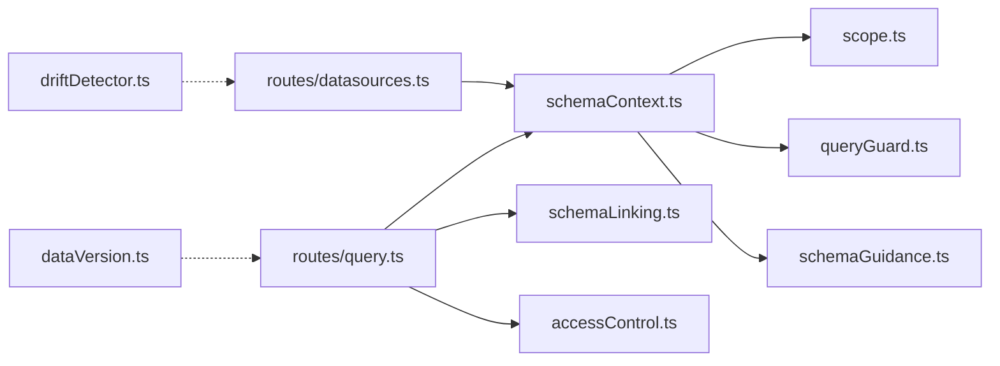

# Schema上下文管理

<cite>
**本文引用的文件**
- [server/query/schemaContext.ts](file://server/query/schemaContext.ts)
- [server/query/schemaTypes.ts](file://server/query/schemaTypes.ts)
- [server/query/scope.ts](file://server/query/scope.ts)
- [server/auth/accessControl.ts](file://server/auth/accessControl.ts)
- [server/query/schemaLinking.ts](file://server/query/schemaLinking.ts)
- [server/query/schemaGuidance.ts](file://server/query/schemaGuidance.ts)
- [server/query/queryGuard.ts](file://server/query/queryGuard.ts)
- [server/routes/datasources.ts](file://server/routes/datasources.ts)
- [server/routes/query.ts](file://server/routes/query.ts)
- [server/dataVersion.ts](file://server/dataVersion.ts)
- [server/driftDetector.ts](file://server/driftDetector.ts)
</cite>

## 目录
1. [简介](#简介)
2. [项目结构](#项目结构)
3. [核心组件](#核心组件)
4. [架构总览](#架构总览)
5. [详细组件分析](#详细组件分析)
6. [依赖关系分析](#依赖关系分析)
7. [性能考虑](#性能考虑)
8. [故障排查指南](#故障排查指南)
9. [结论](#结论)
10. [附录](#附录)

## 简介
本文件系统性阐述“Schema上下文管理”的完整机制，覆盖以下目标：
- Schema元数据的提取与管理：数据库结构发现、表关系映射、列信息获取。
- 权限映射系统：用户权限到数据库权限的转换、行级访问控制、列级数据脱敏。
- Schema链接与推理：表间关系识别、业务语义映射、智能推荐（圈表/列裁剪）。
- Schema变更检测与版本管理：结构变更监控、兼容性检查、迁移策略。
- 构建过程示例：权限过滤、元数据缓存、动态更新机制的代码路径说明。

## 项目结构
围绕Schema上下文的核心模块分布在查询层、鉴权层、路由层与基础设施中：
- 查询层：schemaContext（上下文加载与缓存）、scope（范围与行级权限）、schemaLinking（智能圈表/列裁剪）、schemaGuidance（摘要生成）、queryGuard（敏感列过滤）。
- 鉴权层：accessControl（数据源ACL组织/部门维度授权）。
- 路由层：datasources（Schema提取与落库）、query（问数主链路集成上下文）。
- 基础设施：dataVersion（数据版本指纹）、driftDetector（低基数列漂移检测）。

图表来源
- [server/routes/query.ts:47-200](file://server/routes/query.ts#L47-L200)
- [server/query/schemaContext.ts:108-171](file://server/query/schemaContext.ts#L108-L171)
- [server/query/scope.ts:28-100](file://server/query/scope.ts#L28-L100)
- [server/query/queryGuard.ts:71-100](file://server/query/queryGuard.ts#L71-L100)
- [server/query/schemaLinking.ts:45-181](file://server/query/schemaLinking.ts#L45-L181)
- [server/auth/accessControl.ts:44-73](file://server/auth/accessControl.ts#L44-L73)
- [server/routes/datasources.ts:177-200](file://server/routes/datasources.ts#L177-L200)
- [server/dataVersion.ts:56-98](file://server/dataVersion.ts#L56-L98)
- [server/driftDetector.ts:157-231](file://server/driftDetector.ts#L157-L231)

章节来源
- [server/routes/query.ts:47-200](file://server/routes/query.ts#L47-L200)
- [server/query/schemaContext.ts:108-171](file://server/query/schemaContext.ts#L108-L171)
- [server/routes/datasources.ts:177-200](file://server/routes/datasources.ts#L177-L200)

## 核心组件
- Schema上下文加载器：负责从应用库读取数据源配置、应用范围过滤、敏感列过滤、生成摘要、写入缓存，并返回状态与能力标志。
- 类型规范：统一SchemaTable/SchemaColumn定义，贯穿提取、缓存、圈定、提示序列化等全链路。
- 范围与权限：DataScope表/列白名单、行级谓词清洗与注入映射；ACL组织/部门维度访问控制。
- 智能链接：关键词+embedding的表/列相关性打分与裁剪，支持批量预填与内容寻址缓存。
- 变更检测：数据版本指纹与低基数列漂移事件，支撑自动更新与知识文档维护。

章节来源
- [server/query/schemaTypes.ts:1-30](file://server/query/schemaTypes.ts#L1-L30)
- [server/query/schemaContext.ts:18-81](file://server/query/schemaContext.ts#L18-L81)
- [server/query/scope.ts:10-100](file://server/query/scope.ts#L10-L100)
- [server/auth/accessControl.ts:13-73](file://server/auth/accessControl.ts#L13-L73)
- [server/query/schemaLinking.ts:15-181](file://server/query/schemaLinking.ts#L15-L181)
- [server/dataVersion.ts:10-98](file://server/dataVersion.ts#L10-L98)
- [server/driftDetector.ts:18-96](file://server/driftDetector.ts#L18-L96)

## 架构总览
Schema上下文在问数主链路中的位置与作用：
- 输入净化与权限校验后，调用loadSchemaContext构建上下文。
- 上下文包含：过滤后的schema、guidance、rowFilters、sensitiveRemoved、dsType/fileBacked等。
- 根据isLiveCapableType决定走真实执行或模拟模式。
- schemaLinking在prompt阶段进行表/列裁剪，减少上下文体积并提升召回质量。

图表来源
- [server/routes/query.ts:47-200](file://server/routes/query.ts#L47-L200)
- [server/query/schemaContext.ts:108-171](file://server/query/schemaContext.ts#L108-L171)
- [server/query/scope.ts:28-100](file://server/query/scope.ts#L28-L100)
- [server/query/queryGuard.ts:71-100](file://server/query/queryGuard.ts#L71-L100)
- [server/query/schemaLinking.ts:45-181](file://server/query/schemaLinking.ts#L45-L181)

## 详细组件分析

### Schema上下文加载与缓存
- 功能要点：
  - 优先从StateStore缓存命中（键前缀 sctx:），未命中则查应用库data_sources。
  - 应用DataScope白名单与列限制，再执行敏感列过滤。
  - 生成guidance摘要，记录sensitiveRemoved、allowIntrospection、rowFilters、dataSourceName、fileBacked。
  - 写回缓存TTL=5分钟；支持invalidateSchemaCache按数据源或全局失效。
- 关键接口：
  - loadSchemaContext(dataSourceId, clientSchema): Promise<SchemaContext>
  - invalidateSchemaCache(dataSourceId?): Promise<void>
  - isLiveCapableType(dsType, fileBacked): boolean

图表来源
- [server/query/schemaContext.ts:108-171](file://server/query/schemaContext.ts#L108-L171)
- [server/query/scope.ts:28-43](file://server/query/scope.ts#L28-L43)
- [server/query/queryGuard.ts:71-100](file://server/query/queryGuard.ts#L71-L100)
- [server/query/schemaGuidance.ts:25-36](file://server/query/schemaGuidance.ts#L25-L36)

章节来源
- [server/query/schemaContext.ts:18-81](file://server/query/schemaContext.ts#L18-L81)
- [server/query/schemaContext.ts:108-171](file://server/query/schemaContext.ts#L108-L171)

### 权限映射系统（ACL、DataScope、行级/列级控制）
- ACL（组织/部门维度）：
  - canAccessDataSource(user, acl)：管理员放行；否则匹配userIds或departments。
  - checkDataSourceAccess：服务侧复核，拒绝无权限访问的数据源。
- DataScope：
  - applyDataScope：按tables/columns裁剪schema；sanitizeDataScope对不存在表/列做容错。
  - rowFiltersByTableName：将tableId→实际表名映射，供执行层AST注入WHERE片段。
  - sanitizeRowFilterPredicate：防SQL注入（禁止多语句、注释、子查询、INTO等）。
- 列级脱敏：
  - filterSensitiveColumns：基于正则匹配敏感列名/描述，剔除并记录removed清单。

图表来源
- [server/auth/accessControl.ts:13-73](file://server/auth/accessControl.ts#L13-L73)
- [server/query/scope.ts:10-100](file://server/query/scope.ts#L10-L100)

章节来源
- [server/auth/accessControl.ts:44-73](file://server/auth/accessControl.ts#L44-L73)
- [server/query/scope.ts:17-100](file://server/query/scope.ts#L17-L100)
- [server/query/queryGuard.ts:71-100](file://server/query/queryGuard.ts#L71-L100)

### Schema链接与推理（表/列智能圈定）
- 表级圈定：
  - selectRelevantTables：关键词打分（表名/中文名/描述/口径/列描述），保持原序稳定。
  - selectRelevantTablesAsync：关键词粗排→embedding精排（批量预填+内容寻址缓存），不可用时降级纯关键词。
- 列级裁剪：
  - pruneWideTableColumns：宽表阈值触发，top-N相关列+强制保留（主键/指标引用列）。
  - pruneWideTableColumnsAsync：同上但引入embedding精排，跨表合并候选批量请求。
- 辅助：
  - extractExprColumns/metricColumnsByTable：从指标表达式/过滤器提取列名用于强制保留。
  - 缓存：表/列摘要向量进程内LRU缓存，key为内容指纹（sha1前16位），编辑即失效。

图表来源
- [server/query/schemaLinking.ts:45-181](file://server/query/schemaLinking.ts#L45-L181)
- [server/query/schemaLinking.ts:247-381](file://server/query/schemaLinking.ts#L247-L381)

章节来源
- [server/query/schemaLinking.ts:15-181](file://server/query/schemaLinking.ts#L15-L181)
- [server/query/schemaLinking.ts:247-381](file://server/query/schemaLinking.ts#L247-L381)

### Schema变更检测与版本管理
- 数据版本指纹：
  - computeDataVersion：基于information_schema/pg_stat_user_tables的行数与更新时间计算轻量指纹，内存缓存10秒，避免轮询风暴。
  - buildDataVersion：稳定哈希（sha1前16位），空库返回null（前端跳过自动更新）。
- 低基数列漂移检测：
  - scanDataSource：自动发现候选枚举列（字符串、非编号/名称/日期类，COUNT(DISTINCT)≤50），读取取值快照比对，产生OPEN事件；支持ack。
  - startDriftSweeper：定时扫描，日志汇总新事件。

图表来源
- [server/dataVersion.ts:56-98](file://server/dataVersion.ts#L56-L98)
- [server/driftDetector.ts:157-231](file://server/driftDetector.ts#L157-L231)

章节来源
- [server/dataVersion.ts:10-98](file://server/dataVersion.ts#L10-L98)
- [server/driftDetector.ts:18-96](file://server/driftDetector.ts#L18-L96)
- [server/driftDetector.ts:157-231](file://server/driftDetector.ts#L157-L231)

### Schema元数据提取与落库（数据库结构发现）
- 类型映射：mapMysqlType/mapPgType将底层数据类型归一为number/date/category/boolean/string。
- 角色推导：deriveColumnRole依据主键、类型、长度等推断isMetric/isDimension。
- 组装：assembleTables按表分组列、推导角色、拼装AssembledTable（id/name/displayName/description/rowCount/columns/tableType/businessNote）。
- 落库：routes/datasources在创建/同步时写入schema_json/scope_json/acl_json等，并在变更后调用invalidateSchemaCache使缓存失效。

章节来源
- [server/routes/datasources.ts:92-135](file://server/routes/datasources.ts#L92-L135)
- [server/routes/datasources.ts:177-200](file://server/routes/datasources.ts#L177-L200)
- [server/query/schemaContext.ts:50-55](file://server/query/schemaContext.ts#L50-L55)

### 构建过程示例（代码路径说明）
- 权限过滤：
  - 数据源ACL校验：[server/auth/accessControl.ts:44-73](file://server/auth/accessControl.ts#L44-L73)
  - 表/列白名单与行级谓词：[server/query/scope.ts:28-100](file://server/query/scope.ts#L28-L100)
- 元数据缓存：
  - 上下文缓存读写与失效：[server/query/schemaContext.ts:30-55](file://server/query/schemaContext.ts#L30-L55), [server/query/schemaContext.ts:108-171](file://server/query/schemaContext.ts#L108-L171)
- 动态更新机制：
  - 数据源变更后失效缓存：[server/query/schemaContext.ts:50-55](file://server/query/schemaContext.ts#L50-L55)
  - 数据版本指纹与漂移事件：[server/dataVersion.ts:56-98](file://server/dataVersion.ts#L56-L98), [server/driftDetector.ts:157-231](file://server/driftDetector.ts#L157-L231)

## 依赖关系分析
- 松耦合设计：
  - schemaContext依赖scope、queryGuard、schemaGuidance完成上下文装配，不直接操作数据库连接池（通过infra/db）。
  - schemaLinking独立于上下文装配，仅消费SchemaTable[]与问题文本，可插拔embedding实现。
  - accessControl与scope正交：前者决定“能否访问数据源”，后者决定“可用哪些表/列/行”。
- 外部依赖：
  - StateStore（Redis/内存）用于跨实例共享缓存与失效广播。
  - LLM embedding服务用于语义精排，失败静默降级。
  - SQL执行层executeSafeSql用于安全读取统计与取值。

图表来源
- [server/query/schemaContext.ts:108-171](file://server/query/schemaContext.ts#L108-L171)
- [server/query/scope.ts:28-100](file://server/query/scope.ts#L28-L100)
- [server/query/queryGuard.ts:71-100](file://server/query/queryGuard.ts#L71-L100)
- [server/query/schemaLinking.ts:45-181](file://server/query/schemaLinking.ts#L45-L181)
- [server/auth/accessControl.ts:44-73](file://server/auth/accessControl.ts#L44-L73)
- [server/routes/query.ts:47-200](file://server/routes/query.ts#L47-L200)
- [server/routes/datasources.ts:177-200](file://server/routes/datasources.ts#L177-L200)
- [server/dataVersion.ts:56-98](file://server/dataVersion.ts#L56-L98)
- [server/driftDetector.ts:157-231](file://server/driftDetector.ts#L157-L231)

章节来源
- [server/query/schemaContext.ts:108-171](file://server/query/schemaContext.ts#L108-L171)
- [server/routes/query.ts:47-200](file://server/routes/query.ts#L47-L200)

## 性能考虑
- 缓存分层：
  - 上下文缓存TTL=5分钟，跨实例共享（Redis）；编辑schema后主动失效。
  - 表/列embedding向量进程内LRU缓存，内容寻址键避免误失效。
  - 数据版本指纹内存缓存10秒，降低轮询压力。
- 批量化与降级：
  - 表/列embedding批量预填，减少远程调用次数。
  - embedding不可用时静默降级为纯关键词打分，保证可用性。
- 安全与稳定性：
  - 行级谓词严格清洗，防止注入。
  - 并发槽与限流保护LLM与执行链路。

[本节提供通用指导，无需特定文件分析]

## 故障排查指南
- 常见问题定位：
  - 上下文未命中缓存：检查invalidateSchemaCache是否被正确调用（数据源变更后）。
  - 权限拒绝：确认ACL配置与用户部门/ID是否匹配；检查checkDataSourceAccess返回值。
  - 行级过滤无效：核对rowFiltersByTableName映射是否正确（tableId→实际表名）。
  - 敏感列未过滤：检查filterSensitiveColumns正则匹配与列描述是否包含敏感词。
  - 圈表不准：验证表/列描述与业务口径是否完善；必要时调整关键词权重或启用embedding。
  - 版本检测异常：查看computeDataVersion返回的reason；MySQL旧版本可能无法设置会话变量。
  - 漂移事件重复：确认事件去重逻辑（同added/removed且OPEN状态不重复告警）。
- 建议步骤：
  - 先复现最小用例，逐步关闭embedding以定位是否为语义召回问题。
  - 打印/审计日志：关注DENIED_*事件与错误码。
  - 清理缓存：调用invalidateSchemaCache或重启服务（内存模式）。

章节来源
- [server/query/schemaContext.ts:50-55](file://server/query/schemaContext.ts#L50-L55)
- [server/auth/accessControl.ts:44-73](file://server/auth/accessControl.ts#L44-L73)
- [server/query/scope.ts:17-100](file://server/query/scope.ts#L17-L100)
- [server/query/queryGuard.ts:71-100](file://server/query/queryGuard.ts#L71-L100)
- [server/dataVersion.ts:56-98](file://server/dataVersion.ts#L56-L98)
- [server/driftDetector.ts:199-213](file://server/driftDetector.ts#L199-L213)

## 结论
本方案通过“上下文加载—权限映射—智能链接—变更检测”的闭环，实现了高可用、可扩展的Schema上下文管理：
- 安全性：ACL+DataScope+敏感列过滤+行级谓词清洗，多层防御。
- 性能：多级缓存、批量化、降级策略，保障大规模Schema下的响应速度。
- 可演进：内容寻址缓存与漂移检测，确保Schema变化及时生效与知识一致性。

[本节总结性内容，无需特定文件分析]

## 附录
- 关键类型与常量：
  - SchemaTable/SchemaColumn：统一Schema结构，贯穿全链路。
  - MAX_TABLES_IN_PROMPT/WIDE_TABLE_COLUMN_THRESHOLD/MAX_COLUMNS_IN_WIDE_TABLE：控制Prompt体积与召回粒度。
  - SENSITIVE_COLUMN_PATTERN：敏感列识别规则。
- 参考路径：
  - 类型定义：[server/query/schemaTypes.ts:1-30](file://server/query/schemaTypes.ts#L1-L30)
  - 圈表/列裁剪：[server/query/schemaLinking.ts:45-181](file://server/query/schemaLinking.ts#L45-L181), [server/query/schemaLinking.ts:247-381](file://server/query/schemaLinking.ts#L247-L381)
  - 敏感列过滤：[server/query/queryGuard.ts:71-100](file://server/query/queryGuard.ts#L71-L100)
  - 权限与范围：[server/auth/accessControl.ts:44-73](file://server/auth/accessControl.ts#L44-L73), [server/query/scope.ts:28-100](file://server/query/scope.ts#L28-L100)
  - 上下文加载与缓存：[server/query/schemaContext.ts:108-171](file://server/query/schemaContext.ts#L108-L171)
  - 版本与漂移：[server/dataVersion.ts:56-98](file://server/dataVersion.ts#L56-L98), [server/driftDetector.ts:157-231](file://server/driftDetector.ts#L157-L231)