# 查询处理引擎

<cite>
**本文引用的文件**
- [liveQuery.ts](file://server/query/liveQuery.ts)
- [sqlExecutor.ts](file://server/query/sqlExecutor.ts)
- [schemaContext.ts](file://server/query/schemaContext.ts)
- [queryPlan.ts](file://server/query/queryPlan.ts)
- [analysisChain.ts](file://server/query/analysisChain.ts)
- [scope.ts](file://server/query/scope.ts)
- [queryGuard.ts](file://server/query/queryGuard.ts)
- [userQueryLimit.ts](file://server/infra/userQueryLimit.ts)
- [sqlTemplates.ts](file://server/query/sqlTemplates.ts)
- [fallbackPipeline.ts](file://server/utils/fallback/fallbackPipeline.ts)
- [ruleBased.ts](file://server/utils/fallbackStrategies/ruleBased.ts)
- [simplerPrompt.ts](file://server/utils/fallbackStrategies/simplerPrompt.ts)
- [types.ts](file://server/utils/fallback/types.ts)
- [db.ts](file://server/infra/db.ts)
- [query.ts](file://server/routes/query.ts)
- [fallbackApproval.ts](file://server/routes/fallbackApproval.ts)
- [activeLearning.ts](file://server/utils/activeLearning.ts)
- [fewShotService.ts](file://server/utils/fewShotService.ts)
- [expertPersona.ts](file://server/llm/expertPersona.ts)
- [llmClient.ts](file://server/llm/llmClient.ts)
- [liveQueryUtils.ts](file://server/query/liveQueryUtils.ts)
</cite>

## 更新摘要
**变更内容**
- 新增八源上下文并行构建机制（铁律规则v0.9.35、专家角色v0.9.40作为新输入流），实现七路上下文并发加载与预算裁剪
- 阶段二执行新增小模型快速路由和强制中文兜底机制，支持LLM_ANALYSIS_ENGINE/LLM_ANALYSIS_MODEL配置
- 三层Fallback自救机制实现失败样本审核队列和Few-Shot注入自学习闭环，包含adversarial_samples和few_shot_examples表
- 专家角色库化配置系统，支持关键词匹配、优先级排序和内置角色版本管理
- 增强查询处理管道集成，在阶段二解读失败时自动触发回退机制，形成对抗训练闭环

## 目录
1. [简介](#简介)
2. [项目结构](#项目结构)
3. [核心组件](#核心组件)
4. [架构总览](#架构总览)
5. [详细组件分析](#详细组件分析)
6. [依赖关系分析](#依赖关系分析)
7. [性能与复杂度评估](#性能与复杂度评估)
8. [故障排查指南](#故障排查指南)
9. [结论](#结论)
10. [附录：关键流程时序图](#附录：关键流程时序图)

## 简介
本文件面向"智能问数据分析系统"的查询处理引擎，系统性阐述 M3 中间表清洗链、自然语言转 SQL 的完整流程、SQL 执行安全约束、查询计划优化（中间表物化、TTL、用户配额）、Schema 上下文管理（元数据提取、权限映射、列级访问控制），以及新增的对抗训练闭环系统。该系统通过八源上下文并行构建、小模型快速路由、三层回退策略、困难样本收集和人类审批流程，显著提升了复杂查询的处理成功率和系统鲁棒性。目标是帮助读者在不深入源码的情况下理解整体设计，同时为二次开发提供精确的文件定位与调用路径。

## 项目结构
查询处理引擎位于 server/query 目录下，围绕"上下文构建 → 计划生成 → 安全执行 → 结果解读"的主线组织，新增的对抗训练闭环系统和专家角色管理系统位于相关目录：
- 上下文与权限：schemaContext、scope、queryGuard
- 计划与模板：queryPlan、sqlTemplates
- 执行与安全：sqlExecutor
- 编排与链路：liveQuery
- 中间表与清洗链：analysisChain
- 用户配额：userQueryLimit（infra）
- **新增** 对抗训练闭环：fallbackPipeline、ruleBased、simplerPrompt、human_approval、fewShotService、activeLearning
- **新增** 专家角色管理：expertPersona、llmClient（阶段路由）
- **新增** 中文兜底机制：liveQueryUtils（中文化替换）

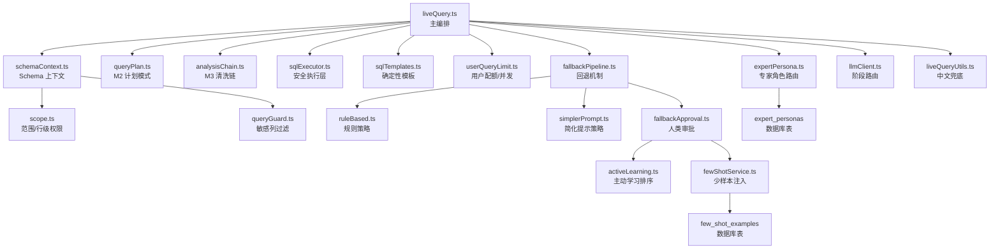

**图表来源**
- [liveQuery.ts:220-331](file://server/query/liveQuery.ts#L220-L331)
- [fallbackPipeline.ts:16-138](file://server/utils/fallback/fallbackPipeline.ts#L16-L138)
- [expertPersona.ts:196-212](file://server/llm/expertPersona.ts#L196-L212)
- [llmClient.ts:456-474](file://server/llm/llmClient.ts#L456-L474)
- [liveQueryUtils.ts:247-267](file://server/query/liveQueryUtils.ts#L247-L267)

**章节来源**
- [liveQuery.ts:220-331](file://server/query/liveQuery.ts#L220-L331)
- [fallbackPipeline.ts:16-138](file://server/utils/fallback/fallbackPipeline.ts#L16-L138)
- [expertPersona.ts:196-212](file://server/llm/expertPersona.ts#L196-L212)
- [llmClient.ts:456-474](file://server/llm/llmClient.ts#L456-L474)
- [liveQueryUtils.ts:247-267](file://server/query/liveQueryUtils.ts#L247-L267)

## 核心组件
- 自然语言转 SQL 编排（liveQuery）：并行构建八路上下文（新增铁律规则和专家角色），模板优先命中，多候选并行生成与多数表决，失败回喂 LLM 重试，EXPLAIN 防线拦截后收窄一次。
- SQL 安全执行层（sqlExecutor）：SELECT-only、表白名单、AST 复核、行级权限注入、强制 LIMIT、超时、EXPLAIN 扫描量防护、连接池分级与场景化超时。
- M3 中间表清洗链（analysisChain）：复杂度评估 → 多步清洗计划 → 源库 SELECT 安全执行 → 应用库物理中间表物化（ait_*）→ TTL 清理与用户配额。
- Schema 上下文（schemaContext + scope + queryGuard）：加载 schema → 范围过滤 → 敏感列剔除 → 摘要生成 → 缓存；导出 rowFilters 供执行层 AST 注入。
- 查询计划（queryPlan）：LLM 生成可批准的分析计划（M2），一次性消费防重放，支持 Redis 持久化。
- 确定性模板（sqlTemplates）：对复杂 SQL 采用"模板选择 + 参数填充"，服务端确定性拼装，零偏差兜底。
- 用户配额（userQueryLimit）：每小时次数上限 + 同用户并发互斥，内存/Redis 双实现。
- **新增** 对抗训练闭环系统（fallbackPipeline + fewShotService + activeLearning）：三层策略降级、困难样本收集、人类审批、少样本注入、主动学习优先级排序。
- **新增** 专家角色系统（expertPersona）：库化配置、关键词匹配、优先级排序、内置角色版本管理。
- **新增** 小模型快速路由（llmClient）：阶段级模型路由、熔断转移、快速模型配置。
- **新增** 中文兜底机制（liveQueryUtils）：表头及说明强制中文化、英文标识符替换、业务中文名推断。

**章节来源**
- [liveQuery.ts:220-749](file://server/query/liveQuery.ts#L220-L749)
- [sqlExecutor.ts:1-832](file://server/query/sqlExecutor.ts#L1-L832)
- [analysisChain.ts:1-411](file://server/query/analysisChain.ts#L1-L411)
- [schemaContext.ts:1-172](file://server/query/schemaContext.ts#L1-L172)
- [expertPersona.ts:1-329](file://server/llm/expertPersona.ts#L1-L329)
- [llmClient.ts:141-474](file://server/llm/llmClient.ts#L141-L474)
- [liveQueryUtils.ts:193-267](file://server/query/liveQueryUtils.ts#L193-L267)

## 架构总览
下图展示从用户提问到结果解读的端到端流程，以及各安全与优化环节的位置，包括新增的八源上下文并行构建、专家角色路由和小模型快速路由。

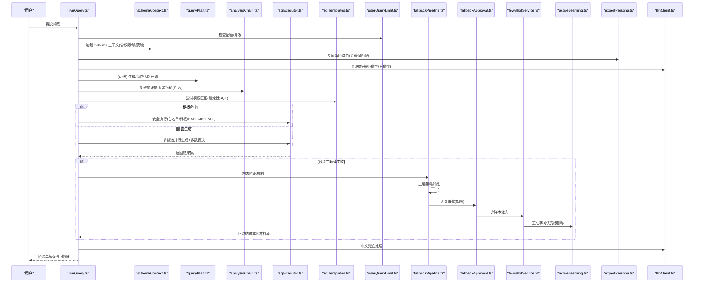

**图表来源**
- [liveQuery.ts:220-749](file://server/query/liveQuery.ts#L220-L749)
- [expertPersona.ts:196-212](file://server/llm/expertPersona.ts#L196-L212)
- [llmClient.ts:456-474](file://server/llm/llmClient.ts#L456-L474)
- [fallbackPipeline.ts:47-138](file://server/utils/fallback/fallbackPipeline.ts#L47-L138)
- [fallbackApproval.ts:24-175](file://server/routes/fallbackApproval.ts#L24-L175)
- [fewShotService.ts:34-64](file://server/utils/fewShotService.ts#L34-L64)
- [activeLearning.ts:40-129](file://server/utils/activeLearning.ts#L40-L129)

## 详细组件分析

### 八源上下文并行构建系统（新增）
**更新** 新增完整的八源上下文并行构建机制，实现了七个独立上下文源的并发加载和预算控制。

#### 并行上下文源
- **Few-shot 样例**：团队样例库和个人对话沉淀，以 user/assistant 消息对格式注入
- **知识库 RAG**：业务知识片段检索，按 token 预算截断
- **外部知识库**：企业级外部 RAG 检索，单源失败降级空
- **语义指标层**：问题命中指标名/同义词时模板化注入权威口径
- **点踩反例**：同数据源点踩问答对作为反面教材
- **个人对话沉淀**：本人同数据源历史成功问答对作为个人 few-shot
- **铁律规则**：该数据源全部 ACTIVE 铁律恒注入（最高优先级强制约束）
- **专家角色**：库化配置的专家视角，按关键词匹配优先级生效

#### 预算控制与容错
- 每个上下文源独立失败不阻断主流程
- 知识库和外部知识分别进行 token 预算控制
- Few-shot 以对话历史格式注入，更贴合 LLM 多轮格式
- 宽表列级裁剪降低 prompt token 占用

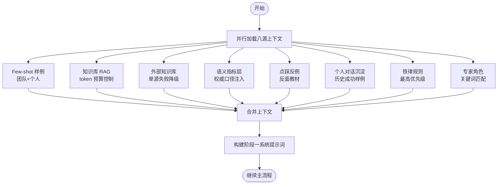

**图表来源**
- [liveQuery.ts:220-331](file://server/query/liveQuery.ts#L220-L331)
- [expertPersona.ts:196-212](file://server/llm/expertPersona.ts#L196-L212)

**章节来源**
- [liveQuery.ts:220-331](file://server/query/liveQuery.ts#L220-L331)
- [expertPersona.ts:196-212](file://server/llm/expertPersona.ts#L196-L212)

### 专家角色路由系统（新增）
**更新** 新增完整的专家角色库化配置系统，支持关键词匹配、优先级排序和内置角色版本管理。

#### 角色配置管理
- **内置角色**：风险、客户、财务、不良资产、默认五种内置角色
- **关键词匹配**：按 sortOrder 升序进行关键词包含匹配
- **优先级控制**：sortOrder 小的先匹配，避免宽泛领域词抢先命中
- **版本管理**：内置角色内容版本化，启动时同步代码常量

#### 路由机制
- **库化加载**：60s 内存缓存，写操作即时失效
- **降级机制**：库不可用时回退内置常量路由
- **兜底保护**：default 角色恒可用，不参与关键词匹配

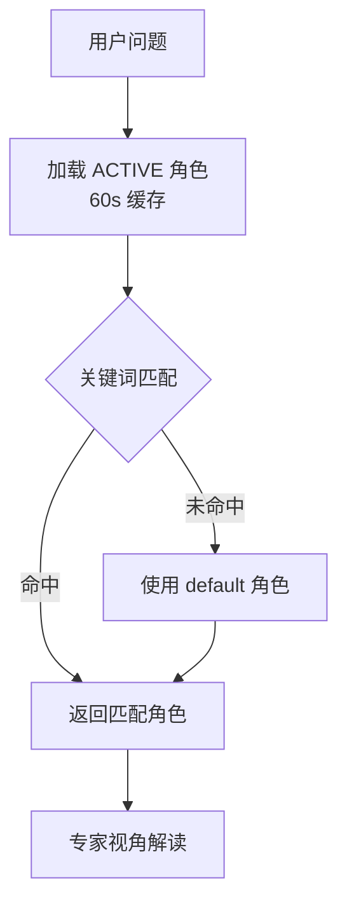

**图表来源**
- [expertPersona.ts:196-212](file://server/llm/expertPersona.ts#L196-L212)
- [expertPersona.ts:128-139](file://server/llm/expertPersona.ts#L128-L139)

**章节来源**
- [expertPersona.ts:1-329](file://server/llm/expertPersona.ts#L1-L329)

### 小模型快速路由机制（新增）
**更新** 新增阶段级模型路由机制，支持简单查询走快速模型提升性能。

#### 路由策略
- **环境变量控制**：LLM_SQL_ROUTE_MAX_TABLES 控制表数阈值
- **复杂度判断**：multi-step 或表数超过阈值走主模型
- **快速模型配置**：LLM_ANALYSIS_ENGINE/LLM_ANALYSIS_MODEL 配置阶段二快速模型
- **熔断转移**：主引擎连续失败自动切换备用引擎

#### 性能优化
- 简单单表问题走快速模型，提速 3~5 倍
- 复杂多表 JOIN 问题强制主模型保证准确性
- 阶段二解读支持快速模型路由，未配置时回退主模型

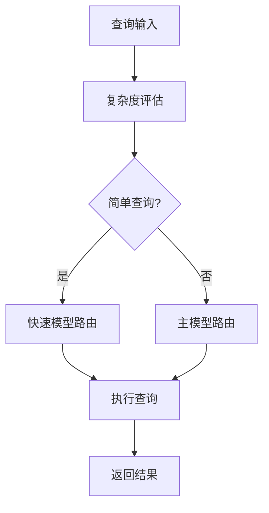

**图表来源**
- [liveQuery.ts:348-357](file://server/query/liveQuery.ts#L348-L357)
- [llmClient.ts:456-474](file://server/llm/llmClient.ts#L456-L474)

**章节来源**
- [liveQuery.ts:348-357](file://server/query/liveQuery.ts#L348-L357)
- [llmClient.ts:456-474](file://server/llm/llmClient.ts#L456-L474)

### 强制中文兜底机制（新增）
**更新** 新增完整的中文兜底机制，确保所有输出内容的中文化。

#### 中文化策略
- **表头替换**：将英文表名/列名替换为业务中文名
- **图表轴名**：图表标题、X/Y 轴名称强制中文化
- **解读文案**：AI 解释、洞察、KPI、追问等全字段中文化
- **推导过程**：思维链中的标识符替换为中文

#### 实现机制
- **标识符映射**：从 schema 提取英文标识符到中文名的映射
- **正则替换**：安全地替换文本中的英文标识符
- **容错处理**：无法识别的标识符保持原值，不编造中文名

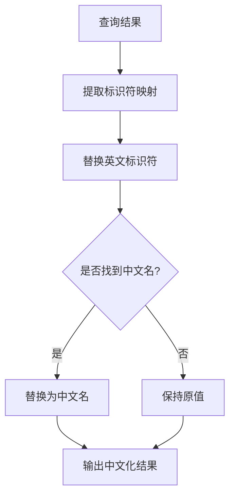

**图表来源**
- [liveQueryUtils.ts:247-267](file://server/query/liveQueryUtils.ts#L247-L267)
- [liveQueryUtils.ts:193-210](file://server/query/liveQueryUtils.ts#L193-L210)

**章节来源**
- [liveQueryUtils.ts:193-267](file://server/query/liveQueryUtils.ts#L193-L267)

### 三层Fallback自救机制（增强）
**更新** 完善三层回退策略降级机制，实现完整的对抗训练闭环。

#### 策略层级
- **rule_based**：基于规则的快速响应，无需 LLM 调用，响应迅速
- **simpler_prompt**：简化提示词 + Few-Shot 示例，提高复杂查询成功率
- **human_approval**：人工审核介入，创建标注任务进行修正

#### 困难样本管理
- **自动采集**：失败的查询自动记录为 Hard Negative
- **状态流转**：PENDING → IN_REVIEW → APPROVED/REJECTED
- **审计日志**：记录每次回退决策的策略使用、响应延迟等指标

#### 少样本注入
- **独立存储**：few_shot_examples 表避免污染业务知识 RAG 检索
- **相似度检索**：bigram 相似度检索，复用历史修正 SQL
- **批量优化**：每批最多 10 条，防止 SQL 过长

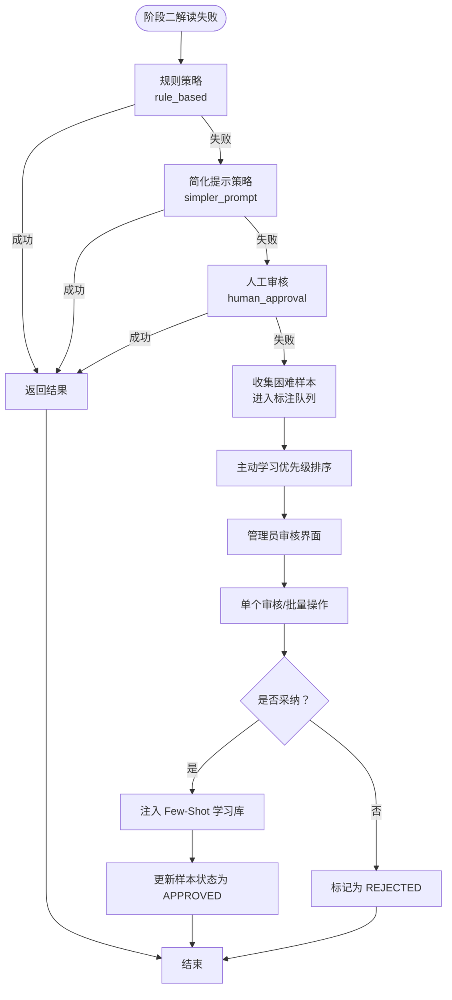

**图表来源**
- [fallbackPipeline.ts:66-113](file://server/utils/fallback/fallbackPipeline.ts#L66-L113)
- [ruleBased.ts:122-161](file://server/utils/fallbackStrategies/ruleBased.ts#L122-L161)
- [simplerPrompt.ts:87-155](file://server/utils/fallbackStrategies/simplerPrompt.ts#L87-L155)
- [fallbackApproval.ts:24-175](file://server/routes/fallbackApproval.ts#L24-L175)
- [fewShotService.ts:34-64](file://server/utils/fewShotService.ts#L34-L64)
- [activeLearning.ts:40-129](file://server/utils/activeLearning.ts#L40-L129)

**章节来源**
- [fallbackPipeline.ts:1-138](file://server/utils/fallback/fallbackPipeline.ts#L1-L138)
- [ruleBased.ts:1-161](file://server/utils/fallbackStrategies/ruleBased.ts#L1-L161)
- [simplerPrompt.ts:1-164](file://server/utils/fallbackStrategies/simplerPrompt.ts#L1-L164)
- [types.ts:1-53](file://server/utils/fallback/types.ts#L1-L53)
- [db.ts:729-794](file://server/infra/db.ts#L729-L794)
- [fallbackApproval.ts:24-175](file://server/routes/fallbackApproval.ts#L24-L175)
- [fewShotService.ts:1-121](file://server/utils/fewShotService.ts#L1-L121)
- [activeLearning.ts:1-163](file://server/utils/activeLearning.ts#L1-L163)

### M3 中间表清洗链（analysisChain）
- 复杂度评估：基于启发式信号与 LLM 分类，决定是否启用多步清洗；无信号时快速判 simple，减少 LLM 开销。
- 多步清洗计划：每步为针对源表的 SELECT，禁止引用敏感字段；失败时携带错误让 LLM 自纠一次。
- 物化中间表：在应用库创建 ait_* 物理表，写入前剔除敏感列，按列类型推断批量写入；注册至中间表元数据表，带 TTL。
- 引用校验：最终 SQL 若仅引用已注册的 ait_*，改在应用库执行，严格白名单校验与单条 SELECT 限制。
- TTL 清理：定时任务清理过期中间表及注册条目。
- 用户配额：每用户最多 N 张中间表，超出删除最旧。

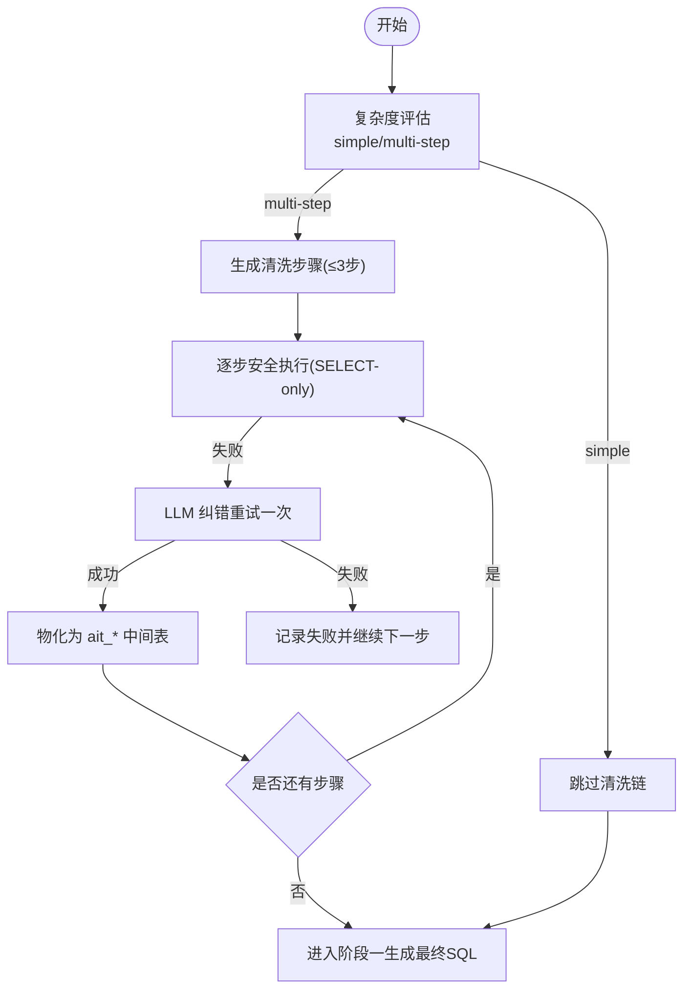

**图表来源**
- [analysisChain.ts:97-112](file://server/query/analysisChain.ts#L97-L112)
- [analysisChain.ts:138-156](file://server/query/analysisChain.ts#L138-L156)
- [analysisChain.ts:218-253](file://server/query/analysisChain.ts#L218-253)
- [analysisChain.ts:268-326](file://server/query/analysisChain.ts#L268-326)
- [analysisChain.ts:331-384](file://server/query/analysisChain.ts#L331-L384)
- [analysisChain.ts:388-411](file://server/query/analysisChain.ts#L388-L411)

**章节来源**
- [analysisChain.ts:1-411](file://server/query/analysisChain.ts#L1-L411)

### 自然语言转 SQL 的完整流程（liveQuery）
- 上下文构建：八源上下文并行加载（新增铁律规则和专家角色），按 token 预算裁剪。
- 模板优先：先尝试模板匹配，命中则确定性拼装 SQL，未命中再自由生成。
- 多候选并行：根据复杂度决定候选数，首个成功即短路；多候选收集后进行结果集多数表决择优。
- 安全执行：通过 sqlExecutor 进行 SELECT-only、白名单、AST 复核、行级权限注入、LIMIT、EXPLAIN 防护。
- 中间表引用：若最终 SQL 仅引用 ait_*，改在应用库执行，严格白名单校验。
- 阶段二解读：真实结果采样 + 列统计回喂 LLM 生成解读，异常时规则降级。
- **增强** 回退机制：阶段二解读失败时自动触发三层策略降级，支持困难样本收集和知识库注入。
- **增强** 中文兜底：强制替换残留英文标识符为业务中文名。

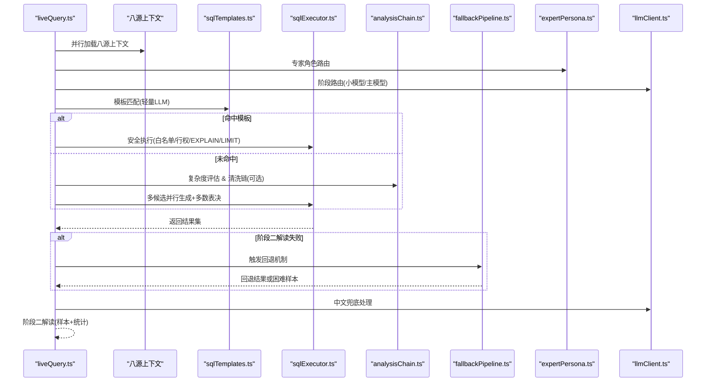

**图表来源**
- [liveQuery.ts:220-749](file://server/query/liveQuery.ts#L220-L749)
- [expertPersona.ts:196-212](file://server/llm/expertPersona.ts#L196-L212)
- [llmClient.ts:456-474](file://server/llm/llmClient.ts#L456-L474)
- [fallbackPipeline.ts:47-138](file://server/utils/fallback/fallbackPipeline.ts#L47-L138)

**章节来源**
- [liveQuery.ts:220-749](file://server/query/liveQuery.ts#L220-L749)

### SQL 执行器的安全约束机制（sqlExecutor）
- 只读保障：仅允许 SELECT 开头或 WITH 开头的 CTE 查询；拒绝 INTO、DDL、危险关键字。
- 表白名单：基于 scope 过滤后的 Schema 表名集合，AST 复核再次确认。
- 敏感列拒绝：裸列名整词匹配，命中即拒绝。
- 行级权限：AST 注入 WHERE 谓词，覆盖子查询/UNION/CTE 内真实表引用。
- 强制 LIMIT：无 LIMIT 追加；有 LIMIT 则 clamp 到 MAX_ROWS；PG/MySQL 方言差异兼容。
- EXPLAIN 防线：预估扫描行数超阈值拦截，提示收窄条件；EXPLAIN 失败 fail-open 放行但埋点。
- 连接池与超时：按数据源+场景分级池，独立超时档位；MySQL 注入 MAX_EXECUTION_TIME hint 防长事务。
- 自愈入口：校验失败时可调用 LLM 纠偏重试一次（统一审计出口）。

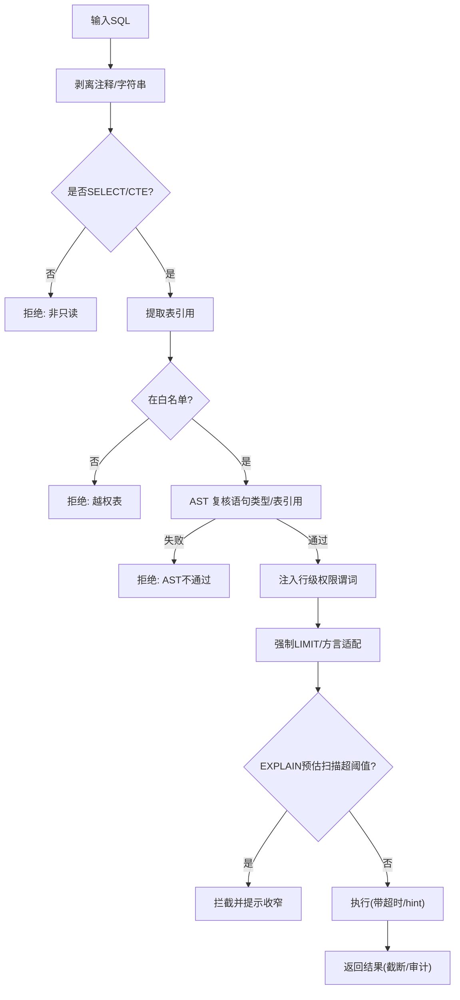

**图表来源**
- [sqlExecutor.ts:291-387](file://server/query/sqlExecutor.ts#L291-L387)
- [sqlExecutor.ts:396-489](file://server/query/sqlExecutor.ts#L396-L489)
- [sqlExecutor.ts:531-662](file://server/query/sqlExecutor.ts#L531-L662)
- [sqlExecutor.ts:686-726](file://server/query/sqlExecutor.ts#L686-L726)
- [sqlExecutor.ts:734-800](file://server/query/sqlExecutor.ts#L734-L800)

**章节来源**
- [sqlExecutor.ts:1-832](file://server/query/sqlExecutor.ts#L1-L832)

### 查询计划优化策略（中间表物化、TTL、用户配额）
- 中间表物化：将清洗结果落库为 ait_* 物理表，后续最终 SQL 可直接引用，避免重复计算。
- TTL 管理：中间表注册表记录 expires_at，定时任务清理过期表与条目，释放存储。
- 用户配额：每用户最多 N 张中间表，超出删除最旧；写前强制校验，防止资源滥用。
- 应用库执行：仅引用已注册中间表的 SELECT 在应用库执行，严格白名单与单语句限制。

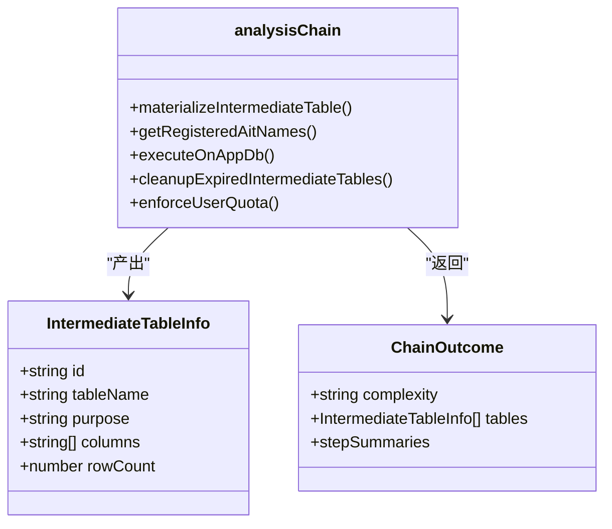

**图表来源**
- [analysisChain.ts:218-253](file://server/query/analysisChain.ts#L218-253)
- [analysisChain.ts:331-384](file://server/query/analysisChain.ts#L331-384)
- [analysisChain.ts:388-411](file://server/query/analysisChain.ts#L388-L411)
- [analysisChain.ts:192-212](file://server/query/analysisChain.ts#L192-L212)

**章节来源**
- [analysisChain.ts:192-253](file://server/query/analysisChain.ts#L192-L253)
- [analysisChain.ts:331-411](file://server/query/analysisChain.ts#L331-L411)

### Schema 上下文管理机制（元数据提取、权限映射、列级访问控制）
- 元数据提取：从 data_sources 读取 schema_json、scope_json、status、type、allow_introspection、config_json。
- 权限映射：applyDataScope 按 tables/columns 过滤；rowFiltersByTableName 生成 tableId→实际表名的行级权限映射。
- 列级访问控制：filterSensitiveColumns 剔除疑似敏感列（密码/密钥/身份证等），返回 removed 清单用于执行层二次拦截。
- 缓存与失效：5 分钟 TTL 缓存，支持 Redis 跨实例共享；配置变更后 invalidateSchemaCache 广播清理。

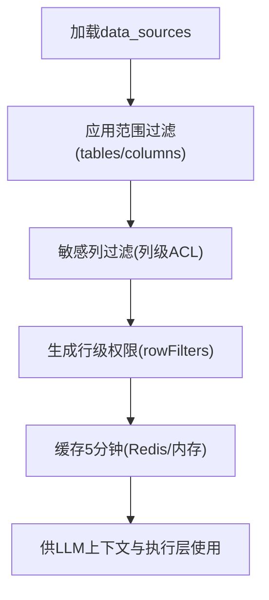

**图表来源**
- [schemaContext.ts:108-172](file://server/query/schemaContext.ts#L108-L172)
- [scope.ts:28-101](file://server/query/scope.ts#L28-L101)
- [queryGuard.ts:71-101](file://server/query/queryGuard.ts#L71-L101)

**章节来源**
- [schemaContext.ts:108-172](file://server/query/schemaContext.ts#L108-L172)
- [scope.ts:28-101](file://server/query/scope.ts#L28-L101)
- [queryGuard.ts:71-101](file://server/query/queryGuard.ts#L71-L101)

### 人类审批与主动学习机制（增强）
**更新** 完善的人类审批流程和主动学习优先级排序算法，形成对抗训练闭环。

- **困难样本管理**：adversarial_samples 表存储失败的查询样本，支持状态流转（PENDING → IN_REVIEW → APPROVED/REJECTED）
- **批量操作**：支持管理员批量 approve/reject 样本，自动注入 Few-Shot 学习库
- **单个审核**：支持管理员单独审核样本，填写期望 SQL 并标记解决策略
- **主动学习排序**：基于五因子评分模型（时间衰减、高频错误、查询复杂度、多样性探索、重要用户加权）对 PENDING 样本进行优先级排序
- **Few-Shot 注入**：被采纳的样本自动注入到 few_shot_examples 表，提升后续查询成功率

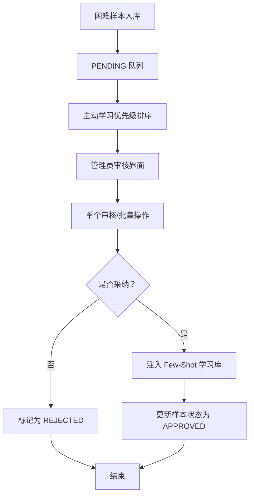

**图表来源**
- [fallbackApproval.ts:24-175](file://server/routes/fallbackApproval.ts#L24-L175)
- [activeLearning.ts:40-129](file://server/utils/activeLearning.ts#L40-L129)
- [db.ts:729-794](file://server/infra/db.ts#L729-L794)
- [fewShotService.ts:34-64](file://server/utils/fewShotService.ts#L34-L64)

**章节来源**
- [fallbackApproval.ts:24-175](file://server/routes/fallbackApproval.ts#L24-L175)
- [activeLearning.ts:40-129](file://server/utils/activeLearning.ts#L40-L129)
- [db.ts:729-794](file://server/infra/db.ts#L729-L794)
- [fewShotService.ts:34-64](file://server/utils/fewShotService.ts#L34-L64)

### 具体代码示例：复杂查询处理流程
以下以"八源上下文并行构建 + 专家角色路由 + 小模型快速路由 + 多步清洗 + 模板优先 + 多候选表决 + 阶段二解读 + 回退机制 + 中文兜底"为例，列出关键调用路径：
- **八源上下文并行构建**：[liveQuery.ts:220-331](file://server/query/liveQuery.ts#L220-L331)
- **专家角色路由**：[expertPersona.ts:196-212](file://server/llm/expertPersona.ts#L196-L212)
- **小模型快速路由**：[liveQuery.ts:348-357](file://server/query/liveQuery.ts#L348-L357)、[llmClient.ts:456-474](file://server/llm/llmClient.ts#L456-L474)
- **复杂度评估与清洗链**：[analysisChain.ts:97-112](file://server/query/analysisChain.ts#L97-L112)、[analysisChain.ts:268-326](file://server/query/analysisChain.ts#L268-326)
- **模板匹配与确定性 SQL**：[liveQuery.ts:359-393](file://server/query/liveQuery.ts#L359-L393)、[sqlTemplates.ts:42-89](file://server/query/sqlTemplates.ts#L42-L89)
- **多候选并行与多数表决**：[liveQuery.ts:417-454](file://server/query/liveQuery.ts#L417-L454)、[liveQuery.ts:567-594](file://server/query/liveQuery.ts#L567-L594)
- **安全执行与 EXPLAIN 防线**：[sqlExecutor.ts:734-800](file://server/query/sqlExecutor.ts#L734-L800)、[sqlExecutor.ts:531-662](file://server/query/sqlExecutor.ts#L531-L662)
- **阶段二解读与降级**：[liveQuery.ts:673-749](file://server/query/liveQuery.ts#L673-L749)
- **回退机制集成**：[query.ts:294-387](file://server/routes/query.ts#L294-L387)、[fallbackPipeline.ts:47-138](file://server/utils/fallback/fallbackPipeline.ts#L47-L138)
- **人类审批流程**：[fallbackApproval.ts:24-175](file://server/routes/fallbackApproval.ts#L24-L175)、[activeLearning.ts:40-129](file://server/utils/activeLearning.ts#L40-L129)
- **少样本注入**：[fewShotService.ts:34-64](file://server/utils/fewShotService.ts#L34-L64)
- **中文兜底处理**：[liveQueryUtils.ts:247-267](file://server/query/liveQueryUtils.ts#L247-L267)

**章节来源**
- [liveQuery.ts:220-749](file://server/query/liveQuery.ts#L220-L749)
- [expertPersona.ts:196-212](file://server/llm/expertPersona.ts#L196-L212)
- [llmClient.ts:456-474](file://server/llm/llmClient.ts#L456-L474)
- [analysisChain.ts:97-112](file://server/query/analysisChain.ts#L97-L112)
- [analysisChain.ts:268-326](file://server/query/analysisChain.ts#L268-L326)
- [sqlTemplates.ts:42-89](file://server/query/sqlTemplates.ts#L42-L89)
- [sqlExecutor.ts:531-662](file://server/query/sqlExecutor.ts#L531-L662)
- [sqlExecutor.ts:734-800](file://server/query/sqlExecutor.ts#L734-L800)
- [fallbackPipeline.ts:47-138](file://server/utils/fallback/fallbackPipeline.ts#L47-L138)
- [fallbackApproval.ts:24-175](file://server/routes/fallbackApproval.ts#L24-L175)
- [activeLearning.ts:40-129](file://server/utils/activeLearning.ts#L40-L129)
- [fewShotService.ts:34-64](file://server/utils/fewShotService.ts#L34-L64)
- [liveQueryUtils.ts:247-267](file://server/query/liveQueryUtils.ts#L247-L267)

## 依赖关系分析
- liveQuery 依赖：schemaContext（上下文）、queryPlan（M2 计划）、analysisChain（M3 清洗链）、sqlExecutor（安全执行）、sqlTemplates（确定性 SQL）、userQueryLimit（配额）、**新增** fallbackPipeline（回退机制）、**新增** expertPersona（专家角色）、**新增** llmClient（阶段路由）。
- sqlExecutor 依赖：node-sql-parser（AST）、mysql2/pg（驱动）、监控与日志、secretsCrypto（解密）。
- analysisChain 依赖：sqlExecutor（安全执行）、llmClient（复杂度评估/纠错）、db（中间表物化/注册/TTL）。
- schemaContext 依赖：scope（范围/行权）、queryGuard（敏感列）、stateStore（缓存）。
- **新增** fallbackPipeline 依赖：ruleBased（规则策略）、simplerPrompt（简化提示）、db（困难样本存储/审计日志）、fewShotService（少样本注入）。
- **新增** fallbackApproval 依赖：db（样本管理）、activeLearning（优先级排序）、fewShotService（Few-Shot 注入）。
- **新增** expertPersona 依赖：db（角色配置）、缓存机制（60s TTL）。

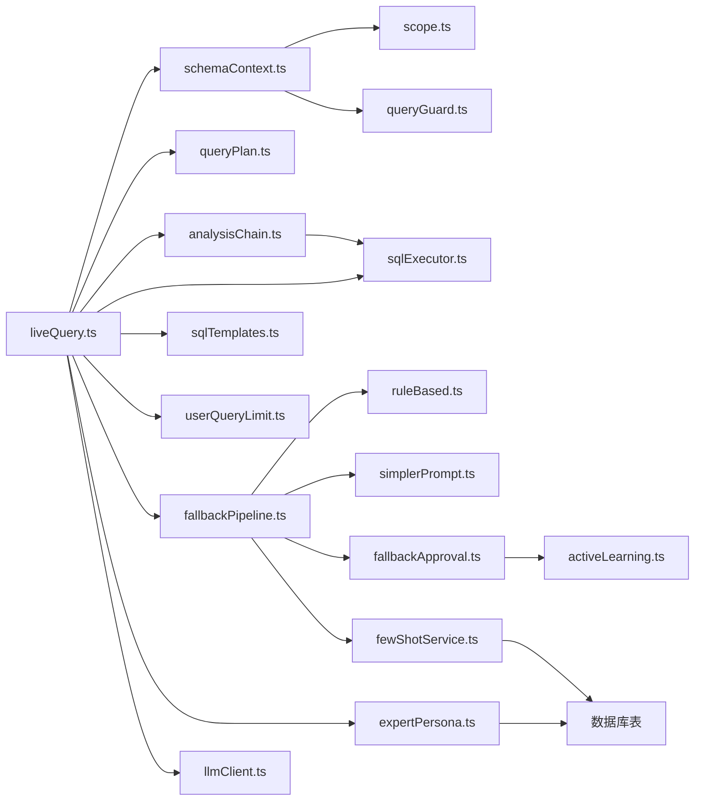

**图表来源**
- [liveQuery.ts:220-749](file://server/query/liveQuery.ts#L220-L749)
- [analysisChain.ts:97-112](file://server/query/analysisChain.ts#L97-L112)
- [schemaContext.ts:108-172](file://server/query/schemaContext.ts#L108-L172)
- [sqlExecutor.ts:734-800](file://server/query/sqlExecutor.ts#L734-L800)
- [fallbackPipeline.ts:13-14](file://server/utils/fallback/fallbackPipeline.ts#L13-L14)
- [fallbackApproval.ts:1-6](file://server/routes/fallbackApproval.ts#L1-L6)
- [activeLearning.ts:8-9](file://server/utils/activeLearning.ts#L8-L9)
- [fewShotService.ts:11-13](file://server/utils/fewShotService.ts#L11-L13)
- [expertPersona.ts:21-22](file://server/llm/expertPersona.ts#L21-L22)

**章节来源**
- [liveQuery.ts:220-749](file://server/query/liveQuery.ts#L220-L749)
- [analysisChain.ts:97-112](file://server/query/analysisChain.ts#L97-L112)
- [schemaContext.ts:108-172](file://server/query/schemaContext.ts#L108-L172)
- [sqlExecutor.ts:734-800](file://server/query/sqlExecutor.ts#L734-L800)
- [fallbackPipeline.ts:13-14](file://server/utils/fallback/fallbackPipeline.ts#L13-L14)
- [fallbackApproval.ts:1-6](file://server/routes/fallbackApproval.ts#L1-L6)
- [activeLearning.ts:8-9](file://server/utils/activeLearning.ts#L8-L9)
- [fewShotService.ts:11-13](file://server/utils/fewShotService.ts#L11-L13)
- [expertPersona.ts:21-22](file://server/llm/expertPersona.ts#L21-L22)

## 性能与复杂度评估
- **八源上下文并行**：七个独立上下文源并发加载，各自失败不阻断主流程，显著提升构建效率
- **复杂度评估优化**：无清洗信号时直接判 simple，避免不必要的 LLM 调用；复杂问题才走 LLM 分类
- **多候选并行**：全并行生成候选，首个成功短路；多候选收集后进行结果集多数表决，提升鲁棒性
- **模板优先**：对常见复杂 SQL（同比/环比/TOP-N/交叉表）采用确定性模板，降低模型负担与偏差
- **小模型快速路由**：简单单表问题走快速模型，提速 3~5 倍；复杂问题强制主模型保证准确性
- **连接池与超时**：按数据源+场景分级池，独立超时档位；MySQL 注入 MAX_EXECUTION_TIME hint 防长事务
- **EXPLAIN 防线**：预估扫描行数超阈值拦截，提示收窄条件，保护业务库性能
- **中间表物化**：复杂清洗结果物化为 ait_* 表，后续查询复用，减少重复计算；TTL 自动清理，配额控制
- **用户配额**：每小时次数上限 + 并发互斥，防止资源滥用
- **回退机制性能**：规则策略无需 LLM 调用，响应迅速；简化提示策略减少上下文大小，降低 Token 消耗；困难样本收集不影响主流程性能
- **主动学习性能**：优先级排序算法 O(n log n)，支持大规模样本高效处理；批量操作优化 SQL 长度限制
- **少样本注入性能**：分批插入优化，每批最多 10 条；bigram 相似度检索限制最近 100 条，提升检索效率
- **中文兜底性能**：标识符映射构建 O(n)，正则替换高效，无法识别的标识符保持原值

**章节来源**
- [liveQuery.ts:220-357](file://server/query/liveQuery.ts#L220-L357)
- [analysisChain.ts:97-112](file://server/query/analysisChain.ts#L97-L112)
- [sqlTemplates.ts:42-89](file://server/query/sqlTemplates.ts#L42-L89)
- [sqlExecutor.ts:531-662](file://server/query/sqlExecutor.ts#L531-L662)
- [analysisChain.ts:388-411](file://server/query/analysisChain.ts#L388-L411)
- [userQueryLimit.ts:23-68](file://server/infra/userQueryLimit.ts#L23-L68)
- [fallbackPipeline.ts:66-113](file://server/utils/fallback/fallbackPipeline.ts#L66-L113)
- [activeLearning.ts:40-129](file://server/utils/activeLearning.ts#L40-L129)
- [fewShotService.ts:71-109](file://server/utils/fewShotService.ts#L71-L109)
- [liveQueryUtils.ts:247-267](file://server/query/liveQueryUtils.ts#L247-L267)

## 故障排查指南
- SQL 被拒绝：检查是否包含危险关键字、是否引用了不在白名单的表、是否涉及敏感列；查看 executeSafeSql 返回 reason
- EXPLAIN 拦截：根据提示增加时间范围、部门或维度筛选；必要时调整 SQL_EXPLAIN_MAX_ROWS
- 中间表未生效：确认 ait_* 表是否已注册且未过期；检查 getRegisteredAitNames 与 cleanupExpiredIntermediateTables
- 用户配额超限：检查 USER_QUERY_RATE_MAX 与当前窗口计数；确认并发锁是否被占用
- 模板未命中：检查 AVAILABLE_TEMPLATES 与 validateTemplateParams；确认 LLM 输出是否符合契约
- 阶段二解读失败：查看 buildFallbackAnalysis 降级逻辑；确认 stats/sample 是否正确传入
- **新增** 八源上下文故障：检查各上下文源加载是否成功，确认 token 预算是否合理，验证外部知识库连接状态
- **新增** 专家角色故障：检查 expert_personas 表配置是否正确，确认关键词匹配逻辑，验证角色优先级设置
- **新增** 小模型路由故障：检查 LLM_SQL_ROUTE_MAX_TABLES 环境变量配置，确认快速模型可用性，验证熔断机制状态
- **新增** 中文兜底故障：检查 schema 中中文描述配置，确认标识符映射构建是否正常，验证替换逻辑正确性
- **新增** 回退机制故障：检查 adversarial_samples 表是否有新记录；查看 fallback_audit_log 表中的策略使用情况；确认规则策略的关键词匹配是否正常
- **新增** 人类审批故障：检查样本状态流转是否正确；确认 activeLearning 优先级排序是否正常工作；验证 Few-Shot 注入是否成功
- **新增** 少样本注入故障：检查 few_shot_examples 表结构是否正确；确认注入批次是否成功；验证 bigram 相似度检索是否正常工作

**章节来源**
- [sqlExecutor.ts:291-387](file://server/query/sqlExecutor.ts#L291-L387)
- [sqlExecutor.ts:531-662](file://server/query/sqlExecutor.ts#L531-L662)
- [analysisChain.ts:331-384](file://server/query/analysisChain.ts#L331-L384)
- [analysisChain.ts:388-411](file://server/query/analysisChain.ts#L388-L411)
- [userQueryLimit.ts:23-68](file://server/infra/userQueryLimit.ts#L23-L68)
- [sqlTemplates.ts:91-119](file://server/query/sqlTemplates.ts#L91-L119)
- [liveQuery.ts:673-749](file://server/query/liveQuery.ts#L673-L749)
- [db.ts:729-794](file://server/infra/db.ts#L729-L794)
- [fallbackApproval.ts:24-175](file://server/routes/fallbackApproval.ts#L24-L175)
- [activeLearning.ts:40-129](file://server/utils/activeLearning.ts#L40-L129)
- [fewShotService.ts:71-109](file://server/utils/fewShotService.ts#L71-L109)
- [expertPersona.ts:196-212](file://server/llm/expertPersona.ts#L196-L212)
- [liveQueryUtils.ts:247-267](file://server/query/liveQueryUtils.ts#L247-L267)

## 结论
该查询处理引擎以"安全先行、性能优先、可观测可恢复"为原则，构建了从自然语言到 SQL、从计划到执行、从结果到解读的完整闭环。M3 中间表清洗链有效支撑复杂分析的复用与隔离；SQL 安全执行层提供多层防护与自愈能力；Schema 上下文与权限映射确保列级与行级访问控制；查询计划与模板机制兼顾灵活性与确定性。**新增的八源上下文并行构建、专家角色路由、小模型快速路由、强制中文兜底和三层Fallback自救机制进一步增强了系统的鲁棒性和持续学习能力**。通过并行上下文加载、关键词匹配路由、快速模型分流、中文化兜底和对抗训练闭环，显著提升了复杂查询的处理成功率和用户体验。主动学习优先级排序算法优化了标注队列管理，提高了人工审核效率。少样本注入服务实现了知识的自动沉淀和复用。整体架构在多租户、多数据源、高并发场景下具备良好扩展性与稳定性。

## 附录：关键流程时序图

### 复杂查询端到端时序（含八源上下文、专家角色、快速路由与回退机制）
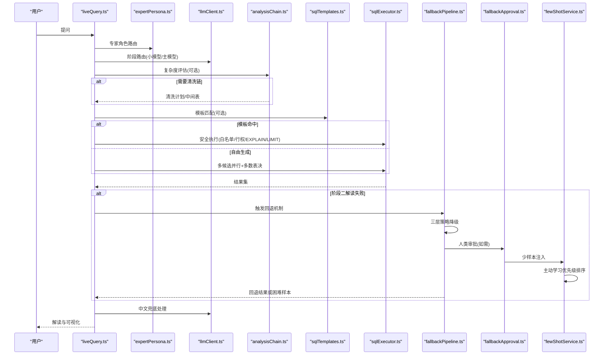

**图表来源**
- [liveQuery.ts:220-749](file://server/query/liveQuery.ts#L220-L749)
- [expertPersona.ts:196-212](file://server/llm/expertPersona.ts#L196-L212)
- [llmClient.ts:456-474](file://server/llm/llmClient.ts#L456-L474)
- [analysisChain.ts:97-112](file://server/query/analysisChain.ts#L97-L112)
- [sqlTemplates.ts:359-393](file://server/query/sqlTemplates.ts#L359-L393)
- [sqlExecutor.ts:734-800](file://server/query/sqlExecutor.ts#L734-L800)
- [fallbackPipeline.ts:47-138](file://server/utils/fallback/fallbackPipeline.ts#L47-L138)
- [fallbackApproval.ts:24-175](file://server/routes/fallbackApproval.ts#L24-L175)
- [fewShotService.ts:34-64](file://server/utils/fewShotService.ts#L34-L64)
- [activeLearning.ts:40-129](file://server/utils/activeLearning.ts#L40-L129)

### 回退机制三层策略流程图

**图表来源**
- [fallbackPipeline.ts:66-113](file://server/utils/fallback/fallbackPipeline.ts#L66-L113)
- [ruleBased.ts:122-161](file://server/utils/fallbackStrategies/ruleBased.ts#L122-L161)
- [simplerPrompt.ts:87-155](file://server/utils/fallbackStrategies/simplerPrompt.ts#L87-L155)
- [fallbackApproval.ts:24-175](file://server/routes/fallbackApproval.ts#L24-L175)
- [fewShotService.ts:34-64](file://server/utils/fewShotService.ts#L34-L64)
- [activeLearning.ts:40-129](file://server/utils/activeLearning.ts#L40-L129)