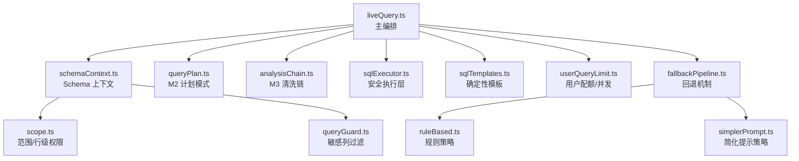
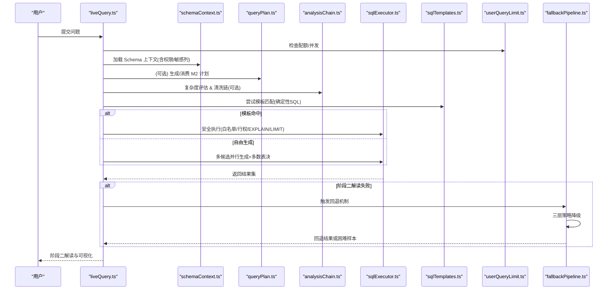
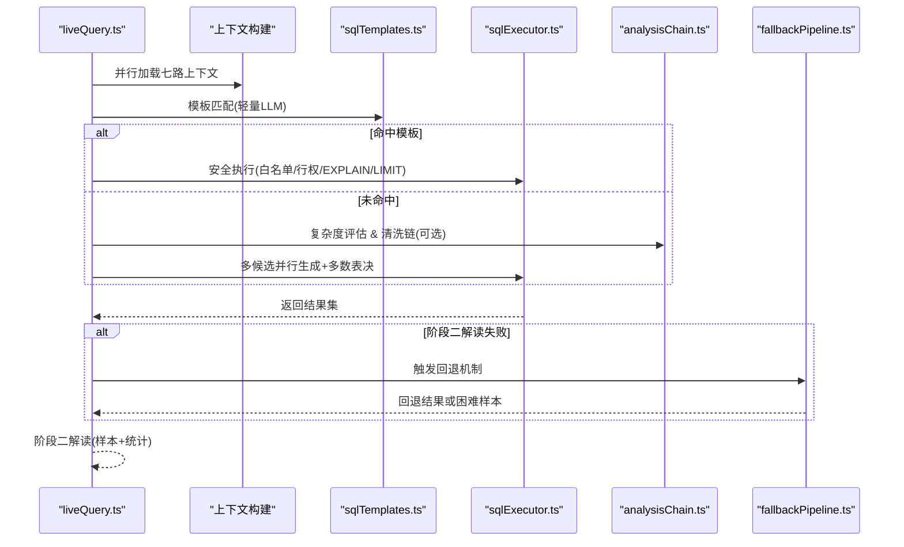
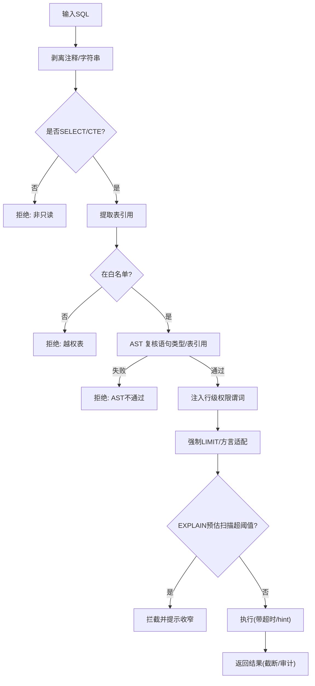
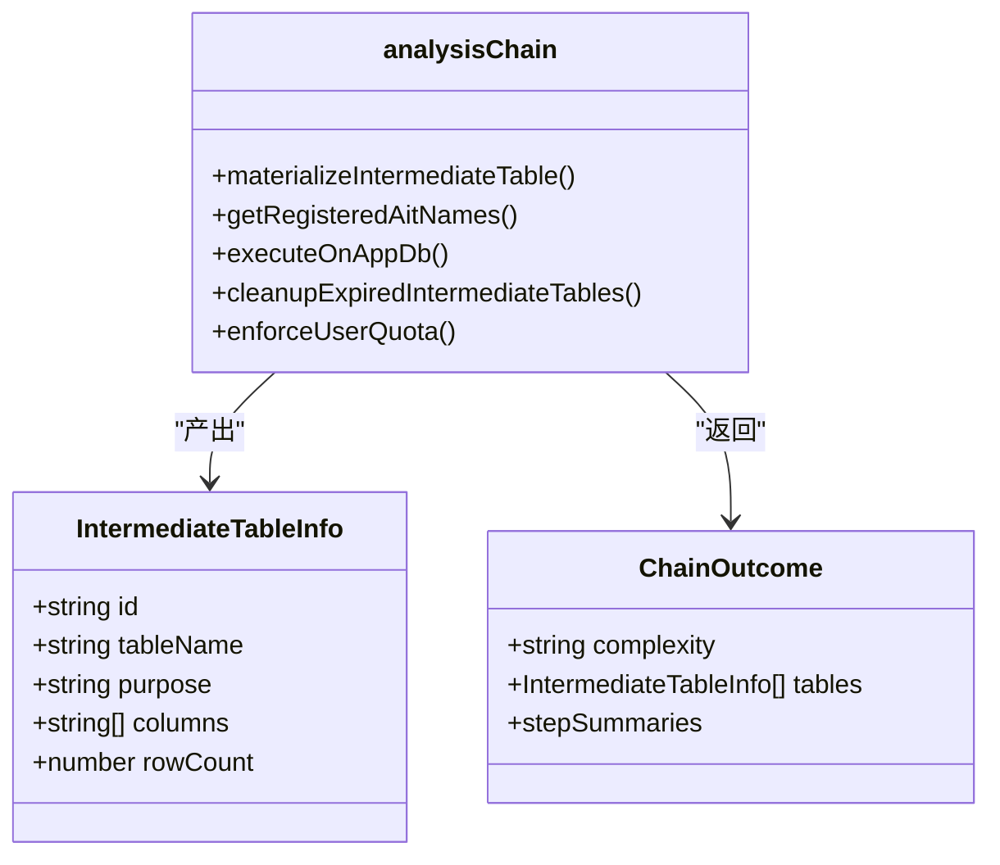
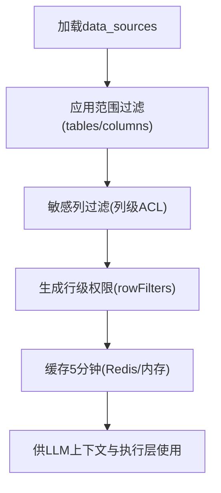
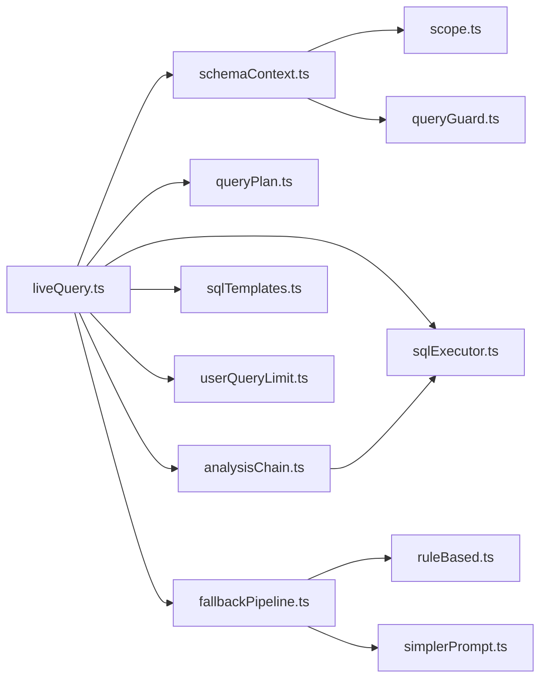
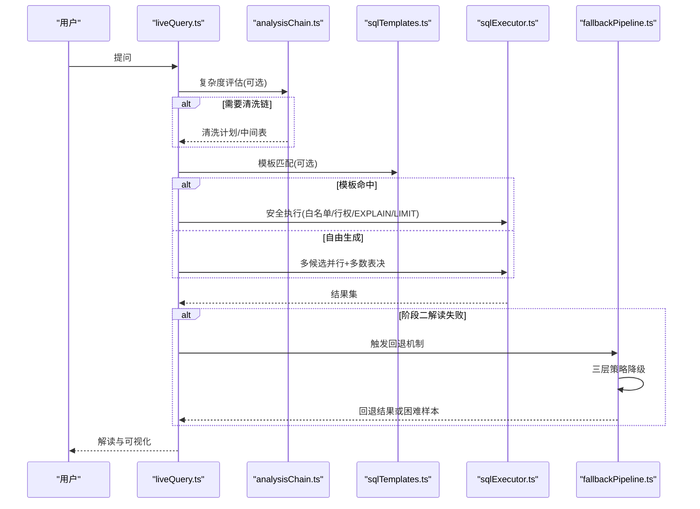
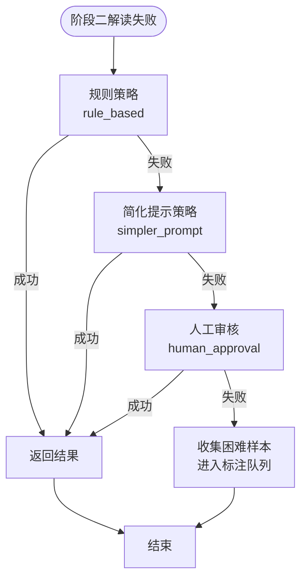

# 查询处理引擎

<cite>
**本文引用的文件**
- [analysisChain.ts](file://server/query/analysisChain.ts)
- [sqlExecutor.ts](file://server/query/sqlExecutor.ts)
- [schemaContext.ts](file://server/query/schemaContext.ts)
- [queryPlan.ts](file://server/query/queryPlan.ts)
- [liveQuery.ts](file://server/query/liveQuery.ts)
- [scope.ts](file://server/query/scope.ts)
- [queryGuard.ts](file://server/query/queryGuard.ts)
- [userQueryLimit.ts](file://server/infra/userQueryLimit.ts)
- [sqlTemplates.ts](file://server/query/sqlTemplates.ts)
- [fallbackPipeline.ts](file://server/utils/fallback/fallbackPipeline.ts)
- [ruleBased.ts](file://server/utils/fallbackStrategies/ruleBased.ts)
- [simplerPrompt.ts](file://server/utils/fallbackStrategies/simplerPrompt.ts)
- [types.ts](file://server/utils/fallback/types.ts)
- [db.ts](file://server/infra/db.ts)
- [query.ts](file://server/routes/query.ts)
</cite>

## 更新摘要
**变更内容**
- 新增 NL2SQL 回退对抗训练机制，包含三层策略降级（rule_based → simpler_prompt → human_approval）
- 新增对抗样本数据库表（adversarial_samples）和回退审计日志表（fallback_audit_log）
- 增强查询处理管道集成，在阶段二解读失败时自动触发回退机制
- 添加困难样本自动收集与人工标注流程

## 目录
1. [简介](#简介)
2. [项目结构](#项目结构)
3. [核心组件](#核心组件)
4. [架构总览](#架构总览)
5. [详细组件分析](#详细组件分析)
6. [依赖关系分析](#依赖关系分析)
7. [性能与复杂度评估](#性能与复杂度评估)
8. [故障排查指南](#故障排查指南)
9. [结论](#结论)
10. [附录：关键流程时序图](#附录：关键流程时序图)

## 简介
本文件面向"智能问数据分析系统"的查询处理引擎，系统性阐述 M3 中间表清洗链、自然语言转 SQL 的完整流程、SQL 执行安全约束、查询计划优化（中间表物化、TTL、用户配额）、Schema 上下文管理（元数据提取、权限映射、列级访问控制），以及新增的 NL2SQL 回退对抗训练机制。目标是帮助读者在不深入源码的情况下理解整体设计，同时为二次开发提供精确的文件定位与调用路径。

## 项目结构
查询处理引擎位于 server/query 目录下，围绕"上下文构建 → 计划生成 → 安全执行 → 结果解读"的主线组织，新增的回退机制位于 server/utils/fallback 目录：
- 上下文与权限：schemaContext、scope、queryGuard
- 计划与模板：queryPlan、sqlTemplates
- 执行与安全：sqlExecutor
- 编排与链路：liveQuery
- 中间表与清洗链：analysisChain
- 用户配额：userQueryLimit（infra）
- **新增** 回退机制：fallbackPipeline、ruleBased、simplerPrompt

**图表来源**
- [liveQuery.ts:189-330](file://server/query/liveQuery.ts#L189-L330)
- [fallbackPipeline.ts:16-138](file://server/utils/fallback/fallbackPipeline.ts#L16-L138)
- [ruleBased.ts:122-161](file://server/utils/fallbackStrategies/ruleBased.ts#L122-L161)
- [simplerPrompt.ts:87-155](file://server/utils/fallbackStrategies/simplerPrompt.ts#L87-L155)

**章节来源**
- [liveQuery.ts:189-330](file://server/query/liveQuery.ts#L189-L330)
- [fallbackPipeline.ts:16-138](file://server/utils/fallback/fallbackPipeline.ts#L16-L138)
- [ruleBased.ts:122-161](file://server/utils/fallbackStrategies/ruleBased.ts#L122-L161)
- [simplerPrompt.ts:87-155](file://server/utils/fallbackStrategies/simplerPrompt.ts#L87-L155)

## 核心组件
- 自然语言转 SQL 编排（liveQuery）：并行构建七路上下文，模板优先命中，多候选并行生成与多数表决，失败回喂 LLM 重试，EXPLAIN 防线拦截后收窄一次。
- SQL 安全执行层（sqlExecutor）：SELECT-only、表白名单、AST 复核、行级权限注入、强制 LIMIT、超时、EXPLAIN 扫描量防护、连接池分级与场景化超时。
- M3 中间表清洗链（analysisChain）：复杂度评估 → 多步清洗计划 → 源库 SELECT 安全执行 → 应用库物理中间表物化（ait_*）→ TTL 清理与用户配额。
- Schema 上下文（schemaContext + scope + queryGuard）：加载 schema → 范围过滤 → 敏感列剔除 → 摘要生成 → 缓存；导出 rowFilters 供执行层 AST 注入。
- 查询计划（queryPlan）：LLM 生成可批准的分析计划（M2），一次性消费防重放，支持 Redis 持久化。
- 确定性模板（sqlTemplates）：对复杂 SQL 采用"模板选择 + 参数填充"，服务端确定性拼装，零偏差兜底。
- 用户配额（userQueryLimit）：每小时次数上限 + 同用户并发互斥，内存/Redis 双实现。
- **新增** 回退对抗训练机制（fallbackPipeline）：三层策略降级，困难样本自动收集，人工标注流程。

**章节来源**
- [liveQuery.ts:189-749](file://server/query/liveQuery.ts#L189-L749)
- [sqlExecutor.ts:1-832](file://server/query/sqlExecutor.ts#L1-L832)
- [analysisChain.ts:1-411](file://server/query/analysisChain.ts#L1-L411)
- [schemaContext.ts:1-172](file://server/query/schemaContext.ts#L1-L172)
- [scope.ts:1-101](file://server/query/scope.ts#L1-L101)
- [queryGuard.ts:1-101](file://server/query/queryGuard.ts#L1-L101)
- [queryPlan.ts:1-184](file://server/query/queryPlan.ts#L1-L184)
- [sqlTemplates.ts:1-119](file://server/query/sqlTemplates.ts#L1-L119)
- [userQueryLimit.ts:1-98](file://server/infra/userQueryLimit.ts#L1-L98)
- [fallbackPipeline.ts:1-138](file://server/utils/fallback/fallbackPipeline.ts#L1-L138)

## 架构总览
下图展示从用户提问到结果解读的端到端流程，以及各安全与优化环节的位置，包括新增的回退机制。

**图表来源**
- [liveQuery.ts:189-749](file://server/query/liveQuery.ts#L189-L749)
- [schemaContext.ts:108-172](file://server/query/schemaContext.ts#L108-L172)
- [queryPlan.ts:56-100](file://server/query/queryPlan.ts#L56-L100)
- [analysisChain.ts:97-112](file://server/query/analysisChain.ts#L97-L112)
- [sqlExecutor.ts:734-800](file://server/query/sqlExecutor.ts#L734-L800)
- [sqlTemplates.ts:359-393](file://server/query/sqlTemplates.ts#L359-L393)
- [userQueryLimit.ts:23-68](file://server/infra/userQueryLimit.ts#L23-L68)
- [fallbackPipeline.ts:47-138](file://server/utils/fallback/fallbackPipeline.ts#L47-L138)

## 详细组件分析

### NL2SQL 回退对抗训练机制（新增）
**更新** 新增完整的三层策略降级机制，用于处理阶段二解读失败的场景。

- 三层策略降级：
  - rule_based：基于规则的快速响应，适用于简单时间范围和聚合查询
  - simpler_prompt：简化提示词 + Few-Shot 示例，提高复杂查询成功率
  - human_approval：人工审核介入，创建标注任务进行修正
- 困难样本收集：所有失败的查询自动记录为 Hard Negative，用于后续对抗训练
- 审计日志：记录每次回退决策的策略使用、响应延迟等指标
- 数据库表结构：adversarial_samples 表和 fallback_audit_log 表

**图表来源**
- [fallbackPipeline.ts:66-113](file://server/utils/fallback/fallbackPipeline.ts#L66-L113)
- [ruleBased.ts:122-161](file://server/utils/fallbackStrategies/ruleBased.ts#L122-L161)
- [simplerPrompt.ts:87-155](file://server/utils/fallbackStrategies/simplerPrompt.ts#L87-L155)

**章节来源**
- [fallbackPipeline.ts:1-138](file://server/utils/fallback/fallbackPipeline.ts#L1-L138)
- [ruleBased.ts:1-161](file://server/utils/fallbackStrategies/ruleBased.ts#L1-L161)
- [simplerPrompt.ts:1-155](file://server/utils/fallbackStrategies/simplerPrompt.ts#L1-L155)
- [types.ts:1-99](file://server/utils/fallback/types.ts#L1-L99)
- [db.ts:729-765](file://server/infra/db.ts#L729-L765)

### M3 中间表清洗链（analysisChain）
- 复杂度评估：基于启发式信号与 LLM 分类，决定是否启用多步清洗；无信号时快速判 simple，减少 LLM 开销。
- 多步清洗计划：每步为针对源表的 SELECT，禁止引用敏感字段；失败时携带错误让 LLM 自纠一次。
- 物化中间表：在应用库创建 ait_* 物理表，写入前剔除敏感列，按列类型推断批量写入；注册至中间表元数据表，带 TTL。
- 引用校验：最终 SQL 若仅引用已注册的 ait_*，改在应用库执行，严格白名单校验与单条 SELECT 限制。
- TTL 清理：定时任务清理过期中间表及注册条目。
- 用户配额：每用户最多 N 张中间表，超出删除最旧。

**图表来源**
- [analysisChain.ts:97-112](file://server/query/analysisChain.ts#L97-L112)
- [analysisChain.ts:138-156](file://server/query/analysisChain.ts#L138-L156)
- [analysisChain.ts:218-253](file://server/query/analysisChain.ts#L218-253)
- [analysisChain.ts:268-326](file://server/query/analysisChain.ts#L268-326)
- [analysisChain.ts:331-384](file://server/query/analysisChain.ts#L331-384)
- [analysisChain.ts:388-411](file://server/query/analysisChain.ts#L388-L411)

**章节来源**
- [analysisChain.ts:1-411](file://server/query/analysisChain.ts#L1-L411)

### 自然语言转 SQL 的完整流程（liveQuery）
- 上下文构建：few-shot、知识库 RAG、外部知识、指标、反例、个人沉淀、铁律规则，全部并行加载并按 token 预算裁剪。
- 模板优先：先尝试模板匹配，命中则确定性拼装 SQL，未命中再自由生成。
- 多候选并行：根据复杂度决定候选数，首个成功即短路；多候选收集后进行结果集多数表决择优。
- 安全执行：通过 sqlExecutor 进行 SELECT-only、白名单、AST 复核、行级权限注入、LIMIT、EXPLAIN 防护。
- 中间表引用：若最终 SQL 仅引用 ait_*，改在应用库执行，严格白名单校验。
- 阶段二解读：真实结果采样 + 列统计回喂 LLM 生成解读，异常时规则降级。
- **新增** 回退机制：阶段二解读失败时自动触发三层策略降级。

**图表来源**
- [liveQuery.ts:220-330](file://server/query/liveQuery.ts#L220-L330)
- [liveQuery.ts:359-393](file://server/query/liveQuery.ts#L359-L393)
- [liveQuery.ts:396-620](file://server/query/liveQuery.ts#L396-L620)
- [sqlExecutor.ts:734-800](file://server/query/sqlExecutor.ts#L734-L800)
- [analysisChain.ts:97-112](file://server/query/analysisChain.ts#L97-L112)
- [fallbackPipeline.ts:47-138](file://server/utils/fallback/fallbackPipeline.ts#L47-L138)

**章节来源**
- [liveQuery.ts:189-749](file://server/query/liveQuery.ts#L189-L749)

### SQL 执行器的安全约束机制（sqlExecutor）
- 只读保障：仅允许 SELECT 开头或 WITH 开头的 CTE 查询；拒绝 INTO、DDL、危险关键字。
- 表白名单：基于 scope 过滤后的 Schema 表名集合，AST 复核再次确认。
- 敏感列拒绝：裸列名整词匹配，命中即拒绝。
- 行级权限：AST 注入 WHERE 谓词，覆盖子查询/UNION/CTE 内真实表引用。
- 强制 LIMIT：无 LIMIT 追加；有 LIMIT 则 clamp 到 MAX_ROWS；PG/MySQL 方言差异兼容。
- EXPLAIN 防线：预估扫描行数超阈值拦截，提示收窄条件；EXPLAIN 失败 fail-open 放行但埋点。
- 连接池与超时：按数据源+场景分级池，独立超时档位；MySQL 注入 MAX_EXECUTION_TIME hint 防长事务。
- 自愈入口：校验失败时可调用 LLM 纠偏重试一次（统一审计出口）。

**图表来源**
- [sqlExecutor.ts:291-387](file://server/query/sqlExecutor.ts#L291-L387)
- [sqlExecutor.ts:396-489](file://server/query/sqlExecutor.ts#L396-L489)
- [sqlExecutor.ts:531-662](file://server/query/sqlExecutor.ts#L531-L662)
- [sqlExecutor.ts:686-726](file://server/query/sqlExecutor.ts#L686-L726)
- [sqlExecutor.ts:734-800](file://server/query/sqlExecutor.ts#L734-L800)

**章节来源**
- [sqlExecutor.ts:1-832](file://server/query/sqlExecutor.ts#L1-L832)

### 查询计划优化策略（中间表物化、TTL、用户配额）
- 中间表物化：将清洗结果落库为 ait_* 物理表，后续最终 SQL 可直接引用，避免重复计算。
- TTL 管理：中间表注册表记录 expires_at，定时任务清理过期表与条目，释放存储。
- 用户配额：每用户最多 N 张中间表，超出删除最旧；写前强制校验，防止资源滥用。
- 应用库执行：仅引用已注册中间表的 SELECT 在应用库执行，严格白名单与单语句限制。

**图表来源**
- [analysisChain.ts:218-253](file://server/query/analysisChain.ts#L218-253)
- [analysisChain.ts:331-384](file://server/query/analysisChain.ts#L331-384)
- [analysisChain.ts:388-411](file://server/query/analysisChain.ts#L388-L411)
- [analysisChain.ts:192-212](file://server/query/analysisChain.ts#L192-L212)

**章节来源**
- [analysisChain.ts:192-253](file://server/query/analysisChain.ts#L192-L253)
- [analysisChain.ts:331-411](file://server/query/analysisChain.ts#L331-L411)

### Schema 上下文管理机制（元数据提取、权限映射、列级访问控制）
- 元数据提取：从 data_sources 读取 schema_json、scope_json、status、type、allow_introspection、config_json。
- 权限映射：applyDataScope 按 tables/columns 过滤；rowFiltersByTableName 生成 tableId→实际表名的行级权限映射。
- 列级访问控制：filterSensitiveColumns 剔除疑似敏感列（密码/密钥/身份证等），返回 removed 清单用于执行层二次拦截。
- 缓存与失效：5 分钟 TTL 缓存，支持 Redis 跨实例共享；配置变更后 invalidateSchemaCache 广播清理。

**图表来源**
- [schemaContext.ts:108-172](file://server/query/schemaContext.ts#L108-L172)
- [scope.ts:28-101](file://server/query/scope.ts#L28-L101)
- [queryGuard.ts:71-101](file://server/query/queryGuard.ts#L71-L101)

**章节来源**
- [schemaContext.ts:108-172](file://server/query/schemaContext.ts#L108-L172)
- [scope.ts:28-101](file://server/query/scope.ts#L28-L101)
- [queryGuard.ts:71-101](file://server/query/queryGuard.ts#L71-L101)

### 具体代码示例：复杂查询处理流程
以下以"多步清洗 + 模板优先 + 多候选表决 + 阶段二解读 + 回退机制"为例，列出关键调用路径：
- 复杂度评估与清洗链：[analysisChain.ts:97-112](file://server/query/analysisChain.ts#L97-L112)、[analysisChain.ts:268-326](file://server/query/analysisChain.ts#L268-L326)
- 模板匹配与确定性 SQL：[liveQuery.ts:359-393](file://server/query/liveQuery.ts#L359-L393)、[sqlTemplates.ts:42-89](file://server/query/sqlTemplates.ts#L42-L89)
- 多候选并行与多数表决：[liveQuery.ts:417-454](file://server/query/liveQuery.ts#L417-L454)、[liveQuery.ts:567-594](file://server/query/liveQuery.ts#L567-L594)
- 安全执行与 EXPLAIN 防线：[sqlExecutor.ts:734-800](file://server/query/sqlExecutor.ts#L734-L800)、[sqlExecutor.ts:531-662](file://server/query/sqlExecutor.ts#L531-L662)
- 阶段二解读与降级：[liveQuery.ts:673-749](file://server/query/liveQuery.ts#L673-L749)
- **新增** 回退机制集成：[query.ts:300](file://server/routes/query.ts#L300)、[fallbackPipeline.ts:47-138](file://server/utils/fallback/fallbackPipeline.ts#L47-L138)

**章节来源**
- [analysisChain.ts:97-112](file://server/query/analysisChain.ts#L97-L112)
- [analysisChain.ts:268-326](file://server/query/analysisChain.ts#L268-L326)
- [liveQuery.ts:359-393](file://server/query/liveQuery.ts#L359-L393)
- [liveQuery.ts:417-454](file://server/query/liveQuery.ts#L417-L454)
- [liveQuery.ts:567-594](file://server/query/liveQuery.ts#L567-L594)
- [sqlExecutor.ts:531-662](file://server/query/sqlExecutor.ts#L531-L662)
- [sqlExecutor.ts:734-800](file://server/query/sqlExecutor.ts#L734-L800)
- [sqlTemplates.ts:42-89](file://server/query/sqlTemplates.ts#L42-L89)
- [liveQuery.ts:673-749](file://server/query/liveQuery.ts#L673-L749)
- [query.ts:300](file://server/routes/query.ts#L300)
- [fallbackPipeline.ts:47-138](file://server/utils/fallback/fallbackPipeline.ts#L47-L138)

## 依赖关系分析
- liveQuery 依赖：schemaContext（上下文）、queryPlan（M2 计划）、analysisChain（M3 清洗链）、sqlExecutor（安全执行）、sqlTemplates（确定性 SQL）、userQueryLimit（配额）、**新增** fallbackPipeline（回退机制）。
- sqlExecutor 依赖：node-sql-parser（AST）、mysql2/pg（驱动）、监控与日志、secretsCrypto（解密）。
- analysisChain 依赖：sqlExecutor（安全执行）、llmClient（复杂度评估/纠错）、db（中间表物化/注册/TTL）。
- schemaContext 依赖：scope（范围/行权）、queryGuard（敏感列）、stateStore（缓存）。
- **新增** fallbackPipeline 依赖：ruleBased（规则策略）、simplerPrompt（简化提示）、db（困难样本存储/审计日志）。

**图表来源**
- [liveQuery.ts:189-330](file://server/query/liveQuery.ts#L189-L330)
- [analysisChain.ts:97-112](file://server/query/analysisChain.ts#L97-L112)
- [schemaContext.ts:108-172](file://server/query/schemaContext.ts#L108-L172)
- [sqlExecutor.ts:734-800](file://server/query/sqlExecutor.ts#L734-L800)
- [fallbackPipeline.ts:13-14](file://server/utils/fallback/fallbackPipeline.ts#L13-L14)

**章节来源**
- [liveQuery.ts:189-330](file://server/query/liveQuery.ts#L189-L330)
- [analysisChain.ts:97-112](file://server/query/analysisChain.ts#L97-L112)
- [schemaContext.ts:108-172](file://server/query/schemaContext.ts#L108-L172)
- [sqlExecutor.ts:734-800](file://server/query/sqlExecutor.ts#L734-L800)
- [fallbackPipeline.ts:13-14](file://server/utils/fallback/fallbackPipeline.ts#L13-L14)

## 性能与复杂度评估
- 复杂度评估优化：无清洗信号时直接判 simple，避免不必要的 LLM 调用；复杂问题才走 LLM 分类。
- 多候选并行：全并行生成候选，首个成功短路；多候选收集后进行结果集多数表决，提升鲁棒性。
- 模板优先：对常见复杂 SQL（同比/环比/TOP-N/交叉表）采用确定性模板，降低模型负担与偏差。
- 连接池与超时：按数据源+场景分级池，独立超时档位；MySQL 注入 MAX_EXECUTION_TIME hint 防长事务。
- EXPLAIN 防线：预估扫描行数超阈值拦截，提示收窄条件，保护业务库性能。
- 中间表物化：复杂清洗结果物化为 ait_* 表，后续查询复用，减少重复计算；TTL 自动清理，配额控制。
- 用户配额：每小时次数上限 + 并发互斥，防止资源滥用。
- **新增** 回退机制性能：规则策略无需 LLM 调用，响应迅速；简化提示策略减少上下文大小，降低 Token 消耗；困难样本收集不影响主流程性能。

**章节来源**
- [analysisChain.ts:97-112](file://server/query/analysisChain.ts#L97-L112)
- [liveQuery.ts:417-454](file://server/query/liveQuery.ts#L417-L454)
- [sqlTemplates.ts:42-89](file://server/query/sqlTemplates.ts#L42-L89)
- [sqlExecutor.ts:531-662](file://server/query/sqlExecutor.ts#L531-L662)
- [analysisChain.ts:388-411](file://server/query/analysisChain.ts#L388-L411)
- [userQueryLimit.ts:23-68](file://server/infra/userQueryLimit.ts#L23-L68)
- [fallbackPipeline.ts:66-113](file://server/utils/fallback/fallbackPipeline.ts#L66-L113)

## 故障排查指南
- SQL 被拒绝：检查是否包含危险关键字、是否引用了不在白名单的表、是否涉及敏感列；查看 executeSafeSql 返回 reason。
- EXPLAIN 拦截：根据提示增加时间范围、部门或维度筛选；必要时调整 SQL_EXPLAIN_MAX_ROWS。
- 中间表未生效：确认 ait_* 表是否已注册且未过期；检查 getRegisteredAitNames 与 cleanupExpiredIntermediateTables。
- 用户配额超限：检查 USER_QUERY_RATE_MAX 与当前窗口计数；确认并发锁是否被占用。
- 模板未命中：检查 AVAILABLE_TEMPLATES 与 validateTemplateParams；确认 LLM 输出是否符合契约。
- 阶段二解读失败：查看 buildFallbackAnalysis 降级逻辑；确认 stats/sample 是否正确传入。
- **新增** 回退机制故障：检查 adversarial_samples 表是否有新记录；查看 fallback_audit_log 表中的策略使用情况；确认规则策略的关键词匹配是否正常。

**章节来源**
- [sqlExecutor.ts:291-387](file://server/query/sqlExecutor.ts#L291-L387)
- [sqlExecutor.ts:531-662](file://server/query/sqlExecutor.ts#L531-L662)
- [analysisChain.ts:331-384](file://server/query/analysisChain.ts#L331-384)
- [analysisChain.ts:388-411](file://server/query/analysisChain.ts#L388-L411)
- [userQueryLimit.ts:23-68](file://server/infra/userQueryLimit.ts#L23-L68)
- [sqlTemplates.ts:91-119](file://server/query/sqlTemplates.ts#L91-L119)
- [liveQuery.ts:673-749](file://server/query/liveQuery.ts#L673-L749)
- [db.ts:729-765](file://server/infra/db.ts#L729-L765)

## 结论
该查询处理引擎以"安全先行、性能优先、可观测可恢复"为原则，构建了从自然语言到 SQL、从计划到执行、从结果到解读的完整闭环。M3 中间表清洗链有效支撑复杂分析的复用与隔离；SQL 安全执行层提供多层防护与自愈能力；Schema 上下文与权限映射确保列级与行级访问控制；查询计划与模板机制兼顾灵活性与确定性。**新增的回退对抗训练机制进一步增强了系统的鲁棒性和持续学习能力**，通过三层策略降级和困难样本收集，显著提升了复杂查询的处理成功率。整体架构在多租户、多数据源、高并发场景下具备良好扩展性与稳定性。

## 附录：关键流程时序图

### 复杂查询端到端时序（含清洗链、模板与回退机制）

**图表来源**
- [liveQuery.ts:189-749](file://server/query/liveQuery.ts#L189-L749)
- [analysisChain.ts:97-112](file://server/query/analysisChain.ts#L97-L112)
- [sqlTemplates.ts:359-393](file://server/query/sqlTemplates.ts#L359-L393)
- [sqlExecutor.ts:734-800](file://server/query/sqlExecutor.ts#L734-L800)
- [fallbackPipeline.ts:47-138](file://server/utils/fallback/fallbackPipeline.ts#L47-L138)

### 回退机制三层策略流程图

**图表来源**
- [fallbackPipeline.ts:66-113](file://server/utils/fallback/fallbackPipeline.ts#L66-L113)
- [ruleBased.ts:122-161](file://server/utils/fallbackStrategies/ruleBased.ts#L122-L161)
- [simplerPrompt.ts:87-155](file://server/utils/fallbackStrategies/simplerPrompt.ts#L87-L155)