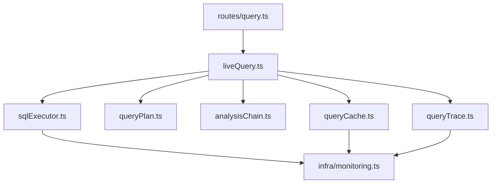
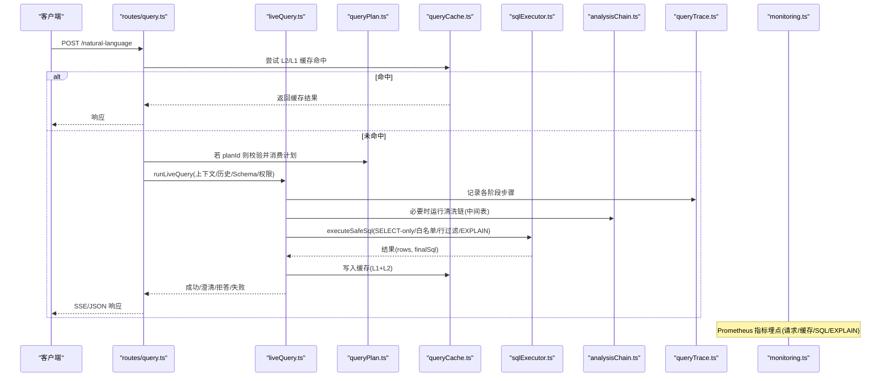
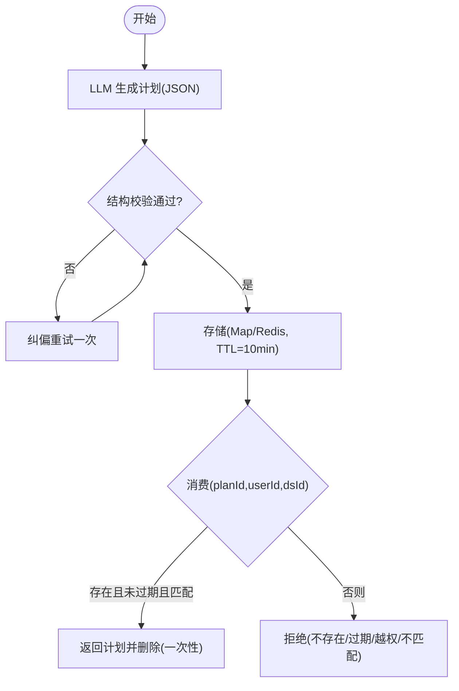
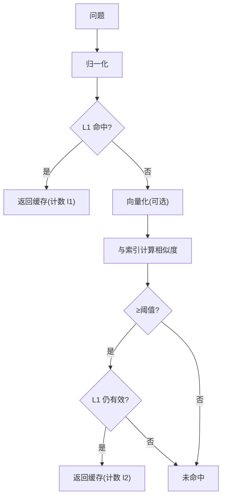
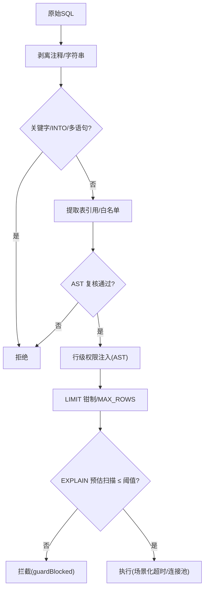
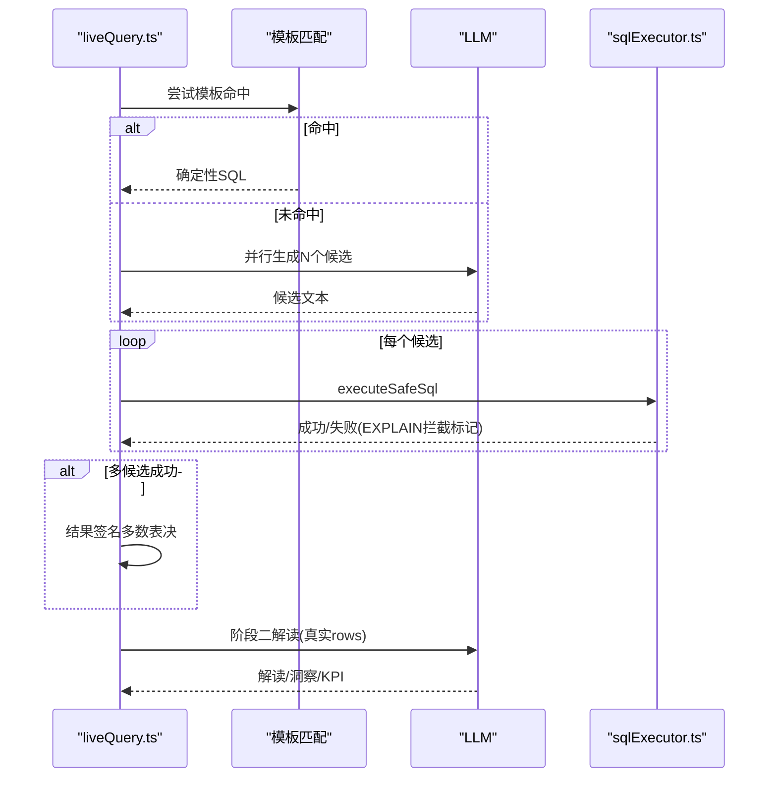
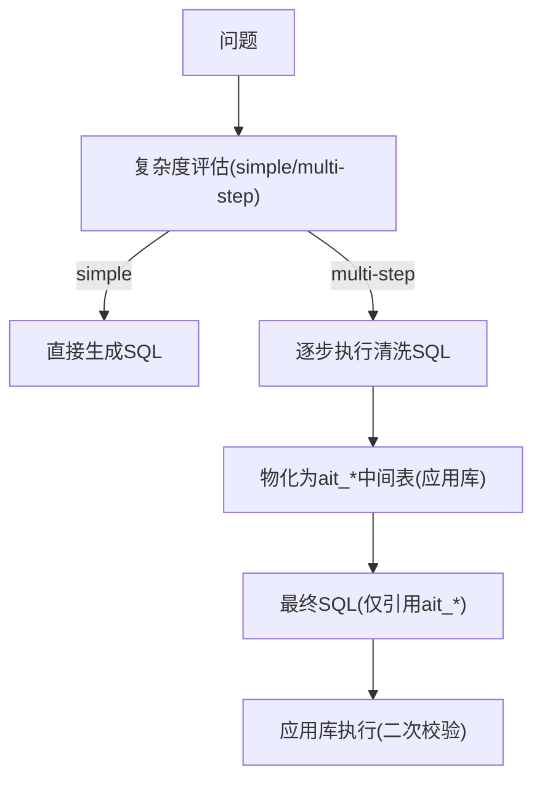
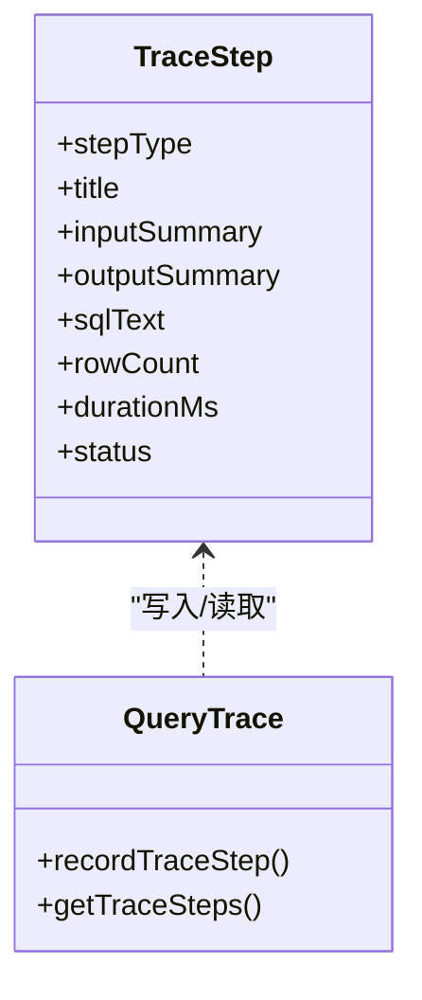
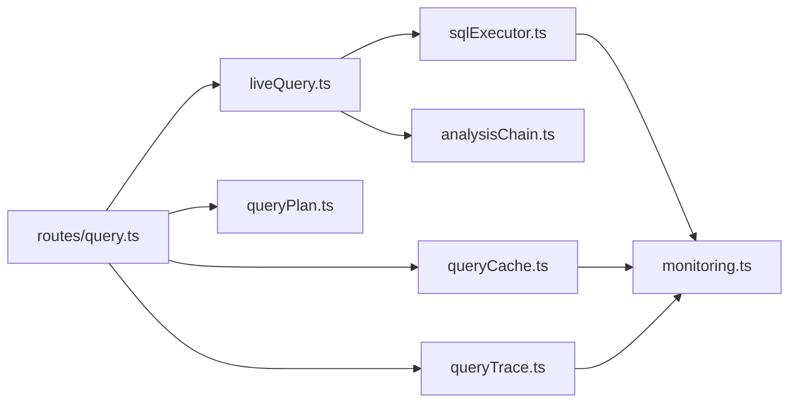

# 查询计划与优化

<cite>
**本文引用的文件**
- [server/query/queryPlan.ts](file://server/query/queryPlan.ts)
- [server/query/queryCache.ts](file://server/query/queryCache.ts)
- [server/query/sqlExecutor.ts](file://server/query/sqlExecutor.ts)
- [server/query/liveQuery.ts](file://server/query/liveQuery.ts)
- [server/query/analysisChain.ts](file://server/query/analysisChain.ts)
- [server/query/queryTrace.ts](file://server/query/queryTrace.ts)
- [server/infra/monitoring.ts](file://server/infra/monitoring.ts)
- [server/routes/query.ts](file://server/routes/query.ts)
</cite>

## 目录
1. [简介](#简介)
2. [项目结构](#项目结构)
3. [核心组件](#核心组件)
4. [架构总览](#架构总览)
5. [详细组件分析](#详细组件分析)
6. [依赖关系分析](#依赖关系分析)
7. [性能考量](#性能考量)
8. [故障排查指南](#故障排查指南)
9. [结论](#结论)
10. [附录](#附录)

## 简介
本文件围绕“查询计划与优化”展开，系统性解析从自然语言问题到可执行 SQL、再到结果解读的完整链路。重点覆盖：
- 查询计划的生成与生命周期管理（计划缓存、TTL、一次性消费）
- 执行路径选择与安全执行（白名单、行级权限、EXPLAIN 防线、超时与限流）
- 中间结果缓存机制（L1 精确匹配 + L2 语义相似度命中）
- 复杂分析的中间表清洗链（M3）
- 查询跟踪与诊断（全链路留痕、指标埋点、瓶颈识别）
- 优化策略（索引建议、查询重写、并行执行、多候选多数表决）

## 项目结构
与查询计划与优化直接相关的模块集中在 server/query 下，配合 infra 监控与 routes 路由编排：
- queryPlan：LLM 生成的分析计划存储与消费（内存 Map 或 Redis），带 TTL 与一次性消费
- queryCache：问数结果语义缓存（L1 精确 + L2 语义），支持进程内 Map 与 Redis
- sqlExecutor：SQL 安全执行层（SELECT-only、表白名单、敏感列拒绝、AST 复核、行级权限注入、EXPLAIN 防线、连接池与场景化超时）
- liveQuery：双阶段真实查询编排（阶段一生成 SQL，阶段二基于真实 rows 生成解读），含模板匹配、多候选并行、Self-Consistency 多数表决
- analysisChain：复杂分析的中间表清洗链（评估→执行→物化→引用校验→应用库执行）
- queryTrace：推导过程留痕（旁路写入，失败不阻断主链路）
- monitoring：Prometheus 指标埋点（请求耗时、缓存命中、SQL 执行耗时、EXPLAIN 防线等）
- routes/query：HTTP 入口，串联鉴权、限流、上下文加载、缓存、计划模式、SSE 事件与追踪

图表来源
- [server/routes/query.ts:47-200](file://server/routes/query.ts#L47-L200)
- [server/query/liveQuery.ts:189-749](file://server/query/liveQuery.ts#L189-L749)
- [server/query/sqlExecutor.ts:734-832](file://server/query/sqlExecutor.ts#L734-L832)
- [server/query/queryPlan.ts:56-100](file://server/query/queryPlan.ts#L56-L100)
- [server/query/analysisChain.ts:269-384](file://server/query/analysisChain.ts#L269-L384)
- [server/query/queryCache.ts:43-90](file://server/query/queryCache.ts#L43-L90)
- [server/query/queryTrace.ts:56-88](file://server/query/queryTrace.ts#L56-L88)
- [server/infra/monitoring.ts:92-133](file://server/infra/monitoring.ts#L92-L133)

章节来源
- [server/routes/query.ts:47-200](file://server/routes/query.ts#L47-L200)
- [server/query/liveQuery.ts:189-749](file://server/query/liveQuery.ts#L189-L749)

## 核心组件
- 查询计划（queryPlan）：由 LLM 产出结构化分析计划（理解、步骤、相关表、复杂度），支持内存 Map 或 Redis 存储，TTL=10 分钟，一次性消费防重放，越权/数据源不匹配拒绝。
- 语义缓存（queryCache）：L1 归一化精确命中 + L2 embedding 相似度命中（阈值默认 0.95），支持进程内 Map 与 Redis；写成功时构建语义索引；失效按数据源前缀清理。
- 安全执行（sqlExecutor）：严格 SELECT-only、表白名单、敏感列拒绝、AST 复核、行级权限 AST 注入、EXPLAIN 预估扫描行数拦截、MySQL MAX_EXECUTION_TIME hint、PG statement_timeout、场景化连接池与超时。
- 双阶段编排（liveQuery）：阶段一生 SQL（模板优先、多候选并行、Self-Consistency 多数表决），阶段二基于真实 rows 生成解读；支持澄清/拒答、自省、铁律规则注入、金额单位换算。
- 中间表清洗链（analysisChain）：复杂度评估→多步清洗→物化为 ait_* 中间表→仅引用中间表的二次安全执行；用户配额、TTL 清理、纠错自愈。
- 追踪与监控（queryTrace + monitoring）：全链路步骤旁路落库；Prometheus 指标覆盖请求、缓存、LLM、SQL 执行、EXPLAIN 防线。

章节来源
- [server/query/queryPlan.ts:13-184](file://server/query/queryPlan.ts#L13-L184)
- [server/query/queryCache.ts:1-254](file://server/query/queryCache.ts#L1-L254)
- [server/query/sqlExecutor.ts:1-832](file://server/query/sqlExecutor.ts#L1-L832)
- [server/query/liveQuery.ts:189-749](file://server/query/liveQuery.ts#L189-L749)
- [server/query/analysisChain.ts:1-411](file://server/query/analysisChain.ts#L1-L411)
- [server/query/queryTrace.ts:1-118](file://server/query/queryTrace.ts#L1-L118)
- [server/infra/monitoring.ts:1-153](file://server/infra/monitoring.ts#L1-L153)

## 架构总览
下图展示一次智能问数的端到端流程，包括计划模式、缓存命中、安全执行、中间表清洗、追踪与监控。

图表来源
- [server/routes/query.ts:47-200](file://server/routes/query.ts#L47-L200)
- [server/query/liveQuery.ts:189-749](file://server/query/liveQuery.ts#L189-L749)
- [server/query/queryPlan.ts:56-100](file://server/query/queryPlan.ts#L56-L100)
- [server/query/queryCache.ts:43-90](file://server/query/queryCache.ts#L43-L90)
- [server/query/sqlExecutor.ts:734-832](file://server/query/sqlExecutor.ts#L734-L832)
- [server/query/analysisChain.ts:269-384](file://server/query/analysisChain.ts#L269-L384)
- [server/query/queryTrace.ts:56-88](file://server/query/queryTrace.ts#L56-L88)
- [server/infra/monitoring.ts:92-133](file://server/infra/monitoring.ts#L92-L133)

## 详细组件分析

### 查询计划：生成、存储与消费
- 生成：调用 LLM 输出结构化 JSON（understanding、steps、relatedTables、complexity），并进行严格结构校验；失败自动纠偏重试一次。
- 存储：内存 Map（惰性清理过期）或 Redis（SETEX + GETDEL 原子一次性消费）；TTL=10 分钟；携带 userId、dataSourceId 防篡改与越权。
- 消费：校验存在性、过期、用户归属、数据源匹配；成功后删除条目，防止重放攻击。

图表来源
- [server/query/queryPlan.ts:116-184](file://server/query/queryPlan.ts#L116-L184)
- [server/query/queryPlan.ts:56-100](file://server/query/queryPlan.ts#L56-L100)

章节来源
- [server/query/queryPlan.ts:13-184](file://server/query/queryPlan.ts#L13-L184)

### 语义缓存：L1 精确 + L2 相似度
- L1：对问题归一化后作为 key，命中即返回；支持进程内 Map 与 Redis；TTL 默认 30 分钟，可配置；容量控制（Map 淘汰最早）。
- L2：将问题向量化，与同数据源（含模型变体）的语义索引计算余弦相似度，≥阈值（默认 0.95）且对应 L1 仍有效才命中；失败 fail-open。
- 失效：数据源变更时按前缀清理缓存与语义索引。

图表来源
- [server/query/queryCache.ts:23-90](file://server/query/queryCache.ts#L23-L90)
- [server/query/queryCache.ts:116-254](file://server/query/queryCache.ts#L116-L254)

章节来源
- [server/query/queryCache.ts:1-254](file://server/query/queryCache.ts#L1-L254)

### 安全执行层：SQL 校验、权限注入与 EXPLAIN 防线
- 校验：只允许 SELECT 单语句；剥离注释/字符串后进行关键字黑名单检查；提取 FROM/JOIN 表名进行白名单校验；AST 复核确保语句类型与表引用合法；敏感列整词匹配拒绝。
- 行级权限：AST 递归包裹派生表，强制注入 WHERE 谓词；CTE 定义内的真实表也需包裹；失败 fail-closed。
- 执行保护：MySQL 注入 MAX_EXECUTION_TIME hint；PG 使用 statement_timeout；统一场景化超时（交互/分析链/导出）；MAX_ROWS 截断；EXPLAIN 预估扫描行数超过阈值则拦截。
- 连接池：按数据源+场景分级缓存；配置变更后失效；容量公式化（DS_POOL_MAX/场景配额）。

图表来源
- [server/query/sqlExecutor.ts:155-387](file://server/query/sqlExecutor.ts#L155-L387)
- [server/query/sqlExecutor.ts:396-489](file://server/query/sqlExecutor.ts#L396-L489)
- [server/query/sqlExecutor.ts:531-662](file://server/query/sqlExecutor.ts#L531-L662)
- [server/query/sqlExecutor.ts:686-726](file://server/query/sqlExecutor.ts#L686-L726)

章节来源
- [server/query/sqlExecutor.ts:1-832](file://server/query/sqlExecutor.ts#L1-L832)

### 双阶段编排：模板优先、多候选并行、Self-Consistency
- 阶段一：优先尝试模板匹配（确定性拼装 SQL），失败则并行生成多个候选；首轮首个候选竞速判定澄清/拒答；数据自省（可选）先轻量执行确认取值再生成最终 SQL。
- 执行：逐候选执行，收集成功候选；多候选时按规范化签名多数表决择优；EXPLAIN 拦截仅给一次收窄自纠错机会。
- 阶段二：真实 rows（采样 + 列统计）回喂 LLM 生成解读；失败降级为规则化解读；空结果集直接给出真实结论。

图表来源
- [server/query/liveQuery.ts:359-628](file://server/query/liveQuery.ts#L359-L628)
- [server/query/liveQuery.ts:673-749](file://server/query/liveQuery.ts#L673-L749)

章节来源
- [server/query/liveQuery.ts:189-749](file://server/query/liveQuery.ts#L189-L749)

### 中间表清洗链（M3）：复杂度评估→物化→引用校验
- 复杂度评估：启发式信号预门控 + LLM 评估；simple 直接生成 SQL；multi-step 进入清洗链。
- 执行与物化：每步 SELECT 经安全执行层执行，结果剔除敏感列后物化为 ait_* 物理表（应用库），注册元数据（TTL=24h，用户配额≤10张）。
- 引用校验：最终 SQL 若仅引用 ait_*，改在应用库执行，二次白名单校验；未注册或非法引用拒绝。
- 清理：定时任务每小时清理过期中间表。

图表来源
- [server/query/analysisChain.ts:47-112](file://server/query/analysisChain.ts#L47-L112)
- [server/query/analysisChain.ts:218-253](file://server/query/analysisChain.ts#L218-L253)
- [server/query/analysisChain.ts:330-384](file://server/query/analysisChain.ts#L330-L384)
- [server/query/analysisChain.ts:388-411](file://server/query/analysisChain.ts#L388-L411)

章节来源
- [server/query/analysisChain.ts:1-411](file://server/query/analysisChain.ts#L1-L411)

### 查询跟踪与诊断：全链路留痕与指标
- 追踪：每个关键步骤（理解、圈表、知识检索、指标命中、自省、计划、中间表、模板匹配、SQL 生成、执行、结果检查、分析）旁路写入 query_trace；失败不阻断主链路；支持按 traceId 回放。
- 指标：Prometheus 埋点覆盖 nl2sql 请求/耗时、缓存命中(l1/l2)、LLM 调用耗时/token、SQL 执行耗时、EXPLAIN 防线状态、HTTP 接口耗时。

图表来源
- [server/query/queryTrace.ts:25-118](file://server/query/queryTrace.ts#L25-L118)
- [server/infra/monitoring.ts:19-133](file://server/infra/monitoring.ts#L19-L133)

章节来源
- [server/query/queryTrace.ts:1-118](file://server/query/queryTrace.ts#L1-L118)
- [server/infra/monitoring.ts:1-153](file://server/infra/monitoring.ts#L1-L153)

## 依赖关系分析
- routes/query 依赖 liveQuery、queryPlan、queryCache、queryTrace、sqlExecutor、schemaContext、auth/rateLimit 等。
- liveQuery 依赖 sqlExecutor、analysisChain、llmClient、schemaLinking、metrics、ironRules、knowledge 等。
- sqlExecutor 依赖 db 连接池、node-sql-parser、secretsCrypto、monitoring。
- queryCache 依赖 stateStore（内存/Redis）、llmClient（embedding）、monitoring。
- analysisChain 依赖 sqlExecutor、db、llmClient。
- queryPlan 依赖 llmClient、stateStore、logger。

图表来源
- [server/routes/query.ts:47-200](file://server/routes/query.ts#L47-L200)
- [server/query/liveQuery.ts:189-749](file://server/query/liveQuery.ts#L189-L749)
- [server/query/sqlExecutor.ts:734-832](file://server/query/sqlExecutor.ts#L734-L832)
- [server/query/queryCache.ts:43-90](file://server/query/queryCache.ts#L43-L90)
- [server/query/queryPlan.ts:56-100](file://server/query/queryPlan.ts#L56-L100)
- [server/query/analysisChain.ts:269-384](file://server/query/analysisChain.ts#L269-L384)
- [server/query/queryTrace.ts:56-88](file://server/query/queryTrace.ts#L56-L88)
- [server/infra/monitoring.ts:92-133](file://server/infra/monitoring.ts#L92-L133)

章节来源
- [server/routes/query.ts:47-200](file://server/routes/query.ts#L47-L200)
- [server/query/liveQuery.ts:189-749](file://server/query/liveQuery.ts#L189-L749)

## 性能考量
- 缓存命中率提升：L1 归一化键 + L2 语义相似度命中（阈值可调），减少昂贵 LLM 调用；缓存 TTL 合理设置（计划 10 分钟，结果 30 分钟）。
- 并行与短路：阶段一多候选并行生成；首个候选竞速判定澄清/拒答；模板命中直接走确定性拼装，零偏差兜底。
- 执行保护：EXPLAIN 防线拦截大扫描；场景化超时与连接池配额避免资源争用；MAX_ROWS 截断防 OOM；MySQL hint 与 PG timeout 双重保障。
- 中间表复用：复杂分析通过 ait_* 中间表复用清洗结果，降低重复计算；用户配额与 TTL 控制内存占用。
- 指标驱动优化：通过 Prometheus 指标观察请求耗时、缓存命中、SQL 执行耗时、EXPLAIN 拦截率，定位瓶颈。

[本节为通用性能指导，无需特定文件引用]

## 故障排查指南
- 计划无效/过期：检查 consumePlan 返回原因（不存在/过期/越权/数据源不匹配）；确认 planId 是否被一次性消费；核对 TTL 与 Redis 键前缀。
- 缓存未命中：确认 normalizeQuestion 归一化逻辑；检查 L2 阈值与 embedding 可用性；查看监测指标 nl2sql_cache_hits_total。
- SQL 被拒绝：查看 validateSelectSql 与 checkAstSafety 返回 reason；确认表白名单、敏感列、关键字黑名单；检查行级权限注入是否失败。
- EXPLAIN 拦截：根据 guardBlocked 提示收窄条件（时间范围、部门、维度）；调整 SQL_EXPLAIN_MAX_ROWS 或场景阈值。
- 中间表失败：检查 repairChainStepSql 纠错结果；确认 ait_* 表是否已注册且未过期；查看 cleanupExpiredIntermediateTables 清理日志。
- 追踪回放：通过 traceId 获取 query_trace 步骤，定位失败环节与耗时分布。

章节来源
- [server/query/queryPlan.ts:73-100](file://server/query/queryPlan.ts#L73-L100)
- [server/query/queryCache.ts:43-90](file://server/query/queryCache.ts#L43-L90)
- [server/query/sqlExecutor.ts:291-387](file://server/query/sqlExecutor.ts#L291-L387)
- [server/query/sqlExecutor.ts:531-662](file://server/query/sqlExecutor.ts#L531-L662)
- [server/query/analysisChain.ts:138-156](file://server/query/analysisChain.ts#L138-L156)
- [server/query/analysisChain.ts:388-411](file://server/query/analysisChain.ts#L388-L411)
- [server/query/queryTrace.ts:96-118](file://server/query/queryTrace.ts#L96-L118)

## 结论
本系统构建了从“计划生成—安全执行—结果解读”的闭环，并通过语义缓存、中间表清洗链、EXPLAIN 防线、多候选 Self-Consistency 等机制实现高可用与高性能。全链路追踪与指标埋点为持续优化提供数据支撑。建议在生产环境：
- 合理配置缓存 TTL 与语义阈值，平衡命中率与准确性
- 调优 EXPLAIN 阈值与场景化超时，兼顾响应时间与稳定性
- 利用追踪回放定位瓶颈，结合指标看板持续优化

[本节为总结性内容，无需特定文件引用]

## 附录
- 关键环境变量参考：
  - QUERY_CACHE_TTL_MINUTES：结果缓存 TTL（分钟）
  - SEMANTIC_CACHE_THRESHOLD：语义缓存相似度阈值
  - DS_POOL_MAX / DS_POOL_INTERACTIVE / DS_POOL_CHAIN / DS_POOL_EXPORT：连接池容量
  - QUERY_TIMEOUT_INTERACTIVE_MS / QUERY_TIMEOUT_CHAIN_MS / QUERY_TIMEOUT_EXPORT_MS：场景化超时
  - SQL_EXPLAIN_MAX_ROWS：EXPLAIN 防线阈值
  - EXPECTED_CONCURRENT_USERS：并发用户估算（用于推导池容量）
  - METRICS_TOKEN：/metrics 访问令牌

[本节为配置参考，无需特定文件引用]