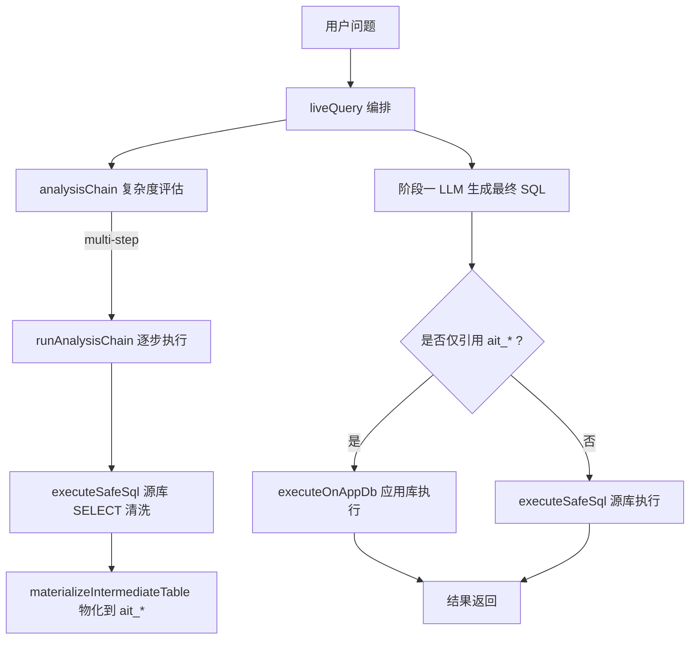
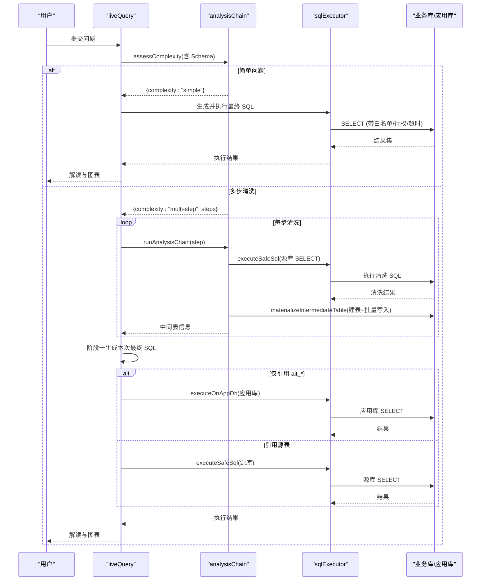
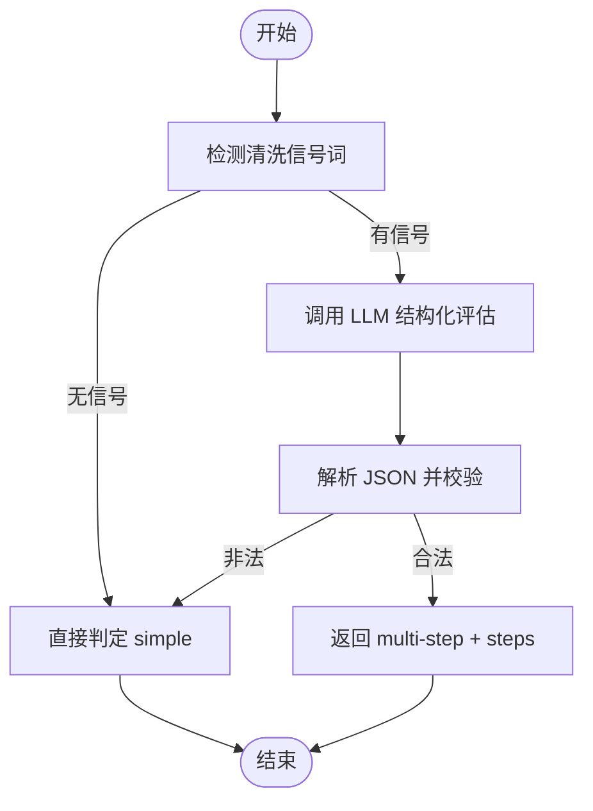
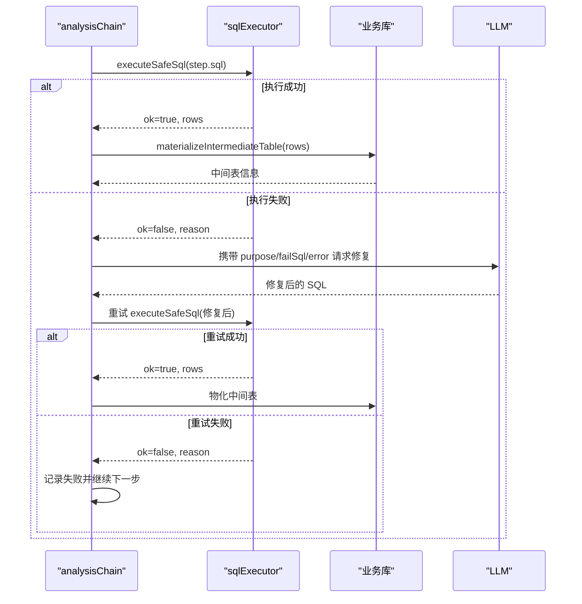
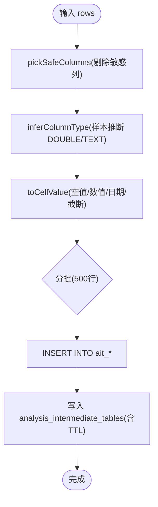
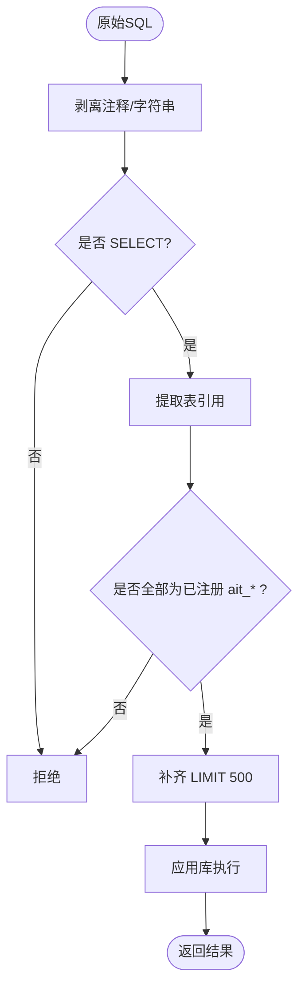
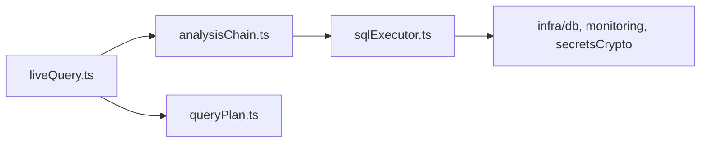

# 清洗链处理引擎

<cite>
**本文引用的文件**
- [analysisChain.ts](file://server/query/analysisChain.ts)
- [sqlExecutor.ts](file://server/query/sqlExecutor.ts)
- [liveQuery.ts](file://server/query/liveQuery.ts)
- [queryPlan.ts](file://server/query/queryPlan.ts)
- [analysisChain.test.ts](file://server/query/analysisChain.test.ts)
</cite>

## 目录
1. [简介](#简介)
2. [项目结构](#项目结构)
3. [核心组件](#核心组件)
4. [架构总览](#架构总览)
5. [详细组件分析](#详细组件分析)
6. [依赖关系分析](#依赖关系分析)
7. [性能考量](#性能考量)
8. [故障排查指南](#故障排查指南)
9. [结论](#结论)
10. [附录：关键流程与示例](#附录：关键流程与示例)

## 简介
本文件系统性阐述“M3 中间表清洗链”的设计与实现，覆盖从自然语言到 SQL 的完整链路、复杂度评估机制、多步清洗计划生成与执行、LLM 驱动的纠错自愈、中间表的物化（列类型推断、数据规整、批量写入）、以及应用库侧对中间表的引用与执行。文档同时给出流程图与时序图，帮助读者快速理解系统行为与优化点。

## 项目结构
围绕 M3 清洗链的核心代码集中在 server/query 目录下：
- analysisChain.ts：复杂度评估、信号词检测、清洗步骤编排、中间表物化、应用库执行校验与 TTL 清理。
- sqlExecutor.ts：SQL 安全执行层（SELECT-only、白名单、行级权限注入、EXPLAIN 防线、场景化连接池与超时）。
- liveQuery.ts：问数主编排，集成 M3 清洗链（自动或强制触发），并在阶段一/二之间衔接。
- queryPlan.ts：M2 计划模式（与分析链互补，提供可批准的分析计划）。
- analysisChain.test.ts：清洗链单测，覆盖解析、物化、执行、TTL 清理等路径。

图表来源
- [liveQuery.ts:301-327](file://server/query/liveQuery.ts#L301-L327)
- [analysisChain.ts:97-112](file://server/query/analysisChain.ts#L97-L112)
- [analysisChain.ts:268-326](file://server/query/analysisChain.ts#L268-L326)
- [sqlExecutor.ts:734-832](file://server/query/sqlExecutor.ts#L734-L832)

章节来源
- [liveQuery.ts:189-327](file://server/query/liveQuery.ts#L189-L327)
- [analysisChain.ts:1-411](file://server/query/analysisChain.ts#L1-L411)
- [sqlExecutor.ts:1-832](file://server/query/sqlExecutor.ts#L1-L832)

## 核心组件
- 复杂度评估与信号词检测：基于启发式信号词预门控 + LLM 结构化分类，输出 simple 或 multi-step 及最多 3 步清洗计划。
- 清洗步骤编排与自愈：逐条执行 SELECT 清洗；失败时携带错误信息让 LLM 纠偏一次，成功则落库中间表。
- 中间表物化：列名安全过滤、列类型推断（DOUBLE/TEXT）、单元格值规整、按 500 行批量写入、注册元数据并设置 TTL。
- 应用库执行：仅允许 SELECT 且必须引用已注册的 ait_* 中间表，自动追加 LIMIT 保护。
- 安全执行层：SELECT-only、表白名单、敏感列拒绝、行级权限注入、EXPLAIN 预估扫描拦截、场景化连接池与超时。

章节来源
- [analysisChain.ts:47-112](file://server/query/analysisChain.ts#L47-L112)
- [analysisChain.ts:114-156](file://server/query/analysisChain.ts#L114-L156)
- [analysisChain.ts:158-253](file://server/query/analysisChain.ts#L158-L253)
- [analysisChain.ts:328-384](file://server/query/analysisChain.ts#L328-L384)
- [sqlExecutor.ts:291-387](file://server/query/sqlExecutor.ts#L291-L387)
- [sqlExecutor.ts:629-662](file://server/query/sqlExecutor.ts#L629-L662)
- [sqlExecutor.ts:734-832](file://server/query/sqlExecutor.ts#L734-L832)

## 架构总览
下图展示从自然语言到最终结果的端到端流程，突出 M3 清洗链在复杂查询中的作用。

图表来源
- [liveQuery.ts:301-327](file://server/query/liveQuery.ts#L301-L327)
- [analysisChain.ts:268-326](file://server/query/analysisChain.ts#L268-L326)
- [analysisChain.ts:361-384](file://server/query/analysisChain.ts#L361-L384)
- [sqlExecutor.ts:734-832](file://server/query/sqlExecutor.ts#L734-L832)

## 详细组件分析

### 复杂度评估与信号词检测
- 信号词预门控：通过正则匹配“去重/标准化/异常值剔除/先…再…”等关键词，避免无谓 LLM 调用。
- LLM 结构化评估：将 Schema 与问题输入模型，强制输出 JSON，区分 simple 与 multi-step，并产出最多 3 步清洗计划（每步为针对源表的 SELECT）。
- 容错策略：非法或非预期输出一律降级为 simple，保证可用性。

图表来源
- [analysisChain.ts:83-112](file://server/query/analysisChain.ts#L83-L112)

章节来源
- [analysisChain.ts:83-112](file://server/query/analysisChain.ts#L83-L112)

### 清洗步骤自动生成与纠错自愈
- 自动生成：由复杂度评估产出的 steps 驱动，每步目的明确、SQL 限定为 SELECT。
- 执行验证：通过安全执行层校验（SELECT-only、白名单、敏感列拒绝、行级权限注入、EXPLAIN 防线）。
- 纠错自愈：若某步执行失败，携带错误信息让 LLM 修正 SQL 一次；若仍失败，记录错误并继续后续步骤，不阻断整体链路。

图表来源
- [analysisChain.ts:114-156](file://server/query/analysisChain.ts#L114-L156)
- [analysisChain.ts:268-326](file://server/query/analysisChain.ts#L268-L326)
- [sqlExecutor.ts:734-832](file://server/query/sqlExecutor.ts#L734-L832)

章节来源
- [analysisChain.ts:114-156](file://server/query/analysisChain.ts#L114-L156)
- [analysisChain.ts:268-326](file://server/query/analysisChain.ts#L268-L326)

### 中间表物化：列类型推断、数据规整、批量写入
- 列名安全化：仅保留合法标识符，剔除敏感列（裸名匹配）。
- 列类型推断：采样前 100 行，数值占比超过阈值则推断为 DOUBLE，否则 TEXT。
- 值规整：空值转 null；DOUBLE 非数值转 null；日期转 ISO 字符串；其他截断至固定长度。
- 批量写入：按 500 行一批 INSERT，降低网络与锁竞争开销。
- 配额与 TTL：每用户最多 N 张中间表，超出删除最旧；注册表记录 expires_at，定时清理过期表。

图表来源
- [analysisChain.ts:158-253](file://server/query/analysisChain.ts#L158-L253)

章节来源
- [analysisChain.ts:158-253](file://server/query/analysisChain.ts#L158-L253)

### 应用库执行与中间表引用校验
- 仅允许 SELECT 单语句，禁止危险关键字与 INTO。
- 提取 SQL 中 ait_* 表引用，必须全部来自已注册且未过期的中间表集合。
- 自动补齐 LIMIT 限制结果规模，防止大结果拖慢前端。

图表来源
- [analysisChain.ts:328-384](file://server/query/analysisChain.ts#L328-L384)

章节来源
- [analysisChain.ts:328-384](file://server/query/analysisChain.ts#L328-L384)

### 安全执行层（源库）要点
- 白名单与 AST 复核：正则先行，AST 二次校验，WITH 链特殊处理。
- 行级权限注入：AST 包裹派生表，递归处理子查询/CTE/UNION。
- EXPLAIN 防线：估算扫描行数超阈值即拦截，提示收窄条件。
- 场景化连接池与超时：interactive/chain/export 三类场景独立配额与超时，避免后台任务挤占交互。

章节来源
- [sqlExecutor.ts:291-387](file://server/query/sqlExecutor.ts#L291-L387)
- [sqlExecutor.ts:396-489](file://server/query/sqlExecutor.ts#L396-L489)
- [sqlExecutor.ts:531-662](file://server/query/sqlExecutor.ts#L531-L662)
- [sqlExecutor.ts:686-726](file://server/query/sqlExecutor.ts#L686-L726)
- [sqlExecutor.ts:734-832](file://server/query/sqlExecutor.ts#L734-L832)

## 依赖关系分析
- liveQuery 依赖 analysisChain 进行复杂度评估与清洗链执行，并在阶段一/二之间协调。
- analysisChain 依赖 sqlExecutor 的安全执行能力，以及 LLM 客户端进行评估与纠错。
- sqlExecutor 依赖数据库连接池、监控埋点、密钥解密、文件数据源适配等基础设施。

图表来源
- [liveQuery.ts:16-43](file://server/query/liveQuery.ts#L16-L43)
- [analysisChain.ts:7-14](file://server/query/analysisChain.ts#L7-L14)
- [sqlExecutor.ts:11-21](file://server/query/sqlExecutor.ts#L11-L21)

章节来源
- [liveQuery.ts:16-43](file://server/query/liveQuery.ts#L16-L43)
- [analysisChain.ts:7-14](file://server/query/analysisChain.ts#L7-L14)
- [sqlExecutor.ts:11-21](file://server/query/sqlExecutor.ts#L11-L21)

## 性能考量
- 复杂度评估预门控：无清洗信号时不调用 LLM，减少推理开销。
- 多候选并行生成与多数表决：提升鲁棒性并缩短首响应时间。
- 中间表批量写入：500 行一批，降低事务与锁竞争。
- 场景化连接池与超时：按 interactive/chain/export 分级控制并发与超时，避免相互影响。
- EXPLAIN 防线：提前拦截大扫描查询，保护业务库。
- 模板命中优先：确定性模板拼装 SQL，零偏差兜底，减少 LLM 负担。

[本节为通用性能建议，不直接分析具体文件]

## 故障排查指南
- 复杂度评估失败：检查是否有清洗信号或开启 force；确认 LLM 返回 JSON 结构正确。
- 清洗步骤失败：查看 stepSummaries 中的 error；确认 schema 圈表与列名一致；必要时启用纠错自愈。
- 中间表写入失败：检查敏感列剔除逻辑、列类型推断、配额上限与 TTL 清理。
- 应用库执行失败：确认 SQL 仅引用已注册 ait_* 表；检查是否包含危险关键字或 INTO。
- 源库执行被拦截：关注 EXPLAIN_GUARD 原因，增加筛选维度或缩小范围。

章节来源
- [analysisChain.ts:268-326](file://server/query/analysisChain.ts#L268-L326)
- [analysisChain.ts:328-384](file://server/query/analysisChain.ts#L328-L384)
- [sqlExecutor.ts:629-662](file://server/query/sqlExecutor.ts#L629-L662)
- [analysisChain.test.ts:190-327](file://server/query/analysisChain.test.ts#L190-L327)

## 结论
M3 中间表清洗链通过“信号词预门控 + LLM 结构化评估 + 多步清洗计划 + 自愈纠错 + 中间表物化 + 应用库安全执行”形成闭环，既保障复杂查询的正确性与稳定性，又兼顾性能与安全。结合安全执行层的白名单、行级权限、EXPLAIN 防线与场景化资源隔离，系统在真实生产环境中具备高可用与高鲁棒性。

[本节为总结性内容，不直接分析具体文件]

## 附录：关键流程与示例

### 复杂查询处理流程（示例）
- 用户提问：“先去重再统计各机构投放金额排名”。
- 信号词识别命中“去重/先…再…”，进入 LLM 评估。
- 评估返回 multi-step，生成两步清洗计划（去重、聚合）。
- 逐步执行清洗 SQL，结果物化为 ait_* 中间表。
- 阶段一生成本终 SQL，若仅引用 ait_*，则在应用库执行；否则走源库安全执行。
- 返回结果并进行阶段二解读。

章节来源
- [analysisChain.ts:83-112](file://server/query/analysisChain.ts#L83-L112)
- [analysisChain.ts:268-326](file://server/query/analysisChain.ts#L268-L326)
- [liveQuery.ts:301-327](file://server/query/liveQuery.ts#L301-L327)

### 性能优化技巧
- 小模型路由：简单单表问题走快速模型，复杂/多表问题使用主模型。
- 模板命中：优先使用确定性模板拼装 SQL，避免本地模型复杂语法不稳定。
- 批量写入：中间表写入按 500 行分批，减少锁与网络开销。
- 场景化超时：chain 场景默认 120s，export 场景 60s，interactive 15s，避免长任务阻塞交互。

章节来源
- [liveQuery.ts:342-357](file://server/query/liveQuery.ts#L342-L357)
- [analysisChain.ts:238-243](file://server/query/analysisChain.ts#L238-L243)
- [sqlExecutor.ts:94-109](file://server/query/sqlExecutor.ts#L94-L109)

### 故障恢复机制
- 步骤执行失败：携带错误信息让 LLM 修复一次；若仍失败，记录错误并继续后续步骤。
- EXPLAIN 防线拦截：给 LLM 一次收窄条件的自纠错机会，二次拦截则终止自纠错，避免空转。
- 模板回退：模板路径失败时回退自由生成，确保可用性。

章节来源
- [analysisChain.ts:114-156](file://server/query/analysisChain.ts#L114-L156)
- [analysisChain.ts:268-326](file://server/query/analysisChain.ts#L268-L326)
- [liveQuery.ts:597-627](file://server/query/liveQuery.ts#L597-L627)