# 核心组件详解

<cite>
**本文引用的文件**
- [analysisChain.ts](file://server/query/analysisChain.ts)
- [llmClient.ts](file://server/llm/llmClient.ts)
- [knowledgeBase.ts](file://server/knowledge/knowledgeBase.ts)
- [auth.ts](file://server/auth/auth.ts)
- [accessControl.ts](file://server/auth/accessControl.ts)
- [sqlExecutor.ts](file://server/query/sqlExecutor.ts)
- [schemaContext.ts](file://server/query/schemaContext.ts)
- [ollamaBackends.ts](file://server/llm/ollamaBackends.ts)
- [query.ts](file://server/routes/query.ts)
- [seriesForecast.ts](file://server/analytics/seriesForecast.ts)
- [attribution.ts](file://server/analytics/attribution.ts)
- [whatIf.ts](file://server/analytics/whatIf.ts)
- [orchestrator.ts](file://server/agent/orchestrator.ts)
- [analytics.ts](file://server/routes/analytics.ts)
</cite>

## 更新摘要
**变更内容**
- 新增高级分析引擎模块：时序预测、多维归因、情景推演
- 新增Agent编排层：协调多能力协作的复杂分析流程
- 扩展路由层：新增 /api/analytics 高级分析API端点
- 增强系统分析能力：从基础查询扩展到预测性分析和假设推演

## 目录
1. [简介](#简介)
2. [项目结构](#项目结构)
3. [核心组件](#核心组件)
4. [架构总览](#架构总览)
5. [详细组件分析](#详细组件分析)
6. [依赖关系分析](#依赖关系分析)
7. [性能考量](#性能考量)
8. [故障排查指南](#故障排查指南)
9. [结论](#结论)
10. [附录：配置与示例](#附录：配置与示例)

## 简介
本文件面向"智能问数据分析系统"的核心组件，聚焦以下目标：
- 解析查询处理引擎 analysisChain 的设计原理：自然语言转 SQL 的完整流程、中间表管理、查询优化策略。
- 说明 LLM 客户端 llmClient 的多引擎支持机制：Ollama、Gemini、通义千问的统一接口抽象、熔断降级、并发控制。
- 阐述知识库 knowledgeBase 的架构设计：向量检索、语义搜索、知识图谱构建（以 RAG 为主）。
- 解释认证授权模块 auth 的安全机制：JWT 令牌、RBAC 权限模型、数据访问控制（ACL）。
- **新增**：介绍高级分析引擎系列：时序预测、多维归因、情景推演的统计分析能力。
- **新增**：说明 Agent 编排器的多能力协调机制，实现复杂分析任务的自动化执行。
- 提供组件交互图与调用时序图，并给出具体配置方法与代码片段路径。

## 项目结构
系统后端按职责分层组织：
- 路由层：对外暴露 API，负责鉴权、限流、审计、SSE 事件推送等。
- 查询链路：包含 schema 上下文、SQL 安全执行、分析链（中间表）、缓存、反馈、计划模式等。
- **新增**：高级分析层：时序预测、多维归因、情景推演的纯函数统计分析引擎。
- **新增**：Agent编排层：多能力协调执行器，支持 query → forecast/attribution 的流水线作业。
- LLM 层：统一封装 Ollama/Gemini/Qwen，提供 JSON/文本/流式调用，内置重试、熔断、并发控制、自适应超时。
- 知识库层：RAG 实现，切块、embedding、相似度排序、提示注入。
- 认证授权：JWT 签发校验、角色守卫、数据源 ACL 控制。

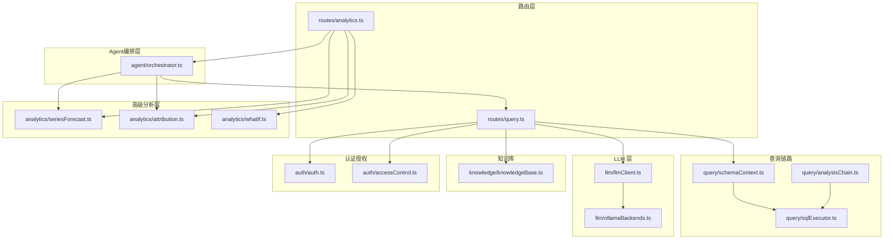

**图表来源**
- [query.ts:1-200](file://server/routes/query.ts#L1-L200)
- [analytics.ts:1-200](file://server/routes/analytics.ts#L1-L200)
- [orchestrator.ts:1-446](file://server/agent/orchestrator.ts#L1-L446)
- [seriesForecast.ts:1-322](file://server/analytics/seriesForecast.ts#L1-L322)
- [attribution.ts:1-189](file://server/analytics/attribution.ts#L1-L189)
- [whatIf.ts:1-234](file://server/analytics/whatIf.ts#L1-L234)

## 核心组件
- 查询处理引擎（analysisChain）：复杂度评估、多步清洗计划、中间表物化、应用库执行、TTL 清理。
- LLM 客户端（llmClient）：统一 JSON/文本调用、阶段级路由、请求级覆盖、熔断/重试/并发/自适应超时、多后端健康检查。
- 知识库（knowledgeBase）：RAG 切块、embedding 批量、余弦相似度/bigram 降级、阈值过滤、提示注入。
- 认证授权（auth + accessControl）：JWT 签发/校验、RBAC 守卫、数据源 ACL 部门/用户维度控制。
- SQL 安全执行（sqlExecutor）：SELECT-only、白名单、敏感列拒绝、行级权限注入、EXPLAIN 防线、场景化连接池与超时。
- Schema 上下文（schemaContext）：落库 schema 加载、scope 白名单、敏感列过滤、摘要生成、缓存失效。
- **新增**：时序预测引擎（seriesForecast）：移动平均、线性回归、季节分解三档模型，auto 回测择优，置信区间计算。
- **新增**：多维归因引擎（attribution）：维度组合贡献度拆解，拉高/拉低 TOP N，变化集中度诊断。
- **新增**：情景推演引擎（whatIf）：LLM 改写 SQL 进行假设情景对比，before/after 数值差异分析。
- **新增**：Agent 编排器（orchestrator）：多能力协调执行，query → forecast/attribution 流水线，计划存储与一次性消费。

**章节来源**
- [analysisChain.ts:1-411](file://server/query/analysisChain.ts#L1-L411)
- [llmClient.ts:1-606](file://server/llm/llmClient.ts#L1-L606)
- [knowledgeBase.ts:1-239](file://server/knowledge/knowledgeBase.ts#L1-L239)
- [auth.ts:1-127](file://server/auth/auth.ts#L1-L127)
- [accessControl.ts:1-108](file://server/auth/accessControl.ts#L1-L108)
- [sqlExecutor.ts:1-800](file://server/query/sqlExecutor.ts#L1-L800)
- [schemaContext.ts:1-172](file://server/query/schemaContext.ts#L1-L172)
- [seriesForecast.ts:1-322](file://server/analytics/seriesForecast.ts#L1-L322)
- [attribution.ts:1-189](file://server/analytics/attribution.ts#L1-L189)
- [whatIf.ts:1-234](file://server/analytics/whatIf.ts#L1-L234)
- [orchestrator.ts:1-446](file://server/agent/orchestrator.ts#L1-L446)

## 架构总览
下图展示一次"智能问数"从路由到执行的端到端协作关系，包括 LLM 调用、Schema 上下文、SQL 安全执行与分析链中间表，以及新增的高级分析能力。

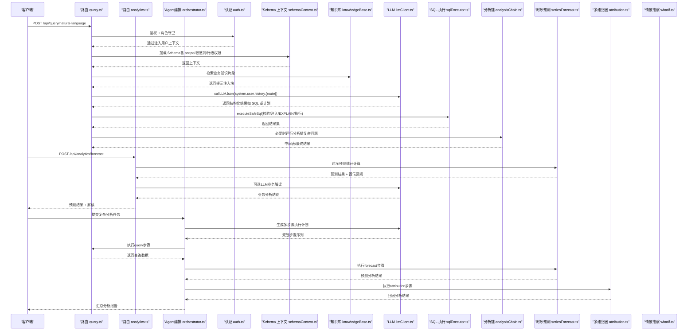

**图表来源**
- [query.ts:1-200](file://server/routes/query.ts#L1-L200)
- [analytics.ts:1-200](file://server/routes/analytics.ts#L1-L200)
- [orchestrator.ts:1-446](file://server/agent/orchestrator.ts#L1-L446)
- [seriesForecast.ts:1-322](file://server/analytics/seriesForecast.ts#L1-L322)
- [attribution.ts:1-189](file://server/analytics/attribution.ts#L1-L189)
- [whatIf.ts:1-234](file://server/analytics/whatIf.ts#L1-L234)

## 详细组件分析

### 查询处理引擎（analysisChain）
- 复杂度评估：基于启发式信号（去重/标准化/异常值剔除等）决定是否走 LLM 评估；评估输出为 simple/multi-step，multi-step 时产出最多 3 步清洗计划。
- 清洗步骤纠错：若某步 SELECT 失败，携带错误信息让 LLM 自纠一次，避免编造列名/表名导致持续失败。
- 中间表物化：将清洗结果写入应用库物理表（ait_*），同时注册元数据（用途、列、行数、过期时间），每用户上限 10 张，超限时删除最旧。
- 应用库执行：仅允许引用已注册的 ait_* 表的 SELECT，二次白名单校验 + 只读关键字拦截 + LIMIT 限制。
- TTL 清理：定时任务每小时清理过期中间表（物理表 + 注册条目）。

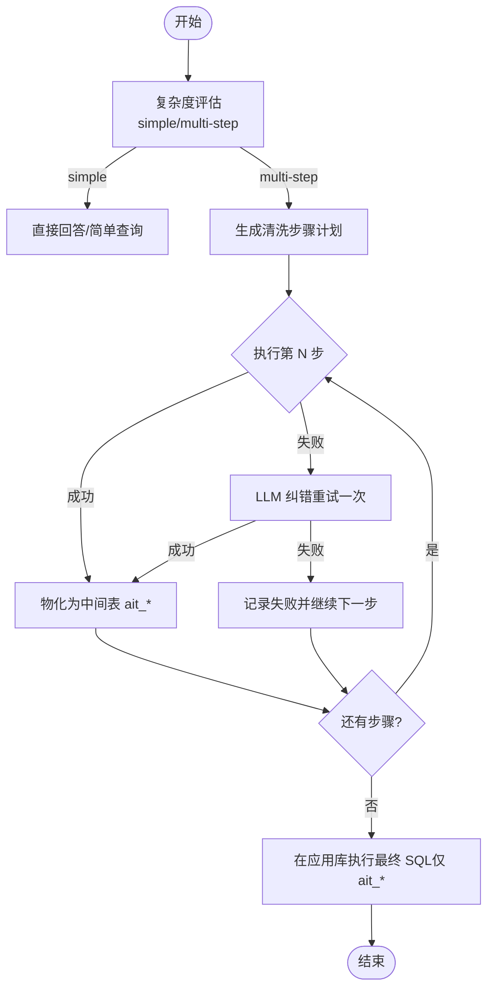

**图表来源**
- [analysisChain.ts:47-112](file://server/query/analysisChain.ts#L47-L112)
- [analysisChain.ts:114-156](file://server/query/analysisChain.ts#L114-L156)
- [analysisChain.ts:158-253](file://server/query/analysisChain.ts#L158-L253)
- [analysisChain.ts:255-384](file://server/query/analysisChain.ts#L255-L384)
- [analysisChain.ts:386-411](file://server/query/analysisChain.ts#L386-L411)

**章节来源**
- [analysisChain.ts:1-411](file://server/query/analysisChain.ts#L1-L411)

### LLM 客户端（llmClient）
- 多引擎统一接口：callLLMJson/callLLMText 统一入口，内部根据引擎选择 Ollama/Gemini/Qwen。
- 阶段级路由：SQL 生成与分析解读可分别指定快速小模型（环境变量配置），提升吞吐与稳定性。
- 请求级覆盖：通过 AsyncLocalStorage 注入当前请求的引擎/模型，优先于阶段路由。
- 韧性保障：
  - 重试：指数退避 + 抖动，仅对可恢复错误重试（超时/5xx/网络错误/429）。
  - 熔断：按引擎隔离，连续失败开路，冷却期后半开探测恢复。
  - 并发：每引擎信号量限流，默认最大并发 4，防止打爆本地推理进程。
  - 自适应超时：基于近期成功调用的 P95×3 动态收紧配置上限。
- 多后端 Ollama：最少并发路由、健康检查摘除/恢复、失败自动切换次优节点。

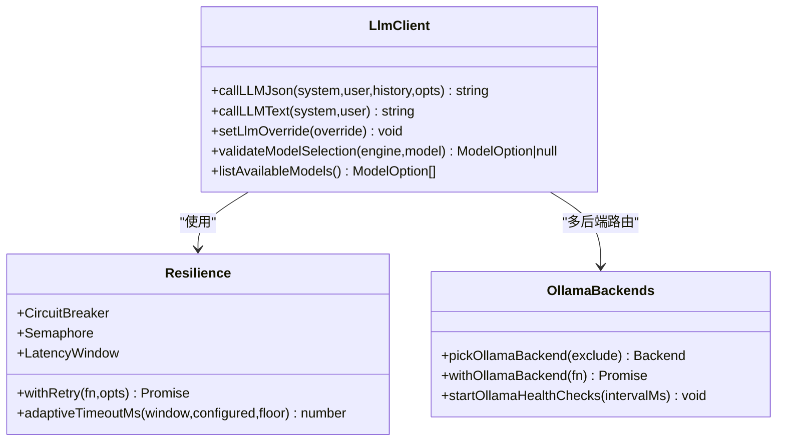

**图表来源**
- [llmClient.ts:61-107](file://server/llm/llmClient.ts#L61-L107)
- [llmClient.ts:141-161](file://server/llm/llmClient.ts#L141-L161)
- [llmClient.ts:163-194](file://server/llm/llmClient.ts#L163-L194)
- [llmClient.ts:228-246](file://server/llm/llmClient.ts#L228-L246)
- [llmClient.ts:349-442](file://server/llm/llmClient.ts#L349-L442)
- [llmClient.ts:449-525](file://server/llm/llmClient.ts#L449-L525)
- [ollamaBackends.ts:43-96](file://server/llm/ollamaBackends.ts#L43-L96)
- [ollamaBackends.ts:111-128](file://server/llm/ollamaBackends.ts#L111-L128)

**章节来源**
- [llmClient.ts:1-606](file://server/llm/llmClient.ts#L1-L606)
- [ollamaBackends.ts:1-143](file://server/llm/ollamaBackends.ts#L1-L143)

### 知识库（knowledgeBase）
- 切块与嵌入：按段落优先、定长兜底切块，相邻块保留重叠；批量 embedding 失败则整批降级为关键词检索。
- 相关性排序：向量模式用余弦相似度，低于阈值（默认 0.35）视为无关不注入；bigram 降级模式维持 score>0。
- 高价值文档保护：标题命中特定关键词（口径/指南/规则等）时保留一个槽位，避免被字段字典类文档挤占。
- 提示注入：将检索到的片段格式化为强指令块，约束口径/术语/枚举，但不放开表列白名单。

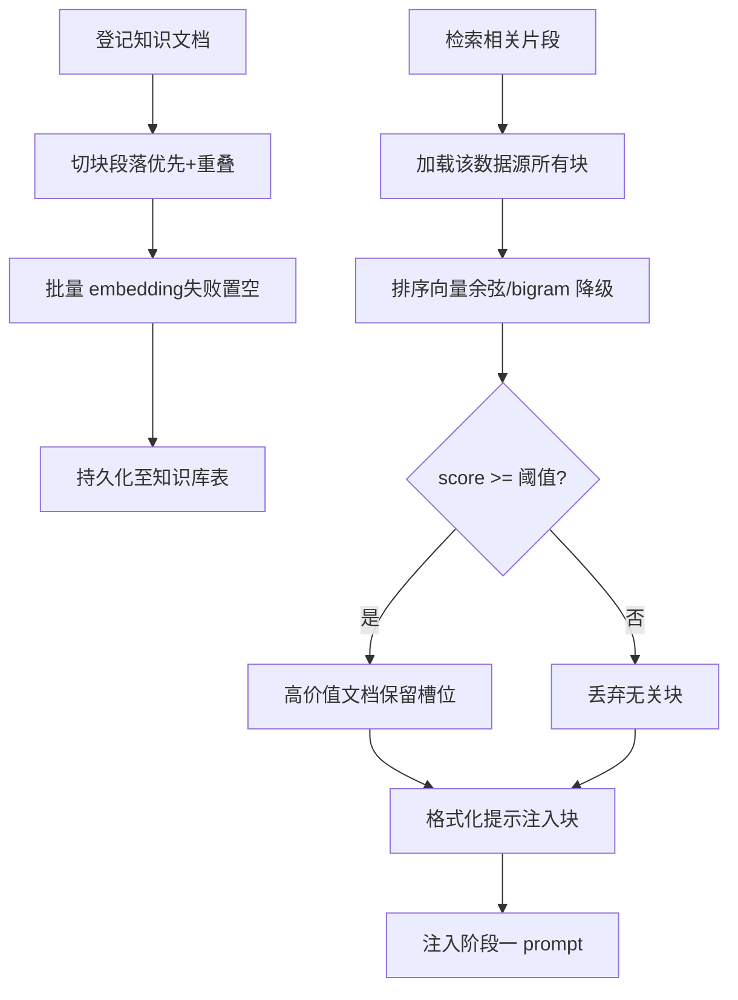

**图表来源**
- [knowledgeBase.ts:43-75](file://server/knowledge/knowledgeBase.ts#L43-L75)
- [knowledgeBase.ts:77-90](file://server/knowledge/knowledgeBase.ts#L77-L90)
- [knowledgeBase.ts:106-157](file://server/knowledge/knowledgeBase.ts#L106-L157)
- [knowledgeBase.ts:159-166](file://server/knowledge/knowledgeBase.ts#L159-L166)
- [knowledgeBase.ts:170-197](file://server/knowledge/knowledgeBase.ts#L170-L197)
- [knowledgeBase.ts:206-239](file://server/knowledge/knowledgeBase.ts#L206-L239)

**章节来源**
- [knowledgeBase.ts:1-239](file://server/knowledge/knowledgeBase.ts#L1-L239)

### 认证授权（auth + accessControl）
- JWT 签发与校验：服务端签发 token，校验时回查 users 表确保状态实时生效；未登录/无效/禁用账号均拒绝。
- RBAC 角色守卫：requireRole('ADMIN'|'ANALYST'|'VIEWER') 控制接口访问。
- 强制改密：首登或被重置密码的用户，改密前禁止访问业务接口（仅放行 /api/auth/*）。
- 数据源 ACL：按部门/用户维度控制数据源可见性；管理员始终可访问；未配置 ACL 表示不限制。

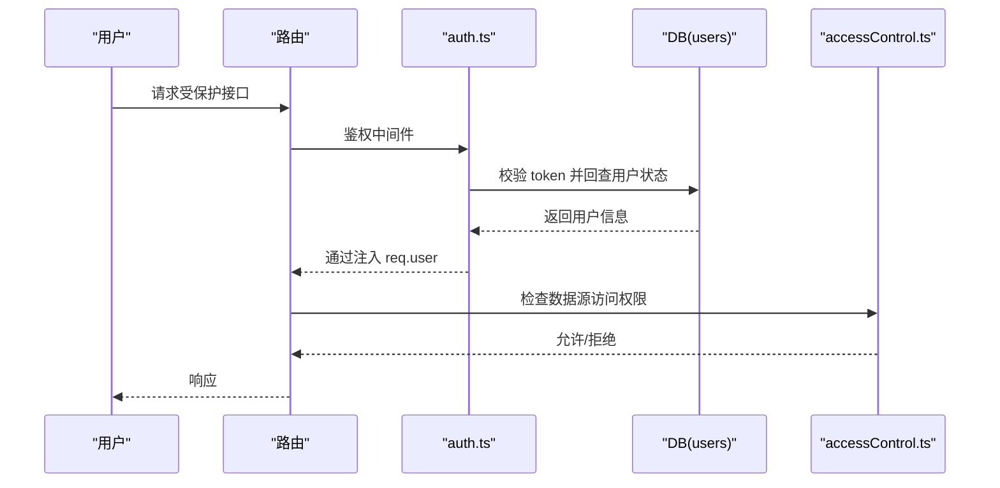

**图表来源**
- [auth.ts:60-127](file://server/auth/auth.ts#L60-L127)
- [accessControl.ts:18-73](file://server/auth/accessControl.ts#L18-L73)

**章节来源**
- [auth.ts:1-127](file://server/auth/auth.ts#L1-L127)
- [accessControl.ts:1-108](file://server/auth/accessControl.ts#L1-L108)

### SQL 安全执行（sqlExecutor）
- 安全校验：SELECT-only、单语句、危险关键字拒绝、INTO 写操作拒绝、表名白名单、敏感列拒绝。
- AST 二道防线：node-sql-parser 语法树复核，WITH CTE 特殊处理，CTE 名排除白名单校验。
- 行级权限注入：AST 包裹派生表，递归覆盖子查询/UNION/CTE 内真实表引用，注入失败 fail-closed。
- EXPLAIN 防线：预估扫描行数超过阈值则拦截，保护数据源性能；EXPLAIN 失败 fail-open 放行。
- 场景化连接池与超时：interactive/chain/export 三类场景独立配额与超时，避免后台任务影响交互体验。
- MySQL 执行时限：注入 MAX_EXECUTION_TIME hint，CTE 场景定位主 SELECT 注入点。

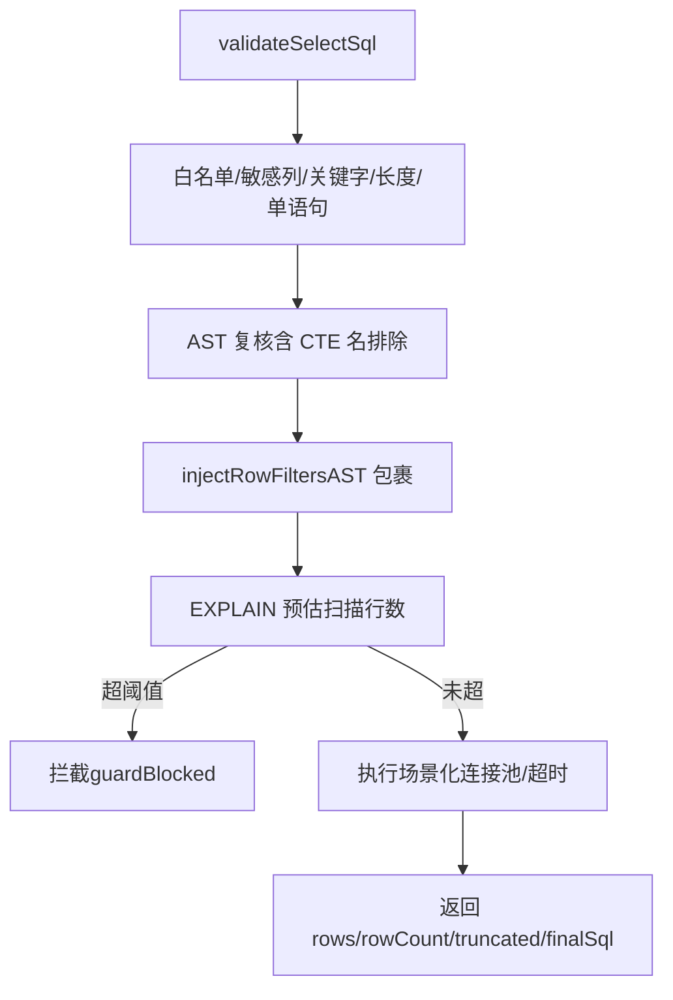

**图表来源**
- [sqlExecutor.ts:155-167](file://server/query/sqlExecutor.ts#L155-L167)
- [sqlExecutor.ts:169-235](file://server/query/sqlExecutor.ts#L169-L235)
- [sqlExecutor.ts:237-283](file://server/query/sqlExecutor.ts#L237-L283)
- [sqlExecutor.ts:285-387](file://server/query/sqlExecutor.ts#L285-L387)
- [sqlExecutor.ts:389-489](file://server/query/sqlExecutor.ts#L389-L489)
- [sqlExecutor.ts:531-662](file://server/query/sqlExecutor.ts#L531-L662)
- [sqlExecutor.ts:686-726](file://server/query/sqlExecutor.ts#L686-L726)
- [sqlExecutor.ts:733-800](file://server/query/sqlExecutor.ts#L733-L800)

**章节来源**
- [sqlExecutor.ts:1-800](file://server/query/sqlExecutor.ts#L1-L800)

### Schema 上下文（schemaContext）
- 加载流程：从 data_sources 读取 schema_json/scope_json/status/type/allow_introspection/config_json。
- 过滤与摘要：应用数据范围（scope）白名单、敏感列过滤、生成 schema 摘要用于 prompt。
- 缓存与失效：内存/Redis 共享缓存，TTL 5 分钟；数据源配置变更后跨实例失效。
- 文件数据源：v0.9.34 起支持 csv/json/excel 上传落应用库物理表，统一走真实执行链路。

**章节来源**
- [schemaContext.ts:1-172](file://server/query/schemaContext.ts#L1-L172)

### 高级分析引擎系列

#### 时序预测引擎（seriesForecast）
- 三档统计模型：移动平均（含漂移修正）、最小二乘线性回归、加法季节分解。
- Auto 模式：尾部留出法回测，按 MAPE 择优选择最佳模型。
- 置信区间：基于残差标准差 × z × sqrt(step)，随预测步长扩大不确定性。
- 诊断报告：样本量、趋势方向、季节性识别、拟合质量评估。

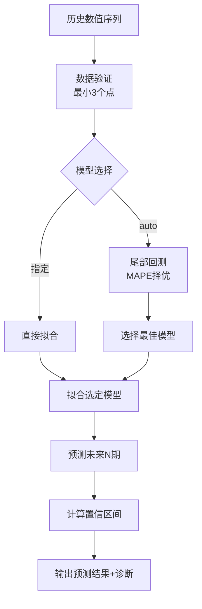

**图表来源**
- [seriesForecast.ts:65-102](file://server/analytics/seriesForecast.ts#L65-L102)
- [seriesForecast.ts:118-152](file://server/analytics/seriesForecast.ts#L118-L152)
- [seriesForecast.ts:157-241](file://server/analytics/seriesForecast.ts#L157-L241)

**章节来源**
- [seriesForecast.ts:1-322](file://server/analytics/seriesForecast.ts#L1-L322)

#### 多维归因引擎（attribution）
- 贡献度拆解：delta_i 占全部行变化量绝对值之和的比重，正=拉高、负=拉低。
- 多维度支持：1~3维组合（如 ['华东', 'M1']），保持原始维度结构。
- TOP N 分析：拉高/拉低维度组合分别排序，便于重点排查。
- 集中度诊断：识别变化高度集中的维度组合，辅助决策优先级。

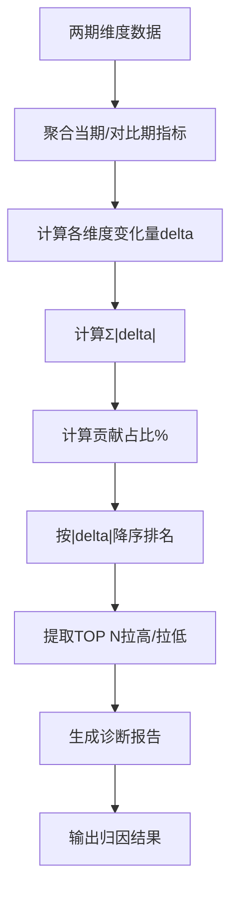

**图表来源**
- [attribution.ts:45-102](file://server/analytics/attribution.ts#L45-L102)
- [attribution.ts:104-125](file://server/analytics/attribution.ts#L104-L125)

**章节来源**
- [attribution.ts:1-189](file://server/analytics/attribution.ts#L1-L189)

#### 情景推演引擎（whatIf）
- LLM 改写：基于原始 SQL 和用户场景描述，生成改写后的情景 SQL。
- 安全校验：严格验证 SQL 合法性，拒绝危险关键字和DDL/DML操作。
- 对比分析：执行 before/after 两种 SQL，对比数值列的 sum/avg 变化。
- 中文摘要：自动生成变化率的业务解读，便于非技术人员理解。

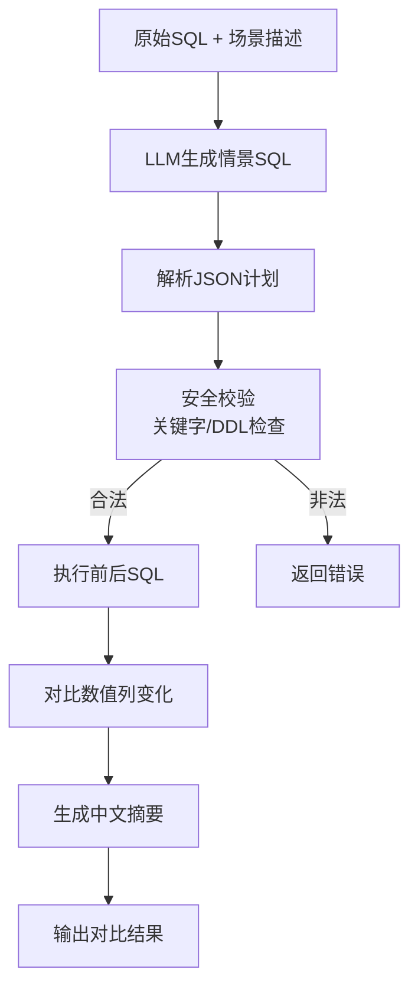

**图表来源**
- [whatIf.ts:94-123](file://server/analytics/whatIf.ts#L94-L123)
- [whatIf.ts:147-188](file://server/analytics/whatIf.ts#L147-L188)

**章节来源**
- [whatIf.ts:1-234](file://server/analytics/whatIf.ts#L1-L234)

### Agent 编排器（orchestrator）
- 多能力协调：支持 query → forecast/attribution 的流水线作业，自动传递上游数据。
- 计划存储：内存 Map + Redis 前缀 ap:，10 分钟 TTL、一次性消费、用户/数据源绑定。
- 智能参数解析：自动识别列名，支持精确匹配和候选择优（数值列优先/时间样列优先）。
- 容错执行：单步失败不中断后续步骤，整体 ok 取决于是否全步成功。

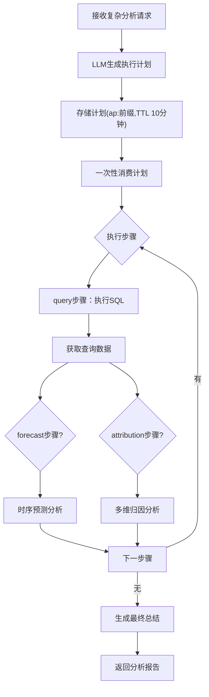

**图表来源**
- [orchestrator.ts:135-159](file://server/agent/orchestrator.ts#L135-L159)
- [orchestrator.ts:274-299](file://server/agent/orchestrator.ts#L274-L299)
- [orchestrator.ts:307-349](file://server/agent/orchestrator.ts#L307-L349)

**章节来源**
- [orchestrator.ts:1-446](file://server/agent/orchestrator.ts#L1-L446)

## 依赖关系分析
- 路由层依赖：auth、rateLimiter、schemaContext、llmClient、knowledgeBase、sqlExecutor、analysisChain、queryCache、queryPlan、sseReplayBuffer 等。
- 查询链路依赖：sqlExecutor 依赖 schemaContext（白名单/敏感列/行级权限）、monitoring、secretsCrypto；analysisChain 依赖 sqlExecutor、llmClient。
- **新增**：高级分析路由依赖：seriesForecast、attribution、whatIf、llmClient（可选解读）。
- **新增**：Agent编排器依赖：liveQuery（query步骤）、seriesForecast（forecast步骤）、attribution（attribution步骤）、stateStore（计划存储）。
- LLM 层依赖：llmResilience（重试/熔断/并发/自适应超时）、ollamaBackends（多后端健康检查与路由）。
- 知识库依赖：llmClient（embedding）、queryFeedback（bigram 重叠度）。
- 认证授权依赖：infra/db（users/data_sources 表）、llmClient（注入用户上下文以便用量埋点）。

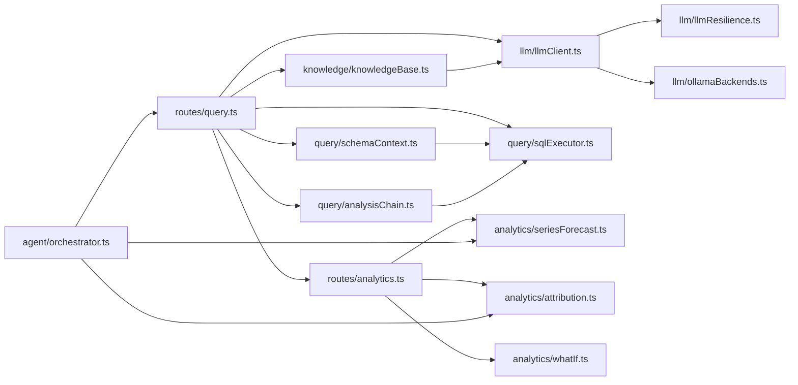

**图表来源**
- [query.ts:1-200](file://server/routes/query.ts#L1-L200)
- [analytics.ts:1-200](file://server/routes/analytics.ts#L1-L200)
- [orchestrator.ts:1-446](file://server/agent/orchestrator.ts#L1-L446)
- [seriesForecast.ts:1-322](file://server/analytics/seriesForecast.ts#L1-L322)
- [attribution.ts:1-189](file://server/analytics/attribution.ts#L1-L189)
- [whatIf.ts:1-234](file://server/analytics/whatIf.ts#L1-L234)

**章节来源**
- [query.ts:1-200](file://server/routes/query.ts#L1-L200)

## 性能考量
- LLM 调用：
  - 并发控制：每引擎默认最大并发 4，避免打爆本地推理进程。
  - 自适应超时：基于 P95×3 动态调整，快模型不被长超时拖死，慢模型不误杀。
  - 阶段级路由：SQL 生成与分析解读可使用快速小模型，降低延迟。
- SQL 执行：
  - 场景化连接池：interactive/chain/export 独立配额与超时，避免后台任务阻塞交互。
  - EXPLAIN 防线：预估扫描行数超阈值即拦截，保护数据源。
  - MySQL MAX_EXECUTION_TIME：CTE 场景精确定位主 SELECT 注入 hint。
- 知识库：
  - 批量 embedding：减少往返次数，整体失败降级为关键词检索，保证可用性。
  - 阈值过滤：向量模式低于阈值不注入，避免无关知识稀释注意力。
- 中间表：
  - 每用户上限与 TTL 清理：防止资源膨胀，定期回收过期中间表。
- **新增**：高级分析引擎：
  - 纯函数设计：seriesForecast/attribution/whatIf 均为无 IO 依赖的纯函数，可独立测试和优化。
  - 数据量限制：MAX_SERIES_LENGTH=240、MAX_ATTRIBUTION_ROWS=200、MAX_SCENARIO_SQL_LENGTH=4000，防止过大输入。
  - 自动模型选择：时序预测 auto 模式避免手动调参，提升用户体验。
- **新增**：Agent编排器：
  - 步骤限制：MAX_AGENT_STEPS=4，防止无限循环。
  - 数据传递：仅传递必要数据（≤50行），避免内存溢出。
  - 一次性消费：计划存储支持 Redis TTL 和内存清理，防止资源泄漏。

## 故障排查指南
- LLM 调用失败：
  - 检查熔断状态与冷却期：若主引擎开路，是否已切换到备用引擎。
  - 查看重试日志：指数退避与抖动是否生效，是否因 4xx 立即失败。
  - 确认自适应超时：P95 样本不足时回退配置上限。
- SQL 执行失败：
  - 白名单/敏感列/关键字拦截：核对 allowedTables 与 sensitiveColumns。
  - AST 解析失败：是否因方言差异导致 fallback，审计标记 astFallback。
  - EXPLAIN 拦截：预估扫描行数是否超过阈值，需增加筛选条件。
  - 行级权限注入失败：fail-closed，检查谓词合法性与 AST 重写。
- 中间表问题：
  - 用户配额超限：检查 ait_* 表数量，是否触发删除最旧逻辑。
  - TTL 过期：确认 expires_at 与清理任务是否正常执行。
- 认证授权：
  - JWT 无效：检查 JWT_SECRET 配置与 token 有效期。
  - 账号状态：回查 users 表 status 与 must_change_password。
  - 数据源 ACL：确认 departments/userIds 清单是否正确。
- **新增**：高级分析引擎：
  - 时序预测：检查序列长度（≥3）、数据类型（数值型）、预测期数（1-24）。
  - 多维归因：确认维度列存在、时期列格式正确、指标列为数值型。
  - 情景推演：验证 LLM 输出 JSON 结构、SQL 安全性、与原 SQL 的差异性。
  - Agent编排：检查计划存储状态、步骤依赖关系、上游数据可用性。

**章节来源**
- [llmClient.ts:61-107](file://server/llm/llmClient.ts#L61-L107)
- [llmClient.ts:141-161](file://server/llm/llmClient.ts#L141-L161)
- [sqlExecutor.ts:285-387](file://server/query/sqlExecutor.ts#L285-L387)
- [sqlExecutor.ts:531-662](file://server/query/sqlExecutor.ts#L531-L662)
- [analysisChain.ts:192-253](file://server/query/analysisChain.ts#L192-L253)
- [analysisChain.ts:386-411](file://server/query/analysisChain.ts#L386-L411)
- [auth.ts:60-127](file://server/auth/auth.ts#L60-L127)
- [accessControl.ts:18-73](file://server/auth/accessControl.ts#L18-L73)
- [seriesForecast.ts:65-102](file://server/analytics/seriesForecast.ts#L65-L102)
- [attribution.ts:45-102](file://server/analytics/attribution.ts#L45-L102)
- [whatIf.ts:94-123](file://server/analytics/whatIf.ts#L94-L123)
- [orchestrator.ts:274-299](file://server/agent/orchestrator.ts#L274-L299)

## 结论
本系统通过多层防护与韧性设计，实现了从自然语言到 SQL 再到真实数据的安全、稳定、高性能问数能力，并新增了强大的高级分析功能：
- analysisChain 将复杂问题拆解为多步清洗与中间表物化，结合应用库执行与 TTL 清理，兼顾灵活性与资源控制。
- llmClient 统一多引擎接口，内置重试、熔断、并发、自适应超时与多后端健康检查，显著提升鲁棒性。
- knowledgeBase 提供 RAG 增强，向量与关键词双路检索，阈值过滤与高价值文档保护，提升提示质量。
- auth 与 accessControl 实现 JWT/RBAC/ACL 三位一体，确保数据安全与合规。
- sqlExecutor 与 schemaContext 构成安全执行基石，白名单、敏感列、行级权限、EXPLAIN 防线与场景化连接池共同保障生产可用。
- **新增**：高级分析引擎系列提供时序预测、多维归因、情景推演的统计分析能力，支持 auto 模型选择和置信区间计算。
- **新增**：Agent 编排器实现多能力协调执行，支持复杂分析任务的自动化流水线作业。

## 附录：配置与示例
- LLM 引擎与模型：
  - AI_ENGINE：显式指定 ollama/gemini/qwen。
  - LLM_MODEL：默认模型（Ollama）。
  - QWEN_URL/QWEN_MODEL/QWEN_TIMEOUT_MS：通义千问端点、模型、超时。
  - GEMINI_API_KEY：Gemini 密钥。
  - LLM_SQL_ENGINE/LLM_SQL_MODEL：SQL 生成阶段快速模型。
  - LLM_ANALYSIS_ENGINE/LLM_ANALYSIS_MODEL：分析解读阶段快速模型。
  - LLM_RETRY_MAX/LLM_MAX_CONCURRENT/LLM_BREAKER_FAILS/LLM_BREAKER_COOLDOWN_MS/LLM_ADAPTIVE_TIMEOUT：韧性参数。
- Ollama 多后端：
  - OLLAMA_URLS：逗号分隔的后端列表。
  - OLLAMA_TIMEOUT_MS：超时毫秒。
- SQL 执行：
  - DS_POOL_MAX/DS_POOL_INTERACTIVE/DS_POOL_CHAIN/DS_POOL_EXPORT：连接池容量。
  - QUERY_TIMEOUT_INTERACTIVE_MS/QUERY_TIMEOUT_CHAIN_MS/QUERY_TIMEOUT_EXPORT_MS：场景超时。
  - SQL_EXPLAIN_MAX_ROWS：EXPLAIN 防线阈值（0=关闭）。
- 知识库：
  - KNOWLEDGE_MIN_SCORE：向量相似度阈值（默认 0.35）。
- 认证：
  - JWT_SECRET：固定强密钥（生产必须配置）。
  - JWT_EXPIRES_IN：token 有效期。
- **新增**：高级分析配置：
  - MAX_SERIES_LENGTH：时序预测最大序列长度（默认 240）。
  - MAX_FORECAST_PERIODS：最大预测期数（默认 24）。
  - MAX_ATTRIBUTION_ROWS：归因分析最大行数（默认 200）。
  - MAX_ATTRIBUTION_DIMS：归因分析最大维度数（默认 3）。
  - MAX_SCENARIO_SQL_LENGTH：情景推演最大SQL长度（默认 4000）。
  - WHATIF_ROW_LIMIT：情景推演最大执行行数（默认 1000）。
- **新增**：Agent编排配置：
  - MAX_AGENT_STEPS：最大执行步骤数（默认 4）。
  - AGENT_PLAN_TTL_MS：计划存储TTL（默认 10分钟）。
- 代码片段路径（供参考实现细节）：
  - 复杂度评估与中间表物化：[analysisChain.ts:47-112](file://server/query/analysisChain.ts#L47-L112)、[analysisChain.ts:158-253](file://server/query/analysisChain.ts#L158-L253)
  - LLM 统一调用与韧性：[llmClient.ts:449-525](file://server/llm/llmClient.ts#L449-L525)、[llmClient.ts:61-107](file://server/llm/llmClient.ts#L61-L107)
  - 知识库 RAG 检索与注入：[knowledgeBase.ts:106-166](file://server/knowledge/knowledgeBase.ts#L106-L166)、[knowledgeBase.ts:206-239](file://server/knowledge/knowledgeBase.ts#L206-L239)
  - 认证与 ACL：[auth.ts:60-127](file://server/auth/auth.ts#L60-L127)、[accessControl.ts:18-73](file://server/auth/accessControl.ts#L18-L73)
  - SQL 安全执行与 EXPLAIN：[sqlExecutor.ts:285-387](file://server/query/sqlExecutor.ts#L285-L387)、[sqlExecutor.ts:531-662](file://server/query/sqlExecutor.ts#L531-L662)
  - Schema 上下文加载与缓存：[schemaContext.ts:108-172](file://server/query/schemaContext.ts#L108-L172)
  - **新增**：时序预测引擎：[seriesForecast.ts:65-102](file://server/analytics/seriesForecast.ts#L65-L102)、[seriesForecast.ts:118-152](file://server/analytics/seriesForecast.ts#L118-L152)
  - **新增**：多维归因引擎：[attribution.ts:45-102](file://server/analytics/attribution.ts#L45-L102)、[attribution.ts:154-189](file://server/analytics/attribution.ts#L154-L189)
  - **新增**：情景推演引擎：[whatIf.ts:94-123](file://server/analytics/whatIf.ts#L94-L123)、[whatIf.ts:147-188](file://server/analytics/whatIf.ts#L147-L188)
  - **新增**：Agent编排器：[orchestrator.ts:135-159](file://server/agent/orchestrator.ts#L135-L159)、[orchestrator.ts:274-299](file://server/agent/orchestrator.ts#L274-L299)

**章节来源**
- [analysisChain.ts:1-411](file://server/query/analysisChain.ts#L1-L411)
- [llmClient.ts:1-606](file://server/llm/llmClient.ts#L1-L606)
- [knowledgeBase.ts:1-239](file://server/knowledge/knowledgeBase.ts#L1-L239)
- [auth.ts:1-127](file://server/auth/auth.ts#L1-L127)
- [accessControl.ts:1-108](file://server/auth/accessControl.ts#L1-L108)
- [sqlExecutor.ts:1-800](file://server/query/sqlExecutor.ts#L1-L800)
- [schemaContext.ts:1-172](file://server/query/schemaContext.ts#L1-L172)
- [seriesForecast.ts:1-322](file://server/analytics/seriesForecast.ts#L1-L322)
- [attribution.ts:1-189](file://server/analytics/attribution.ts#L1-L189)
- [whatIf.ts:1-234](file://server/analytics/whatIf.ts#L1-L234)
- [orchestrator.ts:1-446](file://server/agent/orchestrator.ts#L1-L446)
- [analytics.ts:1-200](file://server/routes/analytics.ts#L1-L200)