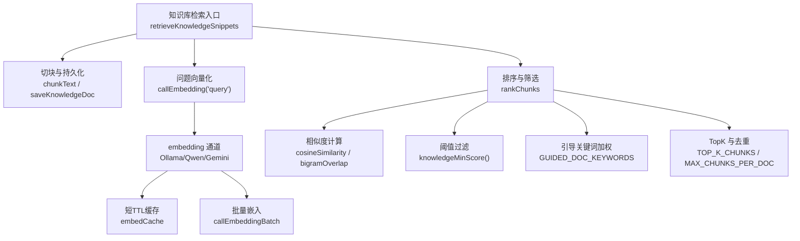
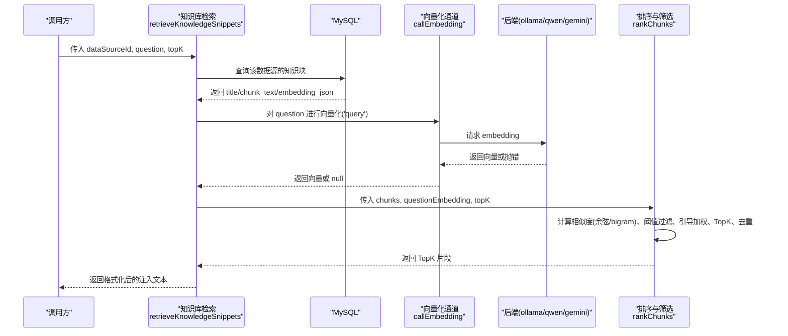
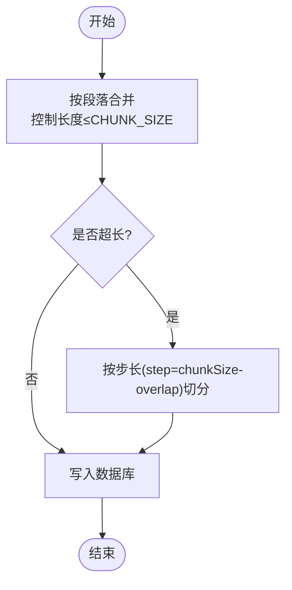
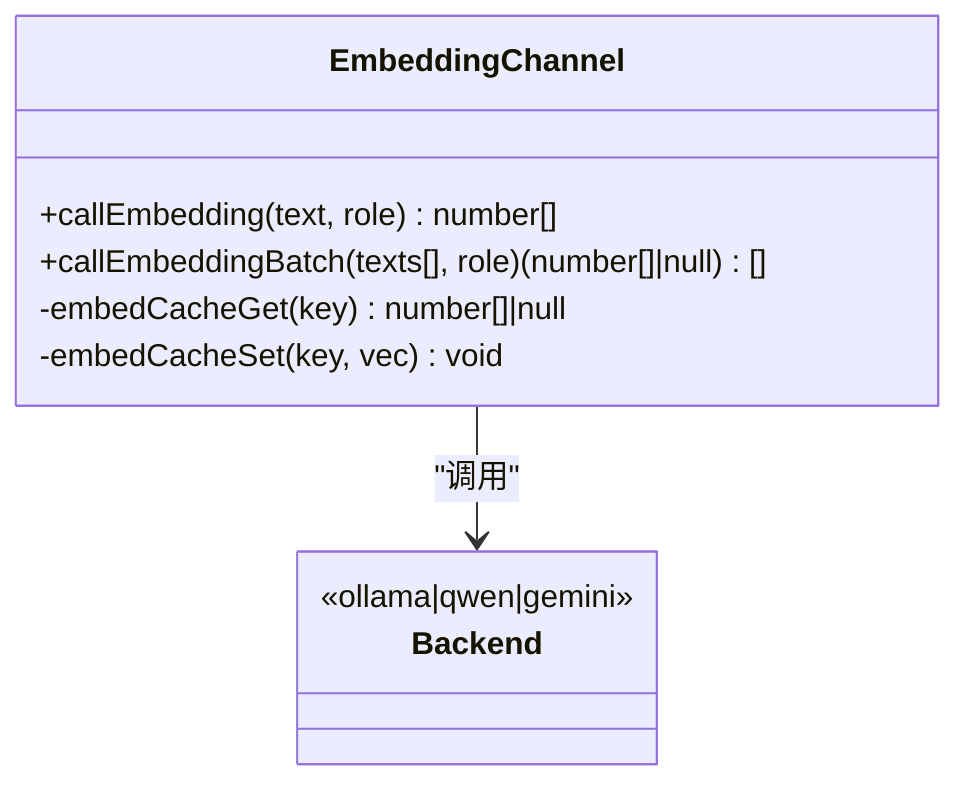
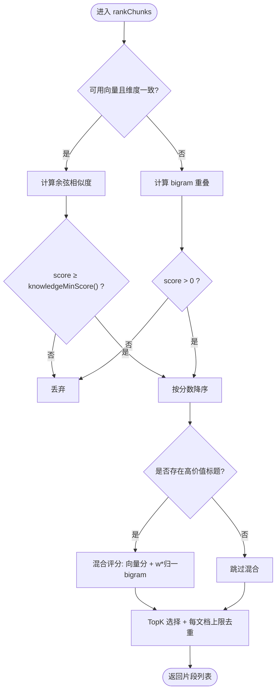
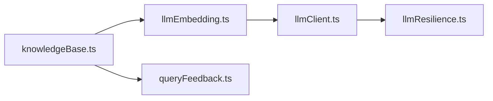

# 向量检索引擎

<cite>
**本文引用的文件**
- [server/knowledge/knowledgeBase.ts](file://server/knowledge/knowledgeBase.ts)
- [server/llm/llmEmbedding.ts](file://server/llm/llmEmbedding.ts)
- [server/query/queryFeedback.ts](file://server/query/queryFeedback.ts)
- [server/llm/llmClient.ts](file://server/llm/llmClient.ts)
- [server/llm/llmResilience.ts](file://server/llm/llmResilience.ts)
</cite>

## 目录
1. [简介](#简介)
2. [项目结构](#项目结构)
3. [核心组件](#核心组件)
4. [架构总览](#架构总览)
5. [详细组件分析](#详细组件分析)
6. [依赖关系分析](#依赖关系分析)
7. [性能考量与调优](#性能考量与调优)
8. [故障排查指南](#故障排查指南)
9. [结论](#结论)
10. [附录：配置参数速查](#附录配置参数速查)

## 简介
本仓库实现了一个面向“智能问数”的向量检索增强（RAG）子系统，用于在生成 SQL 前注入权威业务知识（指标口径、术语表、计算规则等），提升回答准确性并抑制幻觉。系统支持：
- 文本向量化：统一接入 Ollama、通义千问、Gemini 三种后端，具备短 TTL 缓存与批量能力。
- 相似度计算：余弦相似度 + bigram 关键词匹配，自动降级保障可用性。
- 检索优化：topK 选择、文档去重、阈值过滤、引导关键词权重，确保高价值知识优先注入。
- 韧性设计：重试、熔断、并发限流、自适应超时，保证服务稳定。

## 项目结构
围绕向量检索的核心代码分布在以下模块：
- 知识库切块与检索：server/knowledge/knowledgeBase.ts
- 向量化通道与批处理：server/llm/llmEmbedding.ts
- 词法相似度与样例检索：server/query/queryFeedback.ts
- LLM 调用与韧性：server/llm/llmClient.ts、server/llm/llmResilience.ts

图表来源
- [server/knowledge/knowledgeBase.ts:106-166](file://server/knowledge/knowledgeBase.ts#L106-L166)
- [server/llm/llmEmbedding.ts:60-162](file://server/llm/llmEmbedding.ts#L60-L162)
- [server/query/queryFeedback.ts:91-99](file://server/query/queryFeedback.ts#L91-L99)

章节来源
- [server/knowledge/knowledgeBase.ts:13-41](file://server/knowledge/knowledgeBase.ts#L13-L41)
- [server/llm/llmEmbedding.ts:21-47](file://server/llm/llmEmbedding.ts#L21-L47)

## 核心组件
- 文本切块与格式化：按段落合并、超长步长切分；将命中片段格式化为强指令注入块。
- 向量化通道：单条与批量 embedding，支持多后端与短 TTL 缓存，失败项置空以触发降级。
- 相似度与排序：向量模式使用余弦相似度；不可用时降级为 bigram 重叠计数；混合评分引入引导关键词权重。
- 阈值与约束：向量模式按 knowledgeMinScore 过滤无关结果；同文档最多入选若干块，避免字典类文档霸榜。
- 韧性保障：重试、熔断、信号量限流、自适应超时，确保整体链路不雪崩。

章节来源
- [server/knowledge/knowledgeBase.ts:43-75](file://server/knowledge/knowledgeBase.ts#L43-L75)
- [server/knowledge/knowledgeBase.ts:77-90](file://server/knowledge/knowledgeBase.ts#L77-L90)
- [server/knowledge/knowledgeBase.ts:106-166](file://server/knowledge/knowledgeBase.ts#L106-L166)
- [server/llm/llmEmbedding.ts:60-162](file://server/llm/llmEmbedding.ts#L60-L162)
- [server/llm/llmEmbedding.ts:260-315](file://server/llm/llmEmbedding.ts#L260-L315)
- [server/query/queryFeedback.ts:91-99](file://server/query/queryFeedback.ts#L91-L99)
- [server/llm/llmResilience.ts:179-197](file://server/llm/llmResilience.ts#L179-L197)

## 架构总览
下图展示从“用户问题”到“注入提示”的完整流程，包括向量检索与降级路径。

图表来源
- [server/knowledge/knowledgeBase.ts:207-238](file://server/knowledge/knowledgeBase.ts#L207-L238)
- [server/llm/llmEmbedding.ts:60-162](file://server/llm/llmEmbedding.ts#L60-L162)
- [server/knowledge/knowledgeBase.ts:106-166](file://server/knowledge/knowledgeBase.ts#L106-L166)

## 详细组件分析

### 文本切块与入库
- 切块策略：先按换行段落合并至 chunkSize 以内，相邻块保留 overlap 防止语义截断；超长块按步长切分。
- 入库流程：保存时逐块 embedding（失败置空走关键词降级），写入 MySQL 的 knowledge_base 表。

图表来源
- [server/knowledge/knowledgeBase.ts:43-75](file://server/knowledge/knowledgeBase.ts#L43-L75)
- [server/knowledge/knowledgeBase.ts:172-197](file://server/knowledge/knowledgeBase.ts#L172-L197)

章节来源
- [server/knowledge/knowledgeBase.ts:43-75](file://server/knowledge/knowledgeBase.ts#L43-L75)
- [server/knowledge/knowledgeBase.ts:172-197](file://server/knowledge/knowledgeBase.ts#L172-L197)

### 向量化通道与批量机制
- 单条 embedding：根据引擎类型（Ollama/Qwen/Gemini）调用对应端点；nomic 模型会添加角色前缀以提升区分度；失败抛错由调用方降级。
- 批量 embedding：按 EMBED_BATCH_SIZE 分批，减少往返次数；Ollama/Qwen 原生批量接口，Gemini 采用并发单条；缓存命中直接返回。
- 短 TTL 缓存：同一输入+角色+引擎的向量在 10 分钟内复用，降低重复开销。

图表来源
- [server/llm/llmEmbedding.ts:60-162](file://server/llm/llmEmbedding.ts#L60-L162)
- [server/llm/llmEmbedding.ts:260-315](file://server/llm/llmEmbedding.ts#L260-L315)

章节来源
- [server/llm/llmEmbedding.ts:21-47](file://server/llm/llmEmbedding.ts#L21-L47)
- [server/llm/llmEmbedding.ts:60-162](file://server/llm/llmEmbedding.ts#L60-L162)
- [server/llm/llmEmbedding.ts:166-253](file://server/llm/llmEmbedding.ts#L166-L253)
- [server/llm/llmEmbedding.ts:260-315](file://server/llm/llmEmbedding.ts#L260-L315)

### 相似度计算与混合评分
- 余弦相似度：维度一致且非零向量时计算；维度不一致或零向量返回 0。
- Bigram 关键词匹配：中文友好、零依赖；当向量不可用或维度不匹配时作为降级方案。
- 混合评分：对标题命中“口径/指南/速查/规则/枚举/对比/模式”的高价值文档，采用“向量分 + 权重×归一 bigram”的混合得分，优先保留一个槽位，避免被字段字典挤占。

图表来源
- [server/knowledge/knowledgeBase.ts:77-90](file://server/knowledge/knowledgeBase.ts#L77-L90)
- [server/knowledge/knowledgeBase.ts:106-166](file://server/knowledge/knowledgeBase.ts#L106-L166)
- [server/query/queryFeedback.ts:91-99](file://server/query/queryFeedback.ts#L91-L99)

章节来源
- [server/knowledge/knowledgeBase.ts:77-90](file://server/knowledge/knowledgeBase.ts#L77-L90)
- [server/knowledge/knowledgeBase.ts:106-166](file://server/knowledge/knowledgeBase.ts#L106-L166)
- [server/query/queryFeedback.ts:91-99](file://server/query/queryFeedback.ts#L91-L99)

### 检索优化策略
- TopK 选择：默认 TOP_K_CHUNKS=6，平衡召回与上下文预算。
- 文档去重：同一文档最多入选 MAX_CHUNKS_PER_DOC=2 个块，防止大字典文档占满注入槽位。
- 阈值过滤：向量模式使用 knowledgeMinScore()（默认 0.35，可通过环境变量调整）过滤无关片段；bigram 模式维持 score>0。
- 引导关键词权重：对标题命中特定关键词的高价值文档，通过混合评分确保至少一个槽位不被挤占。

章节来源
- [server/knowledge/knowledgeBase.ts:13-25](file://server/knowledge/knowledgeBase.ts#L13-L25)
- [server/knowledge/knowledgeBase.ts:34-41](file://server/knowledge/knowledgeBase.ts#L34-L41)
- [server/knowledge/knowledgeBase.ts:106-166](file://server/knowledge/knowledgeBase.ts#L106-L166)

### 失败降级策略
- 入库阶段：批量 embedding 整体失败时，所有块 embedding 置空，后续检索自动走 bigram 关键词模式。
- 检索阶段：若问题侧 embedding 失败或维度不匹配，自动回退到 bigram 打分；最终异常捕获返回空串，不阻断主链路。
- 引擎韧性：LLM 调用层提供重试、熔断、并发限流与自适应超时，避免级联失败。

章节来源
- [server/knowledge/knowledgeBase.ts:172-197](file://server/knowledge/knowledgeBase.ts#L172-L197)
- [server/knowledge/knowledgeBase.ts:207-238](file://server/knowledge/knowledgeBase.ts#L207-L238)
- [server/llm/llmResilience.ts:179-197](file://server/llm/llmResilience.ts#L179-L197)

## 依赖关系分析
- knowledgeBase.ts 依赖 llmEmbedding.ts 的 callEmbedding/callEmbeddingBatch 完成向量化；依赖 queryFeedback.ts 的 bigramOverlap 作为降级相似度。
- llmEmbedding.ts 依赖 llmClient.ts 的 engineKind、qwenUrl、recordUsage 等工具；依赖 ollamaBackends 访问本地后端。
- llmClient.ts 与 llmResilience.ts 共同提供重试、熔断、信号量、自适应超时等韧性能力。

图表来源
- [server/knowledge/knowledgeBase.ts:9-11](file://server/knowledge/knowledgeBase.ts#L9-L11)
- [server/llm/llmEmbedding.ts:5-6](file://server/llm/llmEmbedding.ts#L5-L6)
- [server/llm/llmClient.ts:1-26](file://server/llm/llmClient.ts#L1-L26)
- [server/llm/llmResilience.ts:1-10](file://server/llm/llmResilience.ts#L1-L10)

章节来源
- [server/knowledge/knowledgeBase.ts:9-11](file://server/knowledge/knowledgeBase.ts#L9-L11)
- [server/llm/llmEmbedding.ts:5-6](file://server/llm/llmEmbedding.ts#L5-L6)
- [server/llm/llmClient.ts:1-26](file://server/llm/llmClient.ts#L1-L26)
- [server/llm/llmResilience.ts:1-10](file://server/llm/llmResilience.ts#L1-L10)

## 性能考量与调优
- CHUNK_SIZE 与 CHUNK_OVERLAP：影响切块粒度与语义连续性。过大导致检索精度下降，过小增加块数量与存储/计算成本。建议结合业务文档长度与模型上下文预算调整。
- TOP_K_CHUNKS：控制注入片段数量。增大可提升召回但增加 prompt 长度与推理成本；当前默认 6，可在算力允许时适度上调。
- MAX_CHUNKS_PER_DOC：限制单文档入选块数，避免字典类文档垄断注入槽位。
- GUIDED_DOC_KEYWORDS 与 GUIDED_BIGRAM_WEIGHT：提高高价值文档命中率；权重越大越偏向混合评分，需结合实际效果微调。
- knowledgeMinScore：向量模式相关性阈值，默认 0.35；过高可能漏召回，过低可能注入噪声。可根据实际分布调整。
- EMBED_BATCH_SIZE：批量大小，默认 16，上限 64；增大可减少往返次数，但需考虑单次请求体大小与后端限制。
- 短 TTL 缓存：10 分钟、容量 256；在高并发场景下显著降低重复调用。
- 韧性参数：重试次数、熔断阈值、冷却期、并发上限、自适应超时均可通过环境变量调节，以适配不同部署环境。

[本节为通用指导，无需具体文件引用]

## 故障排查指南
- 向量维度不匹配
  - 现象：检索时向量模式失效，回退到 bigram。
  - 原因：问题向量与块向量维度不一致（例如混用不同模型）。
  - 处理：确保入库与检索使用相同 embedding 模型；检查 EMBED_MODEL 与 QWEN_EMBED_MODEL 配置一致性。
  - 参考位置：[相似度判断与降级:117-124](file://server/knowledge/knowledgeBase.ts#L117-L124)

- embedding 服务不可用
  - 现象：callEmbedding 抛错，入库/检索降级为关键词模式。
  - 原因：未安装本地模型、网络异常、API Key 缺失或配额不足。
  - 处理：确认 Ollama 已 pull nomic-embed-text；检查 QWEN_API_KEY/GEMINI_API_KEY；查看熔断与重试日志。
  - 参考位置：[单条/批量 embedding 错误处理:78-162](file://server/llm/llmEmbedding.ts#L78-L162), [批量回退逻辑:172-253](file://server/llm/llmEmbedding.ts#L172-L253)

- 检索结果为空或注入无效
  - 现象：retrieveKnowledgeSnippets 返回空串。
  - 原因：无知识块、阈值过高、向量维度不匹配、embedding 失败。
  - 处理：检查 knowledge_base 是否有数据；下调 knowledgeMinScore；确认向量维度一致；查看降级路径日志。
  - 参考位置：[检索入口与异常兜底:207-238](file://server/knowledge/knowledgeBase.ts#L207-L238)

- 性能瓶颈
  - 现象：导入/检索耗时过长。
  - 原因：批量过小、缓存未命中、并发受限。
  - 处理：增大 EMBED_BATCH_SIZE；检查缓存命中；调整并发上限与熔断参数；评估 CHUNK_SIZE 与 TOP_K_CHUNKS。
  - 参考位置：[批量与缓存:260-315](file://server/llm/llmEmbedding.ts#L260-L315), [韧性参数:179-197](file://server/llm/llmResilience.ts#L179-L197)

章节来源
- [server/knowledge/knowledgeBase.ts:117-124](file://server/knowledge/knowledgeBase.ts#L117-L124)
- [server/llm/llmEmbedding.ts:78-162](file://server/llm/llmEmbedding.ts#L78-L162)
- [server/llm/llmEmbedding.ts:172-253](file://server/llm/llmEmbedding.ts#L172-L253)
- [server/knowledge/knowledgeBase.ts:207-238](file://server/knowledge/knowledgeBase.ts#L207-L238)
- [server/llm/llmResilience.ts:179-197](file://server/llm/llmResilience.ts#L179-L197)

## 结论
该向量检索引擎以“向量为主、词法为辅”的双轨相似度为核心，配合严格的阈值过滤与引导加权，确保高价值业务知识稳定注入。通过短 TTL 缓存、批量嵌入与韧性机制，系统在可用性与性能之间取得良好平衡。生产环境中建议依据实际数据分布与算力条件，合理调整 CHUNK_SIZE、TOP_K_CHUNKS、knowledgeMinScore 与 EMBED_BATCH_SIZE 等关键参数，以获得最佳召回与效率。

[本节为总结性内容，无需具体文件引用]

## 附录：配置参数速查
- CHUNK_SIZE：切块大小，默认 400。影响切块粒度与上下文预算。
- CHUNK_OVERLAP：相邻块重叠字符数，默认 80。防止语义被截断。
- TOP_K_CHUNKS：检索返回片段数量，默认 6。控制注入规模。
- MAX_CHUNKS_PER_DOC：单文档最多入选块数，默认 2。防止字典类文档霸榜。
- GUIDED_DOC_KEYWORDS：高价值文档标题关键词集合。命中后优先保留一个槽位。
- GUIDED_BIGRAM_WEIGHT：混合评分中 bigram 权重，默认 0.15。
- knowledgeMinScore：向量模式相关性阈值，默认 0.35；可通过 KNOWLEDGE_MIN_SCORE 环境变量覆盖。
- EMBED_BATCH_SIZE：批量 embedding 大小，默认 16，上限 64。
- EMBED_MODEL：本地 embedding 模型名，默认 nomic-embed-text。
- QWEN_EMBED_MODEL：通义千问 embedding 模型名，默认 text-embedding-v4。
- LLM_RETRY_MAX：最大重试次数，默认 2。
- LLM_MAX_CONCURRENT：每引擎并发上限，默认 4。
- LLM_BREAKER_FAILS：熔断连续失败阈值，默认 3。
- LLM_BREAKER_COOLDOWN_MS：熔断冷却时间，默认 30000。
- LLM_ADAPTIVE_TIMEOUT：自适应超时开关，默认开启。

章节来源
- [server/knowledge/knowledgeBase.ts:13-41](file://server/knowledge/knowledgeBase.ts#L13-L41)
- [server/llm/llmEmbedding.ts:21-28](file://server/llm/llmEmbedding.ts#L21-L28)
- [server/llm/llmEmbedding.ts:166-170](file://server/llm/llmEmbedding.ts#L166-L170)
- [server/llm/llmClient.ts:62-82](file://server/llm/llmClient.ts#L62-L82)