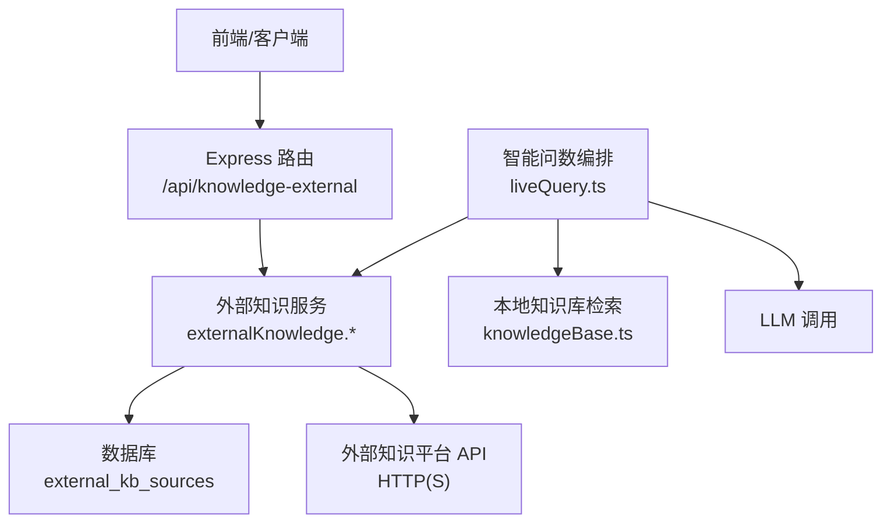
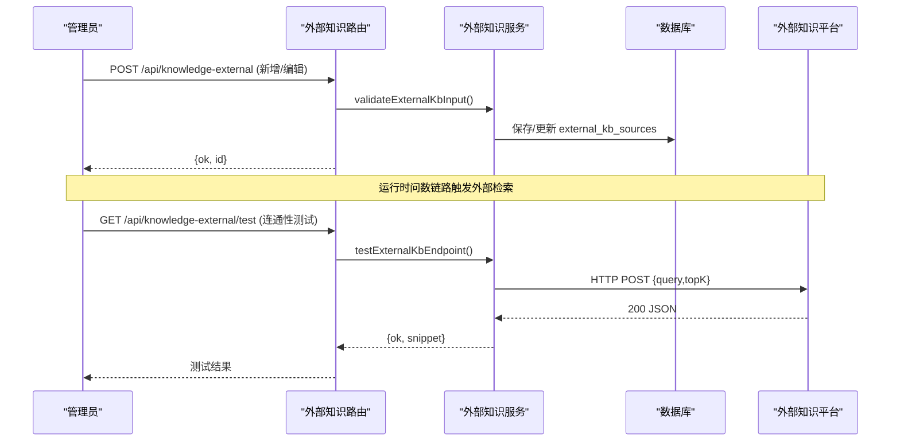
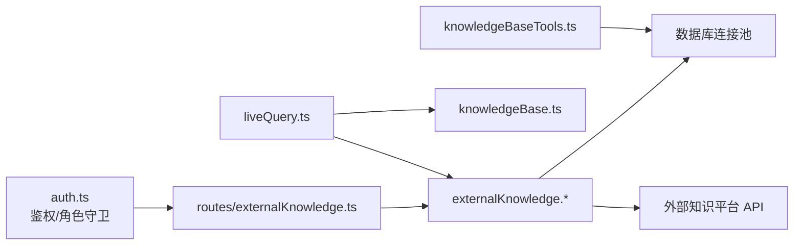

# 外部知识集成

<cite>
**本文引用的文件**
- [server/routes/externalKnowledge.ts](file://server/routes/externalKnowledge.ts)
- [server/knowledge/externalKnowledge.test.ts](file://server/knowledge/externalKnowledge.test.ts)
- [server/query/liveQuery.ts](file://server/query/liveQuery.ts)
- [server/auth/auth.ts](file://server/auth/auth.ts)
- [server/knowledge/knowledgeBase.ts](file://server/knowledge/knowledgeBase.ts)
- [server/knowledge/knowledgeServices.ts](file://server/knowledge/knowledgeServices.ts)
- [server/knowledge/knowledgeBaseTools.ts](file://server/knowledge/knowledgeBaseTools.ts)
</cite>

## 目录
1. [简介](#简介)
2. [项目结构](#项目结构)
3. [核心组件](#核心组件)
4. [架构总览](#架构总览)
5. [详细组件分析](#详细组件分析)
6. [依赖关系分析](#依赖关系分析)
7. [性能考虑](#性能考虑)
8. [故障诊断指南](#故障诊断指南)
9. [结论](#结论)
10. [附录](#附录)

## 简介
本文件面向“外部知识集成功能”，系统性说明如何对接外部知识平台，覆盖以下方面：
- API 对接机制：RESTful 接口调用、认证配置（Bearer/无认证）、请求体与超时控制、错误处理策略。
- 数据同步策略：增量/全量同步思路、冲突解决机制（导入策略）。
- 外部知识源适配层设计：协议抽象、数据映射、格式转换。
- 集成示例：常见知识平台对接、自定义 API 开发、Webhook 回调处理建议。
- 安全考虑：敏感信息保护、访问控制、审计日志。
- 性能优化：连接池管理、缓存策略、重试机制。
- 故障诊断：快速定位与排障方法。

## 项目结构
外部知识集成由“管理面”和“运行面”两部分组成：
- 管理面（管理员维护）：提供外部知识源的增删改查与连通性测试，统一在路由中受鉴权与角色守卫保护。
- 运行面（问数链路）：在智能问数的阶段一构建上下文时，并行检索所有适用的外部知识源，将结果注入提示词，增强 SQL 生成准确性。

图表来源
- [server/routes/externalKnowledge.ts:1-85](file://server/routes/externalKnowledge.ts#L1-L85)
- [server/query/liveQuery.ts:20-30](file://server/query/liveQuery.ts#L20-L30)
- [server/knowledge/knowledgeBase.ts:1-40](file://server/knowledge/knowledgeBase.ts#L1-L40)

章节来源
- [server/routes/externalKnowledge.ts:1-85](file://server/routes/externalKnowledge.ts#L1-L85)
- [server/query/liveQuery.ts:189-264](file://server/query/liveQuery.ts#L189-L264)

## 核心组件
- 外部知识源管理路由：提供 RESTful 接口用于外部知识源的列表、新增、编辑、删除与连通性测试；统一要求管理员权限。
- 外部知识检索服务：负责从数据库加载可用源、按数据源范围过滤、发起 HTTP 请求、解析响应、聚合片段并格式化输出。
- 问数编排集成：在阶段一构建上下文时，并行检索外部知识源，并将结果与本地知识库、指标、规则等一起注入提示词。
- 本地知识库与工具：提供切块、向量相似度、降级关键词检索、导入导出与冲突处理策略，作为对比与补充。

章节来源
- [server/routes/externalKnowledge.ts:1-85](file://server/routes/externalKnowledge.ts#L1-L85)
- [server/knowledge/externalKnowledge.test.ts:1-262](file://server/knowledge/externalKnowledge.test.ts#L1-L262)
- [server/query/liveQuery.ts:20-30](file://server/query/liveQuery.ts#L20-L30)
- [server/knowledge/knowledgeBase.ts:1-40](file://server/knowledge/knowledgeBase.ts#L1-L40)

## 架构总览
外部知识集成采用“管理面 + 运行面”的解耦设计：
- 管理面通过 Express 路由暴露 RESTful 接口，使用 JWT 鉴权与角色守卫，确保只有管理员可维护外部知识源。
- 运行面在问数链路中按需检索外部知识源，支持多源并行、单源失败降级、超时中断与响应容错解析。
- 外部知识源配置包含 endpoint、authType、apiKey、timeoutMs、dataSourceId、enabled 等字段，支持通配符匹配数据源范围。

图表来源
- [server/routes/externalKnowledge.ts:19-82](file://server/routes/externalKnowledge.ts#L19-L82)
- [server/knowledge/externalKnowledge.test.ts:74-123](file://server/knowledge/externalKnowledge.test.ts#L74-L123)

## 详细组件分析

### 外部知识源管理 API
- 列出外部知识源：GET /api/knowledge-external，返回源列表（不泄露密钥明文，仅标记是否已配置密钥）。
- 新增外部知识源：POST /api/knowledge-external，校验输入后保存，新增时 apiKey 加密落库。
- 编辑外部知识源：PUT /api/knowledge-external/:id，若未传 apiKey 则保留原值；若 authType 改为 none 则清空密钥。
- 删除外部知识源：DELETE /api/knowledge-external/:id。
- 连通性测试：POST /api/knowledge-external/test，使用表单当前值即时检索外部平台，不落库。

鉴权与授权：
- 所有接口均经过 authMiddleware 与 requireRole('ADMIN') 保护，确保仅管理员可操作。

章节来源
- [server/routes/externalKnowledge.ts:1-85](file://server/routes/externalKnowledge.ts#L1-L85)
- [server/auth/auth.ts:66-127](file://server/auth/auth.ts#L66-L127)

### 外部知识检索服务（运行期）
- 适用源筛选：根据 data_source_id 精确匹配或通配符 '*'，仅启用 enabled=1 的源参与检索。
- 并发检索：对每个适用源并行发起 HTTP 请求，单个源失败不影响其他源。
- 请求构造：POST JSON 请求体 { query, topK }；当 authType=bearer 时携带 Authorization: Bearer <apiKey>；Content-Type 为 application/json；支持 timeoutMs 超时中断。
- 响应解析：兼容多种容器字段（results/documents/data/items），自动提取文本片段，限制最大片段长度与数量，避免外部服务返回过大内容。
- 结果聚合：以“外部·源名”前缀格式化片段，统计 okSources/failSources，最终拼接为字符串注入提示词。

错误处理策略：
- 非 2xx 响应抛错，调用方捕获并降级为空结果，不阻断问数主链路。
- 数据库异常整体降级为空，保障可用性。
- 超时中断：基于 AbortController 实现，到达 timeoutMs 即中止未完成请求。

章节来源
- [server/knowledge/externalKnowledge.test.ts:18-52](file://server/knowledge/externalKnowledge.test.ts#L18-L52)
- [server/knowledge/externalKnowledge.test.ts:74-123](file://server/knowledge/externalKnowledge.test.ts#L74-L123)
- [server/knowledge/externalKnowledge.test.ts:125-206](file://server/knowledge/externalKnowledge.test.ts#L125-L206)

### 问数链路集成
- 在阶段一构建上下文时，并行加载 few-shot、本地知识库、外部知识库、指标、反例、对话沉淀、铁律规则等。
- 外部知识库结果以字符串形式注入系统提示词，与本地知识库共同约束口径、术语与枚举写法。
- 输出摘要中包含外部知识库命中字数及成功/失败源计数，便于观测与调优。

章节来源
- [server/query/liveQuery.ts:20-30](file://server/query/liveQuery.ts#L20-L30)
- [server/query/liveQuery.ts:221-264](file://server/query/liveQuery.ts#L221-L264)

### 本地知识库与导入导出（对比参考）
- 本地知识库支持切块、向量相似度检索与 bigram 关键词降级，保证在无 embedding 模型时仍可工作。
- 导入导出工具支持 JSON 格式备份与恢复，并提供冲突处理策略（replace/append/skip），便于跨环境迁移与版本管理。

章节来源
- [server/knowledge/knowledgeBase.ts:43-166](file://server/knowledge/knowledgeBase.ts#L43-L166)
- [server/knowledge/knowledgeBaseTools.ts:19-200](file://server/knowledge/knowledgeBaseTools.ts#L19-L200)

## 依赖关系分析
- 路由层依赖鉴权模块进行用户身份验证与角色检查。
- 外部知识服务依赖数据库连接池读取外部源配置，并在运行时发起 HTTP 请求至外部平台。
- 问数编排依赖外部知识服务与本地知识库服务，将结果注入提示词。
- 导入导出工具依赖类型定义与日志模块，提供结构化导入结果与操作日志。

图表来源
- [server/auth/auth.ts:66-127](file://server/auth/auth.ts#L66-L127)
- [server/routes/externalKnowledge.ts:1-85](file://server/routes/externalKnowledge.ts#L1-L85)
- [server/query/liveQuery.ts:20-30](file://server/query/liveQuery.ts#L20-L30)
- [server/knowledge/knowledgeBase.ts:1-40](file://server/knowledge/knowledgeBase.ts#L1-L40)
- [server/knowledge/knowledgeBaseTools.ts:1-200](file://server/knowledge/knowledgeBaseTools.ts#L1-L200)

章节来源
- [server/auth/auth.ts:66-127](file://server/auth/auth.ts#L66-L127)
- [server/routes/externalKnowledge.ts:1-85](file://server/routes/externalKnowledge.ts#L1-L85)
- [server/query/liveQuery.ts:20-30](file://server/query/liveQuery.ts#L20-L30)

## 性能考虑
- 并发检索：对外部知识源进行并行调用，提升召回速度；单源失败不阻塞其他源。
- 超时控制：通过 timeoutMs 限制单次请求耗时，避免长尾请求拖慢整体链路。
- 响应裁剪：限制单片段最大长度与最大片段数量，防止外部服务返回过大内容影响提示词预算。
- 连接池复用：数据库查询复用连接池，减少连接开销。
- 降级策略：外部服务不可用时降级为空结果，保障问数主链路可用性。
- 缓存建议（可选扩展）：对高频查询的外部知识片段可按 query+source 维度做短期缓存，降低重复请求压力。
- 重试机制（可选扩展）：对瞬时网络抖动可采用指数退避重试，但需结合幂等性与限流策略。

[本节为通用性能指导，不直接分析具体文件]

## 故障诊断指南
- 连通性测试：使用 /api/knowledge-external/test 接口，传入 endpoint、authType、apiKey、timeoutMs，验证外部平台可达性与鉴权有效性。
- 查看统计信息：问数输出摘要中包含外部知识库命中字数与成功/失败源计数，用于评估各源质量与稳定性。
- 错误定位：
  - 非 2xx 响应：检查外部平台状态码与返回体，确认鉴权头与请求体是否正确。
  - 超时中断：适当增大 timeoutMs 或排查外部平台响应时间。
  - 数据库异常：检查 external_kb_sources 表结构与数据，确认 enabled 与 data_source_id 匹配逻辑。
- 日志与埋点：结合系统日志与 trace 信息，定位具体失败源与调用链。

章节来源
- [server/routes/externalKnowledge.ts:66-82](file://server/routes/externalKnowledge.ts#L66-L82)
- [server/knowledge/externalKnowledge.test.ts:105-123](file://server/knowledge/externalKnowledge.test.ts#L105-L123)
- [server/query/liveQuery.ts:221-264](file://server/query/liveQuery.ts#L221-L264)

## 结论
外部知识集成功能通过管理面与运行面的解耦设计，实现了灵活、健壮且可扩展的外部知识接入能力。管理面提供安全的配置与维护接口，运行面在问数链路中并行检索、容错降级，确保主链路稳定。配合本地知识库与导入导出工具，可满足企业级知识管理与迁移需求。建议在生产环境中结合缓存、重试与监控告警，进一步提升性能与可靠性。

[本节为总结性内容，不直接分析具体文件]

## 附录

### API 对接机制
- RESTful 接口：
  - GET /api/knowledge-external：列出外部知识源（不泄露密钥明文）。
  - POST /api/knowledge-external：新增外部知识源。
  - PUT /api/knowledge-external/:id：编辑外部知识源。
  - DELETE /api/knowledge-external/:id：删除外部知识源。
  - POST /api/knowledge-external/test：连通性测试。
- 认证配置：
  - 管理接口需管理员角色（requireRole('ADMIN')）。
  - 外部平台鉴权支持 bearer（Authorization: Bearer <apiKey>）与 none。
- 请求体与超时：
  - 外部检索请求体为 { query, topK }。
  - 支持 timeoutMs 控制单次请求超时。
- 错误处理：
  - 非 2xx 响应抛错，调用方捕获并降级为空结果。
  - 数据库异常整体降级为空，不阻断问数主链路。

章节来源
- [server/routes/externalKnowledge.ts:19-82](file://server/routes/externalKnowledge.ts#L19-L82)
- [server/knowledge/externalKnowledge.test.ts:74-123](file://server/knowledge/externalKnowledge.test.ts#L74-L123)

### 数据同步策略
- 增量同步：通过 dataSourceId 与 enabled 字段筛选适用源，仅对变更源进行检索或更新。
- 全量同步：批量导入/导出知识库条目，支持 replace/append/skip 冲突策略。
- 冲突解决：
  - replace：用新内容覆盖现有条目。
  - append：追加新条目，跳过冲突项。
  - skip：保留现有条目，记录警告。

章节来源
- [server/knowledge/knowledgeBaseTools.ts:116-200](file://server/knowledge/knowledgeBaseTools.ts#L116-L200)

### 外部知识源适配层设计
- 协议抽象：统一封装 HTTP 请求、鉴权头、超时控制与响应解析。
- 数据映射：兼容多种响应容器字段（results/documents/data/items），提取文本片段并标准化。
- 格式转换：将外部片段转换为“外部·源名”前缀的字符串，便于注入提示词。

章节来源
- [server/knowledge/externalKnowledge.test.ts:18-52](file://server/knowledge/externalKnowledge.test.ts#L18-L52)
- [server/knowledge/externalKnowledge.test.ts:125-206](file://server/knowledge/externalKnowledge.test.ts#L125-L206)

### 集成示例
- 常见知识平台对接：配置 endpoint、authType=bearer、apiKey，设置 timeoutMs，使用测试接口验证连通性。
- 自定义 API 开发：遵循 { query, topK } 请求体与 results/documents/data/items 响应容器规范，确保鉴权头正确传递。
- Webhook 回调处理：可在外部平台侧实现回调通知，触发系统侧增量同步或重新索引；注意签名校验与幂等处理。

[本节为概念性示例，不直接分析具体文件]

### 安全考虑
- 敏感信息保护：apiKey 加密落库，列表接口不返回明文，仅标记是否已配置密钥。
- 访问控制：管理接口需管理员角色，问数链路对所有角色生效但仅读取配置。
- 审计日志：导入导出与关键操作记录日志，便于追踪与审计。

章节来源
- [server/knowledge/externalKnowledge.test.ts:208-261](file://server/knowledge/externalKnowledge.test.ts#L208-L261)
- [server/knowledge/knowledgeBaseTools.ts:192-197](file://server/knowledge/knowledgeBaseTools.ts#L192-L197)

### 性能优化建议
- 连接池管理：复用数据库连接池，减少连接开销。
- 缓存策略：对高频查询的外部知识片段进行短期缓存，降低重复请求。
- 重试机制：对瞬时网络抖动采用指数退避重试，结合幂等性与限流策略。
- 降级与熔断：外部服务不可用时快速降级，避免雪崩效应。

[本节为通用性能指导，不直接分析具体文件]