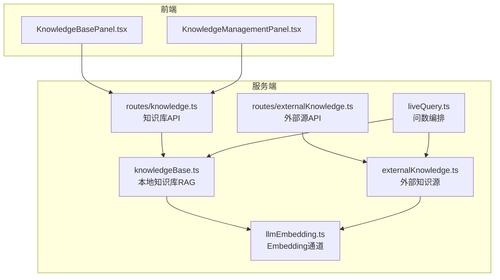
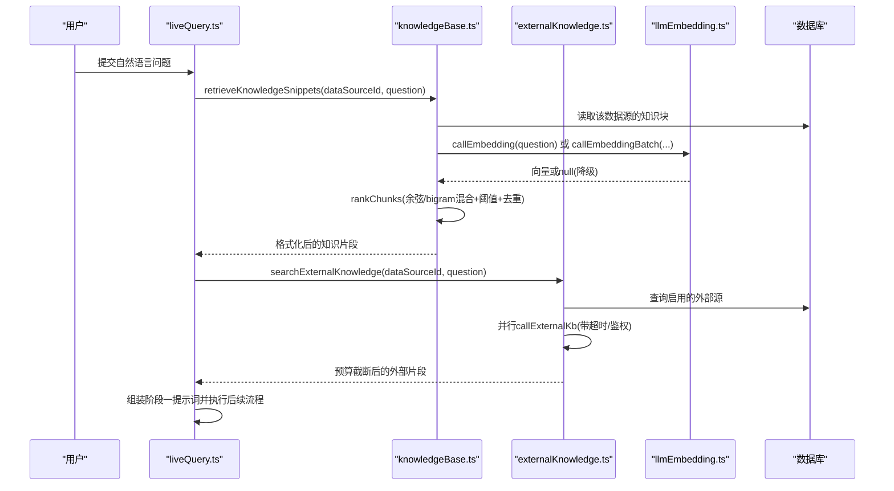
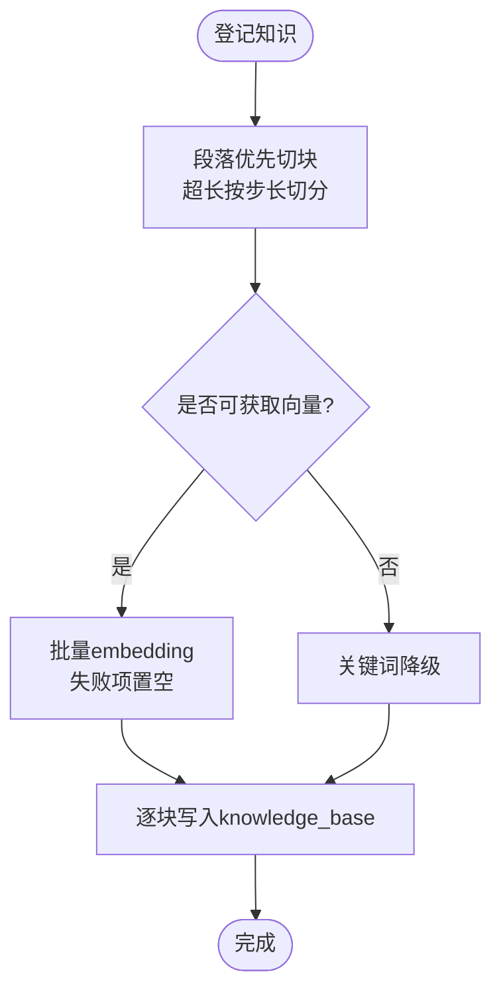
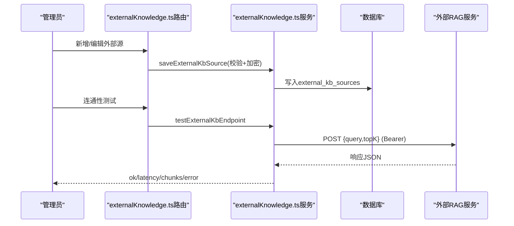
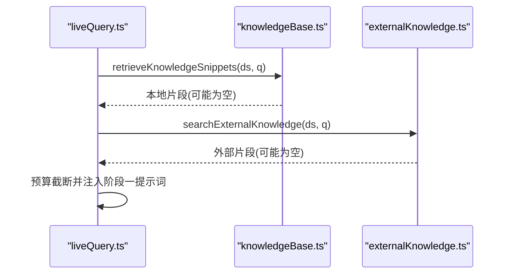
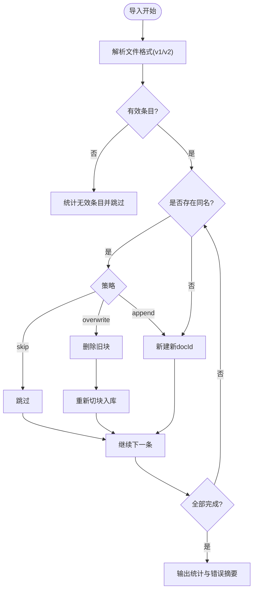
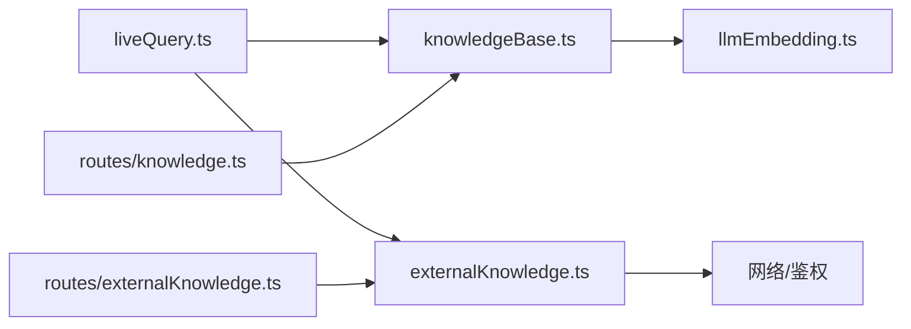

# 知识库系统

<cite>
**本文引用的文件**
- [server/knowledge/knowledgeBase.ts](file://server/knowledge/knowledgeBase.ts)
- [server/knowledge/externalKnowledge.ts](file://server/knowledge/externalKnowledge.ts)
- [server/knowledge/knowledgeServices.ts](file://server/knowledge/knowledgeServices.ts)
- [server/routes/knowledge.ts](file://server/routes/knowledge.ts)
- [server/routes/externalKnowledge.ts](file://server/routes/externalKnowledge.ts)
- [server/llm/llmEmbedding.ts](file://server/llm/llmEmbedding.ts)
- [server/query/liveQuery.ts](file://server/query/liveQuery.ts)
- [src/components/datasource/KnowledgeBasePanel.tsx](file://src/components/datasource/KnowledgeBasePanel.tsx)
- [src/components/knowledge/KnowledgeManagementPanel.tsx](file://src/components/knowledge/KnowledgeManagementPanel.tsx)
</cite>

## 目录
1. [简介](#简介)
2. [项目结构](#项目结构)
3. [核心组件](#核心组件)
4. [架构总览](#架构总览)
5. [详细组件分析](#详细组件分析)
6. [依赖关系分析](#依赖关系分析)
7. [性能与可扩展性](#性能与可扩展性)
8. [故障排查指南](#故障排查指南)
9. [结论](#结论)
10. [附录：使用示例与管理界面操作指南](#附录使用示例与管理界面操作指南)

## 简介
本知识库系统为智能问数提供“业务语义增强”能力，通过向量检索与外部知识源集成，在生成 SQL 前注入权威口径、术语与计算规则，降低大模型“自造口径”的风险。系统包含：
- 本地知识库（RAG）：文本切块、向量化、相似度排序、阈值过滤、关键词降级。
- 外部知识源集成：统一协议对接企业 RAG 服务，支持 Bearer 认证、超时控制、并行检索与预算截断。
- 管理面：文档级 CRUD、导入导出、冲突策略、预检 Dry Run。
- 问数链路融合：阶段一提示词组装时并行加载本地与外部知识片段，按 token 预算注入。

## 项目结构
知识库相关代码主要分布在 server 层与前端面板：
- server/knowledge：本地知识库与外部知识源的核心逻辑
- server/routes：对外暴露的 REST API
- server/llm：embedding 调用通道（Ollama/Qwen/Gemini），含缓存与批处理
- server/query：问数编排，聚合多路上下文（含知识库）
- src/components：知识库管理面板与导入导出 UI

图表来源
- [server/knowledge/knowledgeBase.ts:1-239](file://server/knowledge/knowledgeBase.ts#L1-L239)
- [server/knowledge/externalKnowledge.ts:1-273](file://server/knowledge/externalKnowledge.ts#L1-L273)
- [server/llm/llmEmbedding.ts:1-317](file://server/llm/llmEmbedding.ts#L1-L317)
- [server/routes/knowledge.ts:1-457](file://server/routes/knowledge.ts#L1-L457)
- [server/routes/externalKnowledge.ts:1-85](file://server/routes/externalKnowledge.ts#L1-L85)
- [server/query/liveQuery.ts:1-200](file://server/query/liveQuery.ts#L1-L200)
- [src/components/datasource/KnowledgeBasePanel.tsx:1-590](file://src/components/datasource/KnowledgeBasePanel.tsx#L1-L590)
- [src/components/knowledge/KnowledgeManagementPanel.tsx:1-259](file://src/components/knowledge/KnowledgeManagementPanel.tsx#L1-L259)

章节来源
- [server/knowledge/knowledgeBase.ts:1-239](file://server/knowledge/knowledgeBase.ts#L1-L239)
- [server/knowledge/externalKnowledge.ts:1-273](file://server/knowledge/externalKnowledge.ts#L1-L273)
- [server/routes/knowledge.ts:1-457](file://server/routes/knowledge.ts#L1-L457)
- [server/routes/externalKnowledge.ts:1-85](file://server/routes/externalKnowledge.ts#L1-L85)
- [server/llm/llmEmbedding.ts:1-317](file://server/llm/llmEmbedding.ts#L1-L317)
- [server/query/liveQuery.ts:1-200](file://server/query/liveQuery.ts#L1-L200)
- [src/components/datasource/KnowledgeBasePanel.tsx:1-590](file://src/components/datasource/KnowledgeBasePanel.tsx#L1-L590)
- [src/components/knowledge/KnowledgeManagementPanel.tsx:1-259](file://src/components/knowledge/KnowledgeManagementPanel.tsx#L1-L259)

## 核心组件
- 本地知识库（RAG）
  - 文本切块：段落优先合并，超长按步长切分，相邻块保留重叠避免语义断裂。
  - 向量化：批量 embedding，失败项置空走关键词降级；短 TTL 缓存复用。
  - 相似度与排序：余弦相似度 + bigram 混合加权；标题命中高价值关键词优先占位；单文档入选上限防字典类文档垄断。
  - 阈值过滤：向量模式设置最小相似度阈值，无关问题不注入凑数知识。
  - 持久化：按 doc_id 聚合，chunk 行存储 embedding_json。
- 外部知识源
  - 统一协议：POST JSON {query, topK}，响应兼容多种容器字段；Bearer 认证；超时中断。
  - 并行检索：按数据源范围筛选启用源，Promise.allSettled 聚合结果，异常降级为空。
  - 安全存储：api_key 加密落库，列表仅返回 hasKey 标记。
- 问数链路融合
  - 阶段一提示词组装时并行加载本地与外部知识片段，按 token 预算截断后注入。
  - 任何异常均降级为空串，不阻断主链路。
- 管理接口
  - 文档级 CRUD、导入导出、冲突策略（skip/overwrite/append）、Dry Run 预检。
  - 外部源 CRUD、连通性测试。

章节来源
- [server/knowledge/knowledgeBase.ts:43-166](file://server/knowledge/knowledgeBase.ts#L43-L166)
- [server/knowledge/externalKnowledge.ts:62-196](file://server/knowledge/externalKnowledge.ts#L62-L196)
- [server/query/liveQuery.ts:189-200](file://server/query/liveQuery.ts#L189-L200)
- [server/routes/knowledge.ts:60-457](file://server/routes/knowledge.ts#L60-L457)
- [server/routes/externalKnowledge.ts:19-85](file://server/routes/externalKnowledge.ts#L19-L85)

## 架构总览
知识库系统在“问数”流程中作为“业务语义增强”侧信道，与 Schema 元数据、指标、铁律等共同构成阶段一提示词上下文。

图表来源
- [server/query/liveQuery.ts:189-200](file://server/query/liveQuery.ts#L189-L200)
- [server/knowledge/knowledgeBase.ts:206-239](file://server/knowledge/knowledgeBase.ts#L206-L239)
- [server/knowledge/externalKnowledge.ts:149-196](file://server/knowledge/externalKnowledge.ts#L149-L196)
- [server/llm/llmEmbedding.ts:60-162](file://server/llm/llmEmbedding.ts#L60-L162)

## 详细组件分析

### 本地知识库（RAG）
- 文本切块
  - 先按换行段落合并至 chunkSize，超长再按步长切分，相邻块保留 overlap，保证语义连贯。
- 向量化与缓存
  - 支持 Ollama/Qwen/Gemini 三种后端；短 TTL 缓存减少重复调用；批量接口降低往返次数。
- 相似度与排序
  - 向量可用则用余弦相似度，否则回退 bigram 关键词；设置最小相似度阈值过滤无关片段；同一文档最多入选固定数量块；对标题命中“口径/指南/枚举/对比/模式”等高价值关键词的块预留一个槽位，防止被字典类文档挤占。
- 持久化
  - 保存时将标题与内容拼接为每块输入，批量 embedding 写入 knowledge_base 表；编辑时删除旧块并以原 docId 重新切块入库。

图表来源
- [server/knowledge/knowledgeBase.ts:43-75](file://server/knowledge/knowledgeBase.ts#L43-L75)
- [server/knowledge/knowledgeBase.ts:170-197](file://server/knowledge/knowledgeBase.ts#L170-L197)
- [server/llm/llmEmbedding.ts:260-315](file://server/llm/llmEmbedding.ts#L260-L315)

章节来源
- [server/knowledge/knowledgeBase.ts:43-166](file://server/knowledge/knowledgeBase.ts#L43-L166)
- [server/knowledge/knowledgeBase.ts:170-239](file://server/knowledge/knowledgeBase.ts#L170-L239)
- [server/llm/llmEmbedding.ts:60-162](file://server/llm/llmEmbedding.ts#L60-L162)
- [server/llm/llmEmbedding.ts:260-315](file://server/llm/llmEmbedding.ts#L260-L315)

### 外部知识源集成
- 配置校验
  - 名称必填；endpoint 必须 http(s)；超时 500~30000ms；bearer 需填写 apiKey。
- 检索协议
  - POST JSON {query, topK}；响应兼容 results/documents/data/items 四种容器；每项取 content/text/chunk/pageContent 之一；source/title 可选作来源标注；单片段限长、最多取 20 条。
- 并行检索与降级
  - 按 enabled=1 且 data_source_id 匹配当前数据源或通配符 '*' 筛选；Promise.allSettled 并行调用；任一失败不影响其他源；整体异常降级为空。
- 安全存储
  - api_key 以 AES 加密落库；列表不返回明文，仅 hasKey 标记；编辑时留空保留原密钥，改为 none 清空密钥。

图表来源
- [server/routes/externalKnowledge.ts:19-85](file://server/routes/externalKnowledge.ts#L19-L85)
- [server/knowledge/externalKnowledge.ts:62-135](file://server/knowledge/externalKnowledge.ts#L62-L135)
- [server/knowledge/externalKnowledge.ts:210-273](file://server/knowledge/externalKnowledge.ts#L210-L273)

章节来源
- [server/knowledge/externalKnowledge.ts:62-196](file://server/knowledge/externalKnowledge.ts#L62-L196)
- [server/knowledge/externalKnowledge.ts:210-273](file://server/knowledge/externalKnowledge.ts#L210-L273)
- [server/routes/externalKnowledge.ts:19-85](file://server/routes/externalKnowledge.ts#L19-L85)

### 问数链路中的知识注入
- 阶段一提示词构建时，并行加载本地与外部知识片段，按 token 预算截断后注入。
- 本地检索：retrieveKnowledgeSnippets 从 knowledge_base 读取并按 rankChunks 排序；无向量时回退 bigram。
- 外部检索：searchExternalKnowledge 并行调用多个外部源，聚合格式化后按预算截断。
- 任何异常均降级为空串，确保问数主链路可用性。

图表来源
- [server/query/liveQuery.ts:189-200](file://server/query/liveQuery.ts#L189-L200)
- [server/knowledge/knowledgeBase.ts:206-239](file://server/knowledge/knowledgeBase.ts#L206-L239)
- [server/knowledge/externalKnowledge.ts:149-196](file://server/knowledge/externalKnowledge.ts#L149-L196)

章节来源
- [server/query/liveQuery.ts:189-200](file://server/query/liveQuery.ts#L189-L200)
- [server/knowledge/knowledgeBase.ts:206-239](file://server/knowledge/knowledgeBase.ts#L206-L239)
- [server/knowledge/externalKnowledge.ts:149-196](file://server/knowledge/externalKnowledge.ts#L149-L196)

### 版本管理与批量操作
- 导入导出
  - 导出：按 doc 聚合还原原文，输出 JSON 备份（含 version/type/exportedAt 等元信息）。
  - 导入：支持 v2（knowledge-docs）与 v1（knowledgeBase 条目数组）格式；冲突按同数据源下同名 title 判定；策略 skip/overwrite/append；dryRun 仅预检不写库。
- 审计追踪
  - 记录 created_by/updated_by 与时间戳；导入日志记录 dryRun、strategy、dataSourceId、计数与错误。
- 预置条目保护
  - 预置条目不可编辑/删除，防止误改系统默认知识。

图表来源
- [server/routes/knowledge.ts:237-375](file://server/routes/knowledge.ts#L237-L375)
- [server/knowledge/knowledgeServices.ts:121-206](file://server/knowledge/knowledgeServices.ts#L121-L206)

章节来源
- [server/routes/knowledge.ts:159-375](file://server/routes/knowledge.ts#L159-L375)
- [server/knowledge/knowledgeServices.ts:121-206](file://server/knowledge/knowledgeServices.ts#L121-L206)

### 知识图谱构建（说明）
当前仓库未实现显式的“实体识别—关系抽取—知识融合”图构建管线。若需扩展，建议：
- 实体识别：基于领域词典与大模型命名实体识别，抽取指标、维度、枚举值等。
- 关系抽取：定义三元组 schema（如“指标A 由 指标B/列C 计算”），结合规则与大模型抽取。
- 知识融合：按实体 ID 对齐、冲突消解（优先级/来源权重）、增量更新。
- 存储与检索：图数据库或关系型表（节点/边），并提供与现有 RAG 的桥接（将图查询结果转为片段注入）。

[本节为概念性说明，不直接分析具体文件]

## 依赖关系分析
- 本地知识库依赖 embedding 通道，支持多后端与缓存；检索失败自动降级关键词。
- 外部知识源依赖网络访问与鉴权，具备超时与容错；列表不泄露密钥。
- 问数编排依赖知识库与外部知识源，任何异常降级为空，保障主链路稳定。
- 管理路由对写操作要求 ADMIN 角色，读操作对所有登录用户开放。

图表来源
- [server/knowledge/knowledgeBase.ts:1-239](file://server/knowledge/knowledgeBase.ts#L1-L239)
- [server/knowledge/externalKnowledge.ts:1-273](file://server/knowledge/externalKnowledge.ts#L1-L273)
- [server/llm/llmEmbedding.ts:1-317](file://server/llm/llmEmbedding.ts#L1-L317)
- [server/query/liveQuery.ts:1-200](file://server/query/liveQuery.ts#L1-L200)
- [server/routes/knowledge.ts:1-457](file://server/routes/knowledge.ts#L1-L457)
- [server/routes/externalKnowledge.ts:1-85](file://server/routes/externalKnowledge.ts#L1-L85)

章节来源
- [server/knowledge/knowledgeBase.ts:1-239](file://server/knowledge/knowledgeBase.ts#L1-L239)
- [server/knowledge/externalKnowledge.ts:1-273](file://server/knowledge/externalKnowledge.ts#L1-L273)
- [server/llm/llmEmbedding.ts:1-317](file://server/llm/llmEmbedding.ts#L1-L317)
- [server/query/liveQuery.ts:1-200](file://server/query/liveQuery.ts#L1-L200)
- [server/routes/knowledge.ts:1-457](file://server/routes/knowledge.ts#L1-L457)
- [server/routes/externalKnowledge.ts:1-85](file://server/routes/externalKnowledge.ts#L1-L85)

## 性能与可扩展性
- 向量检索
  - 短 TTL 缓存减少重复 embedding 调用；批量 embedding 降低往返次数；topK 与 perDoc 限制控制注入量。
  - 阈值过滤避免无关知识稀释注意力；bigram 降级保证无向量时仍可检索。
- 外部知识源
  - 并行检索提升吞吐；超时中断避免阻塞；预算截断控制注入长度。
- 导入导出
  - 导出按 doc 聚合还原原文，便于人工审阅；导入支持 dryRun 预检，降低误操作风险。
- 可扩展点
  - 增加更多外部源类型（OAuth2、签名等）；引入图检索结果作为片段；优化 chunk 策略（句法边界、领域词典）。

[本节提供通用指导，不直接分析具体文件]

## 故障排查指南
- 无法生成向量
  - 检查 embedding 模型是否安装（如 nomic-embed-text）；确认后端可达；查看缓存命中情况。
- 检索结果为空
  - 确认已登记知识并成功切块；检查最小相似度阈值是否过高；验证数据源隔离是否正确。
- 外部源不可用
  - 检查 endpoint 与鉴权；确认超时设置合理；查看连通性测试结果与错误消息。
- 导入失败
  - 确认文件格式正确（v1/v2）；检查目标数据源是否存在；根据 dryRun 结果调整策略。
- 权限问题
  - 写操作需 ADMIN 角色；确认当前用户角色；检查路由中间件是否生效。

章节来源
- [server/knowledge/knowledgeBase.ts:206-239](file://server/knowledge/knowledgeBase.ts#L206-L239)
- [server/knowledge/externalKnowledge.ts:62-135](file://server/knowledge/externalKnowledge.ts#L62-L135)
- [server/routes/knowledge.ts:93-107](file://server/routes/knowledge.ts#L93-L107)
- [server/routes/externalKnowledge.ts:66-85](file://server/routes/externalKnowledge.ts#L66-L85)

## 结论
本知识库系统通过“本地 RAG + 外部知识源”的双通道增强，为智能问数提供稳定的业务语义注入。系统设计强调健壮性（降级、预算、超时）、可维护性（CRUD、导入导出、预检）与安全（鉴权、密钥加密）。未来可在图构建、更细粒度 chunk 策略与多源融合方面持续演进。

[本节总结性内容，不直接分析具体文件]

## 附录：使用示例与管理界面操作指南

### 使用示例
- 登记业务知识
  - 选择数据源，点击“登记知识”，填写标题与内容，保存后自动切块并生成向量。
- 查看知识详情
  - 在列表中点击“查看详情”，可查看切块明细与创建信息。
- 编辑与删除
  - 管理员可对非预置条目进行编辑或删除；编辑会重新切块并生成新向量。
- 导入导出
  - 导出：选择数据源后点击“导出”，下载 JSON 备份。
  - 导入：选择 JSON 文件，选择冲突策略（跳过/覆盖/新增），可开启 Dry Run 预检后再执行真实导入。
- 外部知识源
  - 管理员新增外部源，配置 endpoint 与鉴权；使用“连通性测试”验证；问数时自动并行检索并注入。

章节来源
- [src/components/datasource/KnowledgeBasePanel.tsx:65-130](file://src/components/datasource/KnowledgeBasePanel.tsx#L65-L130)
- [src/components/datasource/KnowledgeBasePanel.tsx:165-234](file://src/components/datasource/KnowledgeBasePanel.tsx#L165-L234)
- [src/components/knowledge/KnowledgeManagementPanel.tsx:28-125](file://src/components/knowledge/KnowledgeManagementPanel.tsx#L28-L125)
- [server/routes/knowledge.ts:60-457](file://server/routes/knowledge.ts#L60-L457)
- [server/routes/externalKnowledge.ts:19-85](file://server/routes/externalKnowledge.ts#L19-L85)

### 管理界面操作要点
- 权限控制：写操作需 ADMIN；读操作对所有登录用户开放。
- 冲突策略：导入前建议先 Dry Run 预检，确认变更范围后再执行真实导入。
- 质量评估：关注“高价值关键词”命中率与阈值设置；必要时调整 CHUNK_SIZE/OVERLAP/TOP_K/MIN_SCORE。
- 优化建议：
  - 对长文档采用分段标题与结构化内容，提升切块质量。
  - 定期清理低命中率知识，避免噪声干扰。
  - 外部源接入前做好连通性与稳定性测试，合理设置超时与 topK。

章节来源
- [server/knowledge/knowledgeBase.ts:13-41](file://server/knowledge/knowledgeBase.ts#L13-L41)
- [server/knowledge/knowledgeBase.ts:106-166](file://server/knowledge/knowledgeBase.ts#L106-L166)
- [server/knowledge/externalKnowledge.ts:62-73](file://server/knowledge/externalKnowledge.ts#L62-L73)
- [server/routes/knowledge.ts:237-375](file://server/routes/knowledge.ts#L237-L375)