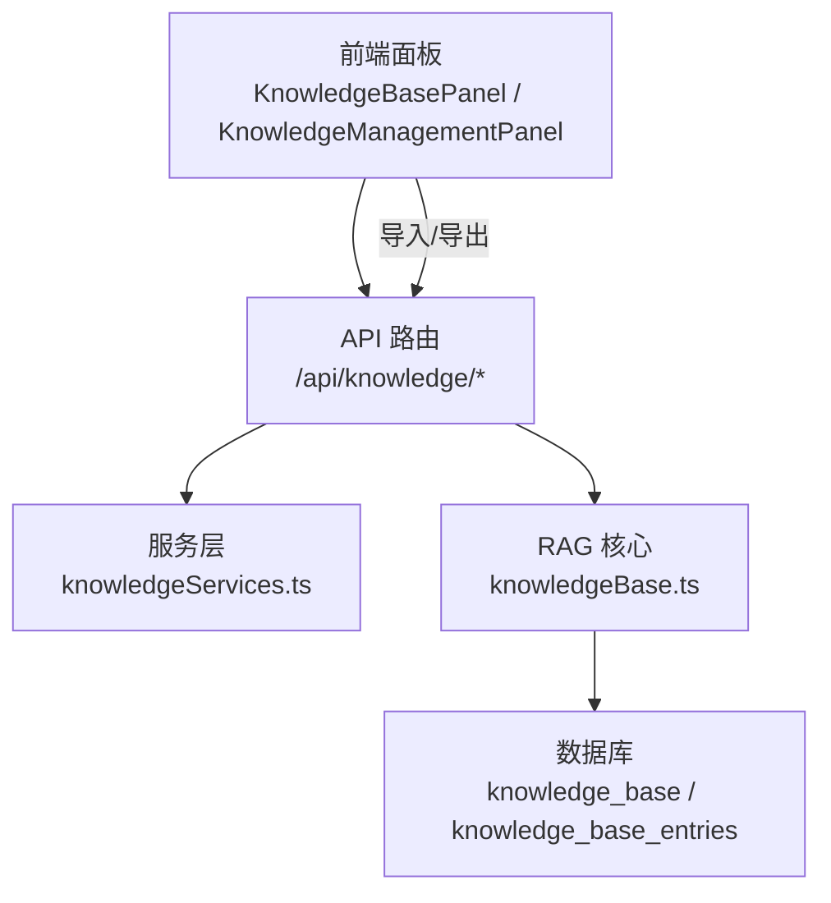
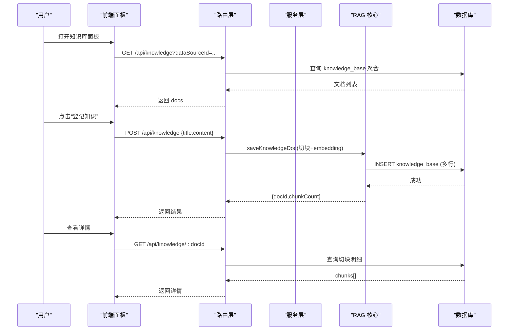
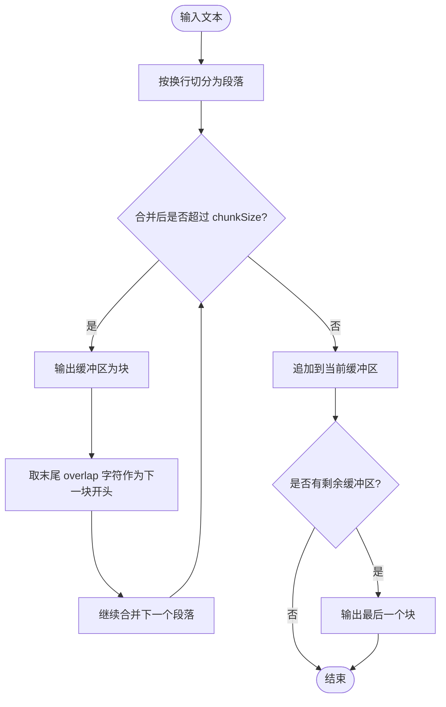
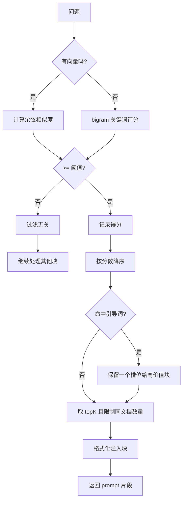
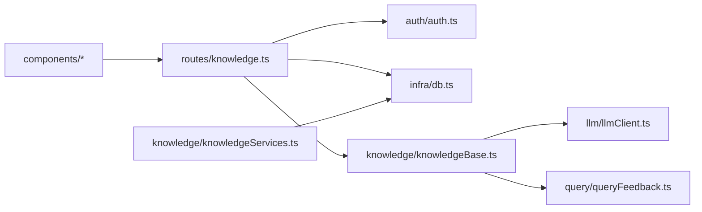

# 知识管理

<cite>
**本文引用的文件**
- [server/knowledge/knowledgeBase.ts](file://server/knowledge/knowledgeBase.ts)
- [server/knowledge/knowledgeServices.ts](file://server/knowledge/knowledgeServices.ts)
- [server/routes/knowledge.ts](file://server/routes/knowledge.ts)
- [src/components/datasource/KnowledgeBasePanel.tsx](file://src/components/datasource/KnowledgeBasePanel.tsx)
- [src/components/knowledge/KnowledgeManagementPanel.tsx](file://src/components/knowledge/KnowledgeManagementPanel.tsx)
- [scripts/restore-knowledge-entries.ts](file://scripts/restore-knowledge-entries.ts)
- [server/knowledge/knowledgeBase.test.ts](file://server/knowledge/knowledgeBase.test.ts)
</cite>

## 目录
1. [简介](#简介)
2. [项目结构](#项目结构)
3. [核心组件](#核心组件)
4. [架构总览](#架构总览)
5. [详细组件分析](#详细组件分析)
6. [依赖关系分析](#依赖关系分析)
7. [性能考量](#性能考量)
8. [故障排查指南](#故障排查指南)
9. [结论](#结论)
10. [附录](#附录)

## 简介
本文件面向“知识管理”功能，覆盖知识文档的创建、编辑、删除与版本控制；阐述知识切块算法（段落优先、定长兜底、重叠窗口）；说明检索质量评估（完整性检查、重复检测、格式验证）；提供管理界面操作指南（知识库面板使用、批量导入导出、知识预览）；给出最佳实践（编写规范、命名约定、分类组织策略）；并包含数据迁移与备份恢复流程，确保知识资产的安全性与可维护性。

## 项目结构
知识管理由服务端路由、服务层、RAG 检索与前端面板共同组成：
- 路由层：对外暴露 REST API，负责鉴权、参数校验、调用服务层。
- 服务层：封装数据库访问、种子数据初始化、条目模型 CRUD。
- RAG 核心：实现文本切块、向量检索与关键词降级、片段排序与格式化注入。
- 前端面板：提供知识库的查看、新增、编辑、删除、详情预览、导入导出等交互。

图表来源
- [server/routes/knowledge.ts:1-457](file://server/routes/knowledge.ts#L1-L457)
- [server/knowledge/knowledgeServices.ts:1-260](file://server/knowledge/knowledgeServices.ts#L1-L260)
- [server/knowledge/knowledgeBase.ts:1-239](file://server/knowledge/knowledgeBase.ts#L1-L239)
- [src/components/datasource/KnowledgeBasePanel.tsx:1-590](file://src/components/datasource/KnowledgeBasePanel.tsx#L1-L590)
- [src/components/knowledge/KnowledgeManagementPanel.tsx:1-259](file://src/components/knowledge/KnowledgeManagementPanel.tsx#L1-L259)

章节来源
- [server/routes/knowledge.ts:1-457](file://server/routes/knowledge.ts#L1-L457)
- [server/knowledge/knowledgeServices.ts:1-260](file://server/knowledge/knowledgeServices.ts#L1-L260)
- [server/knowledge/knowledgeBase.ts:1-239](file://server/knowledge/knowledgeBase.ts#L1-L239)
- [src/components/datasource/KnowledgeBasePanel.tsx:1-590](file://src/components/datasource/KnowledgeBasePanel.tsx#L1-L590)
- [src/components/knowledge/KnowledgeManagementPanel.tsx:1-259](file://src/components/knowledge/KnowledgeManagementPanel.tsx#L1-L259)

## 核心组件
- 知识文档生命周期（doc/chunk 模型）
  - 登记：POST /api/knowledge，按内容切块并生成 embedding，落库至 knowledge_base。
  - 列表：GET /api/knowledge?dataSourceId=xxx，按 doc 聚合统计 chunkCount 等元信息。
  - 详情：GET /api/knowledge/:docId，返回切块明细与元信息。
  - 编辑：PUT /api/knowledge/:docId，删除旧块后以同一 docId 重新切块入库。
  - 删除：DELETE /api/knowledge/:docId，删除该文档全部切块。
- 导入/导出（真实切块入库）
  - 导出：GET /api/knowledge/export?dataSourceId=xxx，还原原文并输出 JSON。
  - 导入：POST /api/knowledge/import，支持 skip/overwrite/append 冲突策略与 dryRun 预检。
- 条目模型（P3-1 遗留展示）
  - 获取预置条目、全量条目、按 ID 查询、更新与删除（预置不可改删）。
  - 种子数据初始化：应用启动或脚本恢复时写入 knowledge_base_entries。

章节来源
- [server/routes/knowledge.ts:58-457](file://server/routes/knowledge.ts#L58-L457)
- [server/knowledge/knowledgeServices.ts:11-260](file://server/knowledge/knowledgeServices.ts#L11-L260)

## 架构总览
知识管理的请求处理链路如下：

图表来源
- [server/routes/knowledge.ts:69-107](file://server/routes/knowledge.ts#L69-L107)
- [server/knowledge/knowledgeBase.ts:170-197](file://server/knowledge/knowledgeBase.ts#L170-L197)
- [server/routes/knowledge.ts:389-413](file://server/routes/knowledge.ts#L389-L413)

## 详细组件分析

### 知识切块算法（段落优先、定长兜底、重叠窗口）
- 段落优先：按换行切分段落，逐段合并到不超过 chunkSize 的块内。
- 定长兜底：若单段超长，则按步长 step = chunkSize - overlap 滑动切分，保证每块长度可控。
- 重叠窗口：相邻块保留 overlap 字符，避免语义在边界被截断。
- 去重拼接：导出时通过“最长后缀-前缀匹配”去除重叠导致的重复，还原完整原文。

图表来源
- [server/knowledge/knowledgeBase.ts:43-75](file://server/knowledge/knowledgeBase.ts#L43-L75)
- [server/routes/knowledge.ts:33-51](file://server/routes/knowledge.ts#L33-L51)

章节来源
- [server/knowledge/knowledgeBase.ts:43-75](file://server/knowledge/knowledgeBase.ts#L43-L75)
- [server/routes/knowledge.ts:33-51](file://server/routes/knowledge.ts#L33-L51)

### 检索与质量评估（完整性、重复、格式）
- 检索模式
  - 向量模式：计算问题与块的余弦相似度，低于阈值（默认 0.35，可通过环境变量调整）视为无关不注入。
  - 关键词降级：当无向量时回退到 bigram 重叠评分，维持 score>0 过滤。
- 排序与限制
  - topK：默认 6，提升口径/枚举类知识命中率。
  - 同文档上限：防止单一长字典文档占满槽位。
  - 引导词保留：标题命中“口径/指南/速查/规则/枚举/对比/模式”的高价值文档至少保留一个槽位，采用混合打分（向量分 + 词法分权重）选择最佳块。
- 质量保障
  - 完整性：空内容直接拒绝登记；导入时过滤缺标题或内容的无效条目。
  - 重复检测：导入时基于“同数据源下同 title”判定冲突，支持跳过/覆盖/新增策略。
  - 格式验证：导出文件兼容 v2（knowledge-docs）与 v1（knowledgeBase 条目数组），统一归一化后再处理。

图表来源
- [server/knowledge/knowledgeBase.ts:77-166](file://server/knowledge/knowledgeBase.ts#L77-L166)
- [server/knowledge/knowledgeBase.test.ts:37-78](file://server/knowledge/knowledgeBase.test.ts#L37-L78)

章节来源
- [server/knowledge/knowledgeBase.ts:77-166](file://server/knowledge/knowledgeBase.ts#L77-L166)
- [server/knowledge/knowledgeBase.test.ts:37-78](file://server/knowledge/knowledgeBase.test.ts#L37-L78)

### 版本控制机制
- 编辑即重建：编辑知识文档时，先删除该 docId 下的所有旧块，再以相同 docId 重新切块入库，embedding 同步重建，保证检索一致性。
- 导入覆盖：导入时若选择 overwrite，会删除目标数据源下同名文档的全部块，再重新切块入库。
- 预置保护：条目模型中预置知识不可修改或删除，避免破坏系统内置口径。

章节来源
- [server/routes/knowledge.ts:420-442](file://server/routes/knowledge.ts#L420-L442)
- [server/routes/knowledge.ts:322-358](file://server/routes/knowledge.ts#L322-L358)
- [server/knowledge/knowledgeServices.ts:126-206](file://server/knowledge/knowledgeServices.ts#L126-L206)

### 管理界面操作指南
- 知识库面板（KnowledgeBasePanel）
  - 选择数据源：下拉切换不同数据源的知识集合。
  - 登记知识：填写标题与内容，保存后自动切块并生成向量。
  - 查看详情：查看切块明细与元信息（片段序号、作者、时间）。
  - 编辑/删除：管理员权限可用，编辑将重建切块，删除将移除全部块。
  - 导入/导出：管理员权限可用，导出为 JSON 备份；导入支持冲突策略与 dryRun 预检。
- 知识库管理面板（KnowledgeManagementPanel）
  - 导出：一键下载当前数据源的知识备份文件。
  - 导入：上传 JSON 文件，选择冲突策略（跳过/覆盖/新增），可仅预检不写库。
  - 状态反馈：显示导入结果摘要与错误明细。

章节来源
- [src/components/datasource/KnowledgeBasePanel.tsx:65-130](file://src/components/datasource/KnowledgeBasePanel.tsx#L65-L130)
- [src/components/datasource/KnowledgeBasePanel.tsx:165-234](file://src/components/datasource/KnowledgeBasePanel.tsx#L165-L234)
- [src/components/datasource/KnowledgeBasePanel.tsx:236-587](file://src/components/datasource/KnowledgeBasePanel.tsx#L236-L587)
- [src/components/knowledge/KnowledgeManagementPanel.tsx:28-125](file://src/components/knowledge/KnowledgeManagementPanel.tsx#L28-L125)
- [src/components/knowledge/KnowledgeManagementPanel.tsx:127-256](file://src/components/knowledge/KnowledgeManagementPanel.tsx#L127-L256)

### 最佳实践建议
- 知识编写规范
  - 明确业务口径、术语定义与计算规则，避免模糊表述。
  - 使用清晰的分段与标题，便于切块与检索命中。
  - 控制单篇长度，合理分段有助于提高召回质量。
- 命名约定
  - 标题简洁明确，如“不良率口径”“客户类型枚举”。
  - 避免过长标题导致存储与展示压力。
- 分类组织策略
  - 按业务域或指标族分类，便于管理与检索。
  - 对高频口径与复杂分析规则给予更高优先级（利用引导词机制）。
- 导入与变更
  - 变更前先导出备份，使用 dryRun 预检确认影响范围。
  - 覆盖模式用于正式替换，新增模式用于并行演进与灰度。

[本节为通用指导，不直接分析具体文件]

### 数据迁移与备份恢复流程
- 备份导出
  - 通过导出接口获取 JSON 备份，包含还原后的原文与原始切块序列。
- 恢复导入
  - 支持两种文件格式：v2（knowledge-docs）与 v1（knowledgeBase 条目数组）。
  - 冲突策略：skip（跳过）、overwrite（覆盖）、append（新增）。
  - 预检模式：dryRun=true 仅统计变更，不实际写入。
- 种子数据恢复
  - 使用脚本 restore-knowledge-entries.ts 将预置知识条目写入 knowledge_base_entries 表，幂等设计可重复执行。

章节来源
- [server/routes/knowledge.ts:159-224](file://server/routes/knowledge.ts#L159-L224)
- [server/routes/knowledge.ts:249-375](file://server/routes/knowledge.ts#L249-L375)
- [scripts/restore-knowledge-entries.ts:1-100](file://scripts/restore-knowledge-entries.ts#L1-L100)

## 依赖关系分析
- 路由层依赖
  - 鉴权中间件：requireRole('ADMIN') 控制写操作权限。
  - 数据库连接池：getPool() 访问 MySQL。
  - RAG 核心：saveKnowledgeDoc、retrieveKnowledgeSnippets。
- 服务层依赖
  - 数据库连接池：CRUD 操作 knowledge_base_entries。
  - 日志：记录导入/导出与异常。
- RAG 核心依赖
  - LLM 客户端：callEmbeddingBatch 批量生成向量，失败降级为 null。
  - 关键词检索：bigramOverlap 作为降级方案。
- 前端依赖
  - API 客户端：apiFetch 调用后端接口。
  - 状态管理：useAuthStore 判断管理员权限。

图表来源
- [server/routes/knowledge.ts:25-31](file://server/routes/knowledge.ts#L25-L31)
- [server/knowledge/knowledgeBase.ts:8-11](file://server/knowledge/knowledgeBase.ts#L8-L11)
- [server/knowledge/knowledgeServices.ts:6-9](file://server/knowledge/knowledgeServices.ts#L6-L9)

章节来源
- [server/routes/knowledge.ts:25-31](file://server/routes/knowledge.ts#L25-L31)
- [server/knowledge/knowledgeBase.ts:8-11](file://server/knowledge/knowledgeBase.ts#L8-L11)
- [server/knowledge/knowledgeServices.ts:6-9](file://server/knowledge/knowledgeServices.ts#L6-L9)

## 性能考量
- 批量化嵌入：使用 callEmbeddingBatch 批量生成向量，减少往返次数，整体失败时降级为关键词检索，保障主链路可用性。
- 阈值过滤：向量模式下设置相关性阈值，避免无关知识稀释上下文。
- 同文档上限：防止大字典文档占据过多槽位，提升多样性和命中率。
- 导出拼接优化：通过“最长后缀-前缀匹配”去重，降低冗余传输与存储。

[本节为通用讨论，不直接分析具体文件]

## 故障排查指南
- 常见问题
  - 内容为空无法切块：登记或导入时若内容为空将被拒绝。
  - 目标数据源不存在：导入时需指定有效的 dataSourceId。
  - 文件格式不支持：导入需为知识库导出 JSON（含 docs 或 knowledgeBase 字段）。
  - 预置条目不可改删：尝试修改或删除预置知识会抛出错误。
- 定位方法
  - 查看导入结果中的 errors 列表，定位失败条目与原因。
  - 使用 dryRun 预检确认变更范围，避免误操作。
  - 检查环境变量 KNOWLEDGE_MIN_SCORE 是否配置合理。

章节来源
- [server/routes/knowledge.ts:93-107](file://server/routes/knowledge.ts#L93-L107)
- [server/routes/knowledge.ts:249-287](file://server/routes/knowledge.ts#L249-L287)
- [server/knowledge/knowledgeServices.ts:126-206](file://server/knowledge/knowledgeServices.ts#L126-L206)

## 结论
知识管理模块提供了完整的知识文档生命周期管理能力，结合段落优先的切块算法与向量/关键词双模检索，有效提升了问数链路的业务准确性。通过严格的导入导出与版本控制机制，保障了知识资产的安全性与可维护性。建议遵循最佳实践进行知识编写与组织，并结合预检与备份恢复流程，确保变更可控、风险最小化。

[本节为总结，不直接分析具体文件]

## 附录
- 关键常量与配置
  - CHUNK_SIZE、CHUNK_OVERLAP：切块大小与重叠窗口。
  - TOP_K_CHUNKS：检索返回片段数量。
  - MAX_CHUNKS_PER_DOC：单文档最多入选块数。
  - GUIDED_DOC_KEYWORDS：高价值文档关键词集合。
  - knowledgeMinScore：向量相关性阈值（默认 0.35，可通过环境变量调整）。

章节来源
- [server/knowledge/knowledgeBase.ts:13-25](file://server/knowledge/knowledgeBase.ts#L13-L25)
- [server/knowledge/knowledgeBase.ts:34-41](file://server/knowledge/knowledgeBase.ts#L34-L41)