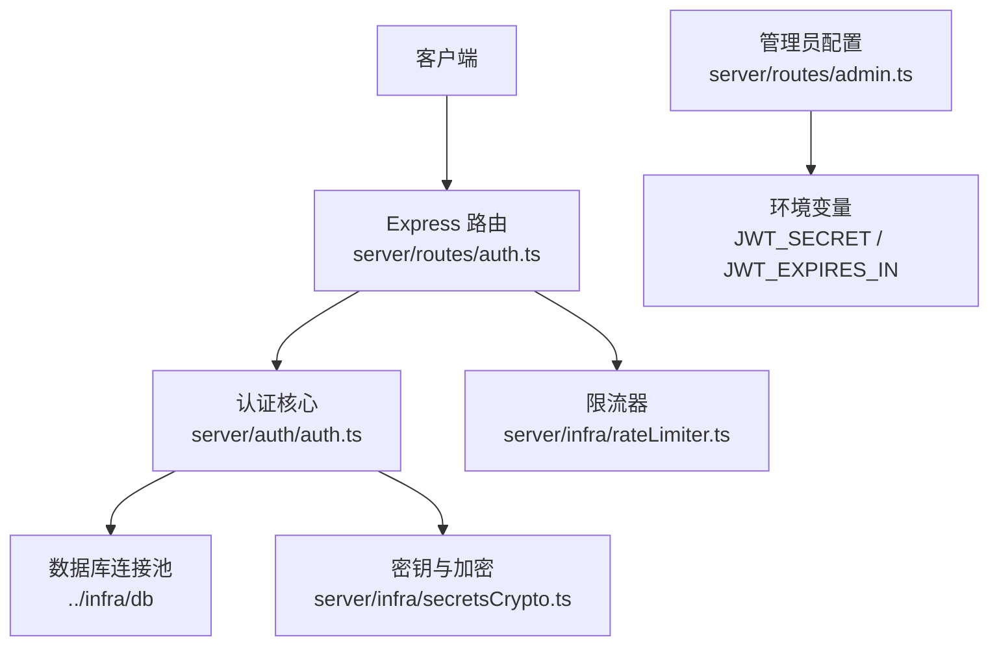
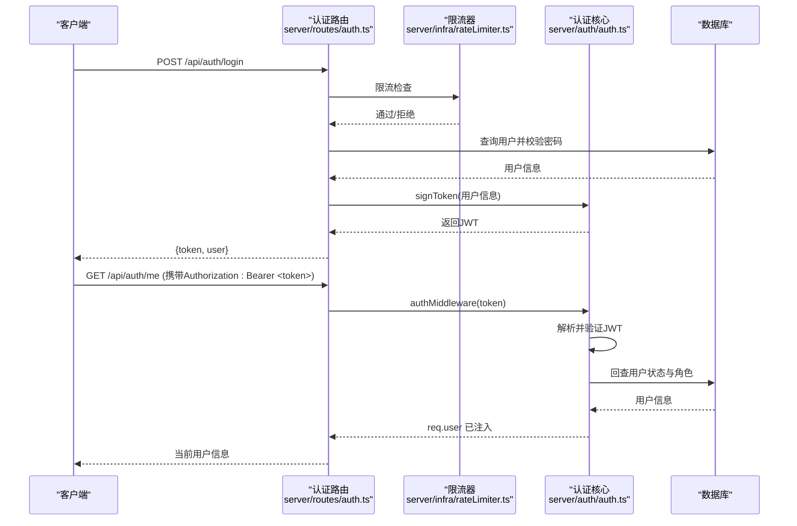
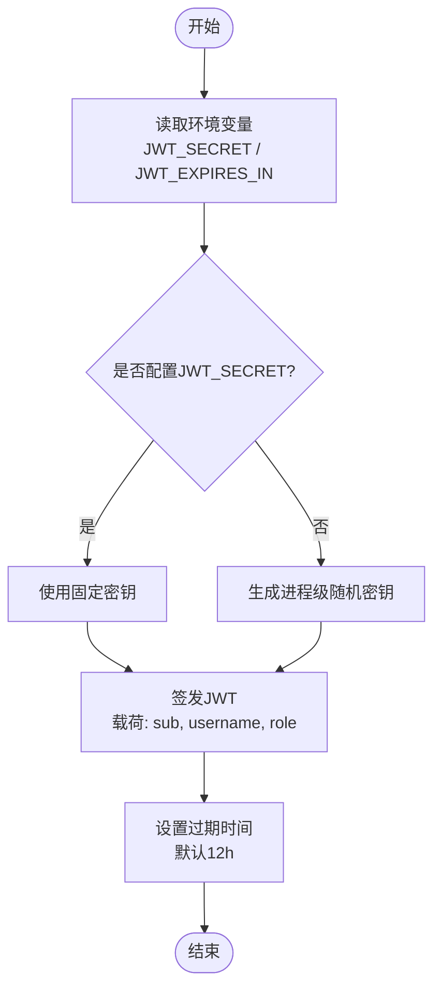
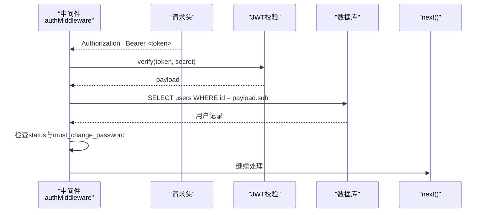
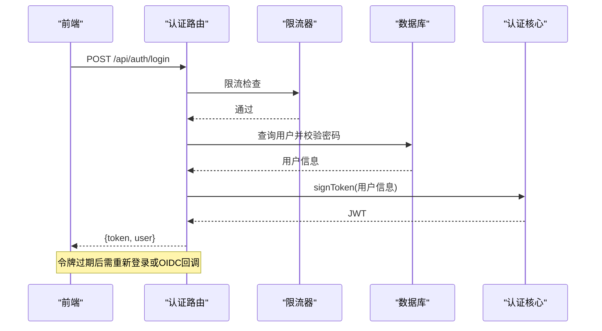
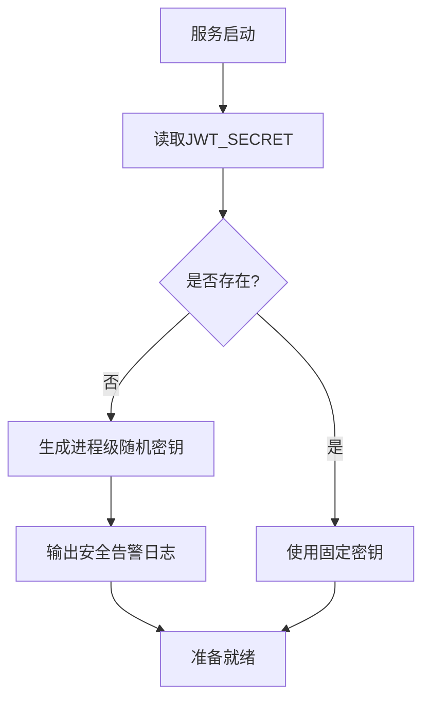
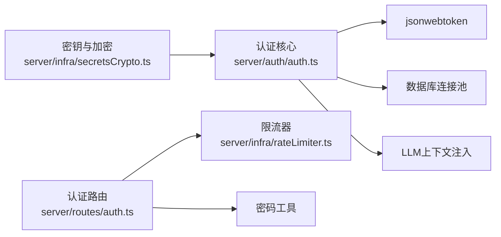

# JWT令牌认证

<cite>
**本文引用的文件**
- [server/auth/auth.ts](file://server/auth/auth.ts)
- [server/routes/auth.ts](file://server/routes/auth.ts)
- [server/infra/rateLimiter.ts](file://server/infra/rateLimiter.ts)
- [server/infra/secretsCrypto.ts](file://server/infra/secretsCrypto.ts)
- [server/routes/admin.ts](file://server/routes/admin.ts)
</cite>

## 目录
1. [简介](#简介)
2. [项目结构](#项目结构)
3. [核心组件](#核心组件)
4. [架构总览](#架构总览)
5. [详细组件分析](#详细组件分析)
6. [依赖关系分析](#依赖关系分析)
7. [性能考虑](#性能考虑)
8. [故障排查指南](#故障排查指南)
9. [结论](#结论)
10. [附录：配置示例与最佳实践](#附录：配置示例与最佳实践)

## 简介
本章节概述JWT令牌认证体系的设计目标与能力边界：实现令牌的签发、校验与刷新（通过重新登录或OIDC回调），提供基于Bearer的鉴权中间件，支持用户状态回查与角色权限控制；同时说明开发环境动态密钥生成机制与生产环境安全配置要点。

## 项目结构
认证相关代码主要分布在以下模块：
- 认证核心：server/auth/auth.ts（JWT签发、验证、中间件、角色守卫）
- 认证路由：server/routes/auth.ts（登录、当前用户、改密、OIDC入口）
- 限流防护：server/infra/rateLimiter.ts（防暴力破解）
- 密钥与加密：server/infra/secretsCrypto.ts（数据源凭据加密，复用JWT_SECRET作为密钥来源之一）
- 环境变量管理：server/routes/admin.ts（允许更新的关键环境变量白名单）

**图表来源**
- [server/auth/auth.ts:60-113](file://server/auth/auth.ts#L60-L113)
- [server/routes/auth.ts:42-82](file://server/routes/auth.ts#L42-L82)
- [server/infra/rateLimiter.ts:14-42](file://server/infra/rateLimiter.ts#L14-L42)
- [server/infra/secretsCrypto.ts:11-21](file://server/infra/secretsCrypto.ts#L11-L21)
- [server/routes/admin.ts:250-255](file://server/routes/admin.ts#L250-L255)

**章节来源**
- [server/auth/auth.ts:1-127](file://server/auth/auth.ts#L1-L127)
- [server/routes/auth.ts:1-156](file://server/routes/auth.ts#L1-L156)
- [server/infra/rateLimiter.ts:1-54](file://server/infra/rateLimiter.ts#L1-L54)
- [server/infra/secretsCrypto.ts:1-50](file://server/infra/secretsCrypto.ts#L1-L50)
- [server/routes/admin.ts:250-295](file://server/routes/admin.ts#L250-L295)

## 核心组件
- 令牌签发与验证
  - 使用jsonwebtoken库对载荷进行签名与校验。
  - 载荷包含用户标识、用户名与角色等关键信息。
  - 过期时间由环境变量控制，默认值在缺失时生效。
- 鉴权中间件
  - 从请求头提取Bearer令牌并校验。
  - 校验通过后回查用户表，确保账号状态与角色最新。
  - 注入用户上下文到请求对象，供后续业务逻辑使用。
  - 强制改密策略：首登或被重置密码的用户仅允许访问认证相关接口。
- 角色守卫
  - 基于用户角色的细粒度访问控制。
- 限流保护
  - 登录与OIDC相关接口启用IP级限流，防止暴力破解。
- 密钥管理
  - 开发环境：进程级随机生成临时密钥，重启后失效。
  - 生产环境：必须配置固定强密钥，避免伪造令牌。

**章节来源**
- [server/auth/auth.ts:46-64](file://server/auth/auth.ts#L46-L64)
- [server/auth/auth.ts:67-113](file://server/auth/auth.ts#L67-L113)
- [server/auth/auth.ts:115-127](file://server/auth/auth.ts#L115-L127)
- [server/routes/auth.ts:42-77](file://server/routes/auth.ts#L42-L77)
- [server/infra/rateLimiter.ts:14-42](file://server/infra/rateLimiter.ts#L14-L42)
- [server/infra/secretsCrypto.ts:11-21](file://server/infra/secretsCrypto.ts#L11-L21)

## 架构总览
下图展示了从客户端发起登录到获取受保护资源的完整流程，包括限流、密码校验、JWT签发、中间件校验与用户状态回查。

**图表来源**
- [server/routes/auth.ts:42-82](file://server/routes/auth.ts#L42-L82)
- [server/auth/auth.ts:60-113](file://server/auth/auth.ts#L60-L113)
- [server/infra/rateLimiter.ts:14-42](file://server/infra/rateLimiter.ts#L14-L42)

## 详细组件分析

### JWT令牌结构与签名算法
- 载荷字段
  - sub：用户唯一标识
  - username：用户名
  - role：角色（ADMIN/ANALYST/VIEWER）
- 签名与过期
  - 使用jsonwebtoken进行签名与校验。
  - 过期时间由环境变量控制，默认值为12小时。
- 密钥来源
  - 优先读取JWT_SECRET；未配置时在开发环境生成进程级随机密钥。
  - 数据源凭据加密可复用JWT_SECRET作为密钥来源之一。

**图表来源**
- [server/auth/auth.ts:46-64](file://server/auth/auth.ts#L46-L64)
- [server/infra/secretsCrypto.ts:11-21](file://server/infra/secretsCrypto.ts#L11-L21)

**章节来源**
- [server/auth/auth.ts:46-64](file://server/auth/auth.ts#L46-L64)
- [server/infra/secretsCrypto.ts:11-21](file://server/infra/secretsCrypto.ts#L11-L21)

### authMiddleware中间件工作原理
- Bearer令牌提取
  - 从Authorization头中截取Bearer令牌。
  - 缺失则返回未登录错误。
- JWT验证
  - 使用相同密钥校验令牌有效性与过期时间。
  - 无效则返回登录状态无效错误。
- 用户状态回查
  - 根据sub查询users表，确认账号存在且状态为ACTIVE。
  - 将用户信息注入req.user，供后续处理。
- 安全检查
  - 若用户需强制改密，仅放行认证相关路径，否则返回权限不足。
  - 注入LLM用量统计所需用户上下文。

**图表来源**
- [server/auth/auth.ts:67-113](file://server/auth/auth.ts#L67-L113)

**章节来源**
- [server/auth/auth.ts:67-113](file://server/auth/auth.ts#L67-L113)

### 登录与令牌刷新机制
- 登录流程
  - 输入用户名与密码，经限流保护后校验。
  - 校验成功后更新最后登录时间并签发JWT。
  - 返回令牌与用户信息。
- 刷新机制
  - 系统未实现无感刷新；前端需在令牌过期后引导用户重新登录或通过OIDC回调完成登录。
  - OIDC回调完成后同样签发本地JWT并重定向至前端。

**图表来源**
- [server/routes/auth.ts:42-77](file://server/routes/auth.ts#L42-L77)
- [server/routes/auth.ts:134-153](file://server/routes/auth.ts#L134-L153)

**章节来源**
- [server/routes/auth.ts:42-77](file://server/routes/auth.ts#L42-L77)
- [server/routes/auth.ts:134-153](file://server/routes/auth.ts#L134-L153)

### devJwtSecret动态生成机制与生产环境安全配置
- 开发环境
  - 未配置JWT_SECRET时，进程级随机生成临时密钥，重启后所有登录态失效。
  - 输出安全告警日志，提示生产环境必须配置固定强密钥。
- 生产环境
  - 必须配置JWT_SECRET为固定强密钥，避免跨实例共享会话被伪造。
  - 可通过管理员配置接口更新环境变量（在白名单内）。

**图表来源**
- [server/auth/auth.ts:46-58](file://server/auth/auth.ts#L46-L58)
- [server/routes/admin.ts:250-255](file://server/routes/admin.ts#L250-L255)

**章节来源**
- [server/auth/auth.ts:46-58](file://server/auth/auth.ts#L46-L58)
- [server/routes/admin.ts:250-255](file://server/routes/admin.ts#L250-L255)

### 错误处理策略
- 未登录或缺少令牌：返回401，提示未登录或登录已过期。
- 令牌无效或过期：返回401，提示登录状态无效，请重新登录。
- 账号不存在或禁用：返回401，提示账号不存在或已被禁用。
- 强制改密限制：返回403，附带错误码提示首次登录或密码已被重置，请先修改密码。
- 认证服务异常：返回500，提示认证服务异常。
- 限流触发：返回429，提示请求过于频繁。

**章节来源**
- [server/auth/auth.ts:72-113](file://server/auth/auth.ts#L72-L113)
- [server/infra/rateLimiter.ts:14-42](file://server/infra/rateLimiter.ts#L14-L42)

## 依赖关系分析
- 认证核心依赖
  - jsonwebtoken：用于JWT签发与校验。
  - 数据库连接池：用于用户状态回查。
  - LLM上下文注入：用于按用户统计用量。
- 路由层依赖
  - 限流器：保护登录与OIDC接口。
  - 密码工具：哈希与强度校验。
- 密钥与加密
  - secretsCrypto：数据源凭据加密，可复用JWT_SECRET作为密钥来源。

**图表来源**
- [server/auth/auth.ts:6-11](file://server/auth/auth.ts#L6-L11)
- [server/routes/auth.ts:6-20](file://server/routes/auth.ts#L6-L20)
- [server/infra/secretsCrypto.ts:11-21](file://server/infra/secretsCrypto.ts#L11-L21)

**章节来源**
- [server/auth/auth.ts:6-11](file://server/auth/auth.ts#L6-L11)
- [server/routes/auth.ts:6-20](file://server/routes/auth.ts#L6-L20)
- [server/infra/secretsCrypto.ts:11-21](file://server/infra/secretsCrypto.ts#L11-L21)

## 性能考虑
- 令牌校验开销低，但每次鉴权均回查数据库，建议在高频场景下结合缓存减少数据库压力。
- 限流器支持内存模式与Redis模式，多实例部署建议启用Redis以共享计数。
- 强制改密检查仅在鉴权阶段执行一次，避免重复计算。

[本节为通用性能讨论，不直接分析具体文件]

## 故障排查指南
- 无法登录
  - 检查用户名与密码是否正确。
  - 查看限流是否触发（429）。
  - 确认数据库连接正常。
- 令牌无效或过期
  - 检查JWT_SECRET是否与签发时一致。
  - 确认JWT_EXPIRES_IN配置是否符合预期。
  - 前端应在过期后引导重新登录。
- 账号被禁用
  - 检查数据库中用户状态是否为ACTIVE。
  - 联系管理员恢复账号。
- 强制改密拦截
  - 确认must_change_password标志位。
  - 仅允许访问认证相关接口进行修改。

**章节来源**
- [server/routes/auth.ts:42-77](file://server/routes/auth.ts#L42-L77)
- [server/auth/auth.ts:72-113](file://server/auth/auth.ts#L72-L113)
- [server/infra/rateLimiter.ts:14-42](file://server/infra/rateLimiter.ts#L14-L42)

## 结论
该JWT认证体系通过严格的令牌签发与校验、用户状态回查与角色守卫，提供了安全的访问控制。开发环境采用动态密钥保障安全性，生产环境要求固定强密钥。配合限流与强制改密策略，能够有效抵御暴力破解与未授权访问。建议在生产环境中完善环境变量管理与监控告警，确保认证链路稳定可靠。

[本节为总结性内容，不直接分析具体文件]

## 附录：配置示例与最佳实践
- 环境变量
  - JWT_SECRET：生产环境必须配置固定强密钥；开发环境可省略以启用进程级随机密钥。
  - JWT_EXPIRES_IN：令牌过期时间，默认12小时。
  - RATE_LIMIT_MAX：登录与OIDC接口的每分钟最大请求数，默认30。
- 配置位置
  - 可通过管理员配置接口更新JWT_SECRET与JWT_EXPIRES_IN（在白名单内）。
- 最佳实践
  - 生产环境务必配置JWT_SECRET，避免跨实例共享会话被伪造。
  - 合理设置JWT_EXPIRES_IN，平衡用户体验与安全。
  - 启用限流保护登录与OIDC接口，防止暴力破解。
  - 前端在令牌过期后引导重新登录或通过OIDC回调完成登录。
  - 定期审计用户状态与角色变更，确保鉴权一致性。

**章节来源**
- [server/routes/admin.ts:250-255](file://server/routes/admin.ts#L250-L255)
- [server/auth/auth.ts:46-58](file://server/auth/auth.ts#L46-L58)
- [server/infra/rateLimiter.ts:14-42](file://server/infra/rateLimiter.ts#L14-L42)