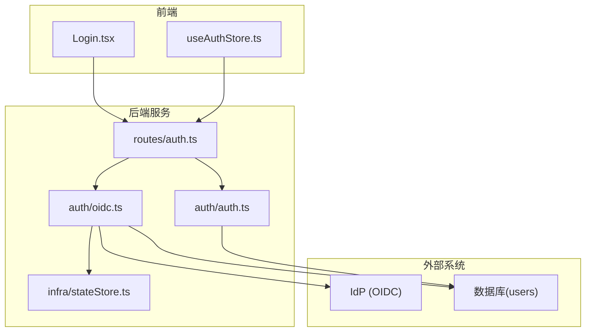
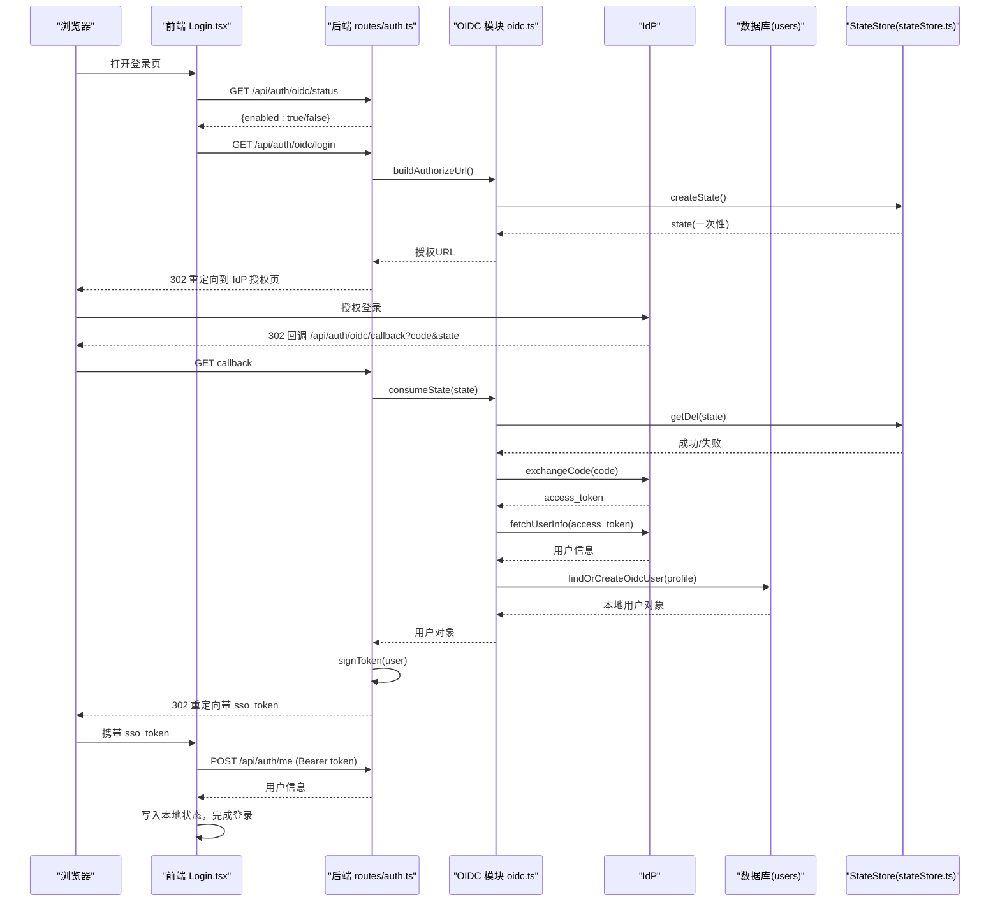
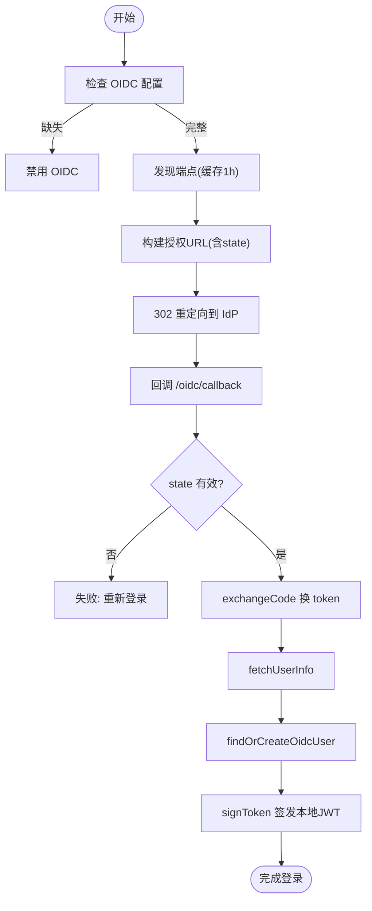
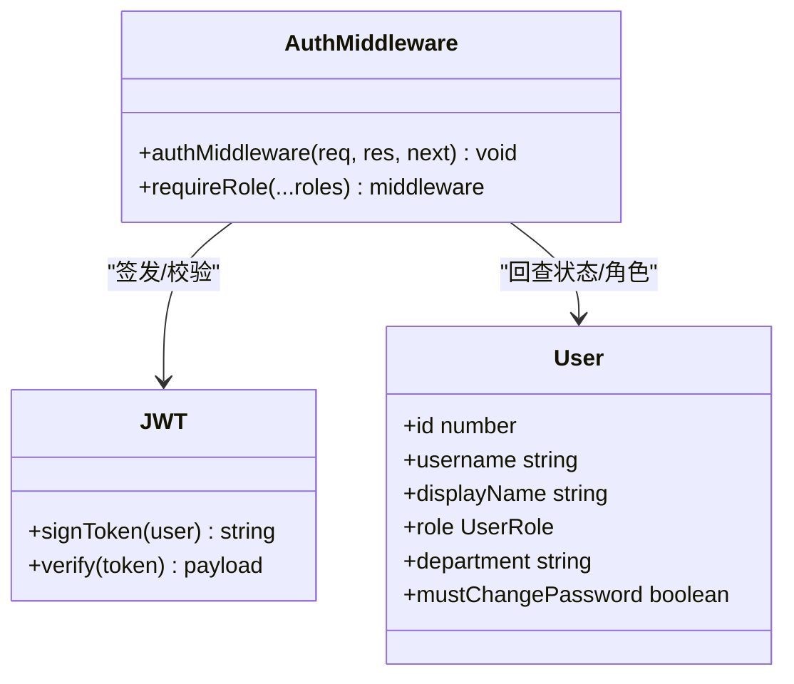
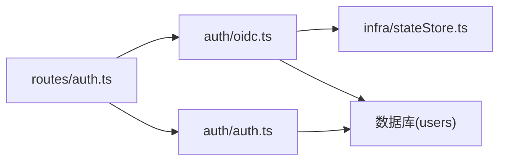

# OIDC企业登录集成

<cite>
**本文引用的文件**
- [server/auth/oidc.ts](file://server/auth/oidc.ts)
- [server/auth/auth.ts](file://server/auth/auth.ts)
- [server/routes/auth.ts](file://server/routes/auth.ts)
- [src/components/auth/Login.tsx](file://src/components/auth/Login.tsx)
- [src/hooks/useAuthStore.ts](file://src/hooks/useAuthStore.ts)
- [server/infra/stateStore.ts](file://server/infra/stateStore.ts)
- [deploy/nginx.multi-instance.conf](file://deploy/nginx.multi-instance.conf)
</cite>

## 目录
1. [简介](#简介)
2. [项目结构](#项目结构)
3. [核心组件](#核心组件)
4. [架构总览](#架构总览)
5. [详细组件分析](#详细组件分析)
6. [依赖关系分析](#依赖关系分析)
7. [性能与扩展性](#性能与扩展性)
8. [安全考虑](#安全考虑)
9. [故障排查指南](#故障排查指南)
10. [结论](#结论)
11. [附录：主流身份提供商配置示例](#附录主流身份提供商配置示例)

## 简介
本文件面向在企业环境中集成 OpenID Connect（OIDC）统一身份认证，覆盖从 IdP 配置、授权码流程、用户信息同步到会话管理、令牌刷新与注销的全链路说明。系统采用“零新依赖”的 OIDC 实现：通过标准 HTTP fetch 完成 discovery、authorize、token、userinfo 交互；state 票据支持内存或 Redis 外置以适配多实例部署；JIT 建号与用户信息同步确保首次登录即自动创建本地账号并持续对齐 IdP 属性。

## 项目结构
围绕 OIDC 的关键代码分布在服务端认证模块、路由层以及前端登录与状态管理：
- 服务端 OIDC 逻辑：发现端点、构建授权链接、交换令牌、拉取用户信息、JIT 建号与同步
- 认证中间件：JWT 签发与校验、角色守卫、强制改密拦截
- 路由：提供 OIDC 登录入口、回调处理、本地密码登录与会话接口
- 前端：登录页展示 SSO 入口、使用本地 JWT 完成登录态建立
- 状态存储：state 票据在单机内存或多实例共享的 Redis 中一次性消费
- 部署：Nginx 反向代理配置，保证长连接与超时设置正确

**图表来源**
- [server/routes/auth.ts:116-153](file://server/routes/auth.ts#L116-L153)
- [server/auth/oidc.ts:62-189](file://server/auth/oidc.ts#L62-L189)
- [server/auth/auth.ts:60-113](file://server/auth/auth.ts#L60-L113)
- [server/infra/stateStore.ts:165-219](file://server/infra/stateStore.ts#L165-L219)
- [src/components/auth/Login.tsx:14-25](file://src/components/auth/Login.tsx#L14-L25)
- [src/hooks/useAuthStore.ts:41-52](file://src/hooks/useAuthStore.ts#L41-L52)

**章节来源**
- [server/routes/auth.ts:116-153](file://server/routes/auth.ts#L116-L153)
- [server/auth/oidc.ts:62-189](file://server/auth/oidc.ts#L62-L189)
- [server/auth/auth.ts:60-113](file://server/auth/auth.ts#L60-L113)
- [server/infra/stateStore.ts:165-219](file://server/infra/stateStore.ts#L165-L219)
- [src/components/auth/Login.tsx:14-25](file://src/components/auth/Login.tsx#L14-L25)
- [src/hooks/useAuthStore.ts:41-52](file://src/hooks/useAuthStore.ts#L41-L52)

## 核心组件
- OIDC 客户端能力
  - 动态发现端点并缓存（1小时）
  - 生成一次性 state 防 CSRF（内存或 Redis）
  - 构建授权 URL（scope 固定为 openid profile email）
  - 用授权码换取 access_token
  - 调用 userinfo 获取用户信息并规整字段
  - JIT 建号与同步（按 username 命中/创建/更新）
- 认证与会话
  - JWT 签发与校验，鉴权中间件回查用户状态与角色
  - 强制改密策略：首登或被重置后限制访问业务接口
- 前端登录与状态
  - 登录页根据 /api/auth/oidc/status 决定是否显示 SSO 入口
  - 使用回调返回的本地 JWT 完成登录态建立

**章节来源**
- [server/auth/oidc.ts:41-56](file://server/auth/oidc.ts#L41-L56)
- [server/auth/oidc.ts:62-87](file://server/auth/oidc.ts#L62-L87)
- [server/auth/oidc.ts:95-141](file://server/auth/oidc.ts#L95-L141)
- [server/auth/oidc.ts:143-189](file://server/auth/oidc.ts#L143-L189)
- [server/auth/oidc.ts:191-243](file://server/auth/oidc.ts#L191-L243)
- [server/auth/auth.ts:60-113](file://server/auth/auth.ts#L60-L113)
- [src/components/auth/Login.tsx:14-25](file://src/components/auth/Login.tsx#L14-L25)
- [src/hooks/useAuthStore.ts:41-52](file://src/hooks/useAuthStore.ts#L41-L52)

## 架构总览
下图展示了从浏览器点击“企业统一登录”到最终建立本地会话的完整时序。

**图表来源**
- [server/routes/auth.ts:116-153](file://server/routes/auth.ts#L116-L153)
- [server/auth/oidc.ts:95-189](file://server/auth/oidc.ts#L95-L189)
- [server/infra/stateStore.ts:165-219](file://server/infra/stateStore.ts#L165-L219)
- [src/components/auth/Login.tsx:14-25](file://src/components/auth/Login.tsx#L14-L25)
- [src/hooks/useAuthStore.ts:41-52](file://src/hooks/useAuthStore.ts#L41-L52)

## 详细组件分析

### OIDC 客户端与授权码流程
- 配置解析与启用判断
  - 读取环境变量：issuer、clientId、clientSecret、redirectUri、defaultRole
  - 未配置 issuer 或 clientId 时禁用 OIDC，登录页不展示 SSO 入口
- 端点发现与缓存
  - 请求 /.well-known/openid-configuration，解析 authorization_endpoint、token_endpoint、userinfo_endpoint
  - 结果缓存 1 小时，减少 IdP 回源压力
- State 票据与 CSRF 防护
  - 生成一次性随机 state，TTL 10 分钟
  - 默认进程内 Map；配置 REDIS_URL 时使用 Redis 外置，支持多实例共享与原子消费
- 授权链接构建
  - response_type=code，scope=openid profile email，附带 state
- 令牌交换与用户信息
  - 使用授权码向 tokenEndpoint 交换 access_token
  - 调用 userinfoEndpoint 获取用户信息，规整为 username/displayName/department/sub
- JIT 建号与同步
  - 按规范化后的 username 查询本地 users 表
  - 存在则同步 displayName/department，更新 last_login_at；不存在则按 defaultRole 创建账号（随机密码占位，禁止本地密码登录）
  - 若用户被禁用，拒绝登录

**图表来源**
- [server/auth/oidc.ts:41-56](file://server/auth/oidc.ts#L41-L56)
- [server/auth/oidc.ts:62-87](file://server/auth/oidc.ts#L62-L87)
- [server/auth/oidc.ts:95-141](file://server/auth/oidc.ts#L95-L141)
- [server/auth/oidc.ts:143-189](file://server/auth/oidc.ts#L143-L189)
- [server/auth/oidc.ts:191-243](file://server/auth/oidc.ts#L191-L243)

**章节来源**
- [server/auth/oidc.ts:41-56](file://server/auth/oidc.ts#L41-L56)
- [server/auth/oidc.ts:62-87](file://server/auth/oidc.ts#L62-L87)
- [server/auth/oidc.ts:95-141](file://server/auth/oidc.ts#L95-L141)
- [server/auth/oidc.ts:143-189](file://server/auth/oidc.ts#L143-L189)
- [server/auth/oidc.ts:191-243](file://server/auth/oidc.ts#L191-L243)

### 认证与会话管理（JWT）
- JWT 签发
  - 载荷包含用户标识、用户名、角色；过期时间由环境变量控制
  - 开发环境未配置密钥时生成进程级临时密钥（重启失效），生产必须配置强密钥
- 鉴权中间件
  - 校验 Bearer token，回查 users 表确认账号状态与角色
  - 注入 LLM 用量统计上下文
  - 强制改密拦截：must_change_password 为真时仅放行 /api/auth/*
- 角色守卫
  - requireRole 用于保护管理员/分析师等敏感操作

**图表来源**
- [server/auth/auth.ts:60-113](file://server/auth/auth.ts#L60-L113)
- [server/auth/auth.ts:115-127](file://server/auth/auth.ts#L115-L127)

**章节来源**
- [server/auth/auth.ts:60-113](file://server/auth/auth.ts#L60-L113)
- [server/auth/auth.ts:115-127](file://server/auth/auth.ts#L115-L127)

### 前端登录与状态管理
- 登录页
  - 调用 /api/auth/oidc/status 决定是否显示“企业统一登录”入口
  - 支持错误参数回显（sso_error）
- 状态管理
  - loginWithToken：使用回调返回的本地 JWT 调用 /api/auth/me 完成用户信息填充
  - logout：清除本地存储中的 token 与用户信息
  - mustChangePassword：收到服务端 403 时标记，引导用户修改密码

**章节来源**
- [src/components/auth/Login.tsx:14-25](file://src/components/auth/Login.tsx#L14-L25)
- [src/hooks/useAuthStore.ts:41-52](file://src/hooks/useAuthStore.ts#L41-L52)
- [src/hooks/useAuthStore.ts:54-76](file://src/hooks/useAuthStore.ts#L54-L76)

### 多实例与状态存储
- StateStore 抽象
  - 内存模式：单机部署，Map 维护键值与 TTL
  - Redis 模式：多实例共享，支持原子 getDel、TTL、分布式锁等
- OIDC state 票据
  - 启用 Redis 后，state 写入共享存储，发起登录与回调可落在不同实例
  - 消费采用原子删除，防止重复使用

**章节来源**
- [server/infra/stateStore.ts:165-219](file://server/infra/stateStore.ts#L165-L219)
- [server/auth/oidc.ts:95-127](file://server/auth/oidc.ts#L95-L127)

## 依赖关系分析
- 模块耦合
  - routes/auth.ts 依赖 auth/oidc.ts 与 auth/auth.ts，负责编排登录流程与会话
  - auth/oidc.ts 依赖 infra/stateStore.ts 与数据库池，负责 IdP 交互与用户同步
  - auth/auth.ts 依赖数据库池与 jwt 库，负责令牌与鉴权
- 外部依赖
  - IdP：遵循 OIDC 协议，暴露 discovery、authorize、token、userinfo 端点
  - Redis（可选）：多实例共享 state 与限流/配额等状态
  - MySQL：users 表存储本地用户信息与角色

**图表来源**
- [server/routes/auth.ts:116-153](file://server/routes/auth.ts#L116-L153)
- [server/auth/oidc.ts:62-189](file://server/auth/oidc.ts#L62-L189)
- [server/auth/auth.ts:60-113](file://server/auth/auth.ts#L60-L113)
- [server/infra/stateStore.ts:165-219](file://server/infra/stateStore.ts#L165-L219)

**章节来源**
- [server/routes/auth.ts:116-153](file://server/routes/auth.ts#L116-L153)
- [server/auth/oidc.ts:62-189](file://server/auth/oidc.ts#L62-L189)
- [server/auth/auth.ts:60-113](file://server/auth/auth.ts#L60-L113)
- [server/infra/stateStore.ts:165-219](file://server/infra/stateStore.ts#L165-L219)

## 性能与扩展性
- 端点发现缓存
  - 1 小时缓存避免频繁请求 IdP 配置，降低延迟与网络开销
- State 存储
  - 单机内存模式适合单实例；多实例需启用 Redis，保证 state 一致性
- 鉴权回查
  - 每次鉴权回查 users 表，确保禁用/角色变更即时生效；在高并发场景下建议结合缓存策略（如短期缓存用户状态）以降低数据库压力
- 部署与代理
  - Nginx 关闭缓冲、放大读超时，保障 SSE 等长连接稳定

**章节来源**
- [server/auth/oidc.ts:62-87](file://server/auth/oidc.ts#L62-L87)
- [server/infra/stateStore.ts:165-219](file://server/infra/stateStore.ts#L165-L219)
- [server/auth/auth.ts:85-113](file://server/auth/auth.ts#L85-L113)
- [deploy/nginx.multi-instance.conf:1-35](file://deploy/nginx.multi-instance.conf#L1-L35)

## 安全考虑
- CSRF 防护
  - state 一次性票据，TTL 10 分钟，Redis 模式下原子消费，防止重放
- 令牌安全
  - JWT_SECRET 未配置时生成进程级临时密钥（重启失效），生产必须配置强密钥
  - 鉴权中间件校验 token 并回查用户状态，避免过期或禁用账号继续访问
- 最小权限
  - scope 固定为 openid profile email，避免过度授权
  - 默认角色为 VIEWER，可通过环境变量调整
- 密码策略
  - JIT 建号使用随机密码占位，禁止本地密码登录；强制改密策略确保用户首次登录或管理员重置后修改密码
- 网络与安全传输
  - 所有 IdP 通信使用 HTTPS；回调地址需配置为受信任域名

**章节来源**
- [server/auth/oidc.ts:95-127](file://server/auth/oidc.ts#L95-L127)
- [server/auth/auth.ts:46-64](file://server/auth/auth.ts#L46-L64)
- [server/auth/auth.ts:85-113](file://server/auth/auth.ts#L85-L113)
- [server/auth/oidc.ts:129-141](file://server/auth/oidc.ts#L129-L141)
- [server/auth/oidc.ts:207-243](file://server/auth/oidc.ts#L207-L243)

## 故障排查指南
- 登录页未显示“企业统一登录”
  - 检查是否配置了 OIDC_ISSUER 与 OIDC_CLIENT_ID
  - 查看 /api/auth/oidc/status 返回值
- 回调失败（state 无效或已过期）
  - 确认 state 未被重复消费；多实例需启用 Redis 共享 state
  - 检查浏览器时间与服务器时间偏差
- 令牌交换失败
  - 检查 IdP 的 tokenEndpoint 可达性与 client_secret 是否正确
  - 查看日志中的 HTTP 状态码与错误消息
- 用户信息获取失败
  - 确认 IdP 的 userinfoEndpoint 可用且返回包含 sub
  - 检查 Authorization 头是否正确传递 access_token
- JIT 建号失败
  - 检查数据库连接与 users 表结构
  - 确认 username 规范化后唯一且不冲突
- 强制改密拦截
  - 用户 must_change_password 为真时，仅允许访问 /api/auth/*；请先修改密码

**章节来源**
- [server/routes/auth.ts:116-153](file://server/routes/auth.ts#L116-L153)
- [server/auth/oidc.ts:95-189](file://server/auth/oidc.ts#L95-L189)
- [server/auth/auth.ts:85-113](file://server/auth/auth.ts#L85-L113)

## 结论
本实现以最小依赖完成 OIDC 企业登录集成，涵盖授权码流程、state 防 CSRF、端点发现缓存、JIT 建号与用户同步、JWT 会话与强制改密策略，并通过 StateStore 抽象支持多实例部署。配合 Nginx 代理与合理的超时配置，可在企业环境中稳定运行。后续可按需引入缓存层优化鉴权回查性能，或扩展更多 IdP 特性（如 refresh_token）。

## 附录：主流身份提供商配置示例
以下为常见 IdP 的环境变量配置要点（请替换为实际值）：
- Azure AD
  - OIDC_ISSUER: https://login.microsoftonline.com/{tenant-id}/v2.0
  - OIDC_CLIENT_ID: 应用注册中的客户端 ID
  - OIDC_CLIENT_SECRET: 应用注册中的客户端密钥（可选）
  - OIDC_REDIRECT_URI: http(s)://{your-domain}/api/auth/oidc/callback
  - OIDC_DEFAULT_ROLE: VIEWER | ANALYST | ADMIN
- Okta
  - OIDC_ISSUER: https://{your-org}.okta.com/oauth2/default
  - OIDC_CLIENT_ID: 应用的 Client ID
  - OIDC_CLIENT_SECRET: 可选
  - OIDC_REDIRECT_URI: http(s)://{your-domain}/api/auth/oidc/callback
  - OIDC_DEFAULT_ROLE: VIEWER | ANALYST | ADMIN
- Keycloak
  - OIDC_ISSUER: https://{keycloak-host}/realms/{realm}
  - OIDC_CLIENT_ID: 客户端 ID
  - OIDC_CLIENT_SECRET: 可选
  - OIDC_REDIRECT_URI: http(s)://{your-domain}/api/auth/oidc/callback
  - OIDC_DEFAULT_ROLE: VIEWER | ANALYST | ADMIN

注意：
- 确保 IdP 已开启 OIDC 协议并配置正确的重定向 URI
- 在生产环境务必配置强 JWT_SECRET 与 HTTPS
- 多实例部署需启用 Redis（REDIS_URL）以共享 state

[本节为概念性配置说明，不直接分析具体代码文件]