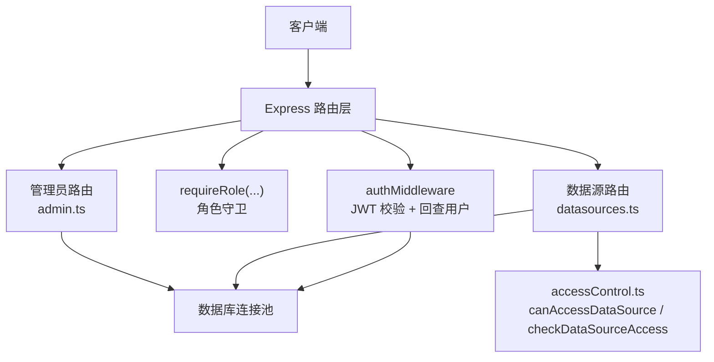
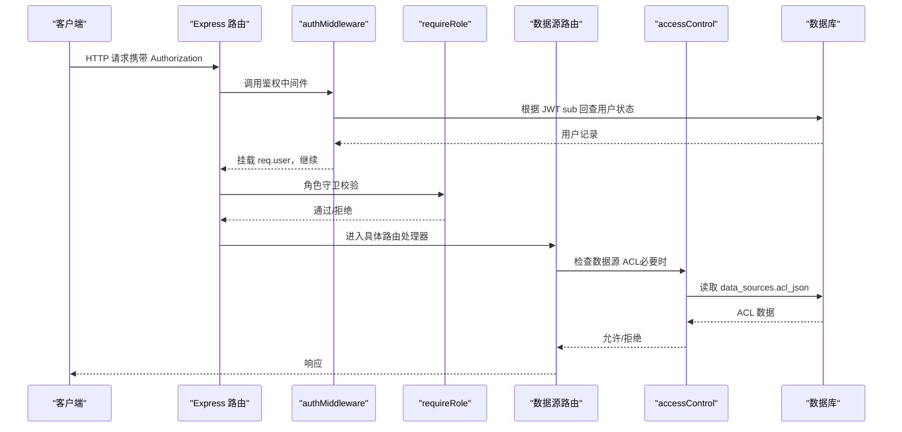
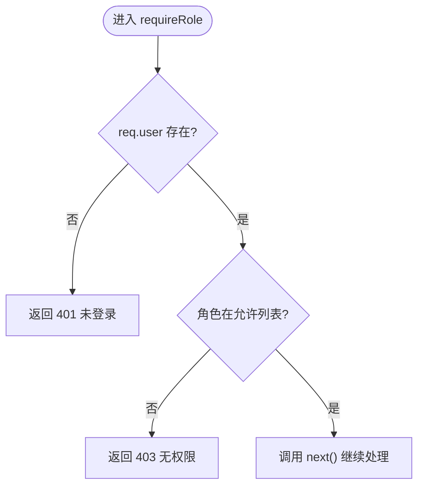
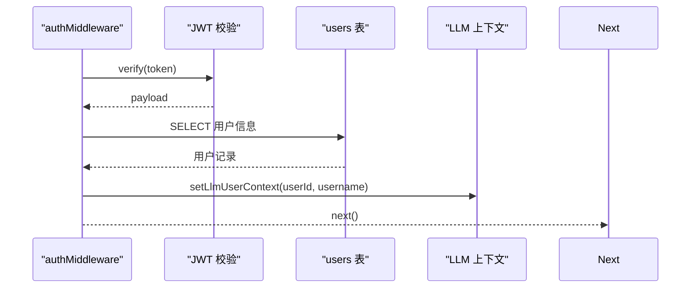
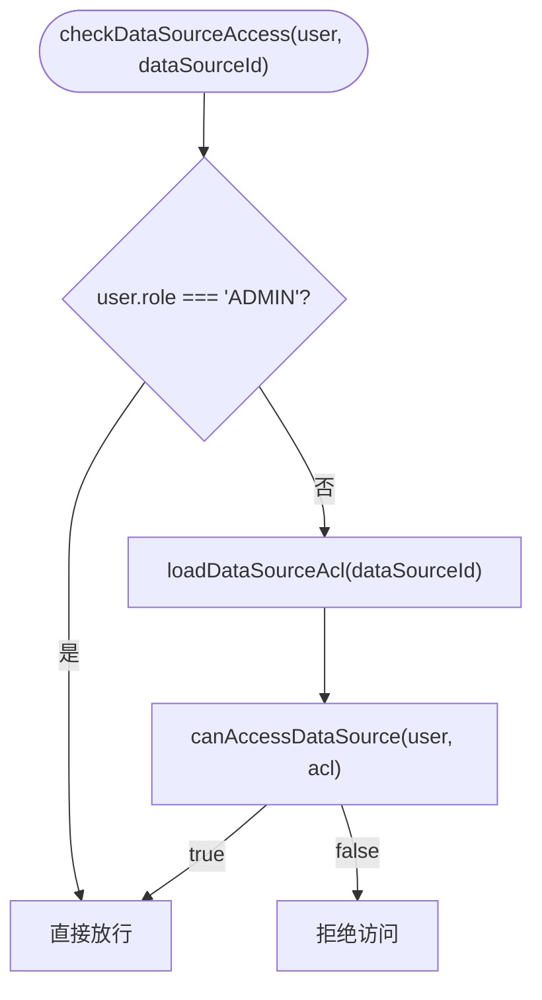
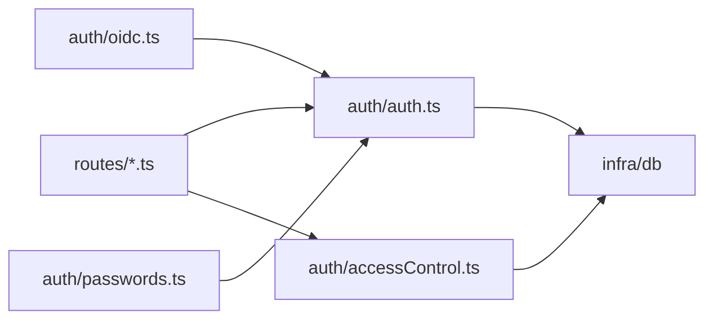

# RBAC权限控制

<cite>
**本文引用的文件**
- [server/auth/auth.ts](file://server/auth/auth.ts)
- [server/auth/accessControl.ts](file://server/auth/accessControl.ts)
- [server/routes/auth.ts](file://server/routes/auth.ts)
- [server/routes/admin.ts](file://server/routes/admin.ts)
- [server/routes/datasources.ts](file://server/routes/datasources.ts)
- [server/auth/oidc.ts](file://server/auth/oidc.ts)
- [server/auth/passwords.ts](file://server/auth/passwords.ts)
</cite>

## 目录
1. [简介](#简介)
2. [项目结构](#项目结构)
3. [核心组件](#核心组件)
4. [架构总览](#架构总览)
5. [详细组件分析](#详细组件分析)
6. [依赖关系分析](#依赖关系分析)
7. [性能考量](#性能考量)
8. [故障排查指南](#故障排查指南)
9. [结论](#结论)
10. [附录：配置与使用示例](#附录：配置与使用示例)

## 简介
本文件系统性地梳理并文档化基于角色的访问控制（RBAC）实现，覆盖角色模型、守卫函数、用户上下文注入、数据源级访问控制（ACL），以及路由与资源维度的权限实践。目标是帮助开发者快速理解并正确扩展权限体系，同时提供常见问题定位方法。

## 项目结构
RBAC 相关能力主要分布在认证授权模块与若干业务路由中：
- 认证与角色守卫：server/auth/auth.ts
- 数据源访问控制（ACL）：server/auth/accessControl.ts
- 认证路由（登录/当前用户/OIDC）：server/routes/auth.ts
- 管理员路由（仅 ADMIN）：server/routes/admin.ts
- 数据源路由（读写分离、ACL 校验）：server/routes/datasources.ts
- OIDC 集成（JIT 建号、默认角色）：server/auth/oidc.ts
- 密码强度与哈希：server/auth/passwords.ts

图表来源
- [server/auth/auth.ts:66-113](file://server/auth/auth.ts#L66-L113)
- [server/auth/accessControl.ts:44-73](file://server/auth/accessControl.ts#L44-L73)
- [server/routes/datasources.ts:364-440](file://server/routes/datasources.ts#L364-L440)
- [server/routes/admin.ts:12-14](file://server/routes/admin.ts#LL12-L14)

章节来源
- [server/auth/auth.ts:1-127](file://server/auth/auth.ts#L1-L127)
- [server/auth/accessControl.ts:1-108](file://server/auth/accessControl.ts#L1-L108)
- [server/routes/auth.ts:1-156](file://server/routes/auth.ts#L1-L156)
- [server/routes/admin.ts:1-295](file://server/routes/admin.ts#L1-L295)
- [server/routes/datasources.ts:1-800](file://server/routes/datasources.ts#L1-L800)
- [server/auth/oidc.ts:1-244](file://server/auth/oidc.ts#L1-L244)
- [server/auth/passwords.ts:1-100](file://server/auth/passwords.ts#L1-L100)

## 核心组件
- 角色模型与用户上下文
  - 角色类型：ADMIN、ANALYST、VIEWER
  - 用户对象：包含 id、username、displayName、role、department、mustChangePassword
  - 中间件 authMiddleware：解析 Bearer Token，校验 JWT，回查 users 表，将用户信息挂载到 req.user，并在 LLM 链路注入用户上下文
- 角色守卫 requireRole
  - 支持多角色检查：requireRole('ADMIN') 或 requireRole('ADMIN','ANALYST')
  - 未登录返回 401；角色不匹配返回 403
- 数据源访问控制（ACL）
  - 以 departments 和 userIds 为维度进行细粒度授权
  - 纯函数 canAccessDataSource 判定是否可访问
  - 服务端入口 checkDataSourceAccess 结合 ADMIN 短路逻辑与 ACL 查询
- 管理员路由保护
  - 所有管理接口统一前置 authMiddleware 与 requireRole('ADMIN')
- 数据源路由保护
  - 列表接口对所有登录用户开放，但非 ADMIN 会剥离敏感字段并按 ACL 标记不可见
  - Schema 读取等写/读敏感操作需 requireRole('ADMIN','ANALYST') 并通过 checkDataSourceAccess

章节来源
- [server/auth/auth.ts:13-33](file://server/auth/auth.ts#L13-L33)
- [server/auth/auth.ts:66-127](file://server/auth/auth.ts#L66-L127)
- [server/auth/accessControl.ts:13-73](file://server/auth/accessControl.ts#L13-L73)
- [server/routes/admin.ts:12-14](file://server/routes/admin.ts#L12-L14)
- [server/routes/datasources.ts:364-440](file://server/routes/datasources.ts#L364-L440)

## 架构总览
下图展示一次受保护的请求从进入路由到完成鉴权与权限判定的流程。

图表来源
- [server/auth/auth.ts:66-113](file://server/auth/auth.ts#L66-L113)
- [server/auth/auth.ts:115-127](file://server/auth/auth.ts#L115-L127)
- [server/auth/accessControl.ts:58-73](file://server/auth/accessControl.ts#L58-L73)
- [server/routes/datasources.ts:419-440](file://server/routes/datasources.ts#L419-L440)

## 详细组件分析

### 角色模型与职责划分
- ADMIN
  - 全量管理能力：用户管理、环境配置、数据源增删改、Schema 同步等
  - 对数据源访问控制具有“白名单”豁免（始终放行）
- ANALYST
  - 具备分析与查询能力：如灵活查询的 schema 读取、执行受限 SQL 等
  - 仍受数据源 ACL 限制
- VIEWER
  - 只读查看能力：如数据源列表最小信息、看板等
  - 受数据源 ACL 严格限制

章节来源
- [server/auth/auth.ts:13-24](file://server/auth/auth.ts#L13-L24)
- [server/routes/admin.ts:12-14](file://server/routes/admin.ts#L12-L14)
- [server/routes/datasources.ts:364-440](file://server/routes/datasources.ts#L364-L440)

### requireRole 守卫函数
- 功能
  - 校验 req.user 是否存在
  - 校验 req.user.role 是否在传入的角色列表中
  - 未通过分别返回 401/403
- 使用方式
  - 单角色：requireRole('ADMIN')
  - 多角色：requireRole('ADMIN','ANALYST')
- 典型应用
  - 管理员路由整体保护：router.use(authMiddleware, requireRole('ADMIN'))
  - 特定接口保护：router.get('/:id/flex-schema', requireRole('ADMIN','ANALYST'), handler)

图表来源
- [server/auth/auth.ts:115-127](file://server/auth/auth.ts#L115-L127)

章节来源
- [server/auth/auth.ts:115-127](file://server/auth/auth.ts#L115-L127)
- [server/routes/admin.ts:12-14](file://server/routes/admin.ts#L12-L14)
- [server/routes/datasources.ts:419-440](file://server/routes/datasources.ts#L419-L440)

### 用户上下文注入机制
- 触发点：authMiddleware
- 行为
  - 解析 Authorization 头中的 Bearer Token
  - 校验 JWT 签名与有效期
  - 回查 users 表获取最新状态（启用/禁用、角色变更、强制改密标志）
  - 将用户信息挂载至 req.user
  - 注入 LLM 用户上下文（用于用量统计）
  - 若 must_change_password 且非 /api/auth/*，返回 403 并提示改密
- 影响范围
  - 后续所有路由均可通过 req.user 获取当前用户身份与角色

图表来源
- [server/auth/auth.ts:66-113](file://server/auth/auth.ts#L66-L113)

章节来源
- [server/auth/auth.ts:66-113](file://server/auth/auth.ts#L66-L113)

### 数据源访问控制（ACL）
- 模型
  - acl_json 存储 { departments: string[], userIds: number[] }
  - NULL 或两组皆空表示不限制（全员可见）
  - 非空时仅 ADMIN、清单内部门成员、清单内个人用户可访问
- 关键函数
  - parseAcl：规范化输入，空则归一为 null
  - canAccessDataSource：纯函数判定
  - loadDataSourceAcl：读取数据源的 ACL
  - checkDataSourceAccess：服务端入口，ADMIN 短路
  - grantUserAccess：审批通过后并入个人授权
  - sanitizeAcl：入参清洗与长度上限
- 路由中的应用
  - 列表接口：非 ADMIN 且无权限的数据源仅下发最小信息并标记 accessDenied
  - 灵活查询 schema：requireRole('ADMIN','ANALYST') 后再调用 checkDataSourceAccess

图表来源
- [server/auth/accessControl.ts:58-73](file://server/auth/accessControl.ts#L58-L73)
- [server/auth/accessControl.ts:44-55](file://server/auth/accessControl.ts#L44-L55)

章节来源
- [server/auth/accessControl.ts:1-108](file://server/auth/accessControl.ts#L1-L108)
- [server/routes/datasources.ts:364-440](file://server/routes/datasources.ts#L364-L440)

### 管理员路由与权限保护
- 全局保护：router.use(authMiddleware, requireRole('ADMIN'))
- 安全约束
  - 不允许修改/删除自己
  - 保证至少保留一个 ACTIVE 管理员
  - 重置密码后设置 must_change_password=1
- 环境配置管理
  - 仅 ADMIN 可查看/更新
  - 更新写入审计日志

章节来源
- [server/routes/admin.ts:12-14](file://server/routes/admin.ts#L12-L14)
- [server/routes/admin.ts:18-24](file://server/routes/admin.ts#L18-L24)
- [server/routes/admin.ts:78-149](file://server/routes/admin.ts#L78-L149)
- [server/routes/admin.ts:151-177](file://server/routes/admin.ts#L151-L177)
- [server/routes/admin.ts:179-208](file://server/routes/admin.ts#L179-L208)
- [server/routes/admin.ts:212-292](file://server/routes/admin.ts#L212-L292)

### 数据源路由与资源访问控制
- 列表接口：对所有登录用户开放，但非 ADMIN 剥离 tables 详情并按 ACL 标记不可见
- 灵活查询 schema：requireRole('ADMIN','ANALYST') + checkDataSourceAccess
- 创建/更新/删除数据源：requireRole('ADMIN')
- 导入文件数据源：requireRole('ADMIN')
- Schema 同步：requireRole('ADMIN')

章节来源
- [server/routes/datasources.ts:364-440](file://server/routes/datasources.ts#L364-L440)
- [server/routes/datasources.ts:442-482](file://server/routes/datasources.ts#L442-L482)
- [server/routes/datasources.ts:484-586](file://server/routes/datasources.ts#L484-L586)
- [server/routes/datasources.ts:588-656](file://server/routes/datasources.ts#L588-L656)
- [server/routes/datasources.ts:658-752](file://server/routes/datasources.ts#L658-L752)

### OIDC 集成与默认角色
- 环境变量控制开关与默认角色
- JIT 建号：不存在则按默认角色创建（默认 VIEWER）
- 每次登录同步 displayName/department，并更新最后登录时间

章节来源
- [server/auth/oidc.ts:33-56](file://server/auth/oidc.ts#L33-L56)
- [server/auth/oidc.ts:207-243](file://server/auth/oidc.ts#L207-L243)

### 密码策略与安全
- 密码强度校验：长度、复杂度、弱口令黑名单、禁止包含用户名
- 哈希算法：scrypt，支持 pepper，兼容旧格式
- 登录/改密/重置均复用同一套校验与哈希逻辑

章节来源
- [server/auth/passwords.ts:18-48](file://server/auth/passwords.ts#L18-L48)
- [server/auth/passwords.ts:50-99](file://server/auth/passwords.ts#L50-L99)
- [server/routes/auth.ts:84-114](file://server/routes/auth.ts#L84-L114)

## 依赖关系分析
- 模块耦合
  - routes 依赖 auth 中间件与守卫
  - datasources 依赖 accessControl 进行数据源级 ACL 校验
  - admin 依赖 auth 中间件与守卫进行管理员保护
  - oidc 产出 AuthUser，供 auth 中间件与路由使用
- 外部依赖
  - JWT 库用于令牌签发与校验
  - mysql2/promise 用于数据库访问
  - 可选 Redis（stateStore）用于 OIDC state 持久化

图表来源
- [server/routes/datasources.ts:6-16](file://server/routes/datasources.ts#L6-L16)
- [server/routes/admin.ts:5-10](file://server/routes/admin.ts#L5-L10)
- [server/auth/auth.ts:5-11](file://server/auth/auth.ts#L5-L11)
- [server/auth/accessControl.ts:9-11](file://server/auth/accessControl.ts#L9-L11)
- [server/auth/oidc.ts:14-20](file://server/auth/oidc.ts#L14-L20)

章节来源
- [server/routes/datasources.ts:1-800](file://server/routes/datasources.ts#L1-L800)
- [server/routes/admin.ts:1-295](file://server/routes/admin.ts#L1-L295)
- [server/auth/auth.ts:1-127](file://server/auth/auth.ts#L1-L127)
- [server/auth/accessControl.ts:1-108](file://server/auth/accessControl.ts#L1-L108)
- [server/auth/oidc.ts:1-244](file://server/auth/oidc.ts#L1-L244)
- [server/auth/passwords.ts:1-100](file://server/auth/passwords.ts#L1-L100)

## 性能考量
- 鉴权路径
  - 每次请求回查 users 表确保角色/状态实时生效，避免缓存不一致
  - 可通过合理索引优化查询（id、status、role）
- ACL 检查
  - checkDataSourceAccess 对 ADMIN 短路，减少不必要 IO
  - 列表接口对非 ADMIN 剥离敏感字段，降低传输体积
- 缓存与失效
  - Schema/执行器/查询缓存变更后主动失效，保证一致性
- 并发与超时
  - OIDC 网络调用设置超时，避免阻塞

[本节为通用指导，无需引用具体文件]

## 故障排查指南
- 401 未登录或登录已过期
  - 检查 Authorization 头是否正确携带 Bearer Token
  - 确认 JWT_SECRET 配置有效，Token 未过期
  - 参考：[server/auth/auth.ts:66-83](file://server/auth/auth.ts#L66-L83)
- 403 没有权限
  - 检查 requireRole 是否包含当前角色
  - 检查数据源 ACL 是否限制了该用户或部门
  - 参考：[server/auth/auth.ts:115-127](file://server/auth/auth.ts#L115-L127)、[server/auth/accessControl.ts:44-73](file://server/auth/accessControl.ts#L44-L73)
- 首次登录强制改密
  - must_change_password 为真且访问非 /api/auth/* 将被拒绝
  - 参考：[server/auth/auth.ts:104-108](file://server/auth/auth.ts#L104-L108)
- 管理员操作被拒
  - 确保路由使用了 requireRole('ADMIN')
  - 检查是否尝试修改/删除自己或导致管理员数量不足
  - 参考：[server/routes/admin.ts:12-14](file://server/routes/admin.ts#L12-L14)、[server/routes/admin.ts:116-133](file://server/routes/admin.ts#L116-L133)
- 数据源列表无详情
  - 非 ADMIN 会被剥离 tables 详情，属预期行为
  - 如需查看，请申请对应数据源权限或提升角色
  - 参考：[server/routes/datasources.ts:364-401](file://server/routes/datasources.ts#L364-L401)

章节来源
- [server/auth/auth.ts:66-127](file://server/auth/auth.ts#L66-L127)
- [server/auth/accessControl.ts:44-73](file://server/auth/accessControl.ts#L44-L73)
- [server/routes/admin.ts:12-14](file://server/routes/admin.ts#L12-L14)
- [server/routes/datasources.ts:364-401](file://server/routes/datasources.ts#L364-L401)

## 结论
本系统通过 authMiddleware 与 requireRole 实现了统一的认证与角色守卫，结合数据源 ACL 实现了组织与个人维度的细粒度访问控制。管理员路由全面受控，数据源路由按角色与 ACL 双重限制，既满足安全合规，又兼顾可用性。建议在生产环境中：
- 配置强密钥与合理的 Token 过期策略
- 明确各部门与用户的 ACL 配置
- 定期审计管理员操作与环境配置变更
- 关注强制改密与账号状态变化对权限的影响

[本节为总结性内容，无需引用具体文件]

## 附录：配置与使用示例

### 路由保护示例
- 管理员专属路由
  - 使用 router.use(authMiddleware, requireRole('ADMIN')) 保护整个路由组
  - 参考：[server/routes/admin.ts:12-14](file://server/routes/admin.ts#L12-L14)
- 多角色共享路由
  - 使用 requireRole('ADMIN','ANALYST') 保护特定接口
  - 参考：[server/routes/datasources.ts:419-440](file://server/routes/datasources.ts#L419-L440)

### 资源访问控制示例
- 数据源列表
  - 对所有登录用户开放，非 ADMIN 剥离 tables 详情并按 ACL 标记不可见
  - 参考：[server/routes/datasources.ts:364-401](file://server/routes/datasources.ts#L364-L401)
- 灵活查询 schema
  - 先角色校验，再 ACL 校验，防止越权读取
  - 参考：[server/routes/datasources.ts:419-440](file://server/routes/datasources.ts#L419-L440)

### 操作权限管理示例
- 创建/更新/删除数据源
  - 仅 ADMIN 可操作
  - 参考：[server/routes/datasources.ts:442-482](file://server/routes/datasources.ts#L442-L482)、[server/routes/datasources.ts:658-752](file://server/routes/datasources.ts#L658-L752)
- 导入文件数据源
  - 仅 ADMIN 可操作，含文件大小与列名清洗
  - 参考：[server/routes/datasources.ts:484-586](file://server/routes/datasources.ts#L484-L586)

### 权限扩展最佳实践
- 新增角色
  - 在 UserRole 中添加新角色，并在 requireRole 中使用
  - 在路由中按需组合角色
  - 参考：[server/auth/auth.ts:13-24](file://server/auth/auth.ts#L13-L24)、[server/auth/auth.ts:115-127](file://server/auth/auth.ts#L115-L127)
- 新增资源级权限
  - 在资源路由中增加 ACL 校验（checkDataSourceAccess）
  - 参考：[server/auth/accessControl.ts:58-73](file://server/auth/accessControl.ts#L58-L73)、[server/routes/datasources.ts:419-440](file://server/routes/datasources.ts#L419-L440)
- 组织维度授权
  - 通过 department 字段与 ACL 的 departments 列表匹配
  - 参考：[server/auth/accessControl.ts:44-55](file://server/auth/accessControl.ts#L44-L55)

### 常见问题解决方案
- 登录后仍提示未登录
  - 检查前端是否正确设置 Authorization 头
  - 检查服务端 JWT_SECRET 配置
  - 参考：[server/auth/auth.ts:66-83](file://server/auth/auth.ts#L66-L83)
- 管理员无法删除某用户
  - 可能因删除后将导致管理员数量为 0
  - 参考：[server/routes/admin.ts:116-133](file://server/routes/admin.ts#L116-L133)
- 数据源列表看不到表结构
  - 非 ADMIN 默认剥离 tables 详情，属设计预期
  - 参考：[server/routes/datasources.ts:364-401](file://server/routes/datasources.ts#L364-L401)

章节来源
- [server/auth/auth.ts:13-24](file://server/auth/auth.ts#L13-L24)
- [server/auth/auth.ts:66-127](file://server/auth/auth.ts#L66-L127)
- [server/auth/accessControl.ts:44-73](file://server/auth/accessControl.ts#L44-L73)
- [server/routes/admin.ts:116-133](file://server/routes/admin.ts#L116-L133)
- [server/routes/datasources.ts:364-401](file://server/routes/datasources.ts#L364-L401)