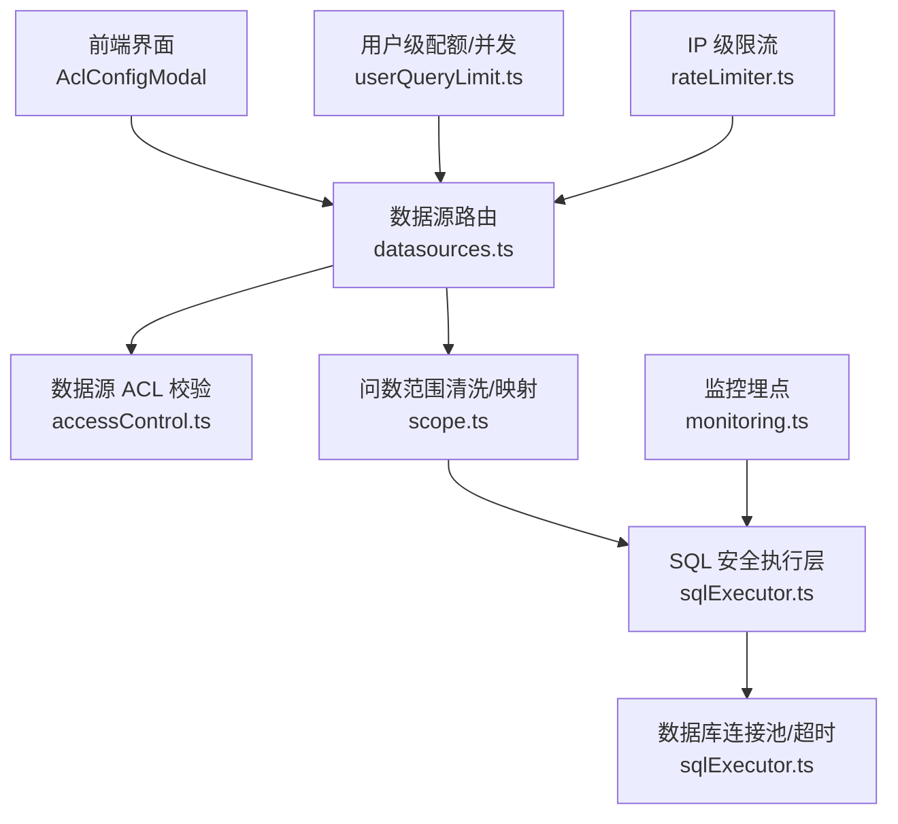
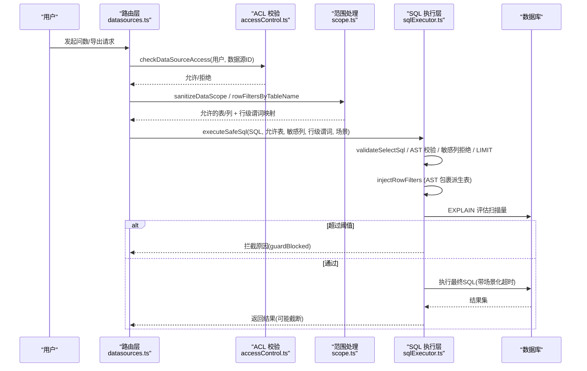
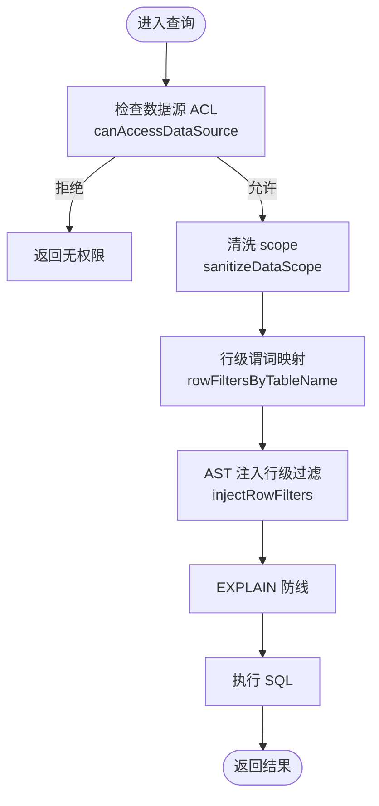
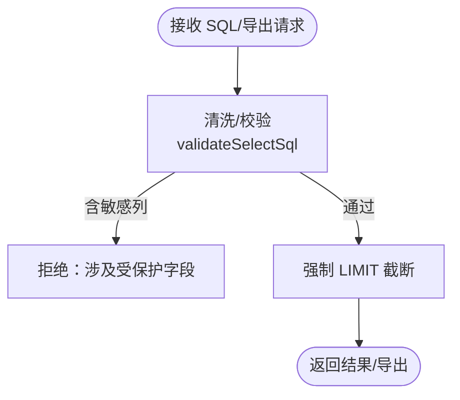
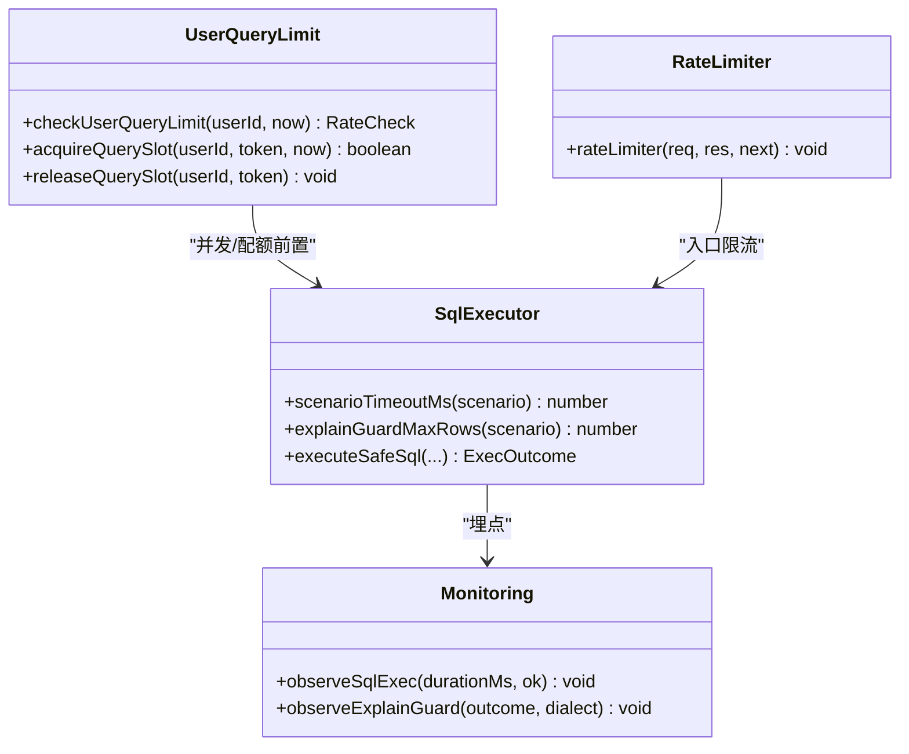
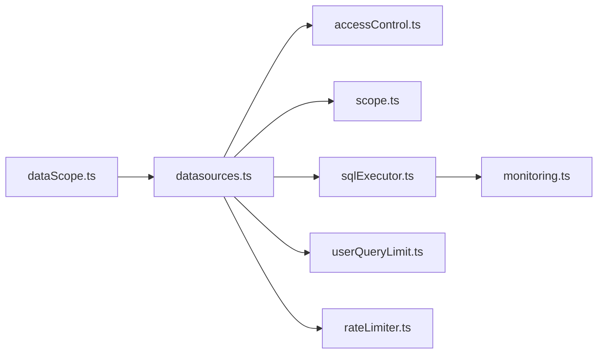

# 数据访问控制

<cite>
**本文引用的文件**
- [server/auth/accessControl.ts](file://server/auth/accessControl.ts)
- [server/query/scope.ts](file://server/query/scope.ts)
- [server/query/sqlExecutor.ts](file://server/query/sqlExecutor.ts)
- [server/routes/datasources.ts](file://server/routes/datasources.ts)
- [src/components/datasource/AclConfigModal.tsx](file://src/components/datasource/AclConfigModal.tsx)
- [server/infra/userQueryLimit.ts](file://server/infra/userQueryLimit.ts)
- [server/infra/rateLimiter.ts](file://server/infra/rateLimiter.ts)
- [server/infra/monitoring.ts](file://server/infra/monitoring.ts)
- [src/utils/dataScope.ts](file://src/utils/dataScope.ts)
</cite>

## 目录
1. [简介](#简介)
2. [项目结构](#项目结构)
3. [核心组件](#核心组件)
4. [架构总览](#架构总览)
5. [详细组件分析](#详细组件分析)
6. [依赖关系分析](#依赖关系分析)
7. [性能与资源限制](#性能与资源限制)
8. [故障排查指南](#故障排查指南)
9. [结论](#结论)
10. [附录：权限配置示例](#附录：权限配置示例)

## 简介
本系统提供企业级数据访问控制能力，覆盖行级、列级与查询限制三大维度：
- 行级权限：基于部门维度的数据源访问控制（ACL）与按表注入的 WHERE 谓词（DataScope），实现“只能看到本部门/本人相关的数据”。
- 列级权限：敏感字段拒绝访问、导出时剔除敏感列、查询结果过滤。
- 查询限制：用户级并发与配额、IP 级限流、场景化超时与 EXPLAIN 防线，保障数据库稳定与资源可控。

## 项目结构
围绕数据访问控制的代码主要分布在以下模块：
- 认证与数据源 ACL：server/auth/accessControl.ts
- 问数范围与行级过滤：server/query/scope.ts
- SQL 安全执行与注入：server/query/sqlExecutor.ts
- 数据源路由与 ACL 下发：server/routes/datasources.ts
- 前端 ACL 配置弹窗：src/components/datasource/AclConfigModal.tsx
- 用户级配额与并发：server/infra/userQueryLimit.ts
- IP 级限流：server/infra/rateLimiter.ts
- 监控埋点：server/infra/monitoring.ts
- 前端 scope 应用：src/utils/dataScope.ts

图表来源
- [server/routes/datasources.ts:368-440](file://server/routes/datasources.ts#L368-L440)
- [server/auth/accessControl.ts:44-73](file://server/auth/accessControl.ts#L44-L73)
- [server/query/scope.ts:28-100](file://server/query/scope.ts#L28-L100)
- [server/query/sqlExecutor.ts:734-832](file://server/query/sqlExecutor.ts#L734-L832)
- [server/infra/userQueryLimit.ts:24-81](file://server/infra/userQueryLimit.ts#L24-L81)
- [server/infra/rateLimiter.ts:14-42](file://server/infra/rateLimiter.ts#L14-L42)
- [server/infra/monitoring.ts:63-78](file://server/infra/monitoring.ts#L63-L78)

章节来源
- [server/routes/datasources.ts:368-440](file://server/routes/datasources.ts#L368-L440)
- [server/auth/accessControl.ts:44-73](file://server/auth/accessControl.ts#L44-L73)
- [server/query/scope.ts:28-100](file://server/query/scope.ts#L28-L100)
- [server/query/sqlExecutor.ts:734-832](file://server/query/sqlExecutor.ts#L734-L832)

## 核心组件
- 数据源 ACL（部门/个人授权）：决定用户能否看到/使用某数据源；管理员不受限。
- DataScope（表/列/行级范围）：限定可问数的表、列，并在执行层强制注入行级 WHERE 谓词。
- SQL 安全执行层：只读白名单、AST 复核、敏感列拒绝、LIMIT 截断、EXPLAIN 防线、场景化超时。
- 配额与并发：用户级每小时次数上限 + 同用户并发互斥；IP 级请求限流。
- 监控：SQL 执行耗时、EXPLAIN 拦截统计等 Prometheus 指标。

章节来源
- [server/auth/accessControl.ts:18-73](file://server/auth/accessControl.ts#L18-L73)
- [server/query/scope.ts:10-100](file://server/query/scope.ts#L10-L100)
- [server/query/sqlExecutor.ts:24-109, 291-387, 396-489, 734-832:24-109](file://server/query/sqlExecutor.ts#L24-L109)
- [server/infra/userQueryLimit.ts:9-81](file://server/infra/userQueryLimit.ts#L9-L81)
- [server/infra/rateLimiter.ts:9-42](file://server/infra/rateLimiter.ts#L9-L42)
- [server/infra/monitoring.ts:63-78](file://server/infra/monitoring.ts#L63-L78)

## 架构总览
下图展示一次“自然语言→SQL→执行”的完整访问控制链路，涵盖 ACL、DataScope、行级注入、EXPLAIN 防线与超时控制。

图表来源
- [server/routes/datasources.ts:368-440](file://server/routes/datasources.ts#L368-L440)
- [server/auth/accessControl.ts:58-73](file://server/auth/accessControl.ts#L58-L73)
- [server/query/scope.ts:46-100](file://server/query/scope.ts#L46-L100)
- [server/query/sqlExecutor.ts:291-387, 396-489, 629-662, 734-832:291-387](file://server/query/sqlExecutor.ts#L291-L387)

## 详细组件分析

### 行级权限控制（部门维度隔离 + 用户范围过滤 + 动态 WHERE 注入）
- 数据源 ACL：以 JSON 存储部门与用户 ID 白名单；非 ADMIN 必须命中任一清单才可访问该数据源。
- DataScope 行级过滤：管理员登记每表的 WHERE 谓词，执行前通过 AST 将受控表包裹为派生表并注入 WHERE，确保无法绕过。
- 前端展示：列表接口对无权限数据源仅返回最小信息并标记 accessDenied。

图表来源
- [server/auth/accessControl.ts:44-73](file://server/auth/accessControl.ts#L44-L73)
- [server/query/scope.ts:46-100](file://server/query/scope.ts#L46-L100)
- [server/query/sqlExecutor.ts:396-489](file://server/query/sqlExecutor.ts#L396-L489)

章节来源
- [server/auth/accessControl.ts:18-73](file://server/auth/accessControl.ts#L18-L73)
- [server/query/scope.ts:17-100](file://server/query/scope.ts#L17-L100)
- [server/routes/datasources.ts:368-400](file://server/routes/datasources.ts#L368-L400)

### 列级权限控制（敏感字段脱敏、导出限制、查询结果过滤）
- 敏感列拒绝：validateSelectSql 会拒绝引用敏感列的 SQL（整词匹配）。
- 导入/导出：文件导入时对列名进行敏感词清洗并剔除敏感列；导出路径由调用方结合 allowedTables/sensitiveColumns 控制。
- 查询结果过滤：服务端在返回前按 maxRows 截断；若需进一步列级过滤，可在上层根据 schema 中 isMetric/isDimension 及业务标注进行投影。

图表来源
- [server/query/sqlExecutor.ts:291-387](file://server/query/sqlExecutor.ts#L291-L387)
- [server/routes/datasources.ts:488-586](file://server/routes/datasources.ts#L488-L586)

章节来源
- [server/query/sqlExecutor.ts:291-387](file://server/query/sqlExecutor.ts#L291-L387)
- [server/routes/datasources.ts:488-586](file://server/routes/datasources.ts#L488-L586)

### 查询限制机制（并发控制、超时设置、资源监控）
- 用户级配额：每小时 N 次（默认 20），支持 Redis 分布式模式；失败关闭策略保证异常时不失控。
- 并发互斥：同一用户同时仅允许 1 个进行中查询；Redis 模式下使用分布式锁，内存模式使用 Map+TTL。
- IP 级限流：每分钟 N 次（默认 30），多实例共享计数。
- 场景化超时：交互/分析链/导出三类场景分别设置超时；MySQL 通过 MAX_EXECUTION_TIME hint 注入，PG 通过 statement_timeout 设置。
- EXPLAIN 防线：预估扫描行数超阈值则拦截，避免大扫描拖垮业务库。
- 监控埋点：SQL 执行耗时、EXPLAIN 拦截统计等指标上报 Prometheus。

图表来源
- [server/infra/userQueryLimit.ts:24-81](file://server/infra/userQueryLimit.ts#L24-L81)
- [server/infra/rateLimiter.ts:14-42](file://server/infra/rateLimiter.ts#L14-L42)
- [server/query/sqlExecutor.ts:62-109, 531-662, 734-832:62-109](file://server/query/sqlExecutor.ts#L62-L109)
- [server/infra/monitoring.ts:63-78](file://server/infra/monitoring.ts#L63-L78)

章节来源
- [server/infra/userQueryLimit.ts:9-98](file://server/infra/userQueryLimit.ts#L9-L98)
- [server/infra/rateLimiter.ts:9-54](file://server/infra/rateLimiter.ts#L9-L54)
- [server/query/sqlExecutor.ts:62-109, 531-662, 734-832:62-109](file://server/query/sqlExecutor.ts#L62-L109)
- [server/infra/monitoring.ts:63-78](file://server/infra/monitoring.ts#L63-L78)

### 前端 ACL 配置与展示
- 管理端弹窗：支持配置“授权部门”和“授权用户 ID”，两组均留空表示不限制；保存后写入数据源 acl_json。
- 列表可见性：非管理员对无权限数据源仅显示名称并标记 accessDenied，引导申请权限。

章节来源
- [src/components/datasource/AclConfigModal.tsx:1-100](file://src/components/datasource/AclConfigModal.tsx#L1-L100)
- [server/routes/datasources.ts:368-400](file://server/routes/datasources.ts#L368-L400)

## 依赖关系分析
- datasources.ts 依赖 accessControl.ts 做 ACL 校验，依赖 scope.ts 做范围清洗与行级谓词映射，依赖 sqlExecutor.ts 执行安全 SQL。
- sqlExecutor.ts 依赖 monitoring.ts 打点，依赖 userQueryLimit.ts 与 rateLimiter.ts 做前置限制。
- 前端 dataScope.ts 与服务端 scope.ts 共同约束可见表/列，但服务端再次强制校验，防止越权。

图表来源
- [server/routes/datasources.ts:1-20](file://server/routes/datasources.ts#L1-L20)
- [server/query/sqlExecutor.ts:11-22](file://server/query/sqlExecutor.ts#L11-L22)
- [server/infra/monitoring.ts:1-15](file://server/infra/monitoring.ts#L1-L15)

章节来源
- [server/routes/datasources.ts:1-20](file://server/routes/datasources.ts#L1-L20)
- [server/query/sqlExecutor.ts:11-22](file://server/query/sqlExecutor.ts#L11-L22)
- [server/infra/monitoring.ts:1-15](file://server/infra/monitoring.ts#L1-L15)

## 性能与资源限制
- 连接池容量：按 EXPECTED_CONCURRENT_USERS 推导，DS_POOL_MAX 显式覆盖；场景化拆分 interactive/chain/export 配额。
- 超时策略：交互 15s、分析链 120s、导出 60s；可通过环境变量覆盖。
- EXPLAIN 防线：默认 100 万行阈值，导出场景放宽 10 倍；可配置开关。
- 结果截断：MAX_ROWS=100000，防止 OOM。
- 监控：SQL 执行耗时直方图、EXPLAIN 拦截计数、HTTP 耗时等。

章节来源
- [server/query/sqlExecutor.ts:44-109, 531-662:44-109](file://server/query/sqlExecutor.ts#L44-L109)
- [server/infra/monitoring.ts:63-88](file://server/infra/monitoring.ts#L63-L88)

## 故障排查指南
- 无权限访问数据源：检查 ACL 是否配置正确；确认用户角色与部门；查看列表接口返回的 accessDenied 标记。
- 被 EXPLAIN 防线拦截：缩小时间范围或增加筛选条件；必要时调整 SQL_EXPLAIN_MAX_ROWS。
- 用户达到问数上限：等待下一小时窗口；检查 REDIS_URL 是否启用分布式配额。
- 并发冲突：确认同一用户未重复发起查询；检查 releaseQuerySlot 是否正常释放。
- 敏感列报错：检查 SQL 是否引用了敏感列；如需导出，确认已剔除敏感列。
- 监控定位：查看 /metrics 中的 sql_execute_duration_seconds 与 sql_explain_guard_total。

章节来源
- [server/auth/accessControl.ts:44-73](file://server/auth/accessControl.ts#L44-L73)
- [server/query/sqlExecutor.ts:531-662](file://server/query/sqlExecutor.ts#L531-L662)
- [server/infra/userQueryLimit.ts:24-81](file://server/infra/userQueryLimit.ts#L24-L81)
- [server/infra/monitoring.ts:63-88](file://server/infra/monitoring.ts#L63-L88)

## 结论
本系统通过“ACL 数据源级 + DataScope 表/列/行级 + SQL 安全执行层 + 配额并发 + EXPLAIN 防线”的多层防护，实现了细粒度、可审计、可观测的企业级数据访问控制。建议在生产环境开启 Redis 模式以获得更稳定的配额与并发控制，并结合监控指标持续优化阈值与范围配置。

## 附录：权限配置示例
- 数据源级别权限（ACL）
  - 目标：仅风险部与特定用户可访问该数据源。
  - 配置要点：在数据源 ACL 中填写 departments=["风险部"] 与 userIds=[3,7]；留空即不限制。
  - 参考：[server/auth/accessControl.ts:18-73](file://server/auth/accessControl.ts#L18-L73)

- 表级别权限（DataScope.tables）
  - 目标：仅允许问数访问 orders、customers 两张表。
  - 配置要点：scope.tables = ["tbl_orders","tbl_customers"]；其他表不可见且不可引用。
  - 参考：[server/query/scope.ts:28-43](file://server/query/scope.ts#L28-L43)

- 字段级别权限（DataScope.columns + 敏感列拒绝）
  - 目标：orders 表仅允许 name、amount 两列；salary 列为敏感列禁止访问。
  - 配置要点：scope.columns["tbl_orders"] = ["name","amount"]；敏感列加入拒绝清单。
  - 参考：[server/query/scope.ts:28-43](file://server/query/scope.ts#L28-L43), [server/query/sqlExecutor.ts:291-387](file://server/query/sqlExecutor.ts#L291-L387)

- 行级权限（DataScope.rowFilters）
  - 目标：orders 表仅允许当前用户的订单（WHERE user_id = ?）。
  - 配置要点：scope.rowFilters["tbl_orders"] = "user_id = ?"；执行层 AST 强制注入。
  - 参考：[server/query/scope.ts:68-100](file://server/query/scope.ts#L68-L100), [server/query/sqlExecutor.ts:396-489](file://server/query/sqlExecutor.ts#L396-L489)

- 查询限制与超时
  - 目标：交互查询 15s 超时，导出任务 60s 超时，单用户并发 1。
  - 配置要点：场景化超时 env 覆盖；用户并发通过 acquireQuerySlot 控制。
  - 参考：[server/query/sqlExecutor.ts:62-109](file://server/query/sqlExecutor.ts#L62-L109), [server/infra/userQueryLimit.ts:56-81](file://server/infra/userQueryLimit.ts#L56-L81)