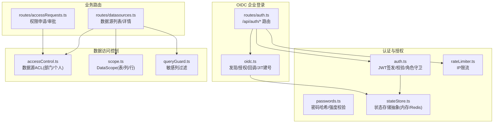
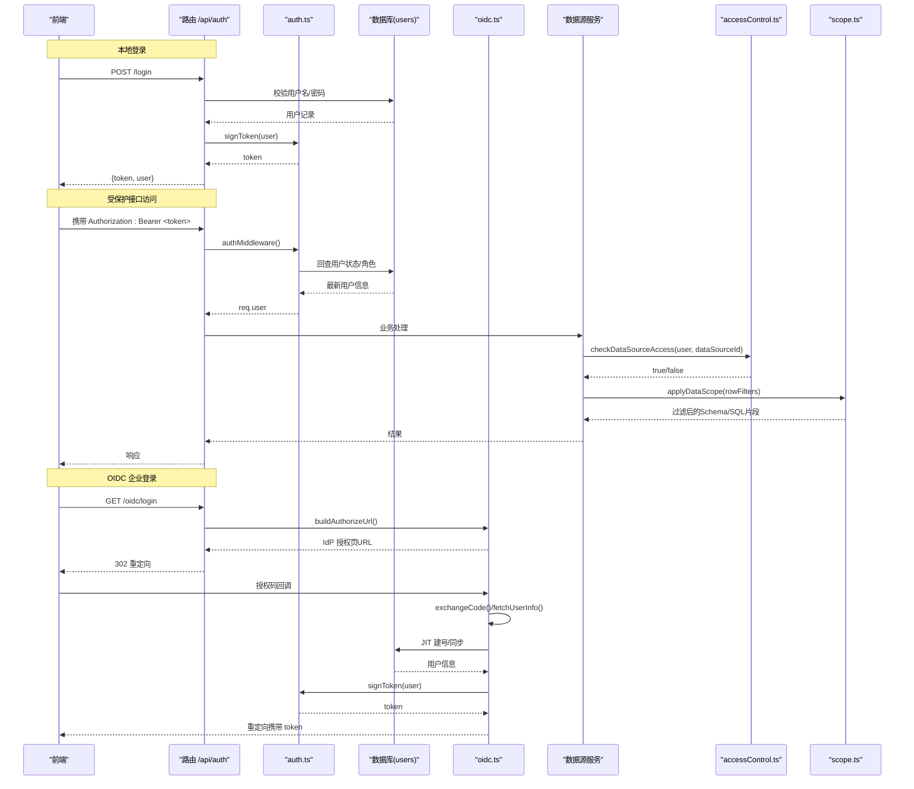
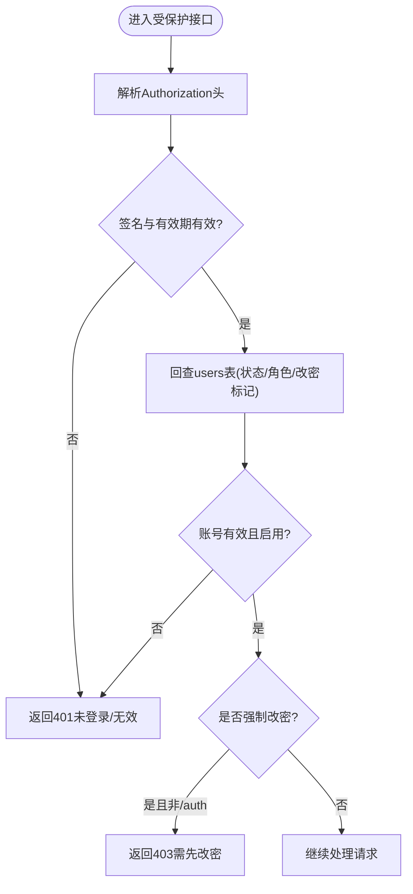
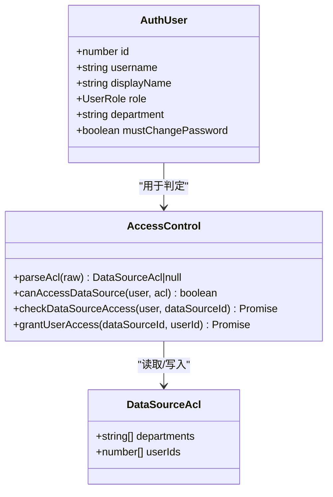
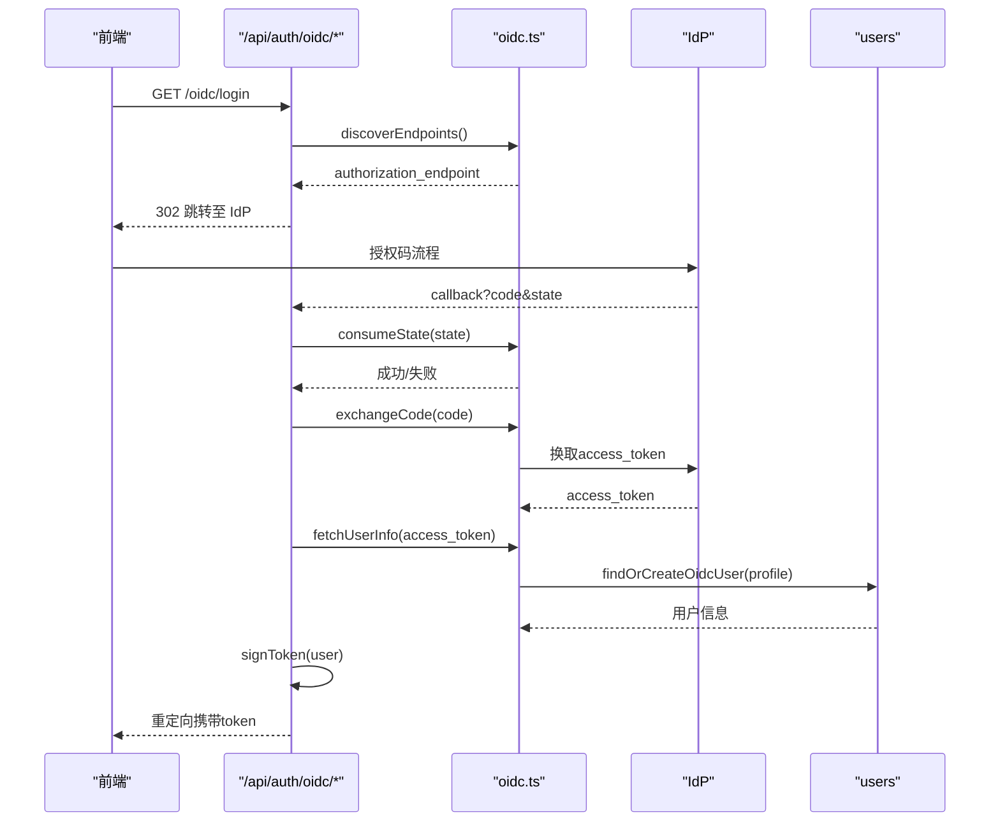
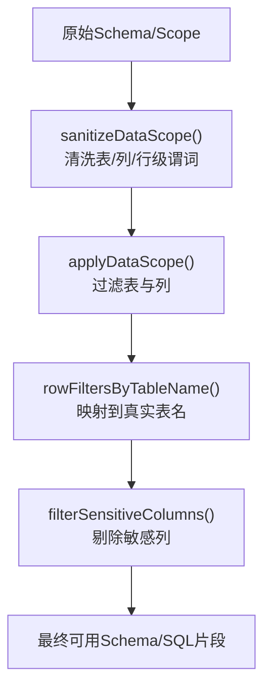
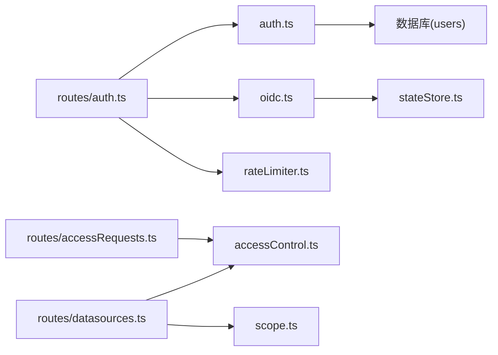

# 认证授权系统

<cite>
**本文引用的文件**
- [server/auth/auth.ts](file://server/auth/auth.ts)
- [server/auth/accessControl.ts](file://server/auth/accessControl.ts)
- [server/auth/oidc.ts](file://server/auth/oidc.ts)
- [server/routes/auth.ts](file://server/routes/auth.ts)
- [server/auth/passwords.ts](file://server/auth/passwords.ts)
- [server/infra/rateLimiter.ts](file://server/infra/rateLimiter.ts)
- [server/infra/stateStore.ts](file://server/infra/stateStore.ts)
- [server/query/scope.ts](file://server/query/scope.ts)
- [server/routes/datasources.ts](file://server/routes/datasources.ts)
- [server/routes/accessRequests.ts](file://server/routes/accessRequests.ts)
</cite>

## 目录
1. [简介](#简介)
2. [项目结构](#项目结构)
3. [核心组件](#核心组件)
4. [架构总览](#架构总览)
5. [详细组件分析](#详细组件分析)
6. [依赖关系分析](#依赖关系分析)
7. [性能与安全考量](#性能与安全考量)
8. [故障排查指南](#故障排查指南)
9. [结论](#结论)
10. [附录：配置与最佳实践](#附录配置与最佳实践)

## 简介
本系统提供企业级认证与授权能力，覆盖以下关键能力：
- JWT 令牌机制：签发、校验、刷新策略与安全存储建议。
- RBAC 权限模型：角色定义（管理员/分析师/访客）、资源访问控制、接口级鉴权。
- OIDC 企业登录集成：身份提供商发现、授权码流程、JIT 建号与用户同步、单点登录。
- 数据访问控制：数据源 ACL（部门/个人）、DataScope（表/列/行级）与动态脱敏（敏感列过滤）。
- 安全加固：密码强度校验、限流防护、状态存储抽象（内存/Redis）、审计与日志。

## 项目结构
认证授权相关代码集中在 server/auth、server/routes 以及 query 层的数据范围控制模块中：
- 认证与鉴权：auth.ts（JWT、中间件、角色守卫）、passwords.ts（密码哈希与强度校验）、rateLimiter.ts（请求限流）。
- OIDC 集成：oidc.ts（发现、授权、回调、JIT 建号）。
- 路由层：routes/auth.ts（登录、当前用户、改密、OIDC 入口与回调）。
- 数据访问控制：accessControl.ts（数据源 ACL）、scope.ts（DataScope 表/列/行级限制与清洗）、queryGuard.ts（敏感列过滤）。
- 数据源管理：routes/datasources.ts（列表对非管理员剥离敏感信息并应用 ACL）。
- 权限申请审批：routes/accessRequests.ts（申请、审批、自动授权）。

图表来源
- [server/auth/auth.ts:1-127](file://server/auth/auth.ts#L1-L127)
- [server/auth/oidc.ts:1-244](file://server/auth/oidc.ts#L1-L244)
- [server/routes/auth.ts:1-156](file://server/routes/auth.ts#L1-L156)
- [server/auth/accessControl.ts:1-108](file://server/auth/accessControl.ts#L1-L108)
- [server/query/scope.ts:1-101](file://server/query/scope.ts#L1-L101)
- [server/query/queryGuard.ts:1-101](file://server/query/queryGuard.ts#L1-L101)
- [server/routes/datasources.ts:364-399](file://server/routes/datasources.ts#L364-L399)
- [server/routes/accessRequests.ts:1-141](file://server/routes/accessRequests.ts#L1-L141)

章节来源
- [server/auth/auth.ts:1-127](file://server/auth/auth.ts#L1-L127)
- [server/auth/oidc.ts:1-244](file://server/auth/oidc.ts#L1-L244)
- [server/routes/auth.ts:1-156](file://server/routes/auth.ts#L1-L156)
- [server/auth/accessControl.ts:1-108](file://server/auth/accessControl.ts#L1-L108)
- [server/query/scope.ts:1-101](file://server/query/scope.ts#L1-L101)
- [server/query/queryGuard.ts:1-101](file://server/query/queryGuard.ts#L1-L101)
- [server/routes/datasources.ts:364-399](file://server/routes/datasources.ts#L364-L399)
- [server/routes/accessRequests.ts:1-141](file://server/routes/accessRequests.ts#L1-L141)

## 核心组件
- JWT 签发与校验：基于 jsonwebtoken，载荷包含用户标识、用户名与角色；支持环境变量配置过期时间；每次鉴权回查 users 表确保禁用/角色变更即时生效。
- 角色守卫：requireRole 用于接口级 RBAC 控制。
- 密码安全：scrypt 哈希 + pepper（可选），统一强度校验，防弱口令与包含用户名。
- 限流：按 IP 的滑动窗口/固定分钟计数，支持 Redis 多实例共享。
- OIDC 集成：基于 discovery 文档获取端点，授权码流程，state 一次性票据（内存或 Redis），JIT 建号与用户属性同步。
- 数据访问控制：
  - 数据源 ACL：按部门或个人白名单控制可见性。
  - DataScope：表/列/行级限制，行级谓词经清洗后注入执行层。
  - 敏感列过滤：在 LLM 上下文前剔除疑似敏感字段。

章节来源
- [server/auth/auth.ts:60-127](file://server/auth/auth.ts#L60-L127)
- [server/auth/passwords.ts:1-100](file://server/auth/passwords.ts#L1-L100)
- [server/infra/rateLimiter.ts:1-54](file://server/infra/rateLimiter.ts#L1-L54)
- [server/auth/oidc.ts:41-244](file://server/auth/oidc.ts#L41-L244)
- [server/auth/accessControl.ts:18-73](file://server/auth/accessControl.ts#L18-L73)
- [server/query/scope.ts:17-101](file://server/query/scope.ts#L17-L101)
- [server/query/queryGuard.ts:71-101](file://server/query/queryGuard.ts#L71-L101)

## 架构总览
下图展示从前端到后端的核心认证与授权调用链，包括本地登录与企业 SSO 两种路径，以及数据访问控制的介入点。

图表来源
- [server/routes/auth.ts:41-153](file://server/routes/auth.ts#L41-L153)
- [server/auth/auth.ts:60-113](file://server/auth/auth.ts#L60-L113)
- [server/auth/oidc.ts:129-244](file://server/auth/oidc.ts#L129-L244)
- [server/auth/accessControl.ts:57-73](file://server/auth/accessControl.ts#L57-L73)
- [server/query/scope.ts:28-101](file://server/query/scope.ts#L28-L101)

## 详细组件分析

### JWT 令牌机制（生成、验证、刷新与安全存储）
- 令牌生成：signToken 将用户标识、用户名与角色写入载荷，使用进程级密钥（生产必须配置固定强密钥），支持可配置的过期时间。
- 令牌验证：authMiddleware 解析 Bearer Token，校验签名与有效期，随后回查 users 表确认账号状态与角色，避免“禁用在途”问题；同时注入 LLM 用户上下文。
- 强制改密：若 must_change_password 为真，除 /api/auth/* 外拒绝访问其他接口，引导用户修改密码。
- 刷新策略：当前实现为短/长时令牌（由环境变量控制）。建议采用“短期 Access Token + 长期 Refresh Token”模式，Refresh Token 应存储在 HttpOnly Cookie 或安全存储中，服务端维护黑名单以支持主动失效。

图表来源
- [server/auth/auth.ts:66-113](file://server/auth/auth.ts#L66-L113)

章节来源
- [server/auth/auth.ts:46-113](file://server/auth/auth.ts#L46-L113)

### RBAC 权限模型（角色、权限分配、资源访问控制）
- 角色定义：ADMIN、ANALYST、VIEWER，通过 requireRole 进行接口级控制。
- 资源访问控制：
  - 数据源 ACL：data_sources.acl_json 支持 departments 与 userIds 白名单；未配置视为不限制；ADMIN 始终放行。
  - 列表接口对非 ADMIN 剥离 tables 等敏感元数据，仅暴露最小必要信息。
  - 权限申请与审批：用户可申请访问，管理员审批通过后自动并入 acl_json.userIds。

图表来源
- [server/auth/auth.ts:13-24](file://server/auth/auth.ts#L13-L24)
- [server/auth/accessControl.ts:13-86](file://server/auth/accessControl.ts#L13-L86)

章节来源
- [server/auth/auth.ts:115-127](file://server/auth/auth.ts#L115-L127)
- [server/auth/accessControl.ts:18-86](file://server/auth/accessControl.ts#L18-L86)
- [server/routes/datasources.ts:364-399](file://server/routes/datasources.ts#L364-L399)
- [server/routes/accessRequests.ts:37-138](file://server/routes/accessRequests.ts#L37-L138)

### OIDC 企业登录集成（身份提供商配置、单点登录、用户同步）
- 配置与发现：通过 OIDC_ISSUER 获取 .well-known/openid-configuration，缓存端点 1 小时。
- 授权码流程：构建授权 URL（含 state 一次性票据），回调时校验 state，交换 access_token，拉取 userinfo。
- JIT 建号与同步：按规范化用户名命中本地账号；不存在则创建（随机密码占位，禁止本地密码登录），已存在则同步 displayName/department，并更新最后登录时间。
- 安全：state 支持内存或 Redis（多实例），失败关闭策略；userinfo 缺失关键字段直接拒绝。

图表来源
- [server/auth/oidc.ts:41-244](file://server/auth/oidc.ts#L41-L244)
- [server/routes/auth.ts:116-153](file://server/routes/auth.ts#L116-L153)

章节来源
- [server/auth/oidc.ts:41-244](file://server/auth/oidc.ts#L41-L244)
- [server/routes/auth.ts:116-153](file://server/routes/auth.ts#L116-L153)

### 数据访问控制（行级、列级、动态脱敏）
- 表级与列级：DataScope.tables 限定可用表，columns[tableId] 限定可用列；applyDataScope 根据 scope 过滤 Schema。
- 行级：rowFilters[tableId] 为 WHERE 片段，sanitizeRowFilterPredicate 严格清洗（禁止多语句、注释、子查询、SELECT/INTO 等），执行层按真实表名注入。
- 动态脱敏：filterSensitiveColumns 在 LLM 上下文前剔除疑似敏感列（如密码、密钥、身份证等），并返回被移除清单供审计。

图表来源
- [server/query/scope.ts:17-101](file://server/query/scope.ts#L17-L101)
- [server/query/queryGuard.ts:71-101](file://server/query/queryGuard.ts#L71-L101)

章节来源
- [server/query/scope.ts:17-101](file://server/query/scope.ts#L17-L101)
- [server/query/queryGuard.ts:71-101](file://server/query/queryGuard.ts#L71-L101)

### 密码安全与存储
- 哈希算法：scrypt（N=2^15, r=8, p=1），支持 pepper（SCRYPT_PEPPER），兼容旧格式。
- 强度校验：长度 8-64，必须包含字母与数字，排除常见弱口令与包含用户名的口令。
- 存储建议：密码哈希落库；pepper 通过环境变量注入，与库表分离；生产环境务必配置强密钥。

章节来源
- [server/auth/passwords.ts:1-100](file://server/auth/passwords.ts#L1-L100)

### 限流与状态存储
- 限流：按 IP 计数，默认内存滑动窗口；配置 REDIS_URL 后切换为 Redis 固定分钟窗口 INCR，多实例共享。
- 状态存储：抽象 StateStore，支持 Memory/Redis；提供 TTL、原子 getDel、分布式锁等能力；启动预热 warmStateStore 消除冷启动窗口。

章节来源
- [server/infra/rateLimiter.ts:1-54](file://server/infra/rateLimiter.ts#L1-L54)
- [server/infra/stateStore.ts:1-219](file://server/infra/stateStore.ts#L1-L219)

## 依赖关系分析
- 路由层依赖认证中间件与角色守卫，确保所有受保护接口均经过 JWT 校验与用户上下文注入。
- 数据源路由依赖 ACL 与 DataScope，保证非管理员不可见敏感元数据，并在问数链路中强制注入行级过滤。
- OIDC 依赖状态存储（内存/Redis）保障 state 的一次性与跨实例一致性。
- 密码模块独立，供登录与改密流程复用。

图表来源
- [server/routes/auth.ts:1-156](file://server/routes/auth.ts#L1-L156)
- [server/auth/auth.ts:1-127](file://server/auth/auth.ts#L1-L127)
- [server/auth/oidc.ts:1-244](file://server/auth/oidc.ts#L1-L244)
- [server/routes/datasources.ts:364-399](file://server/routes/datasources.ts#L364-L399)
- [server/routes/accessRequests.ts:1-141](file://server/routes/accessRequests.ts#L1-L141)
- [server/infra/rateLimiter.ts:1-54](file://server/infra/rateLimiter.ts#L1-L54)
- [server/infra/stateStore.ts:1-219](file://server/infra/stateStore.ts#L1-L219)

## 性能与安全考量
- 性能
  - OIDC 端点发现缓存 1 小时，减少外部依赖延迟。
  - 状态存储支持 Redis，限流与 state 在多实例下共享，避免热点键竞争。
  - DataScope 与行级谓词在服务端执行，避免不必要的数据传输。
- 安全
  - JWT 密钥生产环境必须配置固定强密钥；开发环境自动生成临时密钥，重启即失效。
  - 密码哈希使用 scrypt，参数可调；pepper 与环境变量绑定，降低拖库风险。
  - 输入净化与注入检测（提示词注入、控制字符）在 LLM 调用前强制执行。
  - 限流防止暴力破解与滥用；state 一次性消费，防 CSRF。
  - 敏感列过滤与最小化元数据下发，降低泄露面。

[本节为通用指导，无需具体文件引用]

## 故障排查指南
- 登录失败
  - 检查用户名/密码是否正确，账号是否启用；查看登录接口限流是否触发。
  - 参考：[server/routes/auth.ts:41-77](file://server/routes/auth.ts#L41-L77)、[server/infra/rateLimiter.ts:14-42](file://server/infra/rateLimiter.ts#L14-L42)
- OIDC 登录异常
  - 确认 OIDC_ISSUER/OIDC_CLIENT_ID 已配置；检查 discovery 文档是否完整；state 是否过期或被重复消费。
  - 参考：[server/auth/oidc.ts:41-87](file://server/auth/oidc.ts#L41-L87)、[server/auth/oidc.ts:100-127](file://server/auth/oidc.ts#L100-L127)、[server/routes/auth.ts:121-153](file://server/routes/auth.ts#L121-L153)
- 无权限访问数据源
  - 检查数据源 ACL 是否配置；用户是否在 userIds 或部门白名单；管理员始终放行。
  - 参考：[server/auth/accessControl.ts:43-73](file://server/auth/accessControl.ts#L43-L73)、[server/routes/datasources.ts:364-399](file://server/routes/datasources.ts#L364-L399)
- 行级过滤未生效
  - 确认 rowFilters 已正确清洗并通过 rowFiltersByTableName 映射到真实表名。
  - 参考：[server/query/scope.ts:17-101](file://server/query/scope.ts#L17-L101)
- 限流误伤
  - 检查 RATE_LIMIT_MAX 与 REDIS_URL 配置；确认 key 命名与窗口逻辑。
  - 参考：[server/infra/rateLimiter.ts:1-54](file://server/infra/rateLimiter.ts#L1-L54)

章节来源
- [server/routes/auth.ts:41-153](file://server/routes/auth.ts#L41-L153)
- [server/auth/oidc.ts:41-127](file://server/auth/oidc.ts#L41-L127)
- [server/auth/accessControl.ts:43-73](file://server/auth/accessControl.ts#L43-L73)
- [server/query/scope.ts:17-101](file://server/query/scope.ts#L17-L101)
- [server/infra/rateLimiter.ts:1-54](file://server/infra/rateLimiter.ts#L1-L54)

## 结论
本认证授权体系以 JWT 为核心，结合 RBAC、OIDC 企业登录与多层数据访问控制，形成纵深防御：
- 接口级鉴权与角色守卫确保功能边界清晰。
- 数据源 ACL 与 DataScope 实现细粒度资源隔离。
- 行级谓词与敏感列过滤保障数据安全。
- 限流、状态存储抽象与密码安全强化整体韧性。
建议在生产环境中完善令牌刷新策略、启用 Redis 状态存储与强密钥配置，并持续监控与审计。

[本节为总结，无需具体文件引用]

## 附录：配置与最佳实践
- 环境变量
  - JWT_SECRET：生产必须配置固定强密钥；JWT_EXPIRES_IN：令牌过期时间。
  - OIDC_ISSUER、OIDC_CLIENT_ID、OIDC_CLIENT_SECRET、OIDC_REDIRECT_URI、OIDC_DEFAULT_ROLE：企业 SSO 配置。
  - SCRYPT_PEPPER：密码哈希 pepper，与库表分离。
  - RATE_LIMIT_MAX：登录等接口的每分钟最大请求数。
  - REDIS_URL：启用 Redis 状态存储，支持多实例共享与 TTL。
- 最佳实践
  - 令牌刷新：引入短期 Access Token 与长期 Refresh Token，Refresh Token 存于 HttpOnly Cookie，服务端维护黑名单。
  - 最小权限：默认 VIEWER，按需提升；数据源 ACL 优先部门白名单，必要时添加个人白名单。
  - 行级过滤：仅登记必要谓词，避免复杂 SQL 片段；定期审查与清理。
  - 安全基线：启用限流、开启审计日志、定期轮换密钥与 pepper。
  - 多实例部署：启用 Redis 状态存储，预热 warmStateStore 避免冷启动失败。

[本节为通用指导，无需具体文件引用]