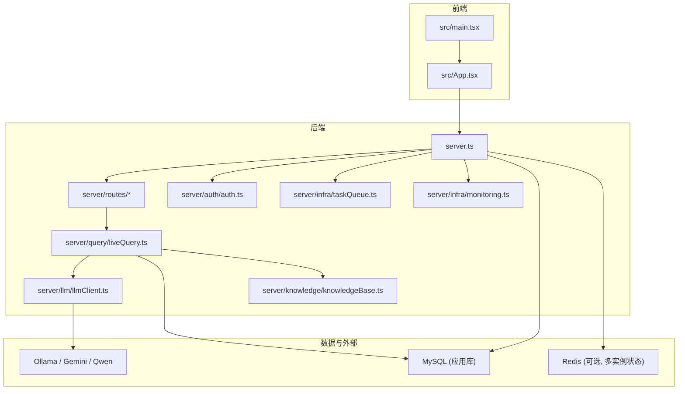
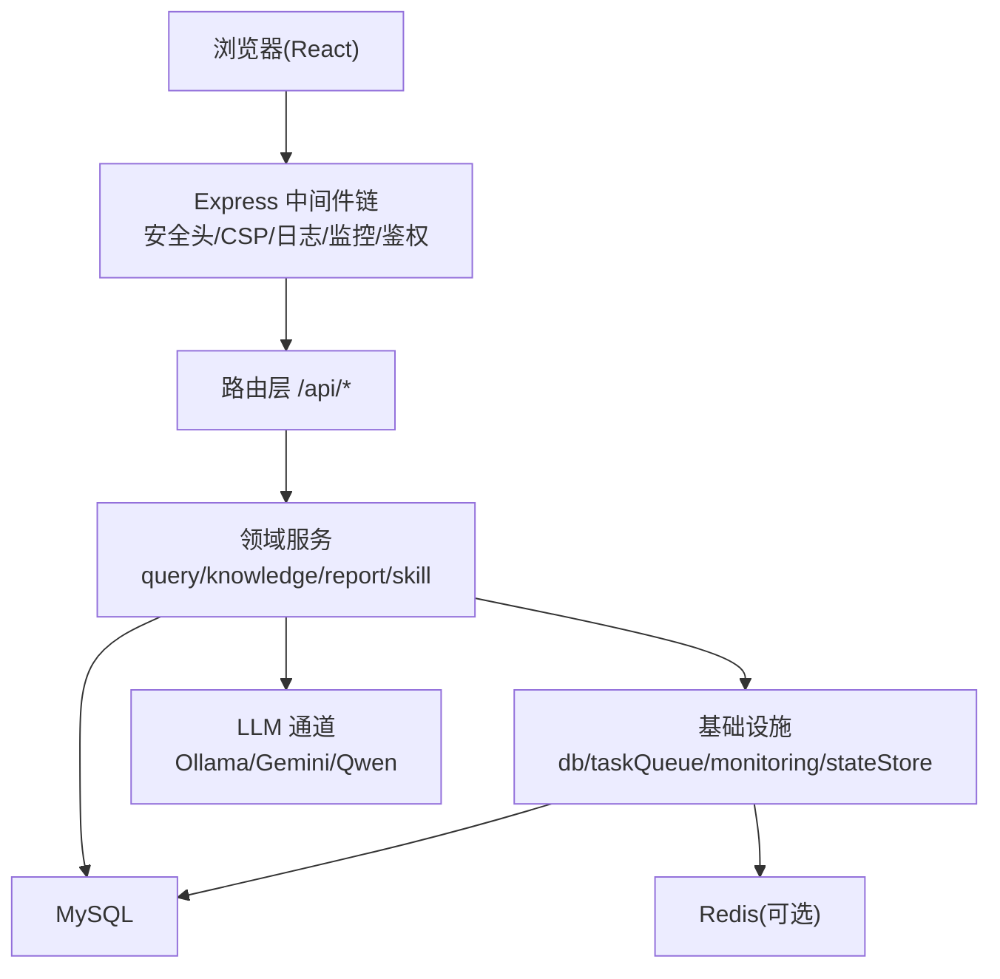
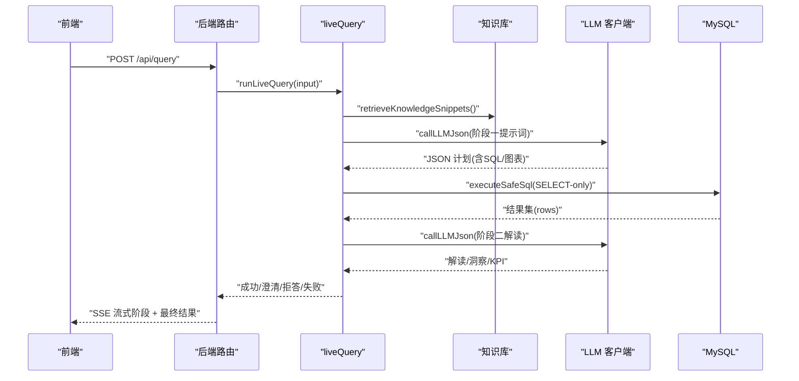
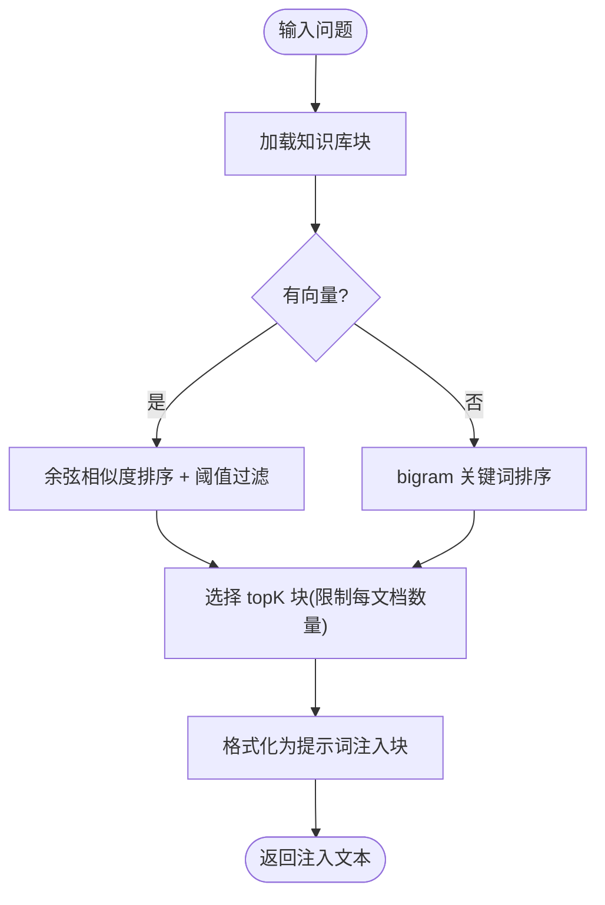
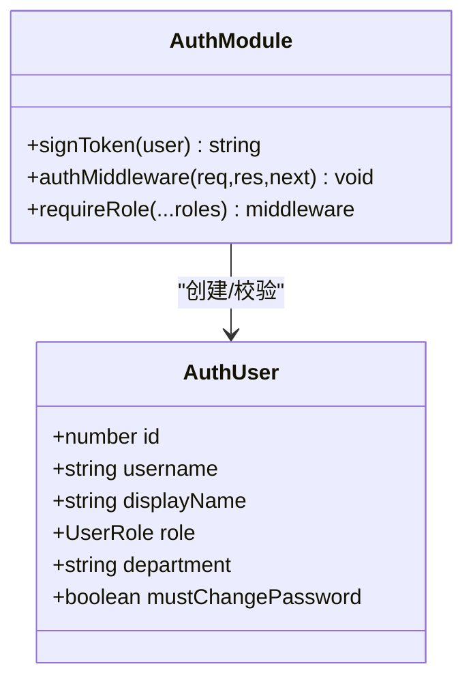
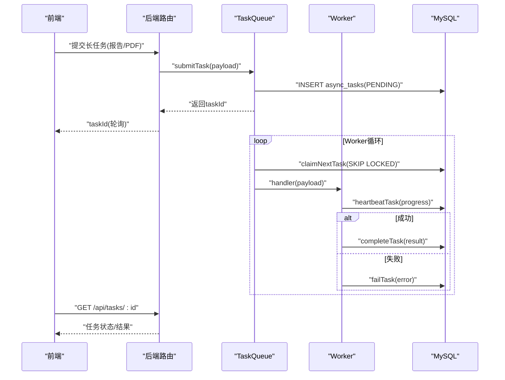
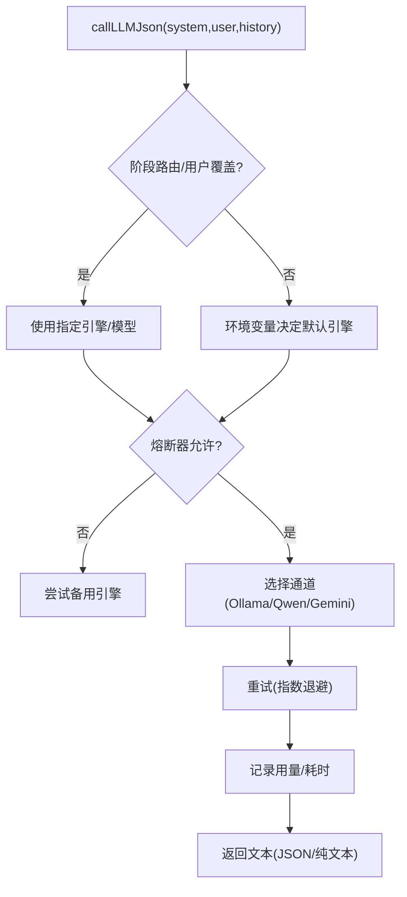
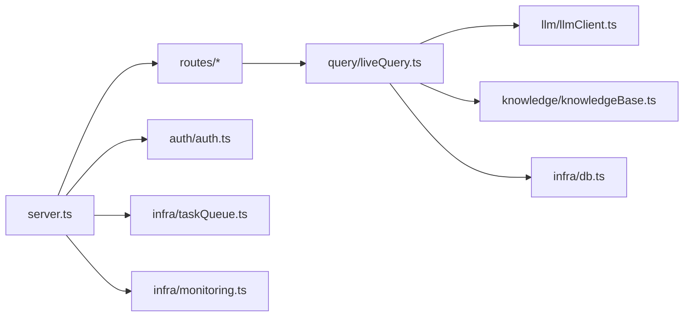

# 系统架构

<cite>
**本文引用的文件**
- [server.ts](file://server.ts)
- [src/main.tsx](file://src/main.tsx)
- [package.json](file://package.json)
- [Dockerfile](file://Dockerfile)
- [server/infra/db.ts](file://server/infra/db.ts)
- [server/auth/auth.ts](file://server/auth/auth.ts)
- [server/query/liveQuery.ts](file://server/query/liveQuery.ts)
- [server/knowledge/knowledgeBase.ts](file://server/knowledge/knowledgeBase.ts)
- [server/llm/llmClient.ts](file://server/llm/llmClient.ts)
- [server/infra/taskQueue.ts](file://server/infra/taskQueue.ts)
- [server/infra/monitoring.ts](file://server/infra/monitoring.ts)
- [src/App.tsx](file://src/App.tsx)
</cite>

## 目录
1. [简介](#简介)
2. [项目结构](#项目结构)
3. [核心组件](#核心组件)
4. [架构总览](#架构总览)
5. [详细组件分析](#详细组件分析)
6. [依赖关系分析](#依赖关系分析)
7. [性能与可扩展性](#性能与可扩展性)
8. [故障排查指南](#故障排查指南)
9. [结论](#结论)
10. [附录](#附录)

## 简介
本系统为“智能问数据分析系统”，采用前后端分离、单进程多路由的 Express 后端 + React 前端架构，结合事件驱动（SSE 流式推进、异步任务队列）与多 LLM 通道统一接入，提供自然语言到 SQL 的智能问数、报告生成、知识库检索、权限控制与可观测性能力。整体设计强调：
- 安全优先：生产环境 fail-fast、CSP/HSTS、RBAC、行级权限、SELECT-only 执行、审计留痕
- 高可用韧性：LLM 熔断/重试/自适应超时、多引擎故障转移、SSE 断线续传、任务心跳与孤儿回收
- 可扩展性：多实例共享状态（Redis）、多后端 Ollama、多 LLM 引擎、模块化路由与中间件
- 可观测性：Prometheus 指标、请求日志、链路追踪、用量统计

## 项目结构
- 前端（React + Vite）：位于 src，包含页面、组件、hooks、工具；入口 main.tsx 挂载 App，App 按角色与路由渲染功能模块
- 后端（Express + TypeScript）：server.ts 启动服务，注册中间件与路由；业务逻辑按领域拆分至 server/*（auth、query、knowledge、llm、report、routes 等）
- 数据层：MySQL 连接池与表初始化在 infra/db.ts；可选 Redis 用于多实例状态共享
- 部署：Dockerfile 多阶段构建，生产以 node dist/server.cjs 运行，暴露 /api/health 健康检查

图表来源
- [server.ts:82-299](file://server.ts#L82-L299)
- [src/main.tsx:1-27](file://src/main.tsx#L1-L27)
- [src/App.tsx:19-104](file://src/App.tsx#L19-L104)
- [server/query/liveQuery.ts:189-749](file://server/query/liveQuery.ts#L189-L749)
- [server/knowledge/knowledgeBase.ts:1-239](file://server/knowledge/knowledgeBase.ts#L1-L239)
- [server/llm/llmClient.ts:1-606](file://server/llm/llmClient.ts#L1-L606)
- [server/auth/auth.ts:1-127](file://server/auth/auth.ts#L1-L127)
- [server/infra/taskQueue.ts:1-347](file://server/infra/taskQueue.ts#L1-L347)
- [server/infra/monitoring.ts:1-153](file://server/infra/monitoring.ts#L1-L153)

章节来源
- [server.ts:82-299](file://server.ts#L82-L299)
- [package.json:1-76](file://package.json#L1-L76)
- [Dockerfile:1-47](file://Dockerfile#L1-L47)

## 核心组件
- 表现层（React 前端）
  - 入口 main.tsx 配置 API 鉴权注入与主题；App.tsx 按用户角色与 Tab 路由渲染查询、报表、数据源管理、看板等视图
- 业务逻辑层（Express 后端）
  - server.ts 装配中间件（安全头、CORS/CSP、请求日志、限流/配额、监控埋点），注册各域路由（认证、数据源、问数、报告、知识、技能、运维等）
  - routes/* 将 HTTP 请求分发到领域服务（如 query、report、knowledge）
- 数据访问层（数据库连接池）
  - infra/db.ts 负责 MySQL 连接池、建库建表、种子数据与迁移；支持连接池容量公式化与幂等 DDL
- AI 集成层（多 LLM 支持）
  - llmClient.ts 统一封装 Ollama/Gemini/Qwen，提供 JSON/Text 调用、模型路由、并发信号量、重试、熔断、自适应超时、用量埋点
- 查询处理引擎
  - liveQuery.ts 实现两阶段问数编排：阶段一生成 SQL（模板匹配+自由生成+多候选多数表决+自省），阶段二基于真实结果生成解读；内置 EXPLAIN 防线、行级权限、敏感列过滤
- 知识库系统
  - knowledgeBase.ts 实现 RAG：文档切块、向量/关键词检索、阈值过滤、提示词注入；支持外部知识库接入
- 权限控制模块
  - auth.ts 实现 JWT 签发/校验、RBAC、强制改密、部门维度授权上下文注入
- 监控告警系统
  - monitoring.ts 暴露 Prometheus 指标（HTTP、NL2SQL、缓存命中、LLM 调用、SQL 执行、EXPLAIN 守卫）；server.ts 提供 /metrics 端点
- 异步任务与事件驱动
  - taskQueue.ts 基于 MySQL 的任务表与 worker，支持长任务（报告/PDF 导出）提交即返回 taskId，心跳与孤儿回收；SSE 重放缓冲保障流式体验

章节来源
- [src/main.tsx:1-27](file://src/main.tsx#L1-L27)
- [src/App.tsx:19-104](file://src/App.tsx#L19-L104)
- [server.ts:82-299](file://server.ts#L82-L299)
- [server/infra/db.ts:1-817](file://server/infra/db.ts#L1-L817)
- [server/llm/llmClient.ts:1-606](file://server/llm/llmClient.ts#L1-L606)
- [server/query/liveQuery.ts:189-749](file://server/query/liveQuery.ts#L189-L749)
- [server/knowledge/knowledgeBase.ts:1-239](file://server/knowledge/knowledgeBase.ts#L1-L239)
- [server/auth/auth.ts:1-127](file://server/auth/auth.ts#L1-L127)
- [server/infra/monitoring.ts:1-153](file://server/infra/monitoring.ts#L1-L153)
- [server/infra/taskQueue.ts:1-347](file://server/infra/taskQueue.ts#L1-L347)

## 架构总览
系统采用分层与模块化设计：
- 表现层：React SPA，通过 API Client 与后端交互，使用 Zustand 管理本地状态
- 网关与安全层：Express 中间件链（安全响应头、CSP、请求日志、监控直方图、鉴权中间件）
- 业务路由层：按领域拆分的 routes/*，承载认证、数据源、问数、报告、知识、技能、运维等
- 领域服务层：query、knowledge、report、skill 等模块实现核心业务编排
- 基础设施层：db、taskQueue、monitoring、stateStore（Redis）
- AI 层：统一 LLM 客户端，多引擎抽象与韧性机制

图表来源
- [server.ts:133-299](file://server.ts#L133-L299)
- [server/query/liveQuery.ts:189-749](file://server/query/liveQuery.ts#L189-L749)
- [server/llm/llmClient.ts:1-606](file://server/llm/llmClient.ts#L1-L606)
- [server/infra/db.ts:1-817](file://server/infra/db.ts#L1-L817)
- [server/infra/taskQueue.ts:1-347](file://server/infra/taskQueue.ts#L1-L347)
- [server/infra/monitoring.ts:1-153](file://server/infra/monitoring.ts#L1-L153)

## 详细组件分析

### 查询处理引擎（liveQuery）
- 两阶段编排：阶段一生成 SQL（模板匹配+自由生成+多候选多数表决+自省），阶段二基于真实结果生成解读
- 并行上下文构建：few-shot、知识库 RAG、外部知识库、语义指标、反例、个人沉淀、铁律规则
- 安全执行：SELECT-only、白名单、行级权限、超时保护；EXPLAIN 防线拦截并给一次自纠错机会
- 复杂度评估与中间表清洗链：复杂问题自动触发多步分析，中间表落库并定时清理
- SSE 进度回调：understanding/executed/introspecting/analyzing 等阶段实时推送

图表来源
- [server/query/liveQuery.ts:189-749](file://server/query/liveQuery.ts#L189-L749)
- [server/knowledge/knowledgeBase.ts:207-239](file://server/knowledge/knowledgeBase.ts#L207-L239)
- [server/llm/llmClient.ts:449-525](file://server/llm/llmClient.ts#L449-L525)

章节来源
- [server/query/liveQuery.ts:189-749](file://server/query/liveQuery.ts#L189-L749)

### 知识库系统（RAG）
- 文档切块与嵌入：按段落合并、重叠切块，批量 embedding；无 embedding 时降级 bigram 关键词检索
- 相关性排序：余弦相似度阈值过滤，保留高价值口径/指南类文档槽位，避免字典类文档挤占
- 提示词注入：将命中片段以强指令形式注入阶段一，约束口径/术语/枚举，不放开表列白名单

图表来源
- [server/knowledge/knowledgeBase.ts:43-166](file://server/knowledge/knowledgeBase.ts#L43-L166)
- [server/knowledge/knowledgeBase.ts:207-239](file://server/knowledge/knowledgeBase.ts#L207-L239)

章节来源
- [server/knowledge/knowledgeBase.ts:1-239](file://server/knowledge/knowledgeBase.ts#L1-L239)

### 权限控制模块（Auth）
- JWT 签发与校验：生产环境必须设置 JWT_SECRET，否则 fail-fast；开发环境随机密钥
- RBAC：ADMIN/ANALYST/VIEWER 角色守卫；强制改密流程阻断非认证接口
- 组织维度：department 字段参与数据源 ACL 匹配；鉴权后注入 LLM 用户上下文用于用量统计

图表来源
- [server/auth/auth.ts:13-127](file://server/auth/auth.ts#L13-L127)

章节来源
- [server/auth/auth.ts:1-127](file://server/auth/auth.ts#L1-L127)

### 异步任务与事件驱动（TaskQueue + SSE）
- 任务队列：MySQL 表持久化，worker 并发上限，用户排队上限，心跳与孤儿回收，失败重试上限
- SSE 重放缓冲：按 traceId 记录事件序列，断线后可续传已完成阶段，终态 TTL 清理

图表来源
- [server/infra/taskQueue.ts:120-347](file://server/infra/taskQueue.ts#L120-L347)

章节来源
- [server/infra/taskQueue.ts:1-347](file://server/infra/taskQueue.ts#L1-L347)

### 多 LLM 通道与韧性
- 统一调用：callLLMJson/callLLMText 支持 JSON/纯文本输出
- 模型路由：阶段级快速模型（SQL 生成/分析解读）与环境变量覆盖；用户请求级自选模型优先
- 韧性机制：信号量并发限制、指数退避重试、熔断器（连续失败开路）、自适应超时、故障转移（主引擎开路切换备用）
- 用量埋点：token 与耗时记录，支撑成本对比与审计

图表来源
- [server/llm/llmClient.ts:163-525](file://server/llm/llmClient.ts#L163-L525)

章节来源
- [server/llm/llmClient.ts:1-606](file://server/llm/llmClient.ts#L1-L606)

### 监控与可观测性
- Prometheus 指标：HTTP 接口耗时、NL2SQL 请求/耗时、缓存命中、LLM 调用耗时/token、SQL 执行耗时、EXPLAIN 守卫
- 安全与合规：生产 CSP/HSTS、X-Content-Type-Options、Referrer-Policy；/metrics 可选 token 保护
- 审计与追踪：requestLogger、query_trace、query_audit_log、llm_usage

章节来源
- [server/infra/monitoring.ts:1-153](file://server/infra/monitoring.ts#L1-L153)
- [server.ts:145-193](file://server.ts#L145-L193)

## 依赖关系分析
- 耦合与内聚
  - server.ts 作为装配中心，低耦合地引入各模块；路由与中间件职责清晰
  - liveQuery 高度内聚于查询编排，依赖 llmClient、knowledge、sqlExecutor、metrics、ironRules 等
  - db.ts 集中管理连接池与 DDL，被多处复用
- 直接/间接依赖
  - routes/* -> 领域服务 -> 基础设施(db/taskQueue/monitoring) -> 外部(LLMs/Redis/MySQL)
  - 无循环依赖迹象；模块间通过函数/类型契约解耦
- 外部依赖
  - Express、mysql2、ioredis、jsonwebtoken、prom-client、@google/genai、node-sql-parser 等

图表来源
- [server.ts:21-64](file://server.ts#L21-L64)
- [server/query/liveQuery.ts:16-43](file://server/query/liveQuery.ts#L16-L43)
- [server/llm/llmClient.ts:1-27](file://server/llm/llmClient.ts#L1-L27)
- [server/knowledge/knowledgeBase.ts:8-11](file://server/knowledge/knowledgeBase.ts#L8-L11)
- [server/infra/db.ts:1-13](file://server/infra/db.ts#L1-L13)

章节来源
- [server.ts:21-64](file://server.ts#L21-L64)

## 性能与可扩展性
- 可扩展性
  - 多实例：Redis 预热与共享状态；任务队列 SKIP LOCKED 多 worker 并发；Ollama 多后端健康检查
  - 多 LLM：环境变量与运行时覆盖，阶段级快速模型路由，故障转移
  - 模块化路由：新增功能通过新路由与模块扩展，不影响现有链路
- 安全性
  - 生产 fail-fast（JWT_SECRET 缺失拒绝启动）；CSP/HSTS；RBAC；行级权限；SELECT-only；审计留痕
- 性能优化
  - Schema Linking 圈表/列裁剪减少 prompt 占用；模板匹配确定性拼装 SQL；多候选并行生成与多数表决；SSE 重放避免重复执行；连接池容量公式化；监控指标定位瓶颈

章节来源
- [server.ts:82-131](file://server.ts#L82-L131)
- [server/query/liveQuery.ts:210-357](file://server/query/liveQuery.ts#L210-L357)
- [server/llm/llmClient.ts:61-107](file://server/llm/llmClient.ts#L61-L107)
- [server/infra/db.ts:35-43](file://server/infra/db.ts#L35-L43)

## 故障排查指南
- 启动失败
  - 生产环境未设置 JWT_SECRET：检查环境变量；容器镜像要求 HOST=0.0.0.0
- 认证异常
  - 401/403：检查 JWT 是否有效、用户状态是否 ACTIVE、是否强制改密
- 问数失败
  - LLM 调用失败：查看熔断状态、重试次数、超时；检查引擎配置与密钥
  - SQL 执行失败：关注 EXPLAIN 防线拦截原因、行级权限、敏感列过滤
- 任务卡住
  - 检查 worker 心跳与孤儿回收；确认任务超时与最大尝试次数
- 监控与日志
  - /metrics 获取 Prometheus 指标；查看 requestLogger 与 query_trace/audit_log

章节来源
- [server.ts:91-96](file://server.ts#L91-L96)
- [server/auth/auth.ts:66-113](file://server/auth/auth.ts#L66-L113)
- [server/query/liveQuery.ts:553-627](file://server/query/liveQuery.ts#L553-L627)
- [server/infra/taskQueue.ts:206-227](file://server/infra/taskQueue.ts#L206-L227)
- [server/infra/monitoring.ts:137-153](file://server/infra/monitoring.ts#L137-L153)

## 结论
本系统以 Express 为中心的后端与 React 前端构成前后端分离架构，通过模块化路由与领域服务实现清晰的职责划分。查询处理引擎在两阶段编排中融合模板匹配、RAG、语义指标与铁律规则，确保 SQL 生成的准确性与可解释性。多 LLM 通道与韧性机制保障高可用，任务队列与 SSE 重放提升长任务与流式体验。监控与审计贯穿全链路，满足企业级可观测性与合规需求。未来可在多实例水平扩展、更多数据源适配、更丰富的可视化能力上持续演进。

## 附录
- 部署要点
  - Docker 多阶段构建，生产仅安装生产依赖；健康检查 /api/health
  - 环境变量：JWT_SECRET、MYSQL_*、REDIS_URL、AI_ENGINE、LLM_*、QWEN_*、GEMINI_*
- 关键路径
  - 前端入口：src/main.tsx -> src/App.tsx
  - 后端入口：server.ts -> routes/* -> 领域服务 -> 基础设施/LLM/DB

章节来源
- [Dockerfile:18-47](file://Dockerfile#L18-L47)
- [src/main.tsx:1-27](file://src/main.tsx#L1-L27)
- [src/App.tsx:19-104](file://src/App.tsx#L19-L104)
- [server.ts:82-299](file://server.ts#L82-L299)