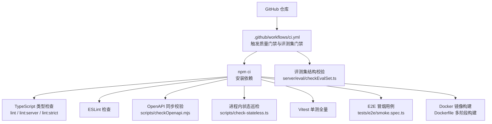
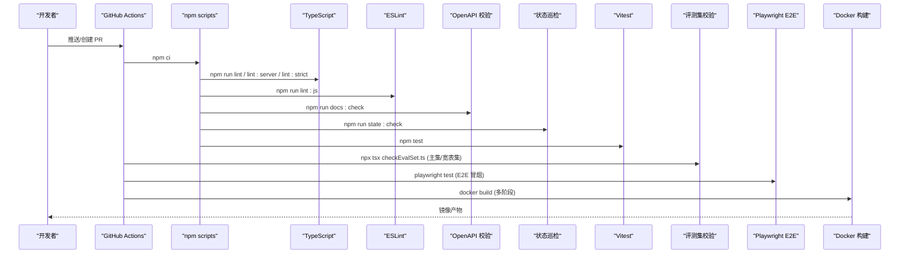
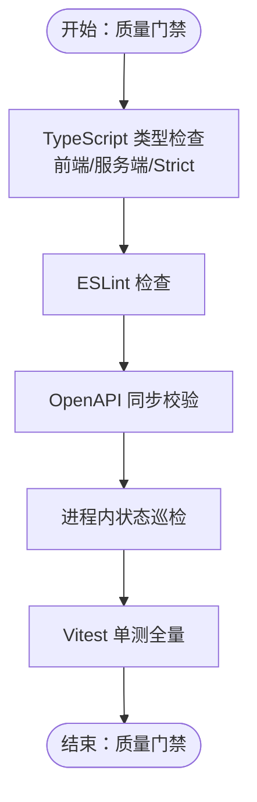
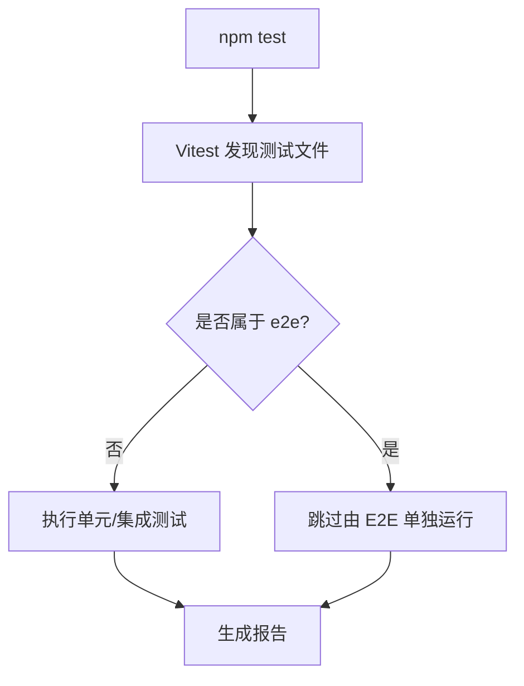
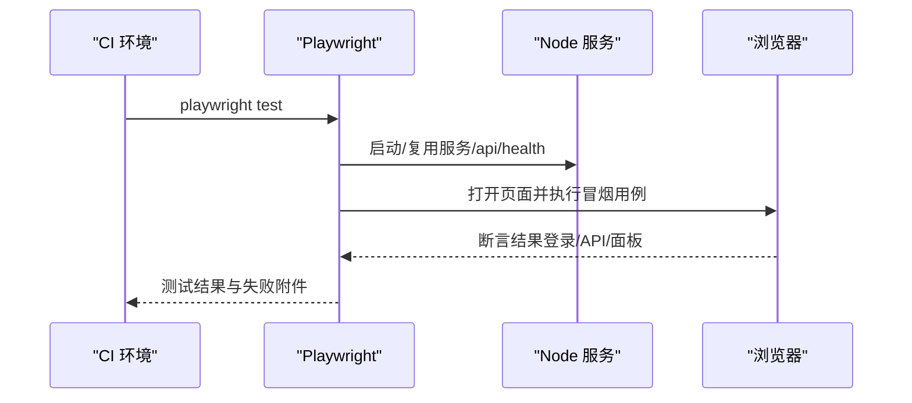
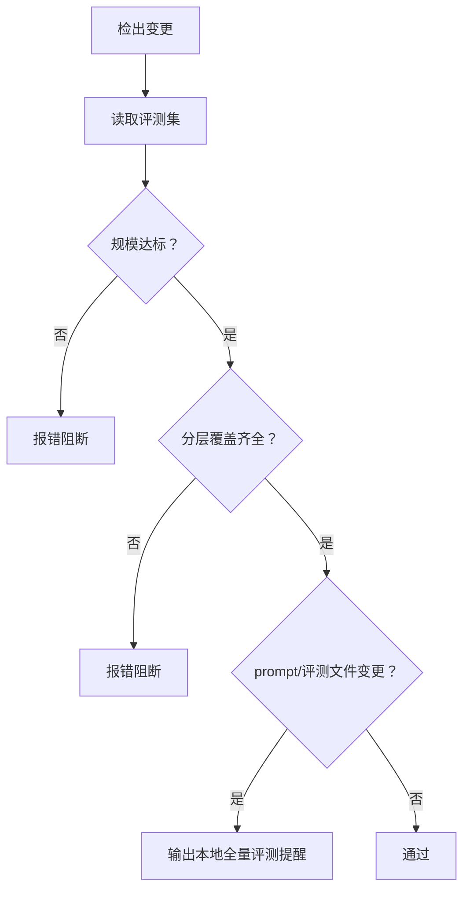
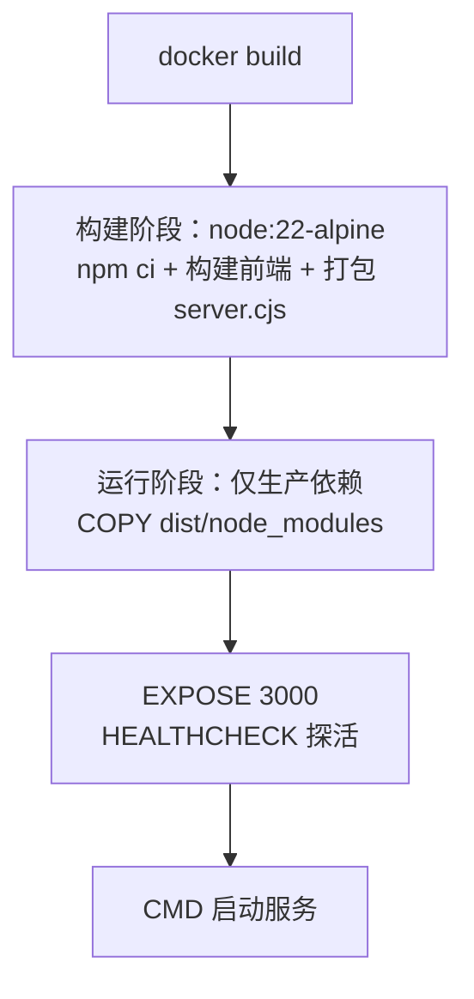
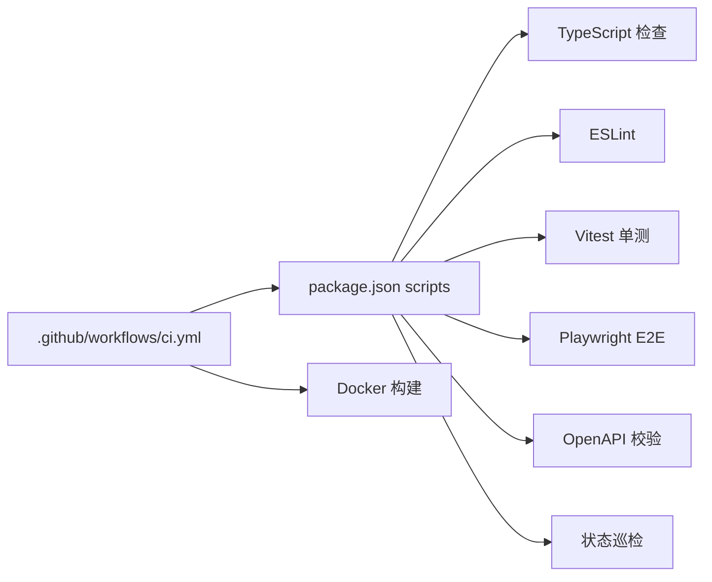

# CI/CD流水线

<cite>
**本文引用的文件**
- [.github/workflows/ci.yml](file://.github/workflows/ci.yml)
- [package.json](file://package.json)
- [Dockerfile](file://Dockerfile)
- [playwright.config.ts](file://playwright.config.ts)
- [eslint.config.js](file://eslint.config.js)
- [tsconfig.json](file://tsconfig.json)
- [tsconfig.server.json](file://tsconfig.server.json)
- [vite.config.ts](file://vite.config.ts)
- [scripts/checkOpenapi.mjs](file://scripts/checkOpenapi.mjs)
- [scripts/check-stateless.ts](file://scripts/check-stateless.ts)
- [server/eval/checkEvalSet.ts](file://server/eval/checkEvalSet.ts)
- [tests/e2e/smoke.spec.ts](file://tests/e2e/smoke.spec.ts)
</cite>

## 目录
1. [简介](#简介)
2. [项目结构](#项目结构)
3. [核心组件](#核心组件)
4. [架构总览](#架构总览)
5. [详细组件分析](#详细组件分析)
6. [依赖关系分析](#依赖关系分析)
7. [性能考虑](#性能考虑)
8. [故障排查指南](#故障排查指南)
9. [结论](#结论)
10. [附录](#附录)

## 简介
本文件面向“智能问数据分析系统”的持续集成与持续交付（CI/CD）流水线，聚焦 GitHub Actions 工作流配置、自动化测试策略、代码质量门禁、制品构建与发布、部署与回滚策略、通知与失败处理等。内容基于仓库中现有配置与脚本进行说明，确保读者可据此理解并扩展流水线。

## 项目结构
仓库采用前后端同仓管理：前端使用 Vite + React + Tailwind，后端为 Express + TypeScript；测试覆盖单元（Vitest）、端到端（Playwright），并通过自定义脚本完成 OpenAPI 同步校验与进程内状态巡检。制品通过多阶段 Docker 构建，运行期仅包含生产依赖。

**图表来源**
- [.github/workflows/ci.yml:15-38](file://.github/workflows/ci.yml#L15-L38)
- [.github/workflows/ci.yml:40-67](file://.github/workflows/ci.yml#L40-L67)
- [package.json:6-24](file://package.json#L6-L24)
- [Dockerfile:18-46](file://Dockerfile#L18-L46)

**章节来源**
- [.github/workflows/ci.yml:1-67](file://.github/workflows/ci.yml#L1-L67)
- [package.json:1-76](file://package.json#L1-L76)

## 核心组件
- 质量门禁作业（quality）：在 push/PR 到 main 时执行 TypeScript 类型检查（前端主配置、服务端严格模式、前端 strictNullChecks）、ESLint 检查、OpenAPI 文档一致性校验、进程内状态巡检、Vitest 全量单测。
- 评测集门禁作业（eval-gate）：对评测集进行规模与分层覆盖校验，并在检测到 prompt/评测相关文件变更时输出本地全量评测提醒。
- 制品构建：Docker 多阶段构建，构建期编译前端与打包 server.cjs，运行期仅安装生产依赖并以非 root 用户启动，内置健康检查探针。
- E2E 冒烟：Playwright 自动拉起服务或复用已有实例，验证登录、核心 API JSON 返回、知识库面板加载等关键路径。

**章节来源**
- [.github/workflows/ci.yml:15-67](file://.github/workflows/ci.yml#L15-L67)
- [Dockerfile:18-46](file://Dockerfile#L18-L46)
- [playwright.config.ts:1-39](file://playwright.config.ts#L1-L39)

## 架构总览
下图展示 CI 流水线从代码提交到制品产出的整体流程，以及各阶段的关键工具与产物。

**图表来源**
- [.github/workflows/ci.yml:15-67](file://.github/workflows/ci.yml#L15-L67)
- [package.json:6-24](file://package.json#L6-L24)
- [Dockerfile:18-46](file://Dockerfile#L18-L46)

## 详细组件分析

### 代码质量门禁（TypeScript + ESLint + OpenAPI + 状态巡检）
- TypeScript 类型检查
  - 前端主配置：启用 noEmit，配合 Vite 构建链路。
  - 服务端严格模式：独立 tsconfig.server.json 开启 strict，限定 server 目录。
  - 前端严格空值检查：通过 tsconfig.strict.json 渐进式提升 null/undefined 安全。
- ESLint 规则
  - 启用 recommended 规则集，React Hooks 相关规则以 warn 降级避免阻塞，保持核心规则 error。
- OpenAPI 同步校验
  - 解析 server.ts 路由挂载与各路由文件方法定义，与 docs/openapi.json 双向比对，防止文档漂移。
- 进程内状态巡检
  - 扫描 server/ 与 server.ts 中的模块级 Map/Set 构造，对照白名单进行新增拦截与陈旧条目清理提示，保障多实例部署下的状态可控。

**图表来源**
- [tsconfig.json:1-27](file://tsconfig.json#L1-L27)
- [tsconfig.server.json:1-9](file://tsconfig.server.json#L1-L9)
- [eslint.config.js:1-38](file://eslint.config.js#L1-L38)
- [scripts/checkOpenapi.mjs:1-75](file://scripts/checkOpenapi.mjs#L1-L75)
- [scripts/check-stateless.ts:1-192](file://scripts/check-stateless.ts#L1-L192)
- [.github/workflows/ci.yml:25-38](file://.github/workflows/ci.yml#L25-L38)

**章节来源**
- [.github/workflows/ci.yml:25-38](file://.github/workflows/ci.yml#L25-L38)
- [eslint.config.js:1-38](file://eslint.config.js#L1-L38)
- [scripts/checkOpenapi.mjs:1-75](file://scripts/checkOpenapi.mjs#L1-L75)
- [scripts/check-stateless.ts:1-192](file://scripts/check-stateless.ts#L1-L192)
- [tsconfig.json:1-27](file://tsconfig.json#L1-L27)
- [tsconfig.server.json:1-9](file://tsconfig.server.json#L1-L9)

### 单元测试策略（Vitest）
- 全量单测由 npm test 驱动，排除 node_modules、dist 与 tests/e2e 目录，确保只运行单元与集成测试。
- 测试范围覆盖前端组件与服务端逻辑，便于快速反馈问题。

**图表来源**
- [vite.config.ts:36-39](file://vite.config.ts#L36-L39)
- [package.json:15](file://package.json#L15)

**章节来源**
- [package.json:15](file://package.json#L15)
- [vite.config.ts:36-39](file://vite.config.ts#L36-L39)

### 端到端测试策略（Playwright）
- 默认复用已运行的开发/生产服务，CI 环境下可自动拉起 tsx server.ts。
- 超时、重试、截图与追踪在失败时保留，便于定位问题。
- 冒烟用例覆盖登录、核心 API JSON 返回、知识库面板加载等关键路径。

**图表来源**
- [playwright.config.ts:1-39](file://playwright.config.ts#L1-L39)
- [tests/e2e/smoke.spec.ts:1-87](file://tests/e2e/smoke.spec.ts#L1-L87)

**章节来源**
- [playwright.config.ts:1-39](file://playwright.config.ts#L1-L39)
- [tests/e2e/smoke.spec.ts:1-87](file://tests/e2e/smoke.spec.ts#L1-L87)

### 评测集门禁（结构与阈值契约）
- 主评测集：最小条数与六类分层覆盖校验（single_agg、join、time、subquery、clarify、refuse）。
- 宽表评测集：独立文件，要求 multi_dim 等分层覆盖。
- 当检测到 prompt/评测相关文件变更时，输出本地全量评测提醒（不直接执行真实 LLM 评测）。

**图表来源**
- [.github/workflows/ci.yml:40-67](file://.github/workflows/ci.yml#L40-L67)
- [server/eval/checkEvalSet.ts:1-100](file://server/eval/checkEvalSet.ts#L1-L100)

**章节来源**
- [.github/workflows/ci.yml:40-67](file://.github/workflows/ci.yml#L40-L67)
- [server/eval/checkEvalSet.ts:1-100](file://server/eval/checkEvalSet.ts#L1-L100)

### 制品管理与镜像构建
- 多阶段构建：构建阶段安装全部依赖并执行前端构建与 server 打包；运行阶段仅安装生产依赖，减少镜像体积。
- 安全基线：非 root 用户运行，暴露端口与环境变量约定，内置健康检查探针。
- 版本标签：版本号来源于 package.json，构建期注入前端常量，统一版本唯一事实源。

**图表来源**
- [Dockerfile:18-46](file://Dockerfile#L18-L46)
- [vite.config.ts:7-18](file://vite.config.ts#L7-L18)

**章节来源**
- [Dockerfile:18-46](file://Dockerfile#L18-L46)
- [vite.config.ts:7-18](file://vite.config.ts#L7-L18)

### 部署自动化（蓝绿/灰度/回滚）
- 当前仓库未提供编排与发布脚本；建议结合容器镜像与平台能力实现：
  - 蓝绿部署：并行维护两套相同版本的服务集群，切换流量入口完成发布。
  - 灰度发布：按流量比例或用户维度逐步放量新版本，观察指标后全量。
  - 回滚策略：保留上一稳定版本镜像，出现问题快速切回旧版本。
- 健康检查：容器内置 /api/health 探针，可作为就绪/存活检测依据。

[本节为概念性说明，不涉及具体源码]

### 通知机制与失败处理
- 当前工作流未配置通知通道；建议在失败时接入企业通知渠道（如邮件、IM）以便及时响应。
- 失败处理建议：
  - 质量门禁失败：修复类型错误、ESLint 告警、OpenAPI 不一致或状态巡检违规。
  - 评测集门禁失败：补齐评测集规模与分层覆盖。
  - E2E 失败：根据 Playwright 截图与追踪定位问题。
  - 构建失败：检查依赖安装、构建命令与健康检查配置。

[本节为通用实践建议，不涉及具体源码]

## 依赖关系分析
- 工作流依赖 npm scripts 提供的命令，脚本又依赖 TypeScript、ESLint、Vitest、Playwright 等工具。
- 构建产物依赖 Vite 与 esbuild 的输出，最终由 Docker 封装为可运行镜像。

**图表来源**
- [.github/workflows/ci.yml:15-67](file://.github/workflows/ci.yml#L15-L67)
- [package.json:6-24](file://package.json#L6-L24)
- [Dockerfile:18-46](file://Dockerfile#L18-L46)

**章节来源**
- [.github/workflows/ci.yml:15-67](file://.github/workflows/ci.yml#L15-L67)
- [package.json:6-24](file://package.json#L6-L24)

## 性能考虑
- 缓存依赖：CI 中使用 npm 缓存加速安装。
- 增量检查：TypeScript 与 ESLint 可在后续迭代中引入增量策略以减少执行时间。
- 并行化：当前工作流将 quality 与 eval-gate 作为两个作业并行执行，有助于缩短总耗时。
- 镜像优化：多阶段构建与仅安装生产依赖减小镜像体积，提升拉取与启动速度。

[本节提供一般性指导，不涉及具体源码]

## 故障排查指南
- 类型检查失败：查看对应 tsconfig 与错误信息，优先修复类型错误。
- ESLint 失败：根据规则提示调整代码风格或关闭特定规则（谨慎）。
- OpenAPI 不同步：更新 docs/openapi.json 或修正路由定义。
- 状态巡检失败：登记新增的进程内状态或改为外置存储。
- E2E 失败：查看 Playwright 截图与追踪，确认服务是否可用与接口返回是否符合预期。
- 构建失败：检查 Node 版本、依赖安装与构建命令输出。

**章节来源**
- [eslint.config.js:1-38](file://eslint.config.js#L1-L38)
- [scripts/checkOpenapi.mjs:1-75](file://scripts/checkOpenapi.mjs#L1-L75)
- [scripts/check-stateless.ts:1-192](file://scripts/check-stateless.ts#L1-L192)
- [playwright.config.ts:1-39](file://playwright.config.ts#L1-L39)
- [tests/e2e/smoke.spec.ts:1-87](file://tests/e2e/smoke.spec.ts#L1-L87)

## 结论
该项目的 CI/CD 流水线围绕“质量门禁 + 评测集门禁 + E2E 冒烟 + 多阶段镜像构建”展开，覆盖了从代码质量到制品产出的关键环节。建议在现有基础上补充通知机制与部署编排脚本，以实现更完整的发布与回滚能力。

[本节为总结性内容，不涉及具体源码]

## 附录
- 常用命令
  - 类型检查：npm run lint / npm run lint:server / npm run lint:strict
  - 代码风格：npm run lint:js
  - OpenAPI 同步校验：npm run docs:check
  - 状态巡检：npm run state:check
  - 单测：npm test
  - E2E：npm run test:e2e
  - 构建：npm run build
  - 运行：npm start

**章节来源**
- [package.json:6-24](file://package.json#L6-L24)