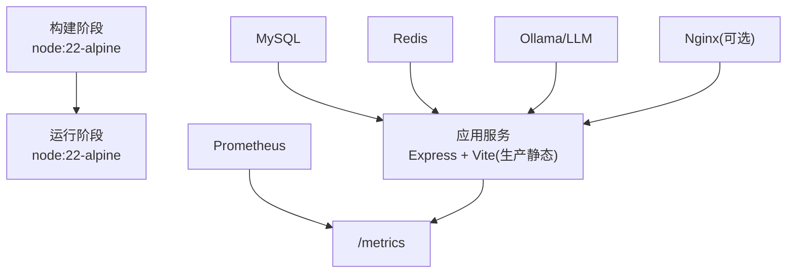
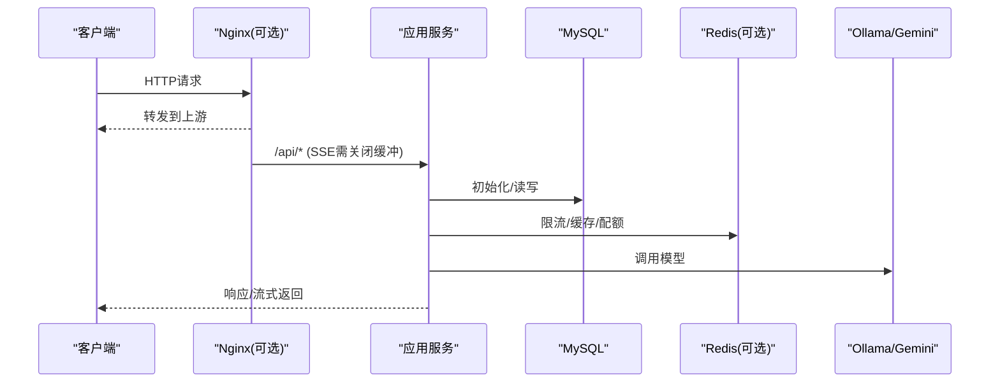
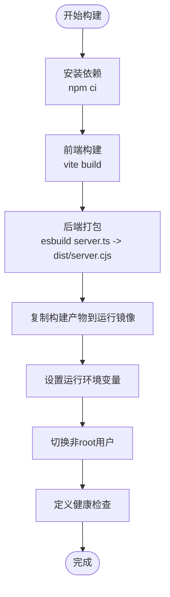
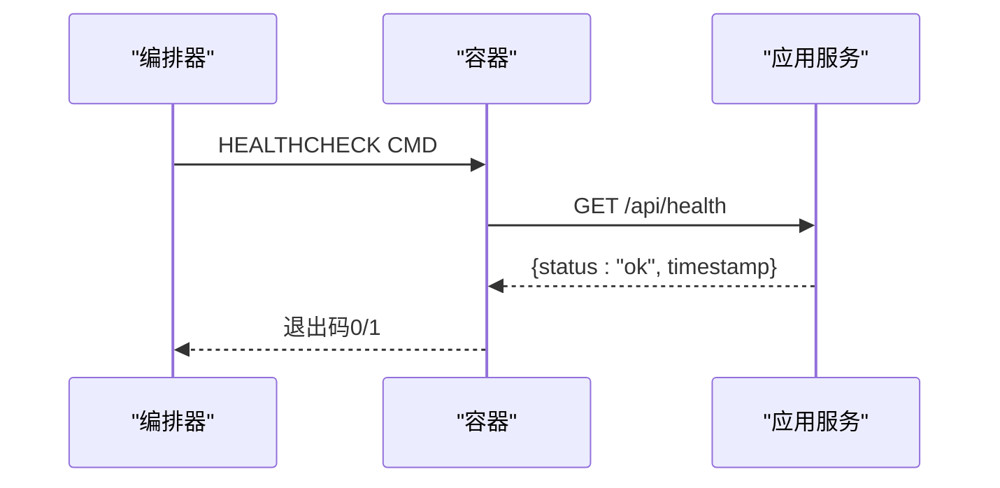
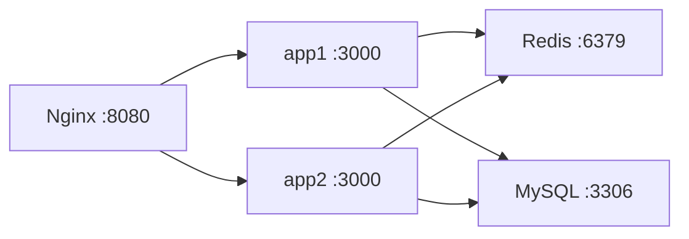
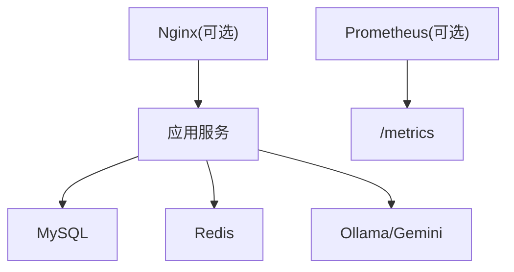

# Docker容器化部署

<cite>
**本文引用的文件**
- [Dockerfile](file://Dockerfile)
- [docker-compose.multi-instance.yml](file://docker-compose.multi-instance.yml)
- [server.ts](file://server.ts)
- [package.json](file://package.json)
- [start.sh](file://start.sh)
- [server/infra/db.ts](file://server/infra/db.ts)
- [server/auth/auth.ts](file://server/auth/auth.ts)
- [server/infra/stateStore.ts](file://server/infra/stateStore.ts)
- [server/infra/monitoring.ts](file://server/infra/monitoring.ts)
- [deploy/nginx.multi-instance.conf](file://deploy/nginx.multi-instance.conf)
</cite>

## 目录
1. [简介](#简介)
2. [项目结构](#项目结构)
3. [核心组件](#核心组件)
4. [架构总览](#架构总览)
5. [详细组件分析](#详细组件分析)
6. [依赖关系分析](#依赖关系分析)
7. [性能与容量建议](#性能与容量建议)
8. [故障排查指南](#故障排查指南)
9. [结论](#结论)
10. [附录：环境变量清单与最佳实践](#附录环境变量清单与最佳实践)

## 简介
本指南面向生产环境，提供智能问数据分析系统的Docker容器化部署方案。内容覆盖多阶段构建、运行镜像精简、环境变量配置（数据库、JWT、Redis等）、健康检查机制、镜像构建命令、容器启动脚本、数据卷挂载方案与安全最佳实践（非root用户、敏感信息管理）。

## 项目结构
- 构建阶段：使用Node 22 Alpine镜像安装全部依赖并执行前端构建与后端打包，产出静态资源与可执行CJS产物。
- 运行阶段：仅安装生产依赖，复制构建产物，以非root用户运行，暴露端口并提供健康检查。
- 多实例编排：通过Compose编排多个应用副本、共享Redis、Nginx负载均衡。
- 监控与可观测性：内置Prometheus指标端点与健康探针；支持可选的指标访问令牌保护。

图表来源
- [Dockerfile:18-46](file://Dockerfile#L18-L46)
- [server.ts:82-300](file://server.ts#L82-L300)
- [docker-compose.multi-instance.yml:7-50](file://docker-compose.multi-instance.yml#L7-L50)
- [deploy/nginx.multi-instance.conf:1-35](file://deploy/nginx.multi-instance.conf#L1-L35)
- [server/infra/monitoring.ts:135-153](file://server/infra/monitoring.ts#L135-L153)

章节来源
- [Dockerfile:18-46](file://Dockerfile#L18-L46)
- [package.json:6-24](file://package.json#L6-L24)
- [server.ts:82-300](file://server.ts#L82-L300)
- [docker-compose.multi-instance.yml:7-50](file://docker-compose.multi-instance.yml#L7-L50)

## 核心组件
- 多阶段构建：构建期编译前端与打包后端，运行期仅包含生产依赖与构建产物，镜像体积最小化。
- 安全基线：生产环境强制要求JWT密钥，未设置则拒绝启动；默认监听0.0.0.0以便容器网络可达。
- 状态存储抽象：支持内存模式与Redis外置模式，多实例共享限流、缓存、配额等状态。
- 健康检查：容器内使用Node内置fetch对/api/health进行HTTP探针，配合HEALTHCHECK指令实现K8s/编排器健康判定。
- 监控指标：暴露/metrics供Prometheus抓取，支持可选METRICS_TOKEN鉴权。

章节来源
- [Dockerfile:26-46](file://Dockerfile#L26-L46)
- [server.ts:91-96](file://server.ts#L91-L96)
- [server/infra/stateStore.ts:165-219](file://server/infra/stateStore.ts#L165-L219)
- [server/infra/monitoring.ts:135-153](file://server/infra/monitoring.ts#L135-L153)

## 架构总览
系统由应用服务、数据库、缓存、AI引擎与可选负载均衡组成。应用服务在容器中运行，对外暴露API与静态资源；数据库持久化用户、数据源、知识库、任务队列等；Redis用于多实例共享状态；Ollama/Gemini等作为LLM后端；Nginx可作为入口进行SSE长连接优化与轮询分发。

图表来源
- [docker-compose.multi-instance.yml:7-50](file://docker-compose.multi-instance.yml#L7-L50)
- [deploy/nginx.multi-instance.conf:1-35](file://deploy/nginx.multi-instance.conf#L1-L35)
- [server.ts:187-193](file://server.ts#L187-L193)
- [server/infra/stateStore.ts:165-219](file://server/infra/stateStore.ts#L165-L219)

## 详细组件分析

### 多阶段构建与运行镜像优化
- 构建阶段：安装所有依赖，执行前端构建与后端打包，输出dist目录与server.cjs。
- 运行阶段：仅安装生产依赖，复制dist，设置NODE_ENV=production，以node用户运行，暴露端口，定义健康检查。
- 优势：镜像体积小、攻击面小、启动快、无开发工具残留。

图表来源
- [Dockerfile:18-46](file://Dockerfile#L18-L46)
- [package.json:6-24](file://package.json#L6-L24)

章节来源
- [Dockerfile:18-46](file://Dockerfile#L18-L46)
- [package.json:6-24](file://package.json#L6-L24)

### 环境变量配置（生产必需）
- 数据库连接：MYSQL_HOST、MYSQL_PORT、MYSQL_USER、MYSQL_PASSWORD、MYSQL_DATABASE。
- 认证与会话：JWT_SECRET（生产必须）、JWT_EXPIRES_IN（可选）。
- 缓存与多实例：REDIS_URL（可选，启用后为多实例共享状态）。
- 管理员账号：ADMIN_USERNAME、ADMIN_PASSWORD（首次登录将提示修改初始密码）。
- AI引擎：OLLAMA_URL（或对应后端地址），以及模型相关变量（如LLM_MODEL、EMBED_MODEL，见本地启动脚本提示）。
- 监控：METRICS_TOKEN（可选，保护/metrics）。
- 运行时：HOST=0.0.0.0、PORT=3000、NODE_ENV=production。

说明：
- 应用启动时加载.env.local/.env，进程环境变量优先。
- 生产环境未设置JWT_SECRET将直接拒绝启动，防止伪造token。
- Redis未配置时自动回退到内存模式，单实例行为一致。

章节来源
- [server.ts:12-19](file://server.ts#L12-L19)
- [server.ts:82-96](file://server.ts#L82-L96)
- [server/infra/db.ts:16-27](file://server/infra/db.ts#L16-L27)
- [server/auth/auth.ts:46-58](file://server/auth/auth.ts#L46-L58)
- [server/infra/stateStore.ts:165-219](file://server/infra/stateStore.ts#L165-L219)
- [server/infra/monitoring.ts:135-153](file://server/infra/monitoring.ts#L135-L153)

### 健康检查机制
- 容器健康检查：使用Node内置fetch访问/api/health，间隔30秒、超时5秒、启动宽限20秒、重试3次。
- 应用健康端点：/api/health返回JSON状态，便于编排器判断就绪。
- 指标端点：/metrics暴露Prometheus格式指标，可选METRICS_TOKEN保护。

图表来源
- [Dockerfile:42-44](file://Dockerfile#L42-L44)
- [server.ts:187-193](file://server.ts#L187-L193)
- [server/infra/monitoring.ts:135-153](file://server/infra/monitoring.ts#L135-L153)

章节来源
- [Dockerfile:42-44](file://Dockerfile#L42-L44)
- [server.ts:187-193](file://server.ts#L187-L193)
- [server/infra/monitoring.ts:135-153](file://server/infra/monitoring.ts#L135-L153)

### 多实例部署与负载均衡
- Compose示例：两个应用副本共享同一Redis，Nginx轮询分发流量，映射宿主端口供Prometheus抓取。
- Nginx配置：针对SSE流式接口关闭代理缓冲与缓存，放大读/写超时，避免长连接中断。
- 依赖关系：应用依赖MySQL与Redis；Ollama/Gemini为外部服务。

图表来源
- [docker-compose.multi-instance.yml:7-50](file://docker-compose.multi-instance.yml#L7-L50)
- [deploy/nginx.multi-instance.conf:1-35](file://deploy/nginx.multi-instance.conf#L1-L35)

章节来源
- [docker-compose.multi-instance.yml:7-50](file://docker-compose.multi-instance.yml#L7-L50)
- [deploy/nginx.multi-instance.conf:1-35](file://deploy/nginx.multi-instance.conf#L1-L35)

### 数据卷挂载方案
- 日志持久化：将容器内日志目录挂载至宿主机，便于集中收集与保留。
- 配置文件：将Nginx配置、Prometheus/Alertmanager配置以只读方式挂载，便于更新而不重建镜像。
- 数据持久化：MySQL建议使用独立数据卷或外部数据库；Redis可使用数据卷或托管服务。
- 注意：应用本身无状态，无需挂载应用数据；但如需导出报表或临时文件，应挂载相应目录并设置权限。

章节来源
- [docker-compose.multi-instance.yml:41-50](file://docker-compose.multi-instance.yml#L41-L50)
- [server.ts:282-296](file://server.ts#L282-L296)

### 启动脚本与本地一键启动
- start.sh：检测依赖、拉起MySQL/Redis/Ollama、等待就绪、启动应用服务并打开浏览器。
- 适用于本地开发或演示环境；生产环境建议使用容器编排替代。

章节来源
- [start.sh:1-138](file://start.sh#L1-L138)

## 依赖关系分析
- 应用服务依赖：
  - MySQL：用户、数据源、知识库、任务队列等持久化。
  - Redis：多实例共享状态（限流、缓存、配额、分布式锁）。
  - Ollama/Gemini：LLM推理与嵌入。
  - Nginx（可选）：反向代理与SSE优化。
  - Prometheus（可选）：指标采集。

图表来源
- [server/infra/db.ts:16-27](file://server/infra/db.ts#L16-L27)
- [server/infra/stateStore.ts:165-219](file://server/infra/stateStore.ts#L165-L219)
- [server/infra/monitoring.ts:135-153](file://server/infra/monitoring.ts#L135-L153)
- [docker-compose.multi-instance.yml:7-50](file://docker-compose.multi-instance.yml#L7-L50)

章节来源
- [server/infra/db.ts:16-27](file://server/infra/db.ts#L16-L27)
- [server/infra/stateStore.ts:165-219](file://server/infra/stateStore.ts#L165-L219)
- [server/infra/monitoring.ts:135-153](file://server/infra/monitoring.ts#L135-L153)
- [docker-compose.multi-instance.yml:7-50](file://docker-compose.multi-instance.yml#L7-L50)

## 性能与容量建议
- 数据库连接池：根据并发用户数动态计算，默认下限不低于原水位，上限有保护。
- 请求体大小：报告导出与知识库导入放宽限制，其他接口保持合理阈值。
- SSE长连接：Nginx关闭缓冲与缓存，放大超时，确保流式问答不中断。
- 指标基数：监控标签控制低基数，避免高基数导致存储膨胀。
- 多实例扩展：通过Redis共享状态，水平扩展应用副本，Nginx轮询分发。

章节来源
- [server/infra/db.ts:30-43](file://server/infra/db.ts#L30-L43)
- [server.ts:133-143](file://server.ts#L133-L143)
- [deploy/nginx.multi-instance.conf:1-35](file://deploy/nginx.multi-instance.conf#L1-L35)
- [server/infra/monitoring.ts:1-10](file://server/infra/monitoring.ts#L1-L10)

## 故障排查指南
- 启动失败（生产环境）：检查是否设置了JWT_SECRET；未设置将拒绝启动。
- 数据库连接失败：确认MYSQL_*环境变量与网络可达；查看应用日志中的初始化信息。
- Redis不可用：未配置REDIS_URL时自动降级为内存模式；若配置了但不可达，会告警并继续启动。
- 健康检查失败：确认/api/health可访问；检查端口映射与防火墙规则。
- 指标不可用：确认/metrics未被拦截；如需保护，设置METRICS_TOKEN并在Prometheus中配置认证。
- SSE中断：检查Nginx代理配置是否关闭缓冲与缓存，超时是否足够大。

章节来源
- [server.ts:91-96](file://server.ts#L91-L96)
- [server/infra/db.ts:52-70](file://server/infra/db.ts#L52-L70)
- [server/infra/stateStore.ts:165-219](file://server/infra/stateStore.ts#L165-L219)
- [Dockerfile:42-44](file://Dockerfile#L42-L44)
- [server/infra/monitoring.ts:135-153](file://server/infra/monitoring.ts#L135-L153)
- [deploy/nginx.multi-instance.conf:1-35](file://deploy/nginx.multi-instance.conf#L1-L35)

## 结论
本指南提供了从构建到运行的完整容器化方案，涵盖多阶段构建、精简镜像、环境变量配置、健康检查、多实例编排与安全最佳实践。按照本文配置，可在生产环境中稳定部署智能问数据分析系统，并通过Prometheus进行可观测性管理。

## 附录：环境变量清单与最佳实践
- 数据库
  - MYSQL_HOST、MYSQL_PORT、MYSQL_USER、MYSQL_PASSWORD、MYSQL_DATABASE
  - 建议：使用专用账号与最小权限；开启SSL（若数据库支持）；连接池大小按并发估算。
- 认证与会话
  - JWT_SECRET（生产必须）、JWT_EXPIRES_IN（可选）
  - 建议：使用强随机密钥；定期轮换；结合RBAC限制敏感操作。
- 缓存与多实例
  - REDIS_URL（可选）
  - 建议：使用托管Redis或独立容器；配置TTL与持久化策略；监控连接数与内存。
- 管理员账号
  - ADMIN_USERNAME、ADMIN_PASSWORD
  - 建议：首次登录后立即修改密码；限制IP访问管理接口。
- AI引擎
  - OLLAMA_URL、LLM_MODEL、EMBED_MODEL（参考本地启动脚本提示）
  - 建议：配置健康检查与熔断；记录用量与成本。
- 监控
  - METRICS_TOKEN（可选）
  - 建议：限制/metrics访问；结合Grafana可视化。
- 运行时
  - HOST=0.0.0.0、PORT=3000、NODE_ENV=production
  - 建议：通过编排器注入环境变量；避免硬编码。

安全最佳实践
- 非root用户运行：镜像已切换至node用户，避免特权风险。
- 敏感信息管理：使用环境变量或密钥管理服务；避免将密钥写入镜像或代码。
- 最小权限：数据库账号仅授予必要权限；网络层限制入站来源。
- 安全头：生产环境启用HSTS与CSP；限制框架点击劫持。
- 审计与合规：开启审计日志；定期审查访问与变更。

章节来源
- [server.ts:82-96](file://server.ts#L82-L96)
- [server/auth/auth.ts:46-58](file://server/auth/auth.ts#L46-L58)
- [server/infra/db.ts:16-27](file://server/infra/db.ts#L16-L27)
- [server/infra/stateStore.ts:165-219](file://server/infra/stateStore.ts#L165-L219)
- [server/infra/monitoring.ts:135-153](file://server/infra/monitoring.ts#L135-L153)
- [Dockerfile:26-46](file://Dockerfile#L26-L46)