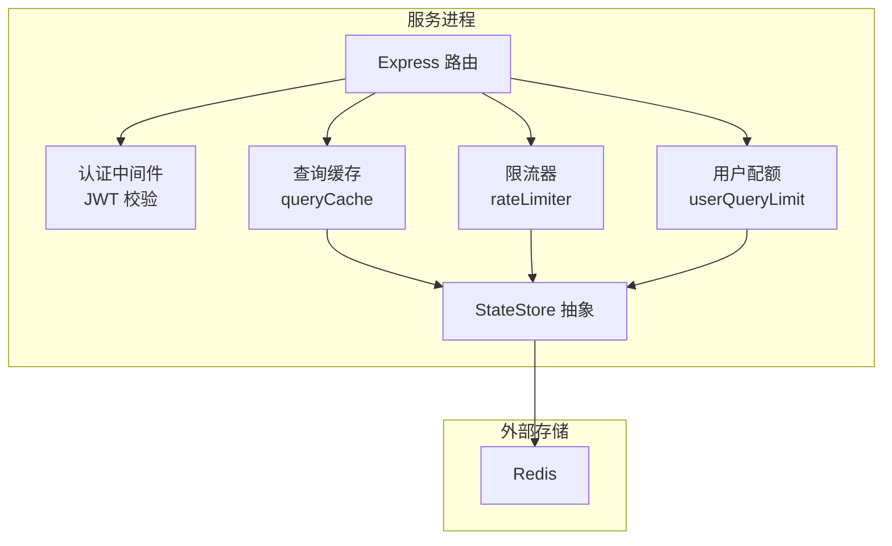
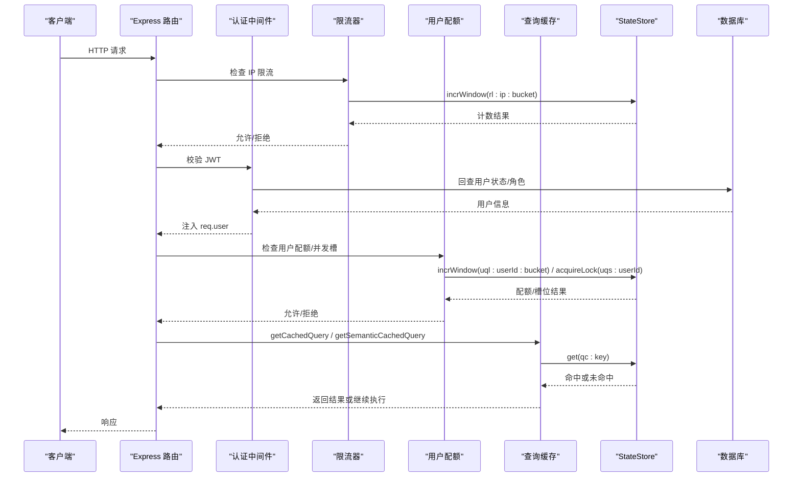
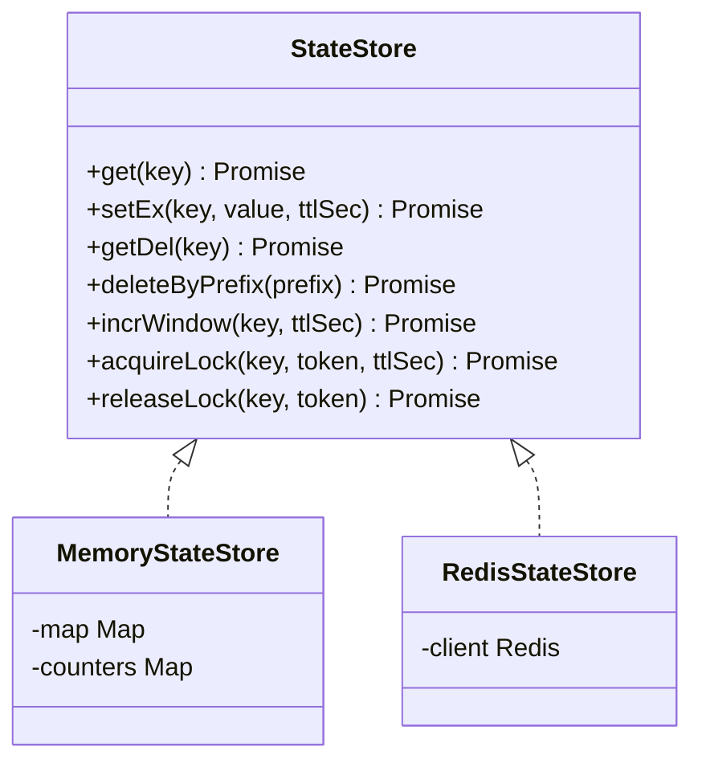
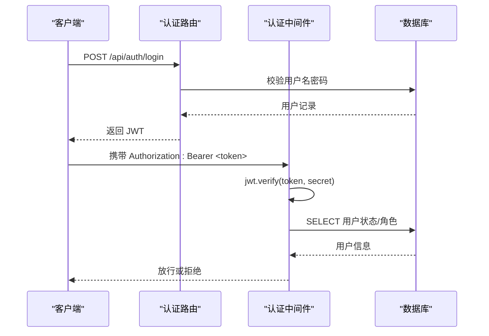
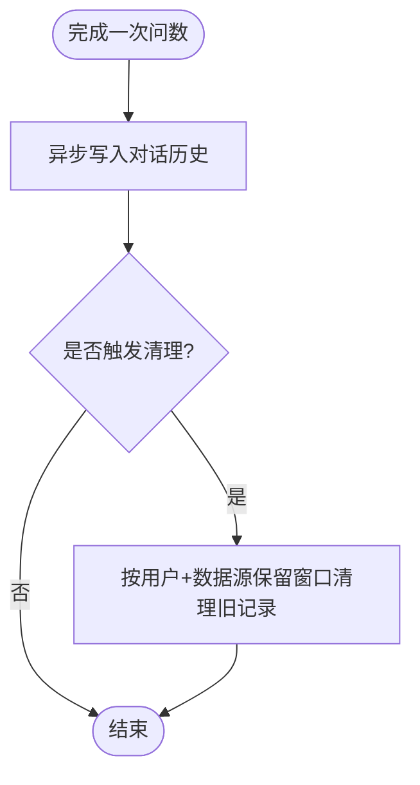
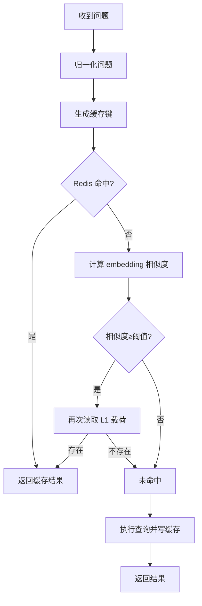
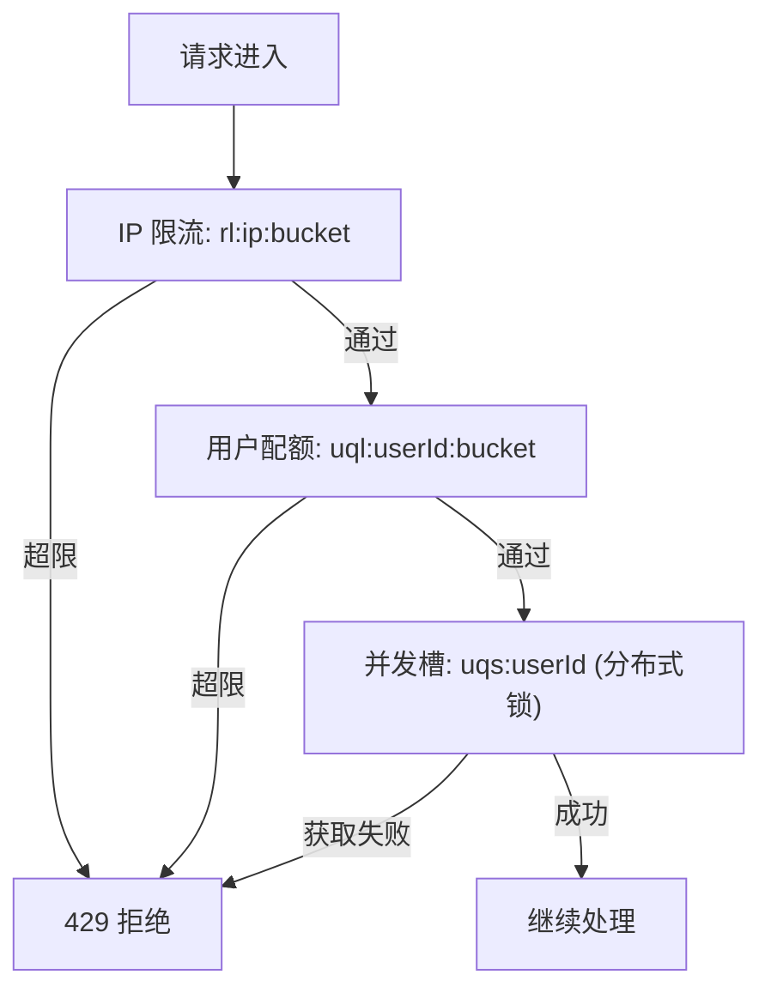
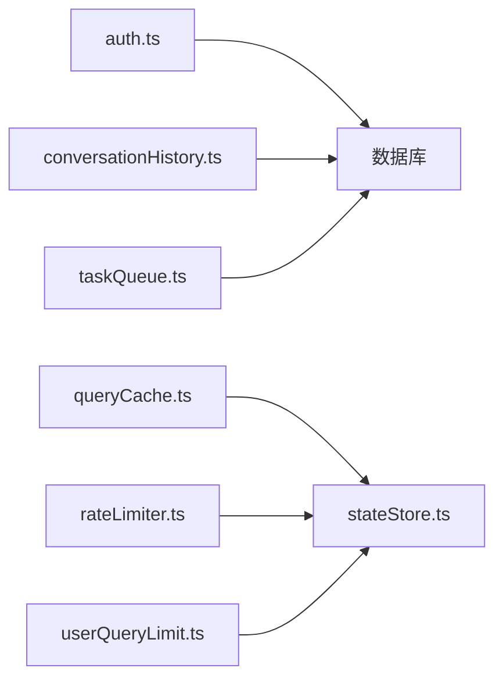

# 会话共享机制

<cite>
**本文引用的文件**
- [server/infra/stateStore.ts](file://server/infra/stateStore.ts)
- [server/auth/auth.ts](file://server/auth/auth.ts)
- [server/routes/auth.ts](file://server/routes/auth.ts)
- [server/query/queryCache.ts](file://server/query/queryCache.ts)
- [server/infra/rateLimiter.ts](file://server/infra/rateLimiter.ts)
- [server/infra/userQueryLimit.ts](file://server/infra/userQueryLimit.ts)
- [server/query/conversationHistory.ts](file://server/query/conversationHistory.ts)
- [server/routes/conversation.ts](file://server/routes/conversation.ts)
- [server/infra/taskQueue.ts](file://server/infra/taskQueue.ts)
</cite>

## 目录
1. [简介](#简介)
2. [项目结构](#项目结构)
3. [核心组件](#核心组件)
4. [架构总览](#架构总览)
5. [详细组件分析](#详细组件分析)
6. [依赖关系分析](#依赖关系分析)
7. [性能考量](#性能考量)
8. [故障排查指南](#故障排查指南)
9. [结论](#结论)
10. [附录](#附录)

## 简介
本文件面向“智能问数据分析系统”的会话共享与无状态化设计，重点说明：
- 以 Redis 作为共享状态存储的实现原理（键空间、TTL、原子操作、锁）
- 无状态应用模式：任意实例可处理任意请求
- JWT 令牌验证机制（签名、权限信息、刷新策略）
- 会话数据同步方案（增量、冲突、一致性）
- 会话清理与垃圾回收配置

## 项目结构
系统在多实例部署时通过统一的 StateStore 抽象屏蔽底层差异：未配置 REDIS_URL 时使用进程内内存实现；配置后自动切换到 RedisStateStore，提供跨实例共享能力。认证模块基于 JWT 签发与校验，并在鉴权中间件中回查用户表保证权限实时生效。查询缓存、限流、用户配额等关键路径均通过 StateStore 访问，确保水平扩展一致性与幂等性。

图表来源
- [server/infra/stateStore.ts:10-23](file://server/infra/stateStore.ts#L10-L23)
- [server/query/queryCache.ts:43-90](file://server/query/queryCache.ts#L43-L90)
- [server/infra/rateLimiter.ts:14-42](file://server/infra/rateLimiter.ts#L14-L42)
- [server/infra/userQueryLimit.ts:24-81](file://server/infra/userQueryLimit.ts#L24-L81)

章节来源
- [server/infra/stateStore.ts:1-219](file://server/infra/stateStore.ts#L1-L219)
- [server/query/queryCache.ts:1-254](file://server/query/queryCache.ts#L1-L254)
- [server/infra/rateLimiter.ts:1-54](file://server/infra/rateLimiter.ts#L1-L54)
- [server/infra/userQueryLimit.ts:1-98](file://server/infra/userQueryLimit.ts#L1-L98)

## 核心组件
- StateStore 抽象层：统一 get/setEx/getDel/deleteByPrefix/incrWindow/acquireLock/releaseLock 接口，支持内存与 Redis 两种实现，并通过工厂函数在运行时选择。
- 认证与授权：JWT 签发与校验，鉴权中间件在每次请求中回查用户表，强制改密控制与角色守卫。
- 查询缓存：L1 精确命中 + L2 语义相似度命中，支持按数据源失效与语义索引维护。
- 限流与配额：IP 级固定窗口计数与用户级小时窗口计数 + 并发槽互斥，均通过 StateStore 实现跨实例一致。
- 对话历史：持久化到数据库，支持检索、删除与个人 few-shot 沉淀，配合保留窗口清理。
- 任务队列：MySQL 持久化的长任务队列，具备心跳、孤儿回收与重试上限。

章节来源
- [server/infra/stateStore.ts:10-23](file://server/infra/stateStore.ts#L10-L23)
- [server/auth/auth.ts:60-127](file://server/auth/auth.ts#L60-L127)
- [server/query/queryCache.ts:1-254](file://server/query/queryCache.ts#L1-L254)
- [server/infra/rateLimiter.ts:1-54](file://server/infra/rateLimiter.ts#L1-L54)
- [server/infra/userQueryLimit.ts:1-98](file://server/infra/userQueryLimit.ts#L1-L98)
- [server/query/conversationHistory.ts:1-204](file://server/query/conversationHistory.ts#L1-L204)
- [server/infra/taskQueue.ts:1-347](file://server/infra/taskQueue.ts#L1-L347)

## 架构总览
下图展示了从客户端请求到认证、限流、配额、缓存与最终业务处理的完整链路，以及各组件对 StateStore 的依赖。

图表来源
- [server/infra/rateLimiter.ts:14-42](file://server/infra/rateLimiter.ts#L14-L42)
- [server/auth/auth.ts:67-113](file://server/auth/auth.ts#L67-L113)
- [server/infra/userQueryLimit.ts:24-81](file://server/infra/userQueryLimit.ts#L24-L81)
- [server/query/queryCache.ts:43-90](file://server/query/queryCache.ts#L43-L90)
- [server/infra/stateStore.ts:108-162](file://server/infra/stateStore.ts#L108-L162)

## 详细组件分析

### StateStore 与 Redis 共享状态
- 设计要点
  - 统一接口：get/setEx/getDel/deleteByPrefix/incrWindow/acquireLock/releaseLock
  - 默认内存实现，生产启用 Redis 后自动切换为分布式实现
  - 键命名约定：qp/rqp/qc/uql/uqs/rl 等前缀区分用途
  - 原子性：INCR+EXPIRE、SET NX EX、Lua 原子释放锁
  - 预热与健康检查：启动时等待 Redis 就绪，避免冷启动窗口失败

- 过期策略
  - setEx 使用 TTL；incrWindow 首次写入设置 TTL；acquireLock 使用 NX+EX
  - deleteByPrefix 用于按数据源失效缓存与索引

- 内存优化
  - 大值不缓存（payload 体积上限）
  - 语义向量四舍五入压缩
  - 扫描分批删除，避免阻塞

图表来源
- [server/infra/stateStore.ts:10-23](file://server/infra/stateStore.ts#L10-L23)
- [server/infra/stateStore.ts:32-98](file://server/infra/stateStore.ts#L32-L98)
- [server/infra/stateStore.ts:105-163](file://server/infra/stateStore.ts#L105-L163)

章节来源
- [server/infra/stateStore.ts:1-219](file://server/infra/stateStore.ts#L1-L219)

### 无状态应用设计模式
- 所有可变状态（缓存、限流、配额、锁）均外置至 Redis，进程仅持有瞬时上下文
- 任意实例均可处理任意请求，无需粘滞会话
- 启动预热消除连接冷启动窗口，异常降级路径安全（fail-open/fail-closed 明确）

章节来源
- [server/infra/stateStore.ts:165-219](file://server/infra/stateStore.ts#L165-L219)
- [server/infra/rateLimiter.ts:1-54](file://server/infra/rateLimiter.ts#L1-L54)
- [server/infra/userQueryLimit.ts:1-98](file://server/infra/userQueryLimit.ts#L1-L98)
- [server/query/queryCache.ts:1-254](file://server/query/queryCache.ts#L1-L254)

### JWT 令牌验证机制
- 签发：包含用户标识、用户名、角色，使用环境变量密钥或进程随机密钥（开发模式），支持过期时间配置
- 校验：解析并验证签名，随后回查数据库确认账号状态与角色，必要时强制改密
- 刷新策略：服务端不维护在线会话，令牌过期即需重新登录；可通过调整过期时间与前端刷新逻辑实现无感刷新

图表来源
- [server/routes/auth.ts:41-77](file://server/routes/auth.ts#L41-L77)
- [server/auth/auth.ts:60-113](file://server/auth/auth.ts#L60-L113)

章节来源
- [server/auth/auth.ts:46-127](file://server/auth/auth.ts#L46-L127)
- [server/routes/auth.ts:1-156](file://server/routes/auth.ts#L1-L156)

### 会话数据同步方案
- 会话本身无状态，但“对话历史”作为用户会话产物持久化到数据库，支持跨设备共享
- 增量写入：每次问数完成后异步落库，失败不阻断主链路
- 冲突解决：删除操作基于 user_id 校验，越权删除返回 404
- 一致性保证：检索与删除走数据库事务边界；few-shot 检索只读近 N 条，降低噪声

图表来源
- [server/query/conversationHistory.ts:42-90](file://server/query/conversationHistory.ts#L42-L90)

章节来源
- [server/query/conversationHistory.ts:1-204](file://server/query/conversationHistory.ts#L1-L204)
- [server/routes/conversation.ts:1-44](file://server/routes/conversation.ts#L1-L44)

### 查询缓存与会话关联
- 键设计：qc:{dataSourceId}::normalize(question)::variant，确保同数据源同问题命中
- 语义缓存：L2 相似度阈值可调，命中后回退读取 L1 载荷，避免索引残留误命中
- 失效策略：数据源变更时按前缀 SCAN 删除 qc 与 qcidx 索引
- 内存优化：payload 大小限制、向量精度压缩、索引条目上限

图表来源
- [server/query/queryCache.ts:22-34](file://server/query/queryCache.ts#L22-L34)
- [server/query/queryCache.ts:43-90](file://server/query/queryCache.ts#L43-L90)
- [server/query/queryCache.ts:116-254](file://server/query/queryCache.ts#L116-L254)

章节来源
- [server/query/queryCache.ts:1-254](file://server/query/queryCache.ts#L1-L254)

### 限流与配额（会话级保护）
- IP 限流：固定分钟窗口 INCR，Redis 模式下多实例共享计数
- 用户配额：固定小时窗口 INCR，超过则拒绝并提示重试时间
- 并发槽：同一用户同一时刻仅一个进行中的查询，Redis 下使用分布式锁，TTL 兜底防死锁

图表来源
- [server/infra/rateLimiter.ts:14-42](file://server/infra/rateLimiter.ts#L14-L42)
- [server/infra/userQueryLimit.ts:24-81](file://server/infra/userQueryLimit.ts#L24-L81)

章节来源
- [server/infra/rateLimiter.ts:1-54](file://server/infra/rateLimiter.ts#L1-L54)
- [server/infra/userQueryLimit.ts:1-98](file://server/infra/userQueryLimit.ts#L1-L98)

### 任务队列与会话解耦
- 将耗时任务（报告生成、PDF 导出）放入 MySQL 队列，提交即返回 taskId，前端轮询
- Worker 并发上限与用户排队上限隔离交互链路
- 心跳与孤儿回收保障崩溃恢复，避免任务丢失

章节来源
- [server/infra/taskQueue.ts:1-347](file://server/infra/taskQueue.ts#L1-L347)

## 依赖关系分析
- 认证模块依赖数据库（users 表）与 JWT 库
- 查询缓存、限流、配额均依赖 StateStore，从而间接依赖 Redis（可选）
- 对话历史与任务队列依赖数据库
- 路由层组合上述模块形成请求处理流水线

图表来源
- [server/auth/auth.ts:60-113](file://server/auth/auth.ts#L60-L113)
- [server/query/queryCache.ts:43-90](file://server/query/queryCache.ts#L43-L90)
- [server/infra/rateLimiter.ts:14-42](file://server/infra/rateLimiter.ts#L14-L42)
- [server/infra/userQueryLimit.ts:24-81](file://server/infra/userQueryLimit.ts#L24-L81)
- [server/query/conversationHistory.ts:42-90](file://server/query/conversationHistory.ts#L42-L90)
- [server/infra/taskQueue.ts:86-137](file://server/infra/taskQueue.ts#L86-L137)

章节来源
- [server/auth/auth.ts:60-113](file://server/auth/auth.ts#L60-L113)
- [server/query/queryCache.ts:43-90](file://server/query/queryCache.ts#L43-L90)
- [server/infra/rateLimiter.ts:14-42](file://server/infra/rateLimiter.ts#L14-L42)
- [server/infra/userQueryLimit.ts:24-81](file://server/infra/userQueryLimit.ts#L24-L81)
- [server/query/conversationHistory.ts:42-90](file://server/query/conversationHistory.ts#L42-L90)
- [server/infra/taskQueue.ts:86-137](file://server/infra/taskQueue.ts#L86-L137)

## 性能考量
- 缓存命中率：L1 精确命中优先，L2 语义命中保守阈值，减少误命中代价
- 键空间与体积：payload 上限、向量精度压缩、索引条目上限
- 过期与失效：TTL 驱动过期，数据源变更按前缀批量删除
- 限流与配额：固定窗口 INCR 原子计数，避免滑动窗口复杂计算
- 并发控制：分布式锁 TTL 兜底，防止永久占用
- 启动预热：warmStateStore 消除冷启动窗口

[本节为通用指导，不直接分析具体文件]

## 故障排查指南
- Redis 不可用
  - 现象：限流/配额/缓存失败
  - 行为：限流/配额 fail-closed 拒绝；缓存 fail-open 继续执行
  - 建议：检查 REDIS_URL、网络连通、健康检查与预热
- JWT 无效或用户被禁用
  - 现象：401/403
  - 行为：鉴权中间件回查用户表，立即生效
  - 建议：核对密钥、过期时间、用户状态与角色
- 缓存未命中或过大
  - 现象：重复计算、Redis 内存增长
  - 行为：payload 超上限不缓存；语义索引有上限
  - 建议：调整 TTL、阈值与容量参数
- 对话历史膨胀
  - 现象：历史表增长
  - 行为：抽样触发清理，保留窗口可控
  - 建议：调整保留条数与环境变量
- 任务长时间运行或中断
  - 现象：任务卡住或丢失
  - 行为：心跳超时回收，重试上限保护
  - 建议：检查 worker 并发、超时与日志

章节来源
- [server/infra/stateStore.ts:171-219](file://server/infra/stateStore.ts#L171-L219)
- [server/auth/auth.ts:67-113](file://server/auth/auth.ts#L67-L113)
- [server/query/queryCache.ts:64-114](file://server/query/queryCache.ts#L64-L114)
- [server/query/conversationHistory.ts:61-90](file://server/query/conversationHistory.ts#L61-L90)
- [server/infra/taskQueue.ts:202-227](file://server/infra/taskQueue.ts#L202-L227)

## 结论
通过将状态外置到 Redis 并使用统一 StateStore 抽象，系统实现了真正的无状态化：任意实例可处理任意请求，且具备一致的限流、配额、缓存与锁语义。JWT 无会话模型结合数据库回查保证了权限实时性。对话历史与任务队列通过数据库持久化，确保跨实例一致与崩溃恢复。合理的 TTL、容量限制与失效策略保障了内存与存储的健康。

[本节为总结，不直接分析具体文件]

## 附录
- 关键环境变量
  - REDIS_URL：启用 Redis 共享状态
  - JWT_SECRET：JWT 签名密钥（生产必须配置）
  - JWT_EXPIRES_IN：JWT 过期时间
  - QUERY_CACHE_TTL_MINUTES：查询缓存 TTL（分钟）
  - SEMANTIC_CACHE_THRESHOLD：语义缓存相似度阈值
  - RATE_LIMIT_MAX：IP 限流阈值
  - USER_QUERY_RATE_MAX：用户每小时问数上限
  - CONVERSATION_RETENTION：对话历史保留条数
  - TASK_WORKER_CONCURRENCY/TASK_QUEUE_USER_MAX/TASK_HEARTBEAT_TIMEOUT_MS/TASK_EXEC_TIMEOUT_MS：任务队列相关

[本节为配置参考，不直接分析具体文件]