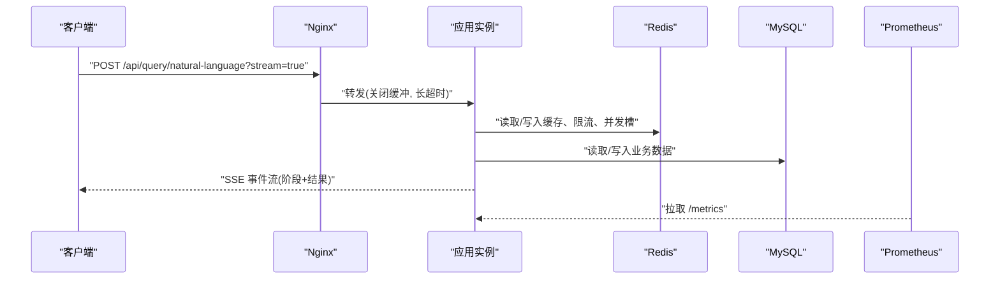
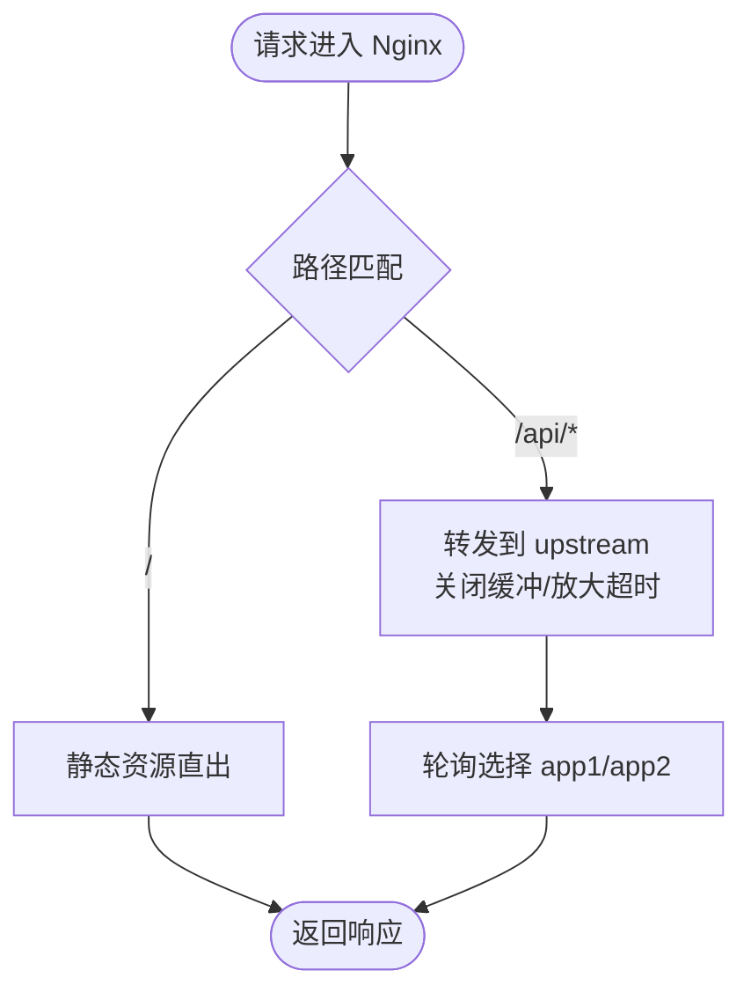
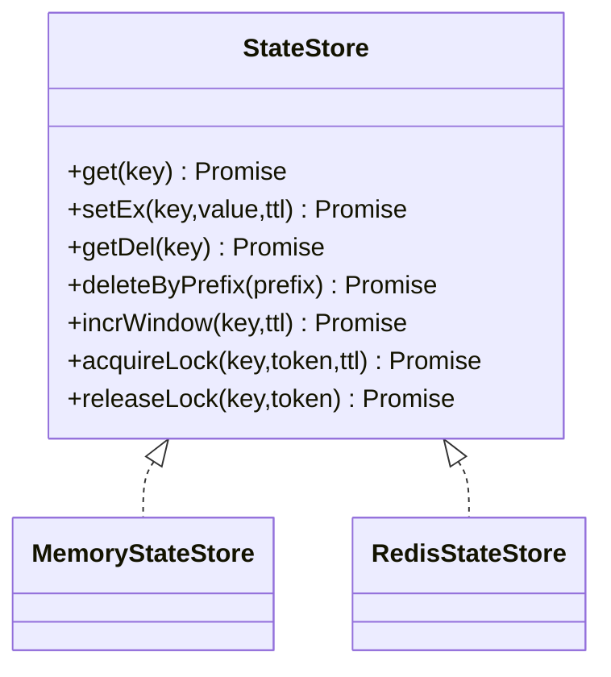
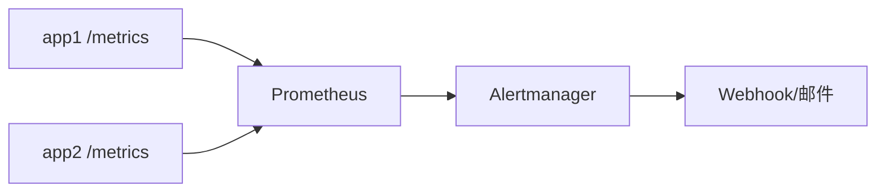
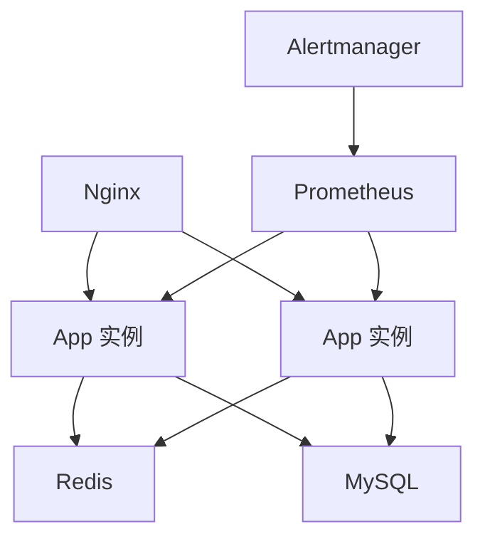

# 多实例部署架构

<cite>
**本文引用的文件**
- [server.ts](file://server.ts)
- [docker-compose.multi-instance.yml](file://docker-compose.multi-instance.yml)
- [deploy/nginx.multi-instance.conf](file://deploy/nginx.multi-instance.conf)
- [docs/多实例部署指南.md](file://docs/多实例部署指南.md)
- [server/infra/stateStore.ts](file://server/infra/stateStore.ts)
- [server/infra/db.ts](file://server/infra/db.ts)
- [deploy/prometheus.yml](file://deploy/prometheus.yml)
- [deploy/alertmanager.yml](file://deploy/alertmanager.yml)
- [deploy/prometheus-alerts.yml](file://deploy/prometheus-alerts.yml)
</cite>

## 目录
1. [简介](#简介)
2. [项目结构](#项目结构)
3. [核心组件](#核心组件)
4. [架构总览](#架构总览)
5. [详细组件分析](#详细组件分析)
6. [依赖关系分析](#依赖关系分析)
7. [性能与容量规划](#性能与容量规划)
8. [故障转移与高可用](#故障转移与高可用)
9. [监控与告警](#监控与告警)
10. [结论](#结论)
11. [附录：部署清单与排错](#附录部署清单与排错)

## 简介
本文件面向“智能问数据分析系统”的多实例生产部署，围绕无状态应用副本、Nginx 负载均衡、Redis 共享状态、MySQL 持久化、Prometheus/Alertmanager 可观测性展开，给出拓扑、配置要点、数据一致性策略、水平扩展方法与故障转移方案。

## 项目结构
- 应用入口与启动流程：server.ts
- 多实例编排示例：docker-compose.multi-instance.yml
- Nginx 反向代理与 SSE 长连接优化：deploy/nginx.multi-instance.conf
- 共享状态抽象（内存/Redis）：server/infra/stateStore.ts
- 数据库初始化与连接池：server/infra/db.ts
- 监控抓取与告警规则：deploy/prometheus.yml、deploy/prometheus-alerts.yml、deploy/alertmanager.yml
- 多实例部署说明与验证步骤：docs/多实例部署指南.md

```mermaid
graph TB
Client["客户端"] --> LB["Nginx 负载均衡"]
LB --> App1["应用实例 app1:3000"]
LB --> App2["应用实例 app2:3000"]
App1 --> Redis["Redis 共享状态"]
App2 --> Redis
App1 --> MySQL["MySQL 业务库"]
App2 --> MySQL
App1 --> LLM["LLM 服务(Ollama/外部)"]
App2 --> LLM
Prometheus["Prometheus"] --> App1
Prometheus --> App2
Alertmanager["Alertmanager"] <- --> Prometheus
```

图表来源
- [docker-compose.multi-instance.yml:1-50](file://docker-compose.multi-instance.yml#L1-L50)
- [deploy/nginx.multi-instance.conf:1-35](file://deploy/nginx.multi-instance.conf#L1-L35)
- [deploy/prometheus.yml:1-57](file://deploy/prometheus.yml#L1-L57)
- [deploy/alertmanager.yml:1-43](file://deploy/alertmanager.yml#L1-L43)

章节来源
- [docker-compose.multi-instance.yml:1-50](file://docker-compose.multi-instance.yml#L1-L50)
- [deploy/nginx.multi-instance.conf:1-35](file://deploy/nginx.multi-instance.conf#L1-L35)
- [docs/多实例部署指南.md:1-129](file://docs/多实例部署指南.md#L1-L129)

## 核心组件
- 无状态应用副本：Node.js Express 服务，所有正确性相关状态外置到 Redis/MySQL，进程内仅保留性能缓存与实例级保护。
- 负载均衡：Nginx 轮询分发，SSE 流式接口关闭缓冲并放大超时，无需会话保持。
- 共享状态：通过 StateStore 抽象统一访问 Redis（或内存回退），提供键值、窗口计数、分布式锁等能力。
- 持久化：MySQL 承载用户、数据源、审计、知识库、任务队列等；启动时自动建表与种子数据。
- 可观测性：/metrics 暴露指标，Prometheus 采集，Alertmanager 统一告警通知。

章节来源
- [server.ts:82-131](file://server.ts#L82-L131)
- [server/infra/stateStore.ts:1-219](file://server/infra/stateStore.ts#L1-L219)
- [server/infra/db.ts:1-800](file://server/infra/db.ts#L1-L800)
- [deploy/prometheus.yml:1-57](file://deploy/prometheus.yml#L1-L57)
- [deploy/alertmanager.yml:1-43](file://deploy/alertmanager.yml#L1-L43)

## 架构总览
- 流量入口：Nginx 接收 HTTP/HTTPS 请求，按 /api/* 转发至后端应用集群。
- 应用层：多个无状态副本，处理鉴权、查询、报告、导出等 API；SSE 流式问答在同一连接内闭环。
- 状态层：Redis 作为共享状态中心（缓存、限流、配额、并发槽、OIDC state 等）。
- 数据层：MySQL 作为权威存储；应用启动时完成 schema 初始化与种子数据。
- 可观测性：每个实例暴露 /metrics，Prometheus 定时抓取，Alertmanager 聚合告警并通知。



图表来源
- [deploy/nginx.multi-instance.conf:9-34](file://deploy/nginx.multi-instance.conf#L9-L34)
- [server.ts:172-193](file://server.ts#L172-L193)
- [server/infra/stateStore.ts:105-163](file://server/infra/stateStore.ts#L105-L163)
- [server/infra/db.ts:47-70](file://server/infra/db.ts#L47-L70)

## 详细组件分析

### Nginx 反向代理与负载均衡
- 上游管理：定义 upstream smart_analytics_app，包含 app1/app2 两个后端，带失败重试参数。
- 路由策略：/api/* 使用轮询转发；SSE 路径关闭响应缓冲与缓存，设置读/写超时以支持最长问数链路。
- 静态资源：/ 下静态资源由 Nginx 直接返回（如需 HTTPS 可在 Nginx 层终止 TLS）。
- 粘性要求：应用为无状态且 SSE 单连接闭环，无需 ip_hash。



图表来源
- [deploy/nginx.multi-instance.conf:1-35](file://deploy/nginx.multi-instance.conf#L1-L35)

章节来源
- [deploy/nginx.multi-instance.conf:1-35](file://deploy/nginx.multi-instance.conf#L1-L35)

### 会话与认证（无状态）
- 会话机制：JWT 无状态签发与校验，跨实例一致校验依赖统一的 JWT_SECRET。
- 安全头：应用层设置 HSTS、CSP、X-Frame-Options 等安全响应头。
- 健康检查：/api/health 用于 LB 健康探测。

章节来源
- [server.ts:91-96](file://server.ts#L91-L96)
- [server.ts:145-167](file://server.ts#L145-L167)
- [server.ts:187-190](file://server.ts#L187-L190)
- [docs/多实例部署指南.md:66-76](file://docs/多实例部署指南.md#L66-L76)

### 共享状态与分布式锁（StateStore）
- 抽象接口：get/setEx/getDel/deleteByPrefix/incrWindow/acquireLock/releaseLock。
- 实现策略：
  - 未配置 REDIS_URL：MemoryStateStore（单机模式）。
  - 配置 REDIS_URL：RedisStateStore（多实例共享），Lua 原子释放锁，INCR 窗口计数配合 TTL。
- 启动预热：warmStateStore 在启动时等待 Redis 就绪，避免冷启动抖动。
- 键空间约定：qp/rqp/qc/uql/uqs/rl 等前缀区分用途。



图表来源
- [server/infra/stateStore.ts:10-23](file://server/infra/stateStore.ts#L10-L23)
- [server/infra/stateStore.ts:32-98](file://server/infra/stateStore.ts#L32-L98)
- [server/infra/stateStore.ts:105-163](file://server/infra/stateStore.ts#L105-L163)

章节来源
- [server/infra/stateStore.ts:1-219](file://server/infra/stateStore.ts#L1-L219)
- [docs/多实例部署指南.md:25-48](file://docs/多实例部署指南.md#L25-L48)

### 数据库主从复制与一致性
- 连接池：mysql2/promise 创建池，容量按 EXPECTED_CONCURRENT_USERS 推导，上限受 APP_POOL_MAX 控制。
- 初始化：启动时确保库存在、建表幂等、注入种子数据（管理员账号、内置技能、模板等）。
- 一致性保障：
  - 多实例共享同一 MySQL，事务与自增主键保证写入一致性。
  - 审计、追踪、对话历史等关键表具备索引，便于查询与归档。
- 建议：生产环境启用 MySQL 主从复制与读写分离（应用侧仍指向主库写入），结合备份与 PITR 策略。

章节来源
- [server/infra/db.ts:14-70](file://server/infra/db.ts#L14-L70)
- [server/infra/db.ts:72-800](file://server/infra/db.ts#L72-L800)

### 监控与可观测性
- 指标暴露：/metrics 暴露 HTTP 耗时、问数状态计数、缓存命中、LLM 调用时长等。
- 抓取配置：Prometheus 配置 job nl2sql-app，多实例时追加多个 target，instance label 自动区分。
- 告警规则：应用宕机、MySQL/Redis 不可达、成功率低、P95 延迟高、缓存命中率低、内存占用高等。
- 通知：Alertmanager 通过 Webhook 推送告警，抑制下游连锁告警。



图表来源
- [deploy/prometheus.yml:16-57](file://deploy/prometheus.yml#L16-L57)
- [deploy/prometheus-alerts.yml:1-144](file://deploy/prometheus-alerts.yml#L1-L144)
- [deploy/alertmanager.yml:1-43](file://deploy/alertmanager.yml#L1-L43)

章节来源
- [server.ts:172-193](file://server.ts#L172-L193)
- [deploy/prometheus.yml:1-57](file://deploy/prometheus.yml#L1-L57)
- [deploy/prometheus-alerts.yml:1-144](file://deploy/prometheus-alerts.yml#L1-L144)
- [deploy/alertmanager.yml:1-43](file://deploy/alertmanager.yml#L1-L43)

## 依赖关系分析
- 应用对 Redis 的依赖：缓存命中、限流、并发槽、计划一次性消费、OIDC state 均依赖 Redis；未配置时降级为内存实现。
- 应用对 MySQL 的依赖：鉴权、审计、知识库、任务队列等强依赖；启动时进行 schema 初始化。
- Nginx 与应用：通过 upstream 管理实例健康；SSE 需要关闭缓冲与放大超时。
- 监控栈：Prometheus 抓取各实例 /metrics；Alertmanager 基于规则触发通知。



图表来源
- [docker-compose.multi-instance.yml:1-50](file://docker-compose.multi-instance.yml#L1-L50)
- [deploy/nginx.multi-instance.conf:1-35](file://deploy/nginx.multi-instance.conf#L1-L35)
- [server/infra/stateStore.ts:169-187](file://server/infra/stateStore.ts#L169-L187)
- [server/infra/db.ts:47-70](file://server/infra/db.ts#L47-L70)
- [deploy/prometheus.yml:16-57](file://deploy/prometheus.yml#L16-L57)

章节来源
- [server/infra/stateStore.ts:169-187](file://server/infra/stateStore.ts#L169-L187)
- [server/infra/db.ts:47-70](file://server/infra/db.ts#L47-L70)
- [deploy/prometheus.yml:16-57](file://deploy/prometheus.yml#L16-L57)

## 性能与容量规划
- 实例数量规划：
  - 根据并发用户数估算连接池大小与实例数；默认连接池容量按 EXPECTED_CONCURRENT_USERS/2 计算，上限 50，可通过 APP_POOL_MAX 覆盖。
  - 多实例通过 Nginx 轮询横向扩展，新增实例即插即用。
- 资源分配：
  - Node 进程常驻内存基线数百 MB，关注 embedding 缓存与结果集驻留；Prometheus 告警阈值 1.5GiB。
  - Redis 需足够内存承载缓存与计数器；MySQL 需充足 IO 与连接池。
- 性能调优：
  - Nginx：SSE 路径关闭缓冲、放大超时；静态资源可开启 gzip/缓存。
  - 应用：合理设置 JSON body 限制；/metrics 仅采集 /api/* 降低 label 基数。
  - 缓存：语义缓存阈值 SEMANTIC_CACHE_THRESHOLD 全实例一致，避免行为不一致。
- 压测建议：固定打单一实例以避免缓存跨实例命中影响测量。

章节来源
- [server/infra/db.ts:29-43](file://server/infra/db.ts#L29-L43)
- [deploy/prometheus-alerts.yml:86-94](file://deploy/prometheus-alerts.yml#L86-L94)
- [docs/多实例部署指南.md:77-85](file://docs/多实例部署指南.md#L77-L85)
- [docs/多实例部署指南.md:124-129](file://docs/多实例部署指南.md#L124-L129)

## 故障转移与高可用
- 应用实例故障：Nginx 标记失败节点（max_fails/fail_timeout），自动摘除；恢复后重新接入。
- Redis 故障：
  - 缓存 fail-open（视为未命中），限流 fail-closed（拒绝），OIDC 登录拒绝发起；核心问数链路不中断。
  - 启动预热 warmStateStore 缩短冷启动窗口。
- MySQL 故障：
  - 应用无法写入/读取业务数据；需尽快恢复主库或切换只读副本（读多场景）。
- 滚动发布：
  - LB 摘除副本 → 等待在途请求完成（最长 600s）→ 替换新版本 → 健康检查通过后回挂。
- 缩容：
  - 同上摘除；Redis 并发槽 TTL 保证崩溃实例槽位自动释放。

章节来源
- [deploy/nginx.multi-instance.conf:4-7](file://deploy/nginx.multi-instance.conf#L4-L7)
- [server/infra/stateStore.ts:194-213](file://server/infra/stateStore.ts#L194-L213)
- [docs/多实例部署指南.md:116-123](file://docs/多实例部署指南.md#L116-L123)

## 监控与告警
- 指标采集：
  - 应用 /metrics：HTTP 耗时、问数状态、缓存命中、LLM 调用时长等。
  - 多实例抓取：Prometheus static_configs 追加 app1/app2 目标，instance label 区分。
- 告警规则：
  - 可用性：应用/MySQL/Redis 不可达。
  - 业务：成功率低于阈值、P95 延迟过高、缓存命中率低、FALLBACK 率高。
  - 资源：进程内存超阈值、磁盘空间不足。
  - 监控栈：Prometheus 序列基数异常、规则求值失败、抓取慢、Alertmanager 宕机。
- 通知渠道：
  - Alertmanager Webhook 对接企业微信/钉钉/自研网关；支持抑制规则避免风暴。

章节来源
- [deploy/prometheus.yml:16-57](file://deploy/prometheus.yml#L16-L57)
- [deploy/prometheus-alerts.yml:1-144](file://deploy/prometheus-alerts.yml#L1-L144)
- [deploy/alertmanager.yml:1-43](file://deploy/alertmanager.yml#L1-L43)

## 结论
本系统采用“无状态应用 + Redis 共享状态 + MySQL 持久化 + Nginx 负载均衡 + Prometheus/Alertmanager 可观测性”的多实例架构，具备水平扩展、滚动发布、故障转移与完善的监控告警能力。生产部署需确保 REDIS_URL 与 JWT_SECRET 等关键配置一致，并按容量规划调整连接池与实例规模。

## 附录：部署清单与排错
- 环境变量要求：
  - REDIS_URL：多实例必须配置，否则共享状态失效。
  - JWT_SECRET：全实例一致，否则跨实例会话校验失败。
  - MYSQL_*：指向同一 MySQL。
  - PORT/HOST：容器内固定 3000，HOST=0.0.0.0 暴露端口。
- 快速启动（Compose）：
  - docker compose -f docker-compose.multi-instance.yml up -d --build
  - 访问 http://localhost:8080（Nginx 轮询 app1/app2）
- 本地双实例验证：
  - 起共享 Redis，启动两个实例，验证限流跨实例共享、缓存跨实例命中、OIDC state 跨实例一次性消费。
- 常见问题：
  - SSE 被截断：检查 Nginx proxy_buffering/off 与 read/send timeout。
  - 缓存命中率低：检查数据源变更后失效联动与 TTL 配置。
  - 告警风暴：确认抑制规则生效，避免下游连锁告警。

章节来源
- [docs/多实例部署指南.md:66-129](file://docs/多实例部署指南.md#L66-L129)
- [docker-compose.multi-instance.yml:1-50](file://docker-compose.multi-instance.yml#L1-L50)
- [deploy/nginx.multi-instance.conf:1-35](file://deploy/nginx.multi-instance.conf#L1-L35)