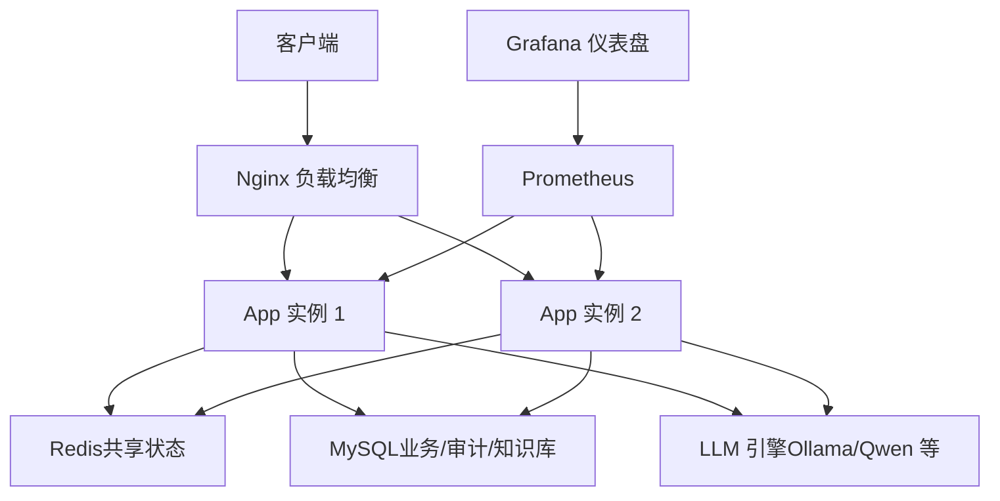
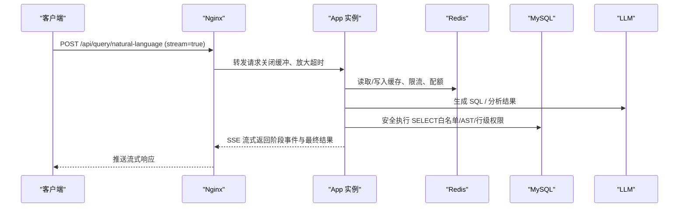
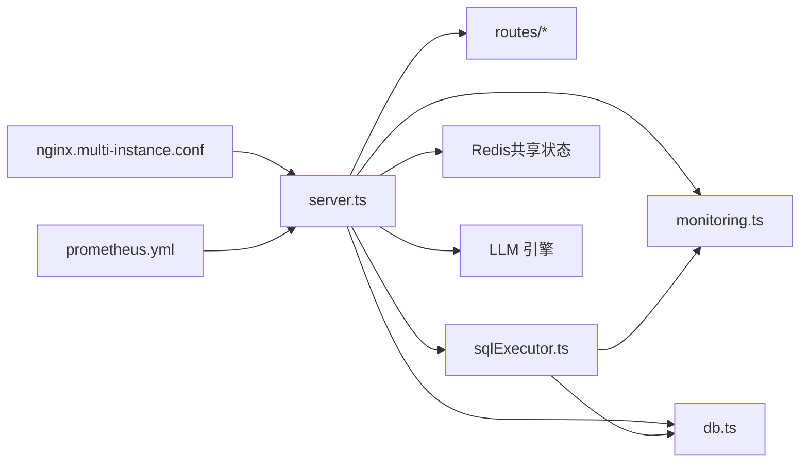

# 水平扩展指南

<cite>
**本文引用的文件**
- [server.ts](file://server.ts)
- [Dockerfile](file://Dockerfile)
- [docker-compose.multi-instance.yml](file://docker-compose.multi-instance.yml)
- [deploy/nginx.multi-instance.conf](file://deploy/nginx.multi-instance.conf)
- [docs/多实例部署指南.md](file://docs/多实例部署指南.md)
- [docs/容量规划与压测报告-P1-9.md](file://docs/容量规划与压测报告-P1-9.md)
- [server/query/sqlExecutor.ts](file://server/query/sqlExecutor.ts)
- [server/infra/db.ts](file://server/infra/db.ts)
- [server/infra/monitoring.ts](file://server/infra/monitoring.ts)
- [deploy/prometheus.yml](file://deploy/prometheus.yml)
- [deploy/grafana/dashboards/nl2sql-overview.json](file://deploy/grafana/dashboards/nl2sql-overview.json)
</cite>

## 目录
1. [简介](#简介)
2. [项目结构](#项目结构)
3. [核心组件](#核心组件)
4. [架构总览](#架构总览)
5. [详细组件分析](#详细组件分析)
6. [依赖关系分析](#依赖关系分析)
7. [性能考虑](#性能考虑)
8. [故障排查指南](#故障排查指南)
9. [结论](#结论)
10. [附录](#附录)

## 简介
本指南面向“智能问数据分析系统”的水平扩展，覆盖实例数量规划、资源分配策略、性能调优要点、扩缩容操作以及监控指标定义与采集方法。系统采用无状态应用设计，通过外部共享状态（Redis/MySQL）实现多实例一致性；前端与后端分离，Nginx 作为负载均衡入口，Prometheus/Grafana 提供可观测性。

## 项目结构
- 应用服务：Express + Node 进程，暴露 /api/* 接口与 /metrics 端点。
- 负载均衡：Nginx 轮询转发至多个 app 实例，针对 SSE 长连接关闭缓冲并放大超时。
- 共享状态：Redis（缓存、限流、配额、会话辅助）、MySQL（业务数据、审计、知识库等）。
- 可观测性：Prometheus 抓取应用指标与基础设施指标，Grafana 仪表盘展示关键 KPI。

图表来源
- [docker-compose.multi-instance.yml:1-50](file://docker-compose.multi-instance.yml#L1-L50)
- [deploy/nginx.multi-instance.conf:1-35](file://deploy/nginx.multi-instance.conf#L1-L35)
- [server.ts:172-193](file://server.ts#L172-L193)
- [deploy/prometheus.yml:16-57](file://deploy/prometheus.yml#L16-L57)

章节来源
- [docker-compose.multi-instance.yml:1-50](file://docker-compose.multi-instance.yml#L1-L50)
- [deploy/nginx.multi-instance.conf:1-35](file://deploy/nginx.multi-instance.conf#L1-L35)
- [server.ts:172-193](file://server.ts#L172-L193)
- [deploy/prometheus.yml:16-57](file://deploy/prometheus.yml#L16-L57)

## 核心组件
- 应用启动与健康检查：生产环境强制 JWT_SECRET，健康端点 /api/health 用于探针。
- 多实例共享状态：Redis 用于缓存、限流、配额、OIDC state 等；MySQL 为权威存储。
- 数据库连接池：数据源连接池与应用库连接池按并发用户数公式化配置，避免打爆后端。
- 监控埋点：Prometheus 指标覆盖请求耗时、缓存命中、SQL 执行、LLM 调用等。

章节来源
- [server.ts:82-193](file://server.ts#L82-L193)
- [docs/多实例部署指南.md:25-48](file://docs/多实例部署指南.md#L25-L48)
- [docs/容量规划与压测报告-P1-9.md:5-39](file://docs/容量规划与压测报告-P1-9.md#L5-L39)
- [server/infra/monitoring.ts:1-153](file://server/infra/monitoring.ts#L1-L153)

## 架构总览
系统以无状态应用为核心，通过 Nginx 进行流量分发，SSE 流式查询天然满足粘性要求，无需会话保持。所有正确性相关共享状态外置到 Redis/MySQL，进程内存仅保留性能加速与实例级保护组件。

图表来源
- [deploy/nginx.multi-instance.conf:1-35](file://deploy/nginx.multi-instance.conf#L1-L35)
- [server/query/sqlExecutor.ts:291-387](file://server/query/sqlExecutor.ts#L291-L387)
- [server/infra/monitoring.ts:19-88](file://server/infra/monitoring.ts#L19-L88)

## 详细组件分析

### 实例数量规划原则
- QPS 估算：基于历史请求速率与峰值系数确定目标 QPS；结合单实例吞吐能力（压测结果）计算副本数。
- CPU/内存利用率：观察 Prometheus 的 node-exporter 指标，确保各实例 CPU/内存使用率留有扩容余量（建议 <70%）。
- 数据库连接数：依据并发用户数与连接池公式控制数据源与应用库连接上限，避免超过后端 max_connections。

参考公式与水位
- 数据源连接池：DS_POOL_MAX = clamp(ceil(EXPECTED_CONCURRENT_USERS / 4), 3, 20)
- 应用库连接池：APP_POOL_MAX = clamp(ceil(EXPECTED_CONCURRENT_USERS / 2), 10, 50)

章节来源
- [docs/容量规划与压测报告-P1-9.md:5-39](file://docs/容量规划与压测报告-P1-9.md#L5-L39)
- [server/query/sqlExecutor.ts:44-59](file://server/query/sqlExecutor.ts#L44-L59)
- [server/infra/db.ts:29-43](file://server/infra/db.ts#L29-L43)

### 资源分配策略
- 容器资源限制：为每个 app 实例设置 CPU 与内存 limit/requests，保证调度器公平分配与 OOM 保护。
- CPU 亲和性：在编排层将同实例的 app 与依赖（如本地缓存热点）尽量亲和，减少跨节点网络开销。
- 内存隔离：通过 cgroup 限制 Node 进程堆大小，配合 JVM 类比的 GC 参数（Node 使用 --max-old-space-size）防止内存泄漏影响宿主。

说明
- 本仓库未直接包含 Kubernetes 清单，建议在编排层（K8s/Docker Compose）实施上述策略；容器镜像已暴露健康检查端点便于就绪探测。

章节来源
- [Dockerfile:27-46](file://Dockerfile#L27-L46)
- [docker-compose.multi-instance.yml:14-39](file://docker-compose.multi-instance.yml#L14-L39)

### 性能调优要点
- 应用侧
  - 健康检查：/api/health 用于探针；/metrics 暴露 Prometheus 指标。
  - 请求体限制：按路由差异化 JSON body 限制，避免大报文阻塞。
- 数据库连接池
  - 数据源连接池：按场景分级（交互/链/导出），独立配额与超时，避免后台任务挤占交互链路。
  - 应用库连接池：短查询高频访问，按并发用户数公式化配置。
- 缓存命中率提升
  - L1 精确缓存与 L2 语义缓存；TTL 与环境变量可调；数据源结构变更后失效联动。
  - 演示模式也支持缓存写入，重复提问显著提速。

章节来源
- [server.ts:133-193](file://server.ts#L133-L193)
- [server/query/sqlExecutor.ts:62-109](file://server/query/sqlExecutor.ts#L62-L109)
- [server/infra/db.ts:29-43](file://server/infra/db.ts#L29-L43)
- [docs/性能专项评估报告-20260902.md:95-193](file://docs/性能专项评估报告-20260902.md#L95-L193)

### 扩缩容操作指南
- 滚动升级
  - 摘除实例 → 等待在途请求完成（SSE 最长 600s）→ 替换新版本 → 健康检查通过后回挂。
- 蓝绿部署
  - 维护两套相同版本集合，切换 LB 指向新集合；验证后切回旧集合或下线。
- 灰度发布
  - 按用户/租户/流量比例逐步放量，结合监控指标与告警快速回滚。
- 注意事项
  - 多实例必须配置一致的 JWT_SECRET 与语义缓存阈值；Redis 不可用时限流 fail-closed、缓存 fail-open，核心链路不中断但需尽快恢复。

章节来源
- [docs/多实例部署指南.md:116-128](file://docs/多实例部署指南.md#L116-L128)
- [deploy/nginx.multi-instance.conf:1-35](file://deploy/nginx.multi-instance.conf#L1-L35)

### 监控指标定义与采集
- 业务指标
  - nl2sql_requests_total：按 status/endpoint 统计请求总数。
  - nl2sql_duration_seconds：端到端耗时直方图。
  - nl2sql_cache_hits_total：L1/L2 缓存命中计数。
- 系统指标
  - HTTP 接口耗时：http_request_duration_seconds（method/route/status）。
  - 基础设施：node-exporter 采集 CPU/内存/磁盘。
- 性能指标
  - sql_execute_duration_seconds：安全 SQL 执行耗时。
  - llm_call_duration_seconds：LLM 调用耗时（channel/engine/model/ok）。
  - llm_tokens_total：token 消耗量。
- 采集方式
  - Prometheus 抓取 /metrics；Grafana 仪表盘聚合展示成功率、缓存命中率、P95 时延、QPS 等。

章节来源
- [server/infra/monitoring.ts:19-88](file://server/infra/monitoring.ts#L19-L88)
- [deploy/prometheus.yml:16-57](file://deploy/prometheus.yml#L16-L57)
- [deploy/grafana/dashboards/nl2sql-overview.json:1-192](file://deploy/grafana/dashboards/nl2sql-overview.json#L1-L192)

## 依赖关系分析
- 应用依赖
  - Express 路由与中间件：鉴权、日志、安全头、监控埋点。
  - 数据库驱动：mysql2/pg 连接池，按场景配置超时与最大连接数。
  - Redis：共享状态（缓存、限流、配额、OIDC state）。
  - LLM：模型调用与用量统计。
- 外部依赖
  - Nginx：负载均衡与 SSE 长连接代理配置。
  - Prometheus/Grafana：指标采集与可视化。

图表来源
- [server.ts:21-64](file://server.ts#L21-L64)
- [server/query/sqlExecutor.ts:11-20](file://server/query/sqlExecutor.ts#L11-L20)
- [server/infra/db.ts:1-12](file://server/infra/db.ts#L1-L12)
- [deploy/nginx.multi-instance.conf:1-35](file://deploy/nginx.multi-instance.conf#L1-L35)
- [deploy/prometheus.yml:16-57](file://deploy/prometheus.yml#L16-L57)

章节来源
- [server.ts:21-64](file://server.ts#L21-L64)
- [server/query/sqlExecutor.ts:11-20](file://server/query/sqlExecutor.ts#L11-L20)
- [server/infra/db.ts:1-12](file://server/infra/db.ts#L1-L12)
- [deploy/nginx.multi-instance.conf:1-35](file://deploy/nginx.multi-instance.conf#L1-L35)
- [deploy/prometheus.yml:16-57](file://deploy/prometheus.yml#L16-L57)

## 性能考虑
- 瓶颈定位
  - 真实查询端到端耗时主要由 LLM 推理主导；SQL 执行占比极低。
  - 缓存命中率受 TTL 与相似度阈值影响，可通过延长 TTL 与放宽小模型路由提升整体体验。
- 优化方向
  - 小模型路由放宽：简单查询走快速模型，降低 P50 延迟。
  - 演示模式缓存：重复提问从分钟级降至毫秒级。
  - 真实流式输出：接入流式解析，改善首字节时间感知。
  - 并行化：Schema Linking 与分析阶段并行，缩短链路总耗时。

章节来源
- [docs/性能专项评估报告-20260902.md:52-153](file://docs/性能专项评估报告-20260902.md#L52-L153)

## 故障排查指南
- 常见问题
  - Redis 不可用：限流 fail-closed（拒绝请求），缓存 fail-open（视为未命中）；核心链路不中断，应尽快恢复。
  - SSE 长连接被截断：确认 Nginx 关闭缓冲与放大读超时；云 LB idle timeout ≥ 600s。
  - 连接池耗尽：调整 DS_POOL_MAX/APP_POOL_MAX 或降低并发；关注后端 max_connections。
- 诊断手段
  - 查看 /metrics 与 Grafana 仪表盘，定位高错误率与高延迟端点。
  - 审计表 query_audit_log 与 trace 表分析失败原因与耗时分布。
  - 使用 loadTest 脚本分档并发压测，验证连接池与超时配置。

章节来源
- [docs/多实例部署指南.md:116-128](file://docs/多实例部署指南.md#L116-L128)
- [deploy/nginx.multi-instance.conf:1-35](file://deploy/nginx.multi-instance.conf#L1-L35)
- [docs/容量规划与压测报告-P1-9.md:40-78](file://docs/容量规划与压测报告-P1-9.md#L40-L78)

## 结论
系统通过无状态设计与共享状态外置，具备良好水平扩展能力。容量规划应以并发用户数为基准，结合连接池公式与后端资源约束；性能调优聚焦 LLM 路由、缓存命中率与流式输出；扩缩容流程清晰且风险可控；监控体系完善，便于持续优化与问题定位。

## 附录
- 环境变量要点
  - REDIS_URL：多实例必须配置，用于共享状态。
  - JWT_SECRET：全实例一致，否则跨实例会话校验失败。
  - MYSQL_*：指向同一 MySQL。
  - EXPECTED_CONCURRENT_USERS：用于连接池公式推导。
  - DS_POOL_MAX/APP_POOL_MAX：显式覆盖默认水位。
- 健康检查与探针
  - /api/health：应用健康端点。
  - /metrics：Prometheus 抓取端点（可选 METRICS_TOKEN 保护）。

章节来源
- [docs/多实例部署指南.md:66-85](file://docs/多实例部署指南.md#L66-L85)
- [server.ts:187-193](file://server.ts#L187-L193)
- [server/infra/monitoring.ts:135-153](file://server/infra/monitoring.ts#L135-L153)