# 状态同步策略

<cite>
**本文引用的文件**
- [server/infra/stateStore.ts](file://server/infra/stateStore.ts)
- [server/query/queryCache.ts](file://server/query/queryCache.ts)
- [server/query/schemaContext.ts](file://server/query/schemaContext.ts)
- [server/knowledge/knowledgeBase.ts](file://server/knowledge/knowledgeBase.ts)
- [server/dataVersion.ts](file://server/dataVersion.ts)
- [server/infra/taskQueue.ts](file://server/infra/taskQueue.ts)
- [server/infra/monitoring.ts](file://server/infra/monitoring.ts)
- [server/routes/datasources.ts](file://server/routes/datasources.ts)
- [server/infra/rateLimiter.ts](file://server/infra/rateLimiter.ts)
</cite>

## 目录
1. [简介](#简介)
2. [项目结构](#项目结构)
3. [核心组件](#核心组件)
4. [架构总览](#架构总览)
5. [详细组件分析](#详细组件分析)
6. [依赖关系分析](#依赖关系分析)
7. [性能考量](#性能考量)
8. [故障排查指南](#故障排查指南)
9. [结论](#结论)
10. [附录](#附录)

## 简介
本文件面向“智能问数据分析系统”的状态同步策略，聚焦分布式状态管理、事件驱动更新、缓存失效、数据版本控制与监控健康检查。系统通过统一的 StateStore 抽象在内存与 Redis 之间切换，实现查询缓存、Schema 元数据、知识库索引等跨实例一致性；通过任务队列与心跳机制保障长任务最终一致性与可恢复性；通过数据指纹与 TTL 策略提供轻量级变更检测与自动刷新能力。

## 项目结构
围绕状态同步的关键模块分布如下：
- 状态存储抽象与工厂：stateStore（内存/Redis）
- 查询缓存与语义索引：queryCache（L1/L2 命中、TTL、前缀失效）
- Schema 上下文缓存：schemaContext（跨实例共享、按数据源失效）
- 知识库检索与切片：knowledgeBase（向量/关键词降级、阈值过滤）
- 数据版本指纹：dataVersion（轻量行级统计指纹、短 TTL 缓存）
- 长任务队列与恢复：taskQueue（MySQL 持久化、心跳、孤儿回收）
- 监控指标：monitoring（Prometheus 埋点、fail-open）
- 路由触发点：datasources（写操作后触发缓存失效）
- 限流器：rateLimiter（基于 StateStore 的固定窗口计数）

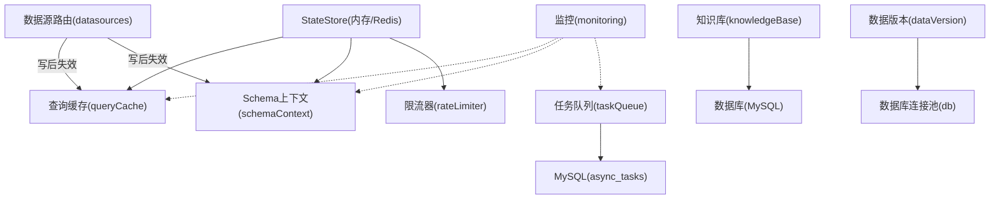

图表来源
- [server/infra/stateStore.ts:10-23](file://server/infra/stateStore.ts#L10-L23)
- [server/query/queryCache.ts:43-114](file://server/query/queryCache.ts#L43-L114)
- [server/query/schemaContext.ts:50-55](file://server/query/schemaContext.ts#L50-L55)
- [server/routes/datasources.ts:13-16](file://server/routes/datasources.ts#L13-L16)
- [server/infra/taskQueue.ts:86-117](file://server/infra/taskQueue.ts#L86-L117)
- [server/infra/monitoring.ts:37-44](file://server/infra/monitoring.ts#L37-L44)

章节来源
- [server/infra/stateStore.ts:1-219](file://server/infra/stateStore.ts#L1-L219)
- [server/query/queryCache.ts:1-254](file://server/query/queryCache.ts#L1-L254)
- [server/query/schemaContext.ts:1-172](file://server/query/schemaContext.ts#L1-L172)
- [server/knowledge/knowledgeBase.ts:1-239](file://server/knowledge/knowledgeBase.ts#L1-L239)
- [server/dataVersion.ts:1-104](file://server/dataVersion.ts#L1-L104)
- [server/infra/taskQueue.ts:1-347](file://server/infra/taskQueue.ts#L1-L347)
- [server/infra/monitoring.ts:1-153](file://server/infra/monitoring.ts#L1-L153)
- [server/routes/datasources.ts:1-200](file://server/routes/datasources.ts#L1-L200)
- [server/infra/rateLimiter.ts:1-54](file://server/infra/rateLimiter.ts#L1-L54)

## 核心组件
- 统一状态存储 StateStore：提供 get/setEx/getDel/deleteByPrefix/incrWindow/acquireLock/releaseLock 等原子能力，默认内存实现，配置 REDIS_URL 时切换为 Redis 实现，支持多实例共享与 TTL 自动过期。
- 查询缓存 queryCache：L1 精确命中 + L2 语义相似度命中；TTL 可配置；支持按数据源前缀批量失效；大负载不缓存以防撑爆外置存储。
- Schema 上下文 schemaContext：加载并摘要 Schema，带敏感列过滤与行级权限；结果缓存 5 分钟，跨实例共享；写操作后按前缀失效。
- 知识库 knowledgeBase：文档切块、embedding 向量化与检索；向量不可用时降级 bigram 关键词；设置相关性阈值避免无关注入。
- 数据版本 dataVersion：基于 information_schema/pg_stat_user_tables 的行数与更新时间计算轻量指纹；内存缓存 10s 防轮询风暴。
- 任务队列 taskQueue：MySQL 表持久化任务，worker 并发消费；心跳超时回收孤儿任务；失败重试上限保护。
- 监控 monitoring：Prometheus 指标埋点，fail-open 设计；暴露 /metrics 端点。
- 限流 rateLimiter：基于 StateStore 的固定窗口计数，Redis 模式多实例共享。

章节来源
- [server/infra/stateStore.ts:10-23](file://server/infra/stateStore.ts#L10-L23)
- [server/query/queryCache.ts:12-20](file://server/query/queryCache.ts#L12-L20)
- [server/query/schemaContext.ts:30-55](file://server/query/schemaContext.ts#L30-L55)
- [server/knowledge/knowledgeBase.ts:13-41](file://server/knowledge/knowledgeBase.ts#L13-L41)
- [server/dataVersion.ts:43-58](file://server/dataVersion.ts#L43-L58)
- [server/infra/taskQueue.ts:65-84](file://server/infra/taskQueue.ts#L65-L84)
- [server/infra/monitoring.ts:1-10](file://server/infra/monitoring.ts#L1-L10)
- [server/infra/rateLimiter.ts:1-11](file://server/infra/rateLimiter.ts#L1-L11)

## 架构总览
下图展示状态同步的核心交互：写路径触发缓存失效，读路径经 StateStore 获取或重建；任务队列承载异步工作；监控埋点贯穿关键路径。

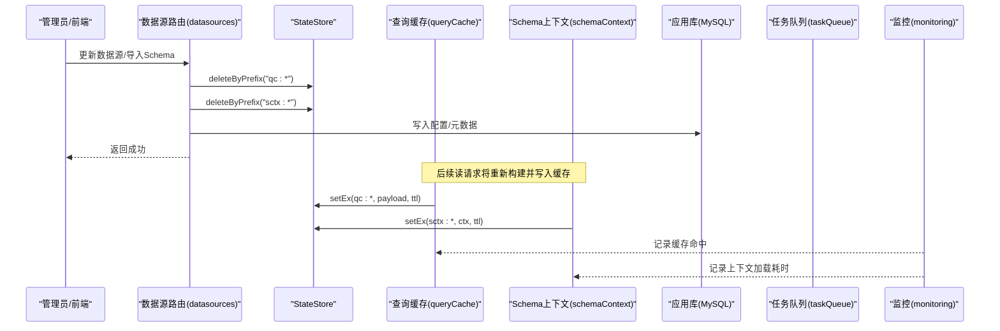

图表来源
- [server/routes/datasources.ts:13-16](file://server/routes/datasources.ts#L13-L16)
- [server/query/queryCache.ts:92-114](file://server/query/queryCache.ts#L92-L114)
- [server/query/schemaContext.ts:50-55](file://server/query/schemaContext.ts#L50-L55)
- [server/infra/monitoring.ts:37-44](file://server/infra/monitoring.ts#L37-L44)

## 详细组件分析

### 分布式状态存储（StateStore）
- 设计要点
  - 统一接口：get/setEx/getDel/deleteByPrefix/incrWindow/acquireLock/releaseLock
  - 内存实现：进程内 Map + 计数器，适合单机零依赖
  - Redis 实现：使用 SETEX/GETDEL/SCAN/INCR+EXPIRE/SET NX/Lua 释放锁，保证原子性与跨实例一致性
  - 启动预热：warmStateStore 等待 Redis 就绪，消除冷启动窗口
- 复杂度与性能
  - deleteByPrefix 使用 SCAN 分批删除，避免一次性扫描全库键
  - incrWindow 首次写入设置 TTL，失败则主动删除防止永久键绕过窗口
- 错误处理
  - Redis 异常在读取侧 fail-open（如缓存未命中），写入侧对关键路径做保护（如窗口 TTL 失败抛错）

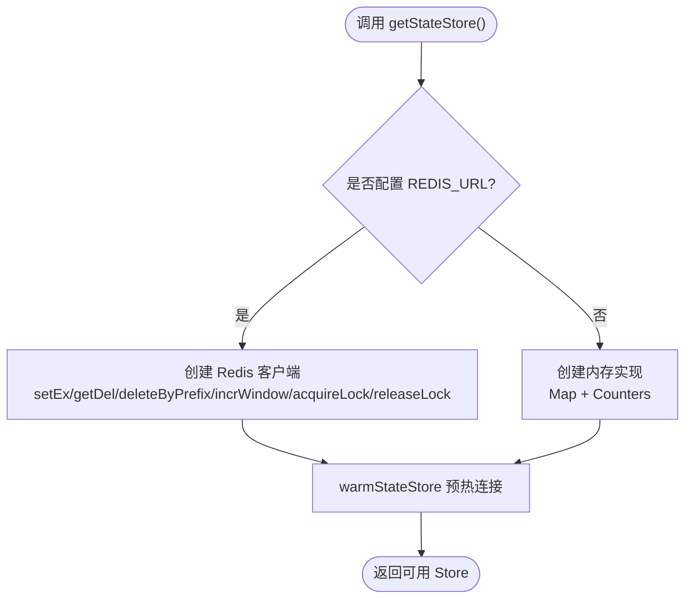

图表来源
- [server/infra/stateStore.ts:165-219](file://server/infra/stateStore.ts#L165-L219)
- [server/infra/stateStore.ts:105-163](file://server/infra/stateStore.ts#L105-L163)
- [server/infra/stateStore.ts:32-98](file://server/infra/stateStore.ts#L32-L98)

章节来源
- [server/infra/stateStore.ts:1-219](file://server/infra/stateStore.ts#L1-L219)

### 查询缓存同步（L1/L2 与失效）
- 命中流程
  - L1：归一化问题精确匹配，优先从 StateStore 读取（Redis 模式跨实例共享），否则回退内存 Map
  - L2：embedding 相似度 ≥ 阈值命中最近邻，再校验 L1 条目仍存在才返回
- 写入与失效
  - 写入时若启用 Redis 且载荷不超过上限则 setEx；同时建立语义索引（失败不阻断主链路）
  - 数据源变更后调用 invalidateQueryCache，按前缀删除 qc:* 与 qcidx:*
- 性能与容量
  - 内存模式最大条目限制，超出淘汰最早写入
  - Redis 模式单条载荷上限，避免大结果集撑爆存储

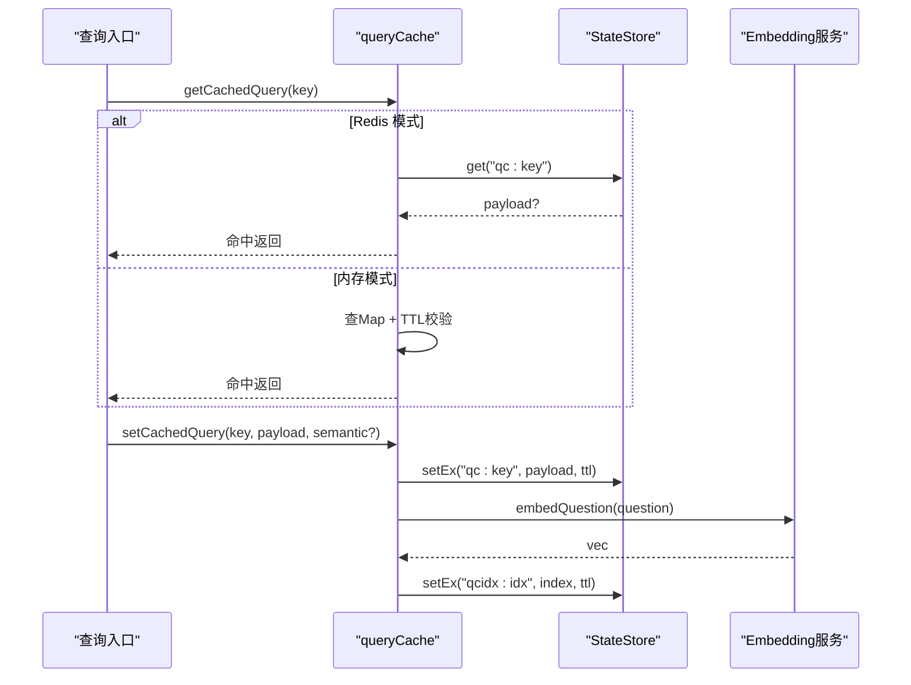

图表来源
- [server/query/queryCache.ts:43-90](file://server/query/queryCache.ts#L43-L90)
- [server/query/queryCache.ts:231-254](file://server/query/queryCache.ts#L231-L254)
- [server/query/queryCache.ts:168-223](file://server/query/queryCache.ts#L168-L223)

章节来源
- [server/query/queryCache.ts:1-254](file://server/query/queryCache.ts#L1-L254)

### Schema 元数据一致性
- 缓存策略
  - 加载 Schema → 应用范围过滤 → 敏感列过滤 → 生成摘要 → 缓存 5 分钟
  - 缓存键 sctx:{dataSourceId}，跨实例共享（Redis）
- 失效策略
  - 数据源配置/结构变更后调用 invalidateSchemaCache，按前缀删除
- 降级与健壮性
  - 缓存损坏或读取异常时回退到客户端传入的 Schema
  - 连接异常时记录告警并降级

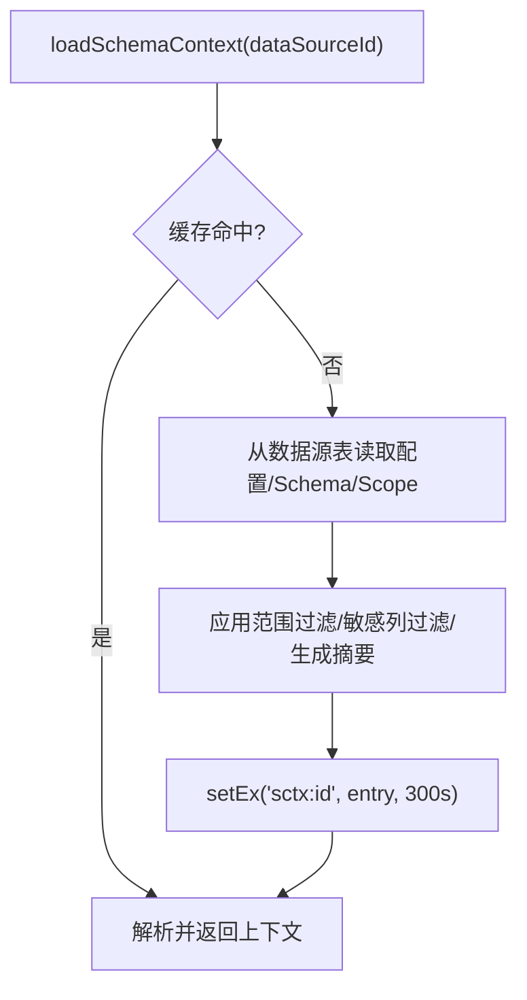

图表来源
- [server/query/schemaContext.ts:108-172](file://server/query/schemaContext.ts#L108-L172)
- [server/query/schemaContext.ts:50-55](file://server/query/schemaContext.ts#L50-L55)

章节来源
- [server/query/schemaContext.ts:1-172](file://server/query/schemaContext.ts#L1-L172)

### 知识库数据同步
- 入库流程
  - 文档切块（段落优先、重叠拼接）→ 批量 embedding（失败降级为 null）→ 逐块落库
- 检索流程
  - 读取同数据源全部块 → 计算问题 embedding（失败走关键词）→ 余弦相似度排序并过滤阈值 → 同一文档最多入选若干块 → 格式化注入 prompt
- 降级与阈值
  - 向量不可用降级 bigram 关键词
  - 向量模式设置最小相关度阈值，避免无关知识注入

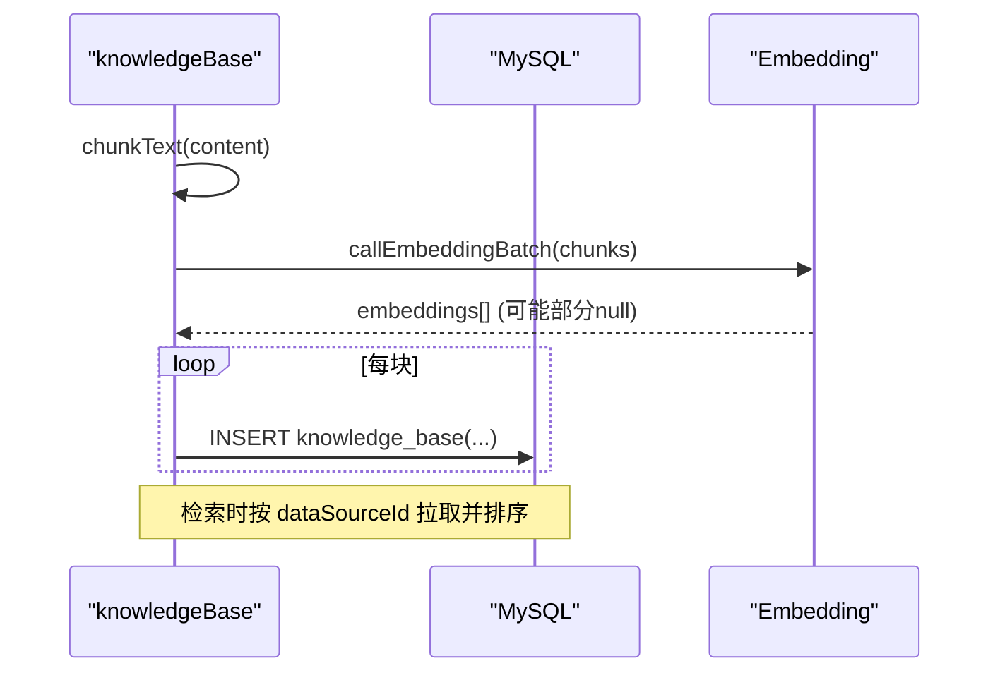

图表来源
- [server/knowledge/knowledgeBase.ts:170-197](file://server/knowledge/knowledgeBase.ts#L170-L197)
- [server/knowledge/knowledgeBase.ts:206-239](file://server/knowledge/knowledgeBase.ts#L206-L239)
- [server/knowledge/knowledgeBase.ts:43-75](file://server/knowledge/knowledgeBase.ts#L43-L75)

章节来源
- [server/knowledge/knowledgeBase.ts:1-239](file://server/knowledge/knowledgeBase.ts#L1-L239)

### 数据版本控制（版本号、冲突检测、回滚）
- 版本指纹
  - 基于信息表行数与更新时间计算稳定哈希，空库返回 null（前端跳过自动更新）
  - 内存缓存 10s，降低多端轮询压力
- 冲突与回滚
  - 当前版本层仅负责探测变化；具体回滚由上层业务（如指标版本管理）决定
  - 指标版本管理提供版本历史与回溯接口（见 metrics 路由）

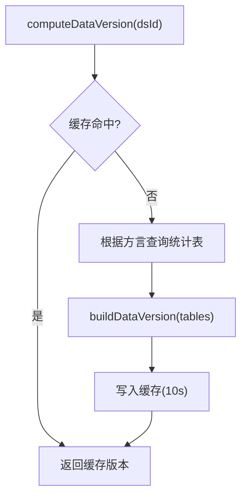

图表来源
- [server/dataVersion.ts:56-98](file://server/dataVersion.ts#L56-L98)
- [server/dataVersion.ts:36-44](file://server/dataVersion.ts#L36-L44)

章节来源
- [server/dataVersion.ts:1-104](file://server/dataVersion.ts#L1-L104)
- [server/routes/metrics.ts:263-287](file://server/routes/metrics.ts#L263-L287)

### 事件驱动的状态更新模式
- 发布订阅模型
  - 采用“写路径显式失效”的事件驱动模式：数据源写操作后调用 invalidate* 系列函数，广播清理对应前缀缓存
  - 无外部消息队列，依赖 StateStore 的原子操作与 TTL 实现最终一致性
- 消息队列使用
  - 长任务通过 MySQL 任务表 + worker 轮询实现“类队列”的解耦执行
  - 心跳与孤儿回收确保任务最终完成或明确失败
- 最终一致性保证
  - 缓存 TTL + 写后失效 + 读时重建，保证最终一致
  - 任务失败重试上限，避免无限循环

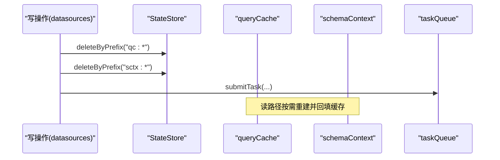

图表来源
- [server/routes/datasources.ts:13-16](file://server/routes/datasources.ts#L13-L16)
- [server/infra/taskQueue.ts:119-138](file://server/infra/taskQueue.ts#L119-L138)

章节来源
- [server/routes/datasources.ts:1-200](file://server/routes/datasources.ts#L1-L200)
- [server/infra/taskQueue.ts:1-347](file://server/infra/taskQueue.ts#L1-L347)

### 缓存失效策略（TTL、主动失效、被动清理）
- TTL 设置
  - 查询缓存默认 30 分钟，可通过环境变量覆盖；Schema 上下文 5 分钟
  - 语义索引与查询缓存共用 TTL，保证一致性
- 主动失效
  - 数据源写操作后调用 invalidateQueryCache/invalidateSchemaCache，按前缀删除
- 被动清理
  - 内存模式：Map 中按 TTL 判断过期删除；语义索引定期清理过期项
  - Redis 模式：TTL 自动过期；deleteByPrefix 使用 SCAN 分批删除

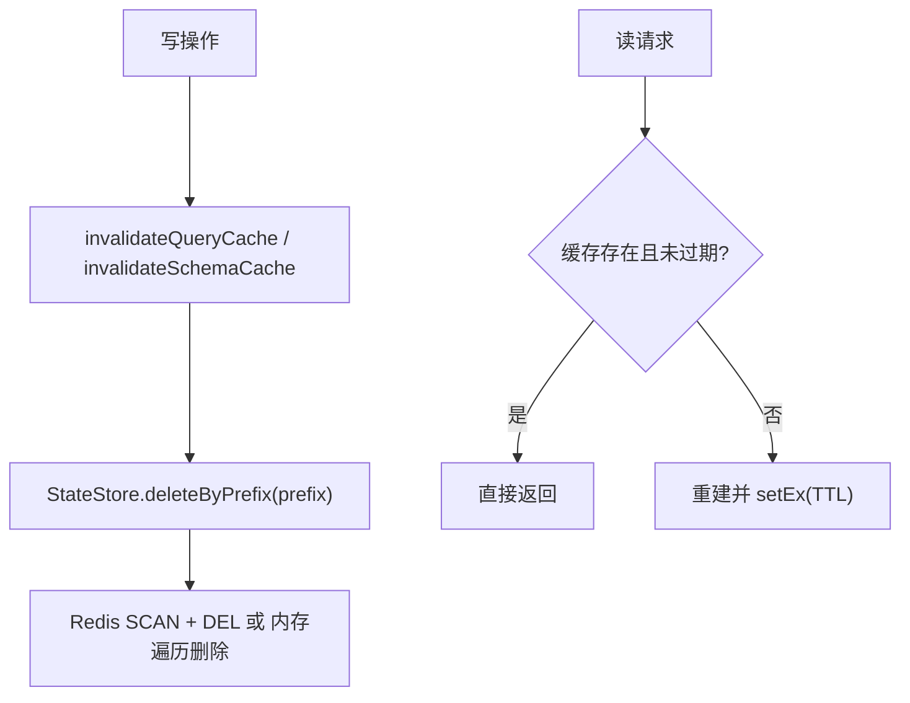

图表来源
- [server/query/queryCache.ts:92-114](file://server/query/queryCache.ts#L92-L114)
- [server/query/schemaContext.ts:50-55](file://server/query/schemaContext.ts#L50-L55)
- [server/infra/stateStore.ts:129-138](file://server/infra/stateStore.ts#L129-L138)

章节来源
- [server/query/queryCache.ts:1-254](file://server/query/queryCache.ts#L1-L254)
- [server/query/schemaContext.ts:1-172](file://server/query/schemaContext.ts#L1-L172)
- [server/infra/stateStore.ts:1-219](file://server/infra/stateStore.ts#L1-L219)

### 状态监控与健康检查
- 监控埋点
  - 缓存命中（L1/L2）、HTTP 耗时、SQL 执行耗时、LLM 调用耗时与 token 消耗等
  - 所有埋点 fail-open，不影响业务
- 健康检查
  - StateStore 预热 warmStateStore，避免冷启动窗口
  - 任务队列心跳与孤儿回收，保障长任务可靠性
- 自动恢复
  - 任务心跳超时回 PENDING 重跑（次数受限），否则标 FAILED
  - 限流器在 Redis 模式下多实例共享计数，异常时 fail-closed 拒绝

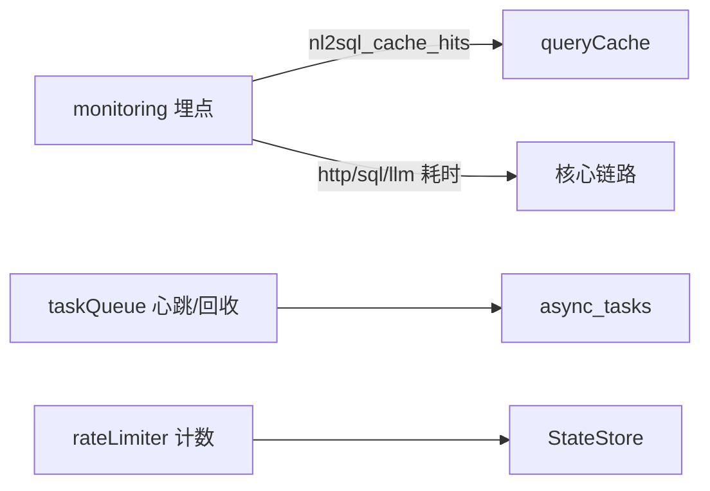

图表来源
- [server/infra/monitoring.ts:37-88](file://server/infra/monitoring.ts#L37-L88)
- [server/infra/taskQueue.ts:177-227](file://server/infra/taskQueue.ts#L177-L227)
- [server/infra/rateLimiter.ts:14-42](file://server/infra/rateLimiter.ts#L14-L42)

章节来源
- [server/infra/monitoring.ts:1-153](file://server/infra/monitoring.ts#L1-L153)
- [server/infra/taskQueue.ts:1-347](file://server/infra/taskQueue.ts#L1-L347)
- [server/infra/rateLimiter.ts:1-54](file://server/infra/rateLimiter.ts#L1-L54)

## 依赖关系分析
- 耦合与内聚
  - StateStore 作为基础设施被多个模块复用，提升内聚、降低耦合
  - datasources 路由集中触发缓存失效，职责清晰
- 直接/间接依赖
  - queryCache 依赖 StateStore 与 llmClient（embedding）
  - schemaContext 依赖 StateStore、scope、queryGuard、db
  - taskQueue 依赖 db、logger
  - monitoring 独立于业务，旁路埋点
- 外部依赖
  - Redis（可选）、MySQL（必需）、Prometheus（可选）

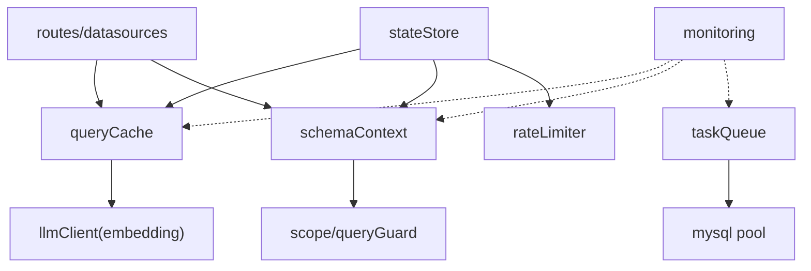

图表来源
- [server/infra/stateStore.ts:165-219](file://server/infra/stateStore.ts#L165-L219)
- [server/query/queryCache.ts:8-10](file://server/query/queryCache.ts#L8-L10)
- [server/query/schemaContext.ts:8-16](file://server/query/schemaContext.ts#L8-L16)
- [server/infra/taskQueue.ts:16-19](file://server/infra/taskQueue.ts#L16-L19)
- [server/infra/monitoring.ts:1-10](file://server/infra/monitoring.ts#L1-L10)

章节来源
- [server/infra/stateStore.ts:1-219](file://server/infra/stateStore.ts#L1-L219)
- [server/query/queryCache.ts:1-254](file://server/query/queryCache.ts#L1-L254)
- [server/query/schemaContext.ts:1-172](file://server/query/schemaContext.ts#L1-L172)
- [server/infra/taskQueue.ts:1-347](file://server/infra/taskQueue.ts#L1-L347)
- [server/infra/monitoring.ts:1-153](file://server/infra/monitoring.ts#L1-L153)

## 性能考量
- 缓存命中率优化
  - L1 精确命中 + L2 语义命中，减少昂贵 LLM 链路
  - 合理 TTL 与载荷上限，避免无效缓存占用
- 存储访问优化
  - Redis 模式使用 SCAN 批量删除，避免阻塞
  - 任务队列 SKIP LOCKED 领取，减少锁竞争
- 资源隔离
  - 任务 worker 并发上限与用户排队上限，避免与交互链路争抢
- 监控与观测
  - 关键路径埋点，便于定位瓶颈与异常

[本节为通用性能建议，无需特定文件引用]

## 故障排查指南
- 缓存未命中或不同步
  - 检查数据源写操作是否调用 invalidate* 系列失效
  - 确认 StateStore 是否启用 Redis 及连接是否正常（warmStateStore）
- 任务长时间 RUNNING
  - 检查心跳是否更新；查看孤儿回收逻辑是否生效
  - 关注任务执行超时与重试上限
- 限流误拒
  - Redis 模式下限流计数异常会 fail-closed；检查 StateStore 可用性
- 监控缺失
  - 确认 /metrics 端点可访问；埋点函数均为 fail-open，不影响业务

章节来源
- [server/infra/stateStore.ts:194-219](file://server/infra/stateStore.ts#L194-L219)
- [server/infra/taskQueue.ts:202-227](file://server/infra/taskQueue.ts#L202-L227)
- [server/infra/rateLimiter.ts:18-30](file://server/infra/rateLimiter.ts#L18-L30)
- [server/infra/monitoring.ts:135-153](file://server/infra/monitoring.ts#L135-L153)

## 结论
本系统以 StateStore 为核心，结合 TTL、前缀失效与写后失效，实现了查询缓存、Schema 元数据与知识库索引的跨实例一致性；通过任务队列与心跳机制保障长任务的最终一致性与可恢复性；借助监控埋点与健康检查，提供延迟监控、异常告警与自动恢复能力。整体方案在可扩展性、鲁棒性与可观测性方面达到生产可用标准。

[本节为总结性内容，无需特定文件引用]

## 附录
- 关键环境变量参考
  - REDIS_URL：启用 Redis 模式
  - QUERY_CACHE_TTL_MINUTES：查询缓存 TTL（分钟）
  - SEMANTIC_CACHE_THRESHOLD：语义缓存相似度阈值
  - KNOWLEDGE_MIN_SCORE：知识库向量检索最低相关度
  - TASK_WORKER_CONCURRENCY/TASK_QUEUE_USER_MAX/TASK_HEARTBEAT_TIMEOUT_MS/TASK_EXEC_TIMEOUT_MS：任务队列参数
  - RATE_LIMIT_MAX：每分钟请求上限
  - METRICS_TOKEN：/metrics 访问令牌

[本节为配置说明，无需特定文件引用]