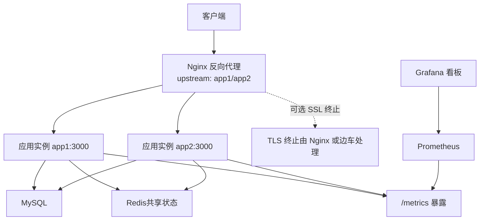
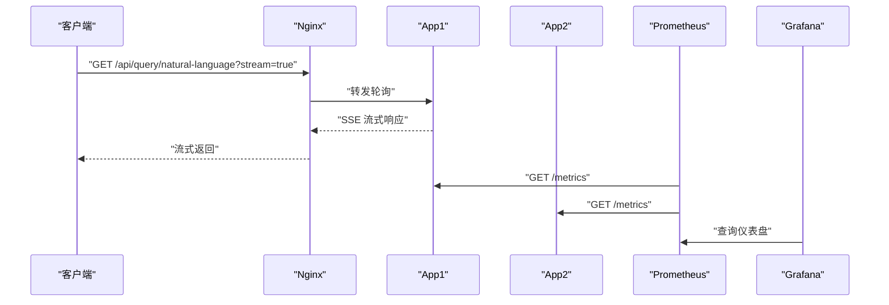
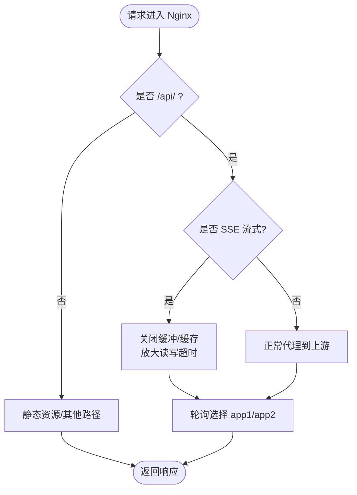
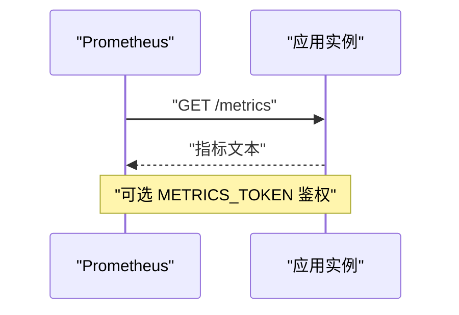
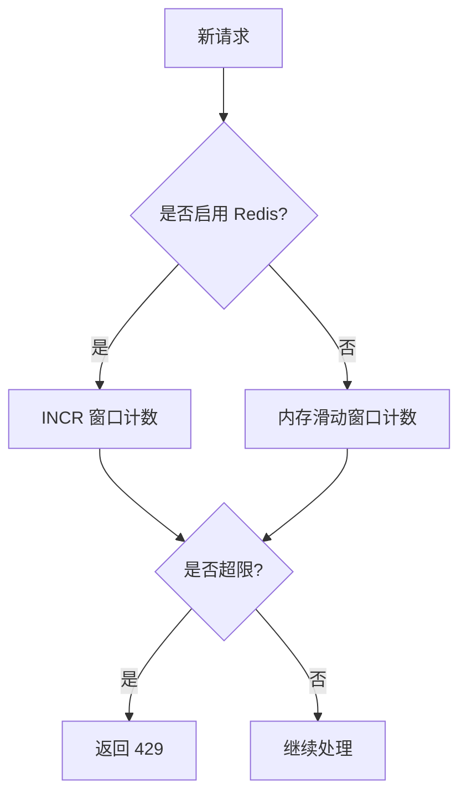
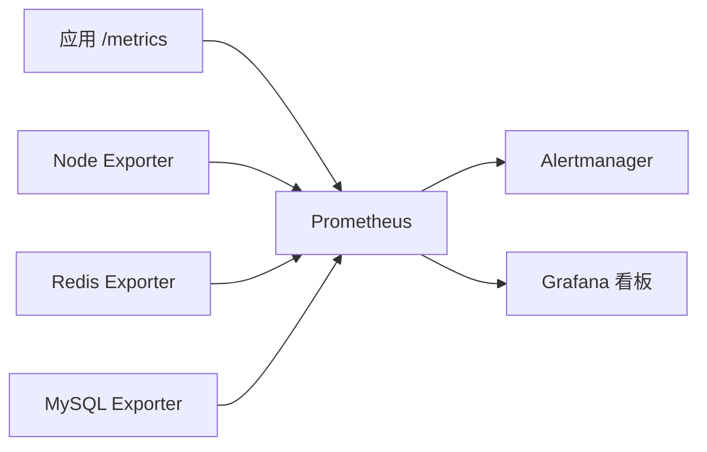
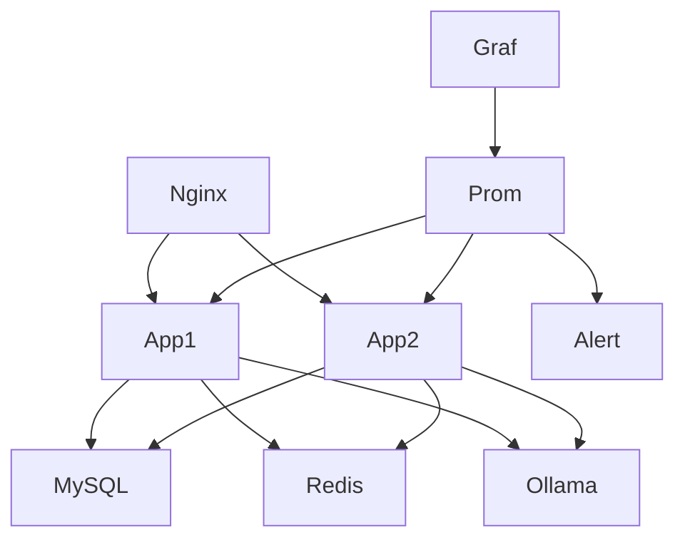

# 负载均衡配置

<cite>
**本文引用的文件**
- [deploy/nginx.multi-instance.conf](file://deploy/nginx.multi-instance.conf)
- [docker-compose.multi-instance.yml](file://docker-compose.multi-instance.yml)
- [server.ts](file://server.ts)
- [server/infra/rateLimiter.ts](file://server/infra/rateLimiter.ts)
- [server/infra/monitoring.ts](file://server/infra/monitoring.ts)
- [deploy/prometheus.yml](file://deploy/prometheus.yml)
- [deploy/alertmanager.yml](file://deploy/alertmanager.yml)
- [deploy/grafana/dashboards/nl2sql-overview.json](file://deploy/grafana/dashboards/nl2sql-overview.json)
</cite>

## 目录
1. [简介](#简介)
2. [项目结构](#项目结构)
3. [核心组件](#核心组件)
4. [架构总览](#架构总览)
5. [详细组件分析](#详细组件分析)
6. [依赖关系分析](#依赖关系分析)
7. [性能考虑](#性能考虑)
8. [故障排查指南](#故障排查指南)
9. [结论](#结论)
10. [附录](#附录)

## 简介
本文件面向智能问数据分析系统的生产部署，聚焦 Nginx 反向代理的负载均衡与高可用策略，覆盖轮询算法、健康检查与故障转移、上游节点管理（动态增删、权重、连接池）、SSL 终止、静态资源缓存、请求限流、性能调优参数以及监控指标与日志分析。系统采用无状态应用多实例部署，Nginx 作为统一入口进行流量分发；应用侧提供 /metrics 暴露 Prometheus 指标，配合 Prometheus/Alertmanager/Grafana 实现可观测性闭环。

## 项目结构
- Nginx 多实例负载均衡示例位于 deploy/nginx.multi-instance.conf，定义 upstream 与 location 转发规则，针对 SSE 长连接关闭缓冲并放大超时。
- docker-compose.multi-instance.yml 编排两个无状态应用副本与 Redis 共享状态，并通过 Nginx 对外暴露 8080 端口。
- server.ts 启动 Express 服务，注册 /api/* 路由、/metrics 端点与安全头，支持生产环境安全加固与中间件埋点。
- server/infra/rateLimiter.ts 提供按 IP 的滑动窗口/固定分钟窗口限流，Redis 模式支持多实例共享计数。
- server/infra/monitoring.ts 暴露 Prometheus 指标采集器与 /metrics 处理器。
- deploy/prometheus.yml 配置抓取目标（应用、Node Exporter、Redis、MySQL、Alertmanager）。
- deploy/alertmanager.yml 配置告警路由与抑制规则。
- deploy/grafana/dashboards/nl2sql-overview.json 提供北极星看板（成功率、缓存命中率、P95 时延、速率等）。

图表来源
- [deploy/nginx.multi-instance.conf:1-35](file://deploy/nginx.multi-instance.conf#L1-L35)
- [docker-compose.multi-instance.yml:1-50](file://docker-compose.multi-instance.yml#L1-L50)
- [server.ts:187-193](file://server.ts#L187-L193)
- [deploy/prometheus.yml:16-57](file://deploy/prometheus.yml#L16-L57)

章节来源
- [deploy/nginx.multi-instance.conf:1-35](file://deploy/nginx.multi-instance.conf#L1-L35)
- [docker-compose.multi-instance.yml:1-50](file://docker-compose.multi-instance.yml#L1-L50)
- [server.ts:187-193](file://server.ts#L187-L193)

## 核心组件
- Nginx 负载均衡：默认轮询（round-robin），通过 upstream 管理多个应用实例；SSE 路径关闭响应缓冲与缓存，放大读/写超时以支撑长连接。
- 健康检查与故障转移：Nginx 使用 max_fails 与 fail_timeout 对上游节点进行失败次数与恢复时间控制；应用侧提供 /api/health 供外部探针使用。
- 上游服务器管理：通过编辑 upstream 块动态添加/移除节点；可按需设置 weight 分配权重；保持 HTTP/1.1 以启用 keepalive 连接复用。
- 请求限流：应用层 rateLimiter 支持内存与 Redis 两种模式，Redis 模式下多实例共享计数，避免单实例限流失效。
- 监控指标：应用侧 prom-client 暴露 /metrics；Prometheus 定期抓取；Grafana 展示关键指标。
- 日志与审计：Express 中间件记录请求耗时与路由信息；审计落库用于事后分析与合规。

章节来源
- [deploy/nginx.multi-instance.conf:1-35](file://deploy/nginx.multi-instance.conf#L1-L35)
- [server/infra/rateLimiter.ts:1-54](file://server/infra/rateLimiter.ts#L1-L54)
- [server/infra/monitoring.ts:1-153](file://server/infra/monitoring.ts#L1-L153)
- [server.ts:187-193](file://server.ts#L187-L193)

## 架构总览
Nginx 作为统一入口，将 /api/* 请求转发至 upstream smart_analytics_app（app1/app2）。SSE 长连接路径关闭缓冲并放大超时，确保流式响应不被截断。应用侧在启动时初始化数据库与任务队列，注册 /metrics 端点，供 Prometheus 抓取。Grafana 基于 Prometheus 数据源展示业务北极星指标。

图表来源
- [deploy/nginx.multi-instance.conf:12-25](file://deploy/nginx.multi-instance.conf#L12-L25)
- [server.ts:187-193](file://server.ts#L187-L193)
- [deploy/prometheus.yml:16-57](file://deploy/prometheus.yml#L16-L57)

## 详细组件分析

### Nginx 反向代理与负载均衡
- 负载均衡策略：默认 round-robin（轮询），适用于无状态应用；如需粘性会话可使用 ip_hash，但本系统为无状态，无需粘性。
- 健康检查与故障转移：通过 max_fails=3 与 fail_timeout=15s 控制失败判定与恢复间隔；当连续失败达到阈值，节点被暂时摘除，超时后重新探测。
- 上游节点管理：
  - 动态添加/移除：修改 upstream 块中的 server 行即可增减节点；重启 Nginx 生效。
  - 权重分配：可为 server 指定 weight=N，使流量按权重比例分发。
  - 连接池：启用 proxy_http_version 1.1 并使用 keepalive 减少握手开销（可在 Nginx 中配置 keepalive 指令）。
- SSE 长连接优化：
  - 关闭响应缓冲与缓存：proxy_buffering off; proxy_cache off;
  - 放大超时：proxy_read_timeout 与 proxy_send_timeout 设置为足够大以覆盖深度分析链路。
- 静态资源缓存策略：
  - 前端静态资源建议由 Nginx 直接托管并开启浏览器缓存（Cache-Control/ETag），API 路径不缓存。
  - 若通过 Nginx 代理静态资源，可对特定 location 启用 proxy_cache 与 expires。

图表来源
- [deploy/nginx.multi-instance.conf:12-33](file://deploy/nginx.multi-instance.conf#L12-L33)

章节来源
- [deploy/nginx.multi-instance.conf:1-35](file://deploy/nginx.multi-instance.conf#L1-L35)

### 应用侧健康检查与可观测性
- 健康检查端点：/api/health 返回 ok 与时间戳，可用于 Nginx 或外部探针的健康探测。
- 指标暴露：/metrics 暴露 Prometheus 格式指标，包含 HTTP 接口耗时、LLM 调用耗时、SQL 执行耗时、缓存命中等。
- 指标保护：可通过 METRICS_TOKEN 环境变量启用 Bearer Token 校验，防止未授权抓取。

图表来源
- [server.ts:187-193](file://server.ts#L187-L193)
- [server/infra/monitoring.ts:135-153](file://server/infra/monitoring.ts#L135-L153)

章节来源
- [server.ts:187-193](file://server.ts#L187-L193)
- [server/infra/monitoring.ts:1-153](file://server/infra/monitoring.ts#L1-L153)

### 请求限流与并发控制
- 限流策略：按 IP 计数，支持内存滑动窗口与 Redis 固定分钟窗口；Redis 模式在多实例下共享计数，避免限流绕过。
- 限流阈值：RATE_LIMIT_MAX 环境变量控制每分钟最大请求数；超过阈值返回 429。
- 降级策略：Redis 不可用时，内存模式仍可提供基础限流；限流异常时 fail-closed 拒绝请求，保障后端稳定。

图表来源
- [server/infra/rateLimiter.ts:1-54](file://server/infra/rateLimiter.ts#L1-L54)

章节来源
- [server/infra/rateLimiter.ts:1-54](file://server/infra/rateLimiter.ts#L1-L54)

### 监控指标与告警
- 抓取配置：Prometheus 抓取应用 /metrics、Node Exporter、Redis Exporter、MySQL Exporter、Alertmanager。
- 告警规则：Alertmanager 接收告警并路由到 Webhook；抑制下游业务告警当应用宕机，避免风暴。
- 看板面板：Grafana 仪表盘展示成功率、缓存命中率、P95 时延、请求速率、LLM 与 SQL 时延对比等。

图表来源
- [deploy/prometheus.yml:16-57](file://deploy/prometheus.yml#L16-L57)
- [deploy/alertmanager.yml:16-43](file://deploy/alertmanager.yml#L16-L43)
- [deploy/grafana/dashboards/nl2sql-overview.json:1-192](file://deploy/grafana/dashboards/nl2sql-overview.json#L1-L192)

章节来源
- [deploy/prometheus.yml:1-57](file://deploy/prometheus.yml#L1-L57)
- [deploy/alertmanager.yml:1-43](file://deploy/alertmanager.yml#L1-L43)
- [deploy/grafana/dashboards/nl2sql-overview.json:1-192](file://deploy/grafana/dashboards/nl2sql-overview.json#L1-L192)

## 依赖关系分析
- Nginx 依赖 upstream 中的应用实例；应用实例依赖 MySQL、Redis、Ollama（LLM 后端）。
- Prometheus 依赖各 Exporter 与应用 /metrics；Alertmanager 依赖 Prometheus 告警；Grafana 依赖 Prometheus 数据源。
- 应用内部依赖 Express 路由、中间件（鉴权、日志、限流、监控）、任务队列、知识库与权限模块。

图表来源
- [docker-compose.multi-instance.yml:14-49](file://docker-compose.multi-instance.yml#L14-L49)
- [deploy/prometheus.yml:16-57](file://deploy/prometheus.yml#L16-L57)

章节来源
- [docker-compose.multi-instance.yml:14-49](file://docker-compose.multi-instance.yml#L14-L49)
- [deploy/prometheus.yml:16-57](file://deploy/prometheus.yml#L16-L57)

## 性能考虑
- Nginx 性能调优：
  - worker_processes：根据 CPU 核数设置，通常 auto 或等于核数。
  - worker_connections：根据预期并发连接数调整，结合 ulimit 限制。
  - keepalive：启用 HTTP/1.1 keepalive 以减少握手开销。
  - 缓冲区：SSE 路径关闭缓冲；静态资源可适当增大 proxy_buffer_size。
  - 超时：SSE 路径放大 read/send 超时；常规 API 设置合理的 proxy_connect_timeout、proxy_send_timeout、proxy_read_timeout。
- 应用性能调优：
  - 数据库连接池：根据 EXPECTED_CONCURRENT_USERS 计算 APP_POOL_MAX，clamp 到合理范围。
  - 请求体大小：不同路由按需放宽 JSON 解析限制（如报告导出、知识库导入）。
  - 安全头：生产环境启用 HSTS、CSP 等安全头。
  - 指标粒度：仅对 /api/* 打点，避免高基数 label 导致性能问题。
- 缓存策略：
  - 浏览器缓存：静态资源设置 Cache-Control/ETag。
  - 应用缓存：Redis 作为共享状态存储，提升跨实例一致性。
- 限流与背压：
  - RATE_LIMIT_MAX 控制入口流量；Redis 模式保证多实例一致限流。
  - 任务队列异步化长任务，避免阻塞请求链路。

章节来源
- [server/infra/db.ts:29-43](file://server/infra/db.ts#L29-L43)
- [server.ts:133-143](file://server.ts#L133-L143)
- [server.ts:145-167](file://server.ts#L145-L167)
- [server/infra/rateLimiter.ts:1-54](file://server/infra/rateLimiter.ts#L1-L54)

## 故障排查指南
- Nginx 上游不可用：
  - 检查 max_fails 与 fail_timeout 配置，确认节点是否被摘除。
  - 查看 Nginx error.log 与 access.log，定位 5xx 错误与超时。
- SSE 长连接中断：
  - 确认 proxy_buffering off 与 proxy_read_timeout/proxy_send_timeout 设置足够大。
  - 检查客户端与服务端网络超时与防火墙策略。
- 限流误杀：
  - 检查 RATE_LIMIT_MAX 与环境变量；Redis 模式下确认连接与键空间。
  - 内存模式下清理过期条目，避免内存泄漏。
- 指标缺失：
  - 确认 /metrics 端点可达且未被 JWT 拦截；必要时启用 METRICS_TOKEN。
  - 检查 Prometheus 抓取配置与目标可达性。
- 告警风暴：
  - 利用 Alertmanager 抑制规则，应用宕机时抑制下游业务告警。

章节来源
- [deploy/nginx.multi-instance.conf:12-25](file://deploy/nginx.multi-instance.conf#L12-L25)
- [server/infra/rateLimiter.ts:18-41](file://server/infra/rateLimiter.ts#L18-L41)
- [server/infra/monitoring.ts:135-153](file://server/infra/monitoring.ts#L135-L153)
- [deploy/alertmanager.yml:38-43](file://deploy/alertmanager.yml#L38-L43)

## 结论
本系统通过 Nginx 轮询负载均衡与上游健康检查实现高可用；应用侧提供 /metrics 与限流能力，配合 Prometheus/Alertmanager/Grafana 形成完整可观测性闭环。生产部署建议：
- 明确 upstream 节点与权重，启用 keepalive 与合适的超时。
- 对 SSE 路径关闭缓冲并放大超时，确保流式响应稳定。
- 使用 Redis 模式限流，保证多实例一致性。
- 启用安全头与指标保护，避免泄露与滥用。
- 持续监控成功率、缓存命中率、P95 时延与请求速率，及时调整容量与参数。

## 附录
- 环境变量参考：
  - PORT/HOST：应用监听地址与端口。
  - JWT_SECRET：生产环境必须设置。
  - MYSQL_HOST/PORT/USER/PASSWORD/DATABASE：数据库连接。
  - REDIS_URL：共享状态存储。
  - RATE_LIMIT_MAX：每分钟最大请求数。
  - METRICS_TOKEN：指标端点访问令牌。
  - EXPECTED_CONCURRENT_USERS/APP_POOL_MAX：数据库连接池容量推导与上限。
- 部署命令：
  - docker compose -f docker-compose.multi-instance.yml up -d --build
  - 访问 http://localhost:8080（Nginx 轮询分发到 app1/app2）

章节来源
- [docker-compose.multi-instance.yml:1-50](file://docker-compose.multi-instance.yml#L1-L50)
- [server.ts:82-96](file://server.ts#L82-L96)
- [server/infra/db.ts:29-43](file://server/infra/db.ts#L29-L43)
- [server/infra/rateLimiter.ts:9-12](file://server/infra/rateLimiter.ts#L9-L12)
- [server/infra/monitoring.ts:135-153](file://server/infra/monitoring.ts#L135-L153)