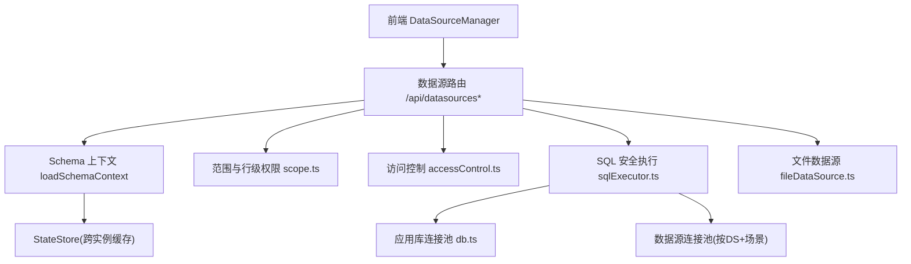
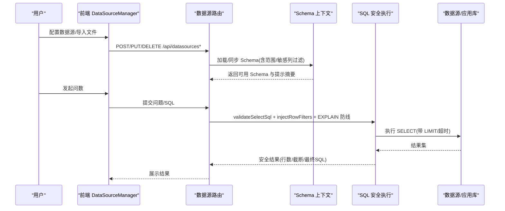
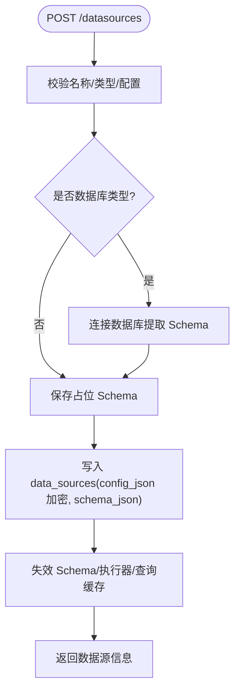
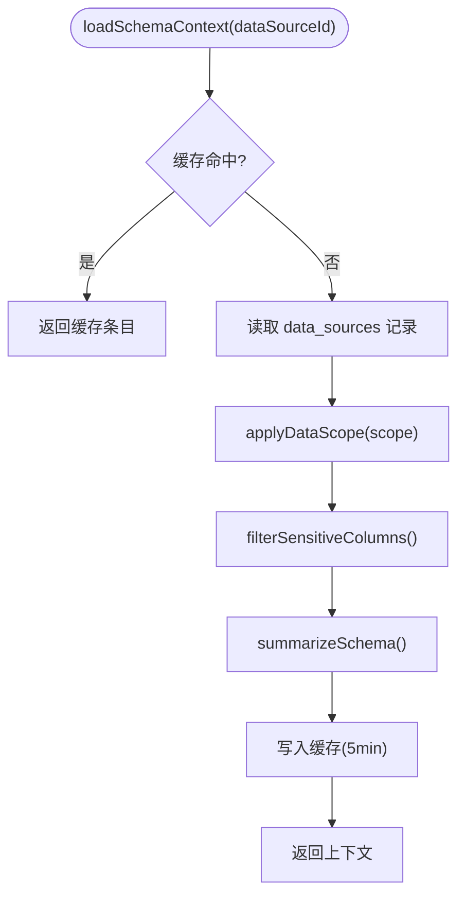
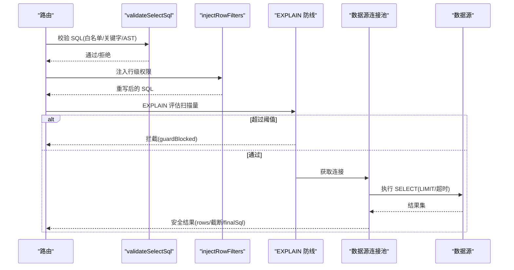
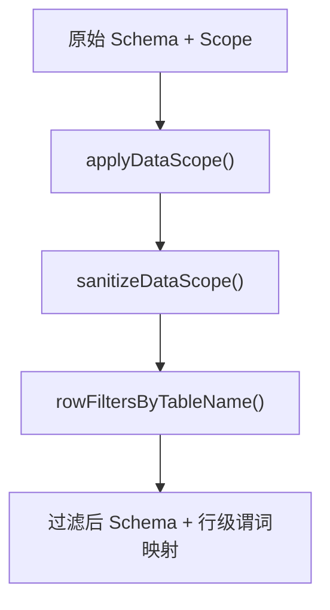
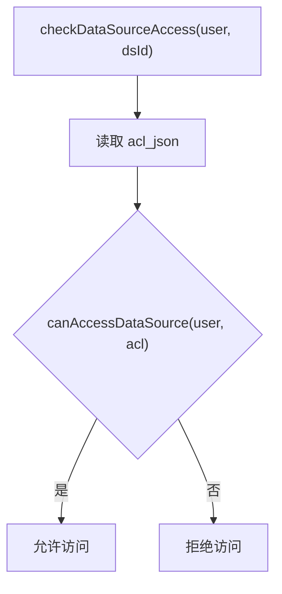
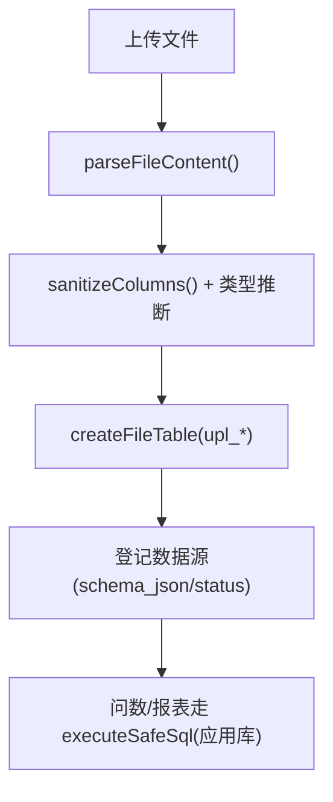
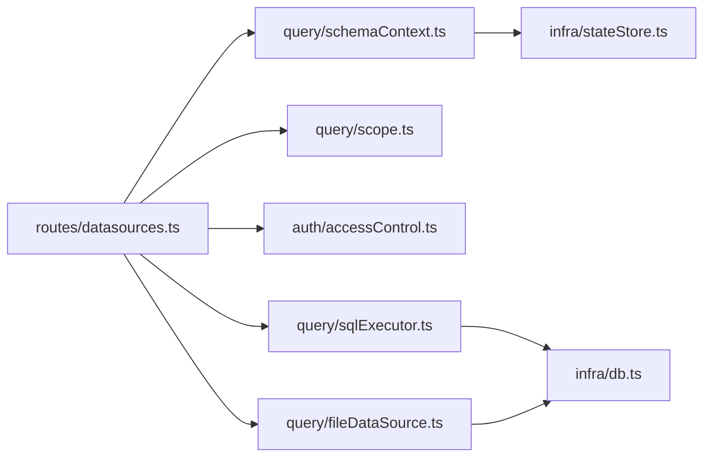

# 数据源配置与问数质量保障指导手册

<cite>
**本文引用的文件**   
- [server/routes/datasources.ts](file://server/routes/datasources.ts)
- [server/query/sqlExecutor.ts](file://server/query/sqlExecutor.ts)
- [server/query/schemaContext.ts](file://server/query/schemaContext.ts)
- [server/query/scope.ts](file://server/query/scope.ts)
- [server/auth/accessControl.ts](file://server/auth/accessControl.ts)
- [server/query/fileDataSource.ts](file://server/query/fileDataSource.ts)
- [server/infra/db.ts](file://server/infra/db.ts)
- [src/components/datasource/DataSourceManager.tsx](file://src/components/datasource/DataSourceManager.tsx)
- [scripts/init-data-resource.ts](file://scripts/init-data-resource.ts)
</cite>

## 目录
1. [引言](#引言)
2. [项目结构](#项目结构)
3. [核心组件](#核心组件)
4. [架构总览](#架构总览)
5. [关键组件详解](#关键组件详解)
6. [依赖关系分析](#依赖关系分析)
7. [性能与容量规划](#性能与容量规划)
8. [故障排查指南](#故障排查指南)
9. [结论](#结论)
10. [附录：最佳实践清单](#附录最佳实践清单)

## 引言
本手册面向“智能问数据分析系统”的数据源接入与问数质量保障，聚焦以下目标：
- 如何安全、可靠地接入 MySQL/PostgreSQL/Greenplum 及文件型数据源（CSV/Excel/JSON）
- 如何通过 Schema 管理、范围限定、访问控制、SQL 安全执行与 EXPLAIN 防线，保障问数结果正确性与系统稳定性
- 如何在前端完成数据源配置、Schema 同步、指标维度维护、问数范围与 ACL 授权
- 如何在多实例部署下保证缓存一致性与连接池隔离

## 项目结构
围绕数据源与问数质量的关键代码分布在服务端路由、查询执行层、上下文装配、权限与范围控制、文件数据源处理以及前端管理界面中。整体分层如下：
- 路由层：数据源 CRUD、Schema 同步、文件导入、ACL/Scope 管理
- 上下文层：加载并缓存 Schema，应用范围过滤与敏感列过滤，生成 LLM 提示摘要
- 执行层：SQL 安全校验、AST 复核、行级权限注入、EXPLAIN 防线、连接池分级与超时控制
- 权限与范围：ACL 部门/用户授权；DataScope 表/列/行级限制
- 文件数据源：上传解析、类型推断、物理表落库、安全约束
- 基础设施：应用库初始化、连接池、加密解密、状态存储（Redis/内存）
- 前端：数据源管理、Schema 查看、范围与 ACL 配置、文件导入

图表来源
- [server/routes/datasources.ts:364-752](file://server/routes/datasources.ts#L364-L752)
- [server/query/schemaContext.ts:108-171](file://server/query/schemaContext.ts#L108-L171)
- [server/query/sqlExecutor.ts:734-832](file://server/query/sqlExecutor.ts#L734-L832)
- [server/query/scope.ts:28-100](file://server/query/scope.ts#L28-L100)
- [server/auth/accessControl.ts:43-73](file://server/auth/accessControl.ts#L43-L73)
- [server/query/fileDataSource.ts:138-208](file://server/query/fileDataSource.ts#L138-L208)
- [server/infra/db.ts:64-83](file://server/infra/db.ts#L64-L83)

章节来源
- [server/routes/datasources.ts:1-800](file://server/routes/datasources.ts#L1-L800)
- [server/query/sqlExecutor.ts:1-832](file://server/query/sqlExecutor.ts#L1-L832)
- [server/query/schemaContext.ts:1-172](file://server/query/schemaContext.ts#L1-L172)
- [server/query/scope.ts:1-101](file://server/query/scope.ts#L1-L101)
- [server/auth/accessControl.ts:1-108](file://server/auth/accessControl.ts#L1-L108)
- [server/query/fileDataSource.ts:1-208](file://server/query/fileDataSource.ts#L1-L208)
- [server/infra/db.ts:1-800](file://server/infra/db.ts#L1-L800)
- [src/components/datasource/DataSourceManager.tsx:1-800](file://src/components/datasource/DataSourceManager.tsx#L1-L800)

## 核心组件
- 数据源路由：提供数据源列表、创建、更新、删除、Schema 同步、文件导入、Flex Schema 读取等接口，负责鉴权、参数清洗、错误处理与缓存失效
- Schema 上下文：从数据库加载 Schema，应用 DataScope 与敏感列过滤，生成 LLM 提示摘要，并缓存 5 分钟；支持跨实例失效
- SQL 安全执行：对 LLM 生成的 SQL 进行白名单、关键字、AST 复核、行级权限注入、EXPLAIN 防线、LIMIT 强制、超时与结果截断
- 范围与权限：DataScope 限定可问数的表/列/行级谓词；ACL 限定部门/用户可访问数据源
- 文件数据源：上传 CSV/Excel/JSON，解析并落应用库物理表 upl_*，自动识别列类型与安全化列名
- 基础设施：应用库连接池、加密解密、状态存储、审计与追踪表

章节来源
- [server/routes/datasources.ts:364-800](file://server/routes/datasources.ts#L364-L800)
- [server/query/schemaContext.ts:108-171](file://server/query/schemaContext.ts#L108-L171)
- [server/query/sqlExecutor.ts:291-832](file://server/query/sqlExecutor.ts#L291-L832)
- [server/query/scope.ts:28-100](file://server/query/scope.ts#L28-L100)
- [server/auth/accessControl.ts:43-108](file://server/auth/accessControl.ts#L43-L108)
- [server/query/fileDataSource.ts:73-208](file://server/query/fileDataSource.ts#L73-L208)
- [server/infra/db.ts:64-83](file://server/infra/db.ts#L64-L83)

## 架构总览
下图展示了从前端到后端的核心链路：管理员在前端配置数据源，后端提取或登记 Schema，问数时通过上下文装配、范围与权限校验，最终由安全执行层执行 SQL 并返回结果。

图表来源
- [src/components/datasource/DataSourceManager.tsx:116-250](file://src/components/datasource/DataSourceManager.tsx#L116-L250)
- [server/routes/datasources.ts:364-752](file://server/routes/datasources.ts#L364-L752)
- [server/query/schemaContext.ts:108-171](file://server/query/schemaContext.ts#L108-L171)
- [server/query/sqlExecutor.ts:734-832](file://server/query/sqlExecutor.ts#L734-L832)

## 关键组件详解

### 数据源路由（CRUD、Schema 同步、文件导入）
- 支持类型：mysql/postgresql/greenplum/csv/json/api/demo/excel
- 真实 Schema 提取：MySQL 走 information_schema；PG/Greenplum 走 pg_catalog/pg_description/information_schema
- 自动推导列角色：根据类型、长度、主键等推导 isMetric/isDimension
- 文件导入：CSV/Excel/JSON → 解析 → 类型推断 → 落应用库 upl_* 物理表 → 登记为数据源
- 缓存失效：Schema/执行器/查询缓存变更时主动失效
- 访问控制：非 ADMIN 列表剥离 tables，仅下发 tableCount；flex-schema 需 ACL 校验

图表来源
- [server/routes/datasources.ts:442-482](file://server/routes/datasources.ts#L442-L482)
- [server/routes/datasources.ts:588-656](file://server/routes/datasources.ts#L588-L656)
- [server/routes/datasources.ts:484-586](file://server/routes/datasources.ts#L484-L586)

章节来源
- [server/routes/datasources.ts:61-135](file://server/routes/datasources.ts#L61-L135)
- [server/routes/datasources.ts:223-347](file://server/routes/datasources.ts#L223-L347)
- [server/routes/datasources.ts:364-752](file://server/routes/datasources.ts#L364-L752)

### Schema 上下文装配与缓存
- 加载顺序：读缓存 → 查库 → 应用 DataScope → 敏感列过滤 → 生成提示摘要 → 写缓存（5 分钟）
- 文件数据源判定：若 type 为 csv/json/excel 且 config 含 physicalTable，则视为 live capable
- 跨实例一致性：基于 StateStore 的 deleteByPrefix 广播失效

图表来源
- [server/query/schemaContext.ts:108-171](file://server/query/schemaContext.ts#L108-L171)
- [server/query/scope.ts:28-43](file://server/query/scope.ts#L28-L43)

章节来源
- [server/query/schemaContext.ts:1-172](file://server/query/schemaContext.ts#L1-172)
- [server/query/scope.ts:1-101](file://server/query/scope.ts#L1-101)

### SQL 安全执行与 EXPLAIN 防线
- 安全校验：只允许 SELECT；单语句；禁止危险关键字；表名白名单；AST 二道防线
- 行级权限：AST 注入 WHERE 谓词，覆盖 CTE/子查询/UNION
- 执行保护：MAX_ROWS 截断；MySQL MAX_EXECUTION_TIME hint；PG statement_timeout
- EXPLAIN 防线：预估扫描超阈值拦截（interactive/export/chain 不同阈值）
- 连接池：按 dataSourceId+场景 分级，支持动态失效

图表来源
- [server/query/sqlExecutor.ts:291-387](file://server/query/sqlExecutor.ts#L291-L387)
- [server/query/sqlExecutor.ts:396-489](file://server/query/sqlExecutor.ts#L396-L489)
- [server/query/sqlExecutor.ts:629-662](file://server/query/sqlExecutor.ts#L629-L662)
- [server/query/sqlExecutor.ts:686-726](file://server/query/sqlExecutor.ts#L686-L726)

章节来源
- [server/query/sqlExecutor.ts:1-832](file://server/query/sqlExecutor.ts#L1-L832)

### 问数范围与行级权限
- DataScope：tables/columns/rowFilters；为空表示不限制
- 清洗：剔除已删除的表/列；行级谓词防注入（禁分号/注释/子查询/SELECT/INTO）
- 映射：tableId → 实际表名，供 AST 注入使用

图表来源
- [server/query/scope.ts:28-100](file://server/query/scope.ts#L28-L100)

章节来源
- [server/query/scope.ts:1-101](file://server/query/scope.ts#L1-101)

### 访问控制（ACL）
- 模型：{ departments[], userIds[] }；空或 null 表示不限制
- 判定：ADMIN 放行；否则匹配部门/用户
- 审批并入：批准后将 userId 加入 acl.userIds

图表来源
- [server/auth/accessControl.ts:43-73](file://server/auth/accessControl.ts#L43-L73)

章节来源
- [server/auth/accessControl.ts:1-108](file://server/auth/accessControl.ts#L1-L108)

### 文件数据源（CSV/Excel/JSON）
- 解析：CSV(papaparse)、Excel(exceljs 首工作表)、JSON(对象数组/二维数组)
- 安全：列名安全化、敏感列剔除、upl_ 前缀白名单、批量参数化写入
- 上限：行≤20000、列≤100、文件本体≤7MB；超限在响应中如实标注
- 生命周期：导入→落库→登记数据源→删除时级联 DROP 物理表

图表来源
- [server/query/fileDataSource.ts:138-208](file://server/query/fileDataSource.ts#L138-L208)
- [server/routes/datasources.ts:484-586](file://server/routes/datasources.ts#L484-L586)

章节来源
- [server/query/fileDataSource.ts:1-208](file://server/query/fileDataSource.ts#L1-L208)
- [server/routes/datasources.ts:484-586](file://server/routes/datasources.ts#L484-L586)

### 前端数据源管理
- 新增/测试/保存数据库连接（支持 PG/Greenplum schema 字段）
- 导入本地文件（CSV/Excel/JSON），显示统计与警告
- 打开问数范围编辑器、ACL 配置、Schema 元数据维护
- 触发 Schema 同步（必要时补输密码）

章节来源
- [src/components/datasource/DataSourceManager.tsx:116-492](file://src/components/datasource/DataSourceManager.tsx#L116-L492)

### 数据资源库一键初始化
- 创建数据资源库数据库与样本数据
- 注册数据源到应用库
- 导入业务知识库、技能模板、评测用例

章节来源
- [scripts/init-data-resource.ts:48-187](file://scripts/init-data-resource.ts#L48-L187)

## 依赖关系分析
- 路由依赖：auth、scope、accessControl、schemaContext、sqlExecutor、secretsCrypto、fileDataSource
- 上下文依赖：db、stateStore、scope、queryGuard、fileDataSource
- 执行层依赖：db、secretsCrypto、llmClient（可选纠偏）、monitoring、fileDataSource
- 文件数据源依赖：analysisChain、queryGuard、db
- 权限依赖：db、auth 类型定义

图表来源
- [server/routes/datasources.ts:1-28](file://server/routes/datasources.ts#L1-L28)
- [server/query/schemaContext.ts:1-16](file://server/query/schemaContext.ts#L1-L16)
- [server/query/sqlExecutor.ts:11-21](file://server/query/sqlExecutor.ts#L11-L21)
- [server/query/fileDataSource.ts:14-18](file://server/query/fileDataSource.ts#L14-L18)

章节来源
- [server/routes/datasources.ts:1-28](file://server/routes/datasources.ts#L1-L28)
- [server/query/schemaContext.ts:1-16](file://server/query/schemaContext.ts#L1-L16)
- [server/query/sqlExecutor.ts:11-21](file://server/query/sqlExecutor.ts#L11-L21)
- [server/query/fileDataSource.ts:14-18](file://server/query/fileDataSource.ts#L14-L18)

## 性能与容量规划
- 应用库连接池：appPoolMax() 默认按 EXPECTED_CONCURRENT_USERS/2 计算，上限 50
- 数据源连接池：dsPoolMax() 默认按 EXPECTED_CONCURRENT_USERS/4 计算，上限 20；可按场景拆分 DS_POOL_INTERACTIVE/CHAIN/EXPORT
- 执行超时：交互 15s、链 120s、导出 60s；可通过环境变量覆盖
- EXPLAIN 防线：默认 100 万行，导出放宽 10 倍；可通过 SQL_EXPLAIN_MAX_ROWS=0 关闭
- 结果截断：MAX_ROWS=100000，防止 OOM
- 文件数据源：行/列/文件大小上限，避免应用库膨胀

章节来源
- [server/infra/db.ts:35-43](file://server/infra/db.ts#L35-L43)
- [server/query/sqlExecutor.ts:44-109](file://server/query/sqlExecutor.ts#L44-L109)
- [server/query/sqlExecutor.ts:531-540](file://server/query/sqlExecutor.ts#L531-L540)
- [server/query/fileDataSource.ts:20-27](file://server/query/fileDataSource.ts#L20-L27)

## 故障排查指南
- 无法连接数据库
  - 检查 host/port/database/username/password 是否正确；PG/Greenplum 注意 schema
  - 参考：[server/routes/datasources.ts:223-347](file://server/routes/datasources.ts#L223-L347)
- Schema 不同步
  - 调用 sync-schema 重新提取；如历史数据未存密码，首次会提示补输
  - 参考：[server/routes/datasources.ts:588-656](file://server/routes/datasources.ts#L588-L656)
- 问数被拒绝（仅允许 SELECT/白名单/敏感列）
  - 检查 SQL 是否包含危险关键字、是否引用范围外表、是否涉及敏感列
  - 参考：[server/query/sqlExecutor.ts:291-387](file://server/query/sqlExecutor.ts#L291-L387)
- 大查询被拦截（EXPLAIN 防线）
  - 增加筛选条件缩小范围；或调整 SQL_EXPLAIN_MAX_ROWS
  - 参考：[server/query/sqlExecutor.ts:629-662](file://server/query/sqlExecutor.ts#L629-L662)
- 文件导入失败
  - 检查文件格式、大小、表头是否全部命中敏感词；确认 upl_* 表创建成功
  - 参考：[server/query/fileDataSource.ts:138-208](file://server/query/fileDataSource.ts#L138-L208)
- 多实例缓存不一致
  - 确保 StateStore 配置 Redis；数据源变更后调用 invalidateSchemaCache
  - 参考：[server/query/schemaContext.ts:50-55](file://server/query/schemaContext.ts#L50-L55)

章节来源
- [server/routes/datasources.ts:588-656](file://server/routes/datasources.ts#L588-L656)
- [server/query/sqlExecutor.ts:291-387](file://server/query/sqlExecutor.ts#L291-L387)
- [server/query/sqlExecutor.ts:629-662](file://server/query/sqlExecutor.ts#L629-L662)
- [server/query/fileDataSource.ts:138-208](file://server/query/fileDataSource.ts#L138-L208)
- [server/query/schemaContext.ts:50-55](file://server/query/schemaContext.ts#L50-L55)

## 结论
本系统通过“Schema 管理 + 范围限定 + 访问控制 + SQL 安全执行 + EXPLAIN 防线 + 连接池分级”的多层防护体系，实现了企业级数据源的稳定接入与高质量问数。建议在生产环境中：
- 严格配置 DataScope 与 ACL，最小权限原则
- 合理设置连接池与超时，结合 EXPLAIN 防线保护业务库
- 定期同步 Schema，维护指标/维度与业务口径
- 利用文件数据源快速验证与分析小数据集，但注意上限与清理策略

## 附录：最佳实践清单
- 数据源接入
  - 优先使用数据库直连；文件数据源用于临时分析
  - PG/Greenplum 明确 schema；MySQL 注意字符集与索引
- Schema 治理
  - 启用自动推导后，人工校准指标/维度与描述
  - 定期同步 Schema，保持与业务库一致
- 范围与权限
  - 精确勾选可问数的表/列；为高敏表配置行级谓词
  - 使用 ACL 限制部门/用户访问，审批流程留痕
- 问数质量
  - 引导用户添加时间/部门/区域等筛选条件，降低扫描量
  - 关注 EXPLAIN 拦截原因，优化查询范围
- 性能与稳定性
  - 按场景配置 DS_POOL_* 与 QUERY_TIMEOUT_*
  - 多实例部署开启 Redis 缓存，确保失效一致
- 文件数据源
  - 控制文件大小与行列上限；及时删除不再使用的 upl_* 表
  - 关注敏感列剔除与截断提示，确保合规