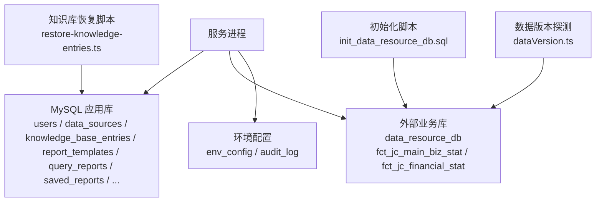
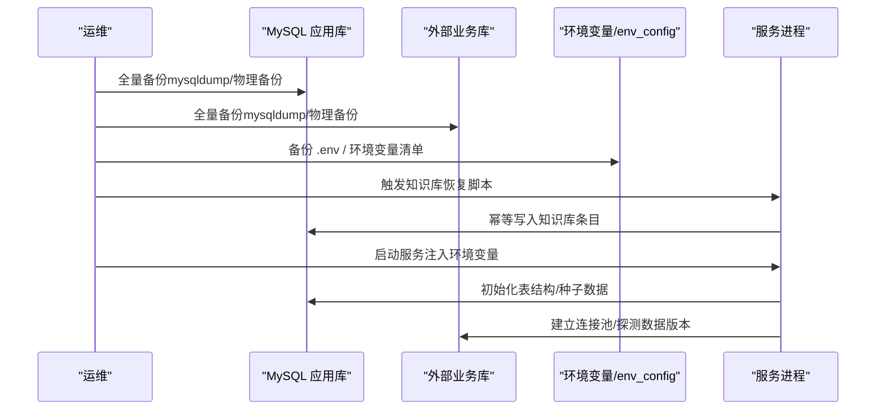
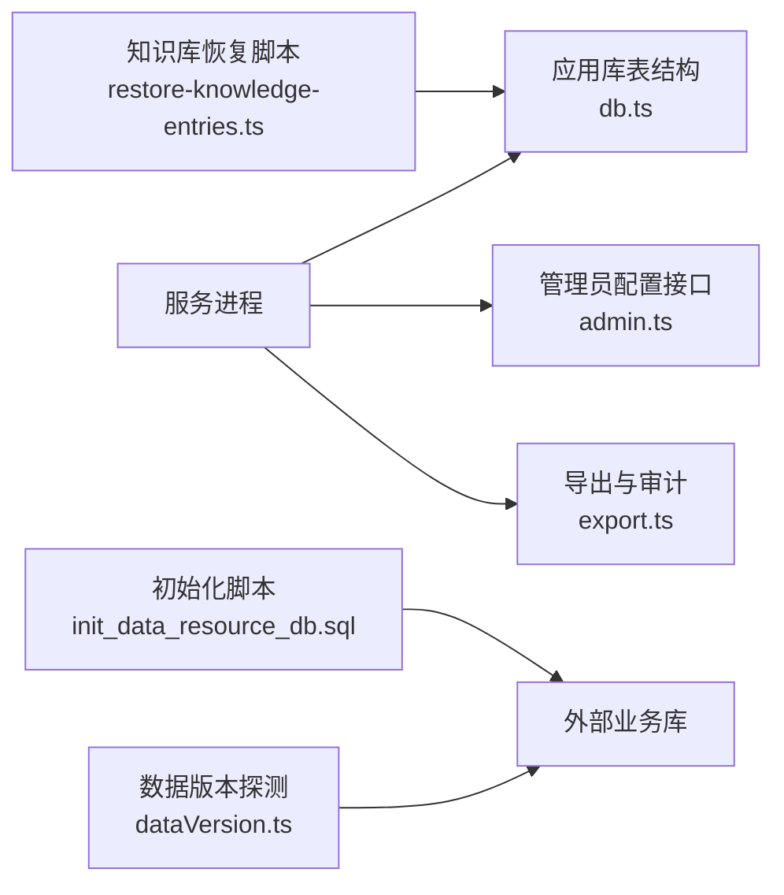

# 备份恢复

<cite>
**本文引用的文件**
- [server/infra/db.ts](file://server/infra/db.ts)
- [server/routes/admin.ts](file://server/routes/admin.ts)
- [scripts/init_data_resource_db.sql](file://scripts/init_data_resource_db.sql)
- [scripts/restore-knowledge-entries.ts](file://scripts/restore-knowledge-entries.ts)
- [server/seedDataResources.ts](file://server/seedDataResources.ts)
- [server/dataVersion.ts](file://server/dataVersion.ts)
- [server/routes/export.ts](file://server/routes/export.ts)
- [Dockerfile](file://Dockerfile)
</cite>

## 目录
1. [简介](#简介)
2. [项目结构](#项目结构)
3. [核心组件](#核心组件)
4. [架构总览](#架构总览)
5. [详细组件分析](#详细组件分析)
6. [依赖关系分析](#依赖关系分析)
7. [性能考虑](#性能考虑)
8. [故障排查指南](#故障排查指南)
9. [结论](#结论)
10. [附录](#附录)

## 简介
本文件为“智能问数据分析系统”的备份与恢复策略文档，覆盖数据库备份（全量、增量、定时）、数据迁移（版本升级、格式转换、回滚）、配置文件备份（环境变量、系统配置、用户自定义配置）、知识数据备份（知识库文档、报表模板、会话数据），以及灾难恢复流程（RTO/RPO目标、恢复测试、故障切换）与安全存储与访问控制。内容基于代码库中实际实现与脚本进行说明，确保可落地执行。

## 项目结构
与备份恢复相关的核心位置：
- 应用持久化层与表结构定义：server/infra/db.ts
- 管理员与环境配置管理：server/routes/admin.ts
- 数据资源库初始化脚本：scripts/init_data_resource_db.sql
- 知识库条目恢复脚本：scripts/restore-knowledge-entries.ts
- 数据源与内置知识库种子：server/seedDataResources.ts
- 数据指纹探测（用于变更感知/增量基线）：server/dataVersion.ts
- 导出审计与审批（辅助备份验证与溯源）：server/routes/export.ts
- 容器运行参数注入（环境变量）：Dockerfile

图表来源
- [server/infra/db.ts:52-800](file://server/infra/db.ts#L52-L800)
- [scripts/init_data_resource_db.sql:1-78](file://scripts/init_data_resource_db.sql#L1-L78)
- [scripts/restore-knowledge-entries.ts:1-100](file://scripts/restore-knowledge-entries.ts#L1-L100)
- [server/dataVersion.ts:56-98](file://server/dataVersion.ts#L56-L98)

章节来源
- [server/infra/db.ts:52-800](file://server/infra/db.ts#L52-L800)
- [scripts/init_data_resource_db.sql:1-78](file://scripts/init_data_resource_db.sql#L1-L78)

## 核心组件
- 应用库持久化与表结构：负责创建并维护用户、数据源、权限申请、下载审批、审计日志、查询轨迹、中间表注册、反馈、对话历史、知识库、技能库、SQL样例、报告模板、决策报表、看板图表、灵活查询等表，支撑系统的状态与元数据持久化。
- 管理员与环境配置：提供 env_config 的读取与更新接口，支持敏感字段脱敏与白名单校验，记录审计日志。
- 数据资源库初始化：提供独立业务库的建库、建表、样本数据与授权示例。
- 知识库恢复：幂等地将预置知识库条目写入应用库，便于灾备后快速恢复。
- 数据版本探测：通过信息_schema/pg_stat_user_tables 计算轻量指纹，用于变更检测与增量策略参考。
- 导出与审计：统一 CSV 导出通道，含水印、阈值审批与审计落库，可用于备份完整性核验与溯源。
- 容器环境变量：以环境变量注入数据库连接、JWT 密钥等敏感配置，便于在备份/恢复时按环境还原。

章节来源
- [server/infra/db.ts:52-800](file://server/infra/db.ts#L52-L800)
- [server/routes/admin.ts:212-292](file://server/routes/admin.ts#L212-L292)
- [scripts/init_data_resource_db.sql:1-78](file://scripts/init_data_resource_db.sql#L1-L78)
- [scripts/restore-knowledge-entries.ts:1-100](file://scripts/restore-knowledge-entries.ts#L1-L100)
- [server/dataVersion.ts:56-98](file://server/dataVersion.ts#L56-L98)
- [server/routes/export.ts:91-165](file://server/routes/export.ts#L91-L165)
- [Dockerfile:1-47](file://Dockerfile#L1-L47)

## 架构总览
备份恢复涉及三类数据域：
- 应用库（MySQL）：承载系统状态、元数据、审计、知识库、报表、会话等。
- 外部业务库（MySQL）：承载领域宽表与事实数据。
- 配置与环境：环境变量与 env_config 中的系统配置项。

图表来源
- [server/infra/db.ts:52-800](file://server/infra/db.ts#L52-L800)
- [scripts/restore-knowledge-entries.ts:1-100](file://scripts/restore-knowledge-entries.ts#L1-L100)
- [Dockerfile:1-47](file://Dockerfile#L1-L47)

## 详细组件分析

### 数据库备份策略
- 全量备份
  - 应用库：对 smart_analytics 库进行全量逻辑或物理备份，覆盖 users、data_sources、knowledge_base_entries、report_templates、query_reports、saved_reports、dashboard_widgets、flex_queries、audit_log、query_trace、conversation_history 等关键表。
  - 外部业务库：对 data_resource_db 进行全量备份，包含 fct_jc_main_biz_stat、fct_jc_financial_stat 及索引。
  - 建议频率：每日一次全量，结合增量日志（binlog）实现更细粒度恢复点。
- 增量备份
  - 基于 MySQL binlog 的增量归档，配合数据版本探测（dataVersion.ts）识别变更窗口，缩小增量范围。
  - 对于外部业务库，可通过 information_schema 或 pg_stat_user_tables 统计行级变化作为增量触发条件。
- 定时备份任务
  - 使用操作系统 crontab 或容器编排调度器，定期执行 mysqldump/物理备份工具，并将备份文件加密后上传至对象存储。
  - 保留策略：至少保留最近 N 份全量与对应增量链，满足 RPO 要求。

章节来源
- [server/infra/db.ts:52-800](file://server/infra/db.ts#L52-L800)
- [scripts/init_data_resource_db.sql:1-78](file://scripts/init_data_resource_db.sql#L1-L78)
- [server/dataVersion.ts:56-98](file://server/dataVersion.ts#L56-L98)

### 数据迁移方案
- 版本升级迁移
  - 服务启动时自动执行表结构变更（ALTER TABLE 幂等），新增列、扩展枚举、加索引等，保证向后兼容。
  - 建议在低峰期执行，并在变更前完成全量备份。
- 数据格式转换
  - 针对历史数据（如 conversation_history.status 扩展、llm_usage 增加用户维度列）进行一次性迁移，脚本具备幂等性。
  - 对大字段（MEDIUMTEXT/JSON）迁移需评估锁表与磁盘空间。
- 回滚策略
  - 采用“先备份、再迁移”的原则；若失败，回滚到备份点。
  - 对不可逆变更（如删除列）需准备反向脚本与验证用例。

章节来源
- [server/infra/db.ts:88-102](file://server/infra/db.ts#L88-L102)
- [server/infra/db.ts:120-139](file://server/infra/db.ts#L120-L139)
- [server/infra/db.ts:201-211](file://server/infra/db.ts#L201-L211)
- [server/infra/db.ts:291-298](file://server/infra/db.ts#L291-L298)
- [server/infra/db.ts:693-704](file://server/infra/db.ts#L693-L704)

### 配置文件备份
- 环境变量
  - 容器通过环境变量注入数据库连接、JWT 密钥、管理员初始账号等，需在部署前备份 .env 或编排平台的环境变量清单。
- 系统配置
  - 通过 admin 路由提供的 env_config 接口维护系统配置项，支持白名单校验与审计日志记录。
- 用户自定义配置
  - 数据源配置、ACL、指标定义、铁律规则、专家角色等均落库持久化，应纳入应用库备份范围。

章节来源
- [Dockerfile:1-47](file://Dockerfile#L1-L47)
- [server/routes/admin.ts:212-292](file://server/routes/admin.ts#L212-L292)
- [server/infra/db.ts:52-800](file://server/infra/db.ts#L52-L800)

### 知识数据备份
- 知识库文档
  - 知识库条目存储在 knowledge_base_entries，支持幂等恢复脚本 restore-knowledge-entries.ts，可按数据源维度恢复。
- 报表模板
  - 预设与用户自定义模板存储在 report_templates，随应用库备份一并保存。
- 用户会话数据
  - 对话历史存储在 conversation_history，支持导出与审计，便于回溯与合规检查。

章节来源
- [scripts/restore-knowledge-entries.ts:1-100](file://scripts/restore-knowledge-entries.ts#L1-L100)
- [server/seedDataResources.ts:17-87](file://server/seedDataResources.ts#L17-L87)
- [server/infra/db.ts:300-336](file://server/infra/db.ts#L300-L336)
- [server/infra/db.ts:401-432](file://server/infra/db.ts#L401-L432)
- [server/infra/db.ts:271-298](file://server/infra/db.ts#L271-L298)

### 灾难恢复流程
- RTO/RPO 目标设定
  - RPO：依据业务容忍度，结合 binlog 频率与全量周期确定（例如 RPO ≤ 15 分钟）。
  - RTO：依据恢复步骤复杂度与数据量估算（例如 RTO ≤ 2 小时）。
- 恢复测试
  - 定期在隔离环境执行恢复演练，验证备份可用性与恢复脚本正确性。
  - 使用导出审计与水印功能进行数据一致性抽样核对。
- 故障切换机制
  - 主从切换或跨可用区切换时，优先恢复应用库，再恢复外部业务库，最后注入环境变量并重启服务。
  - 恢复完成后，执行数据版本探测确认外部库连通与最新快照。

章节来源
- [server/dataVersion.ts:56-98](file://server/dataVersion.ts#L56-L98)
- [server/routes/export.ts:91-165](file://server/routes/export.ts#L91-L165)

### 备份数据安全存储与访问控制
- 安全存储
  - 备份文件加密存储（AES-256），传输使用 TLS，对象存储启用访问日志与生命周期策略。
- 访问控制
  - 仅授权人员可访问备份存储与恢复脚本；操作留痕并纳入审计。
  - 环境变量与敏感配置最小化暴露，生产环境强制设置 JWT_SECRET 等必要密钥。

章节来源
- [Dockerfile:1-47](file://Dockerfile#L1-L47)
- [server/routes/admin.ts:212-292](file://server/routes/admin.ts#L212-L292)

## 依赖关系分析

图表来源
- [server/infra/db.ts:52-800](file://server/infra/db.ts#L52-L800)
- [server/routes/admin.ts:212-292](file://server/routes/admin.ts#L212-L292)
- [server/routes/export.ts:91-165](file://server/routes/export.ts#L91-L165)
- [scripts/init_data_resource_db.sql:1-78](file://scripts/init_data_resource_db.sql#L1-L78)
- [scripts/restore-knowledge-entries.ts:1-100](file://scripts/restore-knowledge-entries.ts#L1-L100)
- [server/dataVersion.ts:56-98](file://server/dataVersion.ts#L56-L98)

章节来源
- [server/infra/db.ts:52-800](file://server/infra/db.ts#L52-L800)
- [server/routes/admin.ts:212-292](file://server/routes/admin.ts#L212-L292)
- [server/routes/export.ts:91-165](file://server/routes/export.ts#L91-L165)
- [scripts/init_data_resource_db.sql:1-78](file://scripts/init_data_resource_db.sql#L1-L78)
- [scripts/restore-knowledge-entries.ts:1-100](file://scripts/restore-knowledge-entries.ts#L1-L100)
- [server/dataVersion.ts:56-98](file://server/dataVersion.ts#L56-L98)

## 性能考虑
- 备份窗口：选择低峰时段执行全量备份，避免影响在线查询。
- 增量频率：根据变更热度调整 binlog 归档频率，平衡存储与恢复点精度。
- 恢复顺序：先应用库（元数据与配置），再外部业务库（大数据量），减少服务不可用时间。
- 并发限制：连接池容量与查询限流需与备份/恢复负载协调，避免资源争用。

[本节为通用指导，不直接分析具体文件]

## 故障排查指南
- 备份失败
  - 检查数据库连接与权限；确认 mysqldump/物理备份工具可用；查看错误日志。
- 恢复异常
  - 校验备份完整性；确认表结构与种子数据已正确初始化；检查环境变量是否注入完整。
- 知识库未恢复
  - 执行 restore-knowledge-entries.ts 幂等脚本；验证 knowledge_base_entries 条目数量与分类。
- 数据不一致
  - 使用导出审计与水印功能抽样比对；利用数据版本探测确认外部库最新快照。

章节来源
- [scripts/restore-knowledge-entries.ts:1-100](file://scripts/restore-knowledge-entries.ts#L1-L100)
- [server/routes/export.ts:91-165](file://server/routes/export.ts#L91-L165)
- [server/dataVersion.ts:56-98](file://server/dataVersion.ts#L56-L98)

## 结论
本策略围绕应用库、外部业务库与配置环境构建完整的备份与恢复体系，结合幂等恢复脚本、数据版本探测与审计能力，确保在灾难场景下能够快速、准确恢复业务。建议定期演练恢复流程，持续优化 RTO/RPO，并强化备份存储的安全与访问控制。

[本节为总结，不直接分析具体文件]

## 附录
- 关键表清单（应用库）：users、data_sources、permission_requests、download_requests、query_audit_log、query_trace、analysis_intermediate_tables、query_feedback、conversation_history、knowledge_base、knowledge_base_entries、skill_library、sql_examples、report_templates、query_reports、saved_reports、dashboard_widgets、flex_queries、flex_query_history、metric_definitions、metric_versions、iron_rules、expert_personas、llm_usage、external_kb_sources、kb_drift_watch、kb_drift_events。
- 关键表清单（外部业务库）：fct_jc_main_biz_stat、fct_jc_financial_stat。
- 恢复脚本：scripts/restore-knowledge-entries.ts（幂等写入知识库条目）。
- 初始化脚本：scripts/init_data_resource_db.sql（建库、建表、样本数据、授权示例）。

章节来源
- [server/infra/db.ts:52-800](file://server/infra/db.ts#L52-L800)
- [scripts/init_data_resource_db.sql:1-78](file://scripts/init_data_resource_db.sql#L1-L78)
- [scripts/restore-knowledge-entries.ts:1-100](file://scripts/restore-knowledge-entries.ts#L1-L100)