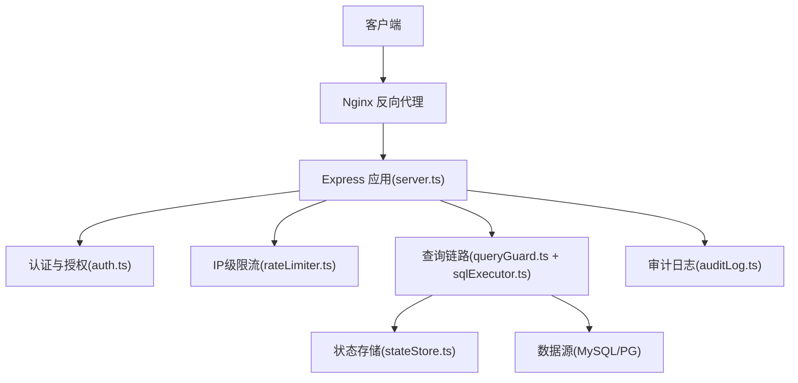
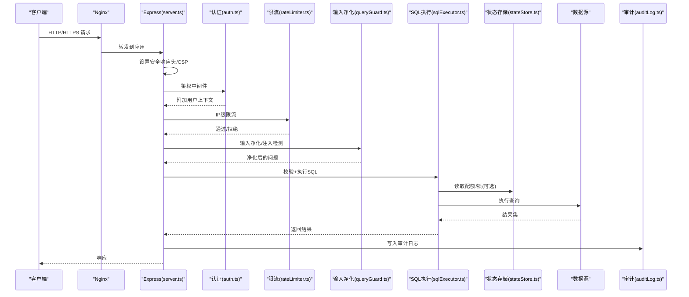
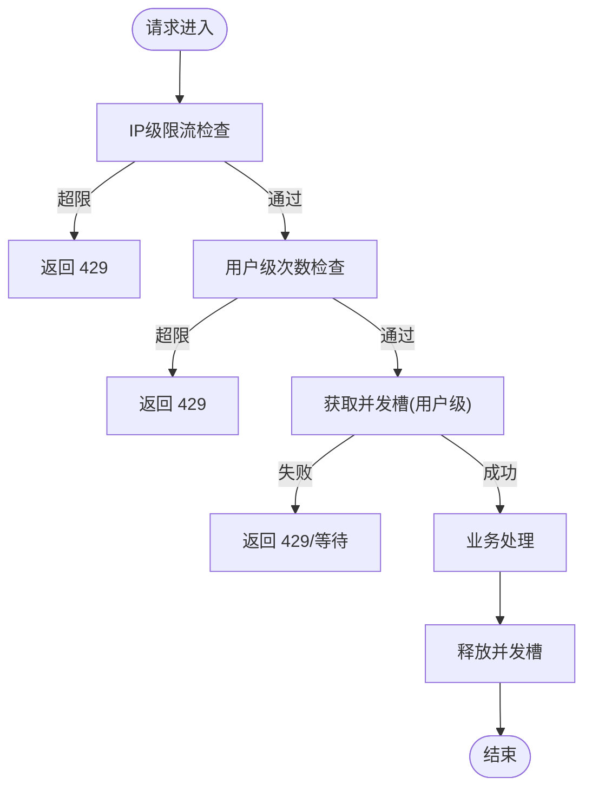
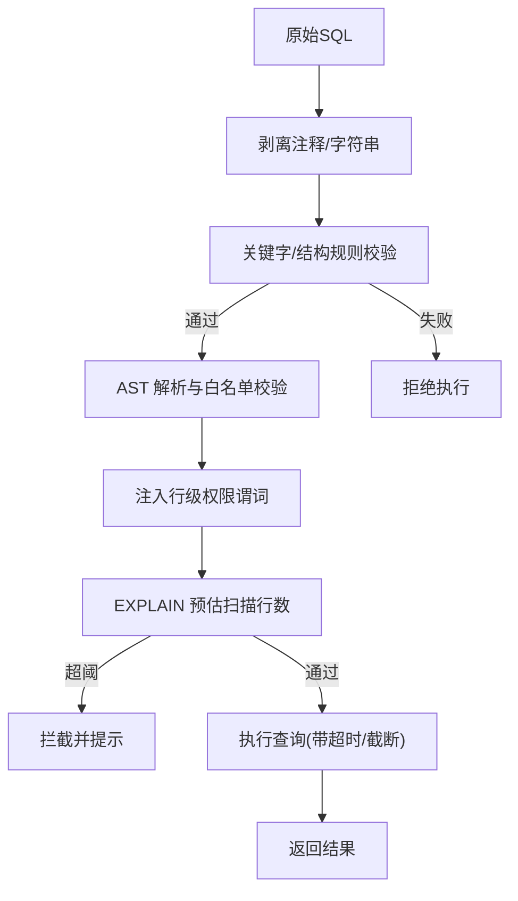
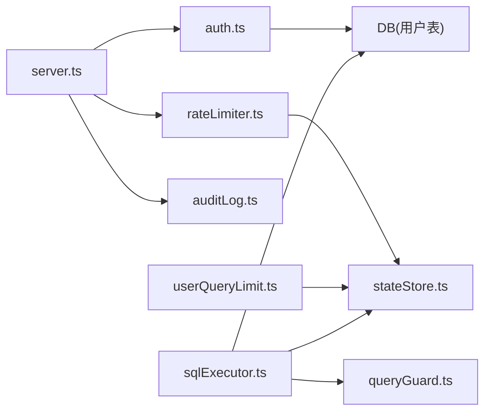

# 安全加固

<cite>
**本文引用的文件**
- [server.ts](file://server.ts)
- [rateLimiter.ts](file://server/infra/rateLimiter.ts)
- [auth.ts](file://server/auth/auth.ts)
- [secretsCrypto.ts](file://server/infra/secretsCrypto.ts)
- [sqlExecutor.ts](file://server/query/sqlExecutor.ts)
- [queryGuard.ts](file://server/query/queryGuard.ts)
- [userQueryLimit.ts](file://server/infra/userQueryLimit.ts)
- [stateStore.ts](file://server/infra/stateStore.ts)
- [nginx.multi-instance.conf](file://deploy/nginx.multi-instance.conf)
- [auditLog.ts](file://server/infra/auditLog.ts)
- [logger.ts](file://server/infra/logger.ts)
</cite>

## 目录
1. [简介](#简介)
2. [项目结构](#项目结构)
3. [核心组件](#核心组件)
4. [架构总览](#架构总览)
5. [详细组件分析](#详细组件分析)
6. [依赖关系分析](#依赖关系分析)
7. [性能与安全权衡](#性能与安全权衡)
8. [故障排查指南](#故障排查指南)
9. [结论](#结论)
10. [附录：配置清单与最佳实践](#附录配置清单与最佳实践)

## 简介
本文件面向“智能问数据分析系统”的安全加固配置，覆盖 HTTPS/TLS、CORS、请求限流、SQL 注入防护、密钥管理、审计与漏洞修复策略。文档基于仓库现有实现进行说明，并提供可操作的配置建议与排障指引，帮助运维与开发在开发与生产环境中正确启用并调优安全能力。

## 项目结构
系统采用 Express 作为后端服务入口，集中式设置响应头、路由挂载与中间件；安全相关能力分布在认证鉴权、输入净化、SQL 执行层、限流配额、状态存储（内存/Redis）、审计日志等模块中；部署侧提供 Nginx 多实例反向代理示例。

**图示来源**
- [server.ts:133-167](file://server.ts#L133-L167)
- [auth.ts:67-113](file://server/auth/auth.ts#L67-L113)
- [rateLimiter.ts:14-42](file://server/infra/rateLimiter.ts#L14-L42)
- [queryGuard.ts:35-53](file://server/query/queryGuard.ts#L35-L53)
- [sqlExecutor.ts:734-783](file://server/query/sqlExecutor.ts#L734-L783)
- [stateStore.ts:169-187](file://server/infra/stateStore.ts#L169-L187)
- [auditLog.ts:38-61](file://server/infra/auditLog.ts#L38-L61)

**章节来源**
- [server.ts:82-167](file://server.ts#L82-L167)
- [nginx.multi-instance.conf:9-34](file://deploy/nginx.multi-instance.conf#L9-L34)

## 核心组件
- 安全响应头与 CSP：在服务启动时统一设置，生产环境启用 HSTS 与严格 CSP，开发环境放宽以支持 HMR。
- 认证与授权：JWT 签发/校验、用户状态回查、强制改密控制、角色守卫。
- 输入净化与提示注入防护：长度限制、控制字符过滤、注入特征拒绝、历史轮数限制。
- SQL 安全执行层：只读白名单、AST 复核、敏感列拒绝、行级权限注入、EXPLAIN 防线、超时与结果截断。
- 限流与配额：IP 级滑动窗口/固定窗口限流；用户级每小时次数上限与并发互斥；可选 Redis 分布式实现。
- 密钥与凭据管理：数据源密码 AES-256-GCM 加密落库；JWT 密钥与环境变量管理；生产缺失关键密钥 fail-fast。
- 审计与日志：全链路审计落库，失败不阻塞主流程；统一日志级别控制。

**章节来源**
- [server.ts:145-167](file://server.ts#L145-L167)
- [auth.ts:46-64](file://server/auth/auth.ts#L46-L64)
- [queryGuard.ts:27-53](file://server/query/queryGuard.ts#L27-L53)
- [sqlExecutor.ts:291-387](file://server/query/sqlExecutor.ts#L291-L387)
- [rateLimiter.ts:14-42](file://server/infra/rateLimiter.ts#L14-L42)
- [userQueryLimit.ts:24-68](file://server/infra/userQueryLimit.ts#L24-L68)
- [secretsCrypto.ts:27-43](file://server/infra/secretsCrypto.ts#L27-L43)
- [auditLog.ts:38-61](file://server/infra/auditLog.ts#L38-L61)

## 架构总览
下图展示一次受保护的问数请求从进入应用到安全校验、限流、SQL 执行与审计的完整路径。

**图示来源**
- [server.ts:145-170](file://server.ts#L145-L170)
- [auth.ts:67-113](file://server/auth/auth.ts#L67-L113)
- [rateLimiter.ts:14-42](file://server/infra/rateLimiter.ts#L14-L42)
- [queryGuard.ts:35-53](file://server/query/queryGuard.ts#L35-L53)
- [sqlExecutor.ts:734-783](file://server/query/sqlExecutor.ts#L734-L783)
- [stateStore.ts:169-187](file://server/infra/stateStore.ts#L169-L187)
- [auditLog.ts:38-61](file://server/infra/auditLog.ts#L38-L61)

## 详细组件分析

### HTTPS 与 TLS 配置
- 现状与建议
  - 当前应用默认监听 HTTP，并在 server.ts 中设置安全响应头与 CSP。生产环境应通过反向代理（如 Nginx）终止 TLS，将 HTTPS 流量转换为 HTTP 转发至应用。
  - 建议在 Nginx 中启用 TLSv1.2/TLSv1.3，禁用旧协议与弱套件，开启 HSTS 与 OCSP Stapling，并配置证书自动续期。
  - 若需直接暴露 HTTPS，可在 Node 层加载证书与私钥，但推荐由网关统一处理。
- 关键配置要点
  - 仅允许 TLSv1.2+，关闭 SSLv2/SSLv3/TLSv1.0/1.1。
  - 使用现代密码套件（如 ECDHE-ECDSA-AES128-GCM-SHA256）。
  - 启用 HSTS（max-age 至少一年），必要时 includeSubDomains。
  - 证书链完整，避免自签或过期证书。
  - 定期轮换证书，自动化续期（ACME/Let’s Encrypt）。
- 与应用的配合
  - 保持 server.ts 中的安全响应头不变；生产模式已启用 HSTS 与 CSP，确保前端资源与 WebSocket 连接域名一致。
  - 若前端跨域访问，需在网关或应用层配置 CORS（见下一节）。

**章节来源**
- [server.ts:145-167](file://server.ts#L145-L167)
- [nginx.multi-instance.conf:9-34](file://deploy/nginx.multi-instance.conf#L9-L34)

### CORS 跨域配置
- 现状
  - 代码中未显式启用 CORS 中间件；生产 CSP 限制 connect-src 为 'self' 及 ws/wss，跨域需额外放行。
- 建议方案
  - 在网关（Nginx）或应用层增加 CORS 中间件，仅允许可信来源（Origin 白名单）。
  - 限制允许的 HTTP 方法（GET/POST/PUT/DELETE 等按需开放）。
  - 凭证处理：如需携带 Cookie/Authorization，必须同时满足：
    - Access-Control-Allow-Credentials: true
    - Access-Control-Allow-Origin 指定具体域名（不可为 *）
    - 前端相应开启 withCredentials
  - 预检请求缓存：合理设置 Access-Control-Max-Age，减少 OPTIONS 风暴。
  - 对敏感接口（如导出、报表）进一步收紧来源与方法。

[本节为概念性说明，不直接分析具体文件]

### 请求限流策略
- IP 级限流
  - 基于滑动窗口（内存）或固定分钟窗口（Redis）计数，超过阈值返回 429。
  - 适用于防匿名爆破与滥用。
- 用户级限流与并发控制
  - 每小时次数上限（默认 20 次/小时），可通过环境变量调整。
  - 同一用户并发互斥（默认仅一个进行中查询），防止单用户拖垮 LLM/数据库。
  - 支持 Redis 分布式锁与 TTL 自动释放，多实例共享配额。
- API 接口级限流
  - 可在路由层组合 IP 限流与用户限流，针对高成本接口（如报告生成、导出）单独收紧。
  - 结合 Prometheus 指标与审计日志，识别异常调用模式。

**图示来源**
- [rateLimiter.ts:14-42](file://server/infra/rateLimiter.ts#L14-L42)
- [userQueryLimit.ts:24-68](file://server/infra/userQueryLimit.ts#L24-L68)
- [stateStore.ts:140-162](file://server/infra/stateStore.ts#L140-L162)

**章节来源**
- [rateLimiter.ts:14-42](file://server/infra/rateLimiter.ts#L14-L42)
- [userQueryLimit.ts:24-68](file://server/infra/userQueryLimit.ts#L24-L68)
- [stateStore.ts:140-162](file://server/infra/stateStore.ts#L140-L162)

### SQL 注入防护
- 输入净化（L1）
  - 控制字符过滤、注入特征拒绝、最大长度限制（默认 500 字），历史消息仅保留最近若干轮。
- 参数化与只读约束
  - 仅允许 SELECT 语句，禁止写/DDL/管理类关键字；单语句限制；强制 LIMIT；敏感列拒绝。
- AST 复核与白名单
  - 使用 AST 解析器二次校验语句类型与表引用，表名必须在 scope 白名单内；CTE 场景特殊处理。
- 行级权限注入
  - 在 AST 层面将受控表包裹为带 WHERE 谓词的派生表，递归覆盖子查询/UNION/CTE，失败则拒绝执行。
- EXPLAIN 防线
  - 执行前评估预估扫描行数，超过阈值拦截，保护数据源免受大扫描影响。
- 超时与结果截断
  - 按场景设置执行超时；结果行数上限（默认 10 万）；MySQL 注入 MAX_EXECUTION_TIME hint。

**图示来源**
- [queryGuard.ts:35-53](file://server/query/queryGuard.ts#L35-L53)
- [sqlExecutor.ts:291-387](file://server/query/sqlExecutor.ts#L291-L387)
- [sqlExecutor.ts:396-489](file://server/query/sqlExecutor.ts#L396-L489)
- [sqlExecutor.ts:629-662](file://server/query/sqlExecutor.ts#L629-L662)

**章节来源**
- [queryGuard.ts:35-53](file://server/query/queryGuard.ts#L35-L53)
- [sqlExecutor.ts:291-387](file://server/query/sqlExecutor.ts#L291-L387)
- [sqlExecutor.ts:396-489](file://server/query/sqlExecutor.ts#L396-L489)
- [sqlExecutor.ts:629-662](file://server/query/sqlExecutor.ts#L629-L662)

### 密钥管理与环境变量
- JWT 密钥
  - 生产环境必须设置 JWT_SECRET，否则拒绝启动；开发环境自动生成进程级临时密钥（重启失效）。
  - 建议定期轮换，并通过 CI/CD 注入；令牌过期时间可通过环境变量配置。
- 数据源凭据加密
  - 使用 AES-256-GCM 加密落库，密文格式含 IV、AuthTag、Cipher；解密时密钥来自 DS_SECRET_KEY 或 JWT_SECRET。
  - 迁移期兼容明文存量，启动时可就地加密。
- 环境变量管理
  - 优先顺序：进程环境变量 > .env.local > .env；生产务必使用外部密钥管理服务（如 KMS/Secrets Manager）。
  - 关键开关：NODE_ENV、PORT、HOST、REDIS_URL、LOG_LEVEL、USER_QUERY_RATE_MAX、RATE_LIMIT_MAX、DS_POOL_*、QUERY_TIMEOUT_*、SQL_EXPLAIN_MAX_ROWS。
- 安全建议
  - 禁止将密钥提交至代码仓库；使用容器编排或平台 Secret 注入。
  - 最小权限原则：数据源账号仅授予必要权限（SELECT 为主）。
  - 定期审计密钥使用与访问记录。

**章节来源**
- [server.ts:91-96](file://server.ts#L91-L96)
- [auth.ts:46-64](file://server/auth/auth.ts#L46-L64)
- [secretsCrypto.ts:27-43](file://server/infra/secretsCrypto.ts#L27-L43)
- [sqlExecutor.ts:686-726](file://server/query/sqlExecutor.ts#L686-L726)

### 审计与监控
- 审计日志
  - 全链路审计：成功、降级、错误、被拒绝（输入/权限/频率/开关）均落库；写入失败不阻塞主流程。
  - 字段包含用户、端点、数据源、问题、状态、执行 SQL、行数、耗时等。
- 日志级别
  - 统一 logger 输出，支持 LOG_LEVEL 控制；测试环境静默 warn/info，避免噪音。
- 指标埋点
  - 接口耗时直方图、审计旁路埋点、EXPLAIN 防线命中统计等，便于告警与容量规划。

**章节来源**
- [auditLog.ts:38-61](file://server/infra/auditLog.ts#L38-L61)
- [logger.ts:12-40](file://server/infra/logger.ts#L12-L40)
- [server.ts:172-183](file://server.ts#L172-L183)

### 安全扫描与漏洞修复策略
- 依赖扫描
  - 在 CI 中集成依赖漏洞扫描（如 npm audit、Dependabot），阻断高危版本合并。
- 代码扫描
  - 引入静态分析（如 ESLint Security、Semgrep），检测常见安全问题（硬编码密钥、不安全函数）。
- 运行时防护
  - 保持输入净化、SQL 白名单、AST 复核、EXPLAIN 防线、限流与审计生效。
- 漏洞修复流程
  - 发现高危漏洞 → 快速热修复或降级 → 回归测试 → 灰度发布 → 复盘与加固。
- 合规与基线
  - 遵循最小权限、纵深防御、零信任原则；定期更新 TLS 与密码套件基线。

[本节为通用安全治理建议，不直接分析具体文件]

## 依赖关系分析
- 组件耦合
  - server.ts 作为入口，集中挂载中间件与路由；认证、限流、审计与其强耦合。
  - sqlExecutor.ts 依赖 queryGuard.ts 的输入净化与 schema 上下文；依赖 stateStore.ts 的配额/锁（可选）。
  - rateLimiter.ts 与 userQueryLimit.ts 共用 stateStore.ts 抽象，支持内存/Redis 切换。
- 外部依赖
  - 数据库驱动（mysql2/pg）、ioredis、jsonwebtoken、node-sql-parser。
- 潜在风险
  - Redis 不可用时的降级行为：限流/配额 fail-closed 更安全；审计写入失败不阻塞主流程。
  - AST 解析失败时的降级策略：正则防线兜底，WITH 场景更严格。

**图示来源**
- [server.ts:133-170](file://server.ts#L133-L170)
- [auth.ts:67-113](file://server/auth/auth.ts#L67-L113)
- [rateLimiter.ts:14-42](file://server/infra/rateLimiter.ts#L14-L42)
- [userQueryLimit.ts:24-68](file://server/infra/userQueryLimit.ts#L24-L68)
- [sqlExecutor.ts:734-783](file://server/query/sqlExecutor.ts#L734-L783)
- [stateStore.ts:169-187](file://server/infra/stateStore.ts#L169-L187)
- [auditLog.ts:38-61](file://server/infra/auditLog.ts#L38-L61)

**章节来源**
- [server.ts:133-170](file://server.ts#L133-L170)
- [stateStore.ts:169-187](file://server/infra/stateStore.ts#L169-L187)

## 性能与安全权衡
- 限流与用户体验
  - IP/用户级限流可防止滥用，但需根据业务峰值调参；Redis 模式在多实例下更稳健。
- SQL 执行与稳定性
  - EXPLAIN 防线可能误拦复杂查询，但能保护数据源；建议结合业务场景调整阈值。
  - 场景化超时与连接池配额避免长任务挤占交互链路。
- 审计与吞吐
  - 审计写入失败不阻塞主流程，保证可用性；在高吞吐场景可考虑异步队列或批写。

[本节为通用指导，不直接分析具体文件]

## 故障排查指南
- 常见问题
  - 生产启动失败：检查 JWT_SECRET 是否配置；未配置将拒绝启动。
  - 429 频繁：检查 RATE_LIMIT_MAX、USER_QUERY_RATE_MAX、Redis 连接与健康状况。
  - SQL 被拒绝：查看审计日志与错误信息，确认是否命中关键字/白名单/敏感列/EXPLAIN 防线。
  - 跨域失败：确认前端 Origin 与后端 CORS 配置一致，且凭证设置正确。
- 定位步骤
  - 查看统一日志（logger）与审计日志（auditLog），结合 Prometheus 指标定位瓶颈。
  - 检查 Redis 状态（stateStore），确认限流/配额/锁是否正常。
  - 核对 Nginx 配置（TLS、CORS、超时），确保长连接不被截断。

**章节来源**
- [server.ts:91-96](file://server.ts#L91-L96)
- [rateLimiter.ts:14-42](file://server/infra/rateLimiter.ts#L14-L42)
- [userQueryLimit.ts:24-68](file://server/infra/userQueryLimit.ts#L24-L68)
- [sqlExecutor.ts:629-662](file://server/query/sqlExecutor.ts#L629-L662)
- [auditLog.ts:38-61](file://server/infra/auditLog.ts#L38-L61)
- [logger.ts:12-40](file://server/infra/logger.ts#L12-L40)

## 结论
系统在输入净化、SQL 安全执行、限流配额、密钥管理、审计日志等方面具备完善的安全能力。生产环境应通过网关统一终止 TLS 并强化 CORS 策略，结合环境变量与密钥管理服务完成安全基线配置。持续进行依赖扫描、代码扫描与漏洞修复，保障系统长期稳定与安全。

## 附录：配置清单与最佳实践
- 环境变量（部分）
  - NODE_ENV=production
  - PORT、HOST
  - JWT_SECRET（生产必填）
  - JWT_EXPIRES_IN
  - REDIS_URL（可选，启用分布式限流/配额/锁）
  - RATE_LIMIT_MAX（IP 级限流阈值）
  - USER_QUERY_RATE_MAX（用户级每小时次数）
  - DS_POOL_MAX、DS_POOL_INTERACTIVE/CHAIN/EXPORT
  - QUERY_TIMEOUT_INTERACTIVE_MS/CHAIN_MS/EXPORT_MS
  - SQL_EXPLAIN_MAX_ROWS
  - LOG_LEVEL
- 最佳实践
  - 网关统一 HTTPS/TLS，应用专注业务逻辑。
  - 最小权限：数据源账号仅授予必要权限。
  - 定期轮换密钥与证书，自动化续期。
  - 灰度发布与回滚预案，变更前后对比指标与审计。
  - 建立安全事件响应流程，快速定位与处置。

[本节为通用配置建议，不直接分析具体文件]