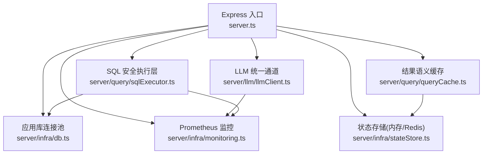
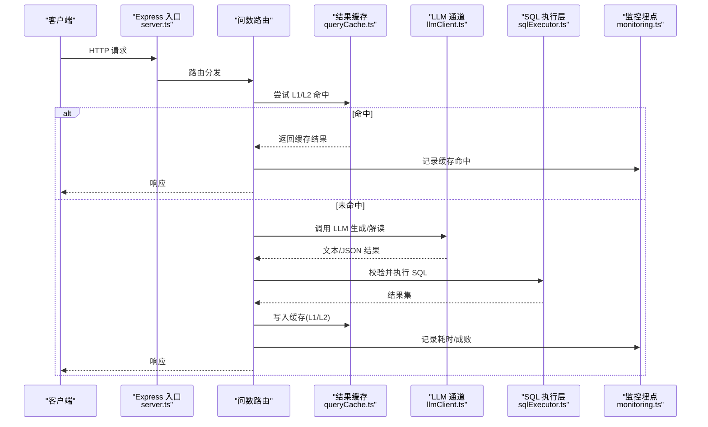
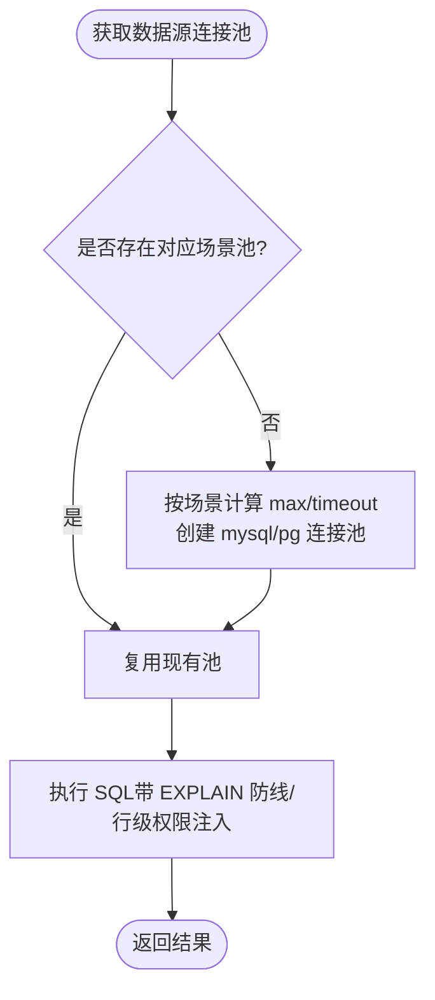
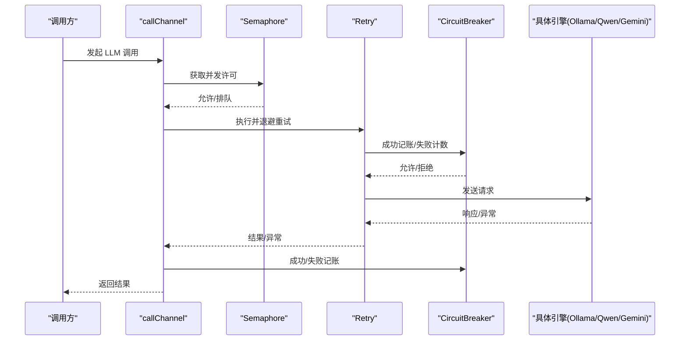
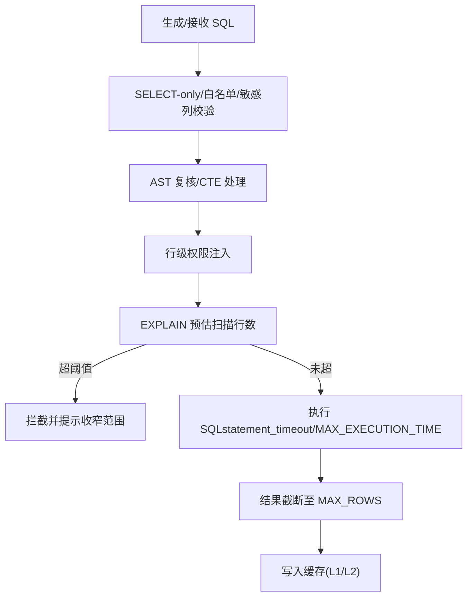
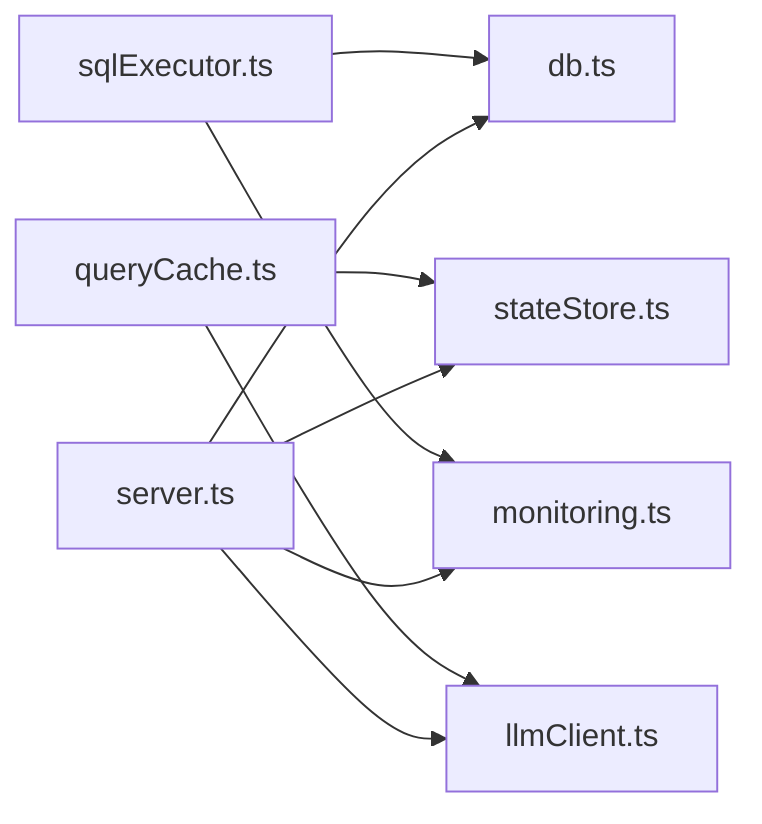

# 性能优化

<cite>
**本文引用的文件**
- [server.ts](file://server.ts)
- [package.json](file://package.json)
- [Dockerfile](file://Dockerfile)
- [server/infra/db.ts](file://server/infra/db.ts)
- [server/infra/stateStore.ts](file://server/infra/stateStore.ts)
- [server/llm/llmClient.ts](file://server/llm/llmClient.ts)
- [server/query/sqlExecutor.ts](file://server/query/sqlExecutor.ts)
- [server/query/queryCache.ts](file://server/query/queryCache.ts)
- [server/infra/monitoring.ts](file://server/infra/monitoring.ts)
</cite>

## 目录
1. [简介](#简介)
2. [项目结构](#项目结构)
3. [核心组件](#核心组件)
4. [架构总览](#架构总览)
5. [详细组件分析](#详细组件分析)
6. [依赖关系分析](#依赖关系分析)
7. [性能考量](#性能考量)
8. [故障排查指南](#故障排查指南)
9. [结论](#结论)
10. [附录](#附录)

## 简介
本指南面向“智能问数据分析系统”的生产与压测环境，聚焦 Node.js 运行时、数据库连接池、缓存层、LLM 调用与查询执行五大维度的性能优化配置。内容基于代码库中的实际实现与环境变量约定，提供可操作的参数建议、监控指标与瓶颈定位方法，帮助在保障安全与稳定性的前提下提升吞吐、降低延迟与成本。

## 项目结构
系统采用 Express 作为 Web 框架，启动时完成数据库初始化、Redis 预热、任务队列与 LLM 健康检查等基础设施准备；请求链路经过鉴权、限流、审计与 Prometheus 埋点，最终进入业务路由（问数、报告、知识库等）。关键路径包括：
- 服务启动与中间件装配（server.ts）
- 应用库 MySQL 连接池与建表（server/infra/db.ts）
- 数据源 SQL 执行与安全防线（server/query/sqlExecutor.ts）
- 结果语义缓存（L1/L2）（server/query/queryCache.ts）
- LLM 多引擎统一通道与韧性控制（server/llm/llmClient.ts）
- 状态存储抽象与 Redis 预热（server/infra/stateStore.ts）
- 监控指标采集与 /metrics 端点（server/infra/monitoring.ts）

图表来源
- [server.ts:82-183](file://server.ts#L82-L183)
- [server/infra/db.ts:47-70](file://server/infra/db.ts#L47-L70)
- [server/query/sqlExecutor.ts:686-726](file://server/query/sqlExecutor.ts#L686-L726)
- [server/query/queryCache.ts:43-90](file://server/query/queryCache.ts#L43-L90)
- [server/llm/llmClient.ts:449-525](file://server/llm/llmClient.ts#L449-L525)
- [server/infra/stateStore.ts:169-187](file://server/infra/stateStore.ts#L169-L187)
- [server/infra/monitoring.ts:82-88](file://server/infra/monitoring.ts#L82-L88)

章节来源
- [server.ts:82-183](file://server.ts#L82-L183)
- [package.json:6-24](file://package.json#L6-L24)

## 核心组件
- Node.js 运行时与服务进程
  - 通过环境变量 HOST、PORT、NODE_ENV 控制监听与生产模式；容器默认暴露 3000 端口并启用健康检查。
  - 启动阶段进行数据库初始化、Redis 预热、任务队列注册、Ollama 后端健康检查、SSE 重放缓冲清理与漂移检测扫描。
- 数据库连接池
  - 应用库 MySQL 连接池容量按 EXPECTED_CONCURRENT_USERS 推导，支持显式 APP_POOL_MAX 覆盖。
  - 数据源连接池按场景分级（交互/分析链/导出），支持 DS_POOL_MAX 及场景级上限与超时。
- 缓存层
  - 结果缓存 L1（精确匹配）+ L2（语义相似度），默认 TTL 30 分钟，支持 REDIS_URL 外置共享。
  - 语义索引阈值默认 0.95，可通过 SEMANTIC_CACHE_THRESHOLD 调整。
- LLM 调用
  - 统一通道封装 Ollama/Gemini/Qwen，具备重试、并发信号量、熔断降级、自适应超时与引擎故障转移。
  - 支持阶段级快速模型路由（SQL 生成/解读）与请求级模型覆盖。
- 查询执行与安全防线
  - SELECT-only、白名单表、敏感列拒绝、AST 复核、行级权限注入、强制 LIMIT、EXPLAIN 扫描行数防线。
  - 场景化超时与 MAX_EXECUTION_TIME 提示双保险。

章节来源
- [server.ts:98-131](file://server.ts#L98-L131)
- [server/infra/db.ts:35-70](file://server/infra/db.ts#L35-L70)
- [server/query/sqlExecutor.ts:51-109](file://server/query/sqlExecutor.ts#L51-L109)
- [server/query/queryCache.ts:14-28](file://server/query/queryCache.ts#L14-L28)
- [server/llm/llmClient.ts:61-107](file://server/llm/llmClient.ts#L61-L107)

## 架构总览
下图展示一次典型“问数”请求的端到端流程，涵盖缓存命中、LLM 调用、SQL 安全执行与监控埋点。

图表来源
- [server.ts:174-183](file://server.ts#L174-L183)
- [server/query/queryCache.ts:43-90](file://server/query/queryCache.ts#L43-L90)
- [server/llm/llmClient.ts:449-525](file://server/llm/llmClient.ts#L449-L525)
- [server/query/sqlExecutor.ts:734-752](file://server/query/sqlExecutor.ts#L734-L752)
- [server/infra/monitoring.ts:92-133](file://server/infra/monitoring.ts#L92-L133)

## 详细组件分析

### Node.js 运行时优化
- 进程与网络
  - 使用 HOST=0.0.0.0、PORT=3000 暴露服务；生产模式由 NODE_ENV 或运行路径判定。
  - 容器内以非 root 用户运行，并通过内置 fetch 探针进行健康检查。
- 内存与 V8 调优
  - 当前代码未硬编码 --max-old-space-size；建议在部署层根据负载设置（例如 2G~8G），并结合压测观察堆增长与 GC 频率。
  - 关注长生命周期对象（如大结果集、embedding 向量）是否被及时释放；必要时结合日志与监控评估是否需要分片处理或流式输出。
- 启动与预热
  - 启动时预热 Redis 连接，避免冷启动窗口内的限流失败与缓存未命中抖动。
  - 启动即清理过期中间表并注册任务队列处理器，减少首波请求延迟。

章节来源
- [Dockerfile:27-46](file://Dockerfile#L27-L46)
- [server.ts:82-131](file://server.ts#L82-L131)
- [server/infra/stateStore.ts:194-213](file://server/infra/stateStore.ts#L194-L213)

### 数据库连接池配置（MySQL/PostgreSQL）
- 应用库连接池
  - 容量公式：APP_POOL_MAX 优先；否则按 EXPECTED_CONCURRENT_USERS/2 推导，限制在 [10, 50]。
  - 用于鉴权、审计、知识库等短查询，确保高并发下的低延迟。
- 数据源连接池
  - 容量公式：DS_POOL_MAX 优先；否则按 EXPECTED_CONCURRENT_USERS/4 推导，限制在 [3, 20]。
  - 场景分级配额：interactive/chain/export 分别有独立上限与超时，避免后台任务挤占交互资源。
  - 超时策略：PG 使用 statement_timeout；MySQL 使用 connectTimeout + MAX_EXECUTION_TIME 提示。
- 连接复用与失效
  - 按 dataSourceId+场景 建立并缓存连接池；配置变更时通过 invalidateExecutorPool 失效重建。

图表来源
- [server/query/sqlExecutor.ts:686-726](file://server/query/sqlExecutor.ts#L686-L726)
- [server/query/sqlExecutor.ts:51-109](file://server/query/sqlExecutor.ts#L51-L109)
- [server/infra/db.ts:35-70](file://server/infra/db.ts#L35-L70)

章节来源
- [server/infra/db.ts:35-70](file://server/infra/db.ts#L35-L70)
- [server/query/sqlExecutor.ts:51-109](file://server/query/sqlExecutor.ts#L51-L109)
- [server/query/sqlExecutor.ts:686-726](file://server/query/sqlExecutor.ts#L686-L726)

### 缓存层优化（Redis、策略、预加载）
- 缓存策略
  - L1 精确命中：归一化问题键（dataSourceId::question），TTL 默认 30 分钟，可 QUERY_CACHE_TTL_MINUTES 覆盖。
  - L2 语义命中：embedding 相似度≥0.95 命中最近成功结果，可 SEMANTIC_CACHE_THRESHOLD 调整。
  - 大结果不缓存：超过 REDIS_MAX_PAYLOAD_BYTES 不写入，防止撑爆内存库。
- Redis 集成
  - 通过 REDIS_URL 启用外置共享缓存；启动时 warmStateStore 预热连接，失败仅告警不阻断。
  - 失效策略：数据源结构变更后按前缀 SCAN 删除 qc:* 与 qcidx:* 键。
- 热点数据预加载
  - 可在业务侧对高频问题提前触发一次查询并落盘缓存，缩短首访延迟。
  - 结合 L2 语义索引，同义改写问题可直接命中，减少 LLM 调用。

章节来源
- [server/query/queryCache.ts:14-28](file://server/query/queryCache.ts#L14-L28)
- [server/query/queryCache.ts:43-90](file://server/query/queryCache.ts#L43-L90)
- [server/query/queryCache.ts:92-114](file://server/query/queryCache.ts#L92-L114)
- [server/query/queryCache.ts:116-129](file://server/query/queryCache.ts#L116-L129)
- [server/infra/stateStore.ts:194-213](file://server/infra/stateStore.ts#L194-L213)

### LLM 调用优化（批处理、并发、熔断降级）
- 并发控制
  - 每引擎 Semaphore 限制最大并发（默认 4），避免打爆推理进程或云端配额。
  - 可通过 LLM_MAX_CONCURRENT 调整。
- 重试与熔断
  - 指数退避重试（默认最多 2 次），仅对超时/5xx/网络错误重试。
  - 连续失败达到阈值后熔断开路（默认 3 次失败，冷却期 30s），期间快速失败不雪崩。
  - 主引擎开路时自动切换到备用引擎（如 Ollama→Qwen/Gemini）。
- 自适应超时
  - 基于近期成功 P95×3 动态收紧超时上限，避免慢请求拖死系统；可通过 LLM_ADAPTIVE_TIMEOUT 关闭。
- 阶段级快速模型
  - SQL 生成与解读可使用快速小模型（LLM_SQL_ENGINE/MODEL、LLM_ANALYSIS_ENGINE/MODEL），显著降低延迟与成本。
- 用量与成本
  - 统一埋点记录 prompt/completion tokens 与耗时，支撑成本对比与审计。

图表来源
- [server/llm/llmClient.ts:61-107](file://server/llm/llmClient.ts#L61-L107)
- [server/llm/llmClient.ts:141-161](file://server/llm/llmClient.ts#L141-L161)
- [server/llm/llmClient.ts:449-525](file://server/llm/llmClient.ts#L449-L525)

章节来源
- [server/llm/llmClient.ts:61-107](file://server/llm/llmClient.ts#L61-L107)
- [server/llm/llmClient.ts:141-161](file://server/llm/llmClient.ts#L141-L161)
- [server/llm/llmClient.ts:449-525](file://server/llm/llmClient.ts#L449-L525)

### 查询性能优化（执行计划、索引、缓存）
- 执行计划分析
  - 执行前 EXPLAIN 评估扫描行数，超阈值拦截（默认 100 万，export 场景放宽 10 倍）。
  - 兼容 MySQL 传统表格/JSON/树形三种 EXPLAIN 格式；PG 解析 Plan Rows 最大值。
- 索引优化建议
  - 针对高频过滤维度（时间、部门、分类）建立复合索引，减少全表扫描。
  - 对 JOIN 条件列建立索引，避免临时表与 filesort。
  - 对大表聚合查询，考虑物化视图或预聚合表。
- 查询缓存策略
  - 合理设置 L1/L2 缓存 TTL，结合数据源变更失效机制，平衡一致性与命中率。
  - 对热点指标与报表，采用定时预计算与缓存预热。

图表来源
- [server/query/sqlExecutor.ts:291-387](file://server/query/sqlExecutor.ts#L291-L387)
- [server/query/sqlExecutor.ts:531-662](file://server/query/sqlExecutor.ts#L531-L662)
- [server/query/sqlExecutor.ts:686-726](file://server/query/sqlExecutor.ts#L686-L726)
- [server/query/queryCache.ts:43-90](file://server/query/queryCache.ts#L43-L90)

章节来源
- [server/query/sqlExecutor.ts:291-387](file://server/query/sqlExecutor.ts#L291-L387)
- [server/query/sqlExecutor.ts:531-662](file://server/query/sqlExecutor.ts#L531-L662)

## 依赖关系分析
- 模块耦合
  - server.ts 作为入口，依赖 infra/db、stateStore、llmClient、query/sqlExecutor、monitoring 等模块。
  - sqlExecutor 依赖 db（应用库）、monitoring（埋点）、llmClient（纠偏/自愈可选）。
  - queryCache 依赖 stateStore（Redis/内存）与 llmClient（embedding）。
- 外部依赖
  - mysql2、pg 驱动用于数据库连接池。
  - ioredis 用于 Redis 状态存储。
  - prom-client 用于 Prometheus 指标采集。
  - @google/genai 用于 Gemini 调用（按需加载）。

图表来源
- [server.ts:21-64](file://server.ts#L21-L64)
- [server/query/sqlExecutor.ts:11-20](file://server/query/sqlExecutor.ts#L11-L20)
- [server/query/queryCache.ts:8-10](file://server/query/queryCache.ts#L8-L10)
- [package.json:26-45](file://package.json#L26-L45)

章节来源
- [package.json:26-45](file://package.json#L26-L45)
- [server.ts:21-64](file://server.ts#L21-L64)

## 性能考量
- 运行时与容器
  - 根据负载设置 Node.js 堆大小（--max-old-space-size），结合压测观察 GC 停顿与堆使用率。
  - 容器健康检查已启用，确保滚动升级时的可用性。
- 数据库
  - 合理设置连接池上限与场景超时，避免连接风暴与长事务阻塞。
  - 利用 EXPLAIN 防线拦截大范围扫描，配合索引优化减少扫描行数。
- 缓存
  - 提高 L1/L2 命中率可降低 LLM 与数据库压力；注意数据一致性要求与失效时机。
- LLM
  - 使用快速模型路由与自适应超时，降低延迟与成本；开启熔断与故障转移提升韧性。
- 监控
  - 关注 nl2sql_duration_seconds、llm_call_duration_seconds、sql_execute_duration_seconds、http_request_duration_seconds 等指标，识别瓶颈环节。

[本节为通用指导，不直接分析具体文件]

## 故障排查指南
- 常见问题定位
  - 连接池耗尽：检查 DS_POOL_MAX/APP_POOL_MAX 与 EXPECTED_CONCURRENT_USERS 配置；观察 sql_execute_duration_seconds 与连接等待情况。
  - LLM 超时/失败：查看 llm_call_duration_seconds 与 ok 标签；确认 LLM_MAX_CONCURRENT、LLM_RETRY_MAX、LLM_BREAKER_* 配置。
  - 缓存未命中：检查 QUERY_CACHE_TTL_MINUTES、SEMANTIC_CACHE_THRESHOLD 与 Redis 连通性；关注 nl2sql_cache_hits_total。
  - EXPLAIN 拦截：根据拦截原因调整查询范围或增加索引；观察 sql_explain_guard_total 的 blocked 计数。
- 监控与日志
  - 使用 /metrics 端点拉取 Prometheus 指标；结合 requestLogger 与审计日志定位慢请求与异常。
  - 对 LLM 调用与 SQL 执行的关键路径埋点进行看板可视化，便于趋势分析与告警。

章节来源
- [server/infra/monitoring.ts:82-88](file://server/infra/monitoring.ts#L82-L88)
- [server/infra/monitoring.ts:92-133](file://server/infra/monitoring.ts#L92-L133)
- [server/query/sqlExecutor.ts:531-662](file://server/query/sqlExecutor.ts#L531-L662)
- [server/query/queryCache.ts:43-90](file://server/query/queryCache.ts#L43-L90)
- [server/llm/llmClient.ts:61-107](file://server/llm/llmClient.ts#L61-L107)

## 结论
通过合理的 Node.js 运行时配置、数据库连接池与场景化超时、两级缓存策略、LLM 韧性控制与查询执行防线，系统在高并发与复杂查询场景下可实现稳定、低延迟与可控成本。建议在生产环境中结合压测与监控持续调优，重点关注连接池、缓存命中率、LLM 耗时与 EXPLAIN 拦截率等关键指标。

[本节为总结，不直接分析具体文件]

## 附录
- 关键环境变量参考
  - 运行时：HOST、PORT、NODE_ENV
  - 数据库：MYSQL_HOST/PORT/USER/PASSWORD/DATABASE、APP_POOL_MAX、EXPECTED_CONCURRENT_USERS、DS_POOL_MAX、DS_POOL_INTERACTIVE/CHAIN/EXPORT、QUERY_TIMEOUT_INTERACTIVE_MS/CHAIN_MS/EXPORT_MS
  - 缓存：REDIS_URL、QUERY_CACHE_TTL_MINUTES、SEMANTIC_CACHE_THRESHOLD
  - LLM：AI_ENGINE、LLM_MODEL、LLM_SQL_ENGINE/MODEL、LLM_ANALYSIS_ENGINE/MODEL、LLM_MAX_CONCURRENT、LLM_RETRY_MAX、LLM_BREAKER_FAILS、LLM_BREAKER_COOLDOWN_MS、LLM_ADAPTIVE_TIMEOUT、QWEN_API_KEY/QWEN_URL/QWEN_MODEL/QWEN_TIMEOUT_MS、GEMINI_API_KEY
  - 监控：METRICS_TOKEN
- 监控指标
  - nl2sql_requests_total、nl2sql_duration_seconds
  - nl2sql_cache_hits_total
  - llm_call_duration_seconds、llm_tokens_total
  - sql_execute_duration_seconds、sql_explain_guard_total
  - http_request_duration_seconds

[本节为补充信息，不直接分析具体文件]