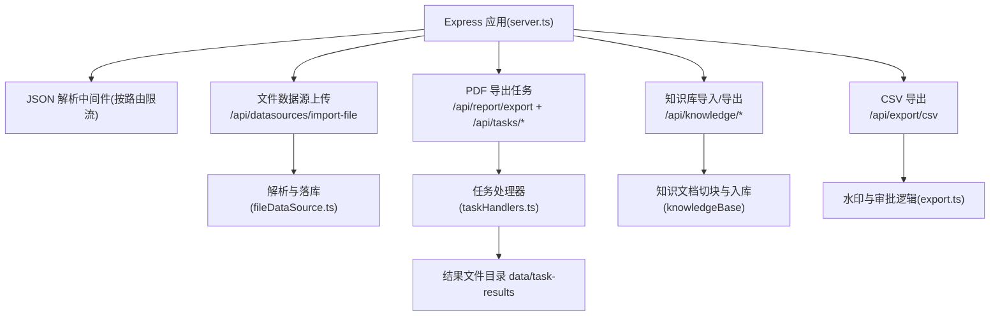
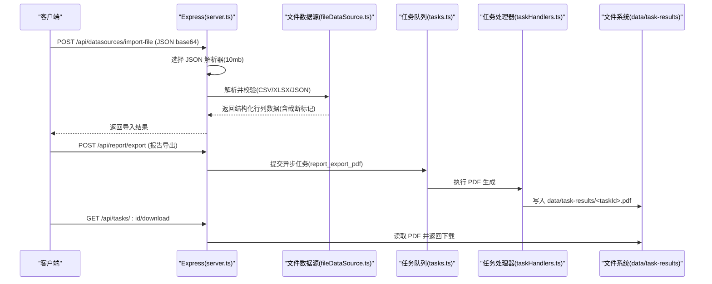
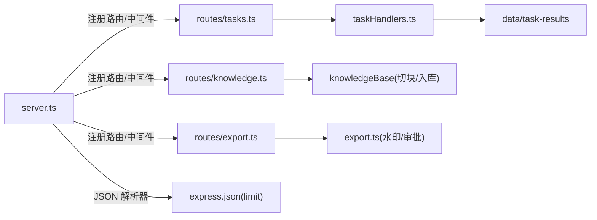

# 文件上传配置

<cite>
**本文引用的文件**
- [server.ts](file://server.ts)
- [server/query/fileDataSource.ts](file://server/query/fileDataSource.ts)
- [server/routes/tasks.ts](file://server/routes/tasks.ts)
- [server/taskHandlers.ts](file://server/taskHandlers.ts)
- [server/routes/knowledge.ts](file://server/routes/knowledge.ts)
- [server/routes/export.ts](file://server/routes/export.ts)
</cite>

## 目录
1. [简介](#简介)
2. [项目结构](#项目结构)
3. [核心组件](#核心组件)
4. [架构总览](#架构总览)
5. [详细组件分析](#详细组件分析)
6. [依赖关系分析](#依赖关系分析)
7. [性能与内存控制](#性能与内存控制)
8. [故障排查指南](#故障排查指南)
9. [结论](#结论)
10. [附录：配置清单](#附录：配置清单)

## 简介
本指南面向“智能问数据分析系统”的文件上传与导出能力，聚焦以下目标：
- 文件大小限制：JSON body 大小、文件上传大小、内存使用控制
- 临时目录管理：临时文件存储路径、清理策略、磁盘空间监控
- 存储路径映射：静态资源访问路径、导出文件存储位置、知识库文件管理
- 文件格式验证：允许类型、内容安全检查（敏感列过滤、格式校验）
- 大文件处理策略：分片上传、断点续传、进度跟踪（当前实现现状与建议）
- 备份与恢复：知识库导入/导出的机制与注意事项

## 项目结构
与文件上传/导出相关的关键模块分布如下：
- 服务器入口与全局 JSON 解析器：server.ts
- 文件数据源上传与落库：server/query/fileDataSource.ts
- 异步任务与 PDF 结果下载：server/routes/tasks.ts、server/taskHandlers.ts
- 知识库导入/导出：server/routes/knowledge.ts
- CSV 导出与审批：server/routes/export.ts

图表来源
- [server.ts:133-143](file://server.ts#L133-L143)
- [server/query/fileDataSource.ts:138-201](file://server/query/fileDataSource.ts#L138-L201)
- [server/routes/tasks.ts:27-85](file://server/routes/tasks.ts#L27-L85)
- [server/taskHandlers.ts:28-37,165-197:28-37](file://server/taskHandlers.ts#L28-L37)
- [server/routes/knowledge.ts:159-375](file://server/routes/knowledge.ts#L159-L375)
- [server/routes/export.ts:91-165](file://server/routes/export.ts#L91-L165)

章节来源
- [server.ts:133-143](file://server.ts#L133-L143)

## 核心组件
- 全局 JSON 解析器：为不同路由设置不同的 body 大小上限，避免大请求阻塞或内存溢出
- 文件数据源上传：支持 CSV/Excel/JSON，统一解析、安全化表头、敏感列剔除、行数/列数截断、批量写入物理表
- 异步 PDF 导出：长任务生成 PDF 并持久化到 data/task-results，提供下载端点
- 知识库导入/导出：以 JSON 备份形式迁移知识文档，支持冲突合并策略
- CSV 导出：带水印与阈值审批，防止超大导出

章节来源
- [server/query/fileDataSource.ts:20-27,138-201:20-27](file://server/query/fileDataSource.ts#L20-L27)
- [server/routes/tasks.ts:27-85](file://server/routes/tasks.ts#L27-L85)
- [server/taskHandlers.ts:28-37,165-197:28-37](file://server/taskHandlers.ts#L28-L37)
- [server/routes/knowledge.ts:159-375](file://server/routes/knowledge.ts#L159-L375)
- [server/routes/export.ts:21-31,91-165:21-31](file://server/routes/export.ts#L21-L31)

## 架构总览
下图展示从客户端发起上传/导出到服务端落盘与下载的完整链路。

图表来源
- [server.ts:133-143](file://server.ts#L133-L143)
- [server/query/fileDataSource.ts:138-201](file://server/query/fileDataSource.ts#L138-L201)
- [server/routes/tasks.ts:27-85](file://server/routes/tasks.ts#L27-L85)
- [server/taskHandlers.ts:28-37,165-197:28-37](file://server/taskHandlers.ts#L28-L37)

## 详细组件分析

### 文件大小限制与内存控制
- JSON body 大小限制
  - 默认路由：2MB
  - 特定路由放宽至 10MB：
    - 知识库导入：/api/knowledge/import
    - 文件数据源导入：/api/datasources/import-file
    - 报告导出：/api/report/export（由路由自带解析器处理）
- 文件上传大小限制
  - 文件数据源上传：最大约 7MB（base64 净荷经 10MB JSON 通道）
  - 行/列上限：最大行数 20000，最大列数 100；超出将截断并在响应中标注
- 内存使用控制
  - 通过 JSON 解析器限制与行/列上限控制内存峰值
  - 批量写入数据库（每批 500 行）降低单次内存占用
  - CSV 导出硬上限：默认 100000 行，可通过环境变量调整

章节来源
- [server.ts:133-143](file://server.ts#L133-L143)
- [server/query/fileDataSource.ts:20-27,126-136,183-201:20-27](file://server/query/fileDataSource.ts#L20-L27)
- [server/routes/export.ts:21-31](file://server/routes/export.ts#L21-L31)

### 临时目录管理与清理策略
- 临时文件存储路径
  - PDF 结果文件统一存放于项目根目录下的 data/task-results
  - 文件名基于 taskId（安全过滤后）+ .pdf
- 清理策略
  - 代码未内置定时清理；建议结合外部方案（如 cron 定期删除 N 天前文件）
  - 下载端点在文件不存在时返回 410，提示重新发起任务
- 磁盘空间监控
  - 建议在部署层对 data/task-results 所在分区进行容量告警
  - 可结合 Prometheus/Grafana 监控磁盘使用率

章节来源
- [server/taskHandlers.ts:28-37](file://server/taskHandlers.ts#L28-L37)
- [server/routes/tasks.ts:58-85](file://server/routes/tasks.ts#L58-L85)

### 存储路径映射
- 静态资源访问路径
  - 生产环境：dist 目录作为静态资源根目录
  - 开发环境：Vite 中间件提供静态资源
- 导出文件存储位置
  - PDF：data/task-results/<taskId>.pdf
  - CSV：直接流式返回，不落盘
  - 知识库导出：以 JSON 文件形式由浏览器下载
- 知识库文件管理
  - 导入：/api/knowledge/import（ADMIN），支持 skip/overwrite/append 合并策略
  - 导出：/api/knowledge/export?dataSourceId=xxx（ADMIN），输出包含还原后的原文与原始切块

章节来源
- [server.ts:282-296](file://server.ts#L282-L296)
- [server/taskHandlers.ts:28-37](file://server/taskHandlers.ts#L28-L37)
- [server/routes/knowledge.ts:159-224,237-375:159-224](file://server/routes/knowledge.ts#L159-L224)

### 文件格式验证与安全检查
- 允许的文件类型
  - 文件数据源：csv、xlsx、json
- 内容安全检查
  - 表头安全化：非法标识符/保留字替换为 fN 系列，原表头存入 description
  - 敏感列剔除：命中敏感词的正则整列剔除，不落库
  - JSON 结构校验：数组元素需一致（全对象或全二维数组）
  - Excel 单元格规整：富文本/超链接/公式取结果，日期转标准字符串
- 病毒扫描
  - 当前代码未集成病毒扫描；建议在网关或前置服务增加扫描环节

章节来源
- [server/query/fileDataSource.ts:20-27,73-99,138-181:20-27](file://server/query/fileDataSource.ts#L20-L27)

### 大文件处理策略
- 分片上传
  - 当前未实现分片上传；所有文件以 base64 在单个 JSON 请求中传输
  - 受限于 JSON body 上限（10MB），适合中小文件
- 断点续传
  - 当前未实现断点续传
- 进度跟踪
  - 报告导出采用异步任务，前端可通过 /api/tasks/:id 轮询状态
  - 文件类任务结果不内联二进制，提供 downloadUrl 供下载

章节来源
- [server/routes/tasks.ts:27-85](file://server/routes/tasks.ts#L27-L85)

### 文件备份与恢复机制
- 知识库备份与恢复
  - 导出：/api/knowledge/export?dataSourceId=xxx（ADMIN），输出 JSON 备份（含原文与切块）
  - 导入：/api/knowledge/import（ADMIN），支持 dryRun 预检与合并策略
- CSV 导出
  - 带水印的 CSV 流式返回，便于归档与审计
- PDF 导出
  - 异步任务完成后落盘，提供下载接口

章节来源
- [server/routes/knowledge.ts:159-224,237-375:159-224](file://server/routes/knowledge.ts#L159-L224)
- [server/routes/export.ts:91-165](file://server/routes/export.ts#L91-L165)
- [server/routes/tasks.ts:27-85](file://server/routes/tasks.ts#L27-L85)

## 依赖关系分析

图表来源
- [server.ts:133-143,224-265:133-143](file://server.ts#L133-L143)
- [server/routes/tasks.ts:27-85](file://server/routes/tasks.ts#L27-L85)
- [server/taskHandlers.ts:28-37,165-197:28-37](file://server/taskHandlers.ts#L28-L37)
- [server/routes/knowledge.ts:159-375](file://server/routes/knowledge.ts#L159-L375)
- [server/routes/export.ts:91-165](file://server/routes/export.ts#L91-L165)

章节来源
- [server.ts:133-143,224-265:133-143](file://server.ts#L133-L143)

## 性能与内存控制
- JSON 解析器分层限流：默认 2MB，关键接口放宽至 10MB，避免大请求拖垮服务
- 文件数据源：
  - 行/列上限截断，减少内存与数据库压力
  - 批量插入（每批 500 行），降低事务与锁竞争
- CSV 导出：
  - 硬上限 100000 行，防止内存溢出
  - 流式返回，避免一次性构建大字符串
- 建议优化：
  - 引入分片上传与断点续传，提升大文件稳定性
  - 对 data/task-results 实施生命周期管理（TTL 清理）
  - 增加磁盘空间监控与告警

[本节为通用指导，不直接分析具体文件]

## 故障排查指南
- 上传失败（JSON 过大）
  - 确认请求是否命中 10MB 放宽的路径（/api/knowledge/import、/api/datasources/import-file、/api/report/export）
  - 若仍失败，考虑拆分请求或改用分片上传
- 文件解析错误
  - CSV：确保非空且首行为表头
  - XLSX：确保存在工作表
  - JSON：确保数组元素类型一致
- 敏感列被剔除
  - 检查表头是否命中敏感词正则；如需保留，请调整表头命名
- PDF 下载 410
  - 结果文件已被清理，需重新发起任务
- CSV 导出被拦截
  - 超过阈值需要管理员审批；查看 /api/export/requests/mine 获取申请单号

章节来源
- [server/query/fileDataSource.ts:138-181](file://server/query/fileDataSource.ts#L138-L181)
- [server/routes/tasks.ts:58-85](file://server/routes/tasks.ts#L58-L85)
- [server/routes/export.ts:91-165](file://server/routes/export.ts#L91-L165)

## 结论
本系统在文件上传与导出方面提供了明确的边界与安全保障：
- 通过分层 JSON 解析器与行/列上限控制，有效保护内存与数据库
- 文件数据源上传具备完善的安全化处理与落库流程
- 异步 PDF 导出与下载链路清晰，便于追踪与审计
- 知识库导入/导出支持备份与恢复，满足迁移与合规需求
- 建议后续引入分片上传、断点续传与自动清理策略，进一步提升大文件处理能力与运维效率

[本节为总结性内容，不直接分析具体文件]

## 附录：配置清单
- JSON body 大小
  - 默认：2MB
  - 放宽至 10MB 的路径：/api/knowledge/import、/api/datasources/import-file、/api/report/export
- 文件数据源限制
  - 最大行数：20000
  - 最大列数：100
  - 最大文件体：约 7MB（base64 经 10MB JSON 通道）
- CSV 导出限制
  - 最大行数：默认 100000（可通过环境变量调整）
  - 审批阈值：默认 5000 行（可通过环境变量调整）
- 临时文件目录
  - 路径：data/task-results
  - 清理策略：建议外部定时清理（TTL）
- 知识库导入/导出
  - 导出：/api/knowledge/export?dataSourceId=xxx（ADMIN）
  - 导入：/api/knowledge/import（ADMIN），支持 mergeStrategy：skip/overwrite/append

章节来源
- [server.ts:133-143](file://server.ts#L133-L143)
- [server/query/fileDataSource.ts:20-27,126-136:20-27](file://server/query/fileDataSource.ts#L20-L27)
- [server/routes/export.ts:21-31](file://server/routes/export.ts#L21-L31)
- [server/taskHandlers.ts:28-37](file://server/taskHandlers.ts#L28-L37)
- [server/routes/knowledge.ts:159-224,237-375:159-224](file://server/routes/knowledge.ts#L159-L224)