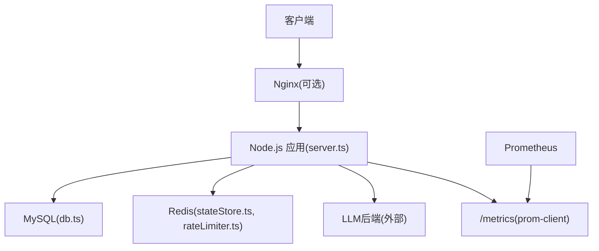
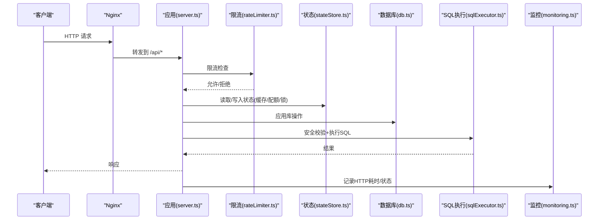
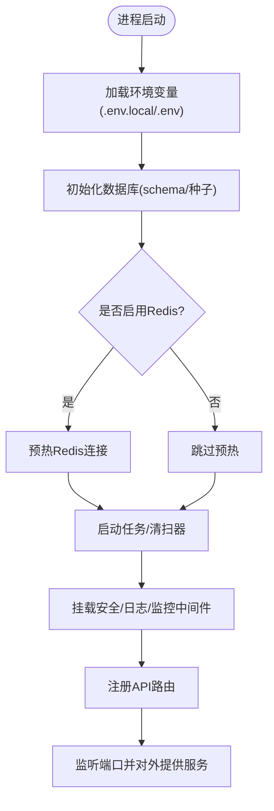
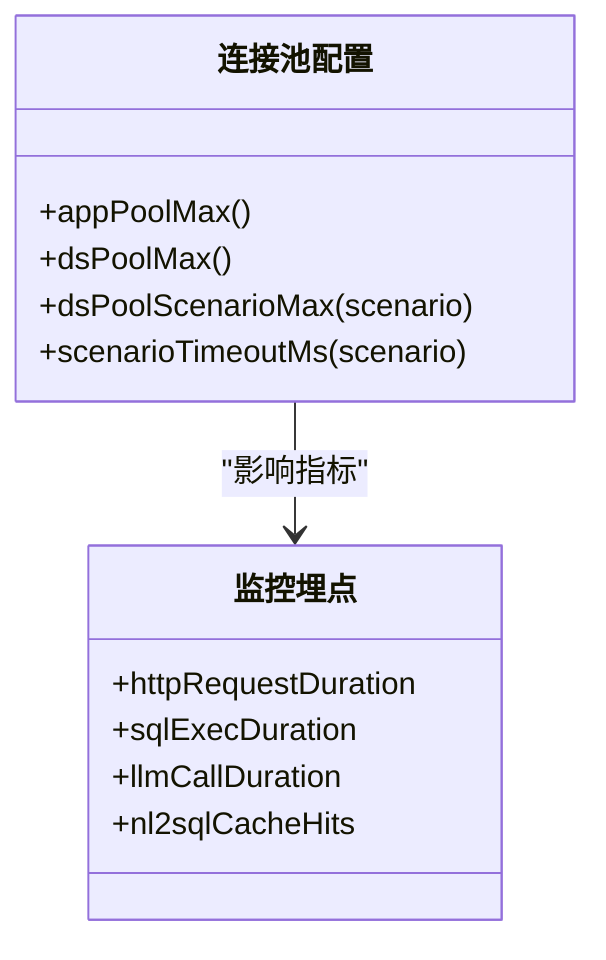
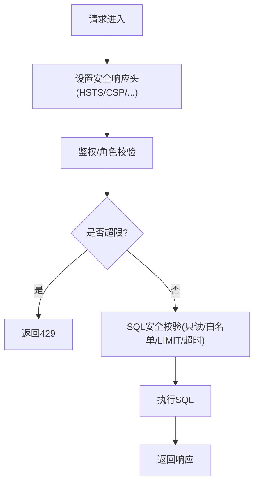
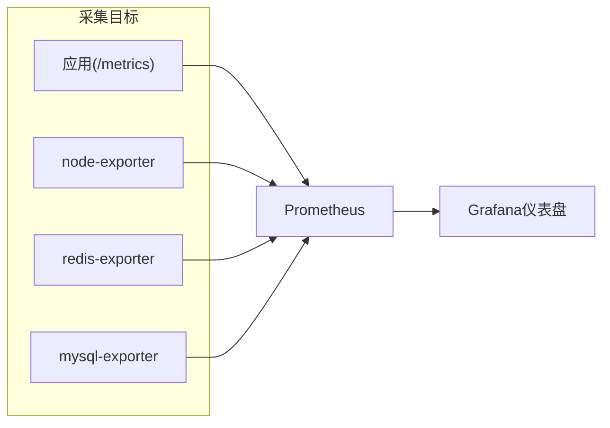
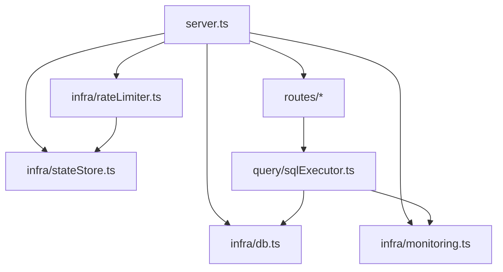

# 生产环境配置

<cite>
**本文引用的文件**
- [server.ts](file://server.ts)
- [package.json](file://package.json)
- [Dockerfile](file://Dockerfile)
- [start.sh](file://start.sh)
- [docker-compose.multi-instance.yml](file://docker-compose.multi-instance.yml)
- [deploy/prometheus.yml](file://deploy/prometheus.yml)
- [deploy/nginx.multi-instance.conf](file://deploy/nginx.multi-instance.conf)
- [server/infra/monitoring.ts](file://server/infra/monitoring.ts)
- [server/infra/rateLimiter.ts](file://server/infra/rateLimiter.ts)
- [server/infra/db.ts](file://server/infra/db.ts)
- [server/infra/stateStore.ts](file://server/infra/stateStore.ts)
- [server/infra/logger.ts](file://server/infra/logger.ts)
- [server/query/sqlExecutor.ts](file://server/query/sqlExecutor.ts)
</cite>

## 目录
1. [简介](#简介)
2. [项目结构](#项目结构)
3. [核心组件](#核心组件)
4. [架构总览](#架构总览)
5. [详细组件分析](#详细组件分析)
6. [依赖关系分析](#依赖关系分析)
7. [性能调优](#性能调优)
8. [故障排查指南](#故障排查指南)
9. [结论](#结论)
10. [附录](#附录)

## 简介
本指南面向生产环境部署与运维，覆盖进程管理、性能调优、安全加固、文件上传、监控集成、备份恢复与数据迁移等关键主题。内容基于仓库内实际实现与配置，确保可落地、可验证。

## 项目结构
- 应用入口与中间件：Express 服务在 server.ts 中启动，加载环境变量、初始化数据库、注册路由与安全中间件、暴露 /metrics 与 /api/health。
- 构建与运行：通过 package.json 的 build/start 脚本生成 dist/server.cjs；Dockerfile 提供多阶段构建与非 root 运行；start.sh 提供本地一键启动（含依赖检查与健康就绪）。
- 多实例编排：docker-compose.multi-instance.yml 演示无状态副本 + Redis 共享状态 + Nginx 负载均衡；deploy/nginx.multi-instance.conf 针对 SSE 长连接优化代理参数。
- 监控与告警：prom-client 指标在 server/infra/monitoring.ts 定义，Prometheus 抓取配置在 deploy/prometheus.yml。
- 限流与状态：rateLimiter.ts 提供 IP 级限流（内存或 Redis）；stateStore.ts 抽象进程/分布式状态存储（Memory/Redis）。
- 数据库与连接池：db.ts 负责 MySQL 连接池与应用库初始化；sqlExecutor.ts 负责 SQL 安全执行与场景化连接池配额。

图表来源
- [server.ts:82-193](file://server.ts#L82-L193)
- [deploy/nginx.multi-instance.conf:1-35](file://deploy/nginx.multi-instance.conf#L1-L35)
- [deploy/prometheus.yml:1-57](file://deploy/prometheus.yml#L1-L57)
- [server/infra/stateStore.ts:165-219](file://server/infra/stateStore.ts#L165-L219)
- [server/infra/rateLimiter.ts:1-54](file://server/infra/rateLimiter.ts#L1-L54)
- [server/infra/db.ts:47-70](file://server/infra/db.ts#L47-L70)

章节来源
- [server.ts:82-193](file://server.ts#L82-L193)
- [package.json:6-24](file://package.json#L6-L24)
- [Dockerfile:18-47](file://Dockerfile#L18-L47)
- [start.sh:40-138](file://start.sh#L40-L138)
- [docker-compose.multi-instance.yml:1-50](file://docker-compose.multi-instance.yml#L1-L50)
- [deploy/nginx.multi-instance.conf:1-35](file://deploy/nginx.multi-instance.conf#L1-L35)
- [deploy/prometheus.yml:1-57](file://deploy/prometheus.yml#L1-L57)

## 核心组件
- 进程管理与启动
  - 环境变量加载顺序：.env.local > .env > 进程环境变量；生产模式判定与 HOST/PORT 默认值。
  - 健康检查：/api/health 用于容器与健康探针；/metrics 暴露 prom-client 指标。
  - 启动预热：Redis 连接预热、中间表清理、任务队列 worker、SSE 重放缓冲清扫、漂移检测清扫。
- 安全基线
  - 生产环境强制 JWT_SECRET，缺失则拒绝启动。
  - 响应头安全策略（HSTS、CSP、X-Frame-Options、Referrer-Policy）。
  - 请求体大小限制按路径差异化设置。
- 限流与状态外置
  - 内存滑动窗口或 Redis 固定分钟窗口限流；支持 RATE_LIMIT_MAX 调整。
  - StateStore 抽象 Memory/Redis，支持 TTL、原子计数、分布式锁。
- 数据库与连接池
  - 应用库连接池容量公式化（APP_POOL_MAX 或 EXPECTED_CONCURRENT_USERS 推导）。
  - 数据源连接池按场景分级（interactive/chain/export），独立超时与配额。
- 监控与日志
  - 统一 logger 封装，LOG_LEVEL 控制输出级别。
  - prom-client 埋点：HTTP 耗时、SQL 执行耗时、LLM 调用耗时/token、缓存命中、审计计数。

章节来源
- [server.ts:12-19](file://server.ts#L12-L19)
- [server.ts:82-193](file://server.ts#L82-L193)
- [server/infra/rateLimiter.ts:1-54](file://server/infra/rateLimiter.ts#L1-L54)
- [server/infra/stateStore.ts:165-219](file://server/infra/stateStore.ts#L165-L219)
- [server/infra/db.ts:35-70](file://server/infra/db.ts#L35-L70)
- [server/query/sqlExecutor.ts:51-109](file://server/query/sqlExecutor.ts#L51-L109)
- [server/infra/logger.ts:1-41](file://server/infra/logger.ts#L1-L41)
- [server/infra/monitoring.ts:1-153](file://server/infra/monitoring.ts#L1-L153)

## 架构总览
下图展示生产环境下典型请求链路：Nginx 将流量转发至 Node 应用，应用经安全中间件、鉴权、限流后进入业务路由；SQL 执行走安全层；指标通过 /metrics 暴露给 Prometheus。

图表来源
- [server.ts:133-193](file://server.ts#L133-L193)
- [server/infra/rateLimiter.ts:14-42](file://server/infra/rateLimiter.ts#L14-L42)
- [server/infra/stateStore.ts:165-219](file://server/infra/stateStore.ts#L165-L219)
- [server/infra/db.ts:47-70](file://server/infra/db.ts#L47-L70)
- [server/query/sqlExecutor.ts:51-109](file://server/query/sqlExecutor.ts#L51-L109)
- [server/infra/monitoring.ts:80-88](file://server/infra/monitoring.ts#L80-L88)

## 详细组件分析

### 进程管理与服务管理
- PM2/systemd 建议
  - 使用系统服务管理器（systemd）或 PM2 托管 node dist/server.cjs，设置自动重启、崩溃退出重启、开机自启。
  - 环境变量集中注入（JWT_SECRET、MYSQL_*、REDIS_URL、RATE_LIMIT_MAX、LOG_LEVEL、METRICS_TOKEN 等）。
  - 日志轮转：结合系统日志工具（如 journald、logrotate）对标准输出进行轮转；避免单文件无限增长。
- 健康与就绪
  - /api/health 返回 200 表示服务可用；/metrics 供 Prometheus 抓取。
  - Docker HEALTHCHECK 已内置，指向 /api/health。
- 启动流程要点
  - 加载 .env.local/.env；生产模式判断；数据库 schema 初始化；Redis 预热；定时任务与清扫器启动；中间件与路由挂载；监听端口。

图表来源
- [server.ts:12-19](file://server.ts#L12-L19)
- [server.ts:82-131](file://server.ts#L82-L131)
- [server.ts:133-193](file://server.ts#L133-L193)
- [Dockerfile:42-47](file://Dockerfile#L42-L47)

章节来源
- [server.ts:12-19](file://server.ts#L12-L19)
- [server.ts:82-193](file://server.ts#L82-L193)
- [Dockerfile:18-47](file://Dockerfile#L18-L47)
- [start.sh:40-138](file://start.sh#L40-L138)

### 性能调优参数
- Node.js 内存限制
  - 根据负载与堆大小设置 --max-old-space-size；结合 Prometheus 的进程指标观察 GC 行为与堆使用趋势。
- 连接池大小
  - 应用库：appPoolMax() 由 APP_POOL_MAX 或 EXPECTED_CONCURRENT_USERS 推导，上限 50。
  - 数据源连接池：dsPoolMax() 由 DS_POOL_MAX 或 EXPECTED_CONCURRENT_USERS 推导，上限 20；可按场景拆分 DS_POOL_INTERACTIVE/CHAIN/EXPORT。
- 查询超时
  - 场景化超时：scenarioTimeoutMs() 默认 interactive=15s、chain=120s、export=60s；可通过 QUERY_TIMEOUT_*_MS 覆盖。
- 缓存策略
  - 问数缓存（l1/l2）与语义缓存命中通过 monitoring.ts 埋点观测；Redis 作为外置缓存时具备 TTL 与原子计数能力。
- 限流阈值
  - RATE_LIMIT_MAX 控制每分钟每 IP 最大请求数；Redis 模式为固定分钟窗口 INCR。

图表来源
- [server/infra/db.ts:35-70](file://server/infra/db.ts#L35-L70)
- [server/query/sqlExecutor.ts:51-109](file://server/query/sqlExecutor.ts#L51-L109)
- [server/infra/monitoring.ts:21-88](file://server/infra/monitoring.ts#L21-L88)

章节来源
- [server/infra/db.ts:35-70](file://server/infra/db.ts#L35-L70)
- [server/query/sqlExecutor.ts:51-109](file://server/query/sqlExecutor.ts#L51-L109)
- [server/infra/rateLimiter.ts:1-54](file://server/infra/rateLimiter.ts#L1-L54)
- [server/infra/monitoring.ts:21-88](file://server/infra/monitoring.ts#L21-L88)

### 安全加固措施
- HTTPS 与反向代理
  - 建议在 Nginx 终止 TLS，应用仅处理 HTTP；Nginx 配置需开启 HSTS 并正确转发 Host/X-Real-IP/X-Forwarded-For。
- CORS 与 CSP
  - 应用已设置严格的安全响应头（HSTS、CSP、X-Frame-Options、Referrer-Policy）；生产环境 CSP 更严格。
- 请求限流
  - 基于 IP 的滑动窗口（内存）或固定分钟窗口（Redis），超过 RATE_LIMIT_MAX 返回 429。
- SQL 注入防护
  - 安全执行层仅允许 SELECT 开头，白名单表名、敏感列过滤、强制 LIMIT、执行超时、结果行数截断；危险关键字拦截。
- 密钥与认证
  - 生产环境必须设置 JWT_SECRET；管理员默认账号首次登录强制改密；数据源凭据加密落库。

图表来源
- [server.ts:145-167](file://server.ts#L145-L167)
- [server/infra/rateLimiter.ts:14-42](file://server/infra/rateLimiter.ts#L14-L42)
- [server/query/sqlExecutor.ts:155-163](file://server/query/sqlExecutor.ts#L155-L163)
- [server/query/sqlExecutor.ts:51-109](file://server/query/sqlExecutor.ts#L51-L109)

章节来源
- [server.ts:145-167](file://server.ts#L145-L167)
- [server/infra/rateLimiter.ts:1-54](file://server/infra/rateLimiter.ts#L1-L54)
- [server/query/sqlExecutor.ts:155-163](file://server/query/sqlExecutor.ts#L155-L163)
- [server/query/sqlExecutor.ts:51-109](file://server/query/sqlExecutor.ts#L51-L109)

### 文件上传配置
- 请求体大小限制
  - 默认 JSON body 限制 2MB；特定接口放宽至 10MB（知识库导入、文件数据源导入）；报告导出接口保持宽松以支持大 base64 图表。
- 临时目录与存储路径映射
  - 当前代码未显式配置文件系统上传目录；如需扩展，应在路由层增加文件解析与磁盘落盘逻辑，并通过环境变量配置临时目录与最终存储路径映射。
- 安全建议
  - 限制 MIME 类型与文件大小；扫描恶意文件；对上传内容进行病毒扫描；对下载/导出增加审批与水印（已有 DLP 导出通道）。

章节来源
- [server.ts:133-143](file://server.ts#L133-L143)

### 监控集成配置
- Prometheus 抓取
  - 应用 /metrics 暴露指标；Prometheus 抓取 job 包括 nl2sql-app、node-exporter、redis-exporter、mysql-exporter、alertmanager。
- 指标维度
  - HTTP 接口耗时（method/route/status）、SQL 执行耗时（result）、LLM 调用耗时（channel/engine/model/ok）、缓存命中（layer）、审计计数（status/endpoint）。
- 访问保护
  - /metrics 可通过 METRICS_TOKEN 进行 Bearer Token 或 query token 保护。
- Grafana 仪表盘
  - 仓库提供多个仪表盘 JSON（nl2sql-overview/infra/llm/business），配合 Prometheus 数据源可视化。

图表来源
- [deploy/prometheus.yml:1-57](file://deploy/prometheus.yml#L1-L57)
- [server/infra/monitoring.ts:135-153](file://server/infra/monitoring.ts#L135-L153)

章节来源
- [deploy/prometheus.yml:1-57](file://deploy/prometheus.yml#L1-L57)
- [server/infra/monitoring.ts:1-153](file://server/infra/monitoring.ts#L1-L153)

### 备份恢复策略与数据迁移方案
- 备份范围
  - 应用库 MySQL（users、data_sources、query_audit_log、knowledge_base*、skill_library、sql_examples、report_templates、query_reports、saved_reports、dashboard_widgets、flex_queries、metric_definitions、iron_rules、expert_personas、llm_usage、external_kb_sources、kb_drift_* 等）。
  - 若启用 Redis，建议定期快照或持久化 AOF/RDB（compose 示例关闭了持久化，生产应开启）。
- 恢复流程
  - 停止写入 → 导出 mysqldump → 在新库恢复 → 校验关键表计数与索引 → 启动应用并预热 Redis → 验证 /api/health 与 /metrics。
- 数据迁移
  - 应用启动时自动建库建表与幂等迁移（ALTER TABLE 捕获重复字段错误）；新增字段/表均具备幂等性，升级无需人工干预。
  - 对于历史数据迁移（如明文密码加密、样例入库），已在 initSchema 中实现一次性迁移逻辑。

章节来源
- [server/infra/db.ts:52-800](file://server/infra/db.ts#L52-L800)
- [docker-compose.multi-instance.yml:8-13](file://docker-compose.multi-instance.yml#L8-L13)

## 依赖关系分析
- 组件耦合
  - server.ts 聚合所有路由与中间件，依赖 infra 模块（db、stateStore、logger、monitoring、rateLimiter）与业务模块（auth、llm、query、report、routes）。
  - sqlExecutor.ts 依赖 db.ts 获取连接池，依赖 monitoring.ts 打点，依赖 secretsCrypto.ts 解密凭据。
  - stateStore.ts 抽象 Redis/Memory，被 rateLimiter、taskQueue、其他缓存/配额逻辑复用。
- 外部依赖
  - MySQL/PostgreSQL/Greenplum 数据源；Redis（可选）；Ollama/Gemini 等 LLM 后端；Prometheus/Grafana。
- 潜在循环依赖
  - 通过 infra 层解耦（db、stateStore、logger、monitoring）避免业务模块直接互相引用。

图表来源
- [server.ts:21-64](file://server.ts#L21-L64)
- [server/query/sqlExecutor.ts:11-20](file://server/query/sqlExecutor.ts#L11-L20)
- [server/infra/rateLimiter.ts:1-7](file://server/infra/rateLimiter.ts#L1-L7)

章节来源
- [server.ts:21-64](file://server.ts#L21-L64)
- [server/query/sqlExecutor.ts:11-20](file://server/query/sqlExecutor.ts#L11-L20)
- [server/infra/rateLimiter.ts:1-7](file://server/infra/rateLimiter.ts#L1-L7)

## 性能调优
- 进程与运行时
  - 合理设置 Node.js 堆大小与 GC 参数；使用 systemd/PM2 管理进程生命周期与自动重启。
- 连接池与超时
  - 依据 EXPECTED_CONCURRENT_USERS 计算 APP_POOL_MAX 与 DS_POOL_MAX；按场景拆分 DS_POOL_INTERACTIVE/CHAIN/EXPORT；按需调整 QUERY_TIMEOUT_*_MS。
- 缓存与限流
  - 启用 Redis 外置状态存储，提升命中率与跨实例一致性；调节 RATE_LIMIT_MAX 平衡吞吐与资源占用。
- 监控驱动优化
  - 基于 /metrics 观察 HTTP 耗时直方图、SQL 执行耗时、LLM 调用耗时与 token 消耗，定位瓶颈并迭代配置。

[本节为通用指导，不直接分析具体文件]

## 故障排查指南
- 启动失败
  - 检查 JWT_SECRET 是否设置（生产必需）；确认 MySQL/Redis 可达；查看 /api/health 与日志。
- 限流触发
  - 检查 RATE_LIMIT_MAX 与 Redis 连通性；内存模式下注意清理过期条目。
- SQL 执行异常
  - 关注 SQL 安全校验失败原因（危险关键字、非 SELECT、超表白名单）；检查场景超时与连接池配额。
- 监控不可用
  - 检查 METRICS_TOKEN 配置与权限；确认 Prometheus 抓取目标可达。
- 日志级别
  - 通过 LOG_LEVEL 调整输出级别；测试环境默认静默 warn/info，仅 error 输出。

章节来源
- [server.ts:91-96](file://server.ts#L91-L96)
- [server/infra/rateLimiter.ts:14-42](file://server/infra/rateLimiter.ts#L14-L42)
- [server/query/sqlExecutor.ts:155-163](file://server/query/sqlExecutor.ts#L155-L163)
- [server/infra/monitoring.ts:135-153](file://server/infra/monitoring.ts#L135-L153)
- [server/infra/logger.ts:12-25](file://server/infra/logger.ts#L12-L25)

## 结论
本指南基于仓库实际实现，提供了生产环境的进程管理、性能调优、安全加固、监控集成与备份恢复的可操作方案。建议在生产前完成以下动作：
- 配置必要的环境变量（JWT_SECRET、MYSQL_*、REDIS_URL、RATE_LIMIT_MAX、LOG_LEVEL、METRICS_TOKEN）。
- 使用 Nginx 终止 TLS 并优化 SSE 长连接代理参数。
- 启用 Redis 外置状态存储以提升多实例一致性与限流准确性。
- 配置 Prometheus/Grafana 监控与告警，持续观察关键指标。
- 制定 MySQL/Redis 备份与恢复流程，并验证幂等迁移。

[本节为总结，不直接分析具体文件]

## 附录
- 常用环境变量清单（来自各模块惰性读取与环境默认值）
  - 应用：HOST、PORT、NODE_ENV、JWT_SECRET、ADMIN_USERNAME、ADMIN_PASSWORD
  - 数据库：MYSQL_HOST、MYSQL_PORT、MYSQL_USER、MYSQL_PASSWORD、MYSQL_DATABASE、APP_POOL_MAX、EXPECTED_CONCURRENT_USERS
  - 数据源连接：DS_POOL_MAX、DS_POOL_INTERACTIVE、DS_POOL_CHAIN、DS_POOL_EXPORT、QUERY_TIMEOUT_INTERACTIVE_MS、QUERY_TIMEOUT_CHAIN_MS、QUERY_TIMEOUT_EXPORT_MS
  - 缓存与限流：REDIS_URL、RATE_LIMIT_MAX
  - 监控：METRICS_TOKEN、LOG_LEVEL
  - LLM：OLLAMA_URL、LLM_MODEL、EMBED_MODEL

章节来源
- [server.ts:82-96](file://server.ts#L82-L96)
- [server/infra/db.ts:16-27](file://server/infra/db.ts#L16-L27)
- [server/query/sqlExecutor.ts:51-109](file://server/query/sqlExecutor.ts#L51-L109)
- [server/infra/rateLimiter.ts:9-12](file://server/infra/rateLimiter.ts#L9-L12)
- [server/infra/stateStore.ts:165-219](file://server/infra/stateStore.ts#L165-L219)
- [server/infra/logger.ts:12-25](file://server/infra/logger.ts#L12-L25)
- [server/infra/monitoring.ts:135-153](file://server/infra/monitoring.ts#L135-L153)